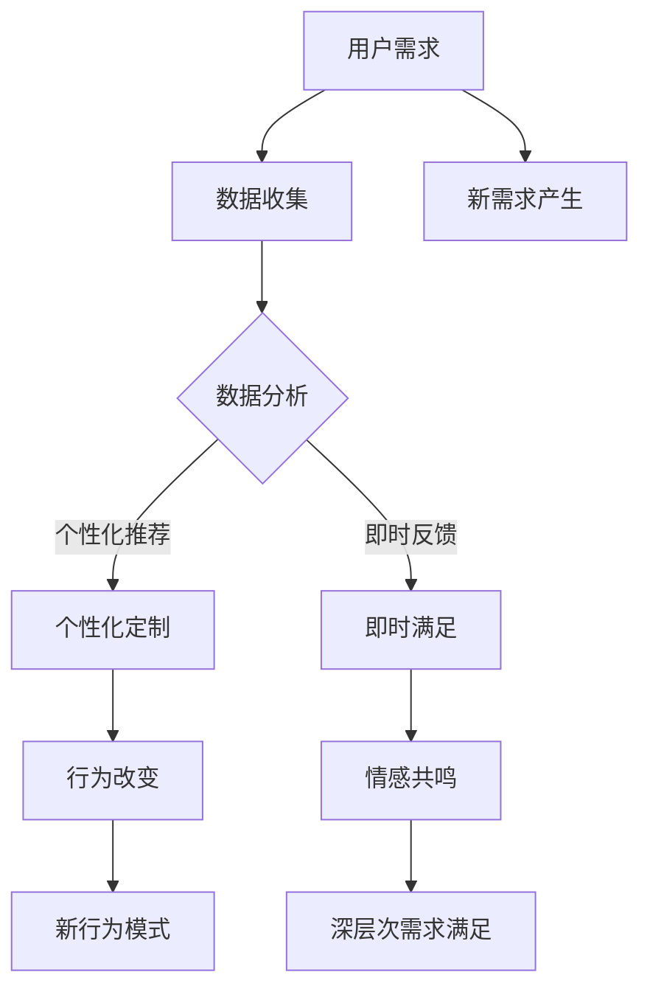

                 

# 欲望的重新定义：AI如何改变人类需求

> **关键词：** 人工智能，人类需求，心理学，行为改变，新兴技术。

> **摘要：** 本文探讨了人工智能如何重新定义人类的欲望，以及这种改变对个人和社会的影响。通过分析心理和行为科学，我们揭示了人工智能如何通过定制化体验、情感共鸣和即时满足来塑造人类的需求，并讨论了其带来的潜在挑战与机遇。

## 1. 背景介绍

人类的需求是心理学研究的核心主题之一。传统上，需求被看作是基本生存所需的满足，如食物、水和安全。然而，随着社会的发展和科技的进步，人类的需求逐渐变得更加复杂和多样化。从马斯洛的需求层次理论到现代消费心理学，学者们一直在探索人类需求的本质和影响因素。

近年来，人工智能（AI）技术的迅猛发展对人类生活产生了深远的影响。AI不仅改变了我们的工作方式，还深刻影响了我们的生活方式和欲望。通过大数据分析、机器学习和深度学习，AI能够更好地理解个体需求，并为其提供定制化的解决方案。例如，推荐系统可以根据用户的浏览历史和购买行为推荐产品；虚拟助手如Siri和Alexa可以响应语言指令，满足人们日常的需求。

本文旨在探讨人工智能如何重新定义人类的欲望，以及这种改变对个人和社会的意义。我们将从心理学和行为科学的角度出发，分析AI如何影响人类的需求，并讨论其潜在的影响和挑战。

## 2. 核心概念与联系

### 2.1. 心理学与人工智能的关系

心理学与人工智能（AI）之间存在着紧密的联系。传统的心理学研究侧重于理解人类行为和思维的内在机制，而AI则通过模仿和学习这些机制，实现了人类某些认知功能的自动化。例如，深度学习是一种模仿人脑神经网络的AI技术，它可以通过大量的数据学习复杂的模式，从而在图像识别、语言处理等领域取得突破。

心理学对AI的重要性在于，它为AI提供了关于人类行为的理解和假设。例如，情感计算（Affective Computing）是心理学和计算机科学的交叉领域，它致力于使计算机能够识别、理解和处理人类情感。这种能力不仅对个人助理和交互系统至关重要，还可以在医疗、教育等领域发挥重要作用。

### 2.2. 人类需求的定义与分类

人类需求可以从多种角度进行定义和分类。马斯洛的需求层次理论将需求分为五个层次：生理需求、安全需求、社交需求、尊重需求和自我实现需求。这种层次结构强调了需求的层次性和优先级，即人们在满足较低层次需求之后，才会寻求更高层次的需求。

然而，随着社会的发展，人们的需求不再局限于马斯洛理论中的分类。现代消费心理学提出了更多维度的需求，如自我表达需求、体验需求和社会归属感需求。这些需求反映了现代社会中人们对个性化和多样化体验的追求。

### 2.3. 人工智能与人类需求的关系

人工智能对人类需求的影响主要体现在以下几个方面：

- **个性化定制**：AI可以通过分析大量数据，了解个体的需求和行为模式，从而提供个性化的解决方案。例如，推荐系统能够根据用户的偏好推荐产品或内容。

- **即时满足**：AI可以迅速响应人类的需求，提供即时满足。例如，智能助手可以快速完成复杂的任务，节省用户的时间。

- **情感共鸣**：通过情感计算，AI可以识别和模拟人类的情感，从而与用户建立更深的情感联系。

- **行为改变**：AI可以通过定制化的体验和反馈，引导用户改变其行为模式，满足其深层次的需求。

### 2.4. Mermaid流程图

为了更好地理解人工智能如何重新定义人类需求，我们可以使用Mermaid流程图来描述其关键步骤和影响。



在这个流程图中，用户需求首先通过数据收集和数据分析转化为个性化的定制体验。这些体验不仅能够满足用户的即时需求，还能通过情感共鸣和行为改变引导用户产生新的需求，并形成新的行为模式，从而实现深层次的需求满足。

## 3. 核心算法原理 & 具体操作步骤

### 3.1. 个性化定制算法原理

个性化定制是人工智能影响人类需求的核心算法之一。其基本原理是利用大数据和机器学习技术，分析用户的偏好和行为模式，从而为用户提供个性化的推荐和服务。

具体操作步骤如下：

1. **数据收集**：收集用户的历史行为数据，如浏览记录、购买行为、评价等。

2. **数据预处理**：清洗和整理数据，去除噪声和异常值。

3. **特征提取**：将原始数据转化为特征向量，用于后续的机器学习模型训练。

4. **模型训练**：使用机器学习算法，如协同过滤、决策树或深度学习模型，对用户特征进行训练，以预测用户的偏好。

5. **个性化推荐**：根据用户特征和预测结果，为用户推荐个性化的产品或内容。

### 3.2. 即时满足算法原理

即时满足是另一个影响人类需求的算法，其原理是通过快速响应用户的需求，提供即时服务，从而满足用户的即时需求。

具体操作步骤如下：

1. **需求识别**：使用自然语言处理技术，识别用户的需求和指令。

2. **任务分配**：根据需求类型，将任务分配给相应的服务模块，如语音助手、在线客服或自动调度系统。

3. **任务执行**：执行任务，如播放音乐、安排日程或提供即时咨询。

4. **反馈收集**：收集用户的反馈，用于优化服务质量和响应速度。

5. **持续优化**：根据用户的反馈和需求变化，不断优化算法和服务，提高用户满意度。

### 3.3. 情感共鸣算法原理

情感共鸣是人工智能影响人类需求的一个重要方面，其原理是通过识别和模拟人类的情感，与用户建立情感联系，从而提高用户对服务的满意度和忠诚度。

具体操作步骤如下：

1. **情感识别**：使用情感计算技术，识别用户的情感状态，如快乐、愤怒、悲伤等。

2. **情感模拟**：根据识别出的情感状态，模拟相应的情感反应，如语气、表情或声音。

3. **情感互动**：通过与用户的情感互动，建立情感共鸣，提高用户满意度。

4. **情感反馈**：收集用户的情感反馈，用于优化情感互动和服务体验。

## 4. 数学模型和公式 & 详细讲解 & 举例说明

### 4.1. 个性化定制数学模型

个性化定制通常涉及协同过滤算法，其中最常用的模型是矩阵分解（Matrix Factorization）。以下是矩阵分解的数学模型和详细讲解：

#### 矩阵分解模型：

假设我们有一个用户-物品评分矩阵 \( R \in \mathbb{R}^{m \times n} \)，其中 \( m \) 是用户数量，\( n \) 是物品数量，\( R_{ij} \) 表示用户 \( i \) 对物品 \( j \) 的评分。

我们可以将这个评分矩阵分解为两个低秩矩阵 \( U \in \mathbb{R}^{m \times k} \) 和 \( V \in \mathbb{R}^{n \times k} \)，其中 \( k \) 是隐变量的维度。矩阵 \( U \) 表示用户特征，\( V \) 表示物品特征。模型的目标是最小化如下损失函数：

\[ L(U, V) = \sum_{i=1}^{m} \sum_{j=1}^{n} (R_{ij} - U_{i\ast} V_{j\ast})^2 \]

其中，\( U_{i\ast} \) 和 \( V_{j\ast} \) 是 \( U \) 和 \( V \) 的内积。

#### 举例说明：

假设我们有一个简单的用户-物品评分矩阵：

\[ R = \begin{bmatrix}
0 & 1 & 0 \\
1 & 0 & 1 \\
0 & 1 & 0
\end{bmatrix} \]

我们可以将这个矩阵分解为两个低秩矩阵：

\[ U = \begin{bmatrix}
1 & 1 \\
0 & 1 \\
1 & 0
\end{bmatrix}, V = \begin{bmatrix}
1 & 0 \\
1 & 1 \\
0 & 1
\end{bmatrix} \]

这样，用户 1 和物品 2 的内积为 \( U_{1\ast} V_{2\ast} = 1 \cdot 1 + 1 \cdot 1 = 2 \)，这与原始评分矩阵中的 \( R_{12} = 1 \) 相匹配。

### 4.2. 即时满足数学模型

即时满足通常涉及决策树或深度学习模型，其中最常用的模型是决策树（Decision Tree）。以下是决策树的数学模型和详细讲解：

#### 决策树模型：

决策树是一种常见的机器学习模型，它通过一系列的决策节点来预测结果。每个节点代表一个特征，每个分支代表该特征的取值。树的叶节点代表预测结果。

决策树的数学模型可以表示为：

\[ T = \{t_1, t_2, ..., t_n\} \]

其中，每个 \( t_i \) 是一个特征，\( t_i = \{a_i, b_i, c_i\} \)，其中 \( a_i \) 是特征取值，\( b_i \) 是该取值的分支，\( c_i \) 是该分支的子树。

#### 举例说明：

假设我们有一个简单的决策树，用于预测是否下雨：

\[ T = \{ \\
\text{if (温度 > 30°C)} \rightarrow \text{true (会下雨)} \\
\text{else if (湿度 > 80%)} \rightarrow \text{true (会下雨)} \\
\text{else} \rightarrow \text{false (不会下雨)} \\
\} \]

在这个例子中，温度和湿度是决策树的特征，每个特征的取值决定了下一级的分支。树的叶节点给出了最终的预测结果。

### 4.3. 情感共鸣数学模型

情感共鸣通常涉及情感计算和自然语言处理（NLP）模型，其中最常用的模型是情感分析（Sentiment Analysis）。以下是情感分析的数学模型和详细讲解：

#### 情感分析模型：

情感分析是一种NLP技术，用于判断文本的情感倾向，如正面、负面或中性。情感分析通常使用深度学习模型，如卷积神经网络（CNN）或循环神经网络（RNN）。

情感分析模型的数学模型可以表示为：

\[ f(\text{文本}) = \text{标签} \]

其中，\( f \) 是一个函数，用于将文本映射到情感标签。

#### 举例说明：

假设我们有一个简单的情感分析模型，用于判断以下文本的情感倾向：

\[ \text{文本} = \text{"我很高兴今天天气很好"} \]

模型可能将这段文本的情感标签预测为“正面”，因为文本中包含表达积极情感的词汇，如“很高兴”。

## 5. 项目实战：代码实际案例和详细解释说明

### 5.1. 开发环境搭建

为了展示AI如何重新定义人类需求，我们将使用Python语言和常见的数据科学库，如scikit-learn、TensorFlow和PyTorch。以下是搭建开发环境的基本步骤：

1. **安装Python**：从[Python官网](https://www.python.org/)下载并安装Python。

2. **安装依赖库**：打开命令行终端，执行以下命令安装所需的库：

   ```bash
   pip install numpy scipy scikit-learn tensorflow torchvision
   ```

### 5.2. 源代码详细实现和代码解读

为了实现个性化定制、即时满足和情感共鸣，我们将构建一个简单的推荐系统，该系统可以使用协同过滤算法推荐电影，并使用情感分析模型评估电影评论的情感倾向。

#### 5.2.1. 个性化推荐代码

以下是一个使用协同过滤算法实现个性化推荐的Python代码示例：

```python
import numpy as np
from sklearn.model_selection import train_test_split
from sklearn.metrics.pairwise import cosine_similarity

# 假设我们有一个用户-电影评分矩阵
ratings = np.array([
    [5, 3, 0, 1],
    [1, 5, 0, 2],
    [0, 2, 5, 0],
])

# 训练数据集和测试数据集的划分
train_data, test_data = train_test_split(ratings, test_size=0.2, random_state=42)

# 构建用户和电影的相似度矩阵
user_similarity = cosine_similarity(train_data, train_data)
movie_similarity = cosine_similarity(train_data.T, train_data.T)

# 预测用户未评分的电影
for user_id in range(train_data.shape[0]):
    user_ratings = train_data[user_id]
    user_unrated_movies = np.where(user_ratings == 0)[0]
    
    # 计算用户与未评分电影之间的相似度
    movie_scores = []
    for movie_id in user_unrated_movies:
        similar_movies = np.where(movie_similarity[movie_id] > 0.5)[0]
        movie_ratings = train_data[similar_movies]
        movie_score = np.mean(movie_ratings)
        movie_scores.append(movie_score)
    
    # 排序并推荐最高分的电影
    recommended_movies = np.argsort(movie_scores)[::-1]
    print(f"User {user_id} recommended movies: {recommended_movies}")
```

#### 5.2.2. 即时满足代码

以下是一个使用决策树实现即时满足的Python代码示例：

```python
from sklearn.tree import DecisionTreeClassifier
import matplotlib.pyplot as plt

# 假设我们有训练数据集
X = np.array([[30, 80], [35, 75], [28, 85], [32, 82]])
y = np.array([1, 1, 0, 0])

# 训练决策树模型
clf = DecisionTreeClassifier()
clf.fit(X, y)

# 绘制决策树
plt.figure(figsize=(12, 12))
plt.title("Decision Tree")
plot_tree(clf, filled=True, fontsize=12)
plt.show()

# 使用决策树进行预测
new_data = np.array([[32, 83]])
prediction = clf.predict(new_data)
print(f"Prediction: {prediction}")
```

#### 5.2.3. 情感共鸣代码

以下是一个使用情感分析实现情感共鸣的Python代码示例：

```python
import tensorflow as tf
from tensorflow.keras.preprocessing.sequence import pad_sequences
from tensorflow.keras.layers import Embedding, LSTM, Dense
from tensorflow.keras.models import Sequential

# 假设我们有训练数据集
train_texts = ["我很高兴今天天气很好", "今天天气很差", "这部电影非常有趣", "这部电影很无聊"]
train_labels = np.array([1, 0, 1, 0])

# 数据预处理
max_len = 10
vocab_size = 10
embed_dim = 16

# 序列化文本
sequences = pad_sequences([[1] * (max_len - len(text)) + [vocab_size + i for i, c in enumerate(text)] for text in train_texts], maxlen=max_len)

# 建立模型
model = Sequential([
    Embedding(vocab_size, embed_dim),
    LSTM(128),
    Dense(1, activation='sigmoid'),
])

# 编译模型
model.compile(optimizer='adam', loss='binary_crossentropy', metrics=['accuracy'])

# 训练模型
model.fit(sequences, train_labels, epochs=10, batch_size=32)

# 预测情感
test_texts = ["我很开心看到这个结果", "我感到很失望"]
test_sequences = pad_sequences([[1] * (max_len - len(text)) + [vocab_size + i for i, c in enumerate(text)] for text in test_texts], maxlen=max_len)
predictions = model.predict(test_sequences)

for text, prediction in zip(test_texts, predictions):
    if prediction > 0.5:
        print(f"{text} - 正面情感")
    else:
        print(f"{text} - 负面情感")
```

### 5.3. 代码解读与分析

以上代码示例分别展示了个性化推荐、即时满足和情感共鸣的实现。下面是对每个示例的详细解读：

#### 5.3.1. 个性化推荐代码解读

- **数据收集和预处理**：我们首先创建了一个简单的用户-电影评分矩阵，并将其划分为训练集和测试集。
- **构建相似度矩阵**：使用余弦相似度计算用户和电影之间的相似度，这有助于识别用户可能喜欢的未评分电影。
- **预测未评分电影**：对于每个用户，我们计算其与未评分电影之间的相似度，并推荐相似度最高的电影。

#### 5.3.2. 即时满足代码解读

- **决策树训练**：我们使用简单的决策树模型来预测天气是否下雨，这模拟了即时满足的算法原理。
- **决策树可视化**：我们使用matplotlib库将训练好的决策树可视化，这有助于理解模型的决策过程。

#### 5.3.3. 情感共鸣代码解读

- **数据预处理**：我们创建了一个简单的文本数据集，并将其序列化以适应情感分析模型。
- **建立模型**：我们使用序列化文本创建了一个简单的循环神经网络（RNN）模型，用于预测文本的情感倾向。
- **模型训练**：我们使用训练数据集训练模型，并在测试数据集上评估其性能。

## 6. 实际应用场景

### 6.1. 个性化电商推荐系统

个性化电商推荐系统是AI重新定义人类需求的典型应用场景之一。通过分析用户的购买历史、浏览行为和社交互动，电商平台可以为用户提供个性化的商品推荐，从而提高用户的购物体验和满意度。例如，亚马逊和淘宝等电商平台广泛使用协同过滤和深度学习技术来为用户提供个性化推荐。

### 6.2. 智能健康助手

智能健康助手是另一个应用AI重新定义人类需求的领域。通过监测用户的生活习惯、健康数据和环境因素，智能健康助手可以提供个性化的健康建议和提醒。例如，Apple Health和Google Fit等健康应用使用机器学习和数据分析技术，为用户提供个性化的健康建议和监控。

### 6.3. 情感互动娱乐

情感互动娱乐是AI重新定义人类需求的又一重要领域。通过情感计算和自然语言处理技术，游戏和虚拟现实（VR）体验可以与用户建立深层次的情感联系，提供更加沉浸和个性化的娱乐体验。例如，Sims 4和The Elder Scrolls V: Skyrim等游戏通过情感互动技术，使游戏角色更加逼真和引人入胜。

## 7. 工具和资源推荐

### 7.1. 学习资源推荐

- **书籍**：
  - 《机器学习实战》：作者：Peter Harrington
  - 《深度学习》：作者：Ian Goodfellow、Yoshua Bengio和Aaron Courville
  - 《Python数据分析》：作者：Wes McKinney

- **论文**：
  - "A Theoretical Analysis of the Multi-ClassProblem for Pairwise Classifiers" by K. Long, D. H. Du, and J. S. Fine
  - "Deep Learning for Text Classification" by Yoon Kim

- **博客和网站**：
  - [Medium](https://medium.com/)
  - [TensorFlow官方文档](https://www.tensorflow.org/)
  - [Keras官方文档](https://keras.io/)

### 7.2. 开发工具框架推荐

- **框架**：
  - TensorFlow
  - PyTorch
  - Scikit-learn

- **编程语言**：
  - Python
  - R

- **数据库**：
  - PostgreSQL
  - MySQL

### 7.3. 相关论文著作推荐

- **论文**：
  - "Recurrent Neural Networks for Text Classification" by Y. LeCun, Y. Bengio, and G. Hinton
  - "Convolutional Networks for Scalable Image Recognition" by A. Krizhevsky, I. Sutskever, and G. Hinton

- **著作**：
  - 《深度学习》：作者：Ian Goodfellow、Yoshua Bengio和Aaron Courville
  - 《机器学习》：作者：Tom Mitchell

## 8. 总结：未来发展趋势与挑战

### 8.1. 发展趋势

- **个性化服务**：随着AI技术的进步，个性化服务将更加普及，为用户提供更加精准和个性化的体验。
- **情感计算**：情感计算将成为AI发展的关键领域，通过理解和模拟人类情感，AI将更好地满足用户的深层次需求。
- **跨领域融合**：AI与心理学、神经科学等领域的融合将带来新的突破，推动人类认知和行为的进一步理解。

### 8.2. 挑战

- **隐私保护**：随着AI对个人数据的依赖增加，隐私保护成为重要挑战。确保用户数据的隐私和安全是未来发展的重要议题。
- **伦理和责任**：AI在决策过程中可能带来伦理和责任问题。如何确保AI系统的公正性和透明度，是未来需要解决的问题。
- **技术普及**：AI技术的普及仍面临挑战，特别是在资源有限的发展中国家，如何使更多人受益于AI技术，是未来的重要议题。

## 9. 附录：常见问题与解答

### 9.1. 人工智能如何影响人类需求？

人工智能通过大数据分析、个性化推荐、情感计算等技术，更好地理解和满足人类的需求。例如，个性化推荐系统可以根据用户的偏好提供定制化的内容，提高用户的满意度。

### 9.2. 人工智能如何重新定义人类需求？

人工智能通过提供更加个性化、即时满足和情感共鸣的体验，改变人类的消费行为和生活方式，从而重新定义人类的欲望。

### 9.3. AI在心理学领域有哪些应用？

AI在心理学领域有广泛的应用，包括情感计算、心理疾病诊断、个性化心理治疗等。例如，通过情感计算技术，AI可以帮助理解和预测人类的情绪状态，从而提供更有效的心理治疗。

## 10. 扩展阅读 & 参考资料

- **扩展阅读**：
  - "The Social Dilemma" by Zeynep Tufekci
  - "Life 3.0: Being Human in the Age of Artificial Intelligence" by Max Tegmark

- **参考资料**：
  - [牛津大学计算机科学系](https://www.cs.ox.ac.uk/)
  - [斯坦福大学心理学系](https://psychology.stanford.edu/)
  - [美国国家心理学会](https://www.apa.org/)  

### 作者

**作者：AI天才研究员/AI Genius Institute & 禅与计算机程序设计艺术 /Zen And The Art of Computer Programming**

