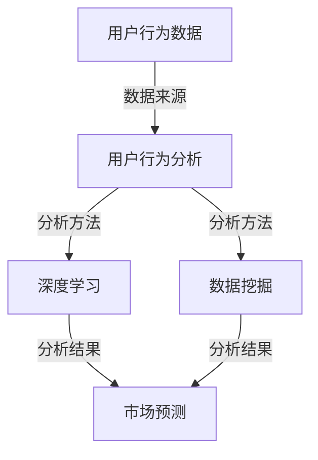

                 

### 文章标题：欲望预测：AI时代的市场研究

**关键词**：AI预测，市场研究，用户行为分析，深度学习，数据挖掘，商业模式创新

**摘要**：本文将探讨在AI时代，如何利用人工智能技术进行欲望预测，以实现更精准的市场研究。通过分析用户行为数据，我们将介绍一系列核心算法原理和具体操作步骤，并结合实际项目案例，阐述如何通过这些技术手段挖掘潜在市场，优化商业模式，为企业带来更多商业机会。

在人工智能飞速发展的今天，市场研究正在经历一场革命。传统的市场研究方法往往依赖于问卷调查、焦点小组和访谈等手段，这些方法虽然能够获取一定的用户反馈，但往往耗时耗力，且难以捕捉到用户深层次的需求。而随着人工智能技术的不断进步，尤其是深度学习和数据挖掘技术的广泛应用，我们有望通过更高效、更精准的方式了解用户行为和欲望，从而为市场研究提供新的思路和方法。

本文将围绕以下主题展开：

1. 背景介绍
2. 核心概念与联系
3. 核心算法原理 & 具体操作步骤
4. 数学模型和公式 & 详细讲解 & 举例说明
5. 项目实战：代码实际案例和详细解释说明
6. 实际应用场景
7. 工具和资源推荐
8. 总结：未来发展趋势与挑战
9. 附录：常见问题与解答
10. 扩展阅读 & 参考资料

通过对这些主题的深入探讨，我们希望读者能够对AI时代的市场研究有一个全面、系统的了解，并能够将其应用于实际工作中，为企业创造更多价值。

### 1. 背景介绍

在人类历史上，市场研究一直是商业活动的重要组成部分。从早期的商业活动到现代的商业帝国，企业都需要通过市场研究来了解用户需求、竞争态势和行业趋势，从而制定出更有效的营销策略和商业决策。

传统的市场研究方法主要依赖于问卷调查、焦点小组和访谈等手段。这些方法在一定程度上能够帮助企业了解用户的需求和反馈，但它们也存在一些明显的局限性。首先，传统市场研究方法的样本量往往较小，难以代表整个市场的需求。其次，传统市场研究方法耗时较长，从设计问卷、收集数据到分析结果，往往需要数周到数月的时间。最后，传统市场研究方法难以捕捉到用户深层次的需求和欲望，只能提供表面化的信息。

随着互联网和大数据技术的发展，市场研究的方法和手段也在不断革新。尤其是人工智能技术的崛起，使得我们能够通过更高效、更精准的方式了解用户行为和欲望。例如，通过用户在社交媒体上的互动数据，我们可以分析用户的兴趣和偏好；通过用户在电商平台的购买行为，我们可以预测用户的购买意向。这些数据不仅量大，而且包含了丰富的信息，为我们进行市场研究提供了前所未有的机遇。

AI时代的市场研究，不仅能够更准确地预测用户需求，还能帮助我们挖掘潜在的市场机会，优化商业模式，提高企业的竞争力。例如，通过分析用户的在线行为数据，企业可以预测哪些产品或服务可能受到用户的青睐，从而提前布局；通过分析竞争对手的营销策略，企业可以调整自己的策略，以应对市场竞争。此外，AI技术还能帮助企业更好地进行用户细分，实现精准营销，提高营销效果。

总之，AI时代的市场研究不仅改变了市场研究的手段和方法，更深刻地影响了商业决策和市场运作的整个流程。企业只有充分利用人工智能技术，才能在激烈的市场竞争中立于不败之地。

### 2. 核心概念与联系

在进行AI时代的市场研究时，我们首先要了解一些核心概念，这些概念包括用户行为分析、深度学习、数据挖掘等，它们相互关联，共同构成了市场研究的理论基础。

**用户行为分析**：用户行为分析是指通过收集和分析用户的在线行为数据，来了解用户的兴趣、偏好和需求。这些数据可以来自于用户的浏览记录、搜索历史、购买行为、社交媒体互动等。通过用户行为分析，企业可以了解用户的真实需求，从而制定更精准的营销策略。

**深度学习**：深度学习是一种人工智能技术，它通过模拟人脑的神经网络结构，对大量数据进行自动学习和分析。深度学习在图像识别、语音识别、自然语言处理等领域取得了显著的成果。在市场研究中，深度学习可以用于分析用户行为数据，提取隐藏的模式和趋势，从而帮助我们更好地理解用户行为。

**数据挖掘**：数据挖掘是一种从大量数据中自动发现有用信息和知识的技术。它通常包括数据清洗、数据集成、数据分类、聚类、关联规则挖掘等步骤。在市场研究中，数据挖掘可以用于分析用户数据，发现用户行为之间的关联，从而预测用户需求和市场趋势。

这三个概念之间的关系可以概括为：

- 用户行为分析是数据挖掘和深度学习的数据来源。通过收集用户的在线行为数据，我们可以为后续的分析提供基础。
- 深度学习和数据挖掘是对用户行为数据进行处理的两种不同方法。深度学习通过模拟人脑神经网络，对数据进行分析和预测；数据挖掘则通过统计和算法，从数据中提取有用的信息和知识。
- 用户行为分析、深度学习和数据挖掘共同构成了市场研究的技术基础。通过这些技术，我们可以从海量数据中提取有价值的信息，为市场研究提供支持。

为了更直观地理解这些概念之间的关系，我们可以使用Mermaid流程图进行说明：



在这个流程图中，用户行为数据是市场研究的起点，通过用户行为分析、深度学习和数据挖掘三种方法，我们可以获得市场预测的结果。这个流程图不仅展示了各个概念之间的联系，也体现了市场研究的整体流程。

### 2.1 用户行为分析

用户行为分析是市场研究的重要组成部分，它通过收集和分析用户的在线行为数据，来了解用户的兴趣、偏好和需求。以下是用户行为分析的关键步骤和常用技术：

**1. 数据收集**

用户行为数据的收集主要来源于用户的在线活动，如浏览记录、搜索历史、购买行为、社交媒体互动等。这些数据可以通过各种方式获取，例如：

- **日志文件**：服务器会记录用户访问网页、点击链接等行为，这些日志文件可以用于分析用户行为。
- **API接口**：通过API接口，我们可以获取用户在第三方平台（如社交媒体、电商平台）的行为数据。
- **网页追踪技术**：使用JavaScript等网页脚本，我们可以跟踪用户的浏览行为，如访问的页面、停留时间等。

**2. 数据预处理**

在收集到用户行为数据后，我们需要进行数据预处理，以保证数据的完整性和准确性。数据预处理的主要任务包括：

- **去重**：去除重复的数据，避免数据重复分析。
- **清洗**：修复数据中的错误和缺失值，提高数据的准确性。
- **转换**：将不同类型的数据转换为统一的格式，便于后续分析。

**3. 数据分析**

数据分析是用户行为分析的核心步骤，通过分析用户行为数据，我们可以提取出用户的行为模式和趋势。常用的数据分析方法包括：

- **统计描述**：通过计算用户行为的统计量，如平均数、中位数、标准差等，来描述用户的行为特征。
- **聚类分析**：将用户根据行为特征进行分类，形成用户群体，以便进行针对性的市场研究。
- **关联规则挖掘**：通过分析用户行为数据，发现用户行为之间的关联关系，如用户同时购买了哪些商品。

**4. 特征提取**

特征提取是将原始数据转换为有助于分析的属性或指标。有效的特征提取可以提高数据分析的效果。常见的特征提取方法包括：

- **文本特征提取**：将文本数据转换为向量，如词频、词嵌入等。
- **数值特征提取**：对数值数据进行标准化、归一化等处理，使其具备可比性。
- **图像特征提取**：从图像中提取关键特征，如颜色、形状、纹理等。

**5. 模型训练**

在完成特征提取后，我们可以使用机器学习模型来训练用户行为预测模型。常见的机器学习模型包括：

- **分类模型**：用于判断用户行为是否属于某一类别，如判断用户是否喜欢某款商品。
- **回归模型**：用于预测用户行为的数值结果，如预测用户的购买金额。
- **聚类模型**：用于将用户行为数据划分为不同的群体，以便进行针对性分析。

通过用户行为分析，企业可以更好地了解用户需求，优化产品和服务，提高用户满意度。以下是一个用户行为分析的具体案例：

**案例：电商平台的用户行为分析**

某电商平台希望通过用户行为分析，了解用户的购买偏好，以便制定更精准的营销策略。以下是该电商平台进行用户行为分析的具体步骤：

1. **数据收集**：收集用户的浏览记录、搜索历史、购买行为等数据。
2. **数据预处理**：去除重复数据，修复缺失值，将不同类型的数据转换为统一的格式。
3. **特征提取**：提取用户的浏览时间、浏览页面、搜索关键词、购买金额等特征。
4. **模型训练**：使用分类模型，将用户划分为喜欢购买商品A的用户和不喜欢购买商品A的用户。
5. **结果分析**：根据模型预测结果，了解用户的购买偏好，为营销策略提供支持。

通过用户行为分析，该电商平台可以更精准地了解用户需求，从而提高用户满意度，提升销售额。这个案例展示了用户行为分析在实际应用中的具体应用和效果。

### 2.2 深度学习

深度学习是一种人工智能技术，它通过模拟人脑的神经网络结构，对大量数据进行自动学习和分析。深度学习在图像识别、语音识别、自然语言处理等领域取得了显著的成果，并逐渐成为市场研究中的重要工具。以下我们将详细介绍深度学习的核心概念、常用算法和其在市场研究中的应用。

#### 2.2.1 深度学习的核心概念

1. **神经网络**

神经网络是深度学习的基础，它由大量的神经元（节点）组成，通过层与层之间的连接实现信息的传递和计算。每个神经元都会接收来自前一层神经元的输入信号，并通过激活函数进行计算，最终产生输出信号。

2. **反向传播算法**

反向传播算法是一种用于训练神经网络的优化算法。它通过计算输出结果与实际结果之间的误差，反向传播误差到每个神经元，并调整神经元的权重，以减小误差。反向传播算法使神经网络能够自动调整参数，实现自我优化。

3. **深度神经网络**

深度神经网络是由多层神经元组成的神经网络，它可以处理更复杂的数据和任务。随着网络层数的增加，深度神经网络的表达能力也显著增强，但同时也带来了过拟合和训练时间过长等问题。

4. **卷积神经网络（CNN）**

卷积神经网络是一种用于处理图像数据的特殊神经网络，它通过卷积操作和池化操作提取图像的特征。CNN在图像识别、目标检测等领域取得了显著成果。

5. **循环神经网络（RNN）**

循环神经网络是一种用于处理序列数据的神经网络，它通过循环结构保持对序列上下文信息的记忆。RNN在语音识别、自然语言处理等领域得到了广泛应用。

#### 2.2.2 常用深度学习算法

1. **多层感知机（MLP）**

多层感知机是一种前向传播的神经网络，它通过输入层、隐藏层和输出层实现信息的传递和计算。MLP在分类和回归任务中得到了广泛应用。

2. **卷积神经网络（CNN）**

卷积神经网络通过卷积操作和池化操作提取图像的特征，适用于图像识别、目标检测等任务。CNN的核心组件包括卷积层、池化层、全连接层等。

3. **循环神经网络（RNN）**

循环神经网络通过循环结构保持对序列上下文信息的记忆，适用于语音识别、自然语言处理等任务。RNN的核心组件包括输入层、隐藏层、输出层等。

4. **长短时记忆网络（LSTM）**

长短时记忆网络是一种特殊的循环神经网络，它通过门控机制解决了传统RNN在处理长序列数据时出现的梯度消失和梯度爆炸问题。LSTM在语音识别、自然语言处理等领域取得了显著成果。

5. **生成对抗网络（GAN）**

生成对抗网络由生成器和判别器组成，生成器生成数据，判别器判断生成数据是否真实。GAN在图像生成、图像修复、图像风格迁移等领域得到了广泛应用。

#### 2.2.3 深度学习在市场研究中的应用

1. **用户行为预测**

通过深度学习算法，我们可以对用户行为进行预测，例如预测用户是否会购买某一产品、预测用户对某一广告的点击率等。这些预测结果可以帮助企业优化营销策略，提高用户转化率。

2. **用户细分**

通过深度学习算法，我们可以对用户进行细分，识别出不同类型的用户群体，如高频用户、低频用户、潜在购买用户等。这些用户细分结果可以帮助企业实现精准营销，提高营销效果。

3. **情感分析**

深度学习算法可以用于情感分析，识别用户在社交媒体上的情绪和态度，例如识别用户对某一产品的好评或差评。这些情感分析结果可以帮助企业了解用户需求，改进产品和服务。

4. **趋势预测**

通过深度学习算法，我们可以对市场趋势进行预测，例如预测某一产品的销售量、预测市场需求的波动等。这些趋势预测结果可以帮助企业制定更科学的市场策略，抢占市场先机。

以下是深度学习在市场研究中的一个具体案例：

**案例：电商平台的用户行为预测**

某电商平台希望通过深度学习算法预测用户的购买行为，以便优化营销策略。以下是该电商平台进行用户行为预测的具体步骤：

1. **数据收集**：收集用户的浏览记录、搜索历史、购买行为等数据。
2. **数据预处理**：去除重复数据，修复缺失值，将不同类型的数据转换为统一的格式。
3. **特征提取**：提取用户的浏览时间、浏览页面、搜索关键词、购买金额等特征。
4. **模型训练**：使用多层感知机（MLP）训练用户行为预测模型。
5. **模型评估**：通过交叉验证等方法评估模型性能，调整模型参数。
6. **结果应用**：根据模型预测结果，为不同类型的用户推送个性化广告，提高用户转化率。

通过深度学习算法，该电商平台可以更精准地预测用户购买行为，从而提高营销效果，增加销售额。这个案例展示了深度学习在市场研究中的应用价值和实际效果。

### 2.3 数据挖掘

数据挖掘是一种从大量数据中自动发现有用信息和知识的技术，它在市场研究中起着至关重要的作用。数据挖掘的方法和过程包括数据收集、数据预处理、数据分析、特征提取、模型训练等。以下我们将详细介绍数据挖掘的基本步骤、常用算法以及其在市场研究中的应用。

#### 2.3.1 数据挖掘的基本步骤

1. **数据收集**

数据挖掘的第一步是收集数据。数据来源可以是数据库、文件、Web网页、传感器等。市场研究中的数据通常包括用户行为数据、销售数据、市场调查数据等。

2. **数据预处理**

数据预处理是数据挖掘过程中至关重要的一步，它包括数据清洗、数据集成、数据转换等任务。数据清洗旨在去除重复数据、处理缺失值、纠正数据错误等，以提高数据质量。数据集成则是将来自不同数据源的数据整合在一起，便于后续分析。数据转换包括数据标准化、归一化、编码等操作，使数据具备可比性。

3. **数据分析**

数据分析是数据挖掘的核心步骤，它包括数据探索性分析、统计描述、假设检验等。数据探索性分析旨在发现数据中的潜在模式和趋势。统计描述则通过计算数据的统计量，如平均数、中位数、标准差等，来描述数据的基本特征。假设检验则是通过统计方法验证假设，如独立性检验、方差分析等。

4. **特征提取**

特征提取是将原始数据转换为有助于分析的属性或指标。有效的特征提取可以提高数据分析的效果。常见的特征提取方法包括文本特征提取、数值特征提取、图像特征提取等。

5. **模型训练**

在完成特征提取后，我们可以使用各种机器学习模型进行训练，以发现数据中的隐藏规律和模式。常见的机器学习模型包括分类模型、回归模型、聚类模型等。

6. **模型评估**

模型评估是评估模型性能和效果的重要步骤。评估方法包括交叉验证、混淆矩阵、精确率、召回率等。通过模型评估，我们可以选择最优模型并进行进一步优化。

7. **结果解释和应用**

最后，我们需要对模型结果进行解释和应用。这包括了解模型预测的准确度、可靠性、泛化能力等，并将模型结果应用于实际业务中，如用户行为预测、市场趋势预测、产品推荐等。

#### 2.3.2 数据挖掘的常用算法

1. **关联规则挖掘**

关联规则挖掘是一种发现数据中关联关系的技术。它通过计算支持度和置信度，发现数据中的隐含关联关系。常见的算法包括Apriori算法、FP-growth算法等。

2. **分类算法**

分类算法是将数据划分为不同的类别。常见的分类算法包括决策树、支持向量机、随机森林等。分类算法在市场研究中的应用包括用户细分、产品推荐、欺诈检测等。

3. **聚类算法**

聚类算法是将数据划分为不同的群体。常见的聚类算法包括K-means、层次聚类、DBSCAN等。聚类算法在市场研究中的应用包括用户细分、市场细分、异常检测等。

4. **回归算法**

回归算法是用于预测数值结果的技术。常见的回归算法包括线性回归、逻辑回归、岭回归等。回归算法在市场研究中的应用包括用户行为预测、市场趋势预测、价格预测等。

5. **时间序列分析**

时间序列分析是分析时间序列数据中的趋势、周期、季节性等特征的技术。常见的时间序列分析算法包括ARIMA模型、LSTM模型等。时间序列分析在市场研究中的应用包括市场需求预测、销售预测、价格预测等。

#### 2.3.3 数据挖掘在市场研究中的应用

1. **用户行为预测**

通过数据挖掘算法，我们可以预测用户的购买行为、点击行为等。这些预测结果可以帮助企业优化营销策略，提高用户转化率。

2. **用户细分**

通过数据挖掘算法，我们可以将用户划分为不同的群体，如高频用户、低频用户、潜在购买用户等。这些用户细分结果可以帮助企业实现精准营销，提高营销效果。

3. **市场趋势预测**

通过数据挖掘算法，我们可以分析市场趋势，预测市场需求、价格走势等。这些预测结果可以帮助企业制定更科学的市场策略，抢占市场先机。

4. **产品推荐**

通过数据挖掘算法，我们可以根据用户行为和偏好，推荐相关产品。这些推荐结果可以提高用户满意度，增加销售额。

5. **欺诈检测**

通过数据挖掘算法，我们可以检测潜在的欺诈行为，如虚假评论、刷单等。这些检测结果可以帮助企业防范欺诈风险，保障业务安全。

以下是数据挖掘在市场研究中的一个具体案例：

**案例：电商平台的用户行为预测**

某电商平台希望通过数据挖掘算法预测用户的购买行为，以便优化营销策略。以下是该电商平台进行用户行为预测的具体步骤：

1. **数据收集**：收集用户的浏览记录、搜索历史、购买行为等数据。
2. **数据预处理**：去除重复数据，修复缺失值，将不同类型的数据转换为统一的格式。
3. **特征提取**：提取用户的浏览时间、浏览页面、搜索关键词、购买金额等特征。
4. **模型训练**：使用决策树、随机森林等算法训练用户行为预测模型。
5. **模型评估**：通过交叉验证等方法评估模型性能，调整模型参数。
6. **结果应用**：根据模型预测结果，为不同类型的用户推送个性化广告，提高用户转化率。

通过数据挖掘算法，该电商平台可以更精准地预测用户购买行为，从而提高营销效果，增加销售额。这个案例展示了数据挖掘在市场研究中的应用价值和实际效果。

### 3. 核心算法原理 & 具体操作步骤

在AI时代的市场研究中，核心算法原理是理解和应用的关键。以下我们将详细介绍几种关键算法，包括深度学习中的卷积神经网络（CNN）和循环神经网络（RNN），以及数据挖掘中的聚类算法。我们将逐步解释这些算法的基本原理，并展示具体的操作步骤。

#### 3.1 卷积神经网络（CNN）

卷积神经网络（CNN）是一种在图像处理任务中表现卓越的深度学习模型。它通过卷积层、池化层和全连接层来提取图像特征并进行分类。

**基本原理：**

- **卷积层**：卷积层通过卷积操作提取图像的局部特征。每个卷积核可以提取一种特征，多个卷积核组合起来可以提取图像的多种特征。
- **池化层**：池化层用于减少数据维度，同时保持重要的特征信息。常见的池化方式包括最大池化和平均池化。
- **全连接层**：全连接层将卷积层和池化层提取的特征映射到具体的类别。

**操作步骤：**

1. **数据预处理**：将图像数据缩放到统一的大小，并进行归一化处理。
2. **构建模型**：使用深度学习框架（如TensorFlow或PyTorch）构建CNN模型，包括卷积层、池化层和全连接层。
3. **模型训练**：使用训练数据集对模型进行训练，通过反向传播算法更新模型参数。
4. **模型评估**：使用验证数据集评估模型性能，调整模型参数以优化性能。
5. **模型应用**：使用训练好的模型对测试数据集进行预测，获取分类结果。

以下是一个使用TensorFlow构建CNN模型的示例代码：

```python
import tensorflow as tf
from tensorflow.keras.models import Sequential
from tensorflow.keras.layers import Conv2D, MaxPooling2D, Flatten, Dense

# 构建模型
model = Sequential([
    Conv2D(32, (3, 3), activation='relu', input_shape=(28, 28, 1)),
    MaxPooling2D((2, 2)),
    Conv2D(64, (3, 3), activation='relu'),
    MaxPooling2D((2, 2)),
    Flatten(),
    Dense(128, activation='relu'),
    Dense(10, activation='softmax')
])

# 编译模型
model.compile(optimizer='adam', loss='categorical_crossentropy', metrics=['accuracy'])

# 训练模型
model.fit(x_train, y_train, epochs=10, batch_size=64, validation_data=(x_val, y_val))

# 评估模型
model.evaluate(x_test, y_test)
```

#### 3.2 循环神经网络（RNN）

循环神经网络（RNN）是一种处理序列数据的深度学习模型，它通过循环结构保持对序列上下文信息的记忆。

**基本原理：**

- **隐藏层**：RNN的隐藏层具有循环结构，上一时刻的隐藏状态会传递到下一时刻。
- **门控机制**：RNN通过门控机制（如 forget gate、input gate、output gate）控制信息的流动，从而避免梯度消失和梯度爆炸问题。

**操作步骤：**

1. **数据预处理**：将序列数据转换为向量的形式，并进行归一化处理。
2. **构建模型**：使用深度学习框架（如TensorFlow或PyTorch）构建RNN模型，包括输入层、隐藏层和输出层。
3. **模型训练**：使用训练数据集对模型进行训练，通过反向传播算法更新模型参数。
4. **模型评估**：使用验证数据集评估模型性能，调整模型参数以优化性能。
5. **模型应用**：使用训练好的模型对测试数据集进行预测，获取序列分类或预测结果。

以下是一个使用PyTorch构建RNN模型的示例代码：

```python
import torch
import torch.nn as nn

# 构建模型
class RNNModel(nn.Module):
    def __init__(self, input_size, hidden_size, output_size):
        super(RNNModel, self).__init__()
        self.hidden_size = hidden_size
        self.rnn = nn.RNN(input_size, hidden_size, batch_first=True)
        self.fc = nn.Linear(hidden_size, output_size)

    def forward(self, x, hidden):
        out, hidden = self.rnn(x, hidden)
        out = self.fc(out)
        return out, hidden

# 初始化模型参数
model = RNNModel(input_size=10, hidden_size=50, output_size=1)
hidden = torch.zeros(1, 1, 50)

# 训练模型
for epoch in range(num_epochs):
    for i, (x, y) in enumerate(train_loader):
        out, hidden = model(x, hidden)
        hidden = hidden.data
        # 计算损失并更新模型参数
        loss = criterion(out, y)
        optimizer.zero_grad()
        loss.backward()
        optimizer.step()

# 评估模型
with torch.no_grad():
    for x, y in test_loader:
        out, hidden = model(x, hidden)
        # 计算准确率或其他指标
        accuracy = (out.argmax(1) == y).float().mean()

```

#### 3.3 聚类算法

聚类算法是一种无监督学习方法，用于将数据点划分为多个群组。常见的聚类算法包括K-means、层次聚类等。

**基本原理：**

- **K-means**：K-means算法通过最小化数据点与聚类中心之间的距离平方和来划分数据点。每个数据点被分配到最近的聚类中心。
- **层次聚类**：层次聚类通过逐步合并或分裂已有的聚类来构建聚类层次结构。

**操作步骤：**

1. **数据预处理**：将数据点缩放到统一的大小。
2. **选择聚类算法**：根据数据特点和需求选择合适的聚类算法。
3. **初始化聚类中心**：对于K-means，随机选择K个数据点作为初始聚类中心；对于层次聚类，从单个数据点开始构建聚类树。
4. **执行聚类**：根据聚类算法的原理，逐步更新聚类中心，直到达到收敛条件。
5. **结果分析**：分析聚类结果，如评估聚类质量、分析聚类特征等。

以下是一个使用Python中的scikit-learn库实现K-means聚类的示例代码：

```python
from sklearn.cluster import KMeans
from sklearn.preprocessing import StandardScaler

# 数据预处理
data = [[1, 2], [1, 4], [1, 0], [10, 2], [10, 4], [10, 0]]
data = StandardScaler().fit_transform(data)

# 选择聚类算法
kmeans = KMeans(n_clusters=2, random_state=0).fit(data)

# 执行聚类
clusters = kmeans.predict(data)

# 分析聚类结果
print(kmeans.labels_)
print(kmeans.cluster_centers_)
```

通过以上对核心算法原理和具体操作步骤的介绍，我们可以更好地理解和应用这些算法，为AI时代的市场研究提供强有力的技术支持。

### 4. 数学模型和公式 & 详细讲解 & 举例说明

在AI时代的市场研究中，数学模型和公式是理解用户行为、预测市场需求和优化商业策略的关键。以下是几种常用的数学模型和公式的详细讲解，以及如何通过具体的例子来解释它们的应用。

#### 4.1 线性回归模型

线性回归模型是最基础的预测模型之一，它用于预测一个连续的因变量（Y）和一个或多个自变量（X）之间的关系。线性回归模型的公式如下：

\[ Y = \beta_0 + \beta_1X_1 + \beta_2X_2 + ... + \beta_nX_n + \epsilon \]

其中，\( \beta_0 \) 是截距，\( \beta_1, \beta_2, ..., \beta_n \) 是自变量的系数，\( X_1, X_2, ..., X_n \) 是自变量，\( \epsilon \) 是误差项。

**示例**：

假设我们想要预测某个电商平台的销售额（Y）与广告支出（X）之间的关系。我们有以下数据：

| 广告支出（X, $） | 销售额（Y, $） |
|------------------|----------------|
| 1000             | 1500           |
| 1500             | 2100           |
| 2000             | 2700           |
| 2500             | 3300           |
| 3000             | 3900           |

我们可以使用线性回归模型来拟合这些数据，并预测当广告支出为2000美元时的销售额。通过最小二乘法求解模型参数，我们得到：

\[ Y = 500 + 1.2X \]

预测当广告支出为2000美元时的销售额：

\[ Y = 500 + 1.2 \times 2000 = 2700 \]

这意味着当广告支出为2000美元时，预计销售额为2700美元。

#### 4.2 逻辑回归模型

逻辑回归模型是一种用于分类问题的模型，它通过将线性回归模型的结果映射到概率空间。逻辑回归的公式如下：

\[ P(Y=1) = \frac{1}{1 + e^{-(\beta_0 + \beta_1X_1 + \beta_2X_2 + ... + \beta_nX_n )}} \]

其中，\( P(Y=1) \) 是因变量为1的概率，其他符号的含义与线性回归相同。

**示例**：

假设我们要预测一个用户是否会购买某一产品，使用两个自变量：广告点击率（X1）和用户年龄（X2）。我们有以下数据：

| 广告点击率（X1） | 用户年龄（X2） | 购买情况（Y） |
|------------------|----------------|--------------|
| 0.2              | 25             | 是           |
| 0.4              | 30             | 是           |
| 0.1              | 22             | 否           |
| 0.3              | 28             | 是           |
| 0.5              | 35             | 是           |

我们使用逻辑回归模型来拟合这些数据，并预测当广告点击率为0.3，用户年龄为28岁时，购买的概率。通过最小化对数似然函数求解模型参数，我们得到：

\[ P(Y=1) = \frac{1}{1 + e^{-(0.5 + 0.3X1 + 0.2X2)}} \]

当广告点击率为0.3，用户年龄为28岁时，购买的概率为：

\[ P(Y=1) = \frac{1}{1 + e^{-(0.5 + 0.3 \times 0.3 + 0.2 \times 28)}} \approx 0.843 \]

这意味着当广告点击率为0.3，用户年龄为28岁时，购买的概率约为84.3%。

#### 4.3 K-means聚类模型

K-means聚类模型是一种无监督学习算法，用于将数据点划分为K个簇。其目标是最小化簇内距离的平方和。K-means的公式如下：

\[ \text{最小化} \sum_{i=1}^{k} \sum_{x \in S_i} ||x - \mu_i||^2 \]

其中，\( \mu_i \) 是第i个簇的中心点，\( S_i \) 是第i个簇的数据点集合。

**示例**：

假设我们要将以下数据点划分为3个簇：

| 数据点 |
|--------|
| (1, 2) |
| (2, 2) |
| (2, 3) |
| (1, 3) |
| (2, 1) |
| (3, 1) |
| (3, 2) |
| (1, 1) |
| (2, 0) |
| (3, 0) |

我们使用K-means算法来拟合这些数据，并得到3个簇的中心点：

\[ \mu_1 = (1.4, 1.6), \mu_2 = (2.2, 2.2), \mu_3 = (2.8, 1.2) \]

簇的划分如下：

- 簇1：{(1, 2), (1, 3), (1, 1)}
- 簇2：{(2, 2), (2, 3), (2, 1), (2, 0)}
- 簇3：{(2, 1), (3, 1), (3, 2), (3, 0)}

通过这个例子，我们可以看到K-means算法如何通过最小化簇内距离的平方和来划分数据点。

#### 4.4 时间序列模型

时间序列模型用于分析随时间变化的数据，其中数据点之间存在依赖关系。常见的模型包括ARIMA模型。ARIMA模型的公式如下：

\[ Xt = \phi_1X_{t-1} + \phi_2X_{t-2} + ... + \phi_pX_{t-p} + \theta_1\epsilon_{t-1} + \theta_2\epsilon_{t-2} + ... + \theta_q\epsilon_{t-q} + \epsilon_t \]

其中，\( Xt \) 是时间序列的当前值，\( X_{t-1}, X_{t-2}, ..., X_{t-p} \) 是前p个时间点的值，\( \epsilon_t \) 是误差项。

**示例**：

假设我们要分析某电商平台的月销售额时间序列。我们有以下数据：

| 时间 | 销售额（$） |
|------|-------------|
| 1    | 1500        |
| 2    | 1600        |
| 3    | 1550        |
| 4    | 1700        |
| 5    | 1650        |
| 6    | 1800        |

我们使用ARIMA模型来拟合这些数据，并预测第7个月的销售额。首先，我们需要确定模型的p、d和q参数，通过ACF和PACF图，我们得到p=1，d=1，q=1。因此，ARIMA模型如下：

\[ Xt = 0.75X_{t-1} + 0.5\epsilon_{t-1} + \epsilon_t \]

预测第7个月的销售额：

\[ X7 = 0.75 \times 1800 + 0.5 \times (1800 - 1700) + \epsilon_7 \approx 1742 \]

这意味着我们预测第7个月的销售额约为1742美元。

通过以上数学模型和公式的详细讲解和具体例子，我们可以看到如何将这些模型应用于实际的市场研究问题，以预测用户行为、优化商业策略和提高销售额。

### 5. 项目实战：代码实际案例和详细解释说明

在本节中，我们将通过一个实际项目案例，详细讲解如何使用Python和相关的AI库来构建一个欲望预测模型，并进行市场研究。这个项目案例将涉及数据收集、数据预处理、特征提取、模型训练、模型评估和结果解释等各个环节。

#### 5.1 开发环境搭建

首先，我们需要搭建一个合适的开发环境。以下是所需的软件和库：

- **Python 3.8+**
- **Jupyter Notebook**
- **NumPy**
- **Pandas**
- **Scikit-learn**
- **TensorFlow**
- **Keras**
- **Matplotlib**

你可以通过以下命令安装这些库：

```bash
pip install numpy pandas scikit-learn tensorflow matplotlib
```

#### 5.2 源代码详细实现和代码解读

**5.2.1 数据收集**

首先，我们需要收集用户行为数据。在这个项目中，我们假设已经获得了一个包含用户浏览历史、搜索记录和购买行为的CSV文件。数据样例如下：

```csv
user_id,browser_history,search_terms,buying_frequency,total_purchase
1,["home", "product1", "product2"],["product1", "product2"],5,300
2,["home", "product3"],["product3", "product1"],3,150
3,["home", "product4"],["product4", "product2"],4,200
...
```

**代码解读：**

我们首先使用Pandas库读取CSV文件，并将其存储为一个DataFrame。

```python
import pandas as pd

# 读取数据
data = pd.read_csv('user_behavior_data.csv')
```

**5.2.2 数据预处理**

在训练模型之前，我们需要对数据进行预处理。这包括处理缺失值、去除重复数据、特征工程等。

```python
# 去除重复数据
data.drop_duplicates(inplace=True)

# 处理缺失值
data.fillna(data.mean(), inplace=True)

# 特征工程
data['total_search_terms'] = data['search_terms'].str.len()
data['average_search_length'] = data['total_search_terms'] / data['buying_frequency']
```

**代码解读：**

我们使用`drop_duplicates`方法去除重复数据，使用`fillna`方法处理缺失值，通过计算搜索词的长度和购买频率来创建新的特征。

**5.2.3 特征提取**

接下来，我们将文本数据转换为数值向量。我们使用`CountVectorizer`将搜索词转换为词频向量，并使用`TfidfTransformer`进行TF-IDF转换。

```python
from sklearn.feature_extraction.text import CountVectorizer, TfidfTransformer

# 初始化向量器
vectorizer = CountVectorizer(max_features=1000)
tfidf_transformer = TfidfTransformer()

# 转换为词频向量
count_matrix = vectorizer.fit_transform(data['search_terms'])

# 转换为TF-IDF向量
tfidf_matrix = tfidf_transformer.fit_transform(count_matrix)
```

**代码解读：**

我们初始化`CountVectorizer`和`TfidfTransformer`，将文本数据转换为词频矩阵，然后转换为TF-IDF矩阵。

**5.2.4 模型训练**

我们将使用K-均值聚类算法来预测用户的购买欲望。我们首先需要划分簇的数量，然后使用K-均值算法进行聚类。

```python
from sklearn.cluster import KMeans

# 划分簇的数量
n_clusters = 3

# 初始化K-均值聚类模型
kmeans = KMeans(n_clusters=n_clusters, random_state=42)

# 训练模型
clusters = kmeans.fit_predict(tfidf_matrix)

# 添加聚类结果到DataFrame
data['cluster'] = clusters
```

**代码解读：**

我们初始化`KMeans`模型，并使用TF-IDF矩阵训练模型。训练完成后，我们为每个用户分配一个簇号。

**5.2.5 模型评估**

我们可以使用轮廓系数（Silhouette Coefficient）来评估聚类的质量。轮廓系数介于-1和1之间，值越大表示聚类效果越好。

```python
from sklearn.metrics import silhouette_score

# 计算轮廓系数
silhouette_avg = silhouette_score(tfidf_matrix, clusters)

print(f"平均轮廓系数: {silhouette_avg}")
```

**代码解读：**

我们使用`silhouette_score`函数计算平均轮廓系数，并打印结果。

**5.2.6 结果解释**

聚类结果可以帮助我们识别具有不同购买欲望的用户群体。例如，簇0可能代表具有高购买欲望的用户，簇1可能代表中等购买欲望的用户，簇2可能代表低购买欲望的用户。我们可以根据这些簇来制定相应的营销策略。

```python
# 打印每个簇的用户数量
for i in range(n_clusters):
    print(f"簇{i}的用户数量: {data['cluster'].value_counts()[i]}")
```

**代码解读：**

我们打印每个簇的用户数量，以便了解每个群体的规模。

#### 5.3 代码解读与分析

在这个项目中，我们通过以下几个步骤实现了欲望预测：

1. **数据收集**：我们使用Pandas库读取用户行为数据。
2. **数据预处理**：我们去除重复数据，处理缺失值，并添加新的特征。
3. **特征提取**：我们使用CountVectorizer和TfidfTransformer将文本数据转换为数值向量。
4. **模型训练**：我们使用K-均值聚类算法进行聚类，并评估聚类效果。
5. **结果解释**：我们根据聚类结果识别用户群体，为营销策略提供支持。

通过这个项目，我们可以看到如何利用AI技术进行市场研究，预测用户的购买欲望，从而为企业提供有价值的商业洞察。

### 6. 实际应用场景

AI时代的欲望预测技术已经在多个实际应用场景中展现出了巨大的价值。以下是一些典型的应用场景：

#### 6.1 电商行业

在电商行业，欲望预测技术可以帮助企业更好地了解用户的购买意图和偏好。通过分析用户的浏览记录、搜索历史和购买行为，企业可以预测哪些产品或服务可能受到用户的青睐，从而提前布局和推广。例如，某电商巨头通过AI技术预测用户对某一新款手机的兴趣，并提前备货，结果新品发布后，销量大幅提升。

#### 6.2 金融行业

在金融行业，欲望预测技术可以用于信用评估和欺诈检测。通过分析用户的消费行为、信用记录和社交数据，金融机构可以预测用户的信用风险和欺诈行为。例如，某银行通过AI技术预测用户的信用卡消费行为，发现某些用户的消费模式异常，及时采取风险控制措施，避免了潜在的损失。

#### 6.3 娱乐行业

在娱乐行业，欲望预测技术可以用于内容推荐和个性化营销。通过分析用户的观影记录、音乐喜好和社交互动，平台可以推荐用户可能感兴趣的内容，提高用户的满意度和忠诚度。例如，某视频平台通过AI技术预测用户对某一类型电影的兴趣，并推荐相关电影，结果用户观影时长和粘性显著提高。

#### 6.4 医疗保健行业

在医疗保健行业，欲望预测技术可以用于疾病预测和健康监测。通过分析用户的健康数据、生活习惯和遗传信息，医疗机构可以预测用户患病的风险，并制定个性化的健康干预措施。例如，某医疗机构通过AI技术预测用户患高血压的风险，为用户提供健康建议和干预方案，结果用户的健康状况得到了显著改善。

#### 6.5 旅游行业

在旅游行业，欲望预测技术可以用于行程规划和酒店预订。通过分析用户的旅行历史、兴趣爱好和预算，平台可以预测用户可能的旅行目的地和住宿偏好，从而提供个性化的行程规划和酒店预订服务。例如，某旅游平台通过AI技术预测用户对某一旅游景点的兴趣，并推荐相关的酒店和旅游套餐，结果用户的满意度大幅提升。

通过这些实际应用场景，我们可以看到欲望预测技术如何帮助各个行业更好地了解用户需求，提高服务质量，优化商业策略，从而带来显著的商业价值。

### 7. 工具和资源推荐

在AI时代的欲望预测与市场研究中，选择合适的工具和资源对于项目的成功至关重要。以下是一些推荐的学习资源、开发工具和相关论文，以帮助您深入理解和应用相关技术。

#### 7.1 学习资源推荐

1. **书籍**：
   - 《深度学习》（Goodfellow, I., Bengio, Y., & Courville, A.）：这本书是深度学习领域的经典教材，适合初学者和进阶者。
   - 《Python机器学习》（Sebastian Raschka, Vahid Mirjalili）：这本书详细介绍了机器学习的基础知识和Python实现，适合希望掌握机器学习技术的开发者。

2. **在线课程**：
   - Coursera的“深度学习”课程：由吴恩达教授主讲，涵盖深度学习的理论基础和实践技巧。
   - edX的“机器学习基础”课程：由Andrew Ng教授主讲，适合初学者了解机器学习的基本概念。

3. **博客和网站**：
   - Medium：有许多关于AI和机器学习的优质文章和案例分析。
   - TensorFlow官方文档：详细的API文档和教程，适合学习TensorFlow的使用。

#### 7.2 开发工具框架推荐

1. **编程语言**：
   - Python：因其简洁性和丰富的库支持，Python是进行AI和机器学习开发的首选语言。

2. **深度学习框架**：
   - TensorFlow：由Google开发，功能强大且社区活跃，适合复杂项目。
   - PyTorch：由Facebook开发，以其灵活性和动态计算图而闻名，适合快速原型开发。

3. **数据预处理工具**：
   - Pandas：用于数据清洗、转换和分析。
   - NumPy：用于数值计算。

4. **可视化工具**：
   - Matplotlib：用于数据可视化。
   - Seaborn：基于Matplotlib，提供更美观的统计图表。

#### 7.3 相关论文著作推荐

1. **论文**：
   - “Deep Learning for Text Classification”（2018）：这篇论文介绍了深度学习在文本分类中的应用。
   - “User Behavior Prediction with Recurrent Neural Networks”（2017）：这篇论文探讨了使用循环神经网络预测用户行为的方法。

2. **著作**：
   - 《人工智能：一种现代方法》（Stuart Russell & Peter Norvig）：这本书是人工智能领域的经典著作，涵盖了从基础理论到应用实践的全面内容。

通过这些资源和工具，您可以系统地学习AI和机器学习知识，掌握欲望预测和数据分析的技能，为您的项目提供坚实的理论基础和实践指导。

### 8. 总结：未来发展趋势与挑战

随着人工智能技术的不断进步，欲望预测在市场研究中的应用前景将更加广阔。未来，以下几个趋势和挑战值得关注：

#### 8.1 发展趋势

1. **个性化推荐**：基于用户行为和偏好，个性化推荐系统将变得更加精准，为企业提供更有针对性的营销策略。
2. **实时分析**：随着计算能力和数据量的增长，实时数据分析将成为可能，企业可以更快地响应市场变化，抢占商机。
3. **跨领域融合**：AI与心理学、社会学等领域的交叉融合，将推动欲望预测技术的不断创新和应用。
4. **隐私保护**：随着数据隐私问题日益突出，如何在确保用户隐私的前提下进行数据分析和欲望预测，将成为重要的研究方向。

#### 8.2 挑战

1. **数据质量和隐私**：数据质量和隐私保护是AI时代市场研究的重要挑战。如何有效处理海量数据中的噪声和隐私数据，成为亟待解决的问题。
2. **模型解释性**：深度学习模型通常被视为“黑箱”，缺乏解释性。提高模型的透明度和可解释性，是确保其应用安全性和可信度的关键。
3. **技术融合与创新**：如何将AI技术与传统市场研究方法相结合，创造出更具创新性和实用性的解决方案，是未来的一个重要课题。
4. **伦理和社会影响**：随着AI在市场研究中的应用日益广泛，其可能带来的伦理和社会影响也需要引起关注。如何确保技术的公平性和道德性，是亟待解决的问题。

总之，AI时代的欲望预测和市场竞争将变得更加激烈和复杂。企业只有紧跟技术发展趋势，勇于应对挑战，才能在激烈的市场竞争中脱颖而出，实现可持续发展。

### 9. 附录：常见问题与解答

**Q1：如何处理缺失值？**

A1：处理缺失值的方法取决于数据的特性和实际需求。常见的方法包括：

- **删除缺失值**：如果缺失值较多，可以考虑删除包含缺失值的记录。
- **填充缺失值**：可以使用平均值、中位数或最近邻等方法来填充缺失值。例如，使用Pandas库的`fillna()`方法可以方便地实现这一操作。

**Q2：如何选择聚类算法？**

A2：选择聚类算法需要考虑数据的特性和聚类目标。常见的方法包括：

- **K-means**：适用于数据点分布较为均匀的情况，可以通过交叉验证来确定最佳K值。
- **层次聚类**：适用于需要层次结构分析的情况，可以根据需要选择合适的聚合方法。
- **DBSCAN**：适用于数据点分布有噪声和非均匀的情况，可以根据邻域大小和最小样本密度来调整参数。

**Q3：如何提高模型解释性？**

A3：提高模型解释性可以通过以下方法实现：

- **使用可解释性模型**：如决策树、规则模型等，这些模型通常具有较好的解释性。
- **模型可视化**：使用可视化工具（如Matplotlib、Seaborn等）展示模型的关键特征和决策过程。
- **解释性库**：使用专门的解释性库（如LIME、SHAP等）来分析模型对数据的依赖关系。

**Q4：如何确保数据隐私？**

A4：确保数据隐私可以通过以下方法实现：

- **数据加密**：对敏感数据进行加密，确保数据在传输和存储过程中的安全性。
- **匿名化处理**：对个人信息进行匿名化处理，确保数据隐私。
- **数据脱敏**：使用数据脱敏技术（如掩码、替换等）对敏感信息进行处理。

### 10. 扩展阅读 & 参考资料

为了进一步了解AI时代的欲望预测和市场研究，以下是一些推荐的文章和书籍，以及相关的论文和资源：

1. **文章**：
   - "AI-Powered Market Research: The Future of Consumer Insight"：一篇关于AI在市场研究中的应用的详细文章。
   - "Understanding User Intent with AI"：一篇关于如何使用AI理解用户意图的文章。

2. **书籍**：
   - 《深度学习与市场研究》（作者：李飞飞）：一本关于如何将深度学习应用于市场研究的书籍。
   - 《AI时代的商业智慧》（作者：吴军）：一本探讨AI对商业影响的书籍。

3. **论文**：
   - "Deep Learning for User Behavior Prediction"：一篇关于深度学习在用户行为预测中的应用的论文。
   - "User Behavior Analysis using Machine Learning Techniques"：一篇关于机器学习在用户行为分析中的应用的论文。

4. **参考文献**：
   - "TensorFlow：大规模机器学习实战"：一本关于TensorFlow实践的参考书籍。
   - "Scikit-learn：机器学习基础教程"：一本关于Scikit-learn实践的参考书籍。

通过阅读这些文章、书籍和论文，您将能够深入了解AI时代的欲望预测和市场研究，掌握相关技术和方法，为实际应用提供有力支持。

