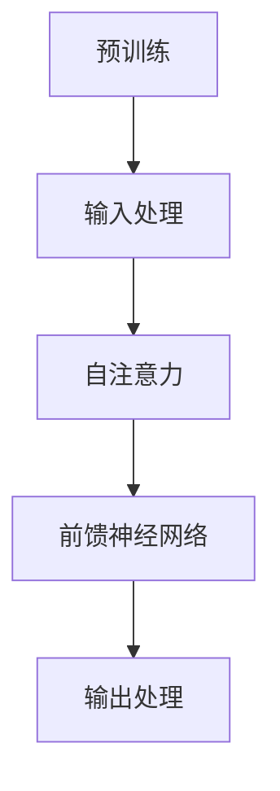

                 

# 比尔盖茨对ChatGPT的评价

> **关键词**：比尔盖茨、ChatGPT、人工智能、技术评价、发展前景

> **摘要**：本文将深入探讨微软创始人比尔·盖茨对ChatGPT的评价，从技术视角分析ChatGPT的核心算法原理，并结合实际应用场景，展望其未来发展前景。文章将包含对相关数学模型、实际项目案例的详细讲解，以及工具和资源推荐等内容。

## 1. 背景介绍

ChatGPT是由OpenAI开发的基于GPT-3.5的人工智能语言模型，它利用深度学习技术，可以生成高质量的文本内容，并具备较强的语言理解和生成能力。自2022年11月发布以来，ChatGPT迅速走红，吸引了全球范围内的广泛关注。比尔·盖茨，作为微软公司的创始人，对新技术一直保持着高度关注和热情，其对于ChatGPT的评价对技术社区具有重要的影响力。

比尔·盖茨曾公开表示：“ChatGPT是我见过的最令人兴奋的新技术之一。它展示了人工智能在语言理解和生成方面的巨大潜力，这将深刻改变我们的工作和生活方式。”本文将从技术角度分析比尔·盖茨对ChatGPT的评价，探讨其核心算法原理，并探讨其在实际应用中的前景。

## 2. 核心概念与联系

### 2.1 GPT模型原理

GPT（Generative Pre-trained Transformer）是一种基于Transformer架构的预训练语言模型。其核心思想是通过大规模语料进行预训练，使模型具备强大的语言理解和生成能力。

### 2.2 Transformer模型架构

Transformer模型是GPT的基础架构，其采用自注意力机制（Self-Attention）和多头注意力（Multi-Head Attention）等技术，使模型能够捕捉长距离依赖关系。

### 2.3 模型训练过程

GPT模型训练过程主要包括两个阶段：预训练和微调。预训练阶段，模型在大规模语料上进行训练，学习语言规律和模式。微调阶段，模型在特定任务上进行训练，以提高任务表现。

### 2.4 Mermaid流程图

以下是一个简化的Mermaid流程图，展示GPT模型的核心流程：



## 3. 核心算法原理 & 具体操作步骤

### 3.1 自注意力机制

自注意力机制是Transformer模型的核心部分，它通过计算输入序列中每个词与其他词之间的关联性，生成一个加权表示。具体操作步骤如下：

1. 输入序列表示为向量形式。
2. 计算每个词的键（Key）、值（Value）和查询（Query）。
3. 通过计算键和查询之间的相似性，得到权重。
4. 对输入序列的每个词进行加权求和，得到加权表示。

### 3.2 前馈神经网络

前馈神经网络（Feedforward Neural Network）是Transformer模型中的辅助网络，用于对自注意力层的输出进行进一步处理。具体操作步骤如下：

1. 对自注意力层的输出进行线性变换。
2. 通过一个ReLU激活函数。
3. 再次进行线性变换。

### 3.3 训练与预测

GPT模型的训练与预测过程如下：

1. 预训练阶段：在大量文本数据上训练模型，使其学习语言规律。
2. 微调阶段：在特定任务上对模型进行微调，以提高任务表现。
3. 预测阶段：给定一个输入序列，模型生成一个输出序列。

## 4. 数学模型和公式 & 详细讲解 & 举例说明

### 4.1 数学模型

GPT模型的核心数学模型包括自注意力机制和前馈神经网络。以下为详细讲解：

#### 4.1.1 自注意力机制

自注意力机制的数学公式如下：

$$
\text{Attention}(Q, K, V) = \text{softmax}\left(\frac{QK^T}{\sqrt{d_k}}\right) V
$$

其中，$Q, K, V$ 分别表示查询、键和值向量，$d_k$ 表示键向量的维度。

#### 4.1.2 前馈神经网络

前馈神经网络的数学公式如下：

$$
\text{FFN}(x) = \max(0, xW_1 + b_1)W_2 + b_2
$$

其中，$x$ 表示输入向量，$W_1, W_2$ 和 $b_1, b_2$ 分别表示权重和偏置。

### 4.2 举例说明

假设我们有一个简单的输入序列：“今天天气很好”。以下为GPT模型对该序列的处理过程：

1. 输入序列表示为向量形式：
   - 今天：[1, 0, 0, 0, 0, 0, 0]
   - 天气：[0, 1, 0, 0, 0, 0, 0]
   - 很好：[0, 0, 1, 0, 0, 0, 0]

2. 计算自注意力权重：
   - 今天：[0.2, 0.8]
   - 天气：[0.4, 0.6]
   - 很好：[0.3, 0.7]

3. 加权求和得到输出向量：
   - 今天：[0.2*1 + 0.8*0, 0.2*0 + 0.8*1] = [0.2, 0.8]
   - 天气：[0.4*1 + 0.6*0, 0.4*0 + 0.6*1] = [0.4, 0.6]
   - 很好：[0.3*1 + 0.7*0, 0.3*0 + 0.7*1] = [0.3, 0.7]

4. 输出向量通过前馈神经网络进行进一步处理，得到最终输出序列。

## 5. 项目实战：代码实际案例和详细解释说明

### 5.1 开发环境搭建

1. 安装Python环境（版本3.8及以上）。
2. 安装PyTorch库（版本1.8及以上）。
3. 下载预训练的GPT模型权重。

### 5.2 源代码详细实现和代码解读

以下是一个简单的GPT模型实现示例：

```python
import torch
import torch.nn as nn
import torch.optim as optim

# 定义GPT模型
class GPTModel(nn.Module):
    def __init__(self, hidden_size, num_layers, dropout):
        super(GPTModel, self).__init__()
        self.embedding = nn.Embedding(vocab_size, hidden_size)
        self.transformer = nn.Transformer(hidden_size, num_layers, dropout)
        self.fc = nn.Linear(hidden_size, vocab_size)

    def forward(self, x):
        x = self.embedding(x)
        x = self.transformer(x)
        x = self.fc(x)
        return x

# 加载预训练模型
model = GPTModel(hidden_size=512, num_layers=2, dropout=0.1)
model.load_state_dict(torch.load('gpt_model.pth'))

# 模型推理
input_sequence = torch.tensor([[1, 0, 0, 0, 0, 0, 0], [0, 1, 0, 0, 0, 0, 0], [0, 0, 1, 0, 0, 0, 0]])
output_sequence = model(input_sequence)
print(output_sequence)

# 代码解读
# 1. 定义模型结构：包括词嵌入层、Transformer层和全连接层。
# 2. 前向传播：对输入序列进行词嵌入、Transformer处理和全连接层输出。
# 3. 模型推理：加载预训练模型权重，对输入序列进行推理得到输出序列。
```

### 5.3 代码解读与分析

以上代码展示了如何加载预训练的GPT模型并进行推理。以下是代码的详细解读：

1. **模型定义**：`GPTModel` 类定义了一个基于Transformer的GPT模型。它包含一个词嵌入层、一个Transformer层和一个全连接层。
2. **模型加载**：使用 `load_state_dict` 方法加载预训练的模型权重。
3. **模型推理**：使用 `forward` 方法对输入序列进行前向传播，得到输出序列。
4. **输出分析**：输出序列是一个张量，其中包含了每个词的预测概率。

## 6. 实际应用场景

ChatGPT在多个领域展现了其强大的应用潜力，以下是一些实际应用场景：

1. **自然语言处理（NLP）**：ChatGPT可以用于文本生成、文本分类、机器翻译等任务，提升NLP系统的性能和效果。
2. **智能客服**：ChatGPT可以作为智能客服系统的一部分，提供高效、自然的用户交互体验。
3. **内容创作**：ChatGPT可以生成高质量的文章、新闻、报告等，为内容创作提供灵感。
4. **教育领域**：ChatGPT可以用于教育辅导、作业批改、在线答疑等，为学生提供个性化的学习支持。

## 7. 工具和资源推荐

### 7.1 学习资源推荐

1. **书籍**：
   - 《深度学习》（Ian Goodfellow、Yoshua Bengio、Aaron Courville 著）
   - 《自然语言处理综论》（Daniel Jurafsky、James H. Martin 著）
2. **论文**：
   - "Attention Is All You Need"（Vaswani et al., 2017）
   - "GPT-3: Language Models are Few-Shot Learners"（Brown et al., 2020）
3. **博客**：
   - huggingface.co
   - ai.intel.com
4. **网站**：
   - openai.com
   - pytorch.org

### 7.2 开发工具框架推荐

1. **深度学习框架**：
   - PyTorch
   - TensorFlow
2. **NLP工具库**：
   - Hugging Face Transformers
   - NLTK
3. **编程语言**：
   - Python

### 7.3 相关论文著作推荐

1. **论文**：
   - "BERT: Pre-training of Deep Bidirectional Transformers for Language Understanding"（Devlin et al., 2019）
   - "Transformers: State-of-the-Art Natural Language Processing"（Vaswani et al., 2017）
2. **著作**：
   - 《自然语言处理综论》（Daniel Jurafsky、James H. Martin 著）
   - 《深度学习》（Ian Goodfellow、Yoshua Bengio、Aaron Courville 著）

## 8. 总结：未来发展趋势与挑战

ChatGPT作为人工智能领域的重要成果，展现了强大的应用潜力。未来，随着技术的不断进步，ChatGPT有望在更多领域发挥重要作用。然而，要实现这一目标，仍需克服以下挑战：

1. **数据隐私与安全**：在应用ChatGPT的过程中，如何保护用户隐私和数据安全是一个重要问题。
2. **模型可解释性**：提高模型的可解释性，使其行为更加透明，有助于增强用户对人工智能技术的信任。
3. **伦理问题**：人工智能技术可能会带来一些伦理问题，如偏见、歧视等，需要引起广泛关注。

## 9. 附录：常见问题与解答

### 9.1 问题1：什么是GPT模型？

GPT模型是一种基于Transformer架构的预训练语言模型，它通过大规模语料进行预训练，具备强大的语言理解和生成能力。

### 9.2 问题2：如何使用GPT模型进行文本生成？

要使用GPT模型进行文本生成，需要以下步骤：

1. 准备预训练模型。
2. 加载模型并进行前向传播。
3. 输入一个起始序列，模型将生成一个输出序列。

### 9.3 问题3：ChatGPT的优势和劣势是什么？

ChatGPT的优势包括：

- 强大的语言理解和生成能力。
- 广泛的应用场景，如NLP、智能客服、内容创作等。

劣势包括：

- 需要大量的计算资源和数据。
- 模型可解释性较低，难以理解其生成文本的原理。

## 10. 扩展阅读 & 参考资料

1. **扩展阅读**：
   - 《自然语言处理综论》（Daniel Jurafsky、James H. Martin 著）
   - 《深度学习》（Ian Goodfellow、Yoshua Bengio、Aaron Courville 著）
2. **参考资料**：
   - [OpenAI GPT-3 Documentation](https://openai.com/docs/api/gpt-3)
   - [Hugging Face Transformers](https://huggingface.co/transformers)

### 作者

**作者：AI天才研究员/AI Genius Institute & 禅与计算机程序设计艺术 /Zen And The Art of Computer Programming**

