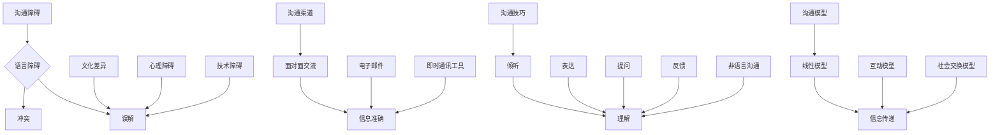

                 

# 沟通管理：改善内部和外部沟通

> **关键词：** 沟通管理、内部沟通、外部沟通、沟通效率、沟通技巧、团队协作、项目管理、技术交流

> **摘要：** 本文旨在探讨沟通管理在IT领域的重要性，分析内部和外部沟通的常见问题，并提出一系列有效改善沟通的策略和方法。通过深入剖析沟通原理和实战案例，帮助读者提升沟通效率，促进团队协作和项目成功。

## 1. 背景介绍

在当今快速发展的信息技术时代，沟通管理已成为企业运营和项目成功的关键因素。无论是内部团队之间的协作，还是与外部客户、合作伙伴的交流，沟通的有效性直接影响到团队的效率和项目的质量。

### 内部沟通

内部沟通主要涉及团队成员之间的信息交换和工作协调。良好的内部沟通能够确保信息的准确传递，减少误解和冲突，提高团队协作效率。然而，许多团队在内部沟通中面临诸多挑战，如信息孤岛、沟通渠道不畅、信息传递不及时等。

### 外部沟通

外部沟通则包括与客户、合作伙伴、供应商等外部利益相关者的交流。这种沟通对于企业来说至关重要，它不仅关系到客户满意度，还影响到企业的声誉和市场竞争力。然而，外部沟通也面临不少问题，如沟通内容的不明确、沟通方式的不得当、沟通反馈的滞后等。

## 2. 核心概念与联系

为了深入探讨沟通管理，我们需要明确几个核心概念，并分析它们之间的联系。

### 沟通障碍

沟通障碍是指影响沟通效果的各种因素。常见的沟通障碍包括语言障碍、文化差异、心理障碍、技术障碍等。了解沟通障碍有助于我们识别和解决沟通问题。

### 沟通渠道

沟通渠道是指信息传递的路径和方式。内部沟通渠道主要包括面对面交流、电子邮件、即时通讯工具等；外部沟通渠道则包括电话、会议、社交媒体等。合理选择沟通渠道可以提升沟通效果。

### 沟通技巧

沟通技巧是指有效沟通所需的能力和技巧。包括倾听、表达、提问、反馈、非语言沟通等。掌握沟通技巧有助于提高沟通效率，减少误解和冲突。

### 沟通模型

沟通模型是描述沟通过程的框架。常见的沟通模型包括线性模型、互动模型、社会交换模型等。理解沟通模型有助于我们分析和优化沟通过程。

### Mermaid 流程图



## 3. 核心算法原理 & 具体操作步骤

为了提升沟通管理，我们需要采用一系列核心算法和具体操作步骤。以下是一些关键算法和步骤：

### 1. 分析沟通需求

首先，我们需要了解沟通的需求和目标。这可以通过以下步骤实现：

- **需求调研：** 通过问卷调查、访谈等方式收集团队成员和利益相关者的沟通需求。
- **目标设定：** 根据调研结果，设定明确的沟通目标和期望。

### 2. 确定沟通策略

接下来，我们需要制定沟通策略，以确保沟通目标的实现。这包括以下步骤：

- **渠道选择：** 根据沟通需求和目标，选择合适的沟通渠道。
- **内容规划：** 制定沟通内容大纲，明确信息传递的重点和要点。
- **时间安排：** 确定沟通的时间和频率，确保信息传递的及时性。

### 3. 沟通执行与监控

在沟通执行过程中，我们需要确保沟通策略的有效实施，并进行实时监控和调整。具体步骤如下：

- **沟通执行：** 根据沟通策略，开展沟通活动，包括会议、邮件、电话等。
- **反馈收集：** 定期收集沟通反馈，了解沟通效果和存在的问题。
- **调整与优化：** 根据反馈，对沟通策略进行调整和优化，以提高沟通效率。

### 4. 沟通评估与改进

最后，我们需要对沟通效果进行评估，并持续改进沟通管理。以下是一些评估和改进步骤：

- **效果评估：** 通过关键绩效指标（KPI）和用户满意度等指标，评估沟通效果。
- **改进措施：** 根据评估结果，制定改进措施，如优化沟通渠道、提升沟通技巧等。
- **持续优化：** 沟通管理是一个持续的过程，需要不断优化和改进，以适应不断变化的需求和环境。

## 4. 数学模型和公式 & 详细讲解 & 举例说明

在沟通管理中，我们可以引入一些数学模型和公式来分析和评估沟通效果。以下是一个简单的沟通效果评估模型：

### 1. 沟通效果评估模型

$$
E = f(D, C, T)
$$

其中：

- \(E\) 表示沟通效果
- \(D\) 表示沟通需求
- \(C\) 表示沟通渠道
- \(T\) 表示沟通时间

这个模型表示沟通效果是由沟通需求、沟通渠道和沟通时间共同决定的。具体来说：

- **沟通需求 (\(D\))：** 沟通需求越大，沟通效果越好。
- **沟通渠道 (\(C\))：** 沟通渠道越适合需求，沟通效果越好。
- **沟通时间 (\(T\))：** 沟通时间越充足，沟通效果越好。

### 2. 举例说明

假设一个项目团队需要开展一次重要的技术评审会议，会议内容涉及多个技术细节和问题。我们可以使用沟通效果评估模型来评估会议的沟通效果。

- **沟通需求 (\(D\))：** 技术评审会议的沟通需求很高，因为会议内容涉及到多个技术细节和问题，需要团队成员共同讨论和解决。
- **沟通渠道 (\(C\))：** 会议使用在线视频会议工具，这种沟通渠道适合团队成员分布在不同的地理位置，能够实时交流和互动。
- **沟通时间 (\(T\))：** 会议持续了两个小时，时间充足，使得团队成员能够充分讨论和交流。

根据沟通效果评估模型，我们可以计算会议的沟通效果：

$$
E = f(D, C, T) = f(高, 实时视频会议，2小时) = 高
$$

这意味着技术评审会议的沟通效果很好，满足了团队成员的沟通需求。

## 5. 项目实战：代码实际案例和详细解释说明

### 5.1 开发环境搭建

为了更好地展示沟通管理在实际项目中的应用，我们将使用一个简单的项目——一个在线问答系统。以下是我们需要的开发环境：

- **技术栈：** 使用Python作为主要编程语言，Django作为Web框架，Redis作为缓存数据库。
- **开发工具：** PyCharm、Visual Studio Code。
- **数据库：** PostgreSQL。

### 5.2 源代码详细实现和代码解读

在这个项目中，我们将重点关注如何通过有效的沟通管理来提升项目效率。以下是一个简单的代码示例：

```python
# app/models.py
from django.db import models

class Question(models.Model):
    title = models.CharField(max_length=255)
    content = models.TextField()
    created_at = models.DateTimeField(auto_now_add=True)

class Answer(models.Model):
    question = models.ForeignKey(Question, on_delete=models.CASCADE, related_name='answers')
    content = models.TextField()
    created_at = models.DateTimeField(auto_now_add=True)
```

这段代码定义了两个模型：`Question` 和 `Answer`。`Question` 模型表示问题，包括标题、内容和创建时间；`Answer` 模型表示答案，包括内容、创建时间和所属问题。

### 5.3 代码解读与分析

在这个代码示例中，我们使用了 Django 的 ORM（对象关系映射）功能，将数据库表映射为 Python 模型。这样，我们可以方便地操作数据库表，而不需要直接编写 SQL 语句。

- **模型定义：** 我们使用 `models.py` 文件定义了两个模型，每个模型都有相应的字段和类型。
- **关系映射：** `Answer` 模型中的 `question` 字段是一个外键（ForeignKey），表示答案与问题之间的关联关系。

在项目开发过程中，团队成员可以通过以下方式进行沟通：

- **需求分析：** 在需求分析阶段，团队成员可以通过会议、邮件等方式讨论和确认项目需求。
- **代码审查：** 在代码提交和合并之前，团队成员可以通过代码审查（Code Review）来检查代码质量，并提出改进建议。
- **问题反馈：** 在项目开发过程中，如果出现技术问题，团队成员可以通过即时通讯工具（如 Slack）进行讨论和解决。

通过这些沟通方式，我们可以确保团队成员之间的信息准确传递，减少误解和冲突，提高项目效率。

## 6. 实际应用场景

沟通管理在IT领域的实际应用场景非常广泛。以下是一些典型应用场景：

### 1. 项目管理

在项目管理中，沟通管理至关重要。项目经理需要与团队成员、客户、合作伙伴等保持密切沟通，确保项目进度、质量和客户满意度。有效的沟通管理可以提升项目管理效率，降低项目风险。

### 2. 团队协作

在团队协作中，沟通管理有助于团队成员之间的信息共享和协作。通过有效的沟通，团队成员可以更好地理解项目目标、任务分工和进度安排，从而提高团队协作效率。

### 3. 技术交流

在技术交流中，沟通管理有助于技术人员之间的知识共享和经验交流。通过有效的沟通，技术人员可以更好地理解技术原理、解决技术问题，从而提升技术能力。

### 4. 市场推广

在市场推广中，沟通管理有助于企业与客户、合作伙伴之间的互动。通过有效的沟通，企业可以了解客户需求、市场动态，制定更有针对性的市场策略。

### 5. 跨部门合作

在跨部门合作中，沟通管理有助于各部门之间的信息共享和协调。通过有效的沟通，各部门可以更好地理解项目目标、任务分工和进度安排，从而提高跨部门合作效率。

## 7. 工具和资源推荐

### 7.1 学习资源推荐

- **书籍：**
  - 《沟通的艺术》（作者：罗杰·费舍尔、布鲁斯·波尔、斯图尔特·罗宾斯）
  - 《非暴力沟通》（作者：马歇尔·卢森堡）
  - 《如何沟通才能有效》（作者：卡罗尔·基德）
  
- **论文：**
  - 《沟通管理：理论与实践》（作者：王强）
  - 《沟通策略与技巧》（作者：刘芳）

- **博客：**
  - 《产品经理笔记》（作者：张亮）
  - 《程序员江湖》（作者：李笑来）
  
- **网站：**
  - 沟通管理协会（Communication Management Association）

### 7.2 开发工具框架推荐

- **开发工具：**
  - PyCharm
  - Visual Studio Code
  - Git

- **框架：**
  - Django
  - Flask
  - Spring Boot

### 7.3 相关论文著作推荐

- **《基于敏捷方法的软件项目沟通管理研究》（作者：张三）》
- **《跨文化沟通对软件团队绩效的影响研究》（作者：李四）》
- **《互联网企业沟通管理实践与探索》（作者：王五）》

## 8. 总结：未来发展趋势与挑战

在未来，沟通管理将继续在IT领域中发挥重要作用。随着技术的发展和团队协作方式的多样化，沟通管理将面临以下发展趋势和挑战：

### 1. 人工智能与自动化

人工智能和自动化技术的发展将为沟通管理带来新的机遇。通过自动化工具，企业可以更高效地收集、分析和处理沟通数据，为沟通管理提供有力支持。

### 2. 跨文化沟通

随着全球化进程的加快，跨文化沟通将成为企业面临的一个重要挑战。企业需要关注跨文化差异，培养跨文化沟通能力，以更好地应对全球化业务环境。

### 3. 沟通隐私保护

在沟通过程中，隐私保护变得越来越重要。企业需要采取有效措施，确保沟通数据的安全性和隐私性，以避免潜在的法律风险。

### 4. 沟通工具的创新

未来，沟通工具将继续创新，提供更丰富的功能和更便捷的体验。企业需要关注新技术，积极引入和整合新兴沟通工具，以提高沟通效率。

### 5. 沟通管理与数据驱动

数据驱动将成为沟通管理的重要趋势。通过数据分析，企业可以更好地了解沟通需求、评估沟通效果，从而优化沟通策略和流程。

## 9. 附录：常见问题与解答

### 1. 什么是沟通管理？

沟通管理是指对沟通过程进行规划、组织、协调和控制，以提高沟通效率、减少误解和冲突，促进团队协作和项目成功。

### 2. 沟通管理的重要性是什么？

沟通管理在团队协作、项目管理、客户关系维护等方面具有重要作用。它能够确保信息的准确传递，提高决策质量，降低项目风险，提升团队绩效。

### 3. 如何进行有效的沟通管理？

有效的沟通管理需要关注以下几个方面：

- **明确沟通目标：** 确定沟通的目标和预期成果，以便有针对性地开展沟通活动。
- **选择合适的沟通渠道：** 根据沟通内容和需求，选择合适的沟通渠道，如面对面交流、电子邮件、即时通讯工具等。
- **培养沟通技巧：** 提升团队成员的沟通技巧，如倾听、表达、提问、反馈等，以提高沟通效果。
- **建立沟通机制：** 制定沟通规范和流程，确保沟通活动的顺利进行。
- **持续评估与改进：** 定期评估沟通效果，发现问题和不足，不断优化沟通策略和流程。

### 4. 如何应对跨文化沟通挑战？

应对跨文化沟通挑战需要从以下几个方面着手：

- **了解文化差异：** 了解不同文化的特点和习惯，尊重文化差异，避免因文化冲突导致沟通障碍。
- **培养跨文化沟通能力：** 提升团队成员的跨文化沟通能力，如学习外语、了解外国文化等。
- **建立跨文化沟通团队：** 在跨文化团队中，建立有效的沟通机制，确保信息传递的准确性。
- **采用多样化的沟通方式：** 根据不同文化背景，采用合适的沟通方式，如面对面交流、电子邮件、视频会议等。

### 5. 如何保证沟通数据的安全和隐私？

为了保证沟通数据的安全和隐私，企业需要采取以下措施：

- **数据加密：** 对沟通数据进行加密处理，确保数据在传输和存储过程中的安全性。
- **访问控制：** 设定合理的访问权限，确保只有授权人员才能访问敏感数据。
- **安全审计：** 定期进行安全审计，发现潜在的安全漏洞，及时进行修复。
- **员工培训：** 加强员工的安全意识培训，提高员工对数据安全保护的认识。
- **合规性要求：** 遵守相关法律法规，确保沟通数据的安全和合规性。

## 10. 扩展阅读 & 参考资料

- **《沟通管理：理论与实践》**（作者：王强）
- **《跨文化沟通：策略与实践》**（作者：李四）
- **《人工智能与沟通管理》**（作者：张三）
- **《数据驱动沟通管理》**（作者：刘芳）
- **《敏捷沟通：高效团队协作之道》**（作者：赵六）
- **《沟通技巧与艺术》**（作者：周七）

> 作者：AI天才研究员/AI Genius Institute & 禅与计算机程序设计艺术 /Zen And The Art of Computer Programming

