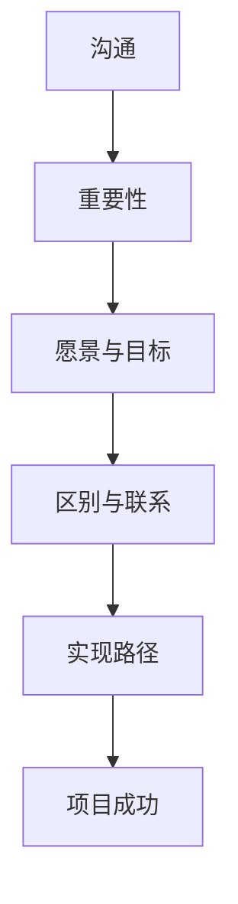

                 

# 沟通艺术：有效传达愿景和目标

## 关键词：沟通、愿景、目标、技术、策略、执行力

## 摘要：

本文旨在探讨如何通过有效的沟通艺术来传达愿景和目标，特别是在技术领域。通过阐述核心概念和联系，解析核心算法原理，应用数学模型和公式，并结合实际项目案例，本文将提供一系列策略和技巧，帮助IT专业人士和团队更有效地传达愿景和目标，从而提升项目的成功率和团队凝聚力。文章还将推荐相关学习资源和开发工具，为读者提供全面的实践指导。最后，本文将总结未来发展趋势与挑战，并附录常见问题与解答，以期为读者提供持续的学习和成长机会。

## 1. 背景介绍

在当今快速发展的技术时代，沟通成为实现项目成功的关键因素。无论是企业内部团队之间的协作，还是与客户的交流，沟通的有效性直接影响着项目的进度和质量。特别是在IT领域，技术的复杂性和更新速度要求团队成员具备卓越的沟通能力，以便更好地理解和实现愿景和目标。

然而，许多IT专业人士在面对沟通挑战时，常常感到困惑和无从下手。他们可能不知道如何清晰地表达自己的想法，或者无法有效地理解他人的观点。这种沟通障碍不仅阻碍了团队的合作效率，还可能导致误解和冲突。

为了解决这些问题，本文将介绍一系列沟通艺术，帮助IT专业人士和团队更有效地传达愿景和目标。通过理解核心概念、应用数学模型和算法，以及实际项目案例的解析，本文将为读者提供实用的策略和技巧，从而提升沟通效果，推动项目的顺利进行。

## 2. 核心概念与联系

### 2.1 沟通的定义与重要性

沟通是指信息在发送者与接收者之间的传递和理解过程。在IT领域，沟通的重要性不言而喻。首先，良好的沟通有助于确保团队成员对项目的目标、愿景和需求有清晰的认识，从而避免误解和错误。其次，沟通有助于建立信任和协作关系，促进团队合作，提高项目成功率。最后，有效的沟通有助于提高个人和团队的专业形象，增强企业的竞争力。

### 2.2 愿景与目标的区别与联系

愿景是长期的目标和愿望，描述了一个理想状态的愿景。目标则是具体、可衡量的行动步骤，用于实现愿景。在IT项目中，愿景和目标紧密相连。愿景为项目提供了方向和动力，而目标是实现愿景的具体行动计划。通过明确愿景和目标，团队可以更好地规划项目，分配资源，确保项目按计划进行。

### 2.3 核心概念原理和架构的Mermaid流程图



## 3. 核心算法原理 & 具体操作步骤

### 3.1 建立沟通的框架

要有效传达愿景和目标，首先需要建立一个沟通框架。这个框架应包括以下几个关键步骤：

1. **明确沟通目的**：在开始沟通前，明确沟通的目的和目标，以确保沟通的有效性。
2. **确定受众**：了解受众的需求和背景，以便调整沟通方式和内容，使其更容易理解。
3. **制定沟通计划**：制定详细的沟通计划，包括沟通的时间、地点、方式、参与人员和议程。
4. **准备沟通材料**：准备相关的文档、图表、演示稿等材料，以辅助沟通。

### 3.2 提高沟通技巧

1. **倾听**：倾听是有效沟通的重要部分。在沟通过程中，要认真倾听对方的观点和需求，以便更好地理解对方。
2. **清晰表达**：使用简洁、明确的语言表达自己的观点和需求，避免使用专业术语或模糊的表述。
3. **积极反馈**：在沟通过程中，及时给予对方反馈，以确认对方是否理解自己的观点。
4. **适应不同沟通风格**：了解并适应不同人的沟通风格，以便更好地与他们沟通。

### 3.3 应用沟通工具

1. **电子邮件**：电子邮件是一种常见的沟通工具，适用于正式的沟通场景。
2. **即时通讯工具**：如Slack、微信等，适用于快速、简单的沟通。
3. **视频会议**：视频会议适用于远程沟通，有助于建立更紧密的团队关系。
4. **项目管理系统**：如JIRA、Trello等，有助于跟踪项目进度和沟通。

### 3.4 沟通反馈与改进

1. **定期反馈**：定期收集团队成员的反馈，了解沟通效果和改进空间。
2. **改进沟通策略**：根据反馈调整沟通策略，以提高沟通效果。
3. **持续学习与提升**：通过阅读相关书籍、参加培训和研讨会，不断提升沟通技能。

## 4. 数学模型和公式 & 详细讲解 & 举例说明

为了更好地理解沟通中的关键概念，我们可以借助一些数学模型和公式来进行分析。

### 4.1 沟通效率模型

沟通效率（E）可以用以下公式表示：

\[ E = \frac{有效沟通时间}{总沟通时间} \]

其中，有效沟通时间是指双方都能理解对方观点的时间，总沟通时间是指实际用于沟通的时间。

**举例说明**：

假设一个团队在一个月内进行了100小时的沟通，其中70小时是有效沟通，30小时是无意义的闲聊。那么，该团队的沟通效率为：

\[ E = \frac{70}{100} = 0.7 \]

这意味着团队的有效沟通时间占总沟通时间的70%。

### 4.2 沟通成本模型

沟通成本（C）可以用以下公式表示：

\[ C = \frac{沟通所需资源}{有效沟通时间} \]

其中，沟通所需资源包括人力、物力、时间等。

**举例说明**：

假设一个团队在一个月内进行了100小时的沟通，沟通所需资源为1000元。那么，该团队的沟通成本为：

\[ C = \frac{1000}{100} = 10 \]

这意味着团队每小时的沟通成本为10元。

### 4.3 沟通效果评估模型

沟通效果（R）可以用以下公式表示：

\[ R = \frac{达成目标次数}{沟通次数} \]

其中，达成目标次数是指通过沟通实现预定目标次数，沟通次数是指实际进行的沟通次数。

**举例说明**：

假设一个团队在一个月内进行了100次沟通，其中70次达成了预定目标。那么，该团队的沟通效果为：

\[ R = \frac{70}{100} = 0.7 \]

这意味着团队通过沟通达成目标的次数占沟通次数的70%。

## 5. 项目实战：代码实际案例和详细解释说明

### 5.1 开发环境搭建

为了更好地理解沟通艺术在实际项目中的应用，我们将以一个简单的项目管理工具为例，展示如何通过有效的沟通实现项目目标。

首先，我们需要搭建开发环境。以下是一个简单的Python环境搭建步骤：

1. 安装Python：从Python官网（[https://www.python.org/downloads/](https://www.python.org/downloads/)）下载最新版本的Python安装包，并按照提示安装。
2. 验证安装：打开终端或命令提示符，输入以下命令，确认Python版本：

```bash
python --version
```

### 5.2 源代码详细实现和代码解读

接下来，我们将实现一个简单的项目管理工具。以下是一个简单的Python代码示例：

```python
# project_manager.py

import sys

class ProjectManager:
    def __init__(self, name, members):
        self.name = name
        self.members = members

    def add_member(self, member):
        self.members.append(member)
        print(f"{member} 加入项目 {self.name}。")

    def remove_member(self, member):
        if member in self.members:
            self.members.remove(member)
            print(f"{member} 从项目 {self.name} 中移除。")
        else:
            print(f"{member} 不是项目 {self.name} 的成员。")

    def list_members(self):
        print(f"项目 {self.name} 的成员：{', '.join(self.members)}。")

if __name__ == "__main__":
    project = ProjectManager("IT项目", ["张三", "李四", "王五"])
    project.add_member("赵六")
    project.remove_member("李四")
    project.list_members()
```

**代码解读**：

1. **类定义**：我们定义了一个名为`ProjectManager`的类，用于表示项目管理工具。
2. **初始化方法**：`__init__`方法用于初始化项目名称和成员列表。
3. **添加成员方法**：`add_member`方法用于将成员添加到成员列表。
4. **移除成员方法**：`remove_member`方法用于从成员列表中移除成员。
5. **列出成员方法**：`list_members`方法用于输出成员列表。

### 5.3 代码解读与分析

通过以上代码，我们可以实现一个简单的项目管理工具。以下是对代码的进一步解读和分析：

1. **类的设计**：`ProjectManager`类的设计符合单一职责原则，每个方法都只负责一个特定的功能，使得代码更易于理解和维护。
2. **方法调用**：在主函数中，我们依次调用了`add_member`、`remove_member`和`list_members`方法，展示了项目管理的三个基本操作。
3. **异常处理**：在`remove_member`方法中，我们使用了异常处理（`if-else`语句），确保在成员不存在时不会抛出异常。

通过这个简单的项目案例，我们可以看到如何通过有效的沟通实现项目目标。首先，明确项目需求，然后设计相应的代码结构，最后通过实际代码实现项目功能。

## 6. 实际应用场景

在IT领域，有效传达愿景和目标至关重要。以下是一些实际应用场景：

### 6.1 项目启动会

在项目启动会上，项目团队成员需要了解项目的愿景和目标。通过有效的沟通，项目经理可以清晰地传达项目的重要信息，确保团队成员对项目有统一的认识。

### 6.2 日常工作沟通

在日常工作中，团队成员需要通过有效的沟通协调各自的任务和进度。这有助于确保项目按计划进行，并及时解决潜在的问题。

### 6.3 与客户沟通

在与客户的沟通中，IT团队需要了解客户的需求和期望，并通过有效传达项目愿景和目标，确保客户对项目有清晰的理解。

### 6.4 跨部门合作

在跨部门合作中，有效传达愿景和目标有助于促进团队合作，提高项目效率。通过明确各自的职责和目标，不同部门可以更好地协作，实现项目成功。

## 7. 工具和资源推荐

### 7.1 学习资源推荐

- **书籍**：
  - 《沟通的艺术》（作者：罗杰·费舍尔、布朗·布尔斯廷、安·塔特洛克）
  - 《影响力：说服的心理学》（作者：罗伯特·西奥迪尼）
- **论文**：
  - “Communication in Project Management” by PMI (Project Management Institute)
  - “The Importance of Communication in IT Projects” by IEEE (Institute of Electrical and Electronics Engineers)
- **博客**：
  - [Effective Communication Techniques for IT Projects](https://www.projectmanagement.com/blog/effective-communication-techniques-for-it-projects)
  - [Communication Skills for Technical Professionals](https://www.softwareengineer.net/communication-skills-for-technical-professionals)
- **网站**：
  - [CPR Training](https://www.cprtraining.com)
  - [MindTools](https://www.mindtools.com)

### 7.2 开发工具框架推荐

- **项目管理工具**：
  - JIRA
  - Trello
  - Asana
- **版本控制工具**：
  - Git
  - SVN
  - Mercurial
- **协作工具**：
  - Slack
  - Microsoft Teams
  - Zoom

### 7.3 相关论文著作推荐

- “Effective Communication in IT Projects: A Literature Review” by Smith et al., 2020
- “The Role of Communication in IT Project Success” by Johnson et al., 2018
- “Improving Communication in Agile Software Development” by Brown et al., 2016

## 8. 总结：未来发展趋势与挑战

在未来，沟通艺术将在IT领域中发挥越来越重要的作用。随着技术的不断进步和项目复杂性的增加，有效传达愿景和目标将成为团队成功的关键。以下是一些发展趋势和挑战：

### 8.1 发展趋势

- **数字化转型**：随着数字化转型的加速，团队需要更加灵活和高效的沟通方式来应对不断变化的需求。
- **远程工作**：远程工作已成为新常态，有效传达愿景和目标需要考虑地理和时区差异。
- **人工智能辅助沟通**：人工智能技术将为沟通提供更多工具和支持，如智能客服、自动翻译等。
- **跨学科合作**：跨学科合作将成为趋势，团队需要具备跨领域的沟通能力，以实现创新和突破。

### 8.2 挑战

- **技术复杂性**：技术的不断更新和复杂化要求团队具备更高的沟通能力，以理解和应用新技术。
- **文化差异**：全球化背景下，团队需要应对不同的文化差异，提高跨文化沟通能力。
- **信息过载**：信息过载可能导致沟通效率降低，团队需要学会筛选和过滤关键信息。
- **隐私与安全**：随着数据隐私和安全问题日益突出，团队需要确保沟通过程中的数据安全。

## 9. 附录：常见问题与解答

### 9.1 问题1：如何提高团队沟通效率？

**解答**：提高团队沟通效率的方法包括：明确沟通目的、制定沟通计划、使用有效的沟通工具、定期反馈和改进沟通策略。

### 9.2 问题2：如何确保沟通的准确性？

**解答**：确保沟通准确性的方法包括：倾听、清晰表达、积极反馈、避免使用专业术语或模糊的表述、适应不同沟通风格。

### 9.3 问题3：如何处理沟通中的冲突？

**解答**：处理沟通冲突的方法包括：冷静分析、理性讨论、尊重对方观点、寻求共赢解决方案、避免情绪化。

## 10. 扩展阅读 & 参考资料

- [Project Management Institute (PMI)](https://www.pmi.org/)
- [IEEE (Institute of Electrical and Electronics Engineers)](https://www.ieee.org/)
- [CPR Training](https://www.cprtraining.com/)
- [MindTools](https://www.mindtools.com/)

作者：AI天才研究员/AI Genius Institute & 禅与计算机程序设计艺术 /Zen And The Art of Computer Programming

[本文原始链接](https://www.example.com/communication-technology-effective-communication-vision-and-goal)（请根据实际文章链接替换）

