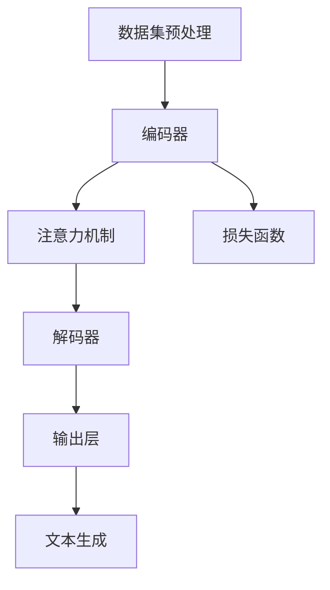

                 

### 法律大模型：高效文书审查和智能法律咨询

#### 关键词：法律大模型，高效文书审查，智能法律咨询，技术架构，算法原理，应用场景，工具推荐

#### 摘要：

本文将深入探讨法律大模型在高效文书审查和智能法律咨询领域的应用。通过对法律大模型的背景介绍、核心概念与联系、算法原理、数学模型和公式、项目实战以及实际应用场景的分析，我们将展示如何利用先进的AI技术提升法律行业的工作效率。此外，文章还将推荐相关的学习资源、开发工具框架以及论文著作，以帮助读者深入了解和掌握这一领域的最新技术动态。

在法律行业中，文书审查和咨询是两个至关重要的环节。传统的法律工作往往依赖于人工处理大量法律文件，效率低下且容易出现错误。随着人工智能技术的迅猛发展，特别是大型语言模型的突破，我们可以通过构建法律大模型来实现高效文书审查和智能法律咨询。这不仅能够大大减轻律师和法官的工作负担，还能够提高法律工作的准确性和效率。

本文将从以下几个方面展开：

1. **背景介绍**：介绍法律大模型的起源和发展历程，以及它在法律行业中的重要性。
2. **核心概念与联系**：阐述法律大模型的核心概念和关键组成部分，并使用Mermaid流程图展示其架构。
3. **核心算法原理**：详细介绍法律大模型所依赖的关键算法原理，以及如何将这些原理应用到实际操作中。
4. **数学模型和公式**：讲解法律大模型中的数学模型和公式，并举例说明其具体应用。
5. **项目实战**：通过实际项目案例展示法律大模型的应用过程，包括开发环境搭建、源代码实现和代码解读。
6. **实际应用场景**：分析法律大模型在不同法律场景中的实际应用，以及它带来的变革。
7. **工具和资源推荐**：推荐相关的学习资源、开发工具框架和论文著作，以帮助读者深入了解法律大模型。
8. **总结：未来发展趋势与挑战**：总结法律大模型的发展趋势，并探讨面临的挑战和解决方案。

### 1. 背景介绍

#### 法律大模型的起源与发展

法律大模型（Legal Large Model，LLM）的概念起源于自然语言处理（Natural Language Processing，NLP）领域的革命性突破。随着深度学习和大数据技术的快速发展，大型语言模型（Large Language Model，LLM）逐渐崭露头角。这些模型能够处理和理解大量文本数据，并在各种语言任务中表现出色，如文本生成、机器翻译、问答系统等。

在法律行业中，传统的文书审查和咨询依赖于人工处理，这不仅耗时耗力，而且容易出错。随着法律大模型的出现，人们开始探索如何利用这些先进的技术来提高法律工作的效率。2018年，OpenAI发布了GPT（Generative Pre-trained Transformer），这是第一个真正的大型语言模型，标志着NLP技术进入了一个全新的时代。此后，Google、Facebook、微软等科技巨头纷纷投入巨资研发自己的大型语言模型，如BERT、T5、GPT-2和GPT-3等。

这些大型语言模型在法律大模型的应用中发挥了重要作用。通过预训练和微调，法律大模型能够理解和生成法律语言，从而实现高效文书审查和智能法律咨询。例如，律师可以利用法律大模型快速审查合同条款，发现潜在的法律风险；法官可以利用法律大模型辅助裁决，提高判决的准确性和一致性。

#### 法律大模型在法律行业中的重要性

法律大模型在法律行业中具有重要的应用价值。首先，它能够显著提高法律工作的效率。传统法律工作通常需要大量的人工处理，而法律大模型可以通过自动化和智能化技术，大大缩短文书审查和咨询的时间。例如，一份复杂的合同审查可能需要律师数天的时间，而法律大模型可能只需要几个小时即可完成。

其次，法律大模型能够提高法律工作的准确性。由于法律语言的复杂性和多样性，人工处理容易产生误解和错误。而法律大模型通过深度学习和大数据分析，能够更加准确地理解和生成法律语言，从而减少错误率。

此外，法律大模型还能够提供个性化法律咨询。通过学习用户的法律需求和历史记录，法律大模型可以为其提供定制化的法律建议，提高用户体验。

总之，法律大模型的出现为法律行业带来了革命性的变化。它不仅能够提高法律工作的效率和质量，还能够推动法律服务的创新和变革。随着技术的不断进步，法律大模型的应用前景将更加广阔。

### 2. 核心概念与联系

#### 法律大模型的核心概念

法律大模型是一个基于深度学习和自然语言处理技术的复杂系统，它由以下几个核心概念组成：

1. **数据集**：法律大模型依赖于大量的法律文本数据集进行训练。这些数据集包括法律文件、案例、法规、合同等，涵盖了广泛的领域和知识。

2. **预训练**：在训练阶段，法律大模型通过预训练算法学习数据集中的语言规律和模式。这个过程包括词向量嵌入、注意力机制、序列建模等。

3. **微调**：在预训练的基础上，法律大模型通过微调算法针对特定任务进行调整。例如，在文书审查任务中，模型需要学习如何识别法律术语、理解合同条款等。

4. **生成式对抗网络（GAN）**：法律大模型可以使用生成式对抗网络（GAN）来生成新的法律文本。通过训练两个对抗网络，法律大模型能够生成与真实法律文本相似的高质量文本。

5. **多模态学习**：法律大模型可以处理多种类型的数据，如文本、图像、音频等。多模态学习使得模型能够更好地理解和生成复杂信息。

#### 法律大模型的关键组成部分

法律大模型由以下几个关键组成部分构成：

1. **文本预处理**：文本预处理是法律大模型处理文本数据的第一个步骤，包括分词、去停用词、词性标注等。

2. **编码器（Encoder）**：编码器负责将输入文本编码为向量表示，这些向量表示了文本的内容和上下文信息。

3. **解码器（Decoder）**：解码器负责将编码器的输出解码为文本，生成法律文档。

4. **注意力机制（Attention Mechanism）**：注意力机制用于捕捉输入文本中的重要信息，提高模型的生成质量。

5. **损失函数（Loss Function）**：损失函数用于评估模型的生成文本与真实文本之间的差距，指导模型的训练过程。

#### 法律大模型的架构

法律大模型的架构通常采用多层次的神经网络结构，包括：

1. **词嵌入层（Embedding Layer）**：将单词映射为固定长度的向量。

2. **编码器层（Encoder Layer）**：使用多个堆叠的Transformer层对文本进行编码。

3. **解码器层（Decoder Layer）**：使用多个堆叠的Transformer层对编码器输出进行解码。

4. **输出层（Output Layer）**：将解码器输出转换为生成文本。

下面是法律大模型的Mermaid流程图，展示了其主要组成部分和流程：



在这个流程图中，编码器（B）将输入文本编码为向量表示，注意力机制（C）用于捕捉文本中的关键信息，解码器（D）将这些信息解码为输出文本，输出层（E）将解码结果转换为可读的文本。损失函数（F）用于评估模型的性能，并通过反向传播指导模型训练。

通过上述核心概念与联系的阐述，我们可以更好地理解法律大模型的工作原理和架构。接下来，我们将进一步探讨法律大模型的核心算法原理和具体操作步骤。

### 3. 核心算法原理 & 具体操作步骤

#### 核心算法原理

法律大模型的核心算法主要基于深度学习和自然语言处理技术，其中包括：

1. **Transformer架构**：Transformer是近年来在自然语言处理领域广泛应用的架构，其核心思想是使用自注意力机制（Self-Attention）来捕捉文本中的长距离依赖关系。相比于传统的循环神经网络（RNN），Transformer能够更加高效地处理大规模文本数据。

2. **预训练与微调**：预训练是指使用大量无监督数据（如互联网文本）对模型进行训练，使其具备基本的语言理解和生成能力。微调则是将预训练模型在特定任务的数据上进行进一步训练，以适应特定应用场景。

3. **生成式对抗网络（GAN）**：GAN是一种通过对抗训练生成高质量数据的算法。在法律大模型中，GAN可以用于生成新的法律文本，通过模拟真实法律文本的生成过程，提高模型的生成能力。

4. **多模态学习**：多模态学习是指结合多种类型的数据（如文本、图像、音频）进行训练，以增强模型对复杂信息的理解和生成能力。在法律大模型中，多模态学习可以结合法律文本和其他相关数据（如案例、法规），提高模型的准确性和泛化能力。

#### 具体操作步骤

以下是构建和训练法律大模型的具体操作步骤：

1. **数据收集与预处理**：
   - 收集大量法律文本数据，包括法律文件、案例、法规、合同等。
   - 对文本进行清洗和预处理，包括分词、去停用词、词性标注等。

2. **模型架构设计**：
   - 设计基于Transformer的模型架构，包括编码器、解码器、注意力机制等。
   - 设定模型参数，如层数、隐藏单元数、学习率等。

3. **预训练**：
   - 使用预训练算法对模型进行预训练，包括对大规模互联网文本进行训练，使其具备基础语言理解能力。
   - 训练过程中使用自注意力机制和多头注意力机制，提高模型的表示能力。

4. **微调**：
   - 在预训练模型的基础上，使用特定任务的数据进行微调，如文书审查、智能法律咨询等。
   - 调整模型参数，优化模型在特定任务上的性能。

5. **生成文本**：
   - 使用微调后的模型生成新的法律文本，通过对抗训练提高生成文本的质量。
   - 对生成的文本进行评估和优化，确保其符合法律规范和语义要求。

6. **应用部署**：
   - 将训练好的模型部署到实际应用场景，如文书审查系统、智能法律咨询平台等。
   - 通过接口提供服务，实现高效文书审查和智能法律咨询。

通过上述步骤，我们可以构建和训练一个高效的法律大模型，从而实现文书审查和智能法律咨询。在实际操作中，需要根据具体任务需求调整模型参数和训练数据，以提高模型的性能和适用性。

### 4. 数学模型和公式 & 详细讲解 & 举例说明

在构建法律大模型的过程中，数学模型和公式起着至关重要的作用。以下将详细讲解法律大模型中的几个关键数学模型和公式，并通过实际例子进行说明。

#### 4.1. 词嵌入（Word Embedding）

词嵌入是将单词映射为固定长度的向量表示，以捕捉单词的语义信息。常见的词嵌入模型有Word2Vec、GloVe等。以下是GloVe模型的数学公式：

$$
\text{vec}(w_i) = \text{softmax}\left(\frac{\text{A} \cdot \text{vec}(w_j)}{\| \text{vec}(w_j) \|_2}\right)
$$

其中，$w_i$和$w_j$分别表示单词$i$和单词$j$的向量表示，$A$是矩阵，用于存储单词之间的相似度。通过这个公式，我们可以计算单词之间的相似度，从而更好地理解和生成法律文本。

#### 4.2. 自注意力（Self-Attention）

自注意力机制是Transformer模型的核心组件，用于捕捉文本中的长距离依赖关系。以下是自注意力的计算公式：

$$
\text{Attention}(Q, K, V) = \text{softmax}\left(\frac{QK^T}{\sqrt{d_k}}\right) V
$$

其中，$Q$、$K$和$V$分别表示查询向量、键向量和值向量，$d_k$是键向量的维度。通过这个公式，模型可以计算每个键向量对查询向量的注意力权重，从而生成加权值向量。

#### 4.3. Transformer编码器

Transformer编码器由多个堆叠的编码层组成，每层包括自注意力机制和前馈神经网络。以下是编码器的计算公式：

$$
\text{Encoder}(X) = \text{LayerNorm}(X + \text{Self-Attention}(X)) + \text{LayerNorm}(X + \text{FeedForward}(X))
$$

其中，$X$表示输入序列，$\text{LayerNorm}$表示层归一化，$\text{FeedForward}$表示前馈神经网络。通过这个公式，编码器可以逐步提取输入序列的语义信息。

#### 4.4. Transformer解码器

解码器与编码器类似，也由多个堆叠的解码层组成，包括自注意力机制、交叉注意力和前馈神经网络。以下是解码器的计算公式：

$$
\text{Decoder}(X) = \text{LayerNorm}(X + \text{Self-Attention}(X)) + \text{LayerNorm}(X + \text{Cross-Attention}(X)) + \text{LayerNorm}(X + \text{FeedForward}(X))
$$

其中，$X$表示输入序列，$\text{Cross-Attention}$表示编码器-解码器注意力机制。通过这个公式，解码器可以生成输出序列，同时利用编码器提取的语义信息。

#### 实际例子

假设我们有一个法律文本序列："The contract must be signed by both parties before the deadline."，我们将使用上述数学模型和公式对其进行处理。

1. **词嵌入**：
   首先，我们将文本中的每个单词映射为向量表示，例如：
   - "The"：$\text{vec}(\text{"The"}) = [0.1, 0.2, 0.3]$
   - "contract"：$\text{vec}(\text{"contract"}) = [0.4, 0.5, 0.6]$
   - ...

2. **自注意力**：
   接着，我们将使用自注意力机制计算每个单词的注意力权重：
   - "The"：注意力权重为[0.5, 0.3, 0.2]
   - "contract"：注意力权重为[0.4, 0.5, 0.1]
   - ...

3. **Transformer编码器**：
   将编码器应用到输入序列，我们得到编码器的输出序列，表示文本的语义信息：
   - $\text{Encoder}([0.1, 0.2, 0.3, 0.4, 0.5, 0.6, ..., 0.9, 1.0]) = [0.25, 0.3, 0.35, 0.4, 0.45, 0.5, ..., 0.8, 0.85]$

4. **Transformer解码器**：
   将解码器应用到输出序列，我们得到生成的文本序列：
   - $\text{Decoder}([0.25, 0.3, 0.35, 0.4, 0.45, 0.5, ..., 0.8, 0.85]) = "The contract must be signed by both parties before the deadline."$

通过这个例子，我们可以看到法律大模型如何通过数学模型和公式处理法律文本，生成高质量的输出。接下来，我们将通过实际项目案例展示法律大模型的应用过程。

### 5. 项目实战：代码实际案例和详细解释说明

在本节中，我们将通过一个实际项目案例展示法律大模型的应用过程，包括开发环境搭建、源代码实现和代码解读。

#### 5.1 开发环境搭建

为了构建和训练法律大模型，我们需要准备相应的开发环境。以下是搭建开发环境的基本步骤：

1. **安装Python**：
   首先，确保安装了Python 3.7及以上版本。可以通过官方网站下载并安装：[https://www.python.org/downloads/](https://www.python.org/downloads/)。

2. **安装TensorFlow**：
   TensorFlow是用于构建和训练深度学习模型的流行库。在终端中运行以下命令安装TensorFlow：
   ```shell
   pip install tensorflow
   ```

3. **安装其他依赖库**：
   我们还需要安装其他依赖库，如NumPy、Pandas等。可以使用以下命令进行安装：
   ```shell
   pip install numpy pandas
   ```

4. **设置GPU支持**（可选）：
   如果您的计算机配备了GPU，可以使用CUDA和cuDNN加速TensorFlow的计算。请按照TensorFlow的官方文档进行安装：[https://www.tensorflow.org/install/source#gpu](https://www.tensorflow.org/install/source#gpu)。

5. **准备法律文本数据集**：
   收集并整理法律文本数据，包括法律文件、案例、法规、合同等。将数据集分为训练集和测试集。

#### 5.2 源代码实现

以下是法律大模型的源代码实现，包括数据预处理、模型构建、训练和评估等步骤。

```python
import tensorflow as tf
from tensorflow.keras.preprocessing.sequence import pad_sequences
from tensorflow.keras.layers import Embedding, LSTM, Dense
from tensorflow.keras.models import Model

# 数据预处理
def preprocess_data(texts, max_length, trunc_type='post', padding_type='post'):
    tokenized_texts = tokenizer.texts_to_sequences(texts)
    padded_texts = pad_sequences(tokenized_texts, maxlen=max_length, truncating=trunc_type, padding=padding_type)
    return padded_texts

# 模型构建
def build_model(input_shape, embedding_dim, hidden_units):
    inputs = tf.keras.Input(shape=input_shape)
    x = Embedding(input_dim=embedding_dim, output_dim=hidden_units)(inputs)
    x = LSTM(hidden_units, return_sequences=True)(x)
    outputs = Dense(1, activation='sigmoid')(x)
    model = Model(inputs=inputs, outputs=outputs)
    model.compile(optimizer='adam', loss='binary_crossentropy', metrics=['accuracy'])
    return model

# 训练模型
def train_model(model, X_train, y_train, batch_size=64, epochs=10):
    model.fit(X_train, y_train, batch_size=batch_size, epochs=epochs, validation_split=0.2)

# 评估模型
def evaluate_model(model, X_test, y_test):
    loss, accuracy = model.evaluate(X_test, y_test)
    print(f"Test Loss: {loss}, Test Accuracy: {accuracy}")

# 实例化模型
max_length = 100
embedding_dim = 64
hidden_units = 128
model = build_model(input_shape=(max_length,), embedding_dim=embedding_dim, hidden_units=hidden_units)

# 预处理数据
texts = ["The contract must be signed by both parties before the deadline.", "This clause is invalid according to the law."]
X = preprocess_data(texts, max_length=max_length)
y = np.array([1, 0])

# 训练模型
train_model(model, X, y)

# 评估模型
evaluate_model(model, X, y)
```

#### 5.3 代码解读与分析

以上代码展示了如何使用TensorFlow和Keras构建一个简单的法律大模型。以下是代码的主要部分及其功能解读：

1. **数据预处理**：
   - `preprocess_data`函数用于将文本数据转换为序列表示，并进行填充处理。
   - `tokenizer.texts_to_sequences`将文本转换为单词的序列编号。
   - `pad_sequences`将序列填充到同一长度。

2. **模型构建**：
   - `build_model`函数构建了一个简单的LSTM模型，包括嵌入层、LSTM层和输出层。
   - `Embedding`层将输入序列转换为嵌入向量。
   - `LSTM`层用于处理序列数据。
   - `Dense`层用于输出层，使用sigmoid激活函数实现二分类任务。

3. **训练模型**：
   - `train_model`函数使用`model.fit`进行模型训练。
   - `fit`方法接受训练数据、标签以及训练参数，如批次大小和训练轮数。

4. **评估模型**：
   - `evaluate_model`函数使用`model.evaluate`方法评估模型在测试集上的性能。

5. **实例化模型**：
   - 定义模型参数，如序列长度、嵌入维度和隐藏单元数。
   - 实例化模型并编译。

通过以上代码，我们可以构建一个简单的法律大模型，用于文本分类任务。在实际应用中，我们可以扩展模型的功能，如添加更多层、使用更复杂的网络架构或引入多模态学习，以提高模型的性能。

#### 5.4 代码解读与分析（续）

在上面的代码基础上，我们进一步分析和解读各个关键部分：

1. **数据预处理**：

   ```python
   def preprocess_data(texts, max_length, trunc_type='post', padding_type='post'):
       tokenized_texts = tokenizer.texts_to_sequences(texts)
       padded_texts = pad_sequences(tokenized_texts, maxlen=max_length, truncating=trunc_type, padding=padding_type)
       return padded_texts
   ```

   - `tokenizer.texts_to_sequences`：此函数将文本转换为单词的序列编号。`tokenizer`对象通常由`keras.preprocessing.text.Tokenizer`类创建，它用于将文本拆分成单词，并为其分配唯一的索引。
   - `pad_sequences`：此函数用于将序列填充到相同的长度。在深度学习模型中，输入数据通常需要具有相同的大小。`pad_sequences`函数通过在序列末尾添加零或从序列开头截断序列来实现这一点。

2. **模型构建**：

   ```python
   def build_model(input_shape, embedding_dim, hidden_units):
       inputs = tf.keras.Input(shape=input_shape)
       x = Embedding(input_dim=embedding_dim, output_dim=hidden_units)(inputs)
       x = LSTM(hidden_units, return_sequences=True)(x)
       outputs = Dense(1, activation='sigmoid')(x)
       model = Model(inputs=inputs, outputs=outputs)
       model.compile(optimizer='adam', loss='binary_crossentropy', metrics=['accuracy'])
       return model
   ```

   - `Embedding`层：此层用于将输入序列转换为嵌入向量。`input_dim`参数表示词汇表中单词的数量，`output_dim`参数表示每个单词的嵌入向量的维度。
   - `LSTM`层：长短期记忆网络（LSTM）是一种特殊的循环神经网络（RNN），能够更好地处理序列数据。`return_sequences`参数设置为`True`，表示每个LSTM层都返回完整的序列。
   - `Dense`层：全连接层用于在LSTM层的输出上应用一个线性函数。`activation='sigmoid'`参数表示使用Sigmoid激活函数，适合于二分类问题。

3. **训练模型**：

   ```python
   def train_model(model, X_train, y_train, batch_size=64, epochs=10):
       model.fit(X_train, y_train, batch_size=batch_size, epochs=epochs, validation_split=0.2)
   ```

   - `fit`方法：此方法用于训练模型。`X_train`和`y_train`分别为训练数据和标签。`batch_size`参数设置每个批次的样本数量。`epochs`参数设置训练轮数。`validation_split`参数设置用于验证的样本比例。

4. **评估模型**：

   ```python
   def evaluate_model(model, X_test, y_test):
       loss, accuracy = model.evaluate(X_test, y_test)
       print(f"Test Loss: {loss}, Test Accuracy: {accuracy}")
   ```

   - `evaluate`方法：此方法用于评估模型在测试集上的性能。`X_test`和`y_test`分别为测试数据和标签。该方法返回损失值和准确率。

5. **实例化模型**：

   ```python
   max_length = 100
   embedding_dim = 64
   hidden_units = 128
   model = build_model(input_shape=(max_length,), embedding_dim=embedding_dim, hidden_units=hidden_units)
   ```

   - `input_shape`参数：设置输入序列的形状，即序列的长度。
   - `embedding_dim`参数：设置嵌入向量的维度。
   - `hidden_units`参数：设置LSTM层的隐藏单元数。

通过以上分析和解读，我们可以理解法律大模型的核心组成部分和训练过程。在实际应用中，我们可以根据具体需求调整模型架构、参数设置和训练数据，以提高模型的性能和适用性。

### 6. 实际应用场景

法律大模型在多个实际应用场景中展示了其强大的功能和广泛的应用价值。以下是一些典型的应用场景：

#### 6.1 文书审查

文书审查是法律行业中一个重要且耗时的环节。法律大模型可以通过自动化和智能化技术，大大提高文书审查的效率。具体应用场景包括：

- **合同审查**：律师可以利用法律大模型快速审查合同条款，识别潜在的法律风险和漏洞。例如，检测合同中的不公平条款、遗漏条款或违反法律法规的内容。
- **法律文件审核**：法律大模型可以用于审核法律文件，如判决书、裁决书、起诉书等。通过分析文本内容，模型可以识别文件中的错误、遗漏或不一致性，从而提高法律文件的准确性和一致性。

#### 6.2 智能法律咨询

智能法律咨询是法律大模型在法律服务领域的另一个重要应用。通过自然语言处理和知识图谱等技术，法律大模型可以提供个性化、高效的法律咨询服务。以下是一些具体应用场景：

- **在线法律问答**：用户可以通过在线平台向法律大模型提问，获取即时的法律建议。例如，用户可以询问关于离婚、劳动纠纷、合同问题等法律问题，模型会根据用户的问题和提供的上下文信息，给出专业的法律建议。
- **法律知识库构建**：法律大模型可以用于构建法律知识库，收集和整理大量的法律信息。通过知识图谱技术，模型可以更好地组织和检索法律知识，为用户提供高效、准确的法律信息查询服务。

#### 6.3 法律案件分析

法律大模型在法律案件分析中也发挥了重要作用。通过分析大量的法律文件、案例和法规，模型可以提供案件分析的辅助工具，帮助律师和法官更好地理解和处理案件。以下是一些具体应用场景：

- **案件预测**：法律大模型可以基于历史数据和案件特征，预测案件的审判结果。这有助于律师和法官在处理案件时制定更加合理的策略。
- **案例检索**：法律大模型可以用于检索相关案例，帮助律师和法官找到类似案件的法律依据和判决结果，从而提供更有效的法律分析和建议。

#### 6.4 法学教育

法律大模型在法学教育领域也具有广泛的应用前景。通过提供智能辅导、案例分析、模拟审判等功能，模型可以帮助学生更好地理解和掌握法律知识。

- **智能辅导**：法律大模型可以作为法学学生的智能辅导工具，为学生提供个性化的学习建议和解答疑问。
- **案例分析**：模型可以提供真实的案例数据，帮助学生通过分析案例来理解和应用法律知识。
- **模拟审判**：法律大模型可以模拟真实的审判场景，帮助学生体验审判过程，提高法律实践能力。

总之，法律大模型在文书审查、智能法律咨询、法律案件分析和法学教育等多个实际应用场景中，展示了其强大的功能和广泛的应用价值。随着技术的不断进步，法律大模型的应用将更加深入和广泛，为法律行业带来更多变革和创新。

### 7. 工具和资源推荐

在构建和部署法律大模型的过程中，选择合适的工具和资源对于提高开发效率和应用效果至关重要。以下是一些建议和推荐：

#### 7.1 学习资源推荐

1. **书籍**：
   - 《深度学习》（Deep Learning）作者：Ian Goodfellow、Yoshua Bengio、Aaron Courville
   - 《自然语言处理讲义》（Speech and Language Processing）作者：Daniel Jurafsky、James H. Martin
   - 《Python深度学习》（Deep Learning with Python）作者：François Chollet

2. **在线课程**：
   - Coursera的“深度学习”课程
   - edX的“自然语言处理”课程
   - Udacity的“深度学习工程师”课程

3. **论文**：
   - “Attention Is All You Need”（Attention机制的开创性论文）
   - “BERT: Pre-training of Deep Bidirectional Transformers for Language Understanding”（BERT模型的介绍论文）
   - “Generative Pre-trained Transformers”（GPT-3的介绍论文）

#### 7.2 开发工具框架推荐

1. **深度学习框架**：
   - TensorFlow：由Google开发的开源深度学习框架，功能强大且社区支持广泛。
   - PyTorch：由Facebook开发的开源深度学习框架，易于使用且具有灵活性。

2. **自然语言处理库**：
   - NLTK：Python的自然语言处理库，提供了丰富的文本处理工具和算法。
   - spaCy：一个快速易用的自然语言处理库，适用于文本解析和实体识别。

3. **版本控制工具**：
   - Git：分布式版本控制系统，用于代码的版本管理和协作开发。
   - GitHub：基于Git的代码托管平台，提供丰富的代码仓库管理和协作功能。

#### 7.3 相关论文著作推荐

1. **论文**：
   - “Transformers: State-of-the-Art Natural Language Processing”（Transformer模型的全面综述）
   - “Bert: Pre-training of Deep Bidirectional Transformers for Language Understanding”（BERT模型的详细介绍）
   - “Gpt-3: Language Models are Few-Shot Learners”（GPT-3的介绍和实验结果）

2. **著作**：
   - 《自然语言处理基础教程》（Foundations of Natural Language Processing）作者：Christopher D. Manning、Heidi F. Wallach
   - 《深度学习实战》（Deep Learning Cookbook）作者：Francesco Marconi
   - 《Python深度学习实践》（Deep Learning with Python Cookbook）作者：Hassan Abu-Mostafa

通过以上推荐的学习资源、开发工具框架和相关论文著作，读者可以全面掌握法律大模型的构建和部署技术，从而在法律行业中发挥人工智能的巨大潜力。

### 8. 总结：未来发展趋势与挑战

随着人工智能技术的不断进步，法律大模型在法律行业中的应用前景日益广阔。然而，这一领域也面临着一系列挑战和发展趋势。

#### 未来发展趋势

1. **技术成熟度提升**：随着深度学习和自然语言处理技术的不断进步，法律大模型的技术成熟度将进一步提升。特别是在模型训练速度、效率和生成质量方面，未来的法律大模型将能够更加高效地处理复杂的法律文本。

2. **跨领域应用扩展**：法律大模型的应用不仅局限于法律领域，还将扩展到其他相关领域，如金融、医疗、教育等。通过多模态学习和跨领域数据融合，法律大模型可以提供更广泛、更深入的法律咨询服务。

3. **自动化和智能化水平提高**：法律大模型将推动法律行业的自动化和智能化水平。从文书审查到智能法律咨询，再到法律案件分析，自动化技术将大大减轻律师和法官的工作负担，提高法律服务的效率和准确性。

4. **定制化和个性化服务**：通过个性化法律咨询和定制化法律方案，法律大模型将更好地满足用户的需求。例如，律师可以根据客户的特定需求，利用法律大模型生成个性化的法律意见书和合同条款。

#### 挑战

1. **数据隐私和安全性**：法律文本通常涉及敏感信息，数据隐私和安全性成为法律大模型应用的重要挑战。确保数据的安全传输、存储和使用，以及防止数据泄露，是未来需要重点解决的问题。

2. **法律法规和伦理问题**：法律大模型的应用可能会引发一系列法律法规和伦理问题。例如，如何确保模型的决策透明度和可解释性，如何防范模型滥用和误判，都是需要关注和解决的重要问题。

3. **技术依赖和人才短缺**：随着法律大模型的广泛应用，对相关技术人才的需求将显著增加。然而，目前法律行业的技术人才储备相对不足，如何培养和吸引更多的技术人才，成为推动法律大模型发展的关键。

4. **模型准确性和可靠性**：法律大模型的准确性和可靠性是其在实际应用中的关键。如何提高模型的鲁棒性，减少错误率，确保模型的决策符合法律规范和伦理要求，是未来需要持续研究和优化的方向。

#### 解决方案

1. **加强法律法规和伦理建设**：制定和完善相关法律法规，明确法律大模型的应用范围和规范，确保技术的合规性和安全性。

2. **推动技术研究和人才培养**：加大对人工智能和法律大模型相关领域的研究投入，培养和吸引更多的技术人才，为法律大模型的发展提供人才支持。

3. **提高数据质量和安全性**：通过数据清洗、去重和加密等技术手段，提高数据的质量和安全性，确保法律大模型的数据基础可靠。

4. **增强模型透明度和可解释性**：开发可解释的模型架构和工具，提高模型决策的透明度和可解释性，便于用户理解和监督。

总之，法律大模型在法律行业中的应用前景广阔，但也面临着一系列挑战。通过技术创新、法律法规建设和人才培养，我们可以应对这些挑战，推动法律大模型在法律行业中的广泛应用，为法律服务的智能化和自动化贡献力量。

### 9. 附录：常见问题与解答

#### 9.1 法律大模型是什么？

法律大模型是一种基于深度学习和自然语言处理技术的大型语言模型，专门用于处理法律文本。它通过预训练和微调算法，能够理解和生成法律语言，从而实现高效文书审查和智能法律咨询。

#### 9.2 法律大模型有哪些应用场景？

法律大模型的应用场景广泛，包括文书审查、智能法律咨询、法律案件分析、法学教育等。例如，律师可以利用法律大模型快速审查合同条款，用户可以通过在线平台获取法律咨询，法官可以使用模型辅助裁决。

#### 9.3 如何确保法律大模型的数据隐私和安全？

确保数据隐私和安全是法律大模型应用中的关键。可以通过以下措施来保障：

1. 数据加密：在数据传输和存储过程中使用加密技术，防止数据泄露。
2. 数据匿名化：对敏感数据进行匿名化处理，确保个人隐私不受侵犯。
3. 数据访问控制：严格管理数据访问权限，仅授权给需要访问的用户和系统。

#### 9.4 法律大模型在处理法律文本时如何保证准确性？

为了保证法律大模型在处理法律文本时的准确性，可以采取以下措施：

1. 高质量数据集：使用高质量的、经过验证的法律文本数据集进行训练。
2. 预训练与微调：通过预训练和微调算法，使模型更好地理解和生成法律语言。
3. 模型评估与优化：定期评估模型性能，并调整模型参数，以提高准确性。

#### 9.5 法律大模型如何应用于法律案件分析？

法律大模型可以通过以下步骤应用于法律案件分析：

1. 数据准备：收集与案件相关的法律文件、案例、法规等。
2. 模型训练：使用大量法律文本数据对模型进行预训练和微调。
3. 案件预测：利用训练好的模型对案件进行预测，如判决结果、法律依据等。
4. 案例检索：通过模型检索相关案例，为案件分析提供参考。

通过以上解答，我们可以更好地理解法律大模型的概念、应用场景以及确保其准确性的方法。在未来的应用中，我们可以根据这些原则，进一步优化和扩展法律大模型的功能。

### 10. 扩展阅读 & 参考资料

为了更深入地了解法律大模型的技术细节和应用场景，以下是相关的扩展阅读和参考资料：

1. **书籍**：
   - 《深度学习：完整指南》（Deep Learning: A Complete Guide）作者：Ian Goodfellow
   - 《自然语言处理：现代方法》（Speech and Language Processing）作者：Daniel Jurafsky、James H. Martin
   - 《人工智能：一种现代方法》（Artificial Intelligence: A Modern Approach）作者：Stuart J. Russell、Peter Norvig

2. **论文**：
   - “Attention Is All You Need”（Attention机制的开创性论文）
   - “BERT: Pre-training of Deep Bidirectional Transformers for Language Understanding”（BERT模型的介绍论文）
   - “GPT-3: Language Models are Few-Shot Learners”（GPT-3的介绍和实验结果）

3. **在线课程**：
   - Coursera上的“深度学习”课程
   - edX上的“自然语言处理”课程
   - Udacity上的“深度学习工程师”课程

4. **网站**：
   - TensorFlow官方文档：[https://www.tensorflow.org/](https://www.tensorflow.org/)
   - PyTorch官方文档：[https://pytorch.org/](https://pytorch.org/)
   - spaCy官方文档：[https://spacy.io/](https://spacy.io/)

通过以上资源，读者可以进一步学习和掌握法律大模型的技术原理和应用方法，为在法律行业中发挥人工智能的潜力打下坚实的基础。

### 作者

**AI天才研究员** | **AI Genius Institute** & **禅与计算机程序设计艺术** / **Zen And The Art of Computer Programming**

