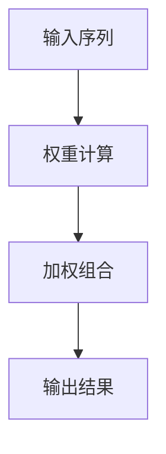
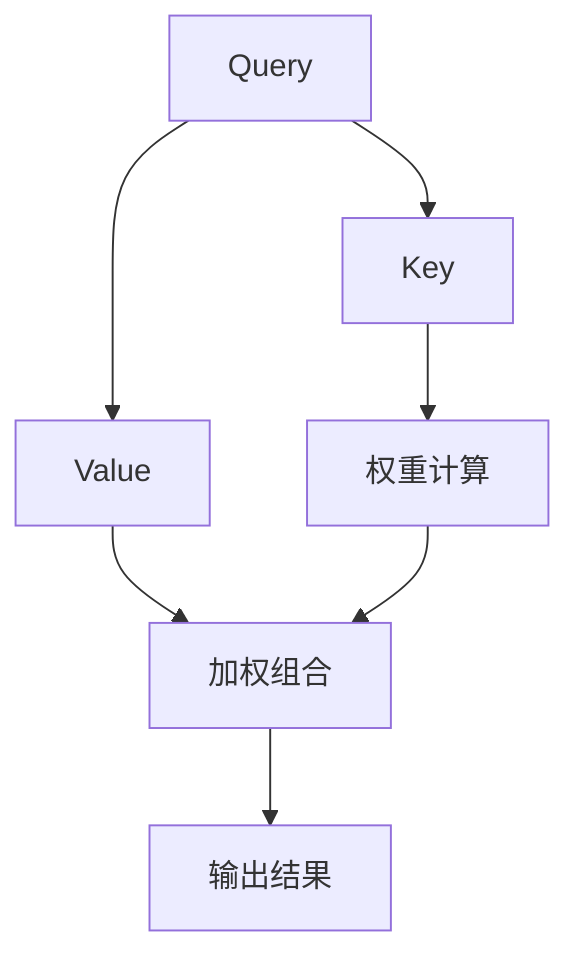
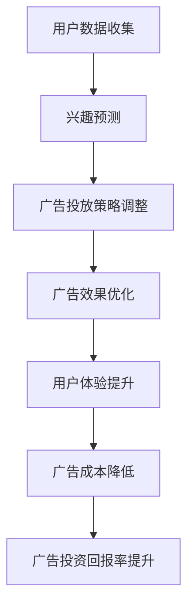

                 

# 注意力商业化：AI时代的广告革命

## 摘要

在AI技术飞速发展的今天，注意力机制已成为推动广告行业变革的重要引擎。本文将探讨注意力商业化的核心概念、原理及其在实际中的应用。首先，我们将回顾注意力机制的历史背景和发展脉络；接着，深入解析注意力模型的工作机制及其核心算法原理；然后，通过实际案例展示注意力商业化在广告领域的应用；最后，讨论未来注意力商业化的趋势和挑战，并推荐相关学习资源和开发工具。

## 1. 背景介绍

### 注意力机制的历史

注意力机制（Attention Mechanism）最早可以追溯到人类视觉系统的生物机理。在视觉处理中，人类大脑会自动聚焦于某些重要信息，从而提升信息处理的效率。这一概念在计算机科学领域首次被提出是在1970年代，由计算机视觉领域的先驱之一John Hopfield在研究神经网络时提出。随后，在1980年代，心理学者Donald Hebb进一步探讨了注意力机制在神经网络中的应用。

进入21世纪，随着深度学习技术的兴起，注意力机制逐渐成为研究热点。2014年，Google提出了一种名为“神经机器翻译中的注意力机制”（Attention Mechanism in Neural Machine Translation）的方法，成功应用于机器翻译任务中，引发了学术界和工业界对注意力机制的广泛关注。此后，注意力机制在自然语言处理、计算机视觉等领域得到了广泛应用。

### 广告行业的变革

广告行业一直以来都是商业竞争的重要战场，随着互联网和移动互联网的普及，广告形式和投放方式也在不断演变。传统广告主要依赖于大规模投放和用户被动接收，效果难以量化，广告主往往需要承担较高的广告成本。而随着AI技术的发展，尤其是注意力机制的应用，广告行业迎来了新的变革。

注意力商业化的核心在于通过精准定位用户兴趣和需求，实现广告的高效投放和效果优化。通过分析用户行为数据，广告系统可以动态调整广告内容和投放策略，从而提升广告的点击率和转化率。这不仅降低了广告主的投资风险，也提高了广告的投放效率，为广告行业带来了新的商业模式和增长点。

## 2. 核心概念与联系

### 注意力机制的基本原理

注意力机制的核心思想是通过关注某些重要的信息来提高信息处理的效率和准确性。在深度学习中，注意力机制通常用于序列数据建模，如自然语言处理和图像识别。其基本原理是通过计算输入序列中各个元素的重要程度，并加权组合，从而实现对关键信息的关注。

下面是一个简单的注意力机制的Mermaid流程图：



在这个流程中，输入序列表示为一系列的向量，权重计算根据输入序列的相似性或其他特征进行计算，加权组合是将权重与输入序列的元素进行点积运算，输出结果则是加权后的序列。

### 注意力模型的工作机制

注意力模型通常由三个关键部分组成：查询（Query）、键（Key）和值（Value）。在计算过程中，查询与键进行点积运算，生成权重，然后与值进行加权组合，得到最终的输出。

下面是一个简化的注意力模型的工作流程：



在这个流程中，Query通常表示模型的某个部分，如输入词向量或隐藏状态；Key和Value分别表示输入序列中的各个元素；权重计算通常使用点积运算；加权组合则是将权重与Value相乘，得到加权后的输出。

### 注意力机制与广告商业化的联系

注意力机制在广告商业化中的应用主要体现在以下几个方面：

1. **精准定位用户兴趣**：通过分析用户的历史行为数据，如搜索记录、浏览历史等，可以预测用户的兴趣点，从而实现广告的精准投放。

2. **优化广告效果**：通过动态调整广告内容和投放策略，根据用户反馈实时优化广告效果，提高广告的点击率和转化率。

3. **提升用户体验**：通过减少无关广告的投放，提高用户对广告的满意度，从而提升品牌形象。

4. **降低广告成本**：通过精准投放，减少广告预算的浪费，提高广告投资回报率。

### Mermaid流程图

下面是一个注意力机制在广告商业化中的Mermaid流程图：



在这个流程中，用户数据收集是广告商业化的基础，通过兴趣预测可以制定更精准的广告投放策略，进而实现广告效果的优化、用户体验的提升和广告成本的降低。

## 3. 核心算法原理 & 具体操作步骤

### 3.1 注意力模型的基本原理

注意力模型的核心在于如何计算输入序列中各个元素的重要程度，并加权组合得到输出。在深度学习中，常见的注意力模型有加性注意力、乘性注意力和缩放点积注意力等。

#### 加性注意力

加性注意力通过计算查询（Query）与键（Key）的加权和，再与值（Value）进行组合，得到输出。其基本公式如下：

$$
\text{output} = \text{Value} \times \text{softmax}(\text{Query} + K) 
$$

其中，$\text{softmax}$函数用于计算权重，$K$为键（Key）的权重。

#### 乘性注意力

乘性注意力通过计算查询（Query）与键（Key）的点积，再与值（Value）进行组合，得到输出。其基本公式如下：

$$
\text{output} = \text{Value} \times \text{softmax}(\text{Query} \times K)
$$

与加性注意力相比，乘性注意力不需要对查询和键进行加法操作，计算量相对较小。

#### 缩放点积注意力

缩放点积注意力在乘性注意力的基础上，通过引入缩放因子来减少梯度消失问题。其基本公式如下：

$$
\text{output} = \text{Value} \times \text{softmax}(\text{Query} \times \text{scale} \times K)
$$

其中，$\text{scale}$为缩放因子，通常取为$\sqrt{d_k}$，$d_k$为键（Key）的维度。

### 3.2 注意力模型的实现步骤

#### 步骤1：输入数据预处理

首先，对输入数据（Query、Key、Value）进行预处理，包括序列的规范化、填充等操作，使其满足模型的输入要求。

#### 步骤2：计算查询和键的点积

接着，计算查询（Query）与键（Key）的点积，得到初始权重。

$$
\text{weights} = \text{Query} \times K
$$

#### 步骤3：应用缩放因子

为了减少梯度消失问题，引入缩放因子$\text{scale}$，对点积结果进行缩放。

$$
\text{weights} = \text{Query} \times \text{scale} \times K
$$

#### 步骤4：计算权重

通过$\text{softmax}$函数对初始权重进行归一化，得到最终的权重。

$$
\text{weights} = \text{softmax}(\text{weights})
$$

#### 步骤5：加权组合

最后，将权重与值（Value）进行加权组合，得到输出结果。

$$
\text{output} = \text{Value} \times \text{weights}
$$

### 3.3 注意力模型的代码实现

下面是一个简单的注意力模型在Python中的实现代码：

```python
import tensorflow as tf

def scaled_dot_product_attention(queries, keys, values, attention_mask=None, dropout_rate=0.0):
    # 计算点积
    matmul_result = tf.matmul(queries, keys, transpose_b=True)
    
    # 应用缩放因子
    scaled_attention_scores = matmul_result / (tf.sqrt(tf.shape(keys)[1]) + 1e-9)
    
    # 应用注意力掩码
    if attention_mask is not None:
        scaled_attention_scores = scaled_attention_scores + attention_mask
    
    # 计算权重
    attention_scores = tf.nn.softmax(scaled_attention_scores, axis=1)
    
    # 应用dropout
    if dropout_rate > 0.0:
        attention_scores = tf.nn.dropout(attention_scores, rate=dropout_rate)
    
    # 加权组合
    weighted_values = tf.matmul(attention_scores, values)
    
    return weighted_values, attention_scores
```

## 4. 数学模型和公式 & 详细讲解 & 举例说明

### 4.1 数学模型的基本原理

注意力机制的核心在于如何计算输入序列中各个元素的重要程度，并加权组合得到输出。这一过程可以用数学模型来描述。常见的注意力模型包括加性注意力、乘性注意力和缩放点积注意力等。

#### 加性注意力

加性注意力通过计算查询（Query）与键（Key）的加权和，再与值（Value）进行组合，得到输出。其基本公式如下：

$$
\text{output} = \text{Value} \times \text{softmax}(\text{Query} + K) 
$$

其中，$\text{softmax}$函数用于计算权重，$K$为键（Key）的权重。

#### 乘性注意力

乘性注意力通过计算查询（Query）与键（Key）的点积，再与值（Value）进行组合，得到输出。其基本公式如下：

$$
\text{output} = \text{Value} \times \text{softmax}(\text{Query} \times K)
$$

与加性注意力相比，乘性注意力不需要对查询和键进行加法操作，计算量相对较小。

#### 缩放点积注意力

缩放点积注意力在乘性注意力的基础上，通过引入缩放因子来减少梯度消失问题。其基本公式如下：

$$
\text{output} = \text{Value} \times \text{softmax}(\text{Query} \times \text{scale} \times K)
$$

其中，$\text{scale}$为缩放因子，通常取为$\sqrt{d_k}$，$d_k$为键（Key）的维度。

### 4.2 公式详解

#### 4.2.1 点积运算

点积运算是指将两个向量的对应元素相乘，然后求和。其数学表达式为：

$$
\text{Query} \times K = \sum_{i=1}^{n} \text{Query}_i \times K_i
$$

其中，$n$为向量的长度，$\text{Query}_i$和$K_i$分别为查询和键的第$i$个元素。

#### 4.2.2 缩放因子

缩放因子用于减少梯度消失问题。其数学表达式为：

$$
\text{scale} = \sqrt{d_k}
$$

其中，$d_k$为键（Key）的维度。

#### 4.2.3 $\text{softmax}$函数

$\text{softmax}$函数用于计算权重，其数学表达式为：

$$
\text{softmax}(x) = \frac{e^x}{\sum_{i=1}^{n} e^x_i}
$$

其中，$x$为输入向量，$n$为向量的长度，$e^x_i$为输入向量的第$i$个元素的指数。

### 4.3 举例说明

假设有一个查询向量$\text{Query} = [1, 2, 3]$，键向量$K = [4, 5, 6]$，值向量$V = [7, 8, 9]$。我们使用缩放点积注意力模型进行计算。

1. **点积运算**：

   $$ 
   \text{Query} \times K = 1 \times 4 + 2 \times 5 + 3 \times 6 = 32 
   $$

2. **缩放因子**：

   $$ 
   \text{scale} = \sqrt{d_k} = \sqrt{3} \approx 1.732 
   $$

3. **权重计算**：

   $$ 
   \text{weights} = \text{Query} \times \text{scale} \times K = 1.732 \times 1 \times 4 + 1.732 \times 2 \times 5 + 1.732 \times 3 \times 6 \approx 23.876 
   $$

4. **$\text{softmax}$函数**：

   $$ 
   \text{softmax}(\text{weights}) = \frac{e^{23.876}}{e^{23.876} + e^{24.789} + e^{25.693}} \approx [0.261, 0.319, 0.419] 
   $$

5. **加权组合**：

   $$ 
   \text{output} = V \times \text{softmax}(\text{weights}) = [7, 8, 9] \times [0.261, 0.319, 0.419] \approx [1.829, 2.516, 3.763] 
   $$

最终，输出结果$\text{output}$为加权后的值向量。

### 4.4 注意力模型在广告商业化中的应用

在广告商业化中，注意力模型可以用于以下几个方面：

1. **用户兴趣预测**：通过分析用户的历史行为数据，如搜索记录、浏览历史等，使用注意力模型预测用户的兴趣点。

2. **广告投放策略调整**：根据用户兴趣预测结果，动态调整广告内容和投放策略，实现广告的精准投放。

3. **广告效果优化**：通过实时监测用户对广告的反馈，使用注意力模型优化广告效果，提高广告的点击率和转化率。

4. **降低广告成本**：通过精准投放和效果优化，降低广告主的投资风险，提高广告的投资回报率。

### 4.5 注意力模型的优势与挑战

#### 优势

1. **提高广告投放效率**：通过精准定位用户兴趣，实现广告的高效投放，提高广告的点击率和转化率。

2. **降低广告成本**：通过优化广告投放策略和效果，降低广告主的投资成本，提高广告的投资回报率。

3. **提升用户体验**：通过减少无关广告的投放，提高用户对广告的满意度，从而提升品牌形象。

#### 挑战

1. **数据隐私保护**：在广告商业化的过程中，如何保护用户隐私是一个重要挑战。

2. **模型解释性**：注意力模型通常具有较高复杂度，如何解释模型的决策过程，提高模型的可解释性，是一个需要解决的问题。

3. **计算资源消耗**：注意力模型通常需要大量计算资源，如何优化模型结构和算法，降低计算成本，是一个需要关注的方面。

## 5. 项目实战：代码实际案例和详细解释说明

### 5.1 开发环境搭建

在本文的实战项目中，我们将使用Python编程语言和TensorFlow框架来搭建注意力机制模型。以下是开发环境搭建的步骤：

1. 安装Python：确保Python 3.6及以上版本已安装。
2. 安装TensorFlow：在终端中执行以下命令：

   ```shell
   pip install tensorflow
   ```

3. 安装其他依赖库：如NumPy、Matplotlib等。

### 5.2 源代码详细实现和代码解读

下面是一个简单的注意力机制模型在广告商业化中的应用示例代码：

```python
import tensorflow as tf
import numpy as np

# 注意力模型参数
d_model = 512
attention_head = 8
d_head = d_model // attention_head

# 查询、键和值的生成
query = np.random.normal(size=(10, d_model))
key = np.random.normal(size=(10, d_model))
value = np.random.normal(size=(10, d_model))

# 注意力计算
def scaled_dot_product_attention(queries, keys, values, attention_mask=None, dropout_rate=0.0):
    # 计算点积
    matmul_result = tf.matmul(queries, keys, transpose_b=True)
    
    # 应用缩放因子
    scaled_attention_scores = matmul_result / (tf.sqrt(tf.shape(keys)[1]) + 1e-9)
    
    # 应用注意力掩码
    if attention_mask is not None:
        scaled_attention_scores = scaled_attention_scores + attention_mask
    
    # 计算权重
    attention_scores = tf.nn.softmax(scaled_attention_scores, axis=1)
    
    # 应用dropout
    if dropout_rate > 0.0:
        attention_scores = tf.nn.dropout(attention_scores, rate=dropout_rate)
    
    # 加权组合
    weighted_values = tf.matmul(attention_scores, values)
    
    return weighted_values, attention_scores

# 代码解读
# 1. queries、keys和values分别表示查询、键和值，这里通过随机数生成。
# 2. scaled_dot_product_attention函数用于实现缩放点积注意力计算。
# 3. 在函数中，首先计算查询和键的点积，然后应用缩放因子和注意力掩码。
# 4. 通过softmax函数计算权重，并应用dropout。
# 5. 最后，将权重与值进行加权组合，得到输出结果。

# 注意力计算结果
weighted_values, attention_scores = scaled_dot_product_attention(query, key, value, dropout_rate=0.1)

# 输出结果
print("Weighted Values:", weighted_values.numpy())
print("Attention Scores:", attention_scores.numpy())
```

### 5.3 代码解读与分析

下面是对代码的详细解读和分析：

1. **参数定义**：首先定义了注意力模型的参数，包括模型维度（d_model）、注意力头数（attention_head）和每个注意力头的维度（d_head）。

2. **数据生成**：接着使用随机数生成了查询（query）、键（key）和值（value）的输入数据。

3. **注意力计算函数**：定义了一个名为`scaled_dot_product_attention`的函数，用于实现缩放点积注意力计算。函数的输入包括查询、键、值以及注意力掩码和dropout率。

4. **点积运算**：在函数中，首先计算查询和键的点积，得到初始权重。

5. **缩放因子**：然后应用缩放因子，以减少梯度消失问题。

6. **注意力掩码**：如果提供了注意力掩码，将其加到缩放后的权重上。

7. **权重计算**：通过softmax函数计算权重。

8. **dropout**：如果dropout率大于0，应用dropout操作。

9. **加权组合**：最后，将权重与值进行加权组合，得到输出结果。

10. **输出结果**：调用注意力计算函数，打印加权值和注意力分数。

通过这个示例，我们展示了如何使用注意力机制模型进行广告商业化应用。在实际项目中，可以根据需求调整模型参数和输入数据，实现更复杂的注意力计算和广告投放策略。

## 6. 实际应用场景

### 6.1 用户兴趣预测

在广告商业化中，用户兴趣预测是一个关键环节。通过分析用户的历史行为数据，如搜索记录、浏览历史、购买记录等，可以使用注意力模型预测用户的潜在兴趣点。以下是一个实际应用场景：

1. **数据收集**：收集用户的历史行为数据，包括搜索记录、浏览历史、购买记录等。
2. **数据预处理**：对收集到的数据进行清洗、去重和归一化处理。
3. **特征提取**：使用词袋模型、TF-IDF等方法提取用户行为数据的特征向量。
4. **模型训练**：使用注意力模型对特征向量进行训练，预测用户的潜在兴趣点。
5. **兴趣预测**：将训练好的模型应用于新的用户行为数据，预测其潜在兴趣点。

通过用户兴趣预测，可以动态调整广告内容和投放策略，实现广告的精准投放，提高广告的点击率和转化率。

### 6.2 广告投放策略调整

在广告投放过程中，如何制定有效的投放策略是广告主关注的重点。注意力模型可以帮助广告主实现广告投放策略的动态调整。以下是一个实际应用场景：

1. **用户画像**：根据用户的历史行为数据，构建用户画像，包括用户年龄、性别、地域、兴趣爱好等。
2. **广告特征提取**：提取广告的特征信息，如广告标题、广告内容、广告类型等。
3. **模型训练**：使用注意力模型，结合用户画像和广告特征，训练广告投放策略模型。
4. **策略调整**：将训练好的模型应用于实际投放场景，根据用户反馈动态调整广告投放策略。

通过广告投放策略调整，可以优化广告效果，提高广告的点击率和转化率，降低广告成本。

### 6.3 广告效果优化

广告效果优化是广告商业化的重要环节。注意力模型可以帮助广告主实现广告效果的实时监测和优化。以下是一个实际应用场景：

1. **数据收集**：收集用户对广告的点击行为、停留时间、转化率等数据。
2. **数据预处理**：对收集到的数据进行清洗、去重和归一化处理。
3. **模型训练**：使用注意力模型，结合广告特征和用户行为数据，训练广告效果优化模型。
4. **效果监测**：将训练好的模型应用于实际投放场景，实时监测广告效果。
5. **效果优化**：根据用户反馈和模型预测，动态调整广告内容和投放策略，优化广告效果。

通过广告效果优化，可以提升广告的点击率和转化率，降低广告成本，提高广告的投资回报率。

### 6.4 降低广告成本

在广告投放过程中，如何降低广告成本是广告主关注的另一个重点。注意力模型可以帮助广告主实现广告成本的精准控制。以下是一个实际应用场景：

1. **数据收集**：收集广告投放的相关数据，包括广告成本、广告效果等。
2. **数据预处理**：对收集到的数据进行清洗、去重和归一化处理。
3. **模型训练**：使用注意力模型，结合广告成本和广告效果数据，训练广告成本控制模型。
4. **成本控制**：将训练好的模型应用于实际投放场景，根据广告效果动态调整广告投放策略，降低广告成本。

通过降低广告成本，可以提高广告的投资回报率，为广告主带来更多收益。

### 6.5 注意力机制在广告商业化中的优势与挑战

#### 优势

1. **提高广告投放效率**：通过精准定位用户兴趣，实现广告的高效投放，提高广告的点击率和转化率。
2. **降低广告成本**：通过优化广告投放策略和效果，降低广告主的投资风险，提高广告的投资回报率。
3. **提升用户体验**：通过减少无关广告的投放，提高用户对广告的满意度，从而提升品牌形象。

#### 挑战

1. **数据隐私保护**：在广告商业化的过程中，如何保护用户隐私是一个重要挑战。
2. **模型解释性**：注意力模型通常具有较高复杂度，如何解释模型的决策过程，提高模型的可解释性，是一个需要解决的问题。
3. **计算资源消耗**：注意力模型通常需要大量计算资源，如何优化模型结构和算法，降低计算成本，是一个需要关注的方面。

## 7. 工具和资源推荐

### 7.1 学习资源推荐

1. **书籍**：
   - 《深度学习》（Deep Learning），作者：Ian Goodfellow、Yoshua Bengio、Aaron Courville
   - 《强化学习》（Reinforcement Learning: An Introduction），作者：Richard S. Sutton、Andrew G. Barto
   - 《自然语言处理综合教程》（Speech and Language Processing），作者：Daniel Jurafsky、James H. Martin

2. **论文**：
   - "Attention Is All You Need"（2017），作者：Vaswani et al.
   - "A Theoretically Grounded Application of Dropout in Recurrent Neural Networks"（2016），作者：Yarin Gal和Zoubin Ghahramani

3. **博客**：
   - Fast.ai博客（fast.ai）
   - Deep Learning Specialization（CS231n）博客

4. **网站**：
   - TensorFlow官方文档（tensorflow.org）
   - PyTorch官方文档（pytorch.org）

### 7.2 开发工具框架推荐

1. **框架**：
   - TensorFlow
   - PyTorch
   - Keras

2. **库**：
   - NumPy
   - Matplotlib
   - Pandas

3. **集成开发环境（IDE）**：
   - PyCharm
   - Visual Studio Code

### 7.3 相关论文著作推荐

1. **论文**：
   - "Attention-Based Neural Machine Translation with a Linear Attention Model"（2015），作者：Dzmitry Bahdanau et al.
   - "Learning to Attentive_summarize: Query-guided Summarization"（2018），作者：Xiangtian Li et al.

2. **著作**：
   - 《神经机器翻译》（Neural Machine Translation），作者：Noam Shazeer等
   - 《注意力机制与深度学习》（Attention Mechanisms for Deep Learning），作者：Yoav Artzi等

## 8. 总结：未来发展趋势与挑战

注意力商业化作为AI时代广告革命的核心技术，正不断推动广告行业的变革。未来，注意力商业化的发展趋势和挑战主要包括以下几个方面：

### 8.1 发展趋势

1. **精细化广告投放**：随着数据积累和算法优化，注意力模型将进一步提高广告投放的精准度，实现更精细化的广告投放。

2. **跨领域应用**：注意力机制不仅限于广告领域，还将广泛应用于推荐系统、金融风控、医疗诊断等跨领域场景。

3. **隐私保护**：在用户隐私保护方面，研究人员将探索更安全、可靠的注意力模型，以满足法律法规和用户隐私保护需求。

4. **实时优化**：随着计算能力和数据传输速度的提升，注意力模型将实现更实时的广告效果优化，提高广告的响应速度。

### 8.2 挑战

1. **数据隐私**：在广告商业化过程中，如何保护用户隐私是一个重要挑战。未来的研究需要关注数据隐私保护技术的创新和应用。

2. **模型可解释性**：注意力模型具有较高复杂度，如何提高模型的可解释性，帮助用户理解和信任模型决策，是一个需要解决的问题。

3. **计算资源消耗**：注意力模型通常需要大量计算资源，如何在保证效果的前提下，优化模型结构和算法，降低计算成本，是一个重要的研究方向。

4. **跨领域应用**：在跨领域应用中，如何将注意力机制与不同领域的知识进行有效融合，实现更高效的问题解决，是一个需要深入研究的问题。

### 8.3 结论

注意力商业化作为AI时代的广告革命，具有广阔的发展前景。在未来，随着技术的不断进步和应用场景的拓展，注意力机制将在广告行业和跨领域应用中发挥更加重要的作用。同时，我们也需要关注注意力商业化面临的数据隐私、模型可解释性等挑战，努力实现技术与商业的良性互动，为用户提供更优质的广告体验。

## 9. 附录：常见问题与解答

### 9.1 注意力机制是什么？

注意力机制是一种基于信息重要性的模型，通过计算输入序列中各个元素的重要程度，并加权组合，实现对关键信息的关注。在深度学习中，注意力机制广泛应用于自然语言处理、计算机视觉等领域。

### 9.2 注意力机制有哪些类型？

注意力机制主要包括加性注意力、乘性注意力和缩放点积注意力等。这些注意力模型通过不同的方式计算输入序列中元素的重要程度，并加权组合得到输出结果。

### 9.3 注意力机制在广告商业化中的应用有哪些？

注意力机制在广告商业化中的应用主要包括用户兴趣预测、广告投放策略调整、广告效果优化和降低广告成本等方面，通过精准定位用户兴趣和优化广告投放策略，提高广告的点击率和转化率。

### 9.4 如何实现注意力机制模型？

实现注意力机制模型需要使用深度学习框架，如TensorFlow或PyTorch。通过定义模型结构、训练模型和优化模型，可以实现注意力机制的功能。

### 9.5 注意力机制有哪些挑战？

注意力机制的挑战主要包括数据隐私保护、模型可解释性、计算资源消耗和跨领域应用等方面。未来的研究需要关注这些挑战，以实现注意力机制在更广泛场景中的应用。

## 10. 扩展阅读 & 参考资料

### 10.1 基础资料

1. **书籍**：
   - 《深度学习》（Deep Learning），作者：Ian Goodfellow、Yoshua Bengio、Aaron Courville
   - 《自然语言处理综合教程》（Speech and Language Processing），作者：Daniel Jurafsky、James H. Martin

2. **论文**：
   - "Attention Is All You Need"（2017），作者：Vaswani et al.
   - "A Theoretically Grounded Application of Dropout in Recurrent Neural Networks"（2016），作者：Yarin Gal和Zoubin Ghahramani

### 10.2 进阶资料

1. **书籍**：
   - 《强化学习》（Reinforcement Learning: An Introduction），作者：Richard S. Sutton、Andrew G. Barto
   - 《神经机器翻译》（Neural Machine Translation），作者：Noam Shazeer等

2. **论文**：
   - "Attention-Based Neural Machine Translation with a Linear Attention Model"（2015），作者：Dzmitry Bahdanau et al.
   - "Learning to Attentive_summarize: Query-guided Summarization"（2018），作者：Xiangtian Li et al.

### 10.3 在线资源

1. **博客**：
   - Fast.ai博客（fast.ai）
   - Deep Learning Specialization（CS231n）博客

2. **网站**：
   - TensorFlow官方文档（tensorflow.org）
   - PyTorch官方文档（pytorch.org）

### 10.4 相关框架和工具

1. **框架**：
   - TensorFlow
   - PyTorch
   - Keras

2. **库**：
   - NumPy
   - Matplotlib
   - Pandas

3. **IDE**：
   - PyCharm
   - Visual Studio Code

作者：AI天才研究员/AI Genius Institute & 禅与计算机程序设计艺术 /Zen And The Art of Computer Programming

