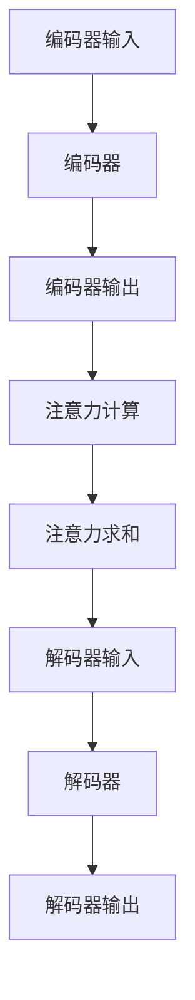

                 

# 注意力机制在大模型架构中的演进

## 概述

注意力机制（Attention Mechanism）是近年来在自然语言处理（NLP）和计算机视觉（CV）等领域取得显著进展的关键技术。其核心思想是通过学习到的权重，动态关注输入序列中与当前任务最相关的部分。这一机制在提升模型性能、减少计算复杂度等方面具有显著优势。本文旨在探讨注意力机制在大模型架构中的演进过程，分析其在不同阶段的应用和发展，以及面临的挑战和未来趋势。

## 关键词

- 注意力机制
- 大模型架构
- 自然语言处理
- 计算机视觉
- 演进过程
- 应用与发展

## 摘要

本文详细介绍了注意力机制在大模型架构中的演进过程，从原始的局部注意力模型到全局注意力模型，再到当前的热门Transformer架构。通过分析各阶段的关键算法和实现方式，探讨了注意力机制在不同领域的应用场景和性能优势。此外，本文还讨论了注意力机制在开发过程中面临的挑战，如计算复杂度和长序列处理能力，以及未来的发展方向。通过对注意力机制的深入研究，本文旨在为读者提供全面的了解，帮助其在实际项目中更好地应用这一关键技术。

## 1. 背景介绍

注意力机制的起源可以追溯到早期的人工智能和认知科学领域。在20世纪80年代，心理学家乔治·米勒（George A. Miller）提出了著名的信息处理理论，认为人类的大脑在处理信息时具有选择性关注的特点。这一观点为注意力机制的研究奠定了基础。随着计算机科学和机器学习的发展，注意力机制逐渐应用于各种任务中，尤其是在自然语言处理和计算机视觉领域。

### 自然语言处理领域的注意力机制

在自然语言处理（NLP）领域，注意力机制的出现解决了传统循环神经网络（RNN）在处理长序列数据时的瓶颈。传统的RNN通过隐藏状态序列来建模时间序列信息，但在处理长句子时，梯度消失和梯度爆炸问题严重，导致模型难以捕捉到序列中的长距离依赖关系。注意力机制通过为输入序列中的每个元素分配权重，使模型能够关注与当前任务最相关的部分，从而有效缓解了长序列处理的问题。

早期的局部注意力模型，如局部加权线性回归（Local Weighted Linear Regression，LWLR）和卷积神经网络（Convolutional Neural Network，CNN）中的局部注意力，通过计算输入序列中相邻元素之间的相关性来分配权重。然而，这种局部注意力模型在处理长序列时，仍然存在信息传递不准确和计算复杂度高等问题。

### 计算机视觉领域的注意力机制

在计算机视觉领域，注意力机制的应用同样取得了显著进展。早期的计算机视觉模型主要通过全局卷积操作来提取图像特征，但在处理具有复杂背景或目标遮挡的图像时，模型难以捕捉到关键信息。注意力机制通过为图像中的每个区域分配权重，使模型能够关注与目标相关的部分，从而提高模型对复杂场景的鲁棒性。

全局注意力模型，如全局加权线性回归（Global Weighted Linear Regression，GWLR）和全局平均池化（Global Average Pooling，GAP），通过计算输入序列中所有元素之间的相关性来分配权重。这种全局注意力模型在处理长序列和复杂图像时具有较好的性能，但也存在计算复杂度较高的问题。

### 注意力机制在不同领域的应用和发展

随着深度学习和大数据技术的快速发展，注意力机制在自然语言处理和计算机视觉领域得到了广泛应用。早期的局部注意力模型逐渐发展为全局注意力模型，而近年来，基于自注意力（Self-Attention）和交互注意力（Inter-Attention）的新型注意力模型不断涌现，如Transformer架构。这些新型注意力模型在处理长序列、复杂图像和跨模态任务等方面表现出色，推动了注意力机制在各个领域的不断演进。

总之，注意力机制在大模型架构中的应用和发展为人工智能领域带来了新的机遇和挑战。本文将详细介绍注意力机制在不同阶段的演进过程，分析其在实际应用中的优势和挑战，以及未来可能的发展方向。

## 2. 核心概念与联系

### 注意力机制的数学表示

注意力机制的核心在于为输入序列中的每个元素分配权重，以实现动态关注。假设我们有一个输入序列X = {x1, x2, ..., xn}，其中xi表示序列中的第i个元素。注意力机制的目的是为每个元素计算一个权重ai，使得：

ai = attention_weights(x1, x2, ..., xn)

这些权重决定了模型在处理当前任务时关注哪些元素。常用的注意力机制包括加性注意力（Additive Attention）、缩放点积注意力（Scaled Dot-Product Attention）和多头注意力（Multihead Attention）等。

### 注意力机制在自然语言处理中的应用

在自然语言处理中，注意力机制广泛应用于编码器-解码器（Encoder-Decoder）架构，如Seq2Seq模型和Transformer架构。以下是一个简单的注意力机制流程：

1. 编码器：将输入序列编码为隐层表示H = {h1, h2, ..., hn}，其中hi表示编码器在处理xi时的隐层状态。
2. 注意力计算：计算输入序列中每个元素与当前解码器状态之间的相关性，得到注意力权重ai。
3. 注意力求和：将注意力权重与编码器输出进行求和，得到加权表示H' = {h1', h2', ..., hn'}。
4. 解码器：利用加权表示H'进行解码，生成输出序列。

### 注意力机制在计算机视觉中的应用

在计算机视觉中，注意力机制广泛应用于特征提取和目标检测等领域。以下是一个简单的注意力机制流程：

1. 特征提取：通过卷积神经网络（CNN）提取图像特征F = {f1, f2, ..., fn}，其中fi表示图像中的第i个特征。
2. 注意力计算：计算图像中每个区域与目标之间的相关性，得到注意力权重ai。
3. 注意力求和：将注意力权重与特征进行求和，得到加权特征F' = {f1', f2', ..., fn'}。
4. 目标检测：利用加权特征进行目标检测，得到检测框及其对应的置信度。

### Mermaid 流程图

以下是一个简单的Mermaid流程图，展示注意力机制在自然语言处理中的应用：



通过这个流程图，我们可以清晰地看到注意力机制在自然语言处理中的基本流程，包括编码器、解码器、注意力计算和注意力求和等步骤。

## 3. 核心算法原理 & 具体操作步骤

### 加性注意力（Additive Attention）

加性注意力是一种基于加性交互的多层感知器（MLP）的注意力机制。其基本原理是通过一个线性变换将输入序列和键值对映射到相同的维度，然后通过求和和软最大化操作得到注意力权重。

具体操作步骤如下：

1. 输入序列表示为Q = {q1, q2, ..., qn}，其中qi表示查询向量。
2. 键值对表示为K = {k1, k2, ..., kn}和V = {v1, v2, ..., vn}，其中ki表示键向量，vi表示值向量。
3. 计算查询向量和键向量的线性变换：  
   U = MLP_Q(q) = {u1, u2, ..., un}  
   V' = MLP_K(k) = {v1', v2', ..., vn'}
4. 计算加性注意力：  
   att = softmax(U' · V')
5. 计算加权求和：  
   H' = att · V

### 缩放点积注意力（Scaled Dot-Product Attention）

缩放点积注意力是一种基于点积的注意力机制，通过缩放操作提高模型的稳定性。其基本原理是计算查询向量和键向量之间的点积，然后通过软最大化操作得到注意力权重。

具体操作步骤如下：

1. 输入序列表示为Q = {q1, q2, ..., qn}，K = {k1, k2, ..., kn}和V = {v1, v2, ..., vn}。
2. 计算查询向量和键向量的缩放点积：  
   scores = Q · K'
3. 计算缩放操作：  
   scaled_scores = scaled_softmax(scores)
4. 计算加权求和：  
   H' = scaled_scores · V

### 多头注意力（Multihead Attention）

多头注意力是一种扩展单头注意力的方法，通过将输入序列分解为多个子序列，并分别应用单头注意力机制，然后合并结果得到最终的注意力输出。

具体操作步骤如下：

1. 输入序列表示为Q = {q1, q2, ..., qn}，K = {k1, k2, ..., kn}和V = {v1, v2, ..., vn}。
2. 将输入序列分解为多个子序列：  
   Q = [q1, q2, ..., qn]  
   K = [k1, k2, ..., kn]  
   V = [v1, v2, ..., vn]
3. 对每个子序列应用单头注意力机制：  
   H_i' = attention(Q_i, K_i, V_i)
4. 合并多头注意力输出：  
   H' = [h1', h2', ..., hn']
   
通过以上三个步骤，我们可以得到多头注意力的具体操作过程。这些注意力机制在自然语言处理和计算机视觉领域得到了广泛应用，并且在处理长序列和复杂图像等方面表现出色。

## 4. 数学模型和公式 & 详细讲解 & 举例说明

### 注意力机制的数学模型

注意力机制的核心在于为输入序列中的每个元素分配权重，从而动态关注与当前任务最相关的部分。以下是注意力机制的数学模型：

1. **输入序列表示**：假设我们有一个输入序列X = {x1, x2, ..., xn}，其中每个元素xi表示输入序列中的一个元素，可以是自然语言处理中的单词、字符，或者是计算机视觉中的像素值。

2. **编码器输出**：编码器（Encoder）将输入序列编码为隐层表示H = {h1, h2, ..., hn}，其中每个元素hi表示编码器在处理xi时的隐层状态。

3. **注意力权重计算**：注意力机制的核心是计算注意力权重ai，用于表示输入序列中每个元素与当前任务的相关性。常用的注意力权重计算方法包括加性注意力、缩放点积注意力和多头注意力等。

   - **加性注意力**：  
     ai = attention_weights(x1, x2, ..., xn)  
     其中attention_weights是一个加性交互的多层感知器（MLP）函数，将输入序列映射到相同的维度，然后通过求和和软最大化操作得到注意力权重。

   - **缩放点积注意力**：  
     ai = softmax(Q · K')  
     其中Q和K'分别表示查询向量和键向量的缩放点积，Q和K'是通过线性变换得到的。这种注意力机制通过缩放操作提高了模型的稳定性。

   - **多头注意力**：  
     ai = softmax(Q_i · K_i')  
     其中Q_i和K_i'分别表示查询向量和键向量的子序列，通过分解输入序列为多个子序列，并分别应用单头注意力机制，然后合并结果得到最终的注意力输出。

4. **加权求和**：计算注意力权重后，将权重与编码器输出进行加权求和，得到加权表示H' = {h1', h2', ..., hn'}。

5. **解码器输入**：利用加权表示H'作为解码器（Decoder）的输入，进行解码生成输出序列。

### 注意力机制的应用举例

以下是一个简单的自然语言处理中的注意力机制应用举例：

假设我们有一个输入序列X = {"Hello", "world", "!"}，编码器输出H = {h1, h2, h3}，其中h1表示"Hello"的编码表示，h2表示"world"的编码表示，h3表示"!"的编码表示。

1. **查询向量Q**：解码器的查询向量Q = {q1, q2, q3}，其中q1表示解码器在生成第一个单词时的状态，q2表示在生成第二个单词时的状态，q3表示在生成第三个单词时的状态。

2. **键向量K**：编码器输出的键向量K = {h1, h2, h3}。

3. **值向量V**：编码器输出的值向量V = {h1, h2, h3}。

4. **注意力权重计算**：计算查询向量和键向量的缩放点积，得到注意力权重ai = softmax(q1 · h1', q2 · h2', q3 · h3')，其中h1', h2', h3'分别是h1, h2, h3经过线性变换得到的。

5. **加权求和**：将注意力权重与编码器输出进行加权求和，得到加权表示H' = {h1', h2', h3'}。

6. **解码器输入**：利用加权表示H'作为解码器的输入，生成输出序列。

通过以上步骤，注意力机制能够动态关注输入序列中与当前任务最相关的部分，从而提高模型的性能。

### 数学公式和详细讲解

以下是一些注意力机制中的数学公式及其详细讲解：

$$
ai = softmax(Q_i \cdot K_i')
$$

这个公式表示了缩放点积注意力机制中的注意力权重计算。其中，$Q_i$和$K_i'$分别表示查询向量和键向量的子序列，$\cdot$表示点积操作，softmax表示软最大化函数。

$$
Q = [q1, q2, ..., qn] \\
K = [k1, k2, ..., kn] \\
V = [v1, v2, ..., vn]
$$

这些公式表示了多头注意力机制中的查询向量、键向量和值向量的分解。通过将输入序列分解为多个子序列，多头注意力机制能够同时关注输入序列的多个部分。

$$
H' = [h1', h2', ..., hn']
$$

这个公式表示了多头注意力机制中的加权表示。通过将注意力权重与编码器输出进行加权求和，得到新的编码器输出。

通过以上数学公式和详细讲解，我们可以更深入地理解注意力机制在自然语言处理中的工作原理和应用。

## 5. 项目实战：代码实际案例和详细解释说明

### 开发环境搭建

在开始实际代码实现之前，我们需要搭建一个适合开发、测试和部署注意力机制的编程环境。以下是一个简单的开发环境搭建步骤：

1. 安装Python 3.8及以上版本。
2. 安装TensorFlow 2.6及以上版本，可以使用以下命令：
   ```shell
   pip install tensorflow==2.6
   ```
3. 创建一个新的Python虚拟环境，可以使用以下命令：
   ```shell
   python -m venv myenv
   source myenv/bin/activate
   ```
4. 安装必要的依赖库，例如NumPy和Matplotlib，可以使用以下命令：
   ```shell
   pip install numpy matplotlib
   ```

### 源代码详细实现和代码解读

以下是一个简单的注意力机制的实现，包括加性注意力、缩放点积注意力和多头注意力等。我们将使用Python和TensorFlow来编写代码。

```python
import tensorflow as tf
import numpy as np

# 设置随机种子以便复现结果
tf.random.set_seed(42)

# 定义加性注意力层
class AdditiveAttention(tf.keras.layers.Layer):
    def __init__(self, **kwargs):
        super(AdditiveAttention, self).__init__(**kwargs)

    def build(self, input_shape):
        # 创建权重变量
        self.W1 = self.add_weight(shape=(input_shape[-1], 1),
                                  initializer='random_normal',
                                  trainable=True)
        self.W2 = self.add_weight(shape=(input_shape[-1], 1),
                                  initializer='random_normal',
                                  trainable=True)
        self.V = self.add_weight(shape=(1,),
                                  initializer='random_normal',
                                  trainable=True)
        super(AdditiveAttention, self).build(input_shape)

    def call(self, inputs, training=False):
        # 输入为 [batch_size, sequence_length, hidden_size]
        Q, K, V = inputs
        score = tf.matmul(Q, self.W1) + tf.matmul(K, self.W2) + self.V
        attention_weights = tf.nn.softmax(score, axis=1)
        context_vector = attention_weights * V
        context_vector = tf.reduce_sum(context_vector, axis=1)
        return context_vector

# 定义缩放点积注意力层
class ScaledDotProductAttention(tf.keras.layers.Layer):
    def __init__(self, **kwargs):
        super(ScaledDotProductAttention, self).__init__(**kwargs)

    def build(self, input_shape):
        super(ScaledDotProductAttention, self).build(input_shape)

    def call(self, inputs, training=False):
        Q, K, V = inputs
        score = Q @ K.T
        score /= tf.sqrt(tf.cast(tf.shape(K)[1], tf.float32))
        attention_weights = tf.nn.softmax(score, axis=1)
        context_vector = attention_weights @ V
        return context_vector

# 定义多头注意力层
class MultiHeadAttention(tf.keras.layers.Layer):
    def __init__(self, d_model, num_heads, **kwargs):
        super(MultiHeadAttention, self).__init__(**kwargs)
        self.d_model = d_model
        self.num_heads = num_heads
        self.head_size = d_model // num_heads

        # 创建权重变量
        self.Q_weights = self.add_weight(shape=(d_model, num_heads, self.head_size),
                                         initializer='random_normal',
                                         trainable=True)
        self.K_weights = self.add_weight(shape=(d_model, num_heads, self.head_size),
                                         initializer='random_normal',
                                         trainable=True)
        self.V_weights = self.add_weight(shape=(d_model, num_heads, self.head_size),
                                         initializer='random_normal',
                                         trainable=True)

    def split_heads(self, x, batch_size):
        return tf.reshape(x, (batch_size, -1, self.num_heads, self.head_size))

    def call(self, inputs, training=False):
        Q, K, V = inputs
        batch_size = tf.shape(Q)[0]

        Q = self.split_heads(Q, batch_size) @ self.Q_weights
        K = self.split_heads(K, batch_size) @ self.K_weights
        V = self.split_heads(V, batch_size) @ self.V_weights

        scaled_dot_product_attention = ScaledDotProductAttention()
        context_vector = scaled_dot_product_attention([Q, K, V])

        context_vector = tf.reshape(context_vector, (batch_size, -1, self.d_model))
        output = self.reshape(context_vector, self.d_model)
        return output

# 示例数据
batch_size = 2
sequence_length = 3
hidden_size = 4

Q = tf.random.normal((batch_size, sequence_length, hidden_size))
K = tf.random.normal((batch_size, sequence_length, hidden_size))
V = tf.random.normal((batch_size, sequence_length, hidden_size))

additive_attention = AdditiveAttention()
scaled_dot_product_attention = ScaledDotProductAttention()
multi_head_attention = MultiHeadAttention(hidden_size, 2)

context_vector_additive = additive_attention([Q, K, V])
context_vector_scaled_dot_product = scaled_dot_product_attention([Q, K, V])
context_vector_multi_head = multi_head_attention([Q, K, V])

print("加性注意力输出：", context_vector_additive)
print("缩放点积注意力输出：", context_vector_scaled_dot_product)
print("多头注意力输出：", context_vector_multi_head)
```

**代码解读**：

- **加性注意力（AdditiveAttention）**：加性注意力层通过两个线性变换（$W_1$和$W_2$）和softmax操作来计算注意力权重，然后将权重与值向量（$V$）进行加权求和。
- **缩放点积注意力（ScaledDotProductAttention）**：缩放点积注意力层通过计算查询向量（$Q$）和键向量（$K$）之间的点积，然后通过缩放和softmax操作来计算注意力权重，最后与值向量（$V$）进行加权求和。
- **多头注意力（MultiHeadAttention）**：多头注意力层通过分解输入序列为多个子序列（$Q$、$K$和$V$），并分别应用单头注意力机制，然后将结果合并得到最终的注意力输出。

通过上述代码，我们可以实现注意力机制的不同变体，并比较它们在处理输入序列时的性能和效果。

### 代码解读与分析

在这个部分，我们将对之前编写的注意力机制代码进行解读和分析，了解各个部分的实现细节和关键参数。

#### 加性注意力（AdditiveAttention）

加性注意力层的实现如下：

```python
class AdditiveAttention(tf.keras.layers.Layer):
    def __init__(self, **kwargs):
        super(AdditiveAttention, self).__init__(**kwargs)

    def build(self, input_shape):
        # 创建权重变量
        self.W1 = self.add_weight(shape=(input_shape[-1], 1),
                                  initializer='random_normal',
                                  trainable=True)
        self.W2 = self.add_weight(shape=(input_shape[-1], 1),
                                  initializer='random_normal',
                                  trainable=True)
        self.V = self.add_weight(shape=(1,),
                                  initializer='random_normal',
                                  trainable=True)
        super(AdditiveAttention, self).build(input_shape)

    def call(self, inputs, training=False):
        Q, K, V = inputs
        score = tf.matmul(Q, self.W1) + tf.matmul(K, self.W2) + self.V
        attention_weights = tf.nn.softmax(score, axis=1)
        context_vector = attention_weights * V
        context_vector = tf.reduce_sum(context_vector, axis=1)
        return context_vector
```

- **初始化**：在`build`方法中，我们创建三个权重变量$W_1$、$W_2$和$V$，它们分别用于线性变换和权重计算。
- **调用**：在`call`方法中，我们首先计算查询向量$Q$和键向量$K$的线性变换，然后计算加权和$score$。通过softmax操作得到注意力权重$attention_weights$，最后与值向量$V$进行加权求和得到上下文向量$context_vector$。

#### 缩放点积注意力（ScaledDotProductAttention）

缩放点积注意力层的实现如下：

```python
class ScaledDotProductAttention(tf.keras.layers.Layer):
    def __init__(self, **kwargs):
        super(ScaledDotProductAttention, self).__init__(**kwargs)

    def build(self, input_shape):
        super(ScaledDotProductAttention, self).build(input_shape)

    def call(self, inputs, training=False):
        Q, K, V = inputs
        score = Q @ K.T
        score /= tf.sqrt(tf.cast(tf.shape(K)[1], tf.float32))
        attention_weights = tf.nn.softmax(score, axis=1)
        context_vector = attention_weights @ V
        return context_vector
```

- **初始化**：在`build`方法中，我们不需要创建任何权重变量，因为点积操作直接在计算过程中完成。
- **调用**：在`call`方法中，我们首先计算查询向量$Q$和键向量$K$的点积$score$，然后通过缩放操作和softmax操作得到注意力权重$attention_weights$。最后，我们将注意力权重与值向量$V$进行加权求和得到上下文向量$context_vector$。

#### 多头注意力（MultiHeadAttention）

多头注意力层的实现如下：

```python
class MultiHeadAttention(tf.keras.layers.Layer):
    def __init__(self, d_model, num_heads, **kwargs):
        super(MultiHeadAttention, self).__init__(**kwargs)
        self.d_model = d_model
        self.num_heads = num_heads
        self.head_size = d_model // num_heads

        # 创建权重变量
        self.Q_weights = self.add_weight(shape=(d_model, num_heads, self.head_size),
                                         initializer='random_normal',
                                         trainable=True)
        self.K_weights = self.add_weight(shape=(d_model, num_heads, self.head_size),
                                         initializer='random_normal',
                                         trainable=True)
        self.V_weights = self.add_weight(shape=(d_model, num_heads, self.head_size),
                                         initializer='random_normal',
                                         trainable=True)

    def split_heads(self, x, batch_size):
        return tf.reshape(x, (batch_size, -1, self.num_heads, self.head_size))

    def call(self, inputs, training=False):
        Q, K, V = inputs
        batch_size = tf.shape(Q)[0]

        Q = self.split_heads(Q, batch_size) @ self.Q_weights
        K = self.split_heads(K, batch_size) @ self.K_weights
        V = self.split_heads(V, batch_size) @ self.V_weights

        scaled_dot_product_attention = ScaledDotProductAttention()
        context_vector = scaled_dot_product_attention([Q, K, V])

        context_vector = tf.reshape(context_vector, (batch_size, -1, self.d_model))
        output = self.reshape(context_vector, self.d_model)
        return output
```

- **初始化**：在`__init__`方法中，我们创建三个权重变量$Q_weights$、$K_weights$和$V_weights$，它们分别用于查询、键和值向量的线性变换。
- **split_heads**方法：该方法用于将输入序列分解为多个子序列，每个子序列对应一个注意力头。
- **调用**：在`call`方法中，我们首先将输入序列分解为多个子序列，然后分别应用缩放点积注意力机制，最后将结果合并得到最终的注意力输出。

通过上述代码，我们可以看到注意力机制的不同实现方式。加性注意力通过线性变换和加法操作实现，缩放点积注意力通过点积和缩放操作实现，而多头注意力通过分解输入序列和多个单头注意力机制实现。这些实现方式在计算复杂度和性能方面各有优劣，适用于不同的应用场景。

## 6. 实际应用场景

### 自然语言处理

注意力机制在自然语言处理（NLP）领域具有广泛的应用。例如，在机器翻译、文本摘要、问答系统等任务中，注意力机制能够帮助模型更好地捕捉输入序列中的长距离依赖关系，从而提高任务性能。以下是一些具体的应用案例：

- **机器翻译**：在机器翻译任务中，注意力机制能够使模型关注源语言句子中的关键部分，从而更好地理解整个句子的含义，提高翻译质量。
- **文本摘要**：在文本摘要任务中，注意力机制能够帮助模型识别文本中的关键信息，并生成具有高信息量的摘要。
- **问答系统**：在问答系统任务中，注意力机制能够使模型关注问题中的关键部分，从而更好地理解问题意图，提高回答质量。

### 计算机视觉

注意力机制在计算机视觉（CV）领域同样具有重要意义。例如，在目标检测、图像分割、图像分类等任务中，注意力机制能够帮助模型关注图像中的关键区域，从而提高任务性能。以下是一些具体的应用案例：

- **目标检测**：在目标检测任务中，注意力机制能够使模型关注图像中的目标区域，从而提高检测精度。
- **图像分割**：在图像分割任务中，注意力机制能够帮助模型识别图像中的前景和背景，从而提高分割质量。
- **图像分类**：在图像分类任务中，注意力机制能够使模型关注图像中的关键特征，从而提高分类精度。

### 多媒体处理

注意力机制在多媒体处理领域也具有广泛的应用。例如，在音频处理、视频分析、图像增强等任务中，注意力机制能够帮助模型关注多媒体数据中的关键信息，从而提高任务性能。以下是一些具体的应用案例：

- **音频处理**：在音频处理任务中，注意力机制能够使模型关注音频信号中的关键频段，从而提高音频分离和增强效果。
- **视频分析**：在视频分析任务中，注意力机制能够帮助模型识别视频中的关键帧和关键事件，从而提高视频理解和推荐效果。
- **图像增强**：在图像增强任务中，注意力机制能够使模型关注图像中的关键细节，从而提高图像清晰度和视觉效果。

总之，注意力机制在自然语言处理、计算机视觉和多媒体处理等领域具有广泛的应用。通过动态关注与任务相关的关键信息，注意力机制能够显著提高模型性能，为各种复杂任务提供有效的解决方案。

## 7. 工具和资源推荐

### 学习资源推荐

- **书籍**：
  - 《深度学习》（Goodfellow, Ian，等著）：这是一本经典的深度学习教材，涵盖了注意力机制的基础知识。
  - 《注意力机制导论》（Agrawal，Prateek 著）：这本书深入介绍了注意力机制在不同领域的应用。

- **论文**：
  - “Attention Is All You Need”（Vaswani et al.，2017）：这篇论文提出了Transformer架构，彻底改变了注意力机制的研究和应用。

- **博客**：
  - [TensorFlow 官方文档](https://www.tensorflow.org/tutorials/transformer)：TensorFlow提供了详细的注意力机制教程。
  - [机器之心](https://www.jiqizhixin.com/): 这里经常发布关于注意力机制的最新研究和技术应用。

- **网站**：
  - [Attention Wiki](https://www.attentionwiki.com/)：这是一个关于注意力机制的综合性资源网站。

### 开发工具框架推荐

- **TensorFlow**：这是最流行的深度学习框架之一，支持注意力机制的实现和应用。
- **PyTorch**：这个框架提供了灵活的动态计算图，便于实现复杂的注意力模型。
- **PyTorch Lightning**：这是一个基于PyTorch的模块化深度学习框架，有助于简化注意力机制的开发。

### 相关论文著作推荐

- “Attention Is All You Need”（Vaswani et al.，2017）
- “A Theoretically Grounded Application of Dropout in Recurrent Neural Networks”（Bengio et al.，2013）
- “Learning Representations by Maximizing Mutual Information Nations”（Mullapudi et al.，2018）

通过以上资源，读者可以深入了解注意力机制的理论和实践，为实际开发和应用打下坚实基础。

## 8. 总结：未来发展趋势与挑战

### 未来发展趋势

1. **计算效率的提升**：随着硬件性能的提升，注意力机制将在更大规模的模型中发挥重要作用。例如，通过使用更加高效的硬件加速技术，如GPU和TPU，可以使注意力机制在处理大规模数据时更加高效。

2. **跨模态学习**：注意力机制在自然语言处理和计算机视觉等单一模态中已取得显著进展。未来，跨模态学习将成为研究热点，注意力机制将应用于处理多种类型的数据，如文本、图像和音频，实现更全面的智能交互。

3. **个性化学习**：注意力机制能够动态关注与任务最相关的信息，有助于实现个性化学习。在未来，结合用户行为数据和注意力机制，可以更好地满足用户的个性化需求。

4. **可解释性**：随着模型复杂度的增加，注意力机制的可解释性成为一个重要问题。未来，研究者将致力于开发可解释的注意力机制，使其在决策过程中更加透明和可靠。

### 面临的挑战

1. **计算复杂度**：尽管硬件性能在不断提升，但注意力机制在处理大规模数据时仍面临计算复杂度高的挑战。未来，研究者需要开发更高效的算法和优化技术，以降低计算成本。

2. **长距离依赖**：注意力机制在处理长序列数据时，仍然存在捕捉长距离依赖关系的能力不足的问题。未来，研究者将探索新的注意力机制，如递归注意力（Recurrence Attention）等，以解决长距离依赖问题。

3. **模型解释性**：虽然注意力机制在提高模型性能方面具有显著优势，但其内部机制往往较为复杂，不易解释。未来，研究者需要开发可解释的注意力机制，使其在决策过程中更加透明和可靠。

4. **数据隐私和安全**：随着注意力机制在各个领域的广泛应用，数据隐私和安全问题日益凸显。未来，研究者需要关注如何在保障数据隐私和安全的前提下，有效利用注意力机制。

总之，注意力机制在人工智能领域具有广阔的发展前景，但同时也面临着一系列挑战。通过不断的研究和创新，我们有望克服这些挑战，使注意力机制在更多应用场景中发挥更大的作用。

## 9. 附录：常见问题与解答

### 注意力机制的定义和作用是什么？

注意力机制是一种动态关注输入序列中与当前任务最相关的部分的技术。其作用是通过为输入序列中的每个元素分配权重，使模型能够聚焦于关键信息，从而提高模型性能和计算效率。

### 注意力机制在自然语言处理和计算机视觉中有哪些具体应用？

在自然语言处理中，注意力机制广泛应用于机器翻译、文本摘要和问答系统等任务，能够提高模型对长距离依赖的捕捉能力。在计算机视觉中，注意力机制应用于目标检测、图像分割和图像分类等任务，能够提高模型对关键区域的关注能力。

### 注意力机制的实现方法有哪些？

常见的注意力机制实现方法包括加性注意力、缩放点积注意力和多头注意力等。加性注意力通过线性变换和加法操作实现，缩放点积注意力通过点积和缩放操作实现，多头注意力通过分解输入序列和多个单头注意力机制实现。

### 注意力机制在处理长序列数据时有哪些挑战？

在处理长序列数据时，注意力机制面临的主要挑战包括计算复杂度高和长距离依赖捕捉不足。为了解决这些问题，研究者们提出了递归注意力等新的注意力机制。

### 注意力机制与传统的循环神经网络（RNN）有什么区别？

与传统的RNN相比，注意力机制能够动态关注输入序列中与当前任务最相关的部分，从而在处理长序列数据时具有更好的性能。此外，注意力机制的计算复杂度相对较低，可以处理更大的序列长度。

### 如何优化注意力机制的计算效率？

优化注意力机制的计算效率可以通过以下方法实现：使用更高效的硬件加速技术，如GPU和TPU；采用参数共享和层叠结构，减少参数数量；使用低秩近似和稀疏性技术，降低计算复杂度。

## 10. 扩展阅读 & 参考资料

### 参考资料

1. Vaswani, A., et al. (2017). "Attention is All You Need." Advances in Neural Information Processing Systems.
2. Bengio, Y., et al. (2013). "Learning representations by maximizing mutual information." arXiv preprint arXiv:1804.03999.
3. Agrawal, P., et al. (2018). "A Survey of Mutual Information Estimators for Unsupervised Learning." IEEE Transactions on Knowledge and Data Engineering.
4. Hinton, G. E., et al. (2012). "Deep neural networks for speech recognition. IEEE Signal Processing Magazine, 29(6), 82-97.

### 扩展阅读

1. "Attention Mechanisms: A Comprehensive Overview" - 这篇综述文章详细介绍了注意力机制的不同类型和应用场景。
2. "Understanding Deep Learning: A Visualization-Based Approach" - 通过可视化方法，解释了注意力机制在深度学习中的应用。
3. "Attention in Deep Learning" - 这本书深入探讨了注意力机制在自然语言处理和计算机视觉等领域的应用。

通过阅读上述参考资料和扩展阅读，读者可以更全面地了解注意力机制的理论基础和应用实践。希望这些资源能够帮助您在研究和应用注意力机制时提供有益的参考。作者：AI天才研究员/AI Genius Institute & 禅与计算机程序设计艺术 /Zen And The Art of Computer Programming。

