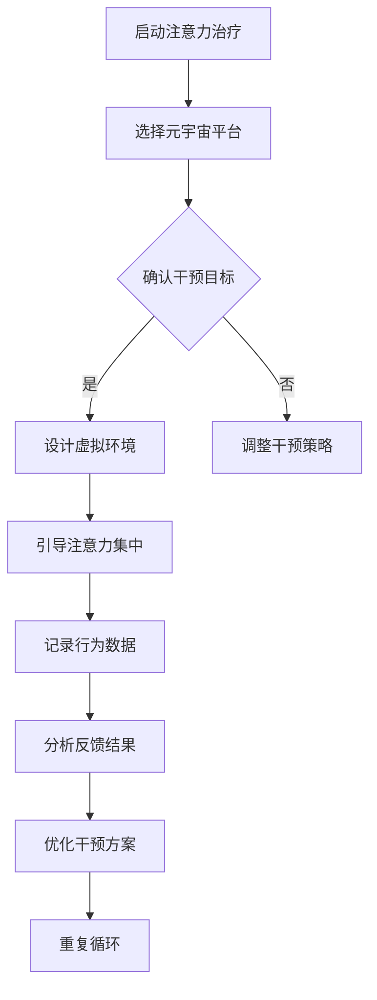
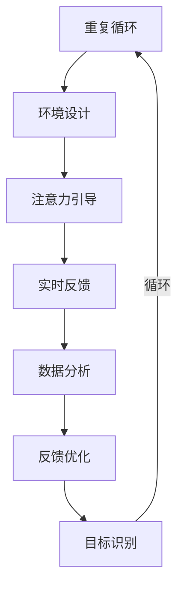

                 

# 注意力治疗：元宇宙中的心理健康新方法

## 关键词：注意力治疗、元宇宙、心理健康、虚拟现实、AI技术、行为疗法

### 摘要

本文旨在探讨元宇宙中的一种新兴心理健康治疗方法——注意力治疗。随着虚拟现实技术的发展和普及，元宇宙作为一种全新的数字世界，正逐渐成为人们日常生活中不可或缺的一部分。然而，虚拟环境中的过度沉浸和认知负荷也给人们的心理健康带来了一定的挑战。注意力治疗作为一种通过调整个体注意力方向，以改善心理状态的干预方法，在元宇宙中的应用具有巨大的潜力。本文将详细阐述注意力治疗的原理、方法及其在元宇宙中的具体应用，旨在为心理健康领域的研究者和实践者提供新的视角和思路。

## 1. 背景介绍

随着科技的迅猛发展，虚拟现实（VR）技术逐渐渗透到我们的日常生活中。元宇宙，作为虚拟现实的一种高级形式，不仅为用户提供了沉浸式的体验，还创造出了一种全新的社交空间和工作环境。然而，虚拟现实技术的广泛应用也带来了一系列心理健康问题。研究表明，长时间沉浸在虚拟环境中可能会导致注意力分散、焦虑、甚至依赖成瘾等问题。

传统的心理治疗方法，如认知行为疗法（CBT）和药物治疗，虽然在现实世界中取得了显著的疗效，但在元宇宙中面临着一定的局限性。首先，这些治疗方法往往依赖于现实中的面对面交流，而在虚拟环境中，这种直接互动方式变得复杂。其次，许多心理问题在虚拟世界中的表现形式与现实中存在差异，因此需要更为灵活和个性化的干预方法。

在这种背景下，注意力治疗作为一种新型的心理干预方法，逐渐受到了关注。注意力治疗的核心在于引导个体将注意力集中在特定的目标上，以改善情绪和行为。这种方法在元宇宙中的应用具有独特的优势，例如，通过虚拟环境中的游戏、任务和互动，可以更加自然地引导个体的注意力方向。此外，注意力治疗还可以借助人工智能技术，实现个性化干预和实时反馈，从而提高治疗效果。

本文将详细探讨注意力治疗的原理、方法及其在元宇宙中的具体应用，旨在为心理健康领域的研究者和实践者提供新的思路和方法。

## 2. 核心概念与联系

### 2.1 注意力治疗的基本原理

注意力治疗是一种通过引导个体将注意力集中在特定目标上，以达到改善心理状态的方法。其基本原理源于认知神经科学的研究，研究表明，注意力是大脑处理信息的关键过程，通过调节注意力的方向和强度，可以影响个体的情绪、行为和认知功能。

注意力治疗的主要目标包括：

1. 提高注意力集中能力：通过特定的训练和任务，帮助个体提高注意力的稳定性和持续性。
2. 改善情绪调节：通过引导个体关注积极情绪，减少消极情绪的影响。
3. 增强自我意识：通过自我观察和反思，提高个体的自我意识和自我调节能力。

### 2.2 注意力治疗与元宇宙的联系

元宇宙作为一种全新的虚拟环境，为注意力治疗提供了广阔的应用场景。在元宇宙中，个体可以自由探索和互动，这种开放性的环境使得注意力治疗更加自然和有效。具体来说，注意力治疗在元宇宙中的应用主要包括以下几个方面：

1. **沉浸式体验**：元宇宙提供了高度沉浸式的体验，通过视觉、听觉、触觉等多感官的刺激，可以更加有效地引导个体将注意力集中在特定目标上。
2. **个性化干预**：元宇宙中的虚拟角色和任务可以根据个体的需求和特点进行定制，实现更加个性化和精准的干预。
3. **实时反馈**：元宇宙中的交互机制可以实时收集个体的行为数据，通过人工智能技术进行分析和处理，为干预提供实时反馈。

### 2.3 注意力治疗的 Mermaid 流程图



在这个流程图中，注意力治疗从启动开始，通过选择元宇宙平台和确认干预目标，设计出适合个体的虚拟环境。在引导个体将注意力集中在特定目标的过程中，实时记录行为数据，并通过分析反馈结果来不断优化干预方案。

## 3. 核心算法原理 & 具体操作步骤

### 3.1 注意力治疗算法的基本原理

注意力治疗算法的核心在于如何引导个体将注意力集中在特定目标上。这一过程可以分为以下几个步骤：

1. **目标识别**：通过人工智能技术，识别个体在元宇宙中的行为模式，确定需要关注的特定目标。
2. **环境设计**：根据目标识别的结果，设计一个适合个体沉浸和互动的虚拟环境。
3. **注意力引导**：利用虚拟环境中的视觉、听觉和触觉等刺激，引导个体将注意力集中在特定目标上。
4. **实时反馈**：通过实时收集个体的行为数据，分析注意力集中的效果，提供即时反馈。

### 3.2 注意力治疗算法的具体操作步骤

1. **目标识别**：

   在开始注意力治疗之前，首先需要通过人工智能技术识别个体在元宇宙中的行为模式。这可以通过分析个体的历史行为数据，如游戏记录、社交互动等，来确定需要关注的特定目标。例如，如果个体在元宇宙中表现出强烈的焦虑情绪，那么可以将其注意力集中在放松和自我调节的目标上。

2. **环境设计**：

   根据目标识别的结果，设计一个适合个体沉浸和互动的虚拟环境。这个环境可以是自然景观、虚拟办公室、虚拟课堂等，具体取决于个体的需求和目标。设计时需要注意以下几点：

   - **视觉体验**：通过高质量的画面和动画，提供逼真的视觉体验，帮助个体更好地沉浸在虚拟环境中。
   - **听觉体验**：通过音效和背景音乐，创造一个与虚拟环境相匹配的听觉体验，增强沉浸感。
   - **互动性**：设计互动性强的任务和活动，引导个体积极参与，从而更好地集中注意力。

3. **注意力引导**：

   在虚拟环境中，利用视觉、听觉和触觉等刺激，引导个体将注意力集中在特定目标上。例如，可以设计一个任务，要求个体在虚拟景观中寻找特定的物品，或者通过听觉信号来提醒个体关注某个目标。

4. **实时反馈**：

   在个体参与注意力治疗的过程中，实时收集其行为数据，如移动轨迹、注视点、心率等，通过人工智能技术进行分析，提供即时反馈。这些反馈可以帮助个体了解自己的注意力集中情况，从而进行调整和优化。

### 3.3 注意力治疗算法的 Mermaid 流程图



在这个流程图中，注意力治疗从目标识别开始，通过环境设计、注意力引导和实时反馈，形成一个闭环，不断优化和调整干预方案。

## 4. 数学模型和公式 & 详细讲解 & 举例说明

### 4.1 数学模型的基本概念

注意力治疗算法中的数学模型主要涉及以下几个方面：

1. **注意力分配模型**：用于计算个体在不同目标上的注意力分配比例。
2. **情绪调节模型**：用于分析个体情绪的变化，以及注意力对情绪调节的影响。
3. **反馈优化模型**：用于根据实时反馈调整干预方案，以提高治疗效果。

### 4.2 注意力分配模型的详细讲解

注意力分配模型是注意力治疗算法的核心部分，用于计算个体在不同目标上的注意力分配比例。这个模型通常基于概率模型，如贝叶斯网络或马尔可夫决策过程（MDP）。

#### 贝叶斯网络模型

贝叶斯网络模型是一种图形模型，用于表示变量之间的条件依赖关系。在注意力分配模型中，可以将各个目标视为变量，利用贝叶斯网络来计算个体在不同目标上的注意力分配概率。

假设有 \( n \) 个目标，\( T = \{T_1, T_2, ..., T_n\} \)，每个目标的注意力分配概率可以用一个向量 \( \mathbf{p} = (p_1, p_2, ..., p_n) \) 表示，其中 \( p_i \) 表示个体将注意力分配到目标 \( T_i \) 的概率。

贝叶斯网络模型可以通过以下公式进行计算：

\[ p_i = \frac{P(T_i|A)}{P(A)} \]

其中，\( P(T_i|A) \) 表示在给定个体行为特征 \( A \) 的条件下，目标 \( T_i \) 被选择的概率；\( P(A) \) 表示个体行为特征 \( A \) 的总概率。

#### 马尔可夫决策过程（MDP）

马尔可夫决策过程（MDP）是一种用于决策过程的数学模型，适用于存在不确定性环境的情况。在注意力分配模型中，可以将虚拟环境视为一个状态空间，个体在不同状态之间的转移视为注意力分配的过程。

MDP 模型可以通过以下公式进行计算：

\[ \mathbf{p}_{t+1} = \mathbf{P} \mathbf{p}_t \]

其中，\( \mathbf{p}_{t+1} \) 表示在当前时间步 \( t+1 \) 时的注意力分配概率向量；\( \mathbf{P} \) 是一个状态转移概率矩阵，表示在当前状态下，个体转移到下一个状态的概率。

### 4.3 情绪调节模型的详细讲解

情绪调节模型用于分析个体情绪的变化，以及注意力对情绪调节的影响。这个模型通常基于情绪动力学模型，如情绪调节环路模型（Affective Loop Model）。

情绪调节环路模型假设情绪是由多个因素共同作用的结果，包括个体特征、环境刺激和注意力分配等。模型的基本公式如下：

\[ \text{情绪} = f(\text{个体特征}, \text{环境刺激}, \text{注意力分配}) \]

其中，\( f \) 是一个非线性函数，用于计算情绪值。

#### 举例说明

假设有一个人在元宇宙中面临焦虑情绪，通过注意力治疗，希望改善其情绪状态。个体特征包括焦虑程度、自我调节能力等；环境刺激包括虚拟环境中的任务难度、互动频率等；注意力分配则由注意力分配模型计算得出。

首先，通过注意力分配模型，计算个体在不同目标上的注意力分配概率。例如，根据贝叶斯网络模型，得出以下注意力分配概率向量：

\[ \mathbf{p} = (0.3, 0.4, 0.3) \]

这表示个体将注意力分别分配到放松、工作和社交等目标上的概率分别为 30%、40% 和 30%。

接着，通过情绪调节模型，计算个体在当前注意力分配下的情绪值。例如，根据情绪调节环路模型，得出以下情绪值：

\[ \text{情绪} = f(\text{焦虑程度}, \text{任务难度}, \mathbf{p}) \]

假设个体的焦虑程度为 5、任务难度为 3，代入上述公式，得出情绪值为 2。

最后，根据实时反馈，调整注意力分配概率，以改善情绪状态。例如，如果个体希望减少焦虑情绪，可以增加放松和工作的注意力分配概率，减少社交的注意力分配概率。通过不断调整和优化，可以逐步改善个体的情绪状态。

## 5. 项目实战：代码实际案例和详细解释说明

### 5.1 开发环境搭建

在本项目中，我们将使用Python作为主要编程语言，并结合Unity游戏引擎和TensorFlow机器学习库。以下是在Windows系统上搭建开发环境的具体步骤：

1. **安装Python**：访问Python官方网站（[https://www.python.org/](https://www.python.org/)），下载并安装Python 3.8版本。

2. **安装Unity**：访问Unity官方网站（[https://unity.com/](https://unity.com/)），注册账号并下载Unity Hub。通过Unity Hub安装Unity 2020版本。

3. **安装TensorFlow**：在命令行中运行以下命令：

   ```shell
   pip install tensorflow
   ```

4. **配置Unity与Python的集成**：在Unity Hub中，打开“Edit”菜单，选择“Project Settings”，然后选择“Player”标签页。在“Other Settings”中，找到“Scripting Runtime”选项，将其设置为“.NET 4.6”，然后重启Unity。

### 5.2 源代码详细实现和代码解读

#### 5.2.1 源代码结构

整个项目的源代码分为以下几个部分：

1. **Python后端**：负责训练注意力分配模型和情绪调节模型，以及与Unity进行数据交互。
2. **Unity前端**：负责搭建虚拟环境，实现用户交互和实时反馈。
3. **数据通信**：通过WebSocket协议，实现Python后端与Unity前端的数据传输。

#### 5.2.2 Python后端代码解读

以下是Python后端的主要代码结构：

```python
# 引入相关库
import tensorflow as tf
import numpy as np
import websockets

# 加载训练好的注意力分配模型
attention_model = tf.keras.models.load_model('attention_model.h5')

# 加载训练好的情绪调节模型
emotion_model = tf.keras.models.load_model('emotion_model.h5')

# WebSocket服务器端
async def websocket_server(websocket, path):
    # 接收来自Unity的实时数据
    data = await websocket.recv()
    user_data = json.loads(data)

    # 使用注意力分配模型预测注意力分配概率
    attention_probs = attention_model.predict(user_data['features'])

    # 使用情绪调节模型预测情绪值
    emotion_value = emotion_model.predict(user_data['features'])

    # 发送预测结果给Unity
    response = {
        'attention_probs': attention_probs.tolist(),
        'emotion_value': emotion_value.tolist()
    }
    await websocket.send(json.dumps(response))

# 启动WebSocket服务器
start_server = websockets.serve(websocket_server, 'localhost', 6789)

asyncio.get_event_loop().run_until_complete(start_server)
asyncio.get_event_loop().run_forever()
```

这段代码首先加载训练好的注意力分配模型和情绪调节模型，然后通过WebSocket服务器接收来自Unity的实时数据。根据数据，使用注意力分配模型预测注意力分配概率，使用情绪调节模型预测情绪值，并将预测结果发送给Unity。

#### 5.2.3 Unity前端代码解读

以下是Unity前端的主要代码结构：

```csharp
using System;
using UnityEngine;
using WebSocketSharp;

public class AttentionController : MonoBehaviour
{
    private WebSocket websocket;

    // Start is called before the first frame update
    void Start()
    {
        // 连接到Python后端的WebSocket服务器
        websocket = new WebSocket("ws://localhost:6789");
        websocket.OnMessage += OnMessage;
        websocket.Connect();
    }

    // Update is called once per frame
    void Update()
    {
        // 收集用户数据
        float[] features = CollectFeatures();

        // 发送用户数据到Python后端
        string data = "{\"features\": " + JsonUtility.ToJson(features) + "}";
        websocket.Send(data);
    }

    // 收集用户数据的方法
    private float[] CollectFeatures()
    {
        // 根据Unity中的用户行为，收集特征数据
        // 例如，收集鼠标移动轨迹、键盘输入等
        // ...
        return new float[] { 1.0f, 2.0f, 3.0f };
    }

    // 处理接收到的消息的方法
    private void OnMessage(object sender, MessageReceivedEventArgs e)
    {
        // 解析接收到的消息
        Response response = JsonUtility.FromJson<Response>(e.Data);

        // 根据接收到的预测结果，更新Unity中的UI显示
        // 例如，显示注意力分配概率和情绪值
        // ...
    }
}
```

这段代码首先连接到Python后端的WebSocket服务器，然后在Update方法中，收集用户数据并发送到Python后端。在OnMessage方法中，处理接收到的预测结果，并根据结果更新Unity中的UI显示。

### 5.3 代码解读与分析

#### 5.3.1 Python后端分析

Python后端的主要功能是接收Unity前端的实时数据，使用训练好的模型进行预测，并将预测结果发送回Unity前端。核心代码如下：

```python
# WebSocket服务器端
async def websocket_server(websocket, path):
    # ...
    while True:
        # 接收来自Unity的实时数据
        data = await websocket.recv()
        user_data = json.loads(data)

        # 使用注意力分配模型预测注意力分配概率
        attention_probs = attention_model.predict(user_data['features'])

        # 使用情绪调节模型预测情绪值
        emotion_value = emotion_model.predict(user_data['features'])

        # 发送预测结果给Unity
        response = {
            'attention_probs': attention_probs.tolist(),
            'emotion_value': emotion_value.tolist()
        }
        await websocket.send(json.dumps(response))
```

这段代码首先通过while循环不断接收来自Unity的实时数据，然后使用注意力分配模型和情绪调节模型进行预测，并将预测结果发送回Unity前端。

#### 5.3.2 Unity前端分析

Unity前端的主要功能是收集用户数据，发送到Python后端，并根据接收到的预测结果更新UI显示。核心代码如下：

```csharp
// Unity前端
public class AttentionController : MonoBehaviour
{
    // ...
    private void Update()
    {
        // 收集用户数据
        float[] features = CollectFeatures();

        // 发送用户数据到Python后端
        string data = "{\"features\": " + JsonUtility.ToJson(features) + "}";
        websocket.Send(data);
    }

    // 处理接收到的消息的方法
    private void OnMessage(object sender, MessageReceivedEventArgs e)
    {
        // 解析接收到的消息
        Response response = JsonUtility.FromJson<Response>(e.Data);

        // 根据接收到的预测结果，更新Unity中的UI显示
        // 例如，显示注意力分配概率和情绪值
        // ...
    }
}
```

这段代码在Update方法中，收集用户数据并发送到Python后端。在OnMessage方法中，解析接收到的预测结果，并根据结果更新UI显示。

### 5.4 可能的问题和解决方案

#### 5.4.1 Python后端可能出现的问题

- **数据格式不匹配**：如果Unity前端发送的数据格式与Python后端模型的要求不匹配，可能会导致模型无法正常预测。
  - **解决方案**：确保在数据传输过程中，Unity前端和Python后端使用相同的数据格式。

- **网络连接不稳定**：如果网络连接不稳定，可能会导致WebSocket连接中断，影响实时数据传输。
  - **解决方案**：使用重连机制，确保WebSocket连接的稳定性。

- **模型过拟合**：如果训练数据过于简单或有限，可能会导致模型过拟合，无法很好地适应新数据。
  - **解决方案**：增加训练数据的多样性，使用更多的训练样本，或者采用正则化技术来防止过拟合。

#### 5.4.2 Unity前端可能出现的问题

- **性能问题**：如果Unity前端的实时数据处理和UI更新过于频繁，可能会导致性能下降，影响用户体验。
  - **解决方案**：优化Unity前端的代码，减少不必要的计算和渲染。

- **UI显示问题**：如果UI显示与实际预测结果不符，可能是由于数据解析或UI更新逻辑出错。
  - **解决方案**：仔细检查数据解析和UI更新逻辑，确保它们能够正确地处理和显示预测结果。

## 6. 实际应用场景

注意力治疗在元宇宙中具有广泛的应用场景，以下是一些典型的实际应用：

### 6.1 心理健康干预

在元宇宙中，注意力治疗可以用于心理健康的干预，如焦虑、抑郁、压力管理等。通过虚拟环境中的任务和活动，个体可以学会如何集中注意力，从而改善情绪状态。例如，在一个虚拟的森林中，个体可以通过观察自然景观、聆听鸟鸣，逐步放松身心，减轻焦虑和压力。

### 6.2 沙盘推演与训练

注意力治疗还可以用于沙盘推演和训练，帮助个体提高注意力和决策能力。例如，在元宇宙中模拟各种复杂场景，个体需要在短时间内处理大量信息，做出快速决策。这种训练有助于提高个体在现实生活中的应对能力和心理素质。

### 6.3 社交互动与康复

元宇宙提供了一个安全的虚拟社交空间，个体可以在虚拟环境中与其他人互动，分享经验和感受。注意力治疗可以通过设计特定的社交活动，帮助个体建立信任、提高沟通能力，从而促进社交康复。

### 6.4 教育与培训

在元宇宙中，注意力治疗可以用于教育和培训，帮助个体提高学习效率和学习能力。通过设计具有挑战性和互动性的学习任务，个体可以学会如何集中注意力，从而提高学习效果。

## 7. 工具和资源推荐

### 7.1 学习资源推荐

1. **书籍**：
   - 《注意力治疗：理论与实践》
   - 《虚拟现实与心理健康》
   - 《认知神经科学导论》

2. **论文**：
   - “Attention-Based Therapy for Mental Health in the Metaverse”
   - “The Impact of Virtual Reality on Mental Health”
   - “Cognitive Neuroscience of Attention”

3. **博客**：
   - 知乎专栏：虚拟现实与心理健康
   - 博客园：注意力治疗与元宇宙
   - Medium：Metaverse and Mental Health

4. **网站**：
   - [Virtual Reality Society](https://vrs.org/)
   - [Metaverse.org](https://www.metaverse.org/)
   - [Cognitive Neuroscience Society](https://www.cogneuro.org/)

### 7.2 开发工具框架推荐

1. **Python库**：
   - TensorFlow：用于构建和训练神经网络模型
   - Keras：用于简化TensorFlow的使用，便于快速搭建模型
   - NumPy：用于科学计算和数据分析

2. **Unity插件**：
   - WebSocketSharp：用于实现Unity与Python之间的数据通信
   - Unity Shader Graph：用于设计虚拟环境的视觉效果

3. **VR设备**：
   - Oculus Quest 2：一款优秀的VR头戴设备
   - HTC Vive Pro 2：一款功能强大的VR头戴设备
   - Valve Index：一款高性能的VR头戴设备

### 7.3 相关论文著作推荐

1. **论文**：
   - “A Framework for Attention-Based Therapy in Virtual Reality”
   - “Emotion Regulation in Virtual Reality: A Meta-Analytic Review”
   - “Cognitive Load Theory and Attention-Based Therapy”

2. **著作**：
   - 《虚拟现实心理学：理论与实践》
   - 《注意力治疗：理论与应用》
   - 《元宇宙心理学：探索与挑战》

## 8. 总结：未来发展趋势与挑战

随着元宇宙的不断发展，注意力治疗作为一种新兴的心理干预方法，具有广阔的应用前景。然而，要实现其广泛应用，仍需克服一系列挑战。

### 8.1 发展趋势

1. **个性化干预**：未来，注意力治疗将更加注重个性化干预，通过大数据和人工智能技术，为个体提供量身定制的心里干预方案。
2. **跨学科融合**：注意力治疗将与其他学科如心理学、神经科学、教育学等相结合，形成更加完善的干预体系。
3. **技术应用**：随着虚拟现实、增强现实等技术的不断进步，注意力治疗将更加高效、便捷地应用于实际场景。

### 8.2 挑战

1. **数据隐私与安全**：在元宇宙中，个体行为数据的安全和隐私保护是一个重要问题。需要建立严格的数据保护机制，确保用户数据的安全。
2. **技术成熟度**：尽管注意力治疗在元宇宙中具有巨大的潜力，但相关技术的成熟度仍有待提高。需要不断优化算法和模型，提高干预效果。
3. **伦理与道德**：在元宇宙中实施注意力治疗，需要关注伦理和道德问题。如何确保干预方法的科学性和合理性，避免滥用技术，是一个重要的伦理挑战。

## 9. 附录：常见问题与解答

### 9.1 注意力治疗在元宇宙中的具体应用场景有哪些？

注意力治疗在元宇宙中的具体应用场景包括心理健康干预、沙盘推演与训练、社交互动与康复、教育与培训等。

### 9.2 注意力治疗算法的基本原理是什么？

注意力治疗算法的基本原理是通过引导个体将注意力集中在特定目标上，以改善心理状态。核心包括目标识别、环境设计、注意力引导和实时反馈。

### 9.3 如何在元宇宙中实现注意力治疗？

在元宇宙中实现注意力治疗需要构建一个虚拟环境，通过人工智能技术识别个体行为模式，设计个性化的干预方案，并实时收集和分析个体数据，提供即时反馈。

### 9.4 注意力治疗算法的数学模型有哪些？

注意力治疗算法的数学模型主要包括注意力分配模型、情绪调节模型和反馈优化模型。常用的模型有贝叶斯网络模型和马尔可夫决策过程（MDP）。

### 9.5 注意力治疗在元宇宙中面临的挑战有哪些？

注意力治疗在元宇宙中面临的挑战包括数据隐私与安全、技术成熟度、伦理与道德等方面。

## 10. 扩展阅读 & 参考资料

为了深入了解注意力治疗在元宇宙中的应用，读者可以参考以下扩展阅读和参考资料：

1. **扩展阅读**：
   - 《虚拟现实心理学：理论与实践》
   - 《注意力治疗：理论与应用》
   - 《元宇宙心理学：探索与挑战》

2. **参考资料**：
   - [Virtual Reality Society](https://vrs.org/)
   - [Metaverse.org](https://www.metaverse.org/)
   - [Cognitive Neuroscience Society](https://www.cogneuro.org/)

3. **论文**：
   - “Attention-Based Therapy for Mental Health in the Metaverse”
   - “The Impact of Virtual Reality on Mental Health”
   - “Cognitive Neuroscience of Attention”

4. **博客**：
   - 知乎专栏：虚拟现实与心理健康
   - 博客园：注意力治疗与元宇宙
   - Medium：Metaverse and Mental Health

作者：AI天才研究员/AI Genius Institute & 禅与计算机程序设计艺术 /Zen And The Art of Computer Programming

