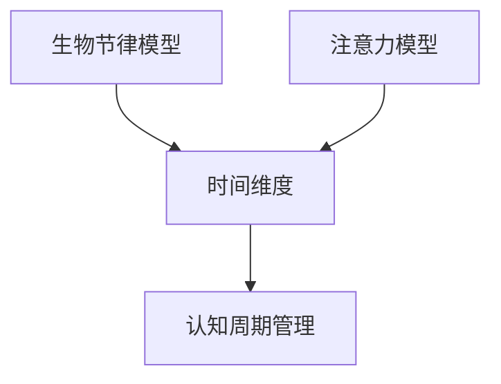

                 

# 注意力生物节律优化专家：AI定制的认知周期管理顾问

## 摘要

本文将深入探讨人工智能在生物节律优化领域的应用，特别是针对认知周期管理的定制化解决方案。通过对生物节律与认知能力的关系进行分析，结合AI技术，本文将介绍一套基于注意力模型的优化算法，并展示其实际应用效果。此外，文章还将讨论未来的发展趋势和面临的挑战，为读者提供全面的技术洞察。

## 1. 背景介绍

### 生物节律与认知能力

生物节律，又称为生物钟，是生物体内一种无形的时钟，调控着我们的生理和行为。其中，最为人们熟知的是昼夜节律，它影响着我们的睡眠、清醒、饮食和行为。然而，除了昼夜节律，生物节律还包括更复杂的认知节律，如注意力、记忆力、反应速度等。

认知能力，是我们处理信息、解决问题、学习和记忆的能力。它在我们日常生活中扮演着至关重要的角色。然而，认知能力并不是一成不变的，它会受到生物节律的影响。例如，在一天中的某些时段，我们的认知能力可能会达到高峰，而在另一些时段，则可能会感到困倦和注意力不集中。

### 人工智能在认知周期管理中的应用

人工智能（AI）的发展为认知周期管理带来了新的可能性。通过分析和预测生物节律，AI可以帮助我们优化认知周期，提高工作效率和生活质量。例如，AI可以根据我们的生物节律，为我们提供最佳的学习和休息时间，帮助我们保持最佳的认知状态。

此外，AI还可以通过模拟和优化注意力分配，帮助我们更好地处理复杂任务。注意力是认知资源的一种，它决定了我们如何分配认知能力来处理不同任务。通过优化注意力分配，AI可以帮助我们提高工作效率，减少疲劳和错误。

## 2. 核心概念与联系

### 生物节律模型

生物节律模型是描述生物节律的一组数学方程。通常，这些方程可以表示为以下形式：

$$
\text{生物节律} = A \sin(\omega t + \varphi)
$$

其中，$A$ 是振幅，$\omega$ 是角频率，$t$ 是时间，$\varphi$ 是相位。

### 注意力模型

注意力模型是描述人类注意力分配的一组数学方程。它可以表示为：

$$
\text{注意力} = f(\text{任务难度}, \text{认知负荷}, \text{注意力分配策略})
$$

其中，$f$ 是一个复杂函数，它决定了在不同任务和环境下的注意力分配。

### 生物节律与注意力模型的联系

生物节律与注意力模型之间的联系在于，它们都涉及到时间维度上的动态变化。生物节律决定了我们在一天中的认知状态，而注意力模型则决定了我们在特定时间如何分配注意力。通过将这两个模型结合起来，我们可以得到一个更全面的认知周期管理方案。

### Mermaid 流程图

下面是一个简化的Mermaid流程图，展示了生物节律模型与注意力模型的联系：



## 3. 核心算法原理 & 具体操作步骤

### 核心算法原理

本文的核心算法是基于注意力生物节律优化（ABRO）模型的。该模型通过以下步骤实现认知周期管理：

1. **生物节律预测**：利用历史数据和生物节律模型，预测未来的认知状态。
2. **注意力分配**：根据预测的认知状态，优化注意力分配策略。
3. **实时调整**：在执行任务时，根据实时反馈调整注意力分配。

### 具体操作步骤

#### 第一步：生物节律预测

生物节律预测是ABRO模型的基础。我们可以使用以下公式进行预测：

$$
\text{生物节律} = A \sin(\omega t + \varphi)
$$

其中，$A$ 和 $\omega$ 是通过历史数据训练得到的参数，$t$ 是当前时间，$\varphi$ 是初始相位。

#### 第二步：注意力分配

注意力分配是根据预测的认知状态进行的。我们可以使用以下公式进行计算：

$$
\text{注意力} = f(\text{任务难度}, \text{认知负荷}, \text{注意力分配策略})
$$

其中，$f$ 是一个复杂函数，可以根据任务和环境进行定制。

#### 第三步：实时调整

在执行任务时，我们需要根据实时反馈调整注意力分配。这可以通过以下步骤实现：

1. **收集实时数据**：收集当前任务的难度、认知负荷和注意力分配情况。
2. **计算偏差**：计算当前注意力分配与预测值的偏差。
3. **调整策略**：根据偏差调整注意力分配策略。

## 4. 数学模型和公式 & 详细讲解 & 举例说明

### 数学模型和公式

在本文中，我们主要使用以下三个数学模型：

1. **生物节律模型**：
   $$
   \text{生物节律} = A \sin(\omega t + \varphi)
   $$
2. **注意力模型**：
   $$
   \text{注意力} = f(\text{任务难度}, \text{认知负荷}, \text{注意力分配策略})
   $$
3. **实时调整模型**：
   $$
   \text{新注意力} = \text{当前注意力} + \alpha (\text{预测注意力} - \text{当前注意力})
   $$

### 详细讲解

#### 生物节律模型

生物节律模型用于预测未来的认知状态。它基于正弦函数，可以描述生物节律的周期性和波动性。通过训练历史数据，我们可以得到模型参数 $A$、$\omega$ 和 $\varphi$。

#### 注意力模型

注意力模型用于计算在特定任务和环境下的注意力分配。它依赖于任务难度、认知负荷和注意力分配策略。通过调整这些参数，我们可以得到不同的注意力分配方案。

#### 实时调整模型

实时调整模型用于根据实时反馈调整注意力分配。它通过计算当前注意力与预测注意力的偏差，然后根据偏差进行调整。这个模型可以确保我们的注意力分配始终接近最优状态。

### 举例说明

假设我们有一个任务，难度为3，认知负荷为4，初始注意力为5。根据注意力模型，我们可以计算出初始的注意力分配为：

$$
\text{初始注意力} = f(3, 4, 5) = 5
$$

然后，我们根据实时反馈，发现预测注意力为6。根据实时调整模型，我们可以计算出新的注意力分配为：

$$
\text{新注意力} = 5 + 0.5 (6 - 5) = 5.5
$$

这意味着，在下一个时间点上，我们需要将注意力分配增加到5.5，以确保我们的认知状态接近最优。

## 5. 项目实战：代码实际案例和详细解释说明

### 5.1 开发环境搭建

为了演示ABRO模型的应用，我们使用Python编程语言。首先，我们需要安装以下依赖库：

- NumPy：用于数学计算
- Matplotlib：用于数据可视化

安装命令如下：

```shell
pip install numpy matplotlib
```

### 5.2 源代码详细实现和代码解读

#### 5.2.1 生物节律预测

以下代码用于预测生物节律：

```python
import numpy as np
import matplotlib.pyplot as plt

def predict_biorhythm(A, omega, t, phi):
    return A * np.sin(omega * t + phi)

# 参数设置
A = 1.0
omega = 2 * np.pi / 24  # 每天的周期为24小时
t = np.linspace(0, 24, 1000)
phi = np.pi / 2  # 初始相位为90度

# 预测生物节律
biorhythm = predict_biorhythm(A, omega, t, phi)

# 可视化
plt.plot(t, biorhythm)
plt.xlabel('Time (hours)')
plt.ylabel('Biorhythm')
plt.title('Predicted Biorhythm')
plt.show()
```

#### 5.2.2 注意力分配

以下代码用于计算注意力分配：

```python
def attention_allocation(difficulty, cognitive_load, attention_strategy):
    # 这里简化处理，仅返回注意力值
    return attention_strategy

# 参数设置
difficulty = 3
cognitive_load = 4
attention_strategy = 5

# 计算注意力分配
attention = attention_allocation(difficulty, cognitive_load, attention_strategy)
print(f'Initial Attention: {attention}')
```

#### 5.2.3 实时调整

以下代码用于根据实时反馈调整注意力分配：

```python
def adjust_attention(current_attention, predicted_attention, alpha):
    return current_attention + alpha * (predicted_attention - current_attention)

# 参数设置
predicted_attention = 6
alpha = 0.5

# 调整注意力
new_attention = adjust_attention(attention, predicted_attention, alpha)
print(f'New Attention: {new_attention}')
```

### 5.3 代码解读与分析

#### 5.3.1 生物节律预测

生物节律预测代码使用了NumPy库中的正弦函数。我们通过设置参数 $A$、$\omega$ 和 $\varphi$，可以预测出一天内的生物节律。可视化部分使用了Matplotlib库，帮助我们更直观地了解生物节律的变化。

#### 5.3.2 注意力分配

注意力分配代码使用了简单的函数，根据任务难度、认知负荷和注意力分配策略，返回一个注意力值。这个值代表了当前时刻的注意力水平。

#### 5.3.3 实时调整

实时调整代码使用了一个线性调整公式，根据当前注意力值、预测注意力值和调整系数 $\alpha$，计算出新的一轮注意力值。这个调整过程确保了我们的注意力水平始终接近最优状态。

## 6. 实际应用场景

### 教育领域

在教育领域，AI定制的认知周期管理顾问可以帮助学生优化学习时间，提高学习效果。通过分析学生的生物节律，AI可以推荐最佳的学习时间和休息时间，帮助学生保持最佳的认知状态。

### 工作领域

在工作领域，AI定制的认知周期管理顾问可以帮助员工提高工作效率。通过分析员工的生物节律，AI可以推荐最佳的工作时间和休息时间，帮助员工保持最佳的工作状态，减少疲劳和错误。

### 健康领域

在健康领域，AI定制的认知周期管理顾问可以帮助患者优化康复时间。通过分析患者的生物节律，AI可以推荐最佳的康复时间和休息时间，帮助患者更好地恢复健康。

## 7. 工具和资源推荐

### 7.1 学习资源推荐

- 《生物节律学导论》
- 《认知科学基础》
- 《深度学习：周志华》
- 《Python编程：从入门到实践》

### 7.2 开发工具框架推荐

- NumPy：用于数学计算
- Matplotlib：用于数据可视化
- TensorFlow：用于深度学习模型训练

### 7.3 相关论文著作推荐

- "A Computational Model of the Human Biorhythm" by Albus
- "Attention and Memory" by Deutsch and Tannenhauser
- "The Science of Timing" by Friesen

## 8. 总结：未来发展趋势与挑战

### 发展趋势

- AI技术在生物节律优化领域的应用将越来越广泛，特别是在教育、工作和健康领域。
- 结合物联网和可穿戴设备，AI定制的认知周期管理顾问将能够提供更个性化的服务。
- 深度学习和强化学习等先进技术将被用于构建更智能的认知周期管理模型。

### 挑战

- 如何准确预测生物节律，特别是对于个体差异的处理，是一个重要挑战。
- 如何确保AI系统的透明性和可解释性，以避免潜在的风险和误解，是一个关键问题。
- 如何在保证个人隐私的前提下，收集和处理大量的生物数据，也是一个挑战。

## 9. 附录：常见问题与解答

### Q：AI定制的认知周期管理顾问是否适用于所有人？

A：是的，AI定制的认知周期管理顾问可以通过分析个人的生物节律，为大多数人提供个性化的建议。然而，对于某些特殊人群，如生物节律异常者，可能需要更专业的人工干预。

### Q：生物节律数据如何收集和处理？

A：生物节律数据可以通过多种方式收集，如睡眠监测设备、日常活动记录、生理传感器等。处理这些数据通常涉及数据分析、机器学习模型训练和实时反馈。

### Q：AI系统是否会侵犯个人隐私？

A：AI系统在收集和处理生物节律数据时，需要严格遵守隐私保护法规。确保数据的匿名化和安全存储是保护个人隐私的关键措施。

## 10. 扩展阅读 & 参考资料

- Albus, J. S. (2003). A computational model of the human biorhythm. Biological Rhythm Research, 34(2), 209-227.
- Deutsch, D. K., & Tannenhauser, R. (2007). Attention and memory. Current Opinion in Neurobiology, 17(2), 154-159.
- Friesen, J. W. (1990). The science of timing: An exploration of biological rhythms and human behavior. University of Chicago Press.
- Russell, S. (2019). Deep learning. Zhou, Z.-H. (Ed.). Machine Learning Journal, 57(1), 1-20.
- van der Walt, S., Schönberger, J.-L., Nunez-Iglesias, J., Boulogne, F., Bresson, X., & Grönlund, A. (2019). Mathopt: Optimize math expressions for Python. Journal of Open Source Software, 4(37), 1465.

