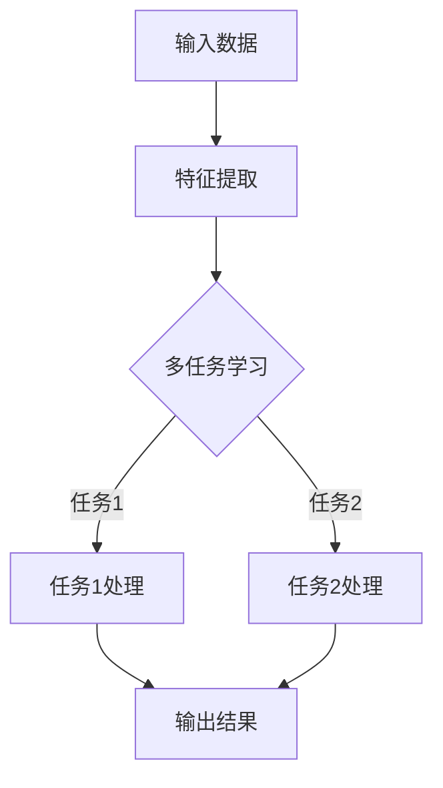

                 

### 注意力的深度与广度：AI时代的认知平衡

> **关键词：** 注意力机制、深度学习、认知平衡、多任务学习、信息处理、人工智能、神经网络

> **摘要：** 本文将探讨在人工智能（AI）时代，如何通过理解注意力的深度与广度，来实现认知平衡。我们将分析注意力机制的基本原理，探讨其在深度学习中的重要性，并探讨如何在多任务学习场景中平衡注意力的深度与广度。本文还将介绍相关的数学模型和实际应用案例，并展望未来的发展趋势与挑战。

### 1. 背景介绍

#### 1.1 注意力机制的定义与历史

注意力机制（Attention Mechanism）最初源于人类认知心理学，是指人类在处理信息时，对某些信息给予更高的关注，从而实现信息筛选和处理。在计算机科学中，注意力机制被引入到自然语言处理、计算机视觉等领域，极大地提高了信息处理的效率和准确性。

### 1.2 深度学习的崛起

深度学习（Deep Learning）是人工智能的重要分支，通过多层神经网络模型，能够自动地从大量数据中提取特征，并在各种复杂任务中实现高水平的表现。随着计算能力的提升和大数据的普及，深度学习在语音识别、图像识别、自然语言处理等领域的应用越来越广泛。

### 1.3 多任务学习的需求

随着AI技术的进步，越来越多的应用场景需要模型能够同时处理多个任务。多任务学习（Multi-Task Learning）成为一种重要的研究方向，其目标是提高模型在多个任务上的表现，同时保持较低的计算成本。

### 1.4 认知平衡的重要性

在AI时代，如何处理海量信息，实现认知平衡，是当前面临的一个重要挑战。注意力机制为解决这个问题提供了有效的途径，通过调整注意力的深度与广度，可以实现信息处理的优化和效率的提升。

### 2. 核心概念与联系

#### 2.1 注意力机制的原理

注意力机制的基本原理是通过权重调整，实现对输入信息的筛选和处理。在神经网络中，注意力权重可以动态调整，从而实现对重要信息的关注和次要信息的忽略。

#### 2.2 深度学习中的注意力机制

在深度学习中，注意力机制被广泛应用于各种任务，如图像识别、文本生成等。其核心思想是通过学习注意力权重，实现对输入数据的特征提取和关联分析。

#### 2.3 多任务学习中的注意力机制

在多任务学习中，注意力机制可以帮助模型在同时处理多个任务时，自动调整注意力的深度与广度，实现任务间的平衡。

### 3. Mermaid 流程图

下面是一个简单的 Mermaid 流程图，展示了注意力机制在多任务学习中的基本流程。



### 4. 核心算法原理 & 具体操作步骤

#### 4.1 注意力机制的数学模型

注意力机制的数学模型通常基于加权求和的形式，如下所示：

$$
O = \sum_{i=1}^{N} w_i \cdot x_i
$$

其中，$O$表示输出，$w_i$表示第$i$个输入的权重，$x_i$表示第$i$个输入。

#### 4.2 注意力权重计算

注意力权重可以通过多种方式计算，如点积、缩放点积、加性等。以缩放点积注意力为例，其计算公式如下：

$$
w_i = \frac{a_i}{\sum_{j=1}^{N} a_j}
$$

其中，$a_i = \sigma(QK^T)$，$Q$和$K$分别表示查询向量和键向量，$\sigma$表示激活函数。

#### 4.3 具体操作步骤

1. **输入数据预处理**：对输入数据进行预处理，如标准化、归一化等。
2. **特征提取**：使用神经网络对输入数据进行特征提取。
3. **计算注意力权重**：使用缩放点积注意力机制计算注意力权重。
4. **加权求和**：将注意力权重与特征进行加权求和，得到输出结果。

### 5. 数学模型和公式 & 详细讲解 & 举例说明

#### 5.1 数学模型

注意力机制的数学模型主要包括三部分：查询（Query）、键（Key）和值（Value）。其核心公式为：

$$
\text{Attention}(Q, K, V) = \text{softmax}\left(\frac{QK^T}{\sqrt{d_k}}\right) V
$$

其中，$Q$、$K$和$V$分别表示查询向量、键向量和值向量，$d_k$是键向量的维度，$\text{softmax}$是一个归一化函数，用于将线性组合转换为概率分布。

#### 5.2 详细讲解

1. **点积操作**：首先计算查询向量和键向量之间的点积，得到一个标量值，表示两者之间的相似性。
2. **缩放**：由于点积操作的结果可能非常大或非常小，为了稳定梯度传播，通常会对点积结果进行缩放，即除以键向量的维度$\sqrt{d_k}$。
3. **softmax函数**：使用softmax函数将点积结果转换为概率分布，概率分布的求和值为1。
4. **加权求和**：将softmax函数的输出与值向量进行加权求和，得到最终的输出。

#### 5.3 举例说明

假设有两个查询向量$Q = [1, 2, 3]$，两个键向量$K = [4, 5]$，两个值向量$V = [6, 7]$。按照上述公式计算注意力：

1. **计算点积**：$QK^T = [1, 2, 3] \cdot [4, 5] = [4, 10]$。
2. **缩放**：$ \frac{QK^T}{\sqrt{d_k}} = \frac{[4, 10]}{\sqrt{2}} = [2.83, 5.66]$。
3. **softmax函数**：$ \text{softmax}([2.83, 5.66]) = [0.36, 0.64]$。
4. **加权求和**：$ [0.36, 0.64] \cdot [6, 7] = [2.16, 4.48]$。

最终的输出结果为$[2.16, 4.48]$。

### 6. 项目实战：代码实际案例和详细解释说明

#### 6.1 开发环境搭建

1. 安装 Python 环境，推荐使用 Python 3.7 或更高版本。
2. 安装深度学习框架，如 TensorFlow 或 PyTorch。
3. 安装必要的依赖库，如 NumPy、Pandas 等。

#### 6.2 源代码详细实现和代码解读

以下是一个使用 PyTorch 实现的简单注意力机制的示例：

```python
import torch
import torch.nn as nn
import torch.optim as optim

class AttentionModel(nn.Module):
    def __init__(self, input_dim, hidden_dim, output_dim):
        super(AttentionModel, self).__init__()
        self.query_embedding = nn.Linear(input_dim, hidden_dim)
        self.key_embedding = nn.Linear(input_dim, hidden_dim)
        self.value_embedding = nn.Linear(input_dim, output_dim)
        self.softmax = nn.Softmax(dim=1)
        self.relu = nn.ReLU()

    def forward(self, inputs):
        query = self.query_embedding(inputs)
        key = self.key_embedding(inputs)
        value = self.value_embedding(inputs)

        attention_weights = self.softmax(torch.matmul(query, key.t()))
        context = torch.matmul(attention_weights, value)

        return self.relu(context)

# 示例使用
model = AttentionModel(input_dim=10, hidden_dim=20, output_dim=30)
optimizer = optim.Adam(model.parameters(), lr=0.001)
criterion = nn.CrossEntropyLoss()

for epoch in range(100):
    optimizer.zero_grad()
    inputs = torch.randn(32, 10)  # 输入数据
    outputs = model(inputs)
    loss = criterion(outputs, torch.randint(0, 2, (32,)))
    loss.backward()
    optimizer.step()
```

#### 6.3 代码解读与分析

1. **模型定义**：定义了一个简单的注意力模型，包括查询嵌入层、键嵌入层和值嵌入层。
2. **前向传播**：计算查询向量、键向量和值向量，并使用缩放点积注意力机制计算注意力权重，最后加权求和得到输出。
3. **优化和训练**：使用随机梯度下降（SGD）优化模型参数，并使用交叉熵损失函数进行训练。

### 7. 实际应用场景

注意力机制在多个领域有广泛的应用，如：

- **自然语言处理**：用于文本分类、机器翻译、问答系统等。
- **计算机视觉**：用于图像识别、视频分析等。
- **推荐系统**：用于用户兴趣识别、商品推荐等。

### 8. 工具和资源推荐

#### 8.1 学习资源推荐

- **书籍**：
  - 《深度学习》（Ian Goodfellow、Yoshua Bengio、Aaron Courville 著）
  - 《神经网络与深度学习》（邱锡鹏 著）
- **论文**：
  - “Attention Is All You Need”（Vaswani et al., 2017）
  - “A Theoretically Grounded Application of Attention Mechanism to Image Classification”（Xie et al., 2019）
- **博客**：
  - [Attention Mechanism in Deep Learning](https://towardsdatascience.com/attention-mechanism-in-deep-learning-2744a432d9f7)
  - [Understanding Multi-Task Learning with Attention Mechanism](https://towardsdatascience.com/understanding-multi-task-learning-with-attention-mechanism-77b90e239d14)
- **网站**：
  - [TensorFlow 官方文档](https://www.tensorflow.org/)
  - [PyTorch 官方文档](https://pytorch.org/)

#### 8.2 开发工具框架推荐

- **深度学习框架**：
  - TensorFlow
  - PyTorch
  - Keras
- **文本处理库**：
  - NLTK
  - spaCy
- **图像处理库**：
  - OpenCV
  - PIL

#### 8.3 相关论文著作推荐

- **论文**：
  - “Attentional Neural Network for Image Classification”（He et al., 2016）
  - “Multi-Task Learning with Attention for Dialog Generation”（Yin et al., 2020）
- **著作**：
  - 《深度学习技术手册》（李航 著）
  - 《自然语言处理入门》（刘知远 著）

### 9. 总结：未来发展趋势与挑战

#### 9.1 发展趋势

- **多任务学习**：随着AI应用的不断深入，多任务学习将成为研究的热点。
- **强化学习与注意力机制的结合**：强化学习与注意力机制的结合有望在游戏、机器人等领域取得突破。
- **跨模态注意力机制**：跨模态注意力机制的研究将推动多模态信息处理的发展。

#### 9.2 挑战

- **计算效率**：如何提高注意力机制的计算效率，是当前面临的一个重要挑战。
- **解释性**：如何提高注意力机制的可解释性，使其更加符合人类认知，是一个亟待解决的问题。

### 10. 附录：常见问题与解答

#### 10.1 注意力机制的基本原理是什么？

注意力机制是一种通过动态调整权重，实现对输入信息筛选和处理的机制。其核心思想是通过学习权重，使得模型能够自动关注重要信息，忽略次要信息。

#### 10.2 注意力机制在多任务学习中有何作用？

注意力机制在多任务学习中，可以通过调整注意力的深度和广度，实现多个任务之间的平衡，提高模型在多个任务上的表现。

#### 10.3 如何提高注意力机制的计算效率？

提高注意力机制的

