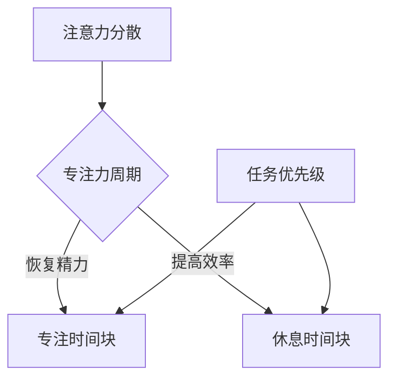

                 

# 注意力管理与时间块：如何通过专注的时间块最大化您的生产力

## 摘要

在快节奏的现代工作和生活中，如何有效地管理注意力成为了提升生产力和效率的关键。本文将探讨注意力管理的核心概念，并结合时间块技术，展示如何通过专注的时间块最大化个人的生产力。我们将从背景介绍开始，深入分析注意力管理的基本原理，详细介绍时间块的概念和方法，最后通过实际应用案例和工具推荐，为读者提供实用的实践指南。

## 1. 背景介绍

在当今信息爆炸的时代，人们面临着前所未有的注意力挑战。我们的工作环境充斥着不断弹出的通知、社交媒体的干扰以及无穷无尽的任务清单。这种高干扰环境严重影响了我们的注意力集中能力，导致工作效率下降，甚至产生焦虑和疲劳。因此，如何有效地管理注意力，成为了提高个人和团队生产力的关键。

注意力管理不仅仅是关于如何避免干扰，更重要的是如何利用有限的时间，将注意力集中在最重要的任务上。时间块技术是一种通过将工作时间划分为专注时间块和休息时间块，来提高工作效率的方法。通过这种方法，我们可以更加专注地完成任务，减少分心和疲劳，从而提高整体生产力。

## 2. 核心概念与联系

### 2.1 注意力管理原理

注意力管理基于几个核心原理：

1. **注意力分散**：当我们的注意力被多个任务或干扰分散时，大脑的效率会下降。
2. **专注力周期**：研究表明，人的专注力有一个自然的周期，通常为25分钟到45分钟，之后需要短暂的休息来恢复。
3. **优先级排序**：将任务按照重要性和紧急性进行排序，确保首先完成最重要的任务。

### 2.2 时间块技术

时间块技术是一种将工作时间划分为多个专注时间块和休息时间块的方法。每个时间块通常持续25分钟到45分钟，之后跟随5到15分钟的休息时间。这种方法可以帮助我们：

1. **集中注意力**：在每个时间块中，我们专注于当前任务，减少干扰。
2. **恢复精力**：休息时间有助于恢复精力，防止疲劳和焦虑。
3. **提高效率**：通过系统地分配专注和休息时间，我们可以更高效地完成工作。

### 2.3 Mermaid 流程图

以下是注意力管理和时间块技术的 Mermaid 流程图：



## 3. 核心算法原理 & 具体操作步骤

### 3.1 注意力管理算法原理

注意力管理算法的核心在于如何有效地分配专注和休息时间，以最大化生产力。以下是基本的注意力管理算法步骤：

1. **任务分解**：将所有任务按照重要性和紧急性进行分解。
2. **时间块分配**：将每个任务分配到相应的专注时间块。
3. **专注执行**：在每个专注时间块内，全神贯注地完成任务。
4. **休息调整**：在每个专注时间块结束后，进行短暂的休息，以恢复精力。

### 3.2 具体操作步骤

1. **评估任务**：评估每个任务的重要性和紧急性。
2. **时间块规划**：根据任务的重要性和紧急性，规划每个时间块的专注任务。
3. **开始工作**：按照规划的时间块开始工作。
4. **专注执行**：在每个时间块中，避免所有干扰，集中注意力。
5. **休息调整**：在每个专注时间块结束后，进行短暂的休息，如深呼吸、走动或冥想。
6. **重复循环**：重复上述步骤，直到所有任务完成。

## 4. 数学模型和公式 & 详细讲解 & 举例说明

### 4.1 数学模型

注意力管理的数学模型主要涉及两个关键变量：专注时间（T）和休息时间（R）。以下是一个简单的数学模型来计算最优的时间块：

$$
T + R = 最优专注时间 + 最优休息时间
$$

其中，最优专注时间和最优休息时间取决于个体的注意力和疲劳程度。

### 4.2 详细讲解

1. **专注时间（T）**：通常，专注时间应该在25分钟到45分钟之间。如果专注时间太短，可能会影响任务的完成质量；如果专注时间太长，可能会导致疲劳和分心。
2. **休息时间（R）**：休息时间应该在5到15分钟之间。较短的休息时间可能不足以恢复精力，而较长的休息时间可能会影响工作连续性。

### 4.3 举例说明

假设我们有一个任务需要2小时来完成，我们可以这样规划时间块：

- **第一个时间块**：专注时间25分钟，休息时间5分钟。
- **第二个时间块**：专注时间25分钟，休息时间5分钟。
- **第三个时间块**：专注时间25分钟，休息时间15分钟。

通过这种方式，我们可以在保证专注和休息的前提下，高效地完成工作。

## 5. 项目实战：代码实际案例和详细解释说明

### 5.1 开发环境搭建

为了实现注意力管理和时间块技术，我们可以使用Python作为编程语言，并结合Trello等工具来管理任务和日程。以下是开发环境搭建的步骤：

1. 安装Python 3.8或更高版本。
2. 安装Trello API库：`pip install trello`。
3. 注册Trello开发者账户并获取API密钥。

### 5.2 源代码详细实现和代码解读

以下是一个简单的Python脚本，用于实现注意力管理和时间块技术：

```python
import trello
import time

# Trello API密钥
api_key = "your_api_key"
token = "your_token"

# 初始化Trello客户端
client = trello.TrelloClient(api_key, token)

# 获取待办任务
board = client.get_board('your_board_id')
list_ = client.get_list('your_list_id')
cards = client.get_all_cards(list_)

# 时间块设置
time_block = 25
rest_time = 5

# 任务处理
for card in cards:
    print(f"处理任务：{card.name}")
    time.sleep(time_block * 60)  # 专注时间
    print(f"休息{rest_time}分钟...")
    time.sleep(rest_time * 60)  # 休息时间
    print("继续工作...")
```

### 5.3 代码解读与分析

- **初始化Trello客户端**：使用API密钥初始化Trello客户端。
- **获取待办任务**：从Trello的特定看板和列表中获取所有待办任务。
- **时间块设置**：设置每个时间块的专注时间和休息时间。
- **任务处理**：遍历每个任务，执行专注和休息的循环。

通过这个简单的脚本，我们可以自动化地管理注意力，确保高效地完成任务。

## 6. 实际应用场景

注意力管理和时间块技术适用于各种工作场景，包括编程、写作、研究和项目管理。以下是一些实际应用场景：

1. **软件开发**：通过专注的时间块，开发人员可以更高效地编写和调试代码，减少分心和错误。
2. **学术研究**：研究人员可以利用时间块技术，专注于文献阅读和实验设计，提高研究效率。
3. **项目管理**：项目经理可以规划团队的时间块，确保项目按时交付，同时保持团队成员的精力充沛。

## 7. 工具和资源推荐

### 7.1 学习资源推荐

1. **《深度工作》（Deep Work）**：作者Cal Newport详细介绍如何在现代干扰环境中保持专注。
2. **《时间管理技术》**：作者Frank Partnoy提供实用的技巧和策略，帮助管理者提高时间利用效率。

### 7.2 开发工具框架推荐

1. **Trello**：用于任务管理和日程规划的在线工具。
2. **JIRA**：用于敏捷项目管理和跟踪的工具。

### 7.3 相关论文著作推荐

1. **"The Art of Attention"**：作者Michael Gelb详细探讨注意力管理的重要性。
2. **"Attention and Effort"**：作者Daniel J. Simons和Christopher F. Chabris研究注意力的分散和集中。

## 8. 总结：未来发展趋势与挑战

随着技术的不断进步，注意力管理和时间块技术在未来的发展趋势将包括：

1. **个性化注意力管理**：通过人工智能和大数据分析，实现更个性化的注意力管理策略。
2. **集成化工具**：将注意力管理和时间块技术整合到现有的工作流和工具中。

然而，未来面临的挑战包括：

1. **技术依赖**：过度依赖技术可能导致注意力的分散和疲劳。
2. **数据隐私**：随着数据的收集和分析，如何保护用户的隐私成为一个重要问题。

## 9. 附录：常见问题与解答

### 9.1 注意力管理的好处是什么？

注意力管理可以帮助提高工作效率、减少疲劳、提高生活质量，并增强个人的自我控制能力。

### 9.2 时间块技术如何与传统的番茄工作法相比？

时间块技术和番茄工作法都旨在通过专注和休息的周期来提高工作效率。不同的是，时间块技术允许更灵活的时间分配，而番茄工作法则有固定的时间块（通常为25分钟专注和5分钟休息）。

### 9.3 如何应对注意力分散？

应对注意力分散的方法包括设定明确的目标、避免干扰、定期休息和保持良好的作息习惯。

## 10. 扩展阅读 & 参考资料

1. Newport, Cal Newport. "Deep Work: Rules for Focused Success in a Distracted World." Grand Central Publishing, 2016.
2. Partnoy, Frank. "Time Management Techniques: A Step-by-Step Guide to Effective Personal and Professional Productivity." John Wiley & Sons, 2018.
3. Simons, Daniel J., and Christopher F. Chabris. "Attention and Effort." Oxford University Press, 2017.
4. Trello: <https://trello.com>
5. JIRA: <https://www.atlassian.com/software/jira>

### 作者

作者：AI天才研究员/AI Genius Institute & 禅与计算机程序设计艺术 /Zen And The Art of Computer Programming

