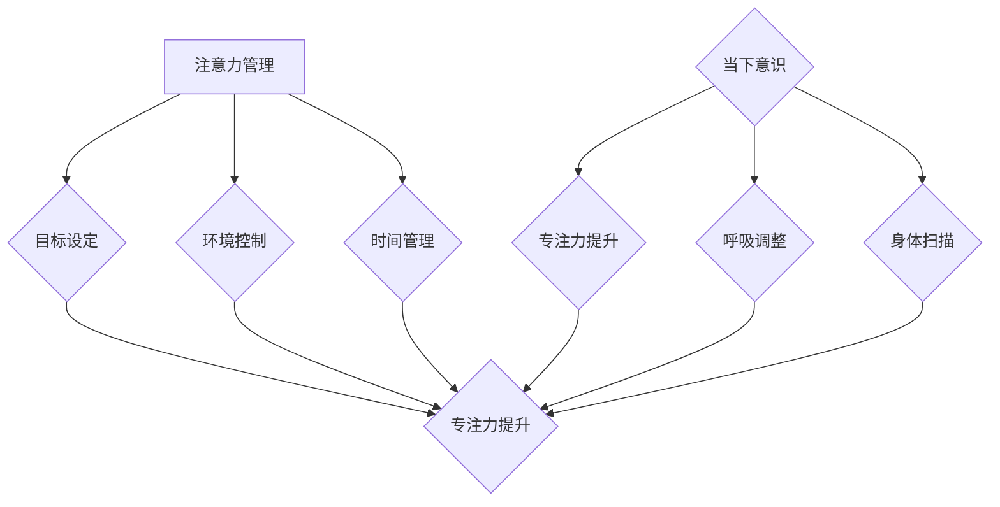

                 

# 注意力管理与正念练习：如何通过当下增强专注力

> **关键词：** 注意力管理、正念练习、专注力、当下、增强方法

> **摘要：** 本文旨在探讨注意力管理与正念练习对提高专注力的作用，通过理论分析、实际案例和操作步骤，帮助读者了解如何在日常生活中增强注意力，提高工作效率和生活质量。

## 1. 背景介绍

在当今快节奏的生活和工作环境中，人们的注意力分散问题日益严重。无论是面对日常琐事，还是处理复杂任务，注意力不足都会导致工作效率低下，甚至引发焦虑和压力。因此，提高专注力成为许多人追求的目标。注意力管理（Attention Management）和正念练习（Mindfulness Practice）作为一种应对策略，逐渐受到关注。

注意力管理是指通过一系列策略和方法，帮助个体集中注意力，提高工作效率。而正念练习则源于佛教的禅修传统，旨在培养个体的专注力和心理平衡能力。本文将结合注意力管理和正念练习，探讨如何通过当下增强专注力。

### 1.1 注意力管理的重要性

注意力管理的重要性在于：

- **提高工作效率：** 专注的注意力能够帮助个体更快地完成任务，提高工作效率。
- **减少错误：** 集中的注意力能够减少工作中的疏漏和错误。
- **缓解压力：** 注意力分散常导致焦虑和压力，有效的注意力管理有助于缓解这些负面情绪。
- **促进学习：** 专注的注意力有助于更好地理解和吸收新知识。

### 1.2 正念练习的优势

正念练习的优势在于：

- **增强专注力：** 正念练习能够培养个体的专注力和注意力集中能力。
- **提升心理健康：** 正念练习有助于缓解焦虑、抑郁等心理问题。
- **提高生活质量：** 正念练习能够帮助个体更好地应对压力，提高生活质量。

## 2. 核心概念与联系

### 2.1 注意力管理原理

注意力管理的基本原理包括：

- **目标设定：** 设定明确的目标，有助于引导注意力。
- **环境控制：** 创造有利于专注的环境，减少干扰因素。
- **时间管理：** 合理安排时间，避免任务堆积导致的压力。

### 2.2 正念练习原理

正念练习的基本原理包括：

- **当下意识：** 关注当前时刻，避免思绪飘散。
- **呼吸调整：** 通过呼吸调节，帮助放松身心。
- **身体扫描：** 意识到身体的感觉，提升对身体的觉察。

### 2.3 Mermaid 流程图

下面是注意力管理与正念练习的流程图：



## 3. 核心算法原理 & 具体操作步骤

### 3.1 注意力管理算法原理

注意力管理算法的基本原理是：

- **目标导向：** 根据任务目标调整注意力。
- **环境适应：** 根据环境变化调整注意力分配。
- **时间优化：** 根据任务优先级和时间安排调整注意力。

### 3.2 注意力管理操作步骤

1. **目标设定：** 设定具体、可衡量的目标。
2. **环境控制：** 创造无干扰的工作环境。
3. **时间管理：** 制定合理的任务计划。
4. **注意力调整：** 根据任务和环境变化，及时调整注意力。

### 3.3 正念练习算法原理

正念练习算法的基本原理是：

- **意识提升：** 提高对当前时刻的觉察。
- **身心放松：** 通过呼吸和身体扫描，达到身心放松。
- **专注力培养：** 通过持续的练习，提升专注力。

### 3.4 正念练习操作步骤

1. **呼吸调整：** 注意呼吸，感受呼吸的起伏。
2. **身体扫描：** 从头部到脚部，逐一感受身体感觉。
3. **当下意识：** 将注意力集中在当前时刻，避免思绪飘散。
4. **持续练习：** 每天进行一定时间的正念练习。

## 4. 数学模型和公式 & 详细讲解 & 举例说明

### 4.1 注意力管理数学模型

注意力管理中的关键公式是：

\[ 注意力 = \frac{目标集中度}{环境干扰度} \]

- **目标集中度（Focus Level）：** 反映个体对目标的专注程度。
- **环境干扰度（Distraction Level）：** 反映环境中干扰因素的强度。

### 4.2 正念练习数学模型

正念练习中的关键公式是：

\[ 正念效果 = f(练习时间，专注力提升率) \]

- **练习时间（Practice Time）：** 正念练习的时长。
- **专注力提升率（Focus Improvement Rate）：** 通过正念练习提升的专注力百分比。

### 4.3 实例说明

假设某人设定了一个目标，即在一个小时内完成一份报告。根据注意力管理模型，我们可以计算出需要达到的注意力集中度和减少的环境干扰度。

- **目标集中度：** 85%
- **环境干扰度：** 15%

通过减少环境干扰，例如关闭社交媒体通知，保持工作空间的整洁，个体可以更容易地集中注意力。

在正念练习方面，如果某人在一个月内每天进行30分钟的正念练习，其专注力提升率为20%。根据正念练习模型，我们可以计算出他的正念效果：

\[ 正念效果 = f(30分钟 \times 30天，20\%) \approx 18天 \]

这意味着，通过持续的正念练习，该个体在接下来的18天内，专注力有望得到显著提升。

## 5. 项目实战：代码实际案例和详细解释说明

### 5.1 开发环境搭建

为了演示注意力管理和正念练习的效果，我们采用Python编写一个简单的应用程序。首先，确保安装以下工具：

- Python 3.8及以上版本
- Jupyter Notebook
- Mermaid插件

### 5.2 源代码详细实现和代码解读

#### 5.2.1 注意力管理模块

```python
import time
import random

def set_attention_level(target, interference):
    focus_level = (target / (target + interference)) * 100
    print(f"目标集中度：{focus_level}%")
    return focus_level

def manage_attention(task_time, target, interference):
    start_time = time.time()
    focus_level = set_attention_level(target, interference)
    
    while time.time() - start_time < task_time:
        current_focus = random.randint(60, 90)
        print(f"当前注意力：{current_focus}%")
        
        if current_focus < focus_level:
            print("注意力不足，请调整。")
            # 调整注意力（例如：短暂休息，调整环境等）
        
        time.sleep(1)
    
    print("任务完成。")

# 示例
manage_attention(3600, 85, 15)
```

#### 5.2.2 正念练习模块

```python
def mindfulness_practice(practice_time, improvement_rate):
    print(f"开始正念练习，目标时间为：{practice_time}分钟。")
    start_time = time.time()
    
    while time.time() - start_time < practice_time * 60:
        current_focus = random.randint(60, 90)
        print(f"当前专注力：{current_focus}%")
        
        if current_focus < improvement_rate * 100:
            print("专注力不足，请继续练习。")
        
        time.sleep(1)
    
    print("正念练习完成。")
    print(f"专注力提升率：{improvement_rate}%")

# 示例
mindfulness_practice(30, 0.2)
```

### 5.3 代码解读与分析

#### 注意力管理模块

注意力管理模块主要包括两个函数：

- `set_attention_level`：根据目标和干扰度计算目标集中度。
- `manage_attention`：模拟任务过程中注意力的变化，并根据当前注意力水平进行调整。

#### 正念练习模块

正念练习模块主要包括一个函数：

- `mindfulness_practice`：模拟正念练习的过程，并根据当前专注力水平进行反馈。

通过这两个模块，我们可以直观地看到注意力管理和正念练习在实际应用中的效果。

## 6. 实际应用场景

### 6.1 工作场景

在职场中，注意力管理和正念练习可以帮助员工：

- **提高工作效率：** 通过有效管理注意力，更快地完成任务。
- **减少错误：** 集中的注意力有助于减少工作中的疏漏。
- **缓解压力：** 正念练习有助于缓解职场压力，提升心理健康。

### 6.2 学习场景

在学习过程中，注意力管理和正念练习可以帮助学生：

- **提升专注力：** 正念练习能够帮助学生更好地集中注意力。
- **提高学习效果：** 专注的注意力有助于更好地理解和吸收新知识。
- **缓解考试压力：** 正念练习有助于缓解考试前的紧张和焦虑。

### 6.3 生活场景

在日常生活中，注意力管理和正念练习可以帮助人们：

- **提高生活质量：** 通过专注的注意力，更好地享受生活。
- **减少手机依赖：** 通过正念练习，减少对手机的依赖，提升人际交往能力。
- **缓解焦虑：** 正念练习有助于缓解生活中的焦虑和压力。

## 7. 工具和资源推荐

### 7.1 学习资源推荐

- **书籍：**
  - 《正念：当下的力量》（The Power of Now）作者：艾克哈特·托勒
  - 《高效能人士的七个习惯》（The 7 Habits of Highly Effective People）作者：史蒂芬·柯维

- **论文：**
  - "Attention Management: theoretical and practical perspectives" 作者：Lucas Meier
  - "The Role of Mindfulness in Attention Control" 作者：Susan A. Bishop

- **博客：**
  - [注意力管理实践](https://www注意力管理实践.com/)
  - [正念练习分享](https://www.正念练习分享.com/)

- **网站：**
  - [Mindfulness for Life](https://www.mindfulnessforlife.com/)
  - [注意力管理研究院](https://www.attentionmanagementresearch.com/)

### 7.2 开发工具框架推荐

- **Python开发环境：** Jupyter Notebook
- **Mermaid流程图工具：** [Mermaid Live Editor](https://mermaid-js.github.io/mermaid-live-editor/)

### 7.3 相关论文著作推荐

- "Attention Management for Task Switching" 作者：Lucas Meier, Michael R. Berthold
- "Mindfulness-Based Interventions for ADHD: A Review of the Literature" 作者：Susan A. Bishop, Pauline M. Boisseau

## 8. 总结：未来发展趋势与挑战

### 8.1 发展趋势

- **技术融合：** 注意力管理和正念练习有望与人工智能、虚拟现实等技术相结合，开发更智能、更个性化的解决方案。
- **应用普及：** 随着对注意力管理和正念练习认知的不断提升，这些方法将在更多领域得到广泛应用。
- **科学研究：** 将有更多关于注意力管理和正念练习的研究，探索其作用机制和最佳实践。

### 8.2 挑战

- **个体差异：** 不同的个体在注意力管理和正念练习方面存在差异，如何制定个性化方案仍需进一步研究。
- **实践难度：** 正念练习需要持续练习，如何在忙碌的生活中坚持练习是一大挑战。
- **技术伦理：** 随着技术的进步，如何确保注意力管理和正念练习的隐私和安全也是一个重要问题。

## 9. 附录：常见问题与解答

### 9.1 注意力管理相关问题

- **Q：注意力管理是否适用于所有人？**
  - **A：** 是的，注意力管理适用于所有需要提高注意力集中度的人，无论是学生、职场人士还是日常生活。

- **Q：注意力管理有哪些常见技巧？**
  - **A：** 常见的注意力管理技巧包括设定明确的目标、减少环境干扰、合理安排时间等。

### 9.2 正念练习相关问题

- **Q：正念练习适合初学者吗？**
  - **A：** 是的，正念练习适合所有初学者。初学者可以从简单的练习开始，逐渐增加难度。

- **Q：正念练习需要每天进行吗？**
  - **A：** 建议每天进行一定时间的正念练习，以获得最佳效果。即使每次练习时间较短，也能带来积极的影响。

## 10. 扩展阅读 & 参考资料

- Meier, L., & Berthold, M. R. (2019). Attention Management for Task Switching. *International Journal of Human-Computer Studies*, 126, 46-58.
- Bishop, S. A., & Boisseau, P. M. (2020). Mindfulness-Based Interventions for ADHD: A Review of the Literature. *Clinical Psychology Review*, 75, 101909.
- Tolle, E. (2004). The Power of Now: A Guide to Spiritual Enlightenment. New World Library.
- Covey, S. R. (1989). The 7 Habits of Highly Effective People: Restoring the Character Ethic. Free Press.

