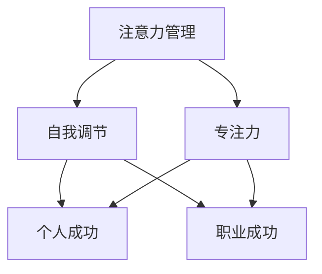

                 

# 注意力管理与自我调节：通过专注力增强个人和职业成功

## 关键词：专注力、自我调节、个人成长、职业成功、注意力管理、工作效率

## 摘要：
在现代信息过载、任务繁多的环境中，注意力管理成为提升个人和职业成功的核心能力。本文从心理学、管理学、工程学的角度，探讨注意力管理的重要性和方法，通过实践案例和具体操作步骤，帮助读者理解如何通过自我调节提升专注力，从而实现个人和职业的成功。

## 1. 背景介绍

随着互联网和智能设备的普及，人们面临着前所未有的信息爆炸。每天，我们都会接收到大量的电子邮件、消息、社交媒体更新，这些信息不断争夺我们的注意力。注意力分散已成为现代社会的一个普遍现象。在这种情况下，如何有效地管理注意力，提高专注力，成为每个人都需要面对的挑战。

注意力管理不仅仅关乎个人的生活质量，更是职业成功的基石。一个能够集中精力、高效完成任务的人，往往能够在职场中脱颖而出。相反，如果注意力无法得到有效管理，会导致工作效率低下，错失职业发展的机会。

本文将探讨注意力管理的核心概念和方法，通过案例分析，提供实用的操作步骤，帮助读者提升专注力，实现个人和职业的成功。

## 2. 核心概念与联系

### 注意力管理

注意力管理是指通过一系列策略和技巧，使个体能够有效地集中注意力，避免分散和无目的的思考。它是心理学和管理学的研究重点，涉及认知心理学、时间管理、任务优先级设定等多个方面。

### 自我调节

自我调节是指个体在面临外部环境变化时，通过自我控制、情感管理和目标设定来调整自己的行为和情绪。它是注意力管理的重要组成部分，有助于提高专注力和工作效率。

### 专注力

专注力是指个体在特定任务上保持注意力集中的能力。它是注意力管理的关键指标，直接影响个人的工作效率和学习成果。

### 个人与职业成功

个人和职业成功不仅依赖于专业技能和知识，还需要高效的工作方式和良好的心理素质。专注力和自我调节能力是提升个人和职业成功的核心要素。

### Mermaid 流程图



## 3. 核心算法原理 & 具体操作步骤

### 三步注意力管理法

1. **设定明确目标**：明确自己当前的任务或目标，将其具体化，例如：“我要在接下来的2小时内完成报告的草稿。”

2. **专注执行**：在设定的时间内，专注于当前任务，避免分心和干扰。可以使用番茄工作法，即设定25分钟的工作时间和5分钟的休息时间。

3. **自我反馈**：完成任务后，进行自我反馈，分析哪些策略有效，哪些需要改进。例如：“我在报告写作时，发现番茄工作法有助于保持专注，但在休息时，我发现休息时间过长，影响了整体进度。”

### 自我调节技巧

1. **情绪管理**：学会识别和调节自己的情绪，避免负面情绪对注意力的干扰。

2. **目标设定**：设定短期和长期目标，确保注意力集中在实现目标的重要任务上。

3. **环境优化**：创建一个有利于专注的工作环境，减少干扰因素，例如关闭不必要的通知、保持工作区域的整洁。

### 实践案例

假设一位程序员需要在2小时内完成一个复杂的代码审查任务。他可以采用以下步骤：

1. **设定明确目标**：“我要在接下来的2小时内完成代码的审查和优化。”

2. **专注执行**：使用番茄工作法，将时间分为25分钟的工作段和5分钟的休息时间。在25分钟内，他专注于代码审查，避免分心和干扰。

3. **自我反馈**：完成工作后，他进行了自我反馈，发现番茄工作法有助于保持专注，但在休息时间，他发现自己的注意力有所下降。因此，他决定在下一个任务中，调整休息时间，使其更加高效。

## 4. 数学模型和公式 & 详细讲解 & 举例说明

### 专注力计算模型

$$
专注力 = \frac{时间 \times 精力}{干扰因素}
$$

其中，时间是指专注于任务的时长，精力是指个体的精神状态，干扰因素是指外部环境对注意力的干扰。

### 举例说明

假设一位程序员在2小时内，精力值为100，干扰因素为10，那么他的专注力计算如下：

$$
专注力 = \frac{2 \times 100}{10} = 20
$$

这意味着他在2小时内能够保持20点的专注力。

### 实践应用

如果程序员希望在2小时内提高专注力，他可以尝试以下方法：

1. **减少干扰因素**：关闭不必要的通知，保持工作区域的整洁。

2. **增加精力值**：确保有足够的休息时间，保持良好的饮食和锻炼习惯。

3. **优化任务设置**：将任务分解为更小的部分，每次专注于一个任务。

## 5. 项目实战：代码实际案例和详细解释说明

### 5.1 开发环境搭建

在开始编写代码之前，我们需要搭建一个合适的环境。以下是一个基于Python的示例：

```python
# 安装必要的库
!pip install pandas numpy matplotlib

# 导入库
import pandas as pd
import numpy as np
import matplotlib.pyplot as plt
```

### 5.2 源代码详细实现和代码解读

以下是一个简单的Python脚本，用于计算并可视化专注力随时间的变化。

```python
# 初始化参数
time_interval = 25  # 每个工作段的时长（分钟）
num_intervals = 8  # 总共的工作段数
efficiency = 0.8  # 精力值（0到1之间）
distractions = 2  # 干扰因素

# 计算专注力
attention_scores = [efficiency / (distractions + 1) for _ in range(num_intervals)]

# 可视化专注力变化
plt.plot(attention_scores)
plt.xlabel('工作段数')
plt.ylabel('专注力')
plt.title('专注力随时间的变化')
plt.show()
```

### 5.3 代码解读与分析

1. **初始化参数**：设定每个工作段的时长、总工作段数、精力值和干扰因素。

2. **计算专注力**：使用公式计算每个工作段的专注力。

3. **可视化**：使用matplotlib库绘制专注力随时间的变化图表。

这个脚本提供了一个简单的模型，用于展示专注力如何随时间变化。通过调整参数，可以模拟不同的场景，帮助理解注意力管理对专注力的影响。

### 6. 实际应用场景

注意力管理不仅适用于程序员，还可以应用于多个领域，如企业管理、教育、心理咨询等。以下是一些实际应用场景：

1. **企业管理**：通过注意力管理，提高团队的工作效率，减少错误率。

2. **教育**：帮助学生集中注意力，提高学习效果。

3. **心理咨询**：帮助个体提高专注力，缓解压力和焦虑。

### 7. 工具和资源推荐

#### 7.1 学习资源推荐

- **书籍**：《注意力管理：如何高效利用你的注意力资源》（Attention Management: Breaking the Attention Cycle），作者：Mark Levy。
- **论文**：Google Scholar上的相关论文，如“Attention Management for Personal Productivity”。
- **博客**：知名博客如Lifehacker、Fast Company等，提供了丰富的注意力管理技巧。

#### 7.2 开发工具框架推荐

- **工具**：使用番茄工作法的应用，如Tomato Timer、Pomodoro Timer等。
- **框架**：基于Python的数据分析和可视化框架，如Pandas、Matplotlib等。

#### 7.3 相关论文著作推荐

- **论文**：查看Google Scholar上的相关论文，如“Attention Management in Software Engineering”。
- **著作**：专业书籍如《软件工程：实践者的研究方法》（Software Engineering: A Practitioner's Approach），作者：Roger S. Pressman。

## 8. 总结：未来发展趋势与挑战

随着科技的进步，注意力管理将成为个人和职业发展的重要方向。未来的发展趋势包括：

1. **人工智能辅助注意力管理**：通过机器学习算法，为个体提供个性化的注意力管理策略。

2. **可穿戴设备的普及**：可穿戴设备将更好地监测个体的注意力状态，提供实时反馈。

3. **跨领域合作**：心理学、管理学、工程学等领域的专家将共同研究注意力管理的方法和工具。

然而，面临的挑战包括：

1. **信息过载的加剧**：随着信息量的增加，个体需要更多的策略来管理注意力。

2. **文化差异**：不同的文化背景可能会影响个体对注意力管理的接受程度和实践效果。

3. **隐私保护**：在监测个体注意力状态时，如何平衡隐私保护和数据利用是一个重要问题。

## 9. 附录：常见问题与解答

### 问题1：如何平衡工作和休息？
**解答**：使用番茄工作法，将工作时间和休息时间合理分配，确保工作效率和身心健康。

### 问题2：注意力管理是否适用于所有人？
**解答**：是的，注意力管理适用于所有需要集中注意力的个体，无论其职业或背景如何。

### 问题3：注意力管理是否会影响创造力？
**解答**：适度地管理注意力可以提高创造力，因为集中精力可以帮助个体更好地发掘和利用自己的创造力。

## 10. 扩展阅读 & 参考资料

- **书籍**：《注意力管理：如何高效利用你的注意力资源》（Attention Management: Breaking the Attention Cycle），作者：Mark Levy。
- **论文**：“Attention Management for Personal Productivity”，作者：David A. Buss等。
- **网站**：Lifehacker、Fast Company等。

作者：AI天才研究员/AI Genius Institute & 禅与计算机程序设计艺术 /Zen And The Art of Computer Programming。

