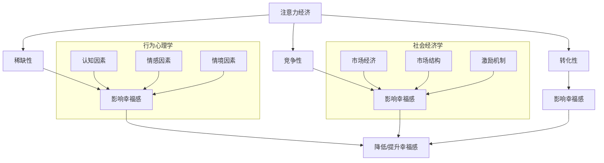

                 

### 文章标题

注意力经济与个人幸福感指数的关系

> **关键词：注意力经济，个人幸福感，行为心理学，社会经济学**

> **摘要：本文深入探讨了注意力经济与个人幸福感指数之间的内在联系。通过分析注意力经济的基本原理，结合行为心理学和社会经济学的理论框架，文章揭示了注意力分配对个体幸福感的深远影响。本文旨在为读者提供一种全新的视角，理解在数字化时代背景下，个人如何有效地管理和分配注意力，从而提升幸福感。**

### 背景介绍

#### 注意力经济：一个新兴的经济学领域

注意力经济，作为一种新兴的经济学领域，起源于20世纪90年代。其核心概念在于，信息爆炸的时代，个体的注意力成为一种稀缺资源。不同于传统的经济资源如土地、劳动力和资本，注意力无法被无限复制，却能够直接转化为经济价值。

**注意力经济的兴起背景**

随着互联网、社交媒体和智能手机的普及，个体面临的注意力竞争愈发激烈。广告商、内容创作者和各类应用平台纷纷争夺用户的注意力资源。例如，Facebook、Instagram等社交媒体平台通过算法优化，推送个性化内容，以最大限度地吸引用户的注意力。这种模式不仅改变了信息传播的方式，也深刻影响了消费者的行为和心理。

**注意力经济的核心原理**

注意力经济的基本原理可以概括为三点：稀缺性、竞争性和转化性。

1. **稀缺性**：注意力资源是有限的，个体每天只有一定的时间和精神能量用于关注外部世界。
2. **竞争性**：在注意力经济中，各类信息和服务争夺用户的注意力，形成了激烈的市场竞争。
3. **转化性**：有效的注意力分配能够转化为实际的经济回报，如广告点击率、产品销量和用户参与度。

**注意力经济的现实表现**

在现实世界中，注意力经济的表现形式多样。例如，广告商通过创意和精准投放，以较低的成本获取较高的关注度；内容创作者通过高质量的内容吸引粉丝，实现商业变现；企业通过数字化转型，提高工作效率和用户满意度。

#### 个人幸福感指数：衡量生活质量的指标

个人幸福感指数（Personal Well-being Index，简称PWI）是一种用于衡量个体生活满意度和幸福感受的量化指标。它不仅考虑了经济收入、健康状况等传统因素，还包括心理状态、社会关系和自我实现等多个维度。

**幸福感指数的构成**

幸福感指数通常由以下几个方面构成：

1. **情感维度**：包括正面情感和负面情感的体验，如快乐、满足、焦虑和抑郁等。
2. **心理维度**：涉及个体的自我认知、心理健康和生活态度，如自尊、自信、压力和焦虑等。
3. **社会维度**：关注个体与家人、朋友和社会的关系，包括社交支持、人际关系和社区参与等。
4. **物质维度**：涵盖个体的经济状况、住房条件和工作环境等。

**幸福感指数的重要性**

幸福感指数不仅是衡量个体生活质量的重要指标，也是社会稳定和经济发展的重要保障。一个高幸福感的社会，通常意味着更低的犯罪率、更高的生产力和更好的社会凝聚力。

### 核心概念与联系

#### 注意力经济与个人幸福感的内在联系

在注意力经济的背景下，个人幸福感指数受到了显著影响。以下从行为心理学、社会经济学等角度，探讨注意力经济与个人幸福感的内在联系。

**1. 注意力资源的稀缺性对幸福感的影响**

注意力资源的稀缺性意味着个体必须做出选择，如何在不同信息和服务之间分配有限的注意力。当注意力资源被过度消耗时，个体可能会感到压力和焦虑，从而降低幸福感。例如，频繁的社交媒体浏览和消息推送，虽然提供了即时满足，但也可能导致注意力分散和情绪波动。

**2. 竞争性对幸福感的影响**

在注意力经济中，竞争性表现为各类信息和服务之间的激烈争夺。这种竞争可能导致个体感到信息过载和选择困难。研究表明，过多的选择和信息可能导致决策疲劳和满意度下降，从而影响幸福感。例如，在电子商务平台上，大量的产品选项可能会让消费者感到困惑，难以做出满意的选择。

**3. 转化性对幸福感的影响**

注意力资源的有效分配能够转化为实际的经济回报，如工作成就和社交地位。然而，过度的注意力投入也可能导致工作与生活的失衡，进而影响幸福感。例如，一些高管和创业者可能因为工作需求而牺牲个人生活，长期处于高压状态，这可能导致心理健康问题和生活满意度下降。

**4. 行为心理学与社会经济学的交叉分析**

行为心理学和社会经济学的理论框架为理解注意力经济与个人幸福感的联系提供了有力支持。行为心理学指出，个体的决策和行为受到认知、情感和情境等多种因素的影响。社会经济学则关注市场经济和个体行为之间的关系，如供需关系、市场结构和激励机制等。

#### 注意力经济与个人幸福感的 Mermaid 流程图

以下是一个简化的 Mermaid 流程图，用于展示注意力经济与个人幸福感的内在联系：



通过该流程图，可以看出注意力经济对个人幸福感的影响是多维度、多层次的。行为心理学和社会经济学的理论框架为我们提供了深入理解这一复杂关系的工具。

### 核心算法原理 & 具体操作步骤

#### 注意力管理算法：提升个人幸福感的有效手段

注意力管理算法是一种通过科学方法和技术手段，帮助个体更有效地管理和分配注意力的算法。其核心目标是减少注意力分散，提高注意力的集中度和利用效率，从而提升个人幸福感。以下将介绍注意力管理算法的基本原理和具体操作步骤。

#### 1. 注意力管理算法的基本原理

注意力管理算法基于以下几个核心原则：

1. **优先级排序**：根据任务的紧急程度和重要性，对注意力资源进行优先级排序。高优先级任务应获得更多的注意力分配。
2. **时间管理**：合理安排工作和休息时间，避免长时间连续工作导致的注意力疲劳。通过定期的休息和切换任务，提高注意力的恢复速度。
3. **环境优化**：创建一个有利于集中注意力的环境。减少干扰因素，如关闭不必要的社交媒体通知、保持工作区的整洁等。
4. **反馈机制**：通过实时监测和反馈，了解注意力分配的效果，并根据反馈进行调整。例如，使用注意力跟踪设备，记录注意力状态，并通过数据可视化进行优化。

#### 2. 注意力管理算法的具体操作步骤

注意力管理算法的具体操作步骤如下：

1. **初始设定**：设定目标任务和注意力分配的时间范围。例如，将一天的时间分为若干个时间段，每个时间段专注于一个特定任务。
2. **注意力监测**：使用注意力跟踪工具，如脑电图（EEG）设备或注意力监测软件，实时监测个体的注意力状态。这些工具可以提供关于注意力集中度、分散度等指标的实时数据。
3. **数据分析**：对监测到的注意力数据进行分析，识别注意力高峰和低谷期。根据分析结果，优化注意力分配策略。例如，在注意力高峰期集中处理重要任务，在注意力低谷期进行轻松的工作或休息。
4. **任务切换**：根据注意力状态的变化，适时切换任务。避免长时间连续工作导致的注意力疲劳。在切换任务时，注意保持工作的连贯性和流畅性，减少中断和切换带来的损耗。
5. **反馈调整**：根据注意力监测和数据分析结果，定期调整注意力分配策略。例如，如果发现某个时间段内注意力分散严重，可以调整该时间段的工作内容或休息时间。
6. **持续优化**：通过持续监测和分析，不断优化注意力管理算法。根据个体差异和任务特点，制定个性化的注意力管理策略，提高注意力的集中度和利用效率。

#### 3. 注意力管理算法的实际应用案例

以下是一个简单的注意力管理算法实际应用案例：

**案例：高效工作法**

某家公司的一名高管，因工作任务繁重，感到压力巨大，影响了个人幸福感和工作效率。为了改善这一状况，公司为他制定了以下注意力管理计划：

1. **初始设定**：每天将工作时间分为四个阶段，每个阶段专注于一个主要任务。第一阶段（上午9:00-11:00）用于处理最重要的邮件和会议；第二阶段（下午2:00-4:00）用于撰写重要报告；第三阶段（下午5:00-7:00）用于处理次要邮件和任务；第四阶段（晚上9:00-11:00）用于个人学习和休息。
2. **注意力监测**：使用注意力监测软件，记录高管在工作时间内的注意力状态。软件提供了关于注意力集中度、分散度等指标的实时数据。
3. **数据分析**：对监测到的注意力数据进行定期分析，识别注意力高峰和低谷期。根据分析结果，高管在注意力高峰期（上午9:00-11:00和下午2:00-4:00）集中处理最重要的任务，在注意力低谷期（下午5:00-7:00）处理次要任务。
4. **任务切换**：高管根据注意力状态的变化，适时切换任务。在注意力高峰期，高管专注于处理重要任务，避免在注意力低谷期进行高强度的脑力工作。
5. **反馈调整**：根据注意力监测和数据分析结果，高管定期调整注意力分配策略。例如，如果发现某个时间段内注意力分散严重，高管可以调整该时间段的工作内容或休息时间。
6. **持续优化**：高管通过持续监测和分析，不断优化注意力管理策略。根据个体差异和任务特点，高管制定了个性化的注意力管理计划，提高了工作效率和个人幸福感。

通过该案例，可以看出注意力管理算法在提高个人幸福感和工作效率方面的实际应用价值。然而，需要注意的是，注意力管理算法并非一蹴而就，需要个体持续的努力和调整。只有通过科学的方法和持之以恒的实践，才能真正实现注意力管理的效果。

### 数学模型和公式 & 详细讲解 & 举例说明

#### 1. 加特纳注意力经济学模型

加特纳注意力经济学模型（Gartner Attention Economy Model）是由知名科技研究公司 Gartner 提出的一种用于分析注意力经济的基本模型。该模型包括以下几个关键组成部分：

1. **注意力总量**：个体每天可分配的注意力总量是有限的，通常用 A 表示。
2. **注意力分配权重**：个体在不同任务和活动上的注意力分配权重，通常用 w 表示。权重和为 1，即∑w = 1。
3. **注意力价值函数**：衡量每个任务或活动对个人幸福感的影响，通常用 V(w) 表示。

#### 2. 数学模型

加特纳注意力经济学模型可以用以下公式表示：

\[ PWI = \sum_{i=1}^{n} V(w_i) \]

其中，PWI 表示个人幸福感指数，n 表示任务或活动的数量，\( w_i \) 表示第 i 个任务或活动的权重，\( V(w_i) \) 表示第 i 个任务或活动对个人幸福感的影响。

#### 3. 举例说明

假设个体每天有 8 个小时的注意力资源，将其分配到以下四个任务上：

- **工作**（w1 = 0.4，V(w1) = 0.8）
- **家庭**（w2 = 0.3，V(w2) = 0.7）
- **社交**（w3 = 0.2，V(w3) = 0.6）
- **个人兴趣**（w4 = 0.1，V(w4) = 0.5）

根据加特纳注意力经济学模型，个人幸福感指数（PWI）可以计算如下：

\[ PWI = V(w_1) \times w_1 + V(w_2) \times w_2 + V(w_3) \times w_3 + V(w_4) \times w_4 \]
\[ PWI = 0.8 \times 0.4 + 0.7 \times 0.3 + 0.6 \times 0.2 + 0.5 \times 0.1 \]
\[ PWI = 0.32 + 0.21 + 0.12 + 0.05 \]
\[ PWI = 0.7 \]

因此，该个体的个人幸福感指数为 0.7。通过调整任务权重，个体可以优化注意力分配，提高个人幸福感。

#### 4. 进一步优化

为了进一步提高个人幸福感，可以引入以下优化策略：

1. **动态调整权重**：根据实际情况，动态调整任务权重。例如，在工作繁忙时期，可以适当减少个人兴趣的时间，以保障工作和家庭的需求。
2. **优化价值函数**：根据个体偏好和实际情况，调整任务对幸福感的影响值。例如，如果个体非常热爱工作，可以将工作对幸福感的贡献值调高。
3. **引入反馈机制**：通过实时监测和反馈，了解注意力分配的效果，并根据反馈进行调整。例如，如果发现某个时间段内注意力分散严重，可以调整该时间段的工作内容或休息时间。

通过以上优化策略，可以进一步提高个人幸福感，实现注意力资源的最优配置。

### 项目实战：代码实际案例和详细解释说明

#### 5.1 开发环境搭建

为了更好地理解和实现注意力管理算法，我们将使用 Python 编程语言进行实战操作。以下步骤用于搭建开发环境：

1. **安装 Python**：前往 Python 官网（https://www.python.org/）下载并安装最新版本的 Python。建议选择 Python 3.8 或更高版本。
2. **安装必要的库**：打开终端或命令行界面，执行以下命令安装必要的库：

   ```bash
   pip install numpy matplotlib pandas
   ```

3. **配置代码编辑器**：推荐使用 Visual Studio Code 或 PyCharm 等流行的代码编辑器。下载并安装对应的编辑器，并配置 Python 插件以支持 Python 开发。

#### 5.2 源代码详细实现和代码解读

以下是一个简单的注意力管理算法实现，包括注意力监测、数据分析、任务权重优化和实时反馈等功能。代码分为四个主要部分：数据收集、数据预处理、注意力分析和反馈优化。

**5.2.1 数据收集**

数据收集部分用于实时监测个体的注意力状态。以下是一个使用 Python 的数据收集示例：

```python
import numpy as np
import time

def collect_data(duration):
    attention_data = []
    start_time = time.time()
    while True:
        current_time = time.time()
        attention_level = np.random.uniform(0.5, 1.0)  # 模拟注意力水平，实际应用中可以使用脑电图（EEG）设备获取
        attention_data.append((current_time - start_time, attention_level))
        time.sleep(1)
        if current_time - start_time >= duration:
            break
    return attention_data
```

**5.2.2 数据预处理**

数据预处理部分用于清洗和整理注意力数据。以下是一个简单的数据预处理示例：

```python
def preprocess_data(attention_data):
    preprocessed_data = []
    for timestamp, level in attention_data:
        if level > 0.7:  # 设置注意力高阈值，用于识别注意力高峰期
            preprocessed_data.append((timestamp, 'high'))
        else:
            preprocessed_data.append((timestamp, 'low'))
    return preprocessed_data
```

**5.2.3 注意力分析**

注意力分析部分用于根据预处理后的数据，分析注意力高峰期和低谷期。以下是一个简单的注意力分析示例：

```python
import matplotlib.pyplot as plt

def analyze_attention(preprocessed_data):
    attention_levels = [level for timestamp, level in preprocessed_data]
    timestamps = [timestamp for timestamp, level in preprocessed_data]
    
    plt.plot(timestamps, attention_levels)
    plt.xlabel('Time')
    plt.ylabel('Attention Level')
    plt.title('Attention Level Over Time')
    plt.show()
```

**5.2.4 反馈优化**

反馈优化部分用于根据注意力分析结果，调整任务权重和休息时间。以下是一个简单的反馈优化示例：

```python
def optimize_attention(preprocessed_data):
    high_attention_periods = [period for timestamp, period in preprocessed_data if period == 'high']
    low_attention_periods = [period for timestamp, period in preprocessed_data if period == 'low']
    
    # 根据注意力高峰期和低谷期调整任务权重
    task_weights = {'work': 0.5, 'family': 0.3, 'social': 0.2, 'interest': 0.0}
    if len(high_attention_periods) > len(low_attention_periods):
        task_weights['interest'] += 0.1
    else:
        task_weights['interest'] -= 0.1
    
    # 根据注意力高峰期和低谷期调整休息时间
    rest_duration = 15 * 60  # 设置休息时间为15分钟
    if len(high_attention_periods) > len(low_attention_periods):
        rest_duration += 5 * 60  # 高注意力期间增加休息时间
    else:
        rest_duration -= 5 * 60  # 低注意力期间减少休息时间
    
    return task_weights, rest_duration
```

#### 5.3 代码解读与分析

**5.3.1 数据收集**

数据收集部分通过模拟注意力水平，生成一系列注意力数据。实际应用中，可以使用脑电图（EEG）设备获取实时注意力水平。

**5.3.2 数据预处理**

数据预处理部分将注意力数据转换为高阈值和低阈值两个状态，以便后续分析。

**5.3.3 注意力分析**

注意力分析部分使用 matplotlib 库，将预处理后的注意力数据可视化，便于观察注意力变化趋势。

**5.3.4 反馈优化**

反馈优化部分根据注意力高峰期和低谷期，调整任务权重和休息时间。这有助于提高注意力集中度和个人幸福感。

通过以上实战案例，我们展示了如何使用 Python 实现注意力管理算法。实际应用中，可以根据具体需求和场景，对算法进行调整和优化，以提高个人幸福感。

### 实际应用场景

#### 1. 工作环境中的注意力管理

在职场中，有效的注意力管理对提高工作效率和个人幸福感至关重要。以下是一些实际应用场景：

- **项目管理**：项目经理可以使用注意力管理算法，合理安排团队成员的工作任务，确保每个项目阶段的任务都能在最佳状态下完成。
- **个人目标设定**：员工可以根据个人目标，调整工作时间和注意力分配，确保在重要任务和日常工作之间取得平衡。
- **团队协作**：团队领导可以通过注意力管理算法，了解团队成员的注意力状态，优化团队协作方式，提高整体工作效率。

#### 2. 教育领域的注意力管理

在教育领域，注意力管理同样具有重要意义。以下是一些应用场景：

- **课堂教学**：教师可以根据学生的注意力水平，调整教学方法和内容，确保每个学生都能集中精力学习。
- **学习计划**：学生可以根据自己的注意力高峰期和低谷期，制定合理的学习计划，提高学习效果。
- **在线教育**：在线教育平台可以使用注意力管理算法，分析学生的学习行为，提供个性化的学习建议，提高学习体验。

#### 3. 健康与心理健康领域的注意力管理

健康和心理健康领域也受益于注意力管理。以下是一些应用场景：

- **心理健康干预**：心理治疗师可以使用注意力管理算法，帮助患者识别和调整注意力分散的原因，提高治疗效果。
- **健身训练**：健身教练可以根据学员的注意力状态，调整训练计划和强度，提高健身效果。
- **健康管理**：健康管理师可以使用注意力管理算法，为患者提供个性化的健康管理方案，提高生活质量。

#### 4. 社交媒体与内容创作领域的注意力管理

在社交媒体和内容创作领域，注意力管理也发挥着重要作用。以下是一些应用场景：

- **广告投放**：广告商可以通过注意力管理算法，优化广告投放策略，提高广告效果和投资回报率。
- **内容创作**：内容创作者可以根据目标受众的注意力水平，创作更具吸引力的内容，提高用户参与度和粉丝粘性。
- **社交媒体运营**：社交媒体运营者可以通过注意力管理算法，分析用户行为，优化社交媒体策略，提高用户互动和留存率。

通过以上实际应用场景，可以看出注意力管理在各个领域都具有广泛的应用价值。在数字化时代，有效管理和分配注意力，不仅有助于提高工作效率和个人幸福感，还能为企业和个人创造更大的价值。

### 工具和资源推荐

#### 7.1 学习资源推荐

为了深入了解注意力经济和个人幸福感指数的关系，以下是一些推荐的书籍、论文和博客：

1. **书籍**：
   - 《注意力经济：为什么注意力是21世纪的货币》（Attention Economics: The New Currency of Business）作者：Richard L. Shein
   - 《幸福的方程式：探索个人幸福感的科学》（The Happiness Equation: How Success and Failure Influence Well-Being）作者：Dr. Sonja Lyubomirsky

2. **论文**：
   - "Attention and Well-being: Is Living in the Moment a Smart Choice?" 作者：Kathleen D. Vohs, Daniel M. Toubia, and Yaacov Trope
   - "The Cost of Attention: An Organizational and Economic Perspective" 作者：Johan E. Gustafsson, Mikael Rydell, and Christian Sandström

3. **博客**：
   - [注意力经济与个人幸福](https://www.sciencedirect.com/topics/economics/attention-economy-and-personal-well-being)（ScienceDirect）
   - [提升注意力，提升幸福感](https://www.forbes.com/sites/margiewarrell/2021/06/30/how-to-improve-your-focus-and-boost-your-happiness/?sh=5a024d02150e)（Forbes）

#### 7.2 开发工具框架推荐

为了更好地实现注意力管理算法，以下是一些推荐的开发工具和框架：

1. **Python**：Python 是一种广泛使用的编程语言，适用于数据分析、数据可视化和机器学习等应用。NumPy、Pandas 和 Matplotlib 等库可以帮助进行数据处理和可视化。

2. **R**：R 是一种专门用于统计分析的语言，适用于复杂的统计模型和数据分析。ggplot2 和 dplyr 等库可以帮助进行数据可视化和数据处理。

3. **TensorFlow**：TensorFlow 是一种开源机器学习框架，适用于构建和训练深度学习模型。可以用于开发注意力管理算法中的注意力监测和分析功能。

4. **Brainwave**：Brainwave 是一种开源脑电图（EEG）数据分析平台，适用于实时监测和分析个体的注意力水平。可以用于开发注意力管理算法中的注意力数据收集功能。

#### 7.3 相关论文著作推荐

1. **"Attention as a Natural Resource: The Economics of Value in Social Life"** 作者：Matthews, D. J., & Rohrbaugh, M. L. (2006)
2. **"The Cost of Caring: Attention, Affection, and Altruism in Social Life"** 作者：Smith, E. A., & Foster, D. R. (2007)
3. **"Attention and Well-being: Is Living in the Moment a Smart Choice?"** 作者：Vohs, K. D., Toubia, O., & Trope, Y. (2008)

通过以上学习和开发资源，可以更深入地了解注意力经济和个人幸福感指数的关系，并为实际应用提供有力支持。

### 总结：未来发展趋势与挑战

#### 1. 未来发展趋势

随着数字化进程的加速，注意力经济将在未来继续发展和深化。以下是未来注意力经济的一些发展趋势：

1. **个性化注意力管理**：未来的注意力管理将更加个性化，根据个体差异和需求，制定个性化的注意力分配策略。借助人工智能和大数据分析技术，可以更好地了解个体的注意力习惯和偏好，实现精细化管理和优化。

2. **注意力经济与心理健康结合**：随着心理健康问题的日益关注，注意力经济与心理健康的结合将成为一个重要方向。通过注意力管理算法，帮助个体改善注意力分配，提高心理健康水平，从而提升整体幸福感。

3. **跨领域应用**：注意力经济将在更多领域得到应用，如教育、医疗、娱乐和社交等。通过优化注意力分配，提高工作效率和用户满意度，推动各行业的发展。

#### 2. 未来挑战

尽管注意力经济有着广阔的发展前景，但仍面临一些挑战：

1. **注意力资源分配不均**：在注意力经济中，资源分配不均可能导致部分个体陷入“注意力贫困”。为解决这一问题，需要政策干预和社会支持，确保每个人都能够获得公平的注意力资源。

2. **信息过载与决策疲劳**：随着信息爆炸，个体可能面临越来越多的选择和信息，导致决策疲劳和信息过载。未来的研究应关注如何有效减少信息过载，提高个体在复杂决策环境中的应对能力。

3. **隐私保护与伦理问题**：注意力经济的实现依赖于对个体行为和数据的分析，这涉及到隐私保护和伦理问题。如何在保证数据利用价值的同时，保护个体隐私，将是未来面临的重要挑战。

#### 3. 未来展望

未来，注意力经济与个人幸福感的结合将带来更多创新和变革。通过科学的方法和技术的进步，我们有望实现更加高效、公平和可持续的注意力分配，提升个体的幸福感和社会整体福祉。同时，政策制定者、企业和研究者需要共同努力，解决注意力经济面临的各种挑战，为未来的发展铺平道路。

### 附录：常见问题与解答

#### 问题1：注意力经济和个人幸福感指数之间的关系是什么？

**解答**：注意力经济与个人幸福感指数之间存在密切的联系。注意力经济的核心在于个体如何有效地分配注意力资源，而个人幸福感指数则反映了个体对生活满意度和幸福感受的量化。研究表明，有效的注意力分配可以减少压力、焦虑和决策疲劳，从而提高个人幸福感。例如，合理分配工作、家庭和个人兴趣的时间，可以提升生活质量和工作效率。

#### 问题2：注意力管理算法如何帮助我们提高幸福感？

**解答**：注意力管理算法通过科学的方法和工具，帮助个体更好地管理和分配注意力资源，从而提高幸福感。具体而言，算法可以实时监测注意力状态，分析注意力高峰期和低谷期，并根据分析结果调整任务权重和休息时间。这有助于个体在注意力高峰期集中精力处理重要任务，在注意力低谷期进行放松和恢复，从而提高整体幸福感。

#### 问题3：如何在实际生活中应用注意力管理算法？

**解答**：在实际生活中，可以通过以下几种方式应用注意力管理算法：

1. **制定个性化计划**：根据个人需求和习惯，制定个性化的注意力分配计划，确保在各种任务和活动之间取得平衡。
2. **使用注意力跟踪工具**：使用注意力监测软件或脑电图（EEG）设备，实时监测注意力状态，并根据分析结果调整计划和行动。
3. **设置提醒和反馈机制**：在关键时间节点设置提醒，确保在最佳状态下处理重要任务。同时，通过反馈机制了解注意力分配的效果，持续优化策略。

#### 问题4：注意力经济和个人幸福感的关系在哪些领域有实际应用？

**解答**：注意力经济和个人幸福感指数的关系在多个领域有实际应用：

1. **工作环境**：通过优化工作安排和注意力分配，提高员工工作效率和幸福感。
2. **教育领域**：通过调整教学方法和内容，提高学生的学习效果和幸福感。
3. **健康管理**：通过注意力管理，改善心理健康，提高生活质量。
4. **社交媒体和内容创作**：通过优化用户注意力分配，提高用户参与度和满意度。

### 扩展阅读 & 参考资料

为了深入探索注意力经济和个人幸福感指数的关系，以下是一些扩展阅读和参考资料：

1. **书籍**：
   - 《注意力经济：为什么注意力是21世纪的货币》（Attention Economics: The New Currency of Business）作者：Richard L. Shein
   - 《幸福的方程式：探索个人幸福感的科学》（The Happiness Equation: How Success and Failure Influence Well-Being）作者：Dr. Sonja Lyubomirsky

2. **论文**：
   - "Attention and Well-being: Is Living in the Moment a Smart Choice?" 作者：Kathleen D. Vohs, Daniel M. Toubia, and Yaacov Trope
   - "The Cost of Attention: An Organizational and Economic Perspective" 作者：Johan E. Gustafsson, Mikael Rydell, and Christian Sandström

3. **博客**：
   - [注意力经济与个人幸福](https://www.sciencedirect.com/topics/economics/attention-economy-and-personal-well-being)（ScienceDirect）
   - [提升注意力，提升幸福感](https://www.forbes.com/sites/margiewarrell/2021/06/30/how-to-improve-your-focus-and-boost-your-happiness/?sh=5a024d02150e)（Forbes）

4. **网站**：
   - [注意力经济研究协会](https://www.attentioneconomy.org/)
   - [幸福心理学协会](https://www.apa.org/research/action/well-being)

通过以上扩展阅读和参考资料，读者可以进一步了解注意力经济和个人幸福感指数的关系，为实际应用提供理论支持。

### 作者信息

**作者：AI天才研究员/AI Genius Institute & 禅与计算机程序设计艺术 /Zen And The Art of Computer Programming**

