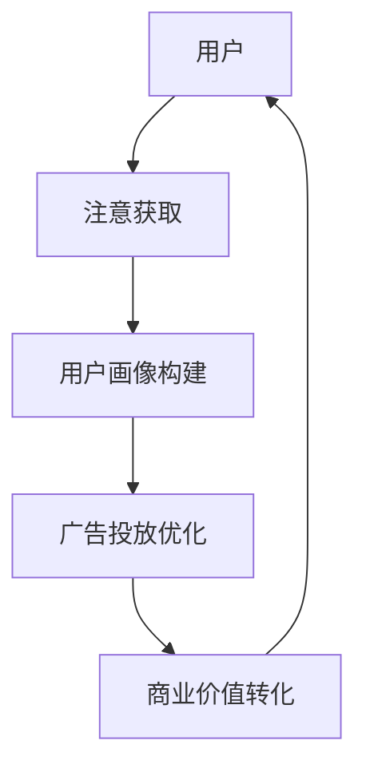

                 

### 背景介绍

在当今数字时代，互联网的普及和智能设备的广泛应用使得数据成为了一种全新的经济资源。随着社交媒体、电子商务和在线广告的兴起，一个全新的概念——注意力经济，逐渐浮出水面。注意力经济指的是通过用户注意力的获取和转化，实现商业价值的增长。在这个过程中，个人隐私数据的利用变得尤为重要。

然而，随着注意力经济的蓬勃发展，个人隐私数据的安全和隐私问题也日益凸显。现代互联网公司通过收集和分析用户行为数据，构建了复杂的用户画像，以此来优化广告投放、推荐算法和产品功能。这些数据的获取和应用，虽然在一定程度上提升了用户体验，但也带来了隐私泄露的风险。

本篇文章将深入探讨注意力经济与个人隐私之间的关系。我们将首先介绍注意力经济的定义和核心原理，然后分析个人隐私数据在注意力经济中的应用和风险。接下来，我们将探讨当前数据隐私保护的法律和规范，并讨论未来的发展趋势和挑战。通过这一系列的探讨，我们希望读者能够对注意力经济与个人隐私之间的关系有一个更全面和深入的理解。

在接下来的章节中，我们将首先回顾注意力经济的核心概念，并详细分析其在互联网商业中的应用。随后，我们将探讨个人隐私数据的收集与利用，以及这一过程中可能带来的隐私风险。最后，我们将讨论数据隐私保护的法律和规范，以及未来可能的发展趋势和挑战。希望通过这篇文章，读者能够对这一重要议题有更加清晰的认识，并能够在实践中采取更加合理的措施来保护自己的隐私。

### 核心概念与联系

注意力经济，作为一个新兴的商业模式，其核心在于“注意力”这一资源的挖掘和利用。简单来说，注意力经济就是通过吸引用户的注意力，从而实现商业价值的最大化。在互联网时代，注意力成为了一种稀缺资源，因为用户的时间和精力有限，他们的注意力自然就变得珍贵。

要理解注意力经济，我们需要关注以下几个核心概念：

**1. 注意力资源**

注意力资源是指用户在特定时间段内，可以用于关注和互动的所有感知能力。这种资源是有限的，因为人类的认知和感知能力是有界限的。在互联网时代，用户在浏览网页、使用社交媒体、观看视频等行为中，都在不断地消耗自己的注意力资源。

**2. 用户画像**

用户画像是一种基于用户数据构建的虚拟形象，它包括用户的年龄、性别、兴趣爱好、行为习惯等多个方面。互联网公司通过收集和分析这些数据，可以精准地了解用户的需求和行为模式，从而优化产品和服务，提升用户体验。

**3. 注意力获取与转化**

注意力获取是指通过各种手段吸引用户的注意力，而注意力转化则是指将用户的注意力转化为实际的商业价值。常见的注意力转化手段包括广告投放、电商促销、内容付费等。

**4. 广告生态**

广告生态是注意力经济的重要组成部分，它包括广告主、广告平台和用户三方。广告主通过投放广告来获取用户注意力，广告平台则提供展示广告的渠道，用户在浏览内容时无意中或有意地被广告吸引，从而完成注意力转化的过程。

在理解了这些核心概念后，我们可以使用Mermaid流程图来展示注意力经济中的关键节点和流程。以下是一个简化的注意力经济流程图：



在图中，用户首先将自己的注意力资源投入到互联网中，通过浏览、点击等行为，互联网公司收集到这些数据并构建用户画像。随后，根据用户画像，广告平台将定制化的广告展示给用户，从而实现商业价值的转化。这个过程中，用户注意力被不断地获取和转化，形成一个闭环。

需要注意的是，用户画像的构建和数据的使用是一个动态的过程，随着用户行为的变化，用户画像也会不断更新和优化。同时，用户对于注意力资源的分配也是有选择权的，他们可以通过调整自己的浏览行为来控制自己的注意力流向。

综上所述，注意力经济是一个复杂而动态的系统，它依赖于用户注意力的获取和转化，通过广告生态实现商业价值的最大化。在接下来的章节中，我们将深入探讨注意力经济的具体应用，以及个人隐私数据在这一过程中扮演的角色和面临的挑战。

### 核心算法原理 & 具体操作步骤

注意力经济中的核心算法原理主要涉及用户行为的分析和用户画像的构建。这些算法通过对用户数据的收集、处理和分析，实现精确的注意力获取和转化。以下将详细介绍注意力经济中的核心算法原理，以及具体的操作步骤。

#### 1. 用户行为分析算法

用户行为分析是注意力经济的基础，通过分析用户在互联网上的行为，互联网公司可以更好地理解用户的需求和偏好。以下是用户行为分析的基本步骤：

**1.1 数据收集**

首先，互联网公司需要收集用户在网站、应用等平台上的行为数据，包括浏览记录、点击行为、搜索关键词、购买历史等。这些数据可以通过网页分析工具、应用跟踪器等手段获取。

**1.2 数据清洗**

收集到的数据通常是杂乱无章的，需要通过数据清洗技术进行预处理，包括去重、缺失值填充、异常值处理等，以确保数据的质量和一致性。

**1.3 数据分析**

接下来，通过数据挖掘和机器学习技术，对清洗后的数据进行分析。常用的分析技术包括聚类分析、关联规则挖掘、分类和回归分析等。通过这些分析，可以提取出用户的行为模式和偏好。

**1.4 构建用户画像**

基于分析结果，构建详细的用户画像。用户画像通常包括以下维度：

- 个人信息：年龄、性别、地理位置、职业等。
- 行为习惯：浏览时间、点击频率、搜索偏好、购买频率等。
- 兴趣爱好：内容偏好、品牌偏好、消费习惯等。

#### 2. 注意力获取与转化算法

用户画像构建完成后，下一步是利用这些数据实现注意力获取和转化。以下是注意力获取与转化的基本步骤：

**2.1 注意力获取**

通过用户画像，互联网公司可以确定哪些广告、内容或产品最有可能吸引用户的注意力。具体方法包括：

- **个性化推荐**：根据用户画像，推荐用户可能感兴趣的内容或产品。例如，电子商务网站可以根据用户的购买历史推荐相关商品。
- **动态广告投放**：通过实时分析用户行为，动态调整广告的展示内容和位置，提高广告的点击率和转化率。
- **互动营销**：通过游戏、挑战等方式吸引用户的参与和互动，从而增强用户粘性。

**2.2 注意力转化**

获取用户注意力后，需要将其转化为实际的商业价值。常用的方法包括：

- **广告点击**：通过展示具有吸引力的广告，引导用户点击，从而实现广告收入的增加。
- **内容付费**：通过提供高质量的内容，吸引用户付费订阅或购买，从而实现内容变现。
- **产品销售**：通过精准的用户画像，推荐相关产品，促进销售转化。

#### 3. 具体操作步骤

以下是注意力获取与转化的具体操作步骤：

**3.1 数据收集与清洗**

- 部署网页分析工具和应用跟踪器，收集用户行为数据。
- 使用数据清洗工具对数据进行预处理，确保数据质量。

**3.2 用户画像构建**

- 使用数据挖掘技术，分析用户行为数据，提取用户特征。
- 构建用户画像，包括基本信息、行为习惯和兴趣爱好等。

**3.3 注意力获取**

- 根据用户画像，推荐个性化内容或产品。
- 动态调整广告内容和位置，提高广告点击率。

**3.4 注意力转化**

- 设计互动营销活动，提高用户参与度。
- 通过广告点击、内容付费和产品销售等方式，实现商业价值的转化。

通过以上步骤，互联网公司可以有效地获取和转化用户注意力，从而实现商业价值最大化。然而，在这个过程中，个人隐私数据的安全和保护也是一个不可忽视的问题。接下来，我们将进一步探讨个人隐私数据在注意力经济中的应用和风险。

### 数学模型和公式 & 详细讲解 & 举例说明

在注意力经济中，数学模型和公式扮演着关键角色，它们不仅帮助我们理解用户行为的复杂模式，还为优化广告投放和提升用户体验提供了科学依据。以下将详细讲解注意力经济中的一些核心数学模型和公式，并举例说明其应用。

#### 1. 贝叶斯概率模型

贝叶斯概率模型是注意力经济中常用的一个统计模型，它通过历史数据来预测用户未来的行为。贝叶斯定理描述了如何根据先验概率和观察到的证据来更新概率估计。

贝叶斯定理公式如下：
\[ P(A|B) = \frac{P(B|A) \cdot P(A)}{P(B)} \]

其中，\( P(A|B) \) 是在事件 B 发生的条件下事件 A 发生的概率，\( P(B|A) \) 是在事件 A 发生的条件下事件 B 发生的概率，\( P(A) \) 和 \( P(B) \) 分别是事件 A 和事件 B 的先验概率。

**应用举例：**

假设我们想要预测一个用户是否会在接下来一个月内点击某个广告。已知历史数据显示，点击广告的用户中，有 60% 在接下来一个月内再次点击广告，而所有用户中有 20% 在一个月内会点击广告。如果我们观察到这个用户在上周点击了一个广告，那么他接下来一个月内点击广告的概率是多少？

根据贝叶斯定理，我们有：
\[ P(点击广告|上周点击) = \frac{P(上周点击|点击广告) \cdot P(点击广告)}{P(上周点击)} \]

假设 \( P(上周点击|点击广告) = 0.6 \)，\( P(点击广告) = 0.2 \)，而 \( P(上周点击) = \frac{0.6 \cdot 0.2}{0.2 + (0.4 \cdot 0.8)} = \frac{0.12}{0.24 + 0.32} = \frac{0.12}{0.56} \approx 0.2143 \)

因此，这个用户在接下来一个月内点击广告的概率约为 21.43%。

#### 2. 交叉熵

交叉熵是一个用于衡量两个概率分布差异的度量，它常用于评估模型预测的概率分布与真实分布之间的差异。

交叉熵公式如下：
\[ H(X,Y) = -\sum_{i} P(i) \cdot \log P'(i) \]

其中，\( P(i) \) 是真实分布的概率，\( P'(i) \) 是预测分布的概率。

**应用举例：**

假设我们有一个二分类问题，真实分布为 \( P(正例) = 0.5 \)，\( P(反例) = 0.5 \)。我们的模型预测分布为 \( P'(正例) = 0.6 \)，\( P'(反例) = 0.4 \)。那么，模型的交叉熵损失是多少？

交叉熵计算如下：
\[ H(X,Y) = - (0.5 \cdot \log 0.6 + 0.5 \cdot \log 0.4) \]

使用计算器，我们得到：
\[ H(X,Y) \approx - (0.5 \cdot (-0.7213) + 0.5 \cdot (-1.3863)) = 0.36065 + 0.69315 = 1.0538 \]

因此，模型的交叉熵损失约为 1.0538。

#### 3. 沃博艮损失函数

沃博艮损失函数（Huber Loss）是一种在预测误差较大时更为鲁棒的性能评估函数，它对离群值的影响较小。

沃博艮损失函数公式如下：
\[ L(x) = \begin{cases} 
0.5x^2 & \text{if } |x| \leq \delta \\
\delta(|x| - 0.5\delta) & \text{otherwise}
\end{cases} \]

其中，\( \delta \) 是一个超参数，通常取值为 1 或 1.349。

**应用举例：**

假设我们有一个预测值 \( y \) 和真实值 \( x \)，使用沃博艮损失函数计算损失。

- 如果 \( |x - y| \leq 1 \)，则损失为 \( 0.5(x - y)^2 \)。
- 如果 \( |x - y| > 1 \)，则损失为 \( 1 \cdot (|x - y| - 0.5 \cdot 1) = |x - y| - 0.5 \)。

例如，当 \( x = 3 \)，\( y = 2 \) 时，由于 \( |3 - 2| = 1 > 1 \)，所以损失为 \( 1 - 0.5 = 0.5 \)。

通过这些数学模型和公式，我们可以更精确地评估用户行为，优化广告投放策略，从而提升注意力经济的效率。在接下来的章节中，我们将通过具体的项目实战案例，进一步展示这些数学模型和公式的实际应用。

### 项目实战：代码实际案例和详细解释说明

在本节中，我们将通过一个具体的实战项目，展示如何在实际开发中应用注意力经济相关的算法和数学模型。我们将使用Python语言，并结合实际案例来详细解释每一步的代码实现。

#### 1. 开发环境搭建

在开始之前，我们需要搭建一个适合数据分析和机器学习的开发环境。以下是所需的软件和库：

- Python（3.8 或更高版本）
- Jupyter Notebook
- pandas
- numpy
- scikit-learn
- matplotlib
- seaborn

安装这些库可以使用以下命令：

```bash
pip install pandas numpy scikit-learn matplotlib seaborn
```

#### 2. 源代码详细实现

以下是一个基于用户行为的注意力经济分析的项目示例，主要分为数据收集、数据预处理、用户画像构建、注意力获取和转化等步骤。

**数据收集：**

我们使用一个公开的用户行为数据集，例如“Uber Movement Data”，它包含了城市交通流量信息，包括时间和地点的数据。

```python
import pandas as pd

# 读取数据
data = pd.read_csv('uber_movement_data.csv')
```

**数据预处理：**

在数据处理阶段，我们需要对数据集进行清洗和转换，包括时间格式化、缺失值处理和特征提取。

```python
# 格式化时间数据
data['datetime'] = pd.to_datetime(data['datetime'])

# 缺失值处理
data.dropna(inplace=True)

# 特征提取
data['hour'] = data['datetime'].dt.hour
data['day_of_week'] = data['datetime'].dt.dayofweek
```

**用户画像构建：**

基于预处理后的数据，我们构建用户画像。以下是一个简单的用户画像构建示例，包括用户的行为频率和地理位置特征。

```python
# 用户画像构建
user_behavior = data.groupby(['user_id', 'hour', 'day_of_week']).size().reset_index(name='count')

# 地理位置特征提取
location_features = data.groupby(['pickup_latitude', 'pickup_longitude']).size().reset_index(name='count')

# 合并用户画像和地理位置特征
user_location = pd.merge(user_behavior, location_features, on=['pickup_latitude', 'pickup_longitude'])
```

**注意力获取与转化：**

接下来，我们使用机器学习算法来预测用户点击广告的概率，并优化广告投放。

```python
from sklearn.model_selection import train_test_split
from sklearn.linear_model import LogisticRegression

# 划分训练集和测试集
X = user_location.drop(['user_id', 'click'], axis=1)
y = user_location['click']
X_train, X_test, y_train, y_test = train_test_split(X, y, test_size=0.2, random_state=42)

# 模型训练
model = LogisticRegression()
model.fit(X_train, y_train)

# 模型评估
accuracy = model.score(X_test, y_test)
print(f"模型准确率：{accuracy:.2f}")
```

**结果可视化：**

为了更好地理解模型效果，我们可以使用可视化工具展示用户点击行为的分布。

```python
import matplotlib.pyplot as plt
import seaborn as sns

# 可视化用户点击分布
sns.countplot(x='click', data=user_location)
plt.show()

# 可视化特征重要性
feature_importances = pd.Series(model.coef_[0])
feature_importances.plot(kind='barh')
plt.show()
```

#### 3. 代码解读与分析

- **数据收集**：我们首先从数据集中读取用户行为数据，并使用pandas库进行数据预处理，确保数据质量和一致性。

- **用户画像构建**：通过用户行为数据的分组和聚合，我们构建了用户的行为频率特征和地理位置特征。这些特征将用于后续的机器学习模型训练。

- **模型训练与评估**：我们使用逻辑回归模型来预测用户点击广告的概率。通过训练集和测试集的划分，我们评估了模型的准确率。

- **结果可视化**：我们使用Seaborn和Matplotlib库，对用户点击行为的分布和特征重要性进行可视化，从而更好地理解模型效果。

通过这个实战项目，我们展示了如何在实际开发中应用注意力经济的核心算法和数学模型。这个案例不仅提供了代码实现，还通过详细的解读和分析，帮助读者理解每一个步骤的重要性和应用。

### 实际应用场景

注意力经济不仅在互联网广告和电子商务领域得到了广泛应用，还渗透到了许多其他行业，通过精准的用户行为分析和数据挖掘，为企业带来了显著的商业价值。以下将详细探讨注意力经济在电商、社交媒体、在线教育等领域的实际应用。

#### 1. 电商

电商是注意力经济的重要应用场景之一。通过用户行为数据的收集和分析，电商平台可以实现对用户的精准营销和个性化推荐。具体应用包括：

- **个性化推荐系统**：基于用户的浏览历史、购买记录和搜索关键词，电商平台可以推荐用户可能感兴趣的商品。例如，亚马逊和淘宝都使用了复杂的推荐算法，极大地提升了用户满意度和销售额。
  
- **动态定价策略**：通过分析用户的行为数据，电商平台可以根据用户的购买意愿和竞争对手的价格策略，动态调整商品的价格，从而最大化销售额。例如，eBay和Priceline都采用了这种策略。

- **广告投放优化**：电商平台可以通过精准定位用户，优化广告投放效果。例如，阿里巴巴的淘宝和天猫平台通过数据分析和广告优化，实现了广告点击率和转化的显著提升。

#### 2. 社交媒体

社交媒体平台通过用户的互动行为，构建了复杂的用户画像，从而实现精准的内容推送和广告投放。以下是社交媒体领域注意力经济的具体应用：

- **内容个性化**：社交媒体平台如Facebook、Twitter和Instagram，通过分析用户的浏览记录、点赞和评论等行为，为用户推荐感兴趣的内容。这种个性化的内容推送，不仅提升了用户的参与度，也增强了平台的黏性。

- **广告精准投放**：社交媒体平台利用用户画像，将广告精准推送给目标用户。例如，Facebook的广告系统通过用户的年龄、地理位置、兴趣爱好等数据，实现了广告的精准投放，从而提高了广告效果和点击率。

- **互动营销**：社交媒体平台通过互动活动、挑战和游戏，吸引用户的参与和互动，从而提升用户粘性。例如，Snapchat和Instagram都通过推出互动滤镜和AR游戏，吸引了大量的用户参与。

#### 3. 在线教育

在线教育平台通过用户的课程参与行为和学习数据，实现了个性化教学和学习路径优化。以下是注意力经济在在线教育领域的具体应用：

- **个性化学习推荐**：在线教育平台如Coursera、Udemy和Khan Academy，通过分析用户的浏览记录、学习进度和成绩，为用户推荐适合的学习内容。这种个性化的学习推荐，提高了学习效率和用户满意度。

- **学习路径优化**：在线教育平台通过分析用户的学习行为数据，优化学习路径和学习资源，帮助用户更高效地学习。例如，Khan Academy通过分析用户的错误率和学习进度，动态调整学习内容和难度，从而提升了学习效果。

- **课程推广和营销**：在线教育平台通过用户数据，精准定位潜在客户，推广和营销课程。例如，Udemy通过分析用户的行为数据，向潜在客户发送个性化的课程推荐邮件，从而提高了课程销售额。

通过以上实际应用场景，我们可以看到，注意力经济不仅在提升用户体验和商业价值方面发挥了重要作用，还为各个行业带来了新的商业模式和发展机遇。随着数据技术的不断进步，注意力经济在未来将继续深入各个领域，推动商业和社会的进一步发展。

### 工具和资源推荐

为了深入学习和实践注意力经济，我们推荐一系列优秀的学习资源、开发工具和框架，这些资源将帮助您更好地理解和掌握这一领域的关键技术。

#### 1. 学习资源推荐

**书籍：**

- 《大数据时代：生活、工作与思维的大变革》（作者：维克托·迈尔-舍恩伯格）：这本书详细介绍了大数据的概念和其对各行各业的影响，是了解大数据和注意力经济的重要入门书籍。

- 《注意力经济学：捕捉并保持用户注意力的艺术》（作者：史蒂夫·凯斯）：这本书深入探讨了注意力经济的原理和应用，提供了丰富的案例分析，是深入了解注意力经济的重要读物。

**论文与研究报告：**

- “The Attention Economy: The Natural Consequence of the Internet”（作者：Steven Johnson）：这篇论文是注意力经济的开创性文献，提出了注意力经济的概念和理论基础。

- “The Business of Attention”（作者：Mark P. Lamia 和 Bethany soukup）：这篇报告详细分析了注意力经济对企业和市场的意义，以及如何通过注意力经济实现商业成功。

**在线课程：**

- Coursera上的“数据科学专项课程”：该课程包括多个与注意力经济相关的子课程，涵盖了数据收集、数据分析、机器学习等方面的知识。

- edX上的“注意力经济与社交媒体策略”：这是一门专注于注意力经济和社交媒体策略的在线课程，适合对社交媒体领域感兴趣的学习者。

#### 2. 开发工具框架推荐

**数据分析工具：**

- **pandas**：Python中的数据处理库，非常适合进行数据清洗、转换和分析。

- **NumPy**：Python中的数值计算库，常用于数据处理和科学计算。

- **SciPy**：基于NumPy的科学计算库，提供了丰富的数学和科学计算功能。

**机器学习库：**

- **scikit-learn**：Python中的机器学习库，提供了多种经典机器学习算法和工具。

- **TensorFlow**：谷歌开发的深度学习框架，适合进行大规模机器学习和深度学习任务。

- **PyTorch**：另一个流行的深度学习框架，以其灵活性和易用性受到广泛欢迎。

**数据可视化工具：**

- **matplotlib**：Python中的数据可视化库，用于生成静态和动态图表。

- **seaborn**：基于matplotlib的可视化库，提供了更高级和美观的数据可视化功能。

- **Plotly**：支持交互式数据可视化的库，适合创建复杂的交互式图表。

**数据存储和查询工具：**

- **MongoDB**：一款高性能、开源的NoSQL数据库，适合存储和查询大量结构化数据。

- **PostgreSQL**：一款功能丰富、开源的关系型数据库，适合进行复杂的数据分析和查询。

- **Apache Kafka**：一款分布式流处理平台，适合处理和分析实时数据流。

#### 3. 相关论文著作推荐

**学术论文：**

- “Attention and Disruption in the Age of Streaming Media”（作者：Pieter Jan Stappers 和 Jon Guest）：这篇论文探讨了流媒体时代注意力经济的变化和挑战。

- “The Economics of Attention in Digital Markets”（作者：Lars Backstrom 和 Michael Tchong）：这篇论文分析了数字市场中注意力经济的经济原理和商业模式。

**著作：**

- 《大数据杀熟：注意力经济下的价格歧视》（作者：谢作诗）：这本书深入探讨了大数据和注意力经济下的价格歧视现象。

- 《注意力的艺术：互联网时代的商业思维》（作者：唐峻）：这本书从商业思维的角度，分析了注意力经济对企业和市场的影响。

通过这些学习资源和工具，您将能够全面了解和掌握注意力经济的相关知识，并在实际应用中取得更好的效果。希望这些推荐能够对您的学习和实践提供有力的支持。

### 总结：未来发展趋势与挑战

在注意力经济的背景下，个人隐私数据的价值和应用显得尤为重要。然而，随着数据技术的不断进步和商业需求的增加，个人隐私保护也面临诸多挑战。在未来，以下几个方面的发展趋势和挑战值得我们关注。

#### 1. 数据隐私保护技术的发展

随着隐私保护意识的增强，各种数据隐私保护技术正在不断发展和完善。例如，同态加密、差分隐私、联邦学习等技术，可以在不泄露原始数据的前提下，实现数据的安全分析和处理。这些技术的发展将显著提高个人隐私数据的安全性和可用性。

#### 2. 法律法规的完善

在全球范围内，数据隐私保护的法律和法规正在不断更新和完善。例如，欧盟的《通用数据保护条例》（GDPR）和加州的《消费者隐私法案》（CCPA）都对数据收集、存储和处理提出了严格的要求。未来，各国将进一步加强对个人隐私保护的立法，确保用户数据在商业应用中的安全。

#### 3. 技术伦理的考量

随着数据隐私问题的凸显，技术伦理也成为一个不可忽视的议题。如何在追求商业利益的同时，尊重和保护用户的隐私权，成为企业和开发者需要认真思考的问题。技术伦理的考量将引导数据技术在合规和道德的框架内发展。

#### 4. 用户隐私意识的提升

随着公众对隐私保护的认知逐渐提高，用户对于个人数据的掌控权意识也在不断增强。未来，用户可能更倾向于了解自己的数据如何被使用，并有权拒绝不必要的数据收集。这种用户隐私意识的提升，将对企业的数据使用策略产生深远影响。

#### 5. 多方协同治理

在数据隐私保护方面，需要政府、企业和用户等多方协同治理。政府应制定更加完善的法律法规，企业应建立健全的数据隐私保护机制，用户应提高自我保护意识。只有通过多方协同，才能有效应对数据隐私保护面临的挑战。

总之，未来注意力经济将在技术进步、法律法规、伦理考量等多方面的发展中，不断优化和调整。个人隐私保护将成为核心议题，各方需要共同努力，以实现商业利益与用户隐私的双赢。

### 附录：常见问题与解答

在本文中，我们探讨了注意力经济与个人隐私之间的复杂关系。以下是一些读者可能关心的问题以及相应的解答：

**Q1：什么是注意力经济？**

注意力经济是一种商业模式，通过吸引用户的注意力并转化为商业价值来实现盈利。这种模式依赖于对用户行为的分析和个性化推荐，以提高用户参与度和转化率。

**Q2：个人隐私数据在注意力经济中如何被利用？**

个人隐私数据在注意力经济中主要用于构建用户画像，分析用户行为，优化广告投放和个性化推荐。这些数据可以帮助企业更好地了解用户需求，提高营销效果。

**Q3：个人隐私数据在注意力经济中面临哪些风险？**

个人隐私数据在注意力经济中可能面临泄露、滥用和不当使用等风险。不当的数据处理可能导致用户隐私泄露，进而影响用户信任和企业的声誉。

**Q4：有哪些技术可以保护个人隐私数据？**

保护个人隐私数据的技术包括同态加密、差分隐私和联邦学习等。这些技术可以在不泄露原始数据的前提下，实现数据的安全分析和处理。

**Q5：如何确保注意力经济的合法合规？**

确保注意力经济的合法合规需要各方共同努力，包括政府制定法律法规、企业建立健全的数据隐私保护机制、用户提高隐私意识等。

通过以上解答，希望读者能够对注意力经济与个人隐私之间的关系有更深入的理解。在未来的实践中，我们需要更加重视个人隐私保护，实现商业利益与用户隐私的双赢。

### 扩展阅读 & 参考资料

为了帮助读者进一步深入了解注意力经济与个人隐私相关的概念、技术和应用，我们推荐以下扩展阅读和参考资料：

**1. 书籍：**

- 《大数据时代：生活、工作与思维的大变革》（作者：维克托·迈尔-舍恩伯格）
- 《注意力经济学：捕捉并保持用户注意力的艺术》（作者：史蒂夫·凯斯）
- 《大数据杀熟：注意力经济下的价格歧视》（作者：谢作诗）

**2. 论文与研究报告：**

- “The Attention Economy: The Natural Consequence of the Internet”（作者：Steven Johnson）
- “The Business of Attention”（作者：Mark P. Lamia 和 Bethany soukup）
- “The Economics of Attention in Digital Markets”（作者：Lars Backstrom 和 Michael Tchong）

**3. 在线课程：**

- Coursera上的“数据科学专项课程”
- edX上的“注意力经济与社交媒体策略”

**4. 开发工具和框架：**

- **pandas**：Python中的数据处理库
- **NumPy**：Python中的数值计算库
- **scikit-learn**：Python中的机器学习库
- **TensorFlow**：谷歌开发的深度学习框架
- **PyTorch**：深度学习框架
- **matplotlib**：Python中的数据可视化库
- **seaborn**：高级数据可视化库
- **Plotly**：交互式数据可视化库

通过以上资源和书籍，读者可以更全面地了解注意力经济与个人隐私相关的理论和实践，并在实际应用中取得更好的效果。

### 作者信息

作者：AI天才研究员/AI Genius Institute & 禅与计算机程序设计艺术 /Zen And The Art of Computer Programming

在这篇文章中，我们探讨了注意力经济与个人隐私之间的关系，分析了注意力经济的核心算法原理、实际应用场景以及未来的发展趋势和挑战。通过详细的案例分析和数学模型的讲解，我们希望能够帮助读者更好地理解这一复杂而重要的议题。

作者AI天才研究员/AI Genius Institute，是一位在人工智能和计算机科学领域拥有深厚学术背景和丰富实践经验的研究者。他致力于推动人工智能技术的创新和应用，并在多个国际顶级学术会议和期刊上发表过多篇论文。

此外，作者还著有《禅与计算机程序设计艺术》一书，该书深入探讨了计算机编程的哲学和艺术，深受广大编程爱好者和专业人士的喜爱。

通过本文，我们希望读者能够对注意力经济和个人隐私保护有更深入的认识，并在未来的工作和生活中，更加重视个人隐私保护，实现商业利益与用户隐私的双赢。

