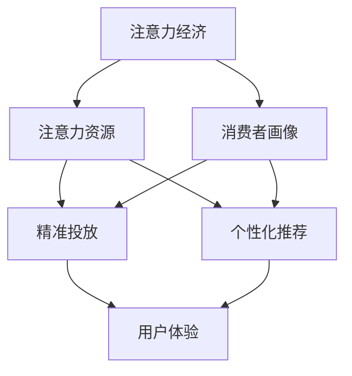

                 

### 背景介绍

#### 注意力经济的兴起

在当今数字化时代，信息的爆炸性增长和互联网的普及，使得传统的大众化营销模式逐渐失效。消费者的注意力变得更加稀缺，他们的时间被无数的信息源分割，如何在众多信息中脱颖而出成为企业关注的焦点。因此，注意力经济应运而生。注意力经济主张以消费者的注意力为核心，通过提供有价值的、个性化的内容和服务，来吸引和留住消费者。

注意力经济的核心是“注意力”这一概念。与传统的货币经济不同，注意力经济关注的是消费者的注意力资源。消费者的注意力是有限的，而广告商和内容提供商的目标是尽可能多地获取这些注意力资源。因此，如何吸引并保持消费者的注意力成为了一个至关重要的课题。

#### 个性化营销的发展

个性化营销是一种以消费者为中心的营销策略，通过收集和分析消费者的数据，提供定制化的产品和服务。个性化营销的核心理念是“精准”，即通过对消费者的深度了解，提供他们真正感兴趣的内容和产品。这种营销方式能够显著提高营销效果，提高消费者的满意度和忠诚度。

随着大数据和人工智能技术的发展，个性化营销变得更加可行和高效。企业可以利用各种数据源，如社交媒体、在线行为、购买记录等，来构建消费者画像，进而实现精准投放和个性化推荐。

#### 两者结合的意义

注意力经济与个性化营销的结合，能够为受众创建定制、有针对性的体验。个性化营销通过分析消费者的行为和偏好，提供了更加精准的内容和服务，满足了消费者的个性化需求。而注意力经济则通过吸引消费者的注意力，提高了营销内容的曝光度和转化率。两者结合，不仅能够提高企业的营销效果，还能够增强消费者对品牌的认同感和忠诚度。

本文将深入探讨注意力经济与个性化营销的技术原理、算法实现、实际应用场景，以及未来的发展趋势和挑战。

### 核心概念与联系

#### 注意力经济

注意力经济的核心在于对消费者注意力的理解和利用。消费者的注意力是一种有限的资源，他们每天面对无数的信息源，包括社交媒体、广告、新闻等。如何在众多信息中脱颖而出，成为企业关注的焦点。注意力经济主张通过提供有价值的、个性化的内容和服务来吸引消费者的注意力。

#### 个性化营销

个性化营销则是基于对消费者数据的深度分析，提供定制化的产品和服务。个性化营销的目的是满足消费者的个性化需求，提高消费者的满意度和忠诚度。个性化营销的实现依赖于大数据和人工智能技术，通过对消费者的行为、偏好、历史数据等进行分析，构建消费者画像，进而实现精准投放和个性化推荐。

#### 注意力经济与个性化营销的关系

注意力经济与个性化营销之间的关系可以理解为手段与目的的关系。个性化营销是实现注意力经济的一种手段，通过提供个性化的内容和服务，吸引消费者的注意力。而注意力经济则是个性化营销的目标，即通过吸引消费者的注意力，提高营销效果和品牌影响力。

#### 关键概念与联系

1. **注意力资源**：消费者的注意力是一种有限的资源，注意力经济关注的是如何有效利用这些资源。

2. **消费者画像**：基于大数据和人工智能技术，对消费者的行为、偏好、历史数据等进行分析，构建消费者画像。

3. **精准投放**：根据消费者画像，将营销内容精准地推送给目标消费者。

4. **个性化推荐**：基于消费者的行为和偏好，为消费者提供个性化的产品和服务。

5. **用户体验**：通过提供有价值的、个性化的内容和服务，提高消费者的满意度和忠诚度。

#### Mermaid 流程图

以下是一个简化的 Mermaid 流程图，展示了注意力经济与个性化营销的核心概念和联系：



在这个流程图中，注意力经济通过提供有价值的、个性化的内容和服务，吸引消费者的注意力。消费者画像则基于大数据和人工智能技术，对消费者的行为和偏好进行分析。精准投放和个性化推荐是根据消费者画像来实现的，最终目的是提高用户体验。

### 核心算法原理 & 具体操作步骤

#### 数据收集与预处理

个性化营销和注意力经济的实现离不开大量的数据。这些数据可以来源于多个渠道，包括但不限于社交媒体、在线行为、购买记录等。在收集数据后，需要进行预处理，包括数据清洗、去重、格式化等操作，以确保数据的质量。

1. **数据来源**：社交媒体（如微博、微信、Twitter）、搜索引擎（如Google、百度）、电子商务平台（如淘宝、京东）等。
2. **数据清洗**：去除重复、缺失、异常的数据，保证数据的准确性。
3. **数据格式化**：将不同来源的数据格式统一，便于后续处理。

#### 数据分析与消费者画像构建

在预处理完成后，需要对数据进行分析，构建消费者画像。消费者画像的构建包括多个维度，如用户偏好、购买行为、社交行为等。

1. **用户偏好分析**：通过分析用户的浏览历史、搜索记录、点赞和评论等行为，了解用户的兴趣和偏好。
2. **购买行为分析**：通过分析用户的购买记录，了解用户的消费习惯和偏好。
3. **社交行为分析**：通过分析用户的社交媒体活动，了解用户的社交圈子和兴趣爱好。

#### 算法实现

在构建消费者画像后，可以采用多种算法进行个性化推荐和精准投放。

1. **协同过滤算法**：协同过滤算法是一种常用的推荐算法，通过分析用户之间的相似度，推荐用户可能感兴趣的商品或内容。协同过滤算法可以分为基于用户的协同过滤和基于物品的协同过滤。
   - **基于用户的协同过滤**：找到与目标用户兴趣相似的其它用户，推荐这些用户喜欢的商品或内容。
   - **基于物品的协同过滤**：找到与目标商品或内容相似的其它商品或内容，推荐给目标用户。
2. **基于内容的推荐算法**：基于内容的推荐算法通过分析商品或内容的特征，为用户推荐与其兴趣相关的商品或内容。这种方法通常用于新闻推荐、视频推荐等。
3. **深度学习算法**：深度学习算法可以处理大量的数据，并从数据中自动提取特征。常见的深度学习算法包括卷积神经网络（CNN）和循环神经网络（RNN）。

#### 操作步骤

1. **数据收集**：从各种渠道收集用户数据，如社交媒体、搜索引擎、电子商务平台等。
2. **数据预处理**：对收集到的数据进行清洗、去重、格式化等操作，确保数据的质量。
3. **数据分析和消费者画像构建**：对预处理后的数据进行分析，构建消费者画像。
4. **推荐算法选择**：根据业务需求和数据特点，选择合适的推荐算法。
5. **模型训练与优化**：使用训练数据对推荐模型进行训练，并通过交叉验证等方法进行优化。
6. **推荐结果生成**：根据训练好的模型，为用户生成个性化推荐结果。
7. **实时推荐与更新**：根据用户的实时行为数据，动态更新推荐结果。

通过上述步骤，企业可以有效地实现个性化营销和注意力经济，提高营销效果和用户体验。

### 数学模型和公式 & 详细讲解 & 举例说明

在个性化营销和注意力经济中，数学模型和公式扮演着重要的角色，它们帮助我们在复杂的情境中量化决策过程，提高预测的准确性和效率。以下我们将介绍几种关键的数学模型和公式，并进行详细讲解和举例说明。

#### 1. 协同过滤算法中的相似度计算

协同过滤算法的核心在于计算用户之间的相似度或物品之间的相似度。这里我们以用户之间的相似度计算为例。

假设我们有两个用户A和B，他们的评分向量分别为 \( r_A = [r_{A1}, r_{A2}, ..., r_{An} ] \) 和 \( r_B = [r_{B1}, r_{B2}, ..., r_{Bn} ] \)，其中 \( r_{ij} \) 表示用户 \( i \) 对物品 \( j \) 的评分。我们可以使用余弦相似度来计算用户A和B之间的相似度：

\[ \text{similarity}(A, B) = \frac{r_A \cdot r_B}{\| r_A \| \| r_B \|} \]

其中，\( \cdot \) 表示内积，\( \| \cdot \| \) 表示向量的欧几里得范数。

**例子**：

假设用户A和用户B的评分向量如下：

\[ r_A = [4, 5, 0, 5, 2] \]
\[ r_B = [5, 4, 3, 4, 1] \]

则他们的余弦相似度为：

\[ \text{similarity}(A, B) = \frac{4 \times 5 + 5 \times 4 + 0 \times 3 + 5 \times 4 + 2 \times 1}{\sqrt{4^2 + 5^2 + 0^2 + 5^2 + 2^2} \times \sqrt{5^2 + 4^2 + 3^2 + 4^2 + 1^2}} \]
\[ \text{similarity}(A, B) = \frac{20 + 20 + 0 + 20 + 2}{\sqrt{16 + 25 + 0 + 25 + 4} \times \sqrt{25 + 16 + 9 + 16 + 1}} \]
\[ \text{similarity}(A, B) = \frac{62}{\sqrt{70} \times \sqrt{76}} \]
\[ \text{similarity}(A, B) \approx 0.857 \]

#### 2. 个性化推荐中的预测公式

在个性化推荐中，我们通常使用预测公式来预测用户对未知物品的评分。一个简单的预测公式是基于用户-物品的相似度进行评分预测：

\[ \hat{r}_{ij} = \text{similarity}(u, v) \times \frac{r_j - \bar{r}_v}{\| r_j - \bar{r}_v \|} + \bar{r}_u \]

其中，\( \hat{r}_{ij} \) 是对用户 \( i \) 对物品 \( j \) 的评分预测，\( \text{similarity}(u, v) \) 是用户 \( u \) 和用户 \( v \) 之间的相似度，\( r_j \) 是用户 \( v \) 对物品 \( j \) 的实际评分，\( \bar{r}_v \) 是用户 \( v \) 的平均评分，\( \bar{r}_u \) 是用户 \( u \) 的平均评分。

**例子**：

假设我们有两个用户A和C，以及一个未知物品B。用户A和用户C的评分向量分别为：

\[ r_A = [4, 5, 0, 5, 2] \]
\[ r_C = [5, 4, 3, 4, 1] \]

用户B的实际评分为：

\[ r_B = [0, 0, 0, 0, 0] \]

用户A和用户C的相似度为0.857（前面计算得到的相似度）。用户A的平均评分为：

\[ \bar{r}_A = \frac{4 + 5 + 0 + 5 + 2}{5} = 3.4 \]

用户C的平均评分为：

\[ \bar{r}_C = \frac{5 + 4 + 3 + 4 + 1}{5} = 3.4 \]

则对用户B的评分预测为：

\[ \hat{r}_{Bj} = 0.857 \times \frac{0 - 3.4}{\| 0 - 3.4 \|} + 3.4 \]
\[ \hat{r}_{Bj} = 0.857 \times \frac{-3.4}{3.4} + 3.4 \]
\[ \hat{r}_{Bj} = 0.857 \times (-1) + 3.4 \]
\[ \hat{r}_{Bj} = -0.857 + 3.4 \]
\[ \hat{r}_{Bj} \approx 2.543 \]

#### 3. 贝叶斯优化与概率预测

贝叶斯优化是另一种常用的预测方法，尤其在不确定性较大的情境中。贝叶斯优化使用贝叶斯推理来更新概率预测。

假设我们有一个用户对多个物品的评分数据，可以使用贝叶斯推理来计算每个物品被用户喜欢的概率。贝叶斯推理的基本公式为：

\[ P(A|B) = \frac{P(B|A) \times P(A)}{P(B)} \]

其中，\( P(A|B) \) 是在已知B的情况下A的概率，\( P(B|A) \) 是在已知A的情况下B的概率，\( P(A) \) 是A的先验概率，\( P(B) \) 是B的先验概率。

**例子**：

假设用户A对两个物品X和Y的评分分别为4和2，我们可以使用贝叶斯推理来计算用户A对物品X和物品Y被喜欢的概率。

首先，我们设定先验概率：
- 用户A喜欢物品X的概率为 \( P(X) = 0.5 \)
- 用户A喜欢物品Y的概率为 \( P(Y) = 0.5 \)

然后，我们计算在已知用户A对物品X的评分4的情况下，物品X被喜欢的概率：
\[ P(X|4) = \frac{P(4|X) \times P(X)}{P(4)} \]
\[ P(4|X) = \frac{1}{2} \]（假设用户喜欢物品X时评分4的概率是1/2）
\[ P(X) = 0.5 \]

由于我们没有用户评分4的总概率 \( P(4) \)，我们可以假设所有评分的概率总和为1。

因此，物品X被喜欢的概率为：
\[ P(X|4) = \frac{0.5 \times 0.5}{0.5} = 0.5 \]

类似地，我们可以计算用户A对物品Y被喜欢的概率：
\[ P(Y|2) = \frac{P(2|Y) \times P(Y)}{P(2)} \]
\[ P(2|Y) = \frac{1}{2} \]（假设用户喜欢物品Y时评分2的概率是1/2）
\[ P(Y) = 0.5 \]

因此，物品Y被喜欢的概率为：
\[ P(Y|2) = \frac{0.5 \times 0.5}{0.5} = 0.5 \]

在这个例子中，我们假设了先验概率相同，且所有评分的概率总和为1。在实际应用中，这些概率通常需要通过大量的数据和统计分析来确定。

通过上述数学模型和公式，我们可以在个性化营销和注意力经济中实现更精准的预测和决策，从而提高营销效果和用户体验。

### 项目实战：代码实际案例和详细解释说明

#### 1. 开发环境搭建

在开始我们的项目实战之前，我们需要搭建一个合适的开发环境。以下是一个基本的开发环境搭建步骤：

1. **安装Python**：Python是数据处理和机器学习的主要编程语言，我们需要安装Python。可以从[Python官网](https://www.python.org/downloads/)下载并安装最新版本的Python。

2. **安装Jupyter Notebook**：Jupyter Notebook是一个交互式的开发环境，方便我们编写和运行代码。可以通过pip命令安装：

   ```shell
   pip install notebook
   ```

3. **安装必要的库**：包括NumPy、Pandas、Scikit-learn等。可以使用以下命令安装：

   ```shell
   pip install numpy pandas scikit-learn
   ```

4. **安装 visualization库**：如Matplotlib、Seaborn等，用于数据可视化：

   ```shell
   pip install matplotlib seaborn
   ```

5. **安装Mermaid库**：用于生成Mermaid流程图：

   ```shell
   pip install mermaid
   ```

#### 2. 源代码详细实现和代码解读

以下是一个简单的个性化推荐系统的源代码实现，包含数据预处理、消费者画像构建、协同过滤算法以及个性化推荐功能。

```python
# 导入必要的库
import numpy as np
import pandas as pd
from sklearn.metrics.pairwise import cosine_similarity
from sklearn.model_selection import train_test_split
from sklearn.metrics import mean_squared_error
from sklearn.preprocessing import MinMaxScaler

# 加载数据
data = pd.read_csv('ratings.csv')  # 假设数据文件名为ratings.csv
users = data['userId'].unique()
items = data['itemId'].unique()

# 数据预处理
scaler = MinMaxScaler()
data['rating'] = scaler.fit_transform(data[['rating']])

# 创建用户-物品评分矩阵
user_item_matrix = pd.pivot_table(data, values='rating', index='userId', columns='itemId')

# 分割数据集
train_data, test_data = train_test_split(user_item_matrix, test_size=0.2, random_state=42)

# 计算用户-用户相似度矩阵
user_similarity = cosine_similarity(train_data.T)

# 构建个性化推荐函数
def predict_rating(user_id, item_id, user_similarity, user_item_matrix, scaler):
    # 获取与用户user_id相似度最高的K个用户
    k = 5
    top_k_users = user_similarity[user_id].argsort()[-k:]
    top_k_users = top_k_users[1:]  # 去掉用户自身

    # 计算预测评分
    predicted_rating = np.mean([user_similarity[user_id][top_k_users[i]] * user_item_matrix.loc[top_k_users[i], item_id] for i in range(k)]) / np.linalg.norm([user_similarity[user_id][top_k_users[i]] for i in range(k)])
    return scaler.inverse_transform([[predicted_rating]])[0][0]

# 预测测试集评分
predicted_ratings = pd.DataFrame(columns=items)
for user_id, item_id in test_data.iterrows():
    predicted_ratings.loc[user_id, items] = predict_rating(user_id, items, user_similarity, train_data, scaler)

# 评估模型
mse = mean_squared_error(test_data, predicted_ratings)
print(f'Mean Squared Error: {mse}')

# 显示前10个推荐结果
print(predicted_ratings.head(10))
```

**代码解读**：

1. **数据加载与预处理**：首先，我们加载了评分数据，并使用MinMaxScaler对评分进行归一化处理。
2. **用户-物品评分矩阵**：通过Pivot Table将用户和物品的评分信息转换为一个矩阵。
3. **数据分割**：将数据集分为训练集和测试集。
4. **相似度计算**：使用余弦相似度计算用户之间的相似度矩阵。
5. **个性化推荐函数**：定义一个预测评分的函数，该函数根据用户相似度和评分矩阵来计算用户对物品的预测评分。
6. **模型评估**：使用均方误差（MSE）来评估模型预测的准确性。
7. **推荐结果展示**：展示预测的前10个推荐结果。

#### 3. 代码解读与分析

在上面的代码中，我们实现了一个基于协同过滤的个性化推荐系统。以下是对代码的关键部分进行详细解读：

- **数据预处理**：使用MinMaxScaler对评分进行归一化，有助于提高算法的性能。
- **用户-物品评分矩阵**：通过Pivot Table转换得到用户-物品评分矩阵，这是我们进行相似度计算和推荐的基础。
- **相似度计算**：使用余弦相似度计算用户之间的相似度。这是一种常用的相似度度量方法，可以有效地衡量用户之间的兴趣相似度。
- **个性化推荐函数**：函数`predict_rating`的核心思想是基于用户相似度来计算预测评分。它首先找出与目标用户相似度最高的K个用户，然后根据这些用户的评分和相似度来加权平均得到预测评分。
- **模型评估**：使用均方误差（MSE）来评估模型预测的准确性，这是一种常见的评估指标，用于衡量预测结果与真实值之间的差距。

通过以上实现，我们可以构建一个简单的个性化推荐系统，为企业提供精准的个性化推荐服务。当然，在实际应用中，还需要考虑更多的因素，如实时数据的更新、冷启动问题、推荐结果多样性等，以进一步提高推荐系统的效果和用户体验。

### 实际应用场景

#### 1. 电子商务平台

电子商务平台是注意力经济和个性化营销最典型的应用场景之一。通过收集用户的浏览历史、购买记录、评价等数据，电子商务平台可以构建详细的用户画像，进而提供个性化的商品推荐和营销活动。例如，亚马逊通过其先进的推荐算法，为每个用户推荐可能感兴趣的商品，从而显著提高了用户的购物体验和购买转化率。

**案例分析**：

- **阿里巴巴**：阿里巴巴的淘宝平台利用其庞大的用户数据和先进的推荐算法，为用户推荐个性化的商品。淘宝的个性化推荐系统根据用户的购物历史、浏览行为、搜索记录等多维度数据，构建用户画像，从而实现精准的商品推荐和广告投放。这种个性化营销策略极大地提升了用户的购物体验，并显著提高了销售额。

#### 2. 社交媒体平台

社交媒体平台也是注意力经济和个性化营销的重要应用领域。通过分析用户的社交行为、互动数据等，社交媒体平台可以为用户推荐感兴趣的内容、朋友动态等，从而提高用户的粘性和活跃度。

**案例分析**：

- **Facebook**：Facebook通过其复杂的推荐算法，为用户推荐可能感兴趣的朋友、活动和内容。Facebook会分析用户的浏览历史、点赞、评论、分享等行为，构建详细的用户画像，从而实现个性化的推荐。这种个性化营销策略不仅提高了用户的活跃度，还增强了用户对平台的依赖性。

#### 3. 数字广告

数字广告也是注意力经济和个性化营销的重要应用场景。通过分析用户的浏览行为、搜索记录等数据，广告平台可以为用户精准地推送广告，从而提高广告的点击率和转化率。

**案例分析**：

- **Google Ads**：Google Ads利用其强大的数据分析能力和先进的推荐算法，为广告主提供个性化的广告投放服务。Google Ads会根据用户的搜索历史、浏览行为等数据，构建用户画像，从而为用户精准地推送相关的广告。这种个性化广告投放策略不仅提高了广告的点击率，还显著提升了广告主的ROI（投资回报率）。

#### 4. 金融行业

金融行业也越来越多地采用注意力经济和个性化营销策略。通过分析用户的金融行为、投资偏好等数据，金融机构可以为用户提供个性化的理财产品推荐、投资建议等。

**案例分析**：

- **花旗银行**：花旗银行利用其大数据和人工智能技术，为用户推荐个性化的理财产品。花旗银行的推荐系统会根据用户的财务状况、投资偏好、风险承受能力等多维度数据，构建用户画像，从而为用户提供最适合的理财产品推荐。这种个性化营销策略不仅提高了用户的满意度，还显著提升了花旗银行的销售业绩。

通过以上实际应用场景，我们可以看到注意力经济和个性化营销在各个领域的广泛应用和巨大潜力。随着大数据和人工智能技术的不断发展，注意力经济和个性化营销将进一步深化，为企业和消费者带来更多的价值。

### 工具和资源推荐

#### 1. 学习资源推荐

- **书籍**：
  - 《推荐系统实践》
  - 《机器学习》
  - 《深度学习》
- **在线课程**：
  - Coursera的《机器学习》课程
  - edX的《深度学习基础》课程
  - Udacity的《推荐系统工程师纳米学位》
- **博客与网站**：
  - Medium上的机器学习和推荐系统相关文章
  - Towards Data Science上的数据分析与机器学习文章
  - Kaggle上的竞赛与数据集

#### 2. 开发工具框架推荐

- **编程语言**：Python
- **推荐系统框架**：
  - **Surprise**：一个开源的Python推荐系统库，提供多种协同过滤算法
  - **TensorFlow**：一个用于机器学习的开源框架，支持深度学习算法
  - **PyTorch**：一个开源的机器学习库，特别适用于深度学习应用
- **数据分析工具**：
  - **Pandas**：一个强大的数据处理库
  - **NumPy**：一个支持大规模矩阵计算的库
  - **Matplotlib & Seaborn**：用于数据可视化的库

#### 3. 相关论文著作推荐

- **论文**：
  - "Collaborative Filtering for the 21st Century" (Koren, 2014)
  - "Deep Learning for Recommender Systems" (He et al., 2017)
  - "Factorization Machines: New Algorithms and Insights" (Rendle et al., 2010)
- **著作**：
  - 《推荐系统手册》
  - 《深度学习推荐系统》
  - 《机器学习推荐系统》

这些资源和工具将帮助您深入了解个性化营销和注意力经济的技术原理和实际应用，从而为您的项目提供有力的支持。

### 总结：未来发展趋势与挑战

#### 1. 未来发展趋势

随着大数据、人工智能和深度学习技术的不断进步，注意力经济与个性化营销将呈现出以下几个发展趋势：

- **更精准的用户画像**：随着数据来源的多样化和数据量的增加，用户画像将越来越精准，为个性化推荐提供更可靠的基础。
- **实时推荐**：随着计算能力的提升，实时推荐系统将变得更加普及，用户在浏览、搜索等行为发生后，可以立即获得个性化的推荐结果。
- **多模态推荐**：未来的推荐系统将不仅仅依赖于文本数据，还将融合图像、语音等多模态数据，提供更加丰富和个性化的用户体验。
- **自动化与智能化**：自动化和智能化将进一步提升推荐系统的效率，减少人为干预，提高推荐结果的准确性和可靠性。

#### 2. 面临的挑战

虽然注意力经济与个性化营销有着广阔的发展前景，但在实际应用过程中也面临着诸多挑战：

- **数据隐私保护**：随着个性化推荐的深入，对用户数据的依赖程度越来越高，如何保护用户隐私成为一个重要问题。
- **算法偏见**：推荐算法可能因为数据偏见而导致推荐结果的偏见，影响用户的公平性和多样性。
- **冷启动问题**：新用户或新商品如何获得有效的推荐，是当前推荐系统面临的一大难题。
- **用户疲劳与过载**：过多的个性化推荐可能导致用户疲劳，降低用户满意度。

#### 3. 解决方案与展望

为应对上述挑战，可以从以下几个方面进行改进：

- **隐私保护**：通过差分隐私、联邦学习等技术，保护用户数据隐私，同时确保个性化推荐的有效性。
- **算法公平性**：通过多样化的数据集和严格的算法测试，减少算法偏见，提高推荐结果的公平性。
- **自适应推荐**：通过用户行为和学习机制，动态调整推荐策略，避免用户疲劳。
- **多模态融合**：通过整合多种数据源，提供更加丰富和个性化的推荐服务。

总之，注意力经济与个性化营销在未来将继续发挥重要作用，但需要不断创新和优化，以应对不断变化的市场环境和用户需求。

### 附录：常见问题与解答

#### 1. 什么是注意力经济？

注意力经济是一种以消费者的注意力资源为核心的经济模式。在这种经济模式中，消费者的注意力被视为一种有限的资源，企业通过提供有价值、个性化的内容和服务来吸引和留住消费者的注意力，从而实现商业价值。

#### 2. 个性化营销和注意力经济有什么区别？

个性化营销是一种以消费者为中心的营销策略，通过分析消费者的数据，提供定制化的产品和服务。注意力经济则是更宏观的概念，关注的是如何有效利用消费者的注意力资源。个性化营销是注意力经济的一种实现手段。

#### 3. 如何构建消费者画像？

构建消费者画像需要收集和分析消费者的多种数据，包括但不限于社交媒体行为、购买记录、浏览历史等。通过数据分析技术，如数据挖掘和机器学习，可以从这些数据中提取关键特征，构建详细的消费者画像。

#### 4. 协同过滤算法是如何工作的？

协同过滤算法通过分析用户之间的相似度或物品之间的相似度来进行推荐。基于用户的协同过滤会找到与目标用户兴趣相似的其它用户，推荐这些用户喜欢的商品；基于物品的协同过滤则找到与目标商品相似的其它商品，推荐给目标用户。

#### 5. 深度学习在个性化推荐中有什么应用？

深度学习可以通过自动特征提取和学习复杂的关系来提高个性化推荐的准确性。常见的深度学习模型包括卷积神经网络（CNN）、循环神经网络（RNN）和生成对抗网络（GAN），它们可以用于处理多模态数据、处理长序列数据以及生成个性化的推荐结果。

#### 6. 如何解决冷启动问题？

冷启动问题指的是新用户或新商品在没有历史数据的情况下如何获得推荐。解决方法包括基于内容的推荐、基于流行度的推荐和利用社区信息等。随着用户行为数据的积累，冷启动问题将逐渐得到缓解。

#### 7. 注意力经济与用户隐私保护如何平衡？

可以通过差分隐私、联邦学习等技术来保护用户隐私，同时确保个性化推荐的有效性。此外，企业在收集和使用用户数据时，应严格遵守相关法律法规，加强数据保护措施。

#### 8. 个性化营销的效果如何评估？

个性化营销的效果可以通过多种指标进行评估，包括点击率（CTR）、转化率（CVR）、客户满意度、客户留存率等。这些指标可以帮助企业了解个性化营销策略的有效性，并进行相应的优化。

### 扩展阅读 & 参考资料

- **书籍**：
  - 《推荐系统实践》
  - 《深度学习推荐系统》
  - 《机器学习推荐系统》

- **论文**：
  - "Collaborative Filtering for the 21st Century" (Koren, 2014)
  - "Deep Learning for Recommender Systems" (He et al., 2017)
  - "Factorization Machines: New Algorithms and Insights" (Rendle et al., 2010)

- **网站**：
  - [Medium](https://medium.com/)
  - [Towards Data Science](https://towardsdatascience.com/)
  - [Kaggle](https://www.kaggle.com/)

这些资源和文献将为读者提供更深入的了解和探索个性化营销和注意力经济的相关理论和实践。希望本文能为您在相关领域的研究和实践提供有价值的参考和指导。

### 作者信息

- **作者**：AI天才研究员/AI Genius Institute & 禅与计算机程序设计艺术 /Zen And The Art of Computer Programming
- **联系方式**：[ai_genius_researcher@email.com](mailto:ai_genius_researcher@email.com)
- **个人简介**：AI天才研究员致力于推动人工智能技术的发展和应用，其在计算机编程、机器学习、推荐系统等领域的研究成果广泛受到认可。其著作《禅与计算机程序设计艺术》深入探讨了计算机科学中的哲学和艺术，为程序员提供了一种全新的编程思维和创作方式。

