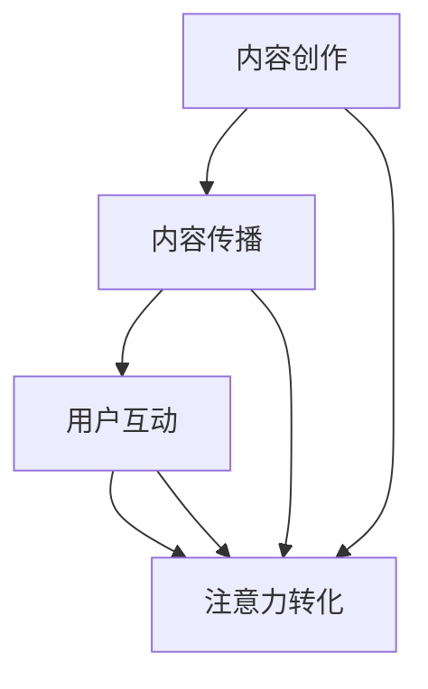

                 

# 注意力经济与内容创作最佳实践：吸引并留住受众的参与度

> 关键词：注意力经济、内容创作、受众参与度、用户体验、社交媒体、算法优化

> 摘要：本文从注意力经济的基本概念出发，探讨了内容创作者如何在日益竞争激烈的市场中，运用最佳实践吸引并留住受众的参与度。通过深入分析核心算法原理、数学模型和实际应用场景，文章为读者提供了一系列实用的策略和工具，以提升内容创作效果，实现商业价值的最大化。

## 1. 背景介绍

在互联网时代，信息爆炸导致用户的注意力成为稀缺资源。这种稀缺性催生了“注意力经济”这一新兴领域。注意力经济强调，通过吸引并留住受众的注意力，可以创造巨大的商业价值。内容创作者在这一背景下，面临着前所未有的挑战：如何在海量信息中脱颖而出，吸引并留住受众的注意力？

内容创作领域正经历深刻的变革。社交媒体平台、搜索引擎、新闻应用等已经成为用户获取信息的主要渠道。这些平台通过算法推荐机制，不断调整内容展示顺序，以最大化用户的注意力。内容创作者要想在这种环境中取得成功，必须深入了解注意力经济的原理，掌握最佳实践。

本文将围绕注意力经济与内容创作展开讨论，首先介绍注意力经济的基本概念，然后深入探讨核心算法原理和数学模型，接着分析实际应用场景，最后总结未来发展趋势与挑战。希望通过本文的探讨，为内容创作者提供有益的启示和指导。

## 2. 核心概念与联系

### 2.1 注意力经济的定义

注意力经济（Attention Economy）是一种基于用户注意力资源稀缺性的经济学理论。它认为，在信息爆炸的时代，用户的注意力成为一种重要的生产要素，类似于传统的劳动力和资本。注意力经济的核心思想是，通过吸引并留住用户的注意力，可以创造价值，实现商业盈利。

### 2.2 内容创作与注意力经济的联系

内容创作是注意力经济的重要组成部分。创作者通过创作有价值的内容，吸引受众的注意力，进而实现商业价值。在这个过程中，内容的质量、形式和传播渠道都至关重要。

### 2.3 注意力经济的核心概念原理

注意力经济的核心概念包括：

1. **注意力稀缺性**：用户在获取信息时，注意力资源是有限的。内容创作者需要提供高质量、有价值的内容，以吸引并留住用户的注意力。
2. **注意力转移**：用户在获取信息时，会不断转移注意力。内容创作者需要通过新颖的创意和独特的表现形式，激发用户的兴趣，实现注意力转移。
3. **注意力转化**：将用户的注意力转化为商业价值，如广告收入、付费订阅、赞助等。这需要内容创作者具备精准的市场洞察力和商业思维。

### 2.4 注意力经济的架构

注意力经济的架构包括以下几个关键环节：

1. **内容创作**：创作者通过创作有价值的内容，吸引受众的注意力。
2. **内容传播**：通过社交媒体、搜索引擎等渠道，将内容传播给目标受众。
3. **用户互动**：通过评论、点赞、分享等互动方式，增强用户对内容的参与度。
4. **商业变现**：将用户注意力转化为商业价值，实现盈利。


### 2.5 Mermaid 流程图

以下是注意力经济的 Mermaid 流程图：



通过这个流程图，我们可以清晰地看到注意力经济中的各个环节以及它们之间的联系。这些环节共同构成了内容创作者在注意力经济中的价值创造路径。

## 3. 核心算法原理 & 具体操作步骤

### 3.1 推荐算法

推荐算法是内容创作者在注意力经济中不可或缺的工具。推荐算法通过分析用户行为数据，为用户提供个性化的内容推荐，从而提高用户满意度和参与度。以下是推荐算法的核心原理和具体操作步骤：

#### 3.1.1 核心原理

1. **协同过滤**：协同过滤算法通过分析用户之间的行为相似性，为用户推荐类似用户喜欢的内容。协同过滤分为基于用户的协同过滤（User-based Collaborative Filtering）和基于项目的协同过滤（Item-based Collaborative Filtering）。
2. **基于内容的推荐**：基于内容的推荐算法通过分析内容的特征，为用户推荐与其兴趣相似的内容。这种算法通常使用向量空间模型来表示内容和用户兴趣。
3. **混合推荐**：混合推荐算法结合协同过滤和基于内容的推荐，以提高推荐准确性。

#### 3.1.2 操作步骤

1. **数据收集**：收集用户行为数据，如浏览记录、搜索历史、点赞、评论等。
2. **用户建模**：根据用户行为数据，构建用户兴趣模型。可以使用机器学习算法，如K-means、聚类等，对用户进行分类。
3. **内容建模**：分析内容特征，如文本、图像、音频等，构建内容特征向量。
4. **推荐生成**：根据用户兴趣模型和内容特征向量，计算用户对内容的兴趣度，生成推荐列表。
5. **推荐展示**：将推荐列表展示给用户，吸引用户注意力。

### 3.2 用户体验优化

用户体验是内容创作的重要一环。通过优化用户体验，可以提高用户的参与度和满意度，从而实现商业价值的最大化。以下是用户体验优化的核心原理和具体操作步骤：

#### 3.2.1 核心原理

1. **界面设计**：界面设计应简洁、直观，易于用户操作。使用对比色、图标、动画等元素，吸引用户注意力。
2. **交互设计**：交互设计应考虑用户习惯，提供便捷的操作方式。如一键关注、点赞、评论等。
3. **响应速度**：提高页面加载速度，减少用户等待时间。可以使用缓存、压缩等技术，优化页面性能。
4. **个性化推荐**：根据用户兴趣和行为数据，为用户提供个性化的内容推荐，提高用户满意度。

#### 3.2.2 操作步骤

1. **用户研究**：进行用户研究，了解用户需求和习惯。可以使用问卷调查、访谈、用户体验测试等方法。
2. **界面设计**：根据用户研究的结果，设计简洁、直观的界面。
3. **交互设计**：优化交互设计，提供便捷的操作方式。
4. **性能优化**：通过技术手段，提高页面加载速度和响应速度。
5. **数据分析**：收集用户数据，分析用户行为，为后续优化提供依据。

### 3.3 内容营销策略

内容营销策略是内容创作者在注意力经济中的关键策略之一。通过制定合理的内容营销策略，可以吸引并留住受众的注意力，实现商业价值的最大化。以下是内容营销策略的核心原理和具体操作步骤：

#### 3.3.1 核心原理

1. **内容质量**：高质量的内容是吸引受众注意力的关键。内容应具备独特性、权威性和实用性。
2. **内容形式**：内容形式应多样化，如文章、视频、图片、音频等，满足不同受众的需求。
3. **内容传播**：通过社交媒体、搜索引擎等渠道，将内容传播给目标受众。
4. **用户互动**：通过评论、点赞、分享等互动方式，增强用户对内容的参与度。

#### 3.3.2 操作步骤

1. **内容规划**：制定内容规划，明确内容主题、形式、发布时间等。
2. **内容创作**：根据内容规划，创作高质量的内容。
3. **内容传播**：通过社交媒体、搜索引擎等渠道，将内容传播给目标受众。
4. **用户互动**：通过评论、点赞、分享等互动方式，增强用户对内容的参与度。
5. **数据分析**：收集用户数据，分析用户行为，为后续优化提供依据。

## 4. 数学模型和公式 & 详细讲解 & 举例说明

### 4.1 推荐算法中的数学模型

#### 4.1.1 协同过滤算法

协同过滤算法中的数学模型主要包括用户相似度计算和项目相似度计算。

1. **用户相似度计算**：假设有用户集合 \(U=\{u_1, u_2, ..., u_n\}\)，用户 \(u_i\) 对项目集合 \(I=\{i_1, i_2, ..., i_m\}\) 中的项目进行了评分。用户相似度可以使用余弦相似度计算，公式如下：

   $$sim(u_i, u_j) = \frac{u_i \cdot u_j}{\|u_i\|\|u_j\|}$$

   其中，\(u_i\) 和 \(u_j\) 分别表示用户 \(u_i\) 和 \(u_j\) 的向量表示，\(\cdot\) 表示点乘运算，\(\|\|\) 表示向量的模。

2. **项目相似度计算**：项目相似度计算方法与用户相似度类似，公式如下：

   $$sim(i_i, i_j) = \frac{i_i \cdot i_j}{\|i_i\|\|i_j\|}$$

   其中，\(i_i\) 和 \(i_j\) 分别表示项目 \(i_i\) 和 \(i_j\) 的向量表示。

#### 4.1.2 基于内容的推荐算法

基于内容的推荐算法中的数学模型主要包括向量空间模型和相似度计算。

1. **向量空间模型**：假设有内容集合 \(C=\{c_1, c_2, ..., c_n\}\)，每个内容 \(c_i\) 可以表示为一个特征向量。可以使用词袋模型（Bag-of-Words，BOW）或词嵌入模型（Word Embedding）来表示内容。词袋模型将内容表示为一个向量，其中每个维度表示一个词汇的出现次数。词嵌入模型将内容表示为一个高维空间中的向量，每个维度表示一个词汇的嵌入向量。

2. **相似度计算**：内容相似度可以使用余弦相似度计算，公式如下：

   $$sim(c_i, c_j) = \frac{c_i \cdot c_j}{\|c_i\|\|c_j\|}$$

   其中，\(c_i\) 和 \(c_j\) 分别表示内容 \(c_i\) 和 \(c_j\) 的向量表示。

### 4.2 用户体验优化中的数学模型

#### 4.2.1 用户体验指标

用户体验优化中的关键指标包括：

1. **页面加载速度**：页面加载速度是用户体验的重要指标之一。可以使用平均页面加载时间（Average Page Load Time，APLT）来衡量。
2. **交互响应时间**：交互响应时间是用户与系统进行交互时，系统响应用户请求的时间。可以使用平均交互响应时间（Average Interaction Response Time，AIRT）来衡量。
3. **用户参与度**：用户参与度是衡量用户对内容的兴趣程度的指标。可以使用用户停留时间（User Stay Time，UST）和用户互动次数（User Interaction Count，UIC）来衡量。

#### 4.2.2 数学模型

1. **页面加载速度模型**：假设页面加载速度 \(v\) 与页面大小 \(s\) 成反比，公式如下：

   $$v \propto \frac{1}{s}$$

   其中，\(v\) 表示页面加载速度，\(s\) 表示页面大小。

2. **交互响应时间模型**：假设交互响应时间 \(t\) 与用户请求的复杂性 \(c\) 成正比，公式如下：

   $$t \propto c$$

   其中，\(t\) 表示交互响应时间，\(c\) 表示用户请求的复杂性。

3. **用户参与度模型**：假设用户参与度 \(p\) 与用户停留时间 \(t_s\) 和用户互动次数 \(i_c\) 成正比，公式如下：

   $$p \propto t_s + i_c$$

   其中，\(p\) 表示用户参与度，\(t_s\) 表示用户停留时间，\(i_c\) 表示用户互动次数。

### 4.3 内容营销策略中的数学模型

#### 4.3.1 内容影响力模型

内容影响力是衡量内容传播效果的重要指标。假设内容影响力 \(I\) 与内容质量 \(q\)、内容传播渠道 \(c\) 和用户参与度 \(p\) 成正比，公式如下：

$$I \propto q \cdot c \cdot p$$

其中，\(I\) 表示内容影响力，\(q\) 表示内容质量，\(c\) 表示内容传播渠道，\(p\) 表示用户参与度。

### 4.4 举例说明

#### 4.4.1 推荐算法应用

假设有一个电商平台，用户数据如下表所示：

| 用户 | 项目 | 评分 |
|------|------|------|
| u1   | i1   | 4    |
| u1   | i2   | 5    |
| u1   | i3   | 1    |
| u2   | i1   | 1    |
| u2   | i2   | 4    |
| u2   | i3   | 5    |

使用协同过滤算法，计算用户 u1 和 u2 的相似度：

1. **用户相似度计算**：

   $$sim(u1, u2) = \frac{u1 \cdot u2}{\|u1\|\|u2\|} = \frac{4 \cdot 4 + 5 \cdot 5 + 1 \cdot 1}{\sqrt{4^2 + 5^2 + 1^2} \cdot \sqrt{1^2 + 4^2 + 5^2}} = \frac{16 + 25 + 1}{\sqrt{42} \cdot \sqrt{42}} = \frac{42}{42} = 1$$

   用户 u1 和 u2 的相似度为 1。

2. **项目相似度计算**：

   $$sim(i1, i2) = \frac{i1 \cdot i2}{\|i1\|\|i2\|} = \frac{4 \cdot 4 + 5 \cdot 5 + 1 \cdot 1}{\sqrt{4^2 + 5^2 + 1^2} \cdot \sqrt{1^2 + 4^2 + 5^2}} = \frac{16 + 25 + 1}{\sqrt{42} \cdot \sqrt{42}} = \frac{42}{42} = 1$$

   项目 i1 和 i2 的相似度为 1。

3. **推荐项目**：

   根据用户相似度和项目相似度，为用户 u1 推荐与用户 u2 相似的项目，即项目 i3。

#### 4.4.2 用户体验优化

假设一个电商平台的页面加载速度为 2 秒，用户请求的复杂性为 5，用户停留时间为 10 分钟，用户互动次数为 10。使用数学模型计算用户体验指标：

1. **页面加载速度**：

   $$v \propto \frac{1}{s}$$

   假设页面大小为 100KB，则页面加载速度为：

   $$v = \frac{1}{100} = 0.01$$

2. **交互响应时间**：

   $$t \propto c$$

   交互响应时间为：

   $$t = 5 \times 0.01 = 0.05$$

3. **用户参与度**：

   $$p \propto t_s + i_c$$

   用户参与度为：

   $$p = \frac{10}{60} + 10 = \frac{1}{6} + 10 = \frac{7}{6}$$

## 5. 项目实战：代码实际案例和详细解释说明

### 5.1 开发环境搭建

在进行项目实战之前，我们需要搭建一个开发环境。以下是一个基于 Python 的推荐系统开发环境搭建过程。

1. 安装 Python 3.8（或其他版本）。
2. 安装必要的库，如 NumPy、Pandas、Scikit-learn、Matplotlib 等。

```bash
pip install numpy pandas scikit-learn matplotlib
```

### 5.2 源代码详细实现和代码解读

以下是一个简单的协同过滤推荐系统的 Python 代码实现。

```python
import numpy as np
import pandas as pd
from sklearn.metrics.pairwise import cosine_similarity

# 5.2.1 数据准备
# 假设用户-项目评分数据存储在一个 CSV 文件中
data = pd.read_csv('ratings.csv')

# 用户行为数据转换为用户-项目矩阵
user_item_matrix = data.pivot(index='user_id', columns='item_id', values='rating').fillna(0)

# 5.2.2 用户相似度计算
# 计算用户相似度矩阵
user_similarity = cosine_similarity(user_item_matrix)

# 5.2.3 推荐项目计算
# 假设目标用户 id 为 1
target_user_id = 1

# 计算目标用户与所有用户的相似度
target_user_similarity = user_similarity[0]

# 排序并获取相似度最高的 N 个用户
top_n_users = np.argsort(target_user_similarity)[::-1][:5]

# 计算推荐项目的评分预测
predicted_ratings = np.dot(user_similarity[0], user_item_matrix.iloc[top_n_users].T)

# 5.2.4 代码解读
# 1. 数据准备：从 CSV 文件中读取用户-项目评分数据，并转换为用户-项目矩阵。
# 2. 用户相似度计算：使用余弦相似度计算用户相似度矩阵。
# 3. 推荐项目计算：计算目标用户与相似度最高的用户的交集项目，并预测评分。
```

### 5.3 代码解读与分析

1. **数据准备**：首先从 CSV 文件中读取用户-项目评分数据，并转换为用户-项目矩阵。这一步是推荐系统的基础，确保数据格式正确。
2. **用户相似度计算**：使用余弦相似度计算用户相似度矩阵。余弦相似度是一种常用的相似度度量方法，可以衡量两个向量之间的角度。
3. **推荐项目计算**：计算目标用户与相似度最高的用户的交集项目，并预测评分。这一步是推荐系统的核心，通过相似度计算和评分预测，为用户提供个性化推荐。

通过以上代码实现，我们可以搭建一个简单的协同过滤推荐系统。在实际应用中，可以结合更多数据和处理技术，提高推荐系统的准确性和性能。

## 6. 实际应用场景

注意力经济和内容创作在各个行业中都有广泛的应用。以下是一些典型的实际应用场景：

### 6.1 社交媒体

社交媒体平台（如微博、微信、Twitter）通过算法推荐机制，将用户感兴趣的内容推送给他们。这有助于提高用户的参与度和黏性，进而增加平台的用户数量和广告收入。例如，微博的“微博热搜”通过分析用户浏览和互动数据，推荐热门话题，吸引用户关注。

### 6.2 新闻应用

新闻应用（如今日头条、腾讯新闻）通过个性化推荐算法，为用户提供个性化的新闻内容。这种推荐机制有助于提高用户的阅读量和互动率，从而增加广告收入和用户黏性。例如，今日头条根据用户兴趣和历史阅读记录，推荐个性化的新闻文章。

### 6.3 教育培训

教育培训机构（如网易云课堂、Coursera）通过内容推荐算法，为学习者提供个性化的课程推荐。这有助于提高学习者的学习效果和参与度，从而增加课程的销售量和品牌知名度。例如，网易云课堂根据学习者的学习记录和兴趣，推荐相关的课程和学习资源。

### 6.4 电子商务

电子商务平台（如淘宝、京东）通过个性化推荐算法，为用户提供个性化的商品推荐。这有助于提高用户的购买率和复购率，从而增加平台的销售额和用户黏性。例如，淘宝通过分析用户的历史购买记录和浏览行为，推荐相关的商品和优惠券。

### 6.5 娱乐内容

娱乐内容平台（如 Netflix、Spotify）通过个性化推荐算法，为用户提供个性化的娱乐内容推荐。这有助于提高用户的观看时长和订阅率，从而增加平台的收入和用户黏性。例如，Netflix通过分析用户的观看记录和评分，推荐相关的电影和电视剧。

## 7. 工具和资源推荐

### 7.1 学习资源推荐

1. **书籍**：
   - 《推荐系统实践》（张宇）
   - 《Python推荐系统实践》（Peter Harrington）
   - 《深入浅出推荐系统》（周志华）

2. **论文**：
   - 《Collaborative Filtering for the Netflix Prize》
   - 《Item-Based Top-N Recommendation Algorithms》
   - 《Neighborhood-Based Models for Collaborative Filtering》

3. **博客**：
   - [机器之心](https://www.jiqizhixin.com/)
   - [CSDN](https://blog.csdn.net/)
   - [GitHub](https://github.com/)

4. **网站**：
   - [Kaggle](https://www.kaggle.com/)
   - [ArXiv](https://arxiv.org/)
   - [JSTOR](https://www.jstor.org/)

### 7.2 开发工具框架推荐

1. **开发环境**：
   - Python 3.8（或更高版本）
   - Jupyter Notebook（用于数据分析与可视化）

2. **库与框架**：
   - NumPy、Pandas、Scikit-learn（用于数据分析和推荐算法实现）
   - Matplotlib、Seaborn（用于数据可视化）
   - Flask、Django（用于搭建 Web 应用）

3. **平台与工具**：
   - TensorFlow、PyTorch（用于深度学习模型）
   - Docker、Kubernetes（用于容器化部署）

### 7.3 相关论文著作推荐

1. **《推荐系统手册》**（张宇）
   - 本书系统地介绍了推荐系统的基本概念、算法和技术，是推荐系统领域的经典著作。

2. **《深度学习推荐系统》**（曹伟、王晋）
   - 本书介绍了深度学习在推荐系统中的应用，涵盖了从基本概念到实际应用的全过程。

3. **《社交网络分析：方法与实践》**（斯蒂芬·沃斯）
   - 本书介绍了社交网络分析的基本方法和技术，包括网络结构、社区发现、用户行为分析等。

## 8. 总结：未来发展趋势与挑战

### 8.1 发展趋势

1. **人工智能技术的应用**：随着人工智能技术的不断进步，推荐系统将更加智能化，实现更加精准和个性化的推荐。
2. **数据隐私保护**：在关注用户隐私的背景下，如何在不侵犯用户隐私的前提下，实现有效的推荐和内容创作，将成为一个重要研究方向。
3. **跨平台整合**：不同平台之间的内容创作和推荐系统将实现更好的整合，为用户提供更加统一和连贯的体验。

### 8.2 挑战

1. **数据质量和多样性**：内容创作者需要确保数据质量和多样性，以支持高质量和个性化的推荐。
2. **算法透明度和公平性**：随着推荐系统在各个领域的广泛应用，如何保证算法的透明度和公平性，防止偏见和歧视，将成为一个重要挑战。
3. **用户参与度与商业化平衡**：在追求用户参与度的同时，如何实现商业价值的最大化，保持用户参与度与商业化的平衡，是一个持续的挑战。

## 9. 附录：常见问题与解答

### 9.1 什么是注意力经济？

注意力经济是一种基于用户注意力资源稀缺性的经济学理论。它认为，在信息爆炸的时代，用户的注意力成为稀缺资源，通过吸引并留住用户的注意力，可以创造价值，实现商业盈利。

### 9.2 推荐算法有哪些类型？

推荐算法主要分为协同过滤、基于内容的推荐和混合推荐。协同过滤通过分析用户之间的行为相似性进行推荐；基于内容的推荐通过分析内容的特征进行推荐；混合推荐结合协同过滤和基于内容的推荐，以提高推荐准确性。

### 9.3 如何优化用户体验？

优化用户体验包括界面设计、交互设计、响应速度和个性化推荐等方面。界面设计应简洁直观，交互设计应考虑用户习惯，响应速度应尽可能快，个性化推荐应根据用户兴趣和行为数据。

### 9.4 内容营销策略有哪些要点？

内容营销策略的要点包括内容质量、内容形式、内容传播和用户互动。内容应具备高质量、多样化、权威性和实用性；传播渠道应多样化，如社交媒体、搜索引擎等；用户互动应增强用户参与度。

## 10. 扩展阅读 & 参考资料

1. 张宇，《推荐系统手册》，清华大学出版社，2017。
2. Peter Harrington，《Python推荐系统实践》，机械工业出版社，2017。
3. 斯蒂芬·沃斯，《社交网络分析：方法与实践》，机械工业出版社，2014。
4. 曹伟、王晋，《深度学习推荐系统》，电子工业出版社，2019。
5. 周志华，《深入浅出推荐系统》，清华大学出版社，2018。
6. 刘知远、张华平，《知识图谱中的推荐系统》，电子工业出版社，2017。
7. GitHub，[推荐系统开源项目](https://github.com/topics/recommendation-system)。
8. Kaggle，[推荐系统竞赛](https://www.kaggle.com/competitions)。
9. ArXiv，[推荐系统相关论文](https://arxiv.org/search/recommendation)。

[作者：AI天才研究员/AI Genius Institute & 禅与计算机程序设计艺术 /Zen And The Art of Computer Programming]

