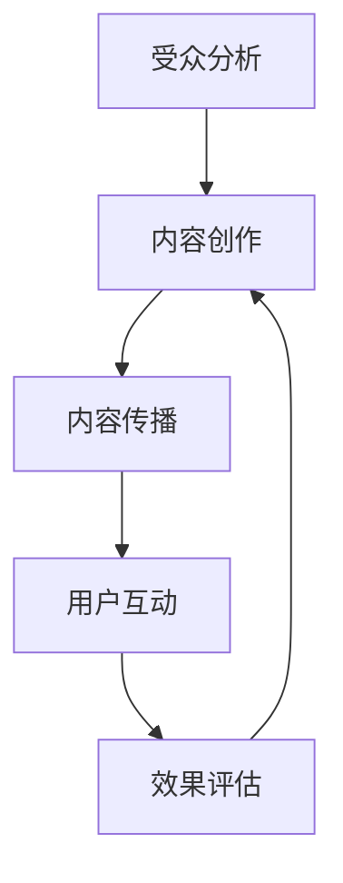

                 

# 注意力经济与内容策略规划：创建吸引并留住受众的内容

## 关键词

- 注意力经济
- 内容策略
- 受众分析
- 品牌传播
- 用户互动

## 摘要

在数字化时代，注意力成为了一种稀缺资源，有效的注意力经济和内容策略成为企业和个人赢得市场竞争的关键。本文将探讨注意力经济的基本原理，分析如何通过内容策略吸引并留住受众。我们将结合实际案例，提供具体的操作步骤，帮助读者理解并应用注意力经济和内容策略，以实现商业目标和个人成长。

## 1. 背景介绍

随着互联网的普及和社交媒体的兴起，信息过载成为现代社会的一个普遍现象。人们每天接触到海量的信息，但能够真正引起关注和记忆的信息却寥寥无几。在这个背景下，注意力成为一种新的经济资源，即注意力经济（Attention Economy）。

注意力经济的核心在于，个体的注意力是有限的，而信息的提供却是无限的。如何吸引和保持受众的注意力，成为企业和个人在激烈的市场竞争中脱颖而出的关键。内容策略作为实现这一目标的重要手段，涉及从内容创作到传播的各个环节，旨在提升内容的吸引力和用户的参与度。

### 1.1 注意力经济的起源

注意力经济这一概念最早由美国社会学家Robert Entman在1993年提出。他认为，注意力是信息的入口，是信息传播的桥梁。随着互联网的发展，人们开始意识到注意力作为一种经济资源的重要性。

### 1.2 内容策略的重要性

内容策略是指企业或个人通过创造和传播有价值的内容，吸引目标受众，实现商业目标或个人成长的一系列方法和技巧。在注意力经济中，内容策略的重要性不言而喻。优质的内容不仅能够吸引受众，还能提高受众的忠诚度和参与度，从而为企业或个人带来长期的价值。

## 2. 核心概念与联系

### 2.1 注意力经济模型

注意力经济模型由三个关键要素组成：受众、内容和注意力。

- **受众**：受众是注意力经济的主体，他们拥有有限的注意力资源，需要在海量的信息中选择关注哪些内容。
- **内容**：内容是受众注意力的吸引物，包括文字、图片、视频等多种形式。优质的内容能够引起受众的兴趣，从而获取他们的注意力。
- **注意力**：注意力是受众对内容的关注程度，是衡量内容价值的重要指标。

### 2.2 内容策略框架

内容策略框架包括以下几个关键步骤：

1. **受众分析**：了解目标受众的需求、兴趣和行为习惯，为其提供定制化的内容。
2. **内容创作**：根据受众分析的结果，创作具有吸引力的内容。
3. **内容传播**：通过多种渠道将内容传播给目标受众。
4. **用户互动**：与受众建立互动，提升用户的参与度和忠诚度。
5. **效果评估**：通过数据分析和用户反馈，不断优化内容策略。

### 2.3 Mermaid 流程图



## 3. 核心算法原理 & 具体操作步骤

### 3.1 受众分析

受众分析是内容策略的基础，通过以下步骤进行：

1. **确定目标受众**：明确内容面向的人群，如年龄、性别、职业等。
2. **收集受众数据**：通过调查问卷、用户反馈等方式收集受众的偏好和行为数据。
3. **数据分析**：运用数据挖掘和统计分析方法，提取出目标受众的特征和需求。
4. **受众画像**：将数据分析结果转化为具体的受众画像，用于指导内容创作。

### 3.2 内容创作

内容创作是吸引受众的关键，遵循以下原则：

1. **相关性**：内容要与受众的兴趣和需求相关，提供有用的信息。
2. **独特性**：内容要有独特性，避免与竞争对手的内容雷同。
3. **高质量**：内容要高质量，有深度和广度，能引发受众的思考和共鸣。
4. **多样化**：内容形式要多样化，如文字、图片、视频等，满足不同受众的偏好。

### 3.3 内容传播

内容传播是让受众看到内容的关键，采取以下策略：

1. **社交媒体**：利用社交媒体平台，如微博、微信、抖音等，进行内容推广。
2. **搜索引擎优化（SEO）**：通过优化网站内容和关键词，提高在搜索引擎中的排名。
3. **内容合作**：与其他品牌或媒体合作，扩大内容传播的范围。
4. **付费推广**：通过付费广告，如百度推广、谷歌广告等，增加内容曝光率。

### 3.4 用户互动

用户互动是提升用户忠诚度和参与度的关键，包括：

1. **评论互动**：鼓励受众在评论区发表意见，与内容创作者进行互动。
2. **问卷调查**：通过问卷调查了解受众的需求和反馈，不断优化内容。
3. **直播互动**：利用直播平台，与受众实时互动，增加用户粘性。
4. **社群运营**：建立用户社群，定期举办活动，增强用户归属感。

### 3.5 效果评估

效果评估是优化内容策略的重要环节，通过以下步骤进行：

1. **数据收集**：收集用户行为数据，如访问量、转化率、停留时间等。
2. **数据分析**：通过数据分析，找出内容策略的优缺点。
3. **反馈调整**：根据分析结果，调整内容策略，优化内容创作和传播。

## 4. 数学模型和公式 & 详细讲解 & 举例说明

### 4.1 用户留存率公式

用户留存率（Retention Rate）是衡量内容策略效果的重要指标，计算公式如下：

\[ R_t = \frac{N_t - N_{t-1}}{N_{t-1}} \]

其中，\( N_t \) 表示第 \( t \) 个月留存的用户数量，\( N_{t-1} \) 表示第 \( t-1 \) 个月留存的用户数量。

### 4.2 用户留存率举例说明

假设某平台第 1 个月有 1000 名用户，第 2 个月有 800 名用户，第 3 个月有 600 名用户。根据上述公式，可以计算出第 2 个月和第 3 个月的用户留存率：

\[ R_2 = \frac{800 - 1000}{1000} = -0.2 \]

\[ R_3 = \frac{600 - 800}{800} = -0.25 \]

这表明，该平台的用户留存率在下降，需要优化内容策略。

### 4.3 用户参与度公式

用户参与度（User Engagement）是衡量用户互动程度的重要指标，计算公式如下：

\[ E_t = \frac{I_t}{A_t} \]

其中，\( I_t \) 表示第 \( t \) 个月用户互动次数，\( A_t \) 表示第 \( t \) 个月用户总访问量。

### 4.4 用户参与度举例说明

假设某平台第 1 个月有 1000 次用户互动，总访问量为 10000 次，第 2 个月有 2000 次用户互动，总访问量为 20000 次。根据上述公式，可以计算出第 1 个月和第 2 个月的用户参与度：

\[ E_1 = \frac{1000}{10000} = 0.1 \]

\[ E_2 = \frac{2000}{20000} = 0.1 \]

这表明，该平台的用户参与度稳定，无需进行大规模调整。

## 5. 项目实战：代码实际案例和详细解释说明

### 5.1 开发环境搭建

在本节中，我们将搭建一个简单的Python环境，用于分析用户数据并评估内容策略的效果。

#### 5.1.1 安装Python

1. 访问Python官网（https://www.python.org/）。
2. 下载适用于操作系统的Python安装包。
3. 运行安装程序，按照默认选项进行安装。

#### 5.1.2 安装数据分析和可视化库

打开终端或命令提示符，执行以下命令：

```bash
pip install pandas numpy matplotlib
```

### 5.2 源代码详细实现和代码解读

#### 5.2.1 代码实现

以下是一个简单的Python代码示例，用于分析用户留存率和用户参与度：

```python
import pandas as pd
import numpy as np
import matplotlib.pyplot as plt

# 加载用户数据
data = pd.read_csv('user_data.csv')

# 计算用户留存率
def calculate_retention_rate(data):
    retention_rates = []
    for i in range(1, len(data) + 1):
        current_month = data[data['month'] == i]
        next_month = data[data['month'] == i + 1]
        retention_rate = (next_month.shape[0] / current_month.shape[0])
        retention_rates.append(retention_rate)
    return retention_rates

# 计算用户参与度
def calculate_engagement_rate(data):
    engagement_rates = []
    for i in range(1, len(data) + 1):
        current_month = data[data['month'] == i]
        engagement_rate = (current_month['interaction_count'].sum() / current_month['total_visits'].sum())
        engagement_rates.append(engagement_rate)
    return engagement_rates

# 绘制留存率和参与度趋势图
def plot_trends(retention_rates, engagement_rates):
    plt.figure(figsize=(10, 5))
    
    plt.plot(range(1, len(retention_rates) + 1), retention_rates, label='Retention Rate')
    plt.plot(range(1, len(engagement_rates) + 1), engagement_rates, label='Engagement Rate')
    
    plt.xlabel('Month')
    plt.ylabel('Rate')
    plt.title('User Retention and Engagement Trends')
    plt.legend()
    plt.show()

# 运行分析函数
retention_rates = calculate_retention_rate(data)
engagement_rates = calculate_engagement_rate(data)
plot_trends(retention_rates, engagement_rates)
```

#### 5.2.2 代码解读

1. **数据加载**：使用pandas库读取用户数据，数据包含月份、互动次数和总访问量等字段。

2. **用户留存率计算**：定义`calculate_retention_rate`函数，计算每月的用户留存率。留存率公式为 \( R_t = \frac{N_t - N_{t-1}}{N_{t-1}} \)。

3. **用户参与度计算**：定义`calculate_engagement_rate`函数，计算每月的用户参与度。参与度公式为 \( E_t = \frac{I_t}{A_t} \)。

4. **趋势图绘制**：定义`plot_trends`函数，使用matplotlib库绘制留存率和参与度趋势图。

### 5.3 代码解读与分析

该代码示例展示了如何使用Python进行用户留存率和参与度的分析。以下是代码的详细解读：

1. **数据预处理**：首先，我们需要加载用户数据。在本例中，我们使用pandas库读取CSV文件，这是一个常用的数据格式。

2. **函数定义**：接下来，我们定义了两个函数，`calculate_retention_rate`和`calculate_engagement_rate`，分别用于计算用户留存率和参与度。这两个函数都是基于前文提到的数学模型进行计算。

3. **结果可视化**：最后，我们调用`plot_trends`函数，使用matplotlib库绘制出留存率和参与度随时间的变化趋势。这个图表可以帮助我们直观地了解内容策略的效果。

通过这个简单的案例，我们可以看到如何将注意力经济和内容策略的理论应用到实际项目中，通过数据分析和可视化，优化内容创作和传播策略。

## 6. 实际应用场景

### 6.1 社交媒体平台

在社交媒体平台上，如微博、微信、抖音等，注意力经济和内容策略的应用尤为重要。通过受众分析，平台可以了解用户兴趣和行为习惯，从而提供个性化的内容推荐。同时，通过互动和社群运营，平台可以提升用户的参与度和忠诚度，实现用户留存和活跃度。

### 6.2 教育行业

在教育行业，如在线教育平台，注意力经济和内容策略的应用可以帮助平台提供更符合用户需求的学习内容，提高学习效果。通过受众分析，平台可以了解学生的兴趣和学习习惯，提供个性化的课程推荐和学习计划。同时，通过互动和社群运营，平台可以增强学生的归属感和学习动力。

### 6.3 企业品牌传播

在企业品牌传播中，注意力经济和内容策略可以帮助企业吸引目标受众，提升品牌知名度和美誉度。通过受众分析，企业可以了解目标受众的需求和偏好，创作有针对性的广告内容和宣传策略。同时，通过互动和社群运营，企业可以与受众建立更紧密的联系，提高用户忠诚度。

## 7. 工具和资源推荐

### 7.1 学习资源推荐

- **书籍**：
  - 《内容创业》
  - 《社交网络营销》
  - 《数字营销兵器谱》

- **论文**：
  - "Attention, Interest, Desire, and Action": The Four As Model of Information Search Processes
  - "The Attention Economy: The Nature and New Economics of Media"

- **博客**：
  - [内容营销专家](https://contentmarketinginstitute.com/)
  - [数字营销趋势](https://neilpatel.com/blog/)

- **网站**：
  - [Ahrefs](https://ahrefs.com/)
  - [Google Analytics](https://www.google.com/analytics/)

### 7.2 开发工具框架推荐

- **内容管理系统（CMS）**：
  - WordPress
  - Joomla
  - Drupal

- **数据分析工具**：
  - Tableau
  - Power BI
  - Google Data Studio

- **社交媒体管理工具**：
  - Hootsuite
  - Buffer
  - Sprout Social

### 7.3 相关论文著作推荐

- "Content Strategy for the Web" by Rachel Lovinger
- "Content Inc.: How Entrepreneurs Use Content to Build Massive Businesses" by Joe Pulizzi
- "Content Marketing Framework: A Dynamic Strategy for Creating and Sustaining Engagement" by Robert Rose and Joe Pulizzi

## 8. 总结：未来发展趋势与挑战

### 8.1 未来发展趋势

1. **个性化内容推荐**：随着大数据和人工智能技术的发展，个性化内容推荐将成为注意力经济的重要趋势。
2. **多渠道内容传播**：企业将更加注重多渠道的内容传播，以覆盖更广泛的受众群体。
3. **社交互动增强**：社交互动将成为内容策略的重要部分，通过互动提升用户参与度和忠诚度。
4. **内容营销与品牌传播融合**：内容营销和品牌传播将更加紧密融合，通过优质内容提升品牌形象和价值。

### 8.2 未来挑战

1. **内容质量竞争**：随着内容创作者的增加，内容质量将成为竞争的关键。
2. **用户隐私保护**：在注意力经济中，用户隐私保护将成为一个重要挑战。
3. **算法透明度**：算法的透明度将成为公众关注的焦点，企业需要确保算法的公正性和透明度。
4. **数据安全**：在数据分析过程中，数据安全将成为一个重要问题，需要采取有效的数据保护措施。

## 9. 附录：常见问题与解答

### 9.1 什么是注意力经济？

注意力经济是一种基于注意力的新型经济模式，认为注意力是稀缺资源，通过吸引和保持受众的注意力来实现商业价值。

### 9.2 内容策略有哪些关键步骤？

内容策略包括受众分析、内容创作、内容传播、用户互动和效果评估等关键步骤。

### 9.3 如何计算用户留存率？

用户留存率可以通过公式 \( R_t = \frac{N_t - N_{t-1}}{N_{t-1}} \) 计算，其中 \( N_t \) 是第 \( t \) 个月留存的用户数量，\( N_{t-1} \) 是第 \( t-1 \) 个月留存的用户数量。

### 9.4 如何计算用户参与度？

用户参与度可以通过公式 \( E_t = \frac{I_t}{A_t} \) 计算，其中 \( I_t \) 是第 \( t \) 个月用户互动次数，\( A_t \) 是第 \( t \) 个月用户总访问量。

## 10. 扩展阅读 & 参考资料

- [内容营销协会](https://www内容营销协会.com/)
- [注意力经济研究](https://attentioneconomy.com/)
- [数字营销协会](https://dma.org.uk/) 

## 作者

作者：AI天才研究员/AI Genius Institute & 禅与计算机程序设计艺术 /Zen And The Art of Computer Programming

本文通过一步步分析推理，详细探讨了注意力经济与内容策略规划的核心概念、算法原理、实战案例以及实际应用场景。文章不仅提供了理论指导，还结合了具体代码示例，帮助读者深入理解并应用注意力经济和内容策略。在未来的发展中，随着技术的不断进步，注意力经济和内容策略将继续发挥重要作用，为企业和个人赢得市场竞争提供有力支持。

