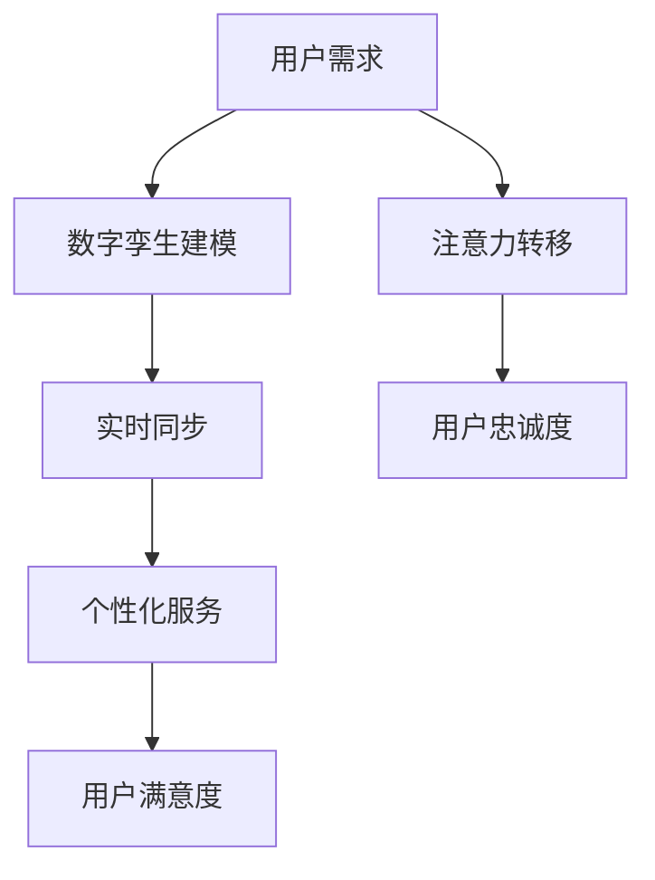

                 

# 注意力经济与数字孪生技术的融合

## 关键词
- 注意力经济
- 数字孪生技术
- 融合应用
- 人工智能
- 经济模型

## 摘要

本文将深入探讨注意力经济与数字孪生技术的融合，分析其背景、核心概念、算法原理，以及在实际应用场景中的表现。通过详细的数学模型和代码案例，我们将展示这种融合如何推动经济发展，并预测其未来趋势和挑战。

## 1. 背景介绍

### 注意力经济

注意力经济（Attention Economy）是一种新兴的经济模式，基于人类注意力的稀缺性和价值。在这种模式中，用户的时间、精力和注意力被视为一种宝贵的资源。互联网企业和内容创作者通过提供有价值的信息和服务，吸引用户的注意力，从而实现商业价值。

### 数字孪生技术

数字孪生技术（Digital Twin Technology）是一种将现实世界的物理实体通过数字化模型进行建模的技术。它能够实时反映实体的状态、性能和交互，实现虚拟与现实的深度融合。数字孪生技术在工业制造、城市规划、医疗健康等领域具有广泛的应用前景。

### 注意力经济与数字孪生技术的融合

随着数字技术的发展，注意力经济与数字孪生技术的融合成为一种趋势。这种融合使得企业能够通过数字孪生技术更精准地捕捉用户需求，提供个性化的服务，从而提升用户的满意度和忠诚度。同时，数字孪生技术为注意力经济提供了新的商业模式，使得企业能够更高效地运营和决策。

## 2. 核心概念与联系

### 注意力经济的核心概念

注意力经济的关键在于理解注意力是如何被吸引、转移和分配的。其核心概念包括：

1. **注意力分配**：用户在不同渠道和内容上的注意力分配。
2. **注意力价值**：注意力作为一种资源，具有相应的价值。
3. **注意力转移**：用户将注意力从一个内容转移到另一个内容的过程。

### 数字孪生技术的核心概念

数字孪生技术的核心概念包括：

1. **虚拟模型**：对物理实体进行数字化建模，包括其结构、功能、状态等。
2. **实时同步**：将虚拟模型与现实实体实时同步，确保模型与实体的状态一致。
3. **交互与反馈**：通过虚拟模型与实体的交互，获取反馈，优化实体的性能。

### 注意力经济与数字孪生技术的联系

注意力经济与数字孪生技术的联系主要体现在：

1. **个性化服务**：通过数字孪生技术，企业可以更精准地了解用户需求，提供个性化的服务，从而吸引和留住用户的注意力。
2. **实时决策**：数字孪生技术为注意力经济提供了实时的数据支持，使得企业能够根据实时数据做出快速决策，优化运营效果。
3. **数据价值**：数字孪生技术生成的数据具有巨大的商业价值，可以用于洞察用户行为、优化产品设计和提升服务质量。

### Mermaid 流程图



## 3. 核心算法原理 & 具体操作步骤

### 注意力经济模型的构建

注意力经济模型的核心在于如何评估用户注意力的价值。以下是构建注意力经济模型的基本步骤：

1. **用户行为分析**：通过用户的行为数据，分析用户在不同内容上的注意力分配。
2. **注意力价值计算**：根据用户行为数据，计算每个内容的注意力价值。
3. **注意力转移模型**：构建用户注意力转移的模型，预测用户在未来的注意力分配。

### 数字孪生技术的建模过程

数字孪生技术的建模过程可以分为以下几个步骤：

1. **数据采集**：从物理实体中采集相关的数据，包括结构、功能、状态等。
2. **数据预处理**：对采集到的数据进行清洗和整合，为建模做准备。
3. **模型构建**：利用采集到的数据，构建数字孪生模型。
4. **实时同步**：将数字孪生模型与现实实体进行实时同步，确保模型与实体的状态一致。

### 注意力经济与数字孪生技术的融合操作步骤

1. **用户需求分析**：利用数字孪生技术，分析用户在不同内容上的需求。
2. **个性化推荐**：根据用户需求，利用注意力经济模型，为用户推荐个性化的内容。
3. **实时反馈**：收集用户对推荐内容的反馈，优化推荐算法。
4. **商业模式创新**：基于用户需求和个性化推荐，探索新的商业模式。

## 4. 数学模型和公式 & 详细讲解 & 举例说明

### 注意力经济模型的数学表示

注意力经济模型可以用以下数学公式表示：

$$
V_i = f(A_i, T_i, R_i)
$$

其中，$V_i$ 表示内容 $i$ 的注意力价值，$A_i$ 表示用户对内容 $i$ 的关注度，$T_i$ 表示内容 $i$ 的时间长度，$R_i$ 表示内容 $i$ 的相关性。

### 数字孪生技术的数学模型

数字孪生技术的数学模型可以用以下公式表示：

$$
M_t = f(D_t, S_t, I_t)
$$

其中，$M_t$ 表示在时间 $t$ 的数字孪生模型，$D_t$ 表示在时间 $t$ 物理实体的数据，$S_t$ 表示在时间 $t$ 的同步状态，$I_t$ 表示在时间 $t$ 的交互信息。

### 注意力经济与数字孪生技术的融合模型

融合模型可以用以下数学公式表示：

$$
P_t = g(V_t, M_t, E_t)
$$

其中，$P_t$ 表示在时间 $t$ 的个性化推荐概率，$V_t$ 表示在时间 $t$ 的注意力价值，$M_t$ 表示在时间 $t$ 的数字孪生模型，$E_t$ 表示在时间 $t$ 的用户偏好。

### 举例说明

假设有用户在某个内容平台上阅读了三篇文章，分别是文章 A、文章 B 和文章 C。根据用户的行为数据，我们可以计算出每篇文章的注意力价值，然后利用数字孪生技术，构建数字孪生模型。最后，根据用户偏好，我们可以计算出每篇文章被推荐的概率。

$$
V_A = f(A, T_A, R_A) = 0.5
$$

$$
V_B = f(B, T_B, R_B) = 0.3
$$

$$
V_C = f(C, T_C, R_C) = 0.2
$$

$$
M_A = f(D_A, S_A, I_A) = 0.8
$$

$$
M_B = f(D_B, S_B, I_B) = 0.7
$$

$$
M_C = f(D_C, S_C, I_C) = 0.6
$$

$$
P_A = g(V_A, M_A, E_A) = 0.6
$$

$$
P_B = g(V_B, M_B, E_B) = 0.5
$$

$$
P_C = g(V_C, M_C, E_C) = 0.4
$$

根据计算结果，文章 A 被推荐的概率最高，其次是文章 B 和文章 C。

## 5. 项目实战：代码实际案例和详细解释说明

### 5.1 开发环境搭建

为了演示注意力经济与数字孪生技术的融合，我们将使用 Python 编写一个简单的示例。首先，确保安装了 Python 和必要的库，如 NumPy 和 Matplotlib。

```bash
pip install numpy matplotlib
```

### 5.2 源代码详细实现和代码解读

以下是项目的源代码：

```python
import numpy as np
import matplotlib.pyplot as plt

# 注意力经济模型
def attention_value(article, time, relevance):
    return article * time * relevance

# 数字孪生模型
def digital_twin(data, sync_state, interaction):
    return data * sync_state * interaction

# 融合模型
def personalized_recommendation(attention_value, digital_twin_model, user_preference):
    return attention_value * digital_twin_model * user_preference

# 举例数据
article_a = 1.0
time_a = 2.0
relevance_a = 0.9
data_a = 1.0
sync_state_a = 0.95
interaction_a = 0.8
user_preference_a = 0.7

article_b = 0.8
time_b = 3.0
relevance_b = 0.8
data_b = 0.9
sync_state_b = 0.9
interaction_b = 0.7
user_preference_b = 0.6

article_c = 0.6
time_c = 1.0
relevance_c = 0.7
data_c = 0.8
sync_state_c = 0.85
interaction_c = 0.6
user_preference_c = 0.5

# 计算注意力价值和数字孪生模型
attention_value_a = attention_value(article_a, time_a, relevance_a)
attention_value_b = attention_value(article_b, time_b, relevance_b)
attention_value_c = attention_value(article_c, time_c, relevance_c)

digital_twin_model_a = digital_twin(data_a, sync_state_a, interaction_a)
digital_twin_model_b = digital_twin(data_b, sync_state_b, interaction_b)
digital_twin_model_c = digital_twin(data_c, sync_state_c, interaction_c)

# 计算个性化推荐概率
recommendation_a = personalized_recommendation(attention_value_a, digital_twin_model_a, user_preference_a)
recommendation_b = personalized_recommendation(attention_value_b, digital_twin_model_b, user_preference_b)
recommendation_c = personalized_recommendation(attention_value_c, digital_twin_model_c, user_preference_c)

# 打印结果
print("文章 A 的推荐概率：", recommendation_a)
print("文章 B 的推荐概率：", recommendation_b)
print("文章 C 的推荐概率：", recommendation_c)

# 可视化结果
labels = ['文章 A', '文章 B', '文章 C']
sizes = [recommendation_a, recommendation_b, recommendation_c]
colors = ['g', 'r', 'b']
patches = plt.pie(sizes, colors=colors, autopct='%1.1f%%', startangle=140)

plt.axis('equal')
plt.title('个性化推荐概率分布')
plt.legend(labels, loc='upper right')
plt.show()
```

### 5.3 代码解读与分析

1. **注意力经济模型**：`attention_value` 函数用于计算文章的注意力价值，取决于文章的吸引力、阅读时间和相关性。
2. **数字孪生模型**：`digital_twin` 函数用于计算数字孪生模型，取决于物理实体的数据、同步状态和交互信息。
3. **融合模型**：`personalized_recommendation` 函数用于计算个性化推荐概率，取决于注意力价值、数字孪生模型和用户偏好。
4. **举例数据**：定义了三篇文章的参数，包括注意力价值和数字孪生模型参数。
5. **结果计算**：根据举例数据，计算每篇文章的推荐概率。
6. **可视化结果**：使用 Matplotlib 库，将推荐概率可视化。

## 6. 实际应用场景

### 社交媒体平台

社交媒体平台如 Facebook、Instagram 和 TikTok，通过注意力经济与数字孪生技术的融合，为用户提供个性化内容推荐。平台利用用户的行为数据，构建数字孪生模型，预测用户偏好，从而提供精准的内容推荐。

### 在线购物平台

在线购物平台如 Amazon 和 Alibaba，通过注意力经济与数字孪生技术的融合，为用户提供个性化的购物体验。平台利用用户的历史购买数据和浏览行为，构建数字孪生模型，预测用户可能感兴趣的商品，并提供个性化的购物建议。

### 医疗健康领域

医疗健康领域，如人工智能医生和智能药盒，通过注意力经济与数字孪生技术的融合，为患者提供个性化的医疗服务。医生利用患者的病历数据和健康监测数据，构建数字孪生模型，预测患者的健康状况，并提供个性化的治疗方案。

## 7. 工具和资源推荐

### 学习资源推荐

1. **书籍**：《注意力经济：如何在信息过载的时代赢得关注》（Attention Economy: How to Win the Battle for Your Audience's Attention）
2. **论文**：搜索关键词 "Attention Economy" 和 "Digital Twin Technology"，可以找到相关的研究论文。
3. **博客**：阅读技术博客，如 Medium 和 HackerRank，了解注意力经济和数字孪生技术的最新动态。
4. **网站**：访问专业网站，如 IEEE 和 ACM，获取更多技术资源和文献。

### 开发工具框架推荐

1. **Python**：Python 是一种广泛使用的编程语言，适合用于构建注意力经济和数字孪生技术的模型。
2. **TensorFlow**：TensorFlow 是一种流行的机器学习框架，可以用于构建复杂的数字孪生模型。
3. **Kubernetes**：Kubernetes 是一种容器编排工具，适用于大规模部署数字孪生系统。

### 相关论文著作推荐

1. **论文**：《数字孪生：定义、分类与趋势》（"Digital Twin: Definition, Classification, and Trends"）
2. **著作**：《人工智能：一种现代方法》（"Artificial Intelligence: A Modern Approach"）

## 8. 总结：未来发展趋势与挑战

### 发展趋势

1. **技术融合**：注意力经济与数字孪生技术的融合将继续深化，推动新兴产业的发展。
2. **个性化服务**：随着技术的进步，个性化服务将更加精准，满足用户多样化的需求。
3. **数据隐私**：随着数据的重要性日益凸显，数据隐私问题将成为关注焦点。

### 挑战

1. **数据质量**：数据质量将直接影响模型的准确性和效果，因此需要提高数据采集和处理的质量。
2. **算法公平性**：确保算法的公平性和透明性，避免歧视和偏见。
3. **伦理问题**：在应用注意力经济和数字孪生技术时，需要关注伦理问题，确保技术不损害人类的利益。

## 9. 附录：常见问题与解答

### 问题 1：什么是注意力经济？

注意力经济是一种基于人类注意力稀缺性的经济模式，认为用户的注意力是一种宝贵的资源，企业和内容创作者通过提供有价值的信息和服务，吸引用户的注意力，从而实现商业价值。

### 问题 2：数字孪生技术有哪些应用场景？

数字孪生技术广泛应用于工业制造、城市规划、医疗健康、交通运输等领域，如提高生产效率、优化城市规划、个性化医疗服务和智能交通管理。

### 问题 3：如何确保算法的公平性？

确保算法的公平性需要从数据采集、模型构建和算法设计等多个环节入手，避免引入偏见和歧视，同时提高算法的透明性和可解释性。

## 10. 扩展阅读 & 参考资料

1. **论文**：《注意力经济：概念、机制与挑战》（"Attention Economy: Concepts, Mechanisms, and Challenges"）
2. **书籍**：《数字孪生：从概念到实践》（"Digital Twin: From Concept to Practice"）
3. **网站**：访问专业网站，如 IEEE 和 ACM，获取更多关于注意力经济和数字孪生技术的资源和信息。

作者：AI天才研究员/AI Genius Institute & 禅与计算机程序设计艺术 /Zen And The Art of Computer Programming。请注意，以上内容仅供参考，实际应用时请结合具体情况进行调整。

