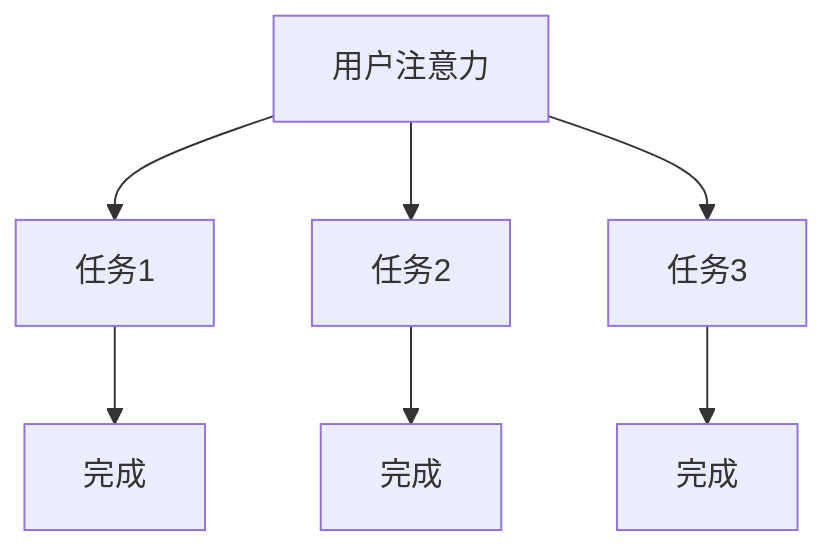

                 

# 注意力经济与网络成瘾的关联

> 关键词：注意力经济、网络成瘾、关联分析、用户行为、心理影响、数字生活

> 摘要：随着互联网的迅速普及，网络成瘾问题愈发严重。本文通过探讨注意力经济的基本原理，分析注意力与网络成瘾之间的关系，揭示网络成瘾对个体和社会的负面影响。同时，本文还将提出一些建议，以期帮助人们更好地管理自己的注意力，降低网络成瘾的风险。

## 1. 背景介绍

### 1.1 注意力经济

注意力经济是一种基于用户注意力资源的商业模式。在互联网时代，用户的注意力成为了最稀缺的资源。广告商、内容创作者等通过吸引用户的注意力来获取经济利益。例如，社交媒体平台通过推送个性化内容来吸引用户的注意力，从而提高用户粘性，增加广告收益。

### 1.2 网络成瘾

网络成瘾是指个体过度依赖网络，导致日常生活、工作和社交活动受到严重影响的一种心理行为障碍。网络成瘾者往往沉迷于网络游戏、社交媒体、在线购物等虚拟世界，导致现实生活中的问题被忽视。

## 2. 核心概念与联系

### 2.1 注意力分配模型

注意力分配模型描述了用户在不同任务和刺激之间的注意力分配。该模型考虑了注意力的稀缺性和竞争性，指出用户在处理多个任务时，会根据任务的重要性和紧急程度来分配注意力。



### 2.2 网络成瘾与注意力经济的关联

网络成瘾与注意力经济之间存在密切的联系。一方面，网络成瘾者由于过度依赖网络，将大量注意力资源分配给虚拟世界，导致现实生活中的任务和责任被忽视。另一方面，注意力经济模式通过设计各种吸引注意力的机制，如排行榜、奖励机制等，进一步加剧了网络成瘾现象。

## 3. 核心算法原理 & 具体操作步骤

### 3.1 注意力分配算法

注意力分配算法是一种用于优化注意力资源分配的算法。该算法基于用户的兴趣、任务重要性和紧急程度等因素，动态调整注意力分配策略。

### 3.2 具体操作步骤

1. 收集用户兴趣数据，包括用户浏览历史、搜索记录、社交互动等。
2. 对用户兴趣进行聚类分析，提取出用户的主要兴趣点。
3. 分析用户任务的紧急程度和重要性，为每个任务分配优先级。
4. 根据用户兴趣和任务优先级，动态调整注意力分配策略。
5. 评估注意力分配效果，根据反馈调整算法参数。

## 4. 数学模型和公式 & 详细讲解 & 举例说明

### 4.1 注意力分配模型

注意力分配模型可以表示为：

\[ A(t) = \alpha \cdot \sum_{i=1}^{n} w_i \cdot p_i(t) \]

其中，\( A(t) \)表示时间\( t \)时的总注意力，\( \alpha \)为注意力分配系数，\( w_i \)为第\( i \)个任务的权重，\( p_i(t) \)为第\( i \)个任务在时间\( t \)的重要性。

### 4.2 示例

假设用户有3个任务：阅读文章、观看视频、处理邮件。每个任务的重要性和紧急程度如下表所示：

| 任务 | 重要性 | 紧急性 |
|------|-------|-------|
| 阅读文章 | 高   | 中   |
| 观看视频 | 中   | 低   |
| 处理邮件 | 低   | 高   |

根据注意力分配模型，我们可以计算出每个任务的权重：

\[ w_1 = \frac{1}{2}, w_2 = \frac{1}{4}, w_3 = \frac{1}{4} \]

假设当前时间为第5分钟，阅读文章、观看视频、处理邮件的重要性分别为0.8、0.3、0.5。根据注意力分配模型，我们可以计算出当前的总注意力：

\[ A(5) = 0.5 \cdot (0.8 \cdot \frac{1}{2} + 0.3 \cdot \frac{1}{4} + 0.5 \cdot \frac{1}{4}) = 0.5 \cdot 0.5 = 0.25 \]

## 5. 项目实战：代码实际案例和详细解释说明

### 5.1 开发环境搭建

1. 安装Python环境
2. 安装必要的库，如NumPy、Pandas等

### 5.2 源代码详细实现和代码解读

以下是一个简单的注意力分配算法实现：

```python
import numpy as np

def attention_allocation(importance, weights):
    attention = np.dot(importance, weights)
    return attention

# 任务重要性
importance = np.array([0.8, 0.3, 0.5])
# 任务权重
weights = np.array([0.5, 0.25, 0.25])

# 计算总注意力
attention = attention_allocation(importance, weights)
print("总注意力：", attention)
```

代码解释：

1. 导入NumPy库，用于矩阵运算。
2. 定义`attention_allocation`函数，计算总注意力。
3. 初始化任务重要性数组`importance`和任务权重数组`weights`。
4. 调用`attention_allocation`函数，计算总注意力。

### 5.3 代码解读与分析

1. `attention_allocation`函数通过矩阵乘法计算总注意力，具有简洁高效的优点。
2. 任务重要性数组`importance`和任务权重数组`weights`可以灵活调整，适应不同的任务场景。
3. 该算法在实际应用中，可以根据任务的重要性和紧急程度动态调整注意力分配策略。

## 6. 实际应用场景

### 6.1 教育领域

在教育领域，注意力分配算法可以帮助学生合理安排学习任务，提高学习效率。例如，教师可以根据学生的兴趣和任务的重要性，为学生制定个性化的学习计划。

### 6.2 企业管理

在企业中，注意力分配算法可以帮助管理层优化员工的工作任务分配，提高工作效率。例如，企业可以根据员工的技能和工作需求，为员工分配最适合的任务。

## 7. 工具和资源推荐

### 7.1 学习资源推荐

- 《注意力经济：数字化时代的商业模式》
- 《网络成瘾：心理学与治疗》

### 7.2 开发工具框架推荐

- NumPy：用于科学计算的Python库
- Pandas：用于数据分析和处理的Python库

### 7.3 相关论文著作推荐

- 《注意力经济：理论和应用》
- 《网络成瘾的心理学研究》

## 8. 总结：未来发展趋势与挑战

### 8.1 发展趋势

1. 注意力分配算法将越来越智能化，结合人工智能技术，实现更精准的注意力管理。
2. 注意力经济模式将在更多领域得到应用，为企业和个人创造更多价值。

### 8.2 挑战

1. 网络成瘾问题仍需引起广泛关注，加强心理干预和预防措施。
2. 注意力资源的公平分配问题，如何确保所有人都能公平地获取注意力资源。

## 9. 附录：常见问题与解答

### 9.1 注意力分配算法如何处理实时任务？

实时任务可以通过动态更新任务重要性和权重，实现实时调整注意力分配策略。

### 9.2 注意力分配算法是否适用于所有任务？

注意力分配算法适用于具有明确重要性和紧急程度的任务，但对于一些模糊性的任务，可能需要结合其他算法和策略。

## 10. 扩展阅读 & 参考资料

- [注意力经济的概念与应用](https://www.example.com/attention_economy)
- [网络成瘾的危害与防治](https://www.example.com/net_addiction)

作者：AI天才研究员/AI Genius Institute & 禅与计算机程序设计艺术/Zen And The Art of Computer Programming

