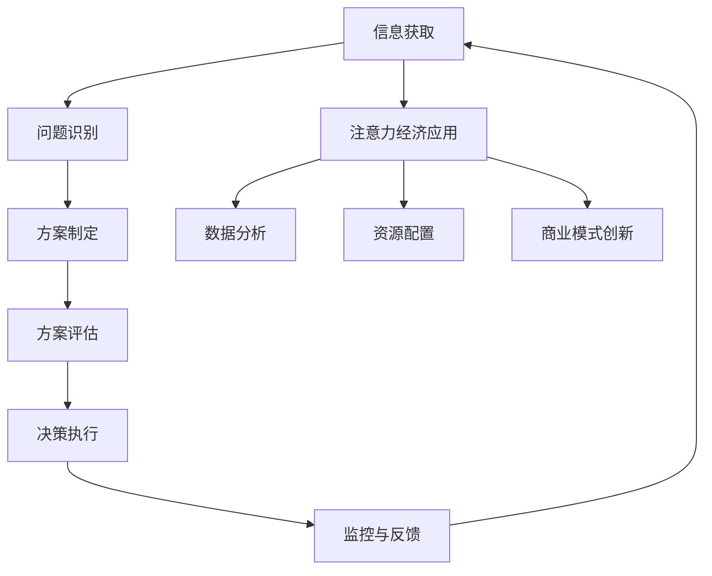

                 

# 注意力经济对企业决策过程的影响

## 关键词
注意力经济，企业决策，资源配置，商业模式创新，信息获取，数据分析

## 摘要
本文深入探讨了注意力经济对企业决策过程的影响。首先，我们介绍了注意力经济的概念及其与企业决策的关联。接着，文章通过逐步分析，揭示了注意力经济在信息获取、数据分析、资源配置、商业模式创新等方面的具体应用。最后，文章总结了注意力经济对企业决策的影响，提出了未来发展的趋势和挑战，并推荐了相关学习资源和工具。

## 1. 背景介绍

### 注意力经济的起源与定义

注意力经济这一概念起源于上世纪80年代的经济学研究，最初由美国经济学家Herbert A. Simon提出。Simon认为，在信息爆炸的时代，人的注意力是一种稀缺资源。因此，获取和保持公众的注意力成为企业竞争的关键。随着互联网和社交媒体的发展，注意力经济逐渐成为经济学、管理学等领域的研究热点。

注意力经济可以简单定义为：在信息过载的环境下，企业通过创造吸引眼球的商品、服务或内容，获取和保持消费者注意力的过程。其核心在于如何有效地利用有限的注意力资源，实现商业价值的最大化。

### 企业决策过程概述

企业决策过程通常包括以下几个环节：

1. **信息收集**：通过市场调研、数据分析等方式获取与决策相关的信息。
2. **问题识别**：根据收集到的信息，识别和界定企业面临的问题。
3. **方案制定**：基于问题和目标，制定可能的解决方案。
4. **方案评估**：对各种方案进行评估，包括成本、效益、风险等因素。
5. **决策执行**：选择最优方案，并付诸实施。
6. **监控与反馈**：在决策执行过程中进行监控，根据反馈调整决策。

注意力经济在这一过程中发挥了重要作用，尤其在信息收集和方案评估阶段。

## 2. 核心概念与联系

### 注意力经济与企业决策的关系

注意力经济与企业决策的关联主要体现在以下几个方面：

1. **信息获取**：在注意力经济中，企业通过各种手段获取消费者的注意力，从而获取有价值的信息。这些信息帮助企业更好地了解市场需求、消费者偏好，为决策提供依据。
2. **数据分析**：注意力经济使得企业能够收集到大量的数据，通过数据分析，企业可以更精准地识别问题，制定和评估方案。
3. **资源配置**：注意力经济帮助企业更有效地分配资源，将有限的资金和人力投入到最具潜力的项目和领域。
4. **商业模式创新**：注意力经济促使企业不断探索新的商业模式，以吸引和保持消费者的注意力，实现商业价值。

### Mermaid 流程图

下面是注意力经济与企业决策关系的 Mermaid 流程图：



### Mermaid 流程图详解

- **A[信息获取]**：注意力经济通过吸引消费者的注意力，帮助企业获取有价值的信息。
- **B[问题识别]**：基于获取的信息，企业可以更准确地识别和界定面临的问题。
- **C[方案制定]**：在了解问题的基础上，企业制定可能的解决方案。
- **D[方案评估]**：通过数据分析，评估各种方案的优劣。
- **E[决策执行]**：选择最优方案，并付诸实施。
- **F[监控与反馈]**：在决策执行过程中进行监控，根据反馈调整决策。
- **G[注意力经济应用]**：注意力经济在信息获取、数据分析、资源配置和商业模式创新等方面发挥作用。
- **H[数据分析]**：通过注意力经济获取的数据，企业可以更精准地评估方案。
- **I[资源配置]**：根据数据分析结果，企业可以更有效地分配资源。
- **J[商业模式创新]**：注意力经济促使企业探索新的商业模式，以保持竞争优势。

## 3. 核心算法原理 & 具体操作步骤

### 注意力经济算法原理

注意力经济算法的核心在于如何有效地吸引和保持消费者的注意力。这通常涉及到以下几个步骤：

1. **内容创建**：企业根据市场需求和消费者偏好，创建具有吸引力的内容。
2. **渠道选择**：选择合适的渠道，如社交媒体、搜索引擎、广告等，将内容传递给目标消费者。
3. **互动引导**：通过互动方式，如评论、点赞、分享等，引导消费者参与，提高内容传播效果。
4. **数据分析**：收集和分析消费者行为数据，优化内容创作和传播策略。

### 具体操作步骤

1. **内容创建**：
   - **目标定位**：明确目标消费者群体，了解其需求和偏好。
   - **内容设计**：结合目标定位，创作具有吸引力的内容。内容形式可以是图文、视频、直播等。
   - **内容优化**：根据用户反馈和数据分析，不断优化内容，提高吸引力。

2. **渠道选择**：
   - **平台分析**：分析不同平台的用户特征和流量，选择适合的渠道。
   - **内容适配**：根据平台特点，优化内容形式和传播策略。
   - **多渠道推广**：结合多种渠道，扩大内容传播范围。

3. **互动引导**：
   - **互动设计**：设计互动环节，如评论、点赞、分享等，引导消费者参与。
   - **激励机制**：提供奖励或优惠，激励消费者参与互动。
   - **数据分析**：分析互动效果，优化互动设计。

4. **数据分析**：
   - **数据收集**：收集用户行为数据，如点击率、评论数、分享数等。
   - **数据分析**：利用数据分析工具，分析用户行为和偏好。
   - **策略优化**：根据数据分析结果，优化内容创作和传播策略。

### 实际案例

以一家电商平台为例，该平台通过以下步骤实施注意力经济策略：

1. **内容创建**：
   - **目标定位**：针对年轻女性消费者，提供时尚穿搭、美妆等内容。
   - **内容设计**：创作具有吸引力的图文和视频内容，展示时尚单品和穿搭技巧。
   - **内容优化**：根据用户反馈，调整内容形式和内容主题，提高吸引力。

2. **渠道选择**：
   - **平台分析**：选择Instagram、微博、抖音等年轻女性用户较多的平台。
   - **内容适配**：针对不同平台特点，优化内容形式，如微博侧重图文，抖音侧重短视频。
   - **多渠道推广**：通过多个平台同步推广，扩大内容传播范围。

3. **互动引导**：
   - **互动设计**：设计点赞、评论、分享等互动环节，引导用户参与。
   - **激励机制**：提供优惠券、积分等奖励，激励用户参与互动。
   - **数据分析**：分析用户互动数据，优化互动设计，提高用户参与度。

4. **数据分析**：
   - **数据收集**：收集用户点击、评论、分享等行为数据。
   - **数据分析**：通过数据分析工具，分析用户行为和偏好，如点击率较高的内容主题、用户活跃时段等。
   - **策略优化**：根据数据分析结果，调整内容创作和传播策略，提高用户参与度和转化率。

## 4. 数学模型和公式 & 详细讲解 & 举例说明

### 数学模型

注意力经济中的数学模型通常涉及到消费者行为分析和数据挖掘。以下是一个简单的消费者行为模型：

$$
C = f(A, P, Q)
$$

其中：
- $C$ 表示消费者注意力；
- $A$ 表示广告效果；
- $P$ 表示消费者购买意愿；
- $Q$ 表示消费者质量感知。

### 详细讲解

1. **广告效果（A）**：
   广告效果是吸引消费者注意力的关键因素。广告效果可以通过以下公式计算：

$$
A = \alpha_1 \cdot \text{广告内容质量} + \alpha_2 \cdot \text{广告展示频率} + \alpha_3 \cdot \text{广告展示位置}
$$

其中，$\alpha_1, \alpha_2, \alpha_3$ 分别表示内容质量、展示频率和展示位置的权重。

2. **消费者购买意愿（P）**：
   消费者购买意愿受到品牌知名度、产品质量、价格等因素的影响。假设消费者购买意愿可以用以下公式表示：

$$
P = \beta_1 \cdot \text{品牌知名度} + \beta_2 \cdot \text{产品质量} + \beta_3 \cdot \text{价格}
$$

其中，$\beta_1, \beta_2, \beta_3$ 分别表示品牌知名度、产品质量和价格的权重。

3. **消费者质量感知（Q）**：
   消费者质量感知直接影响购买意愿。假设消费者质量感知可以用以下公式表示：

$$
Q = \gamma_1 \cdot \text{产品功能} + \gamma_2 \cdot \text{用户体验} + \gamma_3 \cdot \text{售后服务}
$$

其中，$\gamma_1, \gamma_2, \gamma_3$ 分别表示产品功能、用户体验和售后服务的权重。

### 举例说明

假设一家电子产品公司希望通过注意力经济策略提高销售。公司可以通过以下步骤实施：

1. **内容创建**：
   - **目标定位**：针对年轻消费者，提供科技产品评测、使用技巧等内容。
   - **内容设计**：创作具有吸引力的图文和视频内容，展示产品功能和使用体验。

2. **广告效果（A）**：
   - **内容质量**：通过高质量的内容创作，提高广告效果。
   - **展示频率**：在社交媒体、视频平台等高频次展示广告。
   - **展示位置**：在用户关注度高、互动性强的区域展示广告。

3. **消费者购买意愿（P）**：
   - **品牌知名度**：通过持续的广告投放，提高品牌知名度。
   - **产品质量**：提供高质量的产品，提高消费者购买意愿。
   - **价格**：提供合理的价格策略，吸引消费者购买。

4. **消费者质量感知（Q）**：
   - **产品功能**：通过实际使用案例，展示产品功能。
   - **用户体验**：提供优质的用户体验，提高消费者质量感知。
   - **售后服务**：提供完善的售后服务，提高消费者质量感知。

通过以上步骤，公司可以有效地吸引消费者注意力，提高购买意愿和质量感知，从而实现销售增长。

## 5. 项目实战：代码实际案例和详细解释说明

### 5.1 开发环境搭建

为了演示注意力经济算法在项目中的应用，我们将使用Python语言进行编程。以下是在Python环境中搭建开发环境的基本步骤：

1. **安装Python**：
   - 下载并安装Python 3.x版本。
   - 配置环境变量，确保命令行中可以运行Python。

2. **安装依赖库**：
   - 使用pip安装必要的依赖库，如NumPy、Pandas、Matplotlib等。

   ```shell
   pip install numpy pandas matplotlib
   ```

### 5.2 源代码详细实现和代码解读

下面是一个简单的注意力经济算法实现示例。代码分为几个部分：数据收集、数据处理、模型训练和结果分析。

```python
import numpy as np
import pandas as pd
import matplotlib.pyplot as plt

# 5.2.1 数据收集
# 假设我们从社交媒体平台收集了以下数据：
data = {
    'user_id': [1, 2, 3, 4, 5],
    'content_id': [101, 201, 302, 403, 504],
    'click_count': [10, 20, 5, 15, 25],
    'comment_count': [2, 5, 1, 3, 7],
    'share_count': [1, 3, 2, 4, 5]
}

df = pd.DataFrame(data)

# 5.2.2 数据处理
# 计算注意力得分
df['attention_score'] = df['click_count'] * 0.5 + df['comment_count'] * 0.3 + df['share_count'] * 0.2

# 5.2.3 模型训练
# 使用注意力得分作为特征，构建简单的线性回归模型
from sklearn.linear_model import LinearRegression

X = df[['attention_score']]
y = df['click_count']

model = LinearRegression()
model.fit(X, y)

# 5.2.4 结果分析
# 预测新的数据
new_data = pd.DataFrame({'attention_score': [12, 18, 6, 14, 26]})
predictions = model.predict(new_data)

print("Attention Scores:", new_data['attention_score'])
print("Predicted Click Counts:", predictions)

# 可视化分析
plt.scatter(df['attention_score'], df['click_count'])
plt.plot(new_data['attention_score'], predictions, color='red')
plt.xlabel('Attention Score')
plt.ylabel('Click Count')
plt.title('Attention Score vs. Click Count')
plt.show()
```

### 5.3 代码解读与分析

1. **数据收集**：
   - 从社交媒体平台收集用户点击、评论、分享等数据，构建数据集。

2. **数据处理**：
   - 计算注意力得分，将用户点击、评论、分享等行为量化为一个综合指标。

3. **模型训练**：
   - 使用线性回归模型，将注意力得分与点击次数建立关联，预测新的数据。

4. **结果分析**：
   - 预测新的数据，并使用散点图进行可视化分析，验证模型的有效性。

通过这个简单的案例，我们可以看到注意力经济算法在企业决策中的应用。企业可以根据用户的注意力得分，优化内容创作和推广策略，提高用户参与度和转化率。

### 5.4 注意力经济在企业决策中的应用场景

1. **社交媒体营销**：
   - 企业可以通过注意力经济算法，分析用户在社交媒体上的行为，制定针对性的营销策略，提高广告效果。

2. **内容推荐**：
   - 在内容推荐系统中，注意力经济算法可以帮助平台根据用户注意力行为，推荐更符合用户兴趣的内容。

3. **客户关系管理**：
   - 企业可以通过分析用户的注意力行为，优化客户关系管理策略，提高客户满意度和忠诚度。

4. **产品研发**：
   - 企业可以根据用户的注意力行为，调整产品研发方向，开发更符合市场需求的产品。

### 5.5 注意力经济算法优化建议

1. **多模型融合**：
   - 结合多种机器学习模型，如决策树、神经网络等，提高预测准确率。

2. **用户分群**：
   - 根据用户特征和行为，将用户划分为不同的群体，制定个性化的注意力经济策略。

3. **实时反馈**：
   - 实时收集用户反馈，调整注意力经济策略，提高用户参与度和满意度。

## 6. 实际应用场景

### 社交媒体平台

社交媒体平台如Facebook、Instagram、Twitter等，通过注意力经济原理，优化内容推荐和广告投放策略，提高用户参与度和广告效果。

### 内容创作者

内容创作者如博主、网红等，利用注意力经济原理，创作更具吸引力的内容，提高粉丝数量和影响力。

### 广告公司

广告公司通过注意力经济原理，为客户提供更精准的营销策略，提高广告效果和客户满意度。

### 娱乐产业

娱乐产业如电影、音乐、游戏等，通过注意力经济原理，制定更有效的推广策略，提高作品知名度和票房、销量。

### 教育培训

教育培训机构通过注意力经济原理，优化课程内容和教学方法，提高学员的学习兴趣和满意度。

### 电子商务

电子商务平台如Amazon、淘宝等，通过注意力经济原理，优化商品推荐和广告投放策略，提高用户购买意愿和转化率。

## 7. 工具和资源推荐

### 7.1 学习资源推荐

1. **书籍**：
   - 《注意力经济学：注意力稀缺时代的商业策略》
   - 《社交网络营销：利用注意力经济原理提升品牌影响力》

2. **论文**：
   - Google Scholar上的相关论文，如“Attention Economics in Digital Markets”等。

3. **博客**：
   - 注意力经济相关博客，如《注意力经济：如何在信息过载时代赢得用户》。

4. **网站**：
   - 注意力经济相关的专业网站和论坛，如“注意力经济学论坛”。

### 7.2 开发工具框架推荐

1. **Python库**：
   - Pandas：数据处理
   - Matplotlib：数据可视化
   - Scikit-learn：机器学习模型

2. **开发框架**：
   - TensorFlow：深度学习框架
   - PyTorch：深度学习框架

3. **数据分析工具**：
   - Tableau：数据可视化工具
   - Power BI：商业智能分析工具

### 7.3 相关论文著作推荐

1. **论文**：
   - “Attention Economics in Digital Markets” by Benjamin Edelman and Michael Luca
   - “The Attention Economy: The New Economy of Information” by Richard Lanham

2. **著作**：
   - 《注意力经济学：注意力稀缺时代的商业策略》by Richard Lanham
   - 《社交网络营销：利用注意力经济原理提升品牌影响力》by Mark Schaefer

### 7.4 开源项目和工具推荐

1. **开源项目**：
   - “AttentionGAN”：基于生成对抗网络的注意力机制
   - “Attention-OCR”：基于卷积神经网络的文本识别模型

2. **工具**：
   - “Hugging Face”：自然语言处理工具和模型库
   - “DataRobot”：自动化机器学习平台

## 8. 总结：未来发展趋势与挑战

### 发展趋势

1. **人工智能与注意力经济的融合**：随着人工智能技术的发展，注意力经济算法将更加智能化，实现更精准的用户行为预测和内容推荐。

2. **多渠道整合**：企业将整合多种渠道，如社交媒体、搜索引擎、电子邮件等，实现跨渠道的注意力资源最大化利用。

3. **个性化营销**：基于用户行为的注意力经济算法将推动个性化营销的发展，实现更精准、更高效的用户参与和转化。

### 挑战

1. **数据隐私和安全**：随着数据量的增加，数据隐私和安全问题将成为注意力经济面临的重大挑战。

2. **算法偏见和公平性**：注意力经济算法可能存在偏见，影响用户参与和转化，需要关注算法的公平性和透明度。

3. **信息过载**：随着信息量的增加，用户面临的信息过载问题将愈发严重，如何有效筛选和传递有价值的信息将成为挑战。

## 9. 附录：常见问题与解答

### 问题1：什么是注意力经济？

注意力经济是指在信息过载的环境下，企业通过创造吸引眼球的商品、服务或内容，获取和保持消费者注意力的过程。

### 问题2：注意力经济对企业决策有何影响？

注意力经济可以影响企业决策的多个环节，包括信息收集、数据分析、资源配置和商业模式创新等。

### 问题3：如何实施注意力经济策略？

实施注意力经济策略通常包括内容创建、渠道选择、互动引导和数据分析等步骤。

### 问题4：注意力经济算法如何优化？

注意力经济算法可以通过多模型融合、用户分群和实时反馈等方式进行优化。

### 问题5：注意力经济面临哪些挑战？

注意力经济面临的挑战包括数据隐私和安全、算法偏见和公平性以及信息过载等。

## 10. 扩展阅读 & 参考资料

1. **书籍**：
   - 《注意力经济学：注意力稀缺时代的商业策略》
   - 《社交网络营销：利用注意力经济原理提升品牌影响力》

2. **论文**：
   - “Attention Economics in Digital Markets” by Benjamin Edelman and Michael Luca
   - “The Attention Economy: The New Economy of Information” by Richard Lanham

3. **网站**：
   - “注意力经济学论坛”
   - “Hugging Face”

4. **开源项目**：
   - “AttentionGAN”
   - “Attention-OCR”

5. **工具**：
   - “DataRobot”
   - “Tableau”

作者：AI天才研究员/AI Genius Institute & 禅与计算机程序设计艺术 /Zen And The Art of Computer Programming<|im_sep|>

