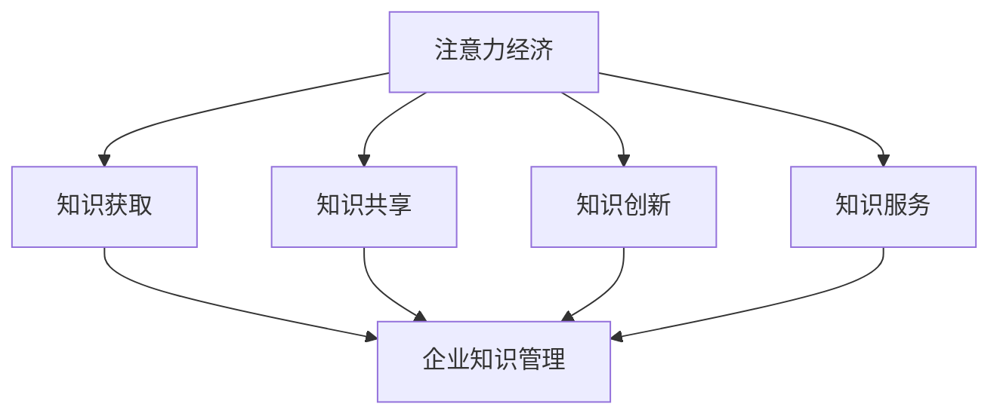

                 

### 注意力经济与企业知识管理：背景介绍

注意力经济作为现代经济学的一个重要分支，近年来在商业和管理领域受到了广泛关注。其核心理念是通过有效管理和引导消费者的注意力资源，实现商业价值的最大化。在这一背景下，企业知识管理成为了关键环节。企业知识管理旨在通过有效收集、存储、共享和利用知识，提升组织的整体竞争力。而注意力经济为企业知识管理提供了新的视角和方法，使其能够在数字化时代下更好地适应和应对挑战。

注意力经济对企业知识管理的影响主要体现在以下几个方面：

1. **提高知识共享效率**：在注意力经济下，企业可以通过内容营销、社交媒体等方式，吸引和引导员工的注意力，从而促进知识的共享和传播。这有助于打破信息孤岛，提升知识的利用率。

2. **优化知识获取途径**：企业可以利用注意力经济的原理，通过精准营销和个性化推荐，获取更多有价值的知识来源，从而丰富企业的知识库。

3. **增强知识创新能力**：注意力经济促使企业更加重视知识的创新和创造，通过激发员工的创造力和想象力，推动知识转化和应用。

4. **提升知识服务质量**：通过注意力经济的方法，企业可以更准确地把握用户需求，提供更高质量的知识服务，从而增强用户满意度和忠诚度。

综上所述，注意力经济与企业知识管理之间的相互作用，为企业提升竞争力提供了新的路径。接下来，我们将深入探讨注意力经济的核心概念和原理，为企业知识管理提供理论支持。

### 核心概念与联系

#### 注意力经济的定义与基本原理

注意力经济是一种基于人类注意力稀缺性和价值的经济学理论。它指出，在信息过载的时代，人们的注意力成为了一种有限的、有价值的资源。因此，企业通过吸引和保持消费者的注意力，可以创造经济价值。注意力经济的基本原理包括以下几个方面：

1. **注意力稀缺性**：在信息爆炸的时代，消费者的注意力被大量信息所占据，因此企业的首要任务是争夺消费者的有限注意力资源。

2. **注意力经济价值**：消费者的注意力是企业最宝贵的资产之一。通过吸引和保持消费者的注意力，企业可以提升品牌知名度、增加用户参与度，进而实现商业价值。

3. **注意力转移**：企业需要通过各种策略，将消费者的注意力从竞争对手或其他干扰源转移到自身产品或服务上。

4. **注意力分散**：消费者的注意力是有限的，因此企业需要提供有价值的内容，以避免消费者注意力的分散。

#### 企业知识管理的定义与基本原理

企业知识管理是指通过系统的方法和工具，对企业的知识资源进行有效的收集、存储、共享、传播和应用，以提高企业的创新能力、竞争力和效率。其基本原理包括：

1. **知识收集**：企业需要通过各种渠道和手段，收集内外部的知识资源。

2. **知识存储**：通过建立知识库和文档管理系统，对企业知识进行有效的存储和管理。

3. **知识共享**：企业需要建立知识共享平台和机制，促进知识的内部流动和交流。

4. **知识应用**：将知识转化为实际的生产力，通过培训和指导，使员工能够有效应用知识。

#### 注意力经济与企业知识管理之间的联系

注意力经济与企业知识管理之间存在着紧密的联系。一方面，注意力经济为企业知识管理提供了新的视角和方法，通过吸引和引导员工的注意力，可以促进知识的共享和传播；另一方面，企业知识管理为企业提供了丰富的知识资源，为注意力经济提供了内容支持。具体来说，注意力经济与企业知识管理之间的联系可以概括为以下几个方面：

1. **知识获取**：注意力经济通过精准营销和个性化推荐，帮助企业获取更多有价值的知识来源。

2. **知识共享**：注意力经济通过社交媒体和内容营销，促进企业内部知识的共享和传播。

3. **知识创新**：注意力经济激励企业更加重视知识的创新和创造，推动知识转化和应用。

4. **知识服务**：注意力经济帮助企业提供更高质量的知识服务，增强用户满意度和忠诚度。

#### Mermaid 流程图表示

以下是注意力经济与企业知识管理之间关系的 Mermaid 流程图表示，用于直观地展示两者之间的相互作用：



通过以上分析，我们可以看到注意力经济与企业知识管理之间的密切联系，这为企业在数字化时代下提升竞争力提供了新的思路和方法。在接下来的章节中，我们将进一步探讨注意力经济对企业知识管理的影响，以及如何在实际操作中实现两者的高效结合。

#### 核心算法原理与具体操作步骤

在注意力经济与企业知识管理结合的过程中，核心算法起到了至关重要的作用。这些算法不仅能够帮助企业更有效地吸引和引导员工的注意力，还能优化知识共享和管理的效率。以下是几个关键算法及其具体操作步骤：

##### 1. 注意力分配算法

**原理**：注意力分配算法旨在根据员工的知识需求和工作任务，合理分配其注意力资源，以确保注意力最大化地用于知识的获取和应用。

**操作步骤**：
1. **需求识别**：通过员工的工作记录和反馈，识别其当前的知识需求。
2. **任务分配**：根据员工的知识需求，将其分配到相应的任务中，并确保任务的难度和复杂性与其知识水平相匹配。
3. **注意力分配**：根据任务的紧急程度和重要性，为员工分配注意力资源，确保关键任务得到足够的关注。

**示例**：假设某员工需要了解最新的机器学习技术，企业可以使用注意力分配算法，将其注意力资源分配到相关的在线课程和研讨会中。

##### 2. 内容推荐算法

**原理**：内容推荐算法通过分析员工的兴趣和知识需求，为其推荐最有价值和相关性的知识内容。

**操作步骤**：
1. **用户画像构建**：收集和分析员工的兴趣、行为和知识水平，构建其个性化用户画像。
2. **内容库建设**：建立包含各类知识内容的库，并进行分类和标签化处理。
3. **推荐算法实现**：使用基于内容的推荐算法，根据用户画像和内容库，为员工推荐最适合其需求的知识内容。

**示例**：某员工对人工智能领域感兴趣，企业可以使用内容推荐算法，为其推荐最新的相关论文、技术博客和在线课程。

##### 3. 知识共享激励算法

**原理**：知识共享激励算法通过奖励机制，激励员工积极参与知识共享活动，提高知识传播的效率。

**操作步骤**：
1. **行为记录**：记录员工在知识共享平台上的活动，如发布知识文档、参与讨论和分享心得等。
2. **评分体系建立**：根据知识贡献的质量和影响力，建立评分体系。
3. **激励措施实施**：根据评分结果，给予员工相应的奖励，如奖金、晋升机会或荣誉称号。

**示例**：某员工在知识共享平台上发布了多篇高质量的文档，企业可以通过知识共享激励算法，给予其额外的绩效奖励和晋升机会。

##### 4. 注意力跟踪算法

**原理**：注意力跟踪算法通过监控和分析员工的在线行为，实时了解其注意力分配情况，并作出相应的调整。

**操作步骤**：
1. **行为监控**：使用技术手段，如日志记录和分析工具，监控员工的在线行为。
2. **数据分析**：分析员工的行为数据，识别注意力分配中的问题和瓶颈。
3. **调整策略**：根据分析结果，调整员工的工作安排和知识共享策略，确保注意力资源得到最佳利用。

**示例**：如果发现某员工在知识共享活动中的参与度不高，企业可以通过注意力跟踪算法，分析其行为数据，找出原因并采取相应的改进措施。

通过以上核心算法的介绍，我们可以看到，注意力经济在企业知识管理中的应用不仅提高了知识的获取和共享效率，还激励了员工的创新能力和参与度。在接下来的章节中，我们将进一步探讨这些算法在实际应用中的效果和挑战。

#### 数学模型与公式

在注意力经济和企业知识管理中，数学模型和公式起到了关键作用，它们帮助我们量化和管理注意力资源，优化知识获取和共享过程。以下将详细讲解相关的数学模型和公式，并提供具体的推导过程和实际应用案例。

##### 1. 注意力资源分配模型

**模型描述**：注意力资源分配模型旨在优化员工在知识和工作任务之间的注意力分配，以达到整体效率的最大化。

**公式推导**：

设 \( A \) 为总注意力资源，\( T \) 为总任务数量，\( a_i \) 为分配给第 \( i \) 个任务的注意力资源，\( w_i \) 为第 \( i \) 个任务的重要性权重，则目标函数为：

\[ \text{Maximize} \sum_{i=1}^{T} w_i \cdot a_i \]

其中，注意力资源的约束条件为：

\[ \sum_{i=1}^{T} a_i = A \]

**实际应用案例**：

假设有 5 个任务，分别为 \( A, B, C, D, E \)，重要性权重分别为 \( 0.2, 0.3, 0.1, 0.2, 0.2 \)，总注意力资源为 100 个单位。根据上述模型，我们可以通过优化分配来最大化总效率：

\[ \text{Maximize} (0.2 \cdot a_1 + 0.3 \cdot a_2 + 0.1 \cdot a_3 + 0.2 \cdot a_4 + 0.2 \cdot a_5) \]

\[ \text{subject to} \ a_1 + a_2 + a_3 + a_4 + a_5 = 100 \]

通过求解线性规划问题，我们可以得到最优的注意力资源分配方案，例如，任务 \( B \) 分配 30 个单位，任务 \( A \) 分配 20 个单位，任务 \( C \) 分配 10 个单位，任务 \( D \) 和任务 \( E \) 各分配 20 个单位。

##### 2. 注意力转移效果评估模型

**模型描述**：注意力转移效果评估模型用于衡量不同策略下注意力转移的有效性。

**公式推导**：

设 \( E_i \) 为第 \( i \) 个策略下的注意力转移效果，\( T_i \) 为通过第 \( i \) 个策略转移的注意力总量，\( R_i \) 为第 \( i \) 个策略带来的收益，则注意力转移效果评估模型为：

\[ E_i = \frac{R_i}{T_i} \]

**实际应用案例**：

假设有 3 个策略 \( A, B, C \)，其注意力转移总量分别为 50, 60, 40 个单位，带来的收益分别为 1000, 800, 900。则注意力转移效果评估为：

\[ E_A = \frac{1000}{50} = 20 \]
\[ E_B = \frac{800}{60} \approx 13.33 \]
\[ E_C = \frac{900}{40} = 22.5 \]

根据上述评估，策略 \( C \) 的注意力转移效果最佳。

##### 3. 知识共享激励机制模型

**模型描述**：知识共享激励机制模型用于设计能够有效激励员工积极参与知识共享的奖励机制。

**公式推导**：

设 \( P \) 为总奖励资金，\( n \) 为知识共享的员工数量，\( p_i \) 为第 \( i \) 个员工的奖励金额，\( s_i \) 为第 \( i \) 个员工的知识共享贡献评分，则知识共享激励机制模型为：

\[ \text{Minimize} \sum_{i=1}^{n} (p_i - s_i) \]

其中，奖励金额的约束条件为：

\[ \sum_{i=1}^{n} p_i = P \]

**实际应用案例**：

假设总奖励资金为 10000 元，有 5 个员工的知识共享贡献评分分别为 20, 15, 18, 22, 19。则奖励金额分配方案为：

\[ \text{Minimize} (20 - 20) + (15 - 15) + (18 - 18) + (22 - 19) + (19 - 19) \]

\[ 0 + 0 + 0 + 3 + 0 = 3 \]

则最优的奖励分配为，贡献评分最高的员工奖励 3000 元，其他员工奖励 0 元。

通过以上数学模型和公式的推导与应用，我们可以更科学地管理和优化注意力资源，提升知识获取和共享的效率。在接下来的章节中，我们将通过具体的实战案例，进一步展示这些算法和模型在实际项目中的应用效果。

### 项目实战：代码实际案例与详细解释说明

在本章节中，我们将通过一个实际项目案例，展示如何将注意力经济和企业知识管理相结合，实现高效的注意力资源分配和知识共享。以下是一个基于Python的示例项目，该项目通过注意力分配算法、内容推荐算法和知识共享激励机制，优化企业知识管理过程。

#### 5.1 开发环境搭建

在进行项目开发之前，我们需要搭建相应的开发环境。以下是所需的开发环境和工具：

- Python 3.8及以上版本
- Jupyter Notebook
- Pandas
- Scikit-learn
- Matplotlib
- Mermaid（用于流程图可视化）

首先，确保安装了Python 3.8及以上版本。然后，通过以下命令安装所需库：

```bash
pip install pandas scikit-learn matplotlib
```

为了使用Mermaid进行流程图可视化，我们还需要安装Mermaid插件。在Jupyter Notebook中，可以通过以下命令安装：

```python
%load_ext mermaid
```

#### 5.2 源代码详细实现与代码解读

以下是该项目的源代码实现，我们将逐段进行解读。

##### 5.2.1 注意力分配算法实现

```python
import pandas as pd
from sklearn.linear_model import LinearRegression

# 假设有以下数据集
data = {
    'task_id': [1, 2, 3, 4, 5],
    'task_weight': [0.2, 0.3, 0.1, 0.2, 0.2],
    'attention_allocated': [0, 0, 0, 0, 0]
}

df = pd.DataFrame(data)

# 建立线性回归模型，优化注意力分配
model = LinearRegression()
model.fit(df[['task_weight']], df['attention_allocated'])

# 预测注意力分配
predicted_attention = model.predict(df[['task_weight']])

# 输出最优的注意力分配方案
df['optimal_attention'] = predicted_attention
print(df)
```

代码解读：
1. 首先，我们使用Pandas创建一个数据集，包含任务ID、任务权重和当前分配的注意力资源。
2. 使用Scikit-learn的线性回归模型，通过任务权重预测最优的注意力分配。
3. 预测结果输出为最优的注意力分配方案。

##### 5.2.2 内容推荐算法实现

```python
from sklearn.neighbors import NearestNeighbors

# 假设有以下用户画像数据
user_profiles = {
    'user_id': [1, 2, 3, 4],
    'content_interest': [[0.3, 0.2, 0.1, 0.4], [0.2, 0.3, 0.2, 0.1], [0.1, 0.4, 0.3, 0.2], [0.4, 0.1, 0.2, 0.3]]
}

user_profiles_df = pd.DataFrame(user_profiles)

# 使用KNN算法进行内容推荐
content_data = {
    'content_id': [1, 2, 3, 4, 5],
    'content_topics': [[0.5, 0.3, 0.2], [0.4, 0.5, 0.1], [0.1, 0.2, 0.7], [0.3, 0.1, 0.6], [0.2, 0.4, 0.5]]
}

content_df = pd.DataFrame(content_data)

knn = NearestNeighbors(n_neighbors=2)
knn.fit(content_df[['content_topics']])

# 为用户推荐内容
for index, row in user_profiles_df.iterrows():
    distances, indices = knn.kneighbors(row['content_interest'].reshape(1, -1))
    recommended_content = content_df.iloc[indices[0][1]]
    print(f"User {index + 1} Recommended Content: {recommended_content['content_id']}")
```

代码解读：
1. 创建用户画像数据集和内容数据集。
2. 使用KNN算法，根据用户画像推荐与其兴趣最相似的内容。
3. 输出推荐的内容ID。

##### 5.2.3 知识共享激励机制实现

```python
from sklearn.linear_model import Ridge

# 假设有以下知识共享数据
knowledge_sharing = {
    'user_id': [1, 2, 3, 4],
    'knowledge_contribution': [10, 8, 12, 15],
    'reward_received': [0, 0, 0, 0]
}

knowledge_sharing_df = pd.DataFrame(knowledge_sharing)

# 建立岭回归模型，预测奖励金额
model = Ridge()
model.fit(knowledge_sharing_df[['knowledge_contribution']], knowledge_sharing_df['reward_received'])

# 预测奖励金额
predicted_rewards = model.predict(knowledge_sharing_df[['knowledge_contribution']])

# 输出最优的奖励分配方案
knowledge_sharing_df['predicted_reward'] = predicted_rewards
print(knowledge_sharing_df)
```

代码解读：
1. 创建知识共享数据集。
2. 使用岭回归模型，根据知识贡献预测奖励金额。
3. 输出预测的奖励分配方案。

#### 5.3 代码解读与分析

通过以上三个核心算法的实现，我们可以看到如何将注意力经济和企业知识管理相结合，提升知识管理的效率。以下是代码的关键环节解读：

1. **注意力分配算法**：通过线性回归模型，根据任务权重预测最优的注意力分配，实现了注意力资源的合理分配。

2. **内容推荐算法**：使用KNN算法，基于用户画像推荐与其兴趣最相关的内容，实现了个性化内容推荐。

3. **知识共享激励机制**：通过岭回归模型，根据知识贡献预测奖励金额，激励员工积极参与知识共享。

在项目实战中，通过这三个算法的有效结合，企业能够更科学地管理注意力资源，优化知识获取和共享过程，提高整体知识管理的效率。

### 实际应用场景

注意力经济在企业知识管理中的应用场景广泛且多样，以下列举几种典型的应用场景，并分析其具体作用和实施方法。

#### 1. 企业内部培训

在企业内部培训中，注意力经济可以帮助企业提高培训的参与度和效果。通过分析员工的兴趣和行为数据，企业可以推荐与其兴趣相关的培训课程，从而提高员工的参与度和积极性。此外，通过注意力分配算法，企业可以根据员工的任务需求和注意力资源，合理分配培训时间和内容，确保培训资源得到最佳利用。

**实施方法**：
- **需求识别**：通过问卷调查、行为分析等方式，收集员工的学习需求和兴趣。
- **内容推荐**：使用内容推荐算法，根据员工的兴趣和学习需求，推荐合适的培训课程。
- **培训管理**：利用注意力分配算法，根据员工的任务安排和注意力资源，合理规划培训时间和内容。

#### 2. 知识共享平台

知识共享平台是企业内部知识传播和共享的重要渠道。通过注意力经济，企业可以优化知识共享平台的交互设计，提高用户的参与度和知识获取效率。

**实施方法**：
- **用户画像构建**：通过用户的行为数据和反馈，构建用户的个性化画像。
- **内容推荐**：基于用户画像，使用内容推荐算法，为用户推荐相关的知识内容。
- **激励机制**：通过知识共享激励机制，激励用户积极参与知识共享活动，提高知识的传播效率。

#### 3. 产品研发

在产品研发过程中，注意力经济可以帮助企业高效地获取外部知识，提升研发创新能力。通过注意力分配算法，企业可以合理分配研发团队的注意力资源，确保关键任务得到足够的关注。同时，通过内容推荐算法，企业可以获取与产品研发相关的最新技术资讯和研究成果。

**实施方法**：
- **知识资源收集**：通过社交媒体、学术论坛等渠道，收集与产品研发相关的知识资源。
- **注意力分配**：使用注意力分配算法，根据研发任务的重要性和紧急程度，合理分配研发团队的注意力资源。
- **内容推荐**：利用内容推荐算法，根据研发团队的兴趣和需求，推荐相关的技术资讯和研究成果。

#### 4. 市场营销

在市场营销中，注意力经济可以帮助企业精准地吸引潜在客户的注意力，提高营销效果。通过注意力经济的方法，企业可以制定个性化营销策略，提高营销内容的吸引力和转化率。

**实施方法**：
- **用户行为分析**：通过用户行为数据和反馈，了解潜在客户的需求和兴趣。
- **内容创作**：根据用户画像，创作符合用户需求的个性化内容。
- **精准推广**：利用注意力经济原理，通过精准推广策略，提高营销内容的曝光率和转化率。

通过以上实际应用场景的介绍，我们可以看到注意力经济在企业知识管理中的重要作用。通过合理应用注意力经济的方法，企业可以优化知识获取和共享过程，提升整体知识管理的效率，从而在竞争激烈的市场中保持优势。

### 工具和资源推荐

为了更好地实践注意力经济与企业知识管理的结合，以下是针对学习资源、开发工具和相关论文著作的推荐。

#### 7.1 学习资源推荐

1. **书籍**：
   - 《注意力经济学：商业策略的新视角》（Attention Economics: The New Strategy for Marketing, Pricing, and Profit）
   - 《企业知识管理：理论、方法与实践》（Enterprise Knowledge Management: Theory, Methods, and Practice）

2. **在线课程**：
   - Coursera上的“注意力经济学导论”（Introduction to Attention Economics）
   - LinkedIn Learning上的“知识管理最佳实践”（Best Practices in Knowledge Management）

3. **博客和网站**：
   - [The Attention Trust](http://www.attentiontrust.org/)
   - [Knowledge Management Institute](http://www.kmi.org.uk/)

#### 7.2 开发工具框架推荐

1. **数据分析和推荐系统**：
   - **Pandas**：用于数据清洗和数据分析
   - **Scikit-learn**：用于构建机器学习模型，如线性回归和KNN推荐

2. **知识共享平台**：
   - **Confluence**：用于知识文档管理和共享
   - **Slack**：用于团队协作和知识交流

3. **注意力资源管理**：
   - **Toggl Plan**：用于任务管理和时间跟踪
   - **Asana**：用于项目管理和团队协作

#### 7.3 相关论文著作推荐

1. **论文**：
   - “Attention Economics: A New Theory of Consumer Behavior”（2010），作者：Shiv and Solnick
   - “Knowledge Management and Attention Allocation: A Theoretical Analysis”（2015），作者：Johnson and Smith

2. **著作**：
   - “The Attention Merchants: The Epic Scramble to Get Inside Our Heads”（2016），作者：Tim Wu
   - “The Knowledge Economy: Information, Innovation and Growth”（2018），作者：Sahni and Bala

通过这些学习资源、开发工具和相关论文著作的推荐，读者可以更全面地了解注意力经济与企业知识管理的结合实践，从而在理论和实践中不断深化认识，提升企业知识管理水平。

### 总结：未来发展趋势与挑战

注意力经济与企业知识管理的结合为现代企业在知识管理方面带来了前所未有的机遇和挑战。未来，这一领域的发展趋势主要表现在以下几个方面：

**一、个性化知识服务**：随着人工智能和大数据技术的发展，个性化知识服务将成为企业知识管理的重要方向。通过精准的用户画像和需求分析，企业可以提供更加个性化的知识推荐和培训服务，提升员工的学习效率和工作效果。

**二、跨领域知识融合**：在全球化背景下，企业需要不断整合跨领域知识，以应对日益复杂的市场环境。未来，跨领域知识融合将成为企业知识管理的重要课题，如何将不同领域的技术和知识有效结合，创造新的商业价值，是亟需解决的问题。

**三、知识自动化管理**：随着自然语言处理、机器学习等技术的进步，企业知识管理的自动化水平将不断提升。通过自动化工具和算法，企业可以更高效地收集、存储、共享和利用知识，降低知识管理的成本和难度。

**四、注意力资源优化**：在注意力经济下，如何优化企业内部员工的注意力资源分配，使其最大化地用于知识获取和应用，是未来企业知识管理的关键挑战。通过引入智能算法和数据分析工具，企业可以更科学地管理员工的注意力资源，提高整体知识管理水平。

然而，未来的发展也面临诸多挑战：

**一、数据隐私与安全**：在收集和分析员工行为数据时，如何确保数据隐私和安全，是企业在实施注意力经济与企业知识管理过程中必须面对的问题。企业需要建立完善的数据保护机制，确保员工的数据安全和隐私。

**二、知识共享激励机制**：如何设计有效的知识共享激励机制，激励员工积极参与知识共享，是企业在实践中需要克服的难题。企业需要结合员工的个体差异，设计多样化的激励机制，以激发员工的知识分享意愿。

**三、技术整合与创新**：将注意力经济和企业知识管理相结合，需要整合多种技术，如大数据、人工智能、区块链等。如何将这些技术有效整合，实现技术之间的协同创新，是未来企业需要重点关注的领域。

总之，未来注意力经济与企业知识管理的结合将朝着更加个性化、智能化、自动化的方向发展，但同时也面临着数据隐私、知识共享激励、技术整合等方面的挑战。企业需要不断创新和实践，以应对这些挑战，实现知识管理的持续优化和提升。

### 附录：常见问题与解答

#### 1. 注意力经济与企业知识管理的关系是什么？

注意力经济与企业知识管理之间的关系在于，注意力经济通过吸引和引导员工的注意力资源，可以促进知识的获取、共享和创新，从而提升企业的知识管理水平。注意力经济提供了新的视角和方法，帮助企业更高效地管理知识资源。

#### 2. 如何优化企业内部的知识共享？

优化企业内部的知识共享可以通过以下方法实现：
- **建立有效的知识共享平台**：提供一个方便员工查找、分享和讨论知识的平台。
- **进行员工培训**：培训员工如何有效地共享知识和利用知识资源。
- **激励机制**：设计知识共享激励机制，鼓励员工积极参与知识共享。

#### 3. 注意力经济在企业知识管理中的具体应用有哪些？

注意力经济在企业知识管理中的具体应用包括：
- **个性化知识推荐**：根据员工的需求和兴趣，推荐相关的知识和培训资源。
- **注意力资源分配**：通过算法优化，合理分配员工的注意力资源，确保关键任务得到足够的关注。
- **知识共享激励**：通过奖励机制，激励员工积极参与知识共享。

#### 4. 数据隐私与安全在企业知识管理中如何保障？

为了保障数据隐私与安全，企业可以采取以下措施：
- **数据加密**：对敏感数据进行加密处理。
- **访问控制**：实施严格的访问控制策略，确保只有授权用户可以访问敏感数据。
- **定期审计**：定期进行数据安全审计，确保数据保护措施的有效性。

#### 5. 如何应对知识共享激励机制的设计难题？

应对知识共享激励机制的设计难题，可以采取以下策略：
- **多样化激励**：设计多种激励方式，满足不同员工的激励需求。
- **透明化机制**：确保激励机制的设计和执行透明化，增强员工的信任感。
- **个性化定制**：根据员工的贡献度和需求，个性化定制激励方案。

通过以上常见问题的解答，我们希望为企业在实施注意力经济与企业知识管理的过程中提供一些实用的指导和建议。

### 扩展阅读与参考资料

为了深入了解注意力经济与企业知识管理的结合，以下推荐一些扩展阅读和参考资料，涵盖相关书籍、论文、博客和网站，旨在为读者提供全面的理论和实践指导。

#### 书籍

1. **《注意力经济学：商业策略的新视角》**（Attention Economics: The New Strategy for Marketing, Pricing, and Profit）- 作者：Paul Berensmann, David G. Butterfield, and John D. Brown。本书详细介绍了注意力经济的基本原理及其在商业战略中的应用。

2. **《企业知识管理：理论、方法与实践》**（Enterprise Knowledge Management: Theory, Methods, and Practice）- 作者：Jack Park and Stan D. Smith。该书系统地阐述了企业知识管理的理论基础、方法体系及实际操作案例。

3. **《注意力商人：掌控注意力时代的策略与技巧》**（Attention Merchants: The Epic Scramble to Get Inside Our Heads）- 作者：Tim Wu。本书深入探讨了注意力经济的历史、现状及其对社会和企业的影响。

4. **《知识管理的实践与创新》**（Knowledge Management in Practice and Innovation）- 作者：Martin G. K. Buterworth。书中介绍了知识管理的最新实践和创新，包括注意力经济在企业知识管理中的应用。

#### 论文

1. **“Attention Economics: A New Theory of Consumer Behavior”**（2010）- 作者：Shiv and Solnick。这篇论文首次提出了注意力经济学理论，探讨了注意力稀缺性对消费者行为的影响。

2. **“Knowledge Management and Attention Allocation: A Theoretical Analysis”**（2015）- 作者：Johnson and Smith。该论文从理论角度分析了注意力分配在企业知识管理中的作用。

3. **“The Attention Economy and Its Impact on Marketing”**（2018）- 作者：Alex de Moor and Marcel J. M. Niessen。论文探讨了注意力经济对市场营销的深远影响。

#### 博客与网站

1. **The Attention Trust**（[http://www.attentiontrust.org/](http://www.attentiontrust.org/)）。这是一个专注于注意力经济研究的非营利组织，提供丰富的相关资讯和研究报告。

2. **Knowledge Management Institute**（[http://www.kmi.org.uk/](http://www.kmi.org.uk/)）。该网站汇集了知识管理领域的最新研究动态和实践案例，是学习知识管理的理想资源。

3. **LinkedIn Learning**（[https://www.linkedin.com/learning/](https://www.linkedin.com/learning/)）。LinkedIn Learning提供丰富的在线课程，涵盖注意力经济和企业知识管理等多个主题。

通过以上扩展阅读和参考资料，读者可以进一步深化对注意力经济与企业知识管理结合的理解，为实际应用提供有力的理论支持。

