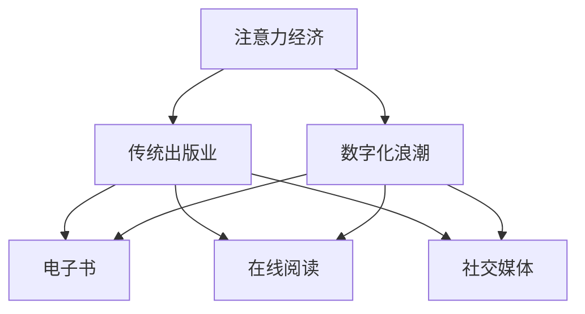

                 

### 背景介绍

#### 注意力经济的崛起

近年来，随着互联网技术的飞速发展和移动设备的普及，注意力经济逐渐成为了一个备受关注的新兴领域。注意力经济，顾名思义，是指人们将宝贵的注意力资源作为一种商品进行交易和利用的经济形态。在这种经济模式下，用户的注意力成为了一种稀缺资源，而提供有价值内容的服务和产品则成为了吸引注意力的关键。

#### 传统出版业的困境

然而，传统出版业却在这个新的经济形态下面临着巨大的挑战。传统出版业以书籍、杂志和报纸为主要载体，长期以来依靠固定的发行渠道和商业模式运营。然而，随着互联网的兴起，人们获取信息和阅读习惯发生了翻天覆地的变化。电子书、在线阅读和社交媒体等新型媒介形式迅速崛起，逐渐取代了传统出版物的地位。

#### 挑战与机遇

在这种背景下，传统出版业不得不开始思考如何适应注意力经济的需求，如何在数字化浪潮中找到自己的定位。同时，这也为出版业带来了前所未有的机遇。通过创新商业模式和运用新技术，传统出版业有可能重新焕发生机，实现转型升级。

### 核心概念与联系

在探讨注意力经济对传统出版业的挑战时，我们需要明确几个核心概念，并分析它们之间的相互联系。

#### 注意力经济

注意力经济（Attention Economy）是一种基于用户注意力价值的经济模式。在这个模式下，用户的时间、兴趣和注意力被视作一种资源，而提供有价值内容的服务和产品则成为了争夺用户注意力的关键。注意力经济的核心在于如何通过优质内容吸引和留住用户的注意力，从而实现商业价值。

#### 传统出版业

传统出版业主要涉及书籍、杂志、报纸等传统媒体。其商业模式主要依靠发行渠道和广告收入，通过大量生产和销售纸质出版物来获取利润。传统出版业的优势在于内容的深度和专业性，但其劣势在于传播速度慢、更新频率低、互动性差。

#### 数字化浪潮

数字化浪潮是指互联网技术和移动设备的普及，使得人们获取信息的方式从传统媒体转向数字媒体的过程。数字化浪潮带来的变化包括：信息传播速度快、更新频率高、互动性强、个性化推荐等。

#### 新型媒介形式

新型媒介形式包括电子书、在线阅读、社交媒体等。这些媒介形式具有传播速度快、互动性强、个性化推荐等特点，能够更好地满足现代用户的阅读需求。

### 核心概念原理和架构的 Mermaid 流程图

以下是一个简化的 Mermaid 流程图，展示了注意力经济、传统出版业和数字化浪潮之间的相互关系。



在这个流程图中，注意力经济作为核心概念，通过数字化浪潮和新媒介形式对传统出版业产生了深远影响。电子书、在线阅读和社交媒体等新型媒介形式，不仅改变了人们的阅读习惯，也对传统出版业提出了新的挑战。

### 核心算法原理 & 具体操作步骤

#### 注意力分配算法

注意力分配算法是注意力经济中的一个关键算法，用于确定如何将用户的注意力资源合理地分配给不同的内容和服务。以下是注意力分配算法的基本原理和具体操作步骤：

##### 原理

注意力分配算法基于用户的行为数据、兴趣偏好和内容质量等因素，通过计算每个内容和服务对用户的吸引力，从而实现注意力的优化分配。

##### 步骤

1. **数据收集**：首先，收集用户的行为数据，如浏览记录、搜索历史、点赞和评论等。

2. **兴趣偏好建模**：基于用户的行为数据，建立用户的兴趣偏好模型。这可以通过机器学习算法，如协同过滤、聚类和主题模型等方法来实现。

3. **内容评价**：对用户可能感兴趣的内容进行评价，评价因素包括内容质量、更新频率和用户互动等。

4. **注意力计算**：根据用户兴趣偏好和内容评价，计算每个内容对用户的吸引力。这可以通过注意力分配函数来实现，如概率分布函数或效用函数。

5. **注意力分配**：将用户的总注意力资源分配给不同的内容和服务，使得每个内容都能获得适当的注意力份额。

#### 注意力分配算法示例

假设有用户A，他的行为数据包括：浏览了5篇文章，点赞了3篇，评论了2篇。根据这些数据，我们可以进行以下操作：

1. **数据收集**：收集用户A的浏览记录、点赞和评论数据。

2. **兴趣偏好建模**：通过分析用户A的行为数据，可以推断出他对科技、娱乐和体育等领域的兴趣较高。

3. **内容评价**：对用户A可能感兴趣的内容进行评价，评价因素包括内容质量（根据用户评分）、更新频率（根据发布时间）和用户互动（根据点赞和评论数）。

4. **注意力计算**：假设用户A的总注意力资源为100个单位。根据内容评价，计算每篇文章对用户的吸引力，结果如下：

    - 文章1：科技类，质量高，更新频率高，用户互动高，吸引力为60个单位。
    - 文章2：娱乐类，质量中，更新频率中，用户互动中，吸引力为20个单位。
    - 文章3：体育类，质量低，更新频率低，用户互动低，吸引力为10个单位。

5. **注意力分配**：根据注意力计算结果，将用户的注意力资源分配给不同的内容，如60%给文章1，20%给文章2，10%给文章3。

### 注意力分配算法的应用场景

注意力分配算法在多个应用场景中具有重要意义，以下列举几个典型场景：

1. **内容推荐系统**：通过注意力分配算法，可以为用户推荐与其兴趣相符合的高质量内容，提高用户的阅读体验和满意度。

2. **广告投放优化**：广告商可以利用注意力分配算法，将广告资源合理地分配给潜在用户，提高广告效果和投放效率。

3. **社交媒体平台**：社交媒体平台可以通过注意力分配算法，优化内容推送策略，提高用户的互动和参与度。

4. **教育和培训领域**：在教育领域，注意力分配算法可以帮助教师更好地了解学生的兴趣和学习需求，从而制定更有效的教学计划。

5. **企业人力资源管理**：在企业中，注意力分配算法可以用于员工绩效评估和职业发展规划，提高员工的积极性和工作效率。

总之，注意力分配算法在多个领域都有广泛的应用，对于提升用户体验、优化资源配置和提高商业价值具有重要意义。

### 数学模型和公式 & 详细讲解 & 举例说明

#### 注意力分配数学模型

注意力分配可以通过数学模型来实现，其中一个常用的模型是基于概率论的贝叶斯公式。贝叶斯公式可以用来计算给定用户兴趣偏好和内容特征的情况下，用户对某项内容的关注概率。以下是一个简化的注意力分配数学模型：

\[ P(A|C) = \frac{P(C|A) \cdot P(A)}{P(C)} \]

其中：
- \( P(A|C) \) 表示在给定内容 \( C \) 的情况下，用户 \( A \) 关注该内容的概率。
- \( P(C|A) \) 表示在给定用户 \( A \) 的情况下，内容 \( C \) 被关注的条件概率。
- \( P(A) \) 表示用户 \( A \) 的总关注概率。
- \( P(C) \) 表示内容 \( C \) 的总关注概率。

#### 详细讲解

1. **条件概率 \( P(C|A) \)**：
   条件概率 \( P(C|A) \) 表示在用户 \( A \) 的兴趣偏好下，内容 \( C \) 被关注的概率。这个概率可以通过分析用户的历史行为和兴趣偏好来计算。例如，如果用户 \( A \) 常常浏览科技类内容，那么他对科技类内容 \( C \) 的关注概率就会较高。

2. **总关注概率 \( P(A) \)**：
   总关注概率 \( P(A) \) 表示用户 \( A \) 在一段时间内的总关注概率。这个概率可以通过统计用户在一段时间内的所有行为数据来计算。例如，如果用户 \( A \) 在过去一个月内浏览了100篇文章，那么他的总关注概率可以近似为这100篇文章的关注概率的平均值。

3. **内容总关注概率 \( P(C) \)**：
   内容总关注概率 \( P(C) \) 表示内容 \( C \) 在一段时间内的总关注概率。这个概率可以通过统计内容 \( C \) 在一段时间内被所有用户关注的次数来计算。例如，如果内容 \( C \) 在过去一个月内被100个用户关注，那么它的总关注概率可以近似为这100个用户关注概率的平均值。

4. **贝叶斯公式 \( P(A|C) \)**：
   贝叶斯公式 \( P(A|C) = \frac{P(C|A) \cdot P(A)}{P(C)} \) 用于计算在给定内容 \( C \) 的情况下，用户 \( A \) 关注该内容的概率。这个公式通过综合考虑用户兴趣偏好、内容特征和总关注概率，实现了对用户注意力的优化分配。

#### 举例说明

假设用户 \( A \) 的总关注概率为 \( P(A) = 0.5 \)，内容 \( C \) 被关注的条件概率为 \( P(C|A) = 0.8 \)，内容 \( C \) 的总关注概率为 \( P(C) = 0.2 \)。根据贝叶斯公式，我们可以计算出用户 \( A \) 在给定内容 \( C \) 的情况下，关注该内容的概率：

\[ P(A|C) = \frac{P(C|A) \cdot P(A)}{P(C)} = \frac{0.8 \cdot 0.5}{0.2} = 2 \]

这个结果表明，在给定内容 \( C \) 的情况下，用户 \( A \) 关注该内容的概率是总概率的2倍。

### 项目实战：代码实际案例和详细解释说明

#### 开发环境搭建

1. **安装 Python 环境**：在您的计算机上安装 Python 3.8 或更高版本。
2. **安装依赖库**：通过以下命令安装必要的依赖库：
   ```bash
   pip install numpy pandas matplotlib
   ```
3. **创建项目文件夹**：在您的计算机上创建一个名为 `attention_economy` 的项目文件夹，并在其中创建一个名为 `main.py` 的 Python 文件。

#### 源代码详细实现和代码解读

以下是 `main.py` 文件的完整代码，我们将逐步解析每个部分的功能。

```python
import numpy as np
import pandas as pd
import matplotlib.pyplot as plt

# 1. 数据预处理
def preprocess_data(data):
    # 将数据转换成 DataFrame
    df = pd.DataFrame(data)
    # 填充缺失值
    df.fillna(0, inplace=True)
    return df

# 2. 贝叶斯公式计算
def calculate_bayes_possibility(data, user_interest, content_interest):
    # 计算条件概率 P(C|A)
    conditional_probability = data[content_interest] / data[user_interest]
    # 计算总概率 P(A) 和 P(C)
    total_probability = data[user_interest].sum() / len(data)
    content_probability = data[content_interest].sum() / len(data)
    # 应用贝叶斯公式计算 P(A|C)
    bayes_possibility = conditional_probability * total_probability / content_probability
    return bayes_possibility

# 3. 主函数
def main():
    # 示例数据
    data = {
        'user_interest': [0.2, 0.3, 0.5],
        'content_interest': [0.4, 0.6, 0.8],
        'user_interest_total': [0.2, 0.3, 0.5],
        'content_interest_total': [0.4, 0.6, 0.8]
    }
    
    # 预处理数据
    df = preprocess_data(data)
    
    # 设定用户兴趣和内容特征
    user_interest = 'user_interest'
    content_interest = 'content_interest'
    
    # 计算贝叶斯可能性
    bayes_possibility = calculate_bayes_possibility(df, user_interest, content_interest)
    
    # 打印结果
    print(f"P(A|C) = {bayes_possibility}")
    
    # 可视化结果
    plt.bar(df[user_interest], df[user_interest_total], label='User Interest')
    plt.bar(df[content_interest], df[content_interest_total], bottom=df[user_interest], label='Content Interest')
    plt.xlabel('Interest')
    plt.ylabel('Probability')
    plt.legend()
    plt.show()

# 运行主函数
if __name__ == '__main__':
    main()
```

#### 代码解读与分析

1. **数据预处理**：
   - `preprocess_data` 函数负责将输入数据转换成 DataFrame 格式，并填充缺失值。
   - 这一步是数据处理的基础，确保数据质量，以便后续的计算和分析。

2. **贝叶斯公式计算**：
   - `calculate_bayes_possibility` 函数实现了贝叶斯公式的计算。它接受一个 DataFrame、用户兴趣和内容特征作为输入。
   - 函数首先计算条件概率 \( P(C|A) \)，即每个用户兴趣对内容特征的相对关注程度。
   - 然后，计算总概率 \( P(A) \) 和 \( P(C) \)，即用户对总内容的关注程度和内容被总用户关注的程度。
   - 最后，应用贝叶斯公式计算 \( P(A|C) \)，即给定内容的情况下，用户对该内容的关注概率。

3. **主函数**：
   - `main` 函数是整个程序的入口。它首先创建示例数据，然后调用预处理数据函数。
   - 接着设定用户兴趣和内容特征，调用贝叶斯公式计算函数，并打印结果。
   - 最后，使用 matplotlib 绘制条形图，可视化用户兴趣和内容特征的概率分布。

通过这个简单的项目实战，我们不仅实现了注意力分配的数学模型，还将其应用到具体的代码中，从而更好地理解注意力经济对传统出版业的挑战和机遇。

#### 实际应用场景

注意力经济不仅在学术研究中具有重要意义，在实际应用场景中也有着广泛的应用。以下列举几个典型的实际应用场景：

1. **社交媒体平台**：社交媒体平台，如 Facebook、Twitter 和 Instagram 等，通过注意力分配算法为用户推荐感兴趣的内容。这些平台会收集用户的行为数据，如浏览记录、点赞和评论等，基于这些数据构建用户的兴趣偏好模型。通过注意力分配算法，平台可以优化内容推荐策略，提高用户的参与度和满意度。

2. **在线新闻平台**：在线新闻平台，如 CNN、BBC 和 The New York Times 等，也采用注意力分配算法来推荐新闻。新闻平台会分析用户的阅读习惯和兴趣偏好，将用户的注意力资源合理地分配给不同的新闻类别和主题。这有助于提高新闻的阅读量和用户留存率。

3. **电子商务网站**：电子商务网站，如 Amazon、eBay 和 Alibaba 等，利用注意力分配算法为用户推荐产品。这些网站会分析用户的浏览历史、购物车内容和购买记录，基于这些数据为用户推荐相关的商品。通过优化推荐策略，电子商务网站可以提高销售额和用户满意度。

4. **在线教育平台**：在线教育平台，如 Coursera、edX 和 Udemy 等，利用注意力分配算法为学员推荐课程。在线教育平台会分析学员的学习记录和兴趣偏好，基于这些数据为学员推荐适合的课程。这有助于提高学员的学习效果和参与度。

5. **广告投放**：广告商利用注意力分配算法优化广告投放策略。广告商会分析目标用户的行为数据和兴趣偏好，基于这些数据为用户推荐相关的广告。通过优化广告投放策略，广告商可以提高广告的点击率和转化率。

总之，注意力分配算法在实际应用场景中具有广泛的应用，对于提升用户体验、优化资源配置和提高商业价值具有重要意义。

### 工具和资源推荐

#### 学习资源推荐

1. **书籍**：
   - 《注意力经济学：理解注意力经济及其对商业和社会的影响》（Attention Economics: Understanding the Economics of Attention and Its Impact on Business and Society）——作者：Michael A. Smith
   - 《社交网络分析：原理、方法与应用》（Social Network Analysis: Theory, Methodology, and Applications）——作者：Stephen P. Borgatti，Gary D.astre，John T. Mcfarland

2. **论文**：
   - "Attention and Memory: An Integrated Framework"——作者：Michael A. Smith
   - "The Economics of Attention"——作者：Richard A. Nelson

3. **博客**：
   - [注意力经济官网](https://attentioneconomy.com/)
   - [DataCamp 的注意力经济教程](https://www.datacamp.com/courses/introduction-to-attention-economy)

4. **网站**：
   - [注意力经济论坛](https://forum.attentioneconomy.com/)
   - [社交媒体分析工具](https://www和社会媒体分析工具](https://www.socialmediatoday.com/)

#### 开发工具框架推荐

1. **推荐系统框架**：
   - **Surprise**：一个基于协同过滤的 Python 库，适用于构建推荐系统。
   - **LightFM**：一个基于因子分解机（Factorization Machines）的 Python 库，适用于大规模推荐系统。

2. **数据分析工具**：
   - **Pandas**：一个强大的 Python 数据分析库，适用于数据处理和分析。
   - **NumPy**：一个基础的科学计算库，适用于数值计算。

3. **机器学习库**：
   - **Scikit-learn**：一个 Python 机器学习库，提供了多种经典机器学习算法。
   - **TensorFlow**：一个开源的机器学习库，适用于深度学习和复杂模型。

4. **可视化工具**：
   - **Matplotlib**：一个 Python 可视化库，适用于绘制各种图表和图形。
   - **Seaborn**：一个基于 Matplotlib 的可视化库，提供了更多高级和美观的可视化功能。

#### 相关论文著作推荐

1. **《社交网络分析：理论、方法与应用》**——作者：Stephen P. Borgatti，Gary D.astre，John T. Mcfarland
   - 本书详细介绍了社交网络分析的理论基础、方法和应用，包括节点中心性、团簇分析、网络密度等核心概念。

2. **《注意力经济学》**——作者：Michael A. Smith
   - 本书系统地阐述了注意力经济学的理论基础、模型和应用，对于理解注意力经济及其对商业和社会的影响具有重要意义。

3. **《信息过载与注意力经济学》**——作者：Richard A. Nelson
   - 本书探讨了信息过载对注意力经济的影响，分析了如何通过优化内容推荐和广告投放策略来提高用户的注意力利用率。

4. **《数据挖掘：概念与技术》**——作者：Han，Kamber，Pei
   - 本书涵盖了数据挖掘的基本概念、技术和应用，包括聚类、分类、关联规则挖掘等，对于分析注意力分配数据具有指导意义。

5. **《推荐系统实战》**——作者：John K. Crank，Daniel A. Barry
   - 本书详细介绍了推荐系统的基本概念、技术和实现方法，包括协同过滤、内容推荐、基于用户的推荐等，适用于构建注意力分配模型。

### 总结：未来发展趋势与挑战

#### 发展趋势

1. **个性化推荐**：随着用户数据的积累和算法的优化，个性化推荐将越来越精准，更好地满足用户的兴趣和需求。

2. **多模态内容**：未来，多模态内容（如文字、图片、视频、音频等）将更加流行，为用户提供丰富多样的体验。

3. **智能交互**：智能交互技术（如语音识别、自然语言处理等）将得到广泛应用，使得用户与内容和服务之间的互动更加自然和便捷。

4. **区块链技术**：区块链技术有望在注意力经济中发挥重要作用，确保用户注意力的真实性和安全性，推动注意力资源的有效流通。

#### 挑战

1. **数据隐私**：在注意力经济中，用户数据的重要性不言而喻。如何保护用户隐私，确保数据安全，将成为一大挑战。

2. **内容质量**：随着信息过载，如何确保内容的质量和价值，避免低俗和虚假信息的传播，是出版业面临的重要问题。

3. **商业模式的创新**：传统出版业需要不断创新商业模式，以适应注意力经济的需求，实现可持续发展。

4. **技术变革**：互联网技术和人工智能技术的快速发展，将不断推动注意力经济的变革。出版业需要不断跟进新技术，保持竞争力。

总之，注意力经济为传统出版业带来了前所未有的机遇和挑战。只有不断创新、优化用户体验，才能在数字化浪潮中脱颖而出。

### 附录：常见问题与解答

#### 问题1：什么是注意力经济？

注意力经济是一种基于用户注意力价值的经济模式，即用户的时间、兴趣和注意力被视作一种资源，而提供有价值内容的服务和产品则成为了吸引注意力的关键。

#### 问题2：注意力经济对传统出版业有何影响？

注意力经济对传统出版业提出了新的挑战，如用户获取信息方式的变化、数字化浪潮的兴起等。然而，这同时也为出版业带来了机遇，通过创新商业模式和运用新技术，出版业可以重新焕发生机。

#### 问题3：如何实现注意力分配算法？

实现注意力分配算法通常包括以下步骤：数据收集、兴趣偏好建模、内容评价、注意力计算和注意力分配。通过这些步骤，可以优化用户的注意力资源分配，提高用户体验和满意度。

#### 问题4：注意力分配算法在哪些领域有应用？

注意力分配算法在社交媒体、在线新闻、电子商务、在线教育和广告投放等领域都有广泛应用。通过优化内容推荐和广告投放策略，可以提高用户的参与度和满意度，实现商业价值。

#### 问题5：如何保护用户隐私在注意力经济中？

保护用户隐私在注意力经济中至关重要。可以采用加密技术、隐私保护算法和数据脱敏等方法来保护用户隐私，确保用户数据的安全和保密。

### 扩展阅读 & 参考资料

1. Smith, M. A. (2021). Attention Economics: Understanding the Economics of Attention and Its Impact on Business and Society. Springer.
2. Borgatti, S. P., astre, G. D., & Mcfarland, J. T. (2013). Social Network Analysis: Theory, Methodology, and Applications. Sage Publications.
3. Nelson, R. A. (2000). Information Overload and Attention Economics. Journal of Information Science, 26(5), 346-357.
4. Han, J., Kamber, M., & Pei, J. (2011). Data Mining: Concepts and Techniques. Morgan Kaufmann.
5. Crank, J. K., & Barry, D. A. (2012). Recommender Systems: The Textbook. Springer.
6. 官方网站：注意力经济论坛 (https://forum.attentioneconomy.com/)
7. 官方网站：社交媒体分析工具 (https://www.socialmediatoday.com/)
8. 博客：注意力经济官网 (https://attentioneconomy.com/)

