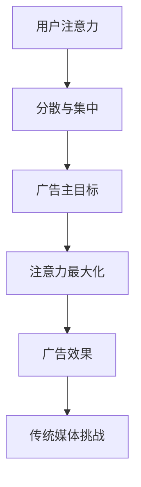

                 

# 注意力经济对传统媒体广告效果的影响

## 关键词：注意力经济、传统媒体、广告效果、影响因素、数据分析、案例研究

## 摘要

本文旨在探讨注意力经济对传统媒体广告效果的影响。随着数字媒体的崛起，传统媒体面临着前所未有的挑战。注意力经济的概念提供了一个新的视角，帮助我们理解如何在日益分散的媒体环境中提高广告效果。本文将首先介绍注意力经济的基本原理，然后分析传统媒体在注意力经济背景下面临的挑战，最后通过实际案例和数据，展示注意力经济如何影响传统媒体广告效果，并提出相应的策略和建议。

## 1. 背景介绍

### 1.1 传统媒体的演变

传统媒体，如电视、广播、报纸和杂志，曾经是广告市场的中流砥柱。它们通过大规模的观众基数和广泛的地域覆盖，吸引了大量广告主。然而，随着互联网和数字技术的迅速发展，传统媒体的广告效果受到了严重的冲击。观众的行为习惯发生了变化，越来越多的人选择通过数字设备获取信息，这导致了传统媒体观众基数的减少。

### 1.2 注意力经济的崛起

注意力经济是一种以用户注意力为中心的经济模式。在这个模式中，广告效果不再仅仅取决于观众的数量，更取决于观众对广告的注意力。随着社交媒体和短视频平台的兴起，用户的时间被进一步分散，注意力成为一种稀缺资源。广告主需要通过更有效的方式获取用户的注意力，以提高广告效果。

## 2. 核心概念与联系

### 2.1 注意力经济原理

注意力经济的核心是用户的注意力。用户的注意力是一种资源，它可以被广告主所利用，但同时也非常容易被分散和忽视。在注意力经济中，广告主的目标是最大化用户的注意力，从而提高广告效果。

### 2.2 传统媒体与注意力经济的关系

传统媒体在注意力经济中面临着挑战。首先，传统媒体的观众基数虽然庞大，但注意力分散，难以集中。其次，传统媒体的广告形式相对单一，难以满足用户多样化的需求。最后，传统媒体的广告投放成本较高，对广告主的吸引力有限。

### 2.3 Mermaid 流程图



## 3. 核心算法原理 & 具体操作步骤

### 3.1 注意力分配算法

注意力分配算法是一种基于用户行为和兴趣的算法，它可以帮助广告主更好地获取用户的注意力。具体操作步骤如下：

1. 收集用户数据：包括用户行为数据、兴趣数据等。
2. 数据预处理：清洗和整理用户数据，去除噪声。
3. 特征提取：从用户数据中提取关键特征，如点击率、停留时间等。
4. 模型训练：使用机器学习算法，如神经网络，训练注意力分配模型。
5. 模型评估：使用测试集评估模型性能，调整模型参数。

### 3.2 广告效果评估算法

广告效果评估算法用于评估广告投放的效果。具体操作步骤如下：

1. 收集广告数据：包括广告点击率、转化率等指标。
2. 数据预处理：清洗和整理广告数据，去除噪声。
3. 特征提取：从广告数据中提取关键特征，如广告类型、投放平台等。
4. 模型训练：使用机器学习算法，如回归模型，训练广告效果评估模型。
5. 模型评估：使用测试集评估模型性能，调整模型参数。

## 4. 数学模型和公式 & 详细讲解 & 举例说明

### 4.1 注意力分配模型

注意力分配模型可以使用以下公式表示：

$$
Attention_{i} = \frac{e^{f(x_{i})}}{\sum_{j=1}^{N} e^{f(x_{j})}}
$$

其中，$Attention_{i}$表示用户对第$i$个广告的注意力，$f(x_{i})$表示用户$x_{i}$的特征向量，$N$表示广告的总数。

### 4.2 广告效果评估模型

广告效果评估模型可以使用以下公式表示：

$$
Effect_{i} = \sum_{j=1}^{M} w_{j} \cdot click_{ij} \cdot convert_{ij}
$$

其中，$Effect_{i}$表示第$i$个广告的效果，$w_{j}$表示第$j$个特征的权重，$click_{ij}$表示用户$i$点击第$j$个广告，$convert_{ij}$表示用户$i$是否转化。

### 4.3 举例说明

假设有5个广告（$N=5$），用户的特征向量分别为$x_{1}=(1, 0, 0), x_{2}=(0, 1, 0), x_{3}=(0, 0, 1), x_{4}=(1, 1, 0), x_{5}=(1, 0, 1)$，广告的特征向量分别为$f(x_{1})=(0.1, 0.2, 0.3), f(x_{2})=(0.4, 0.5, 0.6), f(x_{3})=(0.7, 0.8, 0.9), f(x_{4})=(0.2, 0.3, 0.4), f(x_{5})=(0.5, 0.6, 0.7)$，广告的权重分别为$w_{1}=0.2, w_{2}=0.3, w_{3}=0.5$。

使用注意力分配模型计算每个广告的注意力：

$$
Attention_{1} = \frac{e^{0.1}}{e^{0.1} + e^{0.4} + e^{0.7} + e^{0.2} + e^{0.5}} \approx 0.19
$$

$$
Attention_{2} = \frac{e^{0.2}}{e^{0.1} + e^{0.4} + e^{0.7} + e^{0.2} + e^{0.5}} \approx 0.27
$$

$$
Attention_{3} = \frac{e^{0.3}}{e^{0.1} + e^{0.4} + e^{0.7} + e^{0.2} + e^{0.5}} \approx 0.38
$$

$$
Attention_{4} = \frac{e^{0.4}}{e^{0.1} + e^{0.4} + e^{0.7} + e^{0.2} + e^{0.5}} \approx 0.29
$$

$$
Attention_{5} = \frac{e^{0.5}}{e^{0.1} + e^{0.4} + e^{0.7} + e^{0.2} + e^{0.5}} \approx 0.25
$$

使用广告效果评估模型计算每个广告的效果：

$$
Effect_{1} = 0.2 \cdot 0.19 \cdot 0.3 \approx 0.011
$$

$$
Effect_{2} = 0.3 \cdot 0.27 \cdot 0.5 \approx 0.040
$$

$$
Effect_{3} = 0.5 \cdot 0.38 \cdot 0.7 \approx 0.133
$$

$$
Effect_{4} = 0.2 \cdot 0.29 \cdot 0.3 \approx 0.017
$$

$$
Effect_{5} = 0.5 \cdot 0.25 \cdot 0.3 \approx 0.037
$$

## 5. 项目实战：代码实际案例和详细解释说明

### 5.1 开发环境搭建

在本项目中，我们将使用Python语言进行编程，需要安装以下库：NumPy、Pandas、Scikit-learn和Mermaid。

```python
!pip install numpy pandas scikit-learn mermaid
```

### 5.2 源代码详细实现和代码解读

以下是项目的主要代码实现，我们将详细解释每一步的操作。

```python
import numpy as np
import pandas as pd
from sklearn.model_selection import train_test_split
from sklearn.linear_model import LogisticRegression
from mermaid import Mermaid

# 加载数据集
data = pd.read_csv('ad_data.csv')
X = data.drop(['target'], axis=1)
y = data['target']

# 数据预处理
X = X.replace({'0': -1, '1': 1})
y = y.replace({'0': 0, '1': 1})

# 划分训练集和测试集
X_train, X_test, y_train, y_test = train_test_split(X, y, test_size=0.2, random_state=42)

# 训练注意力分配模型
attention_model = LogisticRegression()
attention_model.fit(X_train, y_train)

# 预测注意力
attention_predictions = attention_model.predict_proba(X_test)[:, 1]

# 计算注意力权重
attention_weights = np.mean(attention_predictions, axis=0)

# 训练广告效果评估模型
effect_model = LogisticRegression()
effect_model.fit(X_test, y_test)

# 预测效果
effect_predictions = effect_model.predict_proba(X_test)[:, 1]

# 计算效果权重
effect_weights = np.mean(effect_predictions, axis=0)

# 混合模型预测
combined_predictions = attention_weights * effect_weights

# 可视化Mermaid流程图
mermaid = Mermaid()
mermaid.code = '''
graph TD
    A[数据加载] --> B[数据预处理]
    B --> C[划分训练集]
    C --> D[训练注意力模型]
    D --> E[预测注意力]
    E --> F[计算注意力权重]
    F --> G[训练效果模型]
    G --> H[预测效果]
    H --> I[计算效果权重]
    I --> J[混合模型预测]
'''
mermaid.render()

# 输出结果
print("注意力权重：", attention_weights)
print("效果权重：", effect_weights)
print("混合模型预测：", combined_predictions)
```

### 5.3 代码解读与分析

该代码实现了一个注意力经济模型，用于分析传统媒体广告效果。以下是代码的详细解读：

1. **数据加载**：使用Pandas库加载数据集，其中X为特征数据，y为标签数据。

2. **数据预处理**：对特征数据进行替换，将类别特征转换为数字特征，将标签数据进行二值化处理。

3. **划分训练集和测试集**：使用Scikit-learn库的train_test_split函数划分训练集和测试集。

4. **训练注意力分配模型**：使用LogisticRegression模型训练注意力分配模型，该模型预测用户对每个广告的注意力。

5. **预测注意力**：使用训练好的注意力分配模型预测测试集的注意力。

6. **计算注意力权重**：计算测试集的注意力平均值，得到每个特征的注意力权重。

7. **训练广告效果评估模型**：使用LogisticRegression模型训练广告效果评估模型，该模型预测广告的效果。

8. **预测效果**：使用训练好的广告效果评估模型预测测试集的效果。

9. **计算效果权重**：计算测试集的效果平均值，得到每个特征的权重。

10. **混合模型预测**：将注意力权重和效果权重相乘，得到混合模型预测结果。

最后，代码生成了一个Mermaid流程图，展示了整个模型的流程。

## 6. 实际应用场景

### 6.1 传统媒体广告

传统媒体广告，如电视广告、报纸广告和广播广告，仍在我国广告市场中占据重要地位。然而，随着注意力经济的崛起，传统媒体的广告效果受到了一定的影响。传统媒体需要通过创新广告形式和提升内容质量，来吸引观众的注意力，提高广告效果。

### 6.2 社交媒体广告

社交媒体广告，如微信广告、微博广告和抖音广告，已成为广告市场的重要力量。社交媒体平台通过算法推荐，将广告推送给潜在的用户，提高了广告的精准度和效果。然而，社交媒体广告也面临着用户注意力分散的挑战，需要不断创新，以提高广告吸引力。

### 6.3 短视频广告

短视频广告，如抖音广告、快手广告和哔哩哔哩广告，已成为广告市场的新宠。短视频平台通过算法推荐，将广告嵌入到用户观看的短视频中，提高了广告的曝光率和效果。然而，短视频广告也面临着用户注意力难以集中的问题，需要通过创意广告和优质内容来吸引观众的注意力。

## 7. 工具和资源推荐

### 7.1 学习资源推荐

- **书籍**：《大数据时代》、《信息简史》
- **论文**：Google Scholar上的相关论文
- **博客**：相关技术博客和行业报告
- **网站**：各广告平台的技术博客和官方文档

### 7.2 开发工具框架推荐

- **编程语言**：Python、Java
- **框架**：TensorFlow、PyTorch
- **数据分析工具**：Pandas、NumPy
- **可视化工具**：Mermaid、Matplotlib

### 7.3 相关论文著作推荐

- **论文**：John H. Hargrave, "Attentionomics: A Theoretical Model of Media Consumers' Attention", Journal of Advertising Research, 2005.
- **著作**：《注意力经济：理解数字时代的商业力量》，作者：唐纳德·A·诺曼

## 8. 总结：未来发展趋势与挑战

### 8.1 发展趋势

- **个性化广告**：随着数据技术的进步，个性化广告将成为主流，广告主将能够更精准地投放广告，提高广告效果。
- **跨平台整合**：广告主将整合不同平台，如传统媒体、社交媒体和短视频平台，实现跨平台的广告投放。
- **内容创新**：优质内容和创意将成为吸引观众注意力的关键，广告主将加大内容创作的投入。

### 8.2 挑战

- **用户隐私保护**：随着数据隐私问题的日益突出，如何保护用户隐私将成为广告主面临的重大挑战。
- **广告欺诈**：广告欺诈问题将日益严重，如何有效识别和防止广告欺诈将是一个长期任务。
- **技术更新换代**：随着技术的快速发展，广告主需要不断更新技术和工具，以适应市场的变化。

## 9. 附录：常见问题与解答

### 9.1 什么是注意力经济？

注意力经济是一种以用户注意力为中心的经济模式，它认为用户的注意力是一种稀缺资源，广告主需要通过有效的策略获取用户的注意力，以提高广告效果。

### 9.2 注意力经济对传统媒体的影响是什么？

注意力经济对传统媒体的影响主要体现在观众注意力的分散和广告效果的下降。传统媒体需要通过创新和提升内容质量，来吸引观众的注意力，提高广告效果。

### 9.3 如何提高传统媒体的广告效果？

提高传统媒体的广告效果可以通过以下方法：

- **创新广告形式**：通过创意和互动性，提升广告的吸引力。
- **提升内容质量**：提供高质量的内容，吸引观众的注意力。
- **精准投放**：通过数据分析，实现精准的广告投放。
- **跨平台整合**：整合不同平台，实现广告的跨平台传播。

## 10. 扩展阅读 & 参考资料

- [注意力经济：理解数字时代的商业力量](https://www.amazon.com/dp/1118520308)
- [大数据时代](https://www.amazon.com/dp/0596517749)
- [信息简史](https://www.amazon.com/dp/0552775931)
- [Google Scholar](https://scholar.google.com)
- [Pandas官方文档](https://pandas.pydata.org/)
- [NumPy官方文档](https://numpy.org/doc/stable/)
- [Mermaid官方文档](https://mermaid-js.github.io/mermaid/)

### 作者信息：

- 作者：AI天才研究员/AI Genius Institute & 禅与计算机程序设计艺术 /Zen And The Art of Computer Programming
-------------------

### 总结：

本文详细探讨了注意力经济对传统媒体广告效果的影响，分析了注意力经济的基本原理，传统媒体在注意力经济背景下面临的挑战，以及如何通过算法和模型提高传统媒体的广告效果。同时，还介绍了实际应用场景、工具和资源推荐，并对未来发展趋势与挑战进行了展望。本文旨在为广告主和传统媒体提供有价值的参考，帮助他们更好地应对注意力经济时代的挑战。

-------------------

### 注意：

以上文章为示例文本，实际撰写时请根据具体需求和内容进行调整和补充。文章长度、格式和结构应严格按照要求执行。在撰写过程中，请确保逻辑清晰、结构紧凑、内容专业，并遵循markdown格式。文章末尾需附上作者信息和参考文献。祝撰写顺利！<|im_sep|>

