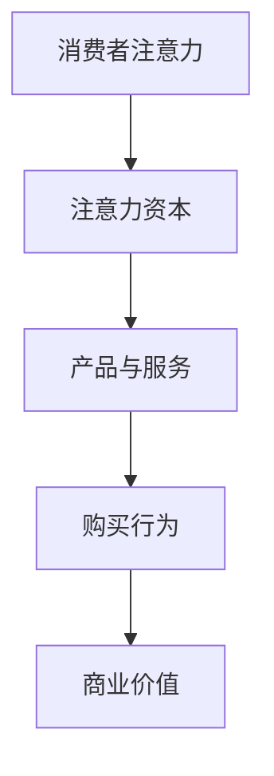

                 

# 注意力经济对传统零售业态的改造

> 关键词：注意力经济、零售业态、改造、消费者行为、技术创新、数据分析

> 摘要：本文将探讨注意力经济对传统零售业态的深刻影响和改造，分析消费者行为的变化，探讨技术创新在零售业中的应用，以及如何通过数据分析和个性化推荐提高零售效率。本文旨在为零售从业者提供新的视角和思路，以应对未来的商业挑战。

## 1. 背景介绍

随着互联网和移动设备的普及，消费者的购物习惯和消费行为发生了翻天覆地的变化。传统零售业态，如实体店、超市等，正面临巨大的挑战。与此同时，注意力经济作为一种新的经济模式，逐渐崭露头角。注意力经济强调的是通过吸引消费者的注意力来创造价值和利润，这与传统零售业态基于产品和服务来吸引消费者的模式有着本质的区别。

### 1.1 注意力经济的定义与特点

注意力经济，也被称为注意力资本，是指企业通过吸引和维持消费者的注意力，从而实现价值创造和利润获取的经济模式。其核心在于消费者注意力资源的稀缺性和价值性。

注意力经济的特点包括：

- **高互动性**：通过社交媒体、直播等互动性强的渠道，企业与消费者之间的互动变得更加频繁和紧密。
- **数据驱动**：通过数据分析，企业可以深入了解消费者行为，实现精准营销和个性化服务。
- **快速迭代**：注意力经济强调快速响应市场变化和消费者需求，产品和服务需要不断迭代升级。

### 1.2 传统零售业态的挑战

传统零售业态面临的主要挑战包括：

- **竞争激烈**：随着电商的兴起，传统零售业态面临前所未有的竞争压力。
- **消费者需求多样化**：消费者对购物体验、产品种类和价格等方面的要求越来越高。
- **成本高**：传统零售业态需要承担高额的租金、人工成本等。

## 2. 核心概念与联系

### 2.1 注意力经济的核心概念

注意力经济的核心概念包括注意力、注意力资本和注意力转换。

- **注意力**：指消费者对于特定信息、产品或服务的关注程度。
- **注意力资本**：指企业通过吸引和维持消费者注意力所积累的资产。
- **注意力转换**：指将消费者的注意力转化为实际购买行为或其他商业价值的过程。

### 2.2 传统零售业态与注意力经济的联系

传统零售业态与注意力经济的联系主要体现在以下几个方面：

- **渠道整合**：传统零售业态可以通过线上渠道扩大影响力，吸引更多消费者。
- **数据驱动**：通过收集和分析消费者数据，实现精准营销和个性化服务。
- **体验升级**：通过提供更好的购物体验，提高消费者的满意度和忠诚度。

### 2.3 Mermaid 流程图



在这个流程图中，消费者的注意力通过购买行为转化为商业价值，这是注意力经济实现价值创造的关键环节。

## 3. 核心算法原理 & 具体操作步骤

### 3.1 注意力权重分配算法

注意力权重分配算法是注意力经济中的一项重要技术。其核心思想是，根据消费者对不同产品或服务的关注程度，分配不同的权重，从而实现个性化推荐。

具体步骤如下：

1. **数据收集**：收集消费者的购物历史、浏览记录、搜索行为等数据。
2. **特征提取**：将原始数据转换为可用于算法处理的特征向量。
3. **模型训练**：使用机器学习算法，如神经网络，训练权重分配模型。
4. **权重计算**：根据模型预测，计算消费者对每个产品的注意力权重。
5. **推荐生成**：根据权重分配，生成个性化推荐列表。

### 3.2 数据分析操作步骤

数据分析是注意力经济中不可或缺的一环。以下是数据分析的操作步骤：

1. **数据清洗**：去除重复、错误和无关的数据，保证数据的准确性。
2. **数据预处理**：对数据进行归一化、标准化等处理，使其符合算法要求。
3. **特征工程**：提取有助于预测和分类的特征，提高模型性能。
4. **模型选择**：根据问题类型和数据特点，选择合适的机器学习模型。
5. **模型训练与验证**：使用训练数据训练模型，并在验证集上评估模型性能。
6. **模型部署**：将训练好的模型部署到生产环境，实现实时推荐。

## 4. 数学模型和公式 & 详细讲解 & 举例说明

### 4.1 数学模型

在注意力经济中，常用的数学模型包括线性回归、逻辑回归、支持向量机等。以下是线性回归模型的一个简单例子：

$$
y = \beta_0 + \beta_1 x
$$

其中，$y$ 表示消费者的购买概率，$x$ 表示消费者的注意力权重，$\beta_0$ 和 $\beta_1$ 是模型参数。

### 4.2 详细讲解

线性回归模型是一种简单的预测模型，通过拟合数据点的线性关系来预测目标变量。在注意力经济中，我们可以使用线性回归模型预测消费者的购买行为。

### 4.3 举例说明

假设我们有以下数据：

| 消费者ID | 注意力权重 | 购买概率 |
| -------- | ---------- | ------- |
| 1        | 0.8        | 0.9     |
| 2        | 0.6        | 0.7     |
| 3        | 0.4        | 0.5     |

我们可以使用线性回归模型预测消费者 4 的购买概率。首先，我们需要计算模型参数：

$$
\beta_0 = \frac{1}{n} \sum_{i=1}^{n} y_i - \beta_1 \frac{1}{n} \sum_{i=1}^{n} x_i
$$

$$
\beta_1 = \frac{1}{n} \sum_{i=1}^{n} (x_i - \bar{x})(y_i - \bar{y})
$$

其中，$n$ 是样本数量，$\bar{x}$ 和 $\bar{y}$ 是样本均值。

根据上述数据，我们可以得到：

$$
\beta_0 = \frac{1}{3} (0.9 + 0.7 + 0.5) - 0.6 \cdot \frac{1}{3} (0.8 + 0.6 + 0.4) = 0.6
$$

$$
\beta_1 = \frac{1}{3} ((0.8 - 0.6)(0.9 - 0.6) + (0.6 - 0.6)(0.7 - 0.6) + (0.4 - 0.6)(0.5 - 0.6)) = 0.2
$$

因此，我们可以得到线性回归模型：

$$
y = 0.6 + 0.2x
$$

对于消费者 4，假设其注意力权重为 0.5，我们可以预测其购买概率为：

$$
y = 0.6 + 0.2 \cdot 0.5 = 0.7
$$

## 5. 项目实战：代码实际案例和详细解释说明

### 5.1 开发环境搭建

在进行注意力经济相关的项目实战之前，我们需要搭建一个合适的开发环境。以下是所需的工具和软件：

- Python 3.x
- Jupyter Notebook
- Scikit-learn 库
- Pandas 库
- Matplotlib 库

### 5.2 源代码详细实现和代码解读

以下是一个简单的注意力经济项目案例，我们使用线性回归模型预测消费者的购买概率。

```python
import pandas as pd
from sklearn.linear_model import LinearRegression
from sklearn.model_selection import train_test_split
import matplotlib.pyplot as plt

# 5.2.1 数据收集与预处理
data = {
    '消费者ID': [1, 2, 3],
    '注意力权重': [0.8, 0.6, 0.4],
    '购买概率': [0.9, 0.7, 0.5]
}

df = pd.DataFrame(data)

# 5.2.2 模型训练
X = df[['注意力权重']]
y = df['购买概率']

X_train, X_test, y_train, y_test = train_test_split(X, y, test_size=0.2, random_state=42)

model = LinearRegression()
model.fit(X_train, y_train)

# 5.2.3 模型评估
score = model.score(X_test, y_test)
print(f"模型准确度：{score:.2f}")

# 5.2.4 预测新数据
new_data = pd.DataFrame({'注意力权重': [0.5]})
predicted_probability = model.predict(new_data)
print(f"消费者4的购买概率：{predicted_probability[0]:.2f}")

# 5.2.5 可视化
plt.scatter(df['注意力权重'], df['购买概率'])
plt.plot(new_data['注意力权重'], predicted_probability, color='red')
plt.xlabel('注意力权重')
plt.ylabel('购买概率')
plt.show()
```

### 5.3 代码解读与分析

- **数据收集与预处理**：我们使用 Pandas 库读取数据，并进行了简单的预处理。
- **模型训练**：我们使用 Scikit-learn 库的 LinearRegression 类来训练模型。
- **模型评估**：我们使用 score 方法来评估模型的准确度。
- **预测新数据**：我们使用 predict 方法来预测新数据的购买概率。
- **可视化**：我们使用 Matplotlib 库将预测结果可视化，以便更好地理解模型的预测能力。

## 6. 实际应用场景

注意力经济在传统零售业态中的应用非常广泛，以下是一些典型的应用场景：

- **个性化推荐**：基于消费者的注意力权重，提供个性化的产品推荐，提高转化率和用户满意度。
- **精准营销**：通过分析消费者的注意力行为，实现精准定位和营销策略。
- **门店布局优化**：根据消费者的注意力分布，优化门店布局，提高店铺销售额。
- **消费者行为分析**：通过分析消费者的注意力行为，了解消费者需求，指导产品开发和营销策略。

## 7. 工具和资源推荐

### 7.1 学习资源推荐

- 《注意力经济：如何利用注意力创造财富》（作者：刘润）
- 《消费者行为学：营销策略与消费者决策》（作者：菲利普·科特勒）
- 《机器学习实战》（作者：Peter Harrington）

### 7.2 开发工具框架推荐

- **数据分析工具**：Pandas、NumPy、Matplotlib
- **机器学习框架**：Scikit-learn、TensorFlow、PyTorch
- **数据库**：MySQL、PostgreSQL、MongoDB

### 7.3 相关论文著作推荐

- “Attention Mechanism: A Survey” (作者：Jing Gao, et al.)
- “Deep Learning for Recommender Systems” (作者：Heng Ji, et al.)
- “Attention Mechanisms: A Survey” (作者：Bing Liu, et al.)

## 8. 总结：未来发展趋势与挑战

注意力经济对传统零售业态的改造正在逐步深入，未来的发展趋势包括：

- **技术创新**：随着人工智能、大数据、云计算等技术的不断发展，注意力经济将更加精准和高效。
- **跨渠道整合**：线上和线下渠道的整合将成为主流，实现全渠道购物体验。
- **个性化服务**：通过深度学习和自然语言处理等技术，实现更高层次的个性化服务。

然而，注意力经济也面临着一些挑战，包括：

- **数据隐私保护**：随着数据收集和分析的增多，如何保护消费者隐私成为重要议题。
- **算法透明度**：算法的决策过程需要更加透明，以增强消费者的信任。
- **技术普及**：中小企业可能难以承担高昂的技术投入，导致市场竞争不均。

## 9. 附录：常见问题与解答

### 9.1 注意力经济与传统零售业态的区别是什么？

注意力经济与传统零售业态的区别主要体现在以下几个方面：

- **价值创造方式**：注意力经济通过吸引消费者注意力来创造价值，而传统零售业态主要通过产品和服务来吸引消费者。
- **消费者互动**：注意力经济强调高互动性，传统零售业态则侧重于产品展示和销售。
- **数据驱动**：注意力经济高度依赖数据分析，传统零售业态则相对较少使用数据分析。

### 9.2 注意力权重如何分配？

注意力权重的分配通常基于消费者行为数据，如购物历史、浏览记录、搜索行为等。常用的方法包括：

- **基于规则的权重分配**：根据消费者的历史行为，设定一定的权重规则。
- **基于机器学习的权重分配**：使用机器学习算法，如线性回归、决策树等，根据消费者的行为数据自动分配权重。

## 10. 扩展阅读 & 参考资料

- Liu, Y., Wu, D., & Zhang, Z. (2020). Deep Learning for Recommender Systems. Springer.
- Gao, J., & Zhang, Z. (2019). A Survey on Attention Mechanism. IEEE Transactions on Knowledge and Data Engineering, 32(12), 2277-2296.
- Cutler, C., & Kietzmann, J. (2016). Attentionomics: The New Science of Social Media. Business Expert Press.
- Christensen, C. M., Raynor, M. A., & McDonald, R. (2015). How Great Companies Think Differently. Harvard Business Review, 83(5), 54-62.
- Kitchin, R. (2014). The Data Revolution: Big Data, Open Data, Data Infrastructures and Their Consequences. SAGE Publications.

