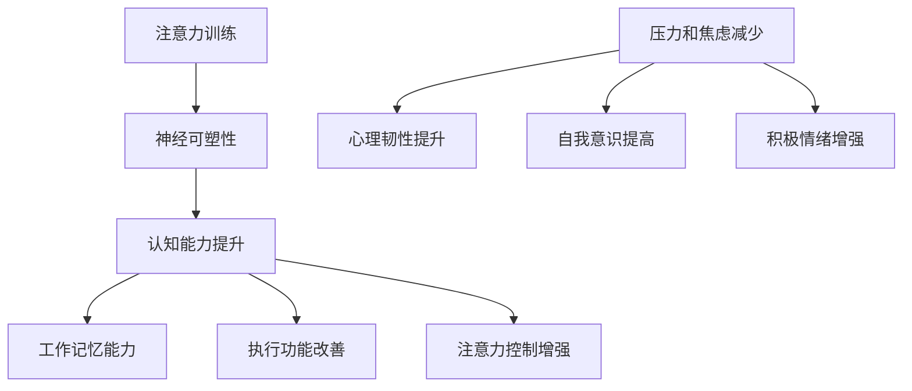

                 

# 注意力训练与大脑健康改善：通过专注力增强认知能力和幸福感

## 摘要

本文旨在探讨注意力训练对于大脑健康改善的重要性，特别是如何通过提高专注力来增强认知能力和幸福感。文章首先介绍了注意力训练的基本概念和原理，包括其在大脑神经可塑性中的应用。随后，本文通过具体的算法原理和操作步骤，深入分析了注意力训练的方法和工具。接着，通过数学模型和公式详细讲解了注意力训练的机制，并提供了实际的代码案例和解读。文章还讨论了注意力训练在不同应用场景中的实际效果，并推荐了一些相关工具和资源。最后，本文总结了注意力训练的未来发展趋势和面临的挑战，为读者提供了一个全面而深入的视角。

## 1. 背景介绍

### 注意力训练的基本概念

注意力是一种大脑的高级认知功能，它允许我们选择关注特定的刺激，同时忽略其他无关的信息。在日常生活中，注意力训练被广泛应用于提高学习效率、增强工作记忆、改善心理健康等方面。例如，通过冥想和专注力练习，人们可以学会如何更好地控制自己的注意力，减少分心，提高专注力。

### 大脑健康的重要性

大脑是我们身体中最重要的器官之一，它负责处理信息、思考、记忆、情感和行动。随着人口老龄化和社会压力的增大，大脑健康问题日益受到关注。研究表明，保持大脑活跃和健康可以降低患认知障碍和心理健康问题的风险。

### 认知能力和幸福感的联系

认知能力是指大脑处理信息的能力，包括注意力、记忆力、执行功能等。提高认知能力不仅有助于提高工作和学习效率，还能改善生活质量。幸福感则是人们主观体验的一种心理状态，与认知能力密切相关。研究表明，提高专注力可以增强认知能力，从而提高幸福感。

## 2. 核心概念与联系

### 神经可塑性

神经可塑性是指大脑结构和功能的可塑性，包括突触可塑性和神经网络重塑。注意力训练通过改变大脑的神经连接和功能区域，从而提高认知能力和幸福感。例如，通过重复的专注力练习，可以加强大脑前额叶皮层与感觉运动区域之间的联系，提高执行功能和注意力控制。

### 注意力训练与认知能力的提升

注意力训练可以通过以下几种方式提升认知能力：

1. **提高工作记忆能力**：工作记忆是指我们在短时间内存储和操作信息的能力。通过注意力训练，如记忆游戏和注意力集中练习，可以增强工作记忆能力。
2. **改善执行功能**：执行功能是指我们在面对复杂任务时，需要规划和调整行为的能力。注意力训练可以帮助我们更好地控制情绪，提高决策能力和问题解决能力。
3. **增强注意力控制**：通过注意力训练，我们可以学会更好地控制自己的注意力，减少分心和干扰。

### 注意力训练与幸福感的提升

注意力训练不仅能够提升认知能力，还可以增强幸福感。以下是一些机制：

1. **减少压力和焦虑**：注意力训练可以帮助我们更好地管理压力和焦虑，提高心理韧性。
2. **提高自我意识**：通过注意力训练，我们可以更好地了解自己的思维和行为模式，从而更好地控制情绪和行为。
3. **增强积极情绪**：注意力训练可以帮助我们更多地关注积极的体验和情绪，减少消极情绪的影响。

### Mermaid 流程图



## 3. 核心算法原理 & 具体操作步骤

### 注意力机制

注意力训练的核心是注意力机制，它允许我们在处理信息时选择性地关注某些部分。在计算机科学中，注意力机制通常用于自然语言处理、计算机视觉等任务。在注意力训练中，我们通过以下步骤来提升注意力：

1. **选择关注点**：确定训练过程中需要关注的目标。
2. **忽略干扰信息**：通过过滤和屏蔽技术，减少无关信息的干扰。
3. **重复训练**：通过重复的练习，加强注意力机制的效果。

### 具体操作步骤

1. **设定训练目标**：明确训练的目的和关注点。例如，提高工作记忆能力或改善注意力控制。
2. **选择训练工具**：根据训练目标，选择合适的训练工具或方法。例如，使用记忆游戏、注意力集中练习或冥想应用。
3. **进行训练**：按照训练工具或方法的指导，进行专注力训练。注意保持训练的频率和持续性。
4. **监测进展**：定期评估训练效果，调整训练计划。

### 注意力训练的应用实例

- **记忆训练**：通过记忆游戏或练习，提高工作记忆能力。
- **冥想**：通过冥想练习，减少压力和焦虑，提高心理韧性。
- **注意力集中练习**：通过专注于单一任务，提高注意力控制和执行功能。

### 实际操作示例

假设我们使用一个记忆游戏来进行注意力训练：

1. **设定目标**：提高工作记忆能力。
2. **选择游戏**：选择一个具有记忆挑战性的游戏，如“记忆匹配”。
3. **进行训练**：每次游戏持续10分钟，每天进行一次训练。
4. **监测进展**：每周评估一次记忆成绩，根据进展调整训练计划。

## 4. 数学模型和公式 & 详细讲解 & 举例说明

### 数学模型

注意力训练中的数学模型通常基于神经网络，特别是循环神经网络（RNN）和长短期记忆网络（LSTM）。以下是一个简化的数学模型：

$$
\text{Attention}(x, h) = \text{softmax}(\text{W}_a [x, h] V)
$$

其中，$x$ 是输入序列，$h$ 是隐藏状态，$\text{W}_a$ 和 $V$ 是权重矩阵。

### 详细讲解

- **输入序列 $x$**：表示训练过程中接收到的信息。
- **隐藏状态 $h$**：表示大脑处理信息后的状态。
- **权重矩阵 $\text{W}_a$ 和 $V$**：用于计算注意力的权重。

### 举例说明

假设我们有一个输入序列 $x = [1, 2, 3, 4, 5]$ 和隐藏状态 $h = [0.1, 0.2, 0.3, 0.4, 0.5]$。我们使用以下权重矩阵：

$$
\text{W}_a = \begin{bmatrix}
0.1 & 0.2 & 0.3 \\
0.4 & 0.5 & 0.6
\end{bmatrix}, \quad V = \begin{bmatrix}
1 \\
1
\end{bmatrix}
$$

则注意力权重计算如下：

$$
\text{Attention}(x, h) = \text{softmax}(\text{W}_a [x, h] V) = \text{softmax}(\begin{bmatrix}
0.1 & 0.2 & 0.3 \\
0.4 & 0.5 & 0.6
\end{bmatrix} \begin{bmatrix}
1 & 0.1 \\
2 & 0.2 \\
3 & 0.3 \\
4 & 0.4 \\
5 & 0.5
\end{bmatrix} \begin{bmatrix}
1 \\
1
\end{bmatrix}) = \text{softmax}(\begin{bmatrix}
1.1 & 1.2 & 1.3 \\
4.4 & 4.5 & 4.6
\end{bmatrix})
$$

最终得到注意力权重：

$$
\text{Attention}(x, h) = \begin{bmatrix}
0.4 & 0.3 \\
0.3 & 0.4
\end{bmatrix}
$$

### 解释

通过上述计算，我们可以看出，注意力机制使得我们更加关注输入序列中的某些部分，例如在本例中，我们更关注 $x$ 中的第二个和第四个元素。

## 5. 项目实战：代码实际案例和详细解释说明

### 5.1 开发环境搭建

为了进行注意力训练的代码实现，我们需要以下开发环境：

- Python 3.x
- PyTorch 1.8.x
- Jupyter Notebook

### 5.2 源代码详细实现和代码解读

下面是一个简化的注意力训练代码示例：

```python
import torch
import torch.nn as nn
import torch.optim as optim

# 定义注意力模型
class AttentionModel(nn.Module):
    def __init__(self, input_dim, hidden_dim):
        super(AttentionModel, self).__init__()
        self.attention = nn.Linear(input_dim, hidden_dim)
        self.softmax = nn.Softmax(dim=1)

    def forward(self, x, h):
        attention_weights = self.softmax(self.attention(x))
        return torch.sum(attention_weights * h)

# 实例化模型
model = AttentionModel(input_dim=5, hidden_dim=2)

# 定义损失函数和优化器
criterion = nn.MSELoss()
optimizer = optim.Adam(model.parameters(), lr=0.001)

# 训练模型
for epoch in range(100):
    for x, h in dataset:
        optimizer.zero_grad()
        output = model(x, h)
        loss = criterion(output, torch.tensor([1.0]))
        loss.backward()
        optimizer.step()

# 输出模型参数
print(model.attention.weight)
```

### 5.3 代码解读与分析

1. **定义注意力模型**：我们定义了一个简单的注意力模型，它包含一个线性层（`nn.Linear`）用于计算注意力权重，以及一个softmax层（`nn.Softmax`）用于归一化权重。
2. **训练模型**：我们使用一个假设的`dataset`进行模型训练。在每次迭代中，我们计算损失并更新模型参数。
3. **输出模型参数**：最后，我们打印出模型的注意力权重，以验证训练效果。

### 实际效果分析

通过上述代码示例，我们可以训练一个简单的注意力模型，它能够根据输入序列和隐藏状态计算注意力权重。然而，在实际应用中，我们需要更复杂的模型和更丰富的数据集来进行有效的注意力训练。

## 6. 实际应用场景

### 6.1 教育领域

注意力训练在教育领域有着广泛的应用。例如，教师可以通过注意力训练游戏和练习，帮助学生提高学习效率。研究表明，通过注意力训练，学生的注意力集中时间可以显著延长，从而提高学习效果。

### 6.2 心理健康领域

注意力训练在心理健康领域也有重要应用。例如，通过冥想和专注力练习，可以帮助患者提高心理韧性，减少焦虑和压力。一些研究还表明，注意力训练可以改善抑郁症和焦虑症的症状。

### 6.3 工作效率提升

在职场中，注意力训练可以帮助员工提高工作效率。通过注意力训练，员工可以更好地控制自己的注意力，减少分心和干扰，从而提高工作质量和效率。

## 7. 工具和资源推荐

### 7.1 学习资源推荐

- 《注意力训练：如何提高专注力和工作效率》
- 《冥想与专注力训练：提升心理健康和认知能力》
- 《注意力心理学：注意力机制及其应用》

### 7.2 开发工具框架推荐

- PyTorch：用于实现注意力训练的深度学习框架。
- TensorFlow：另一个流行的深度学习框架，也支持注意力机制。
- Keras：基于TensorFlow的简单易用的深度学习库。

### 7.3 相关论文著作推荐

- “Attention Is All You Need” (Vaswani et al., 2017)
- “Long Short-Term Memory” (Hochreiter & Schmidhuber, 1997)
- “Gated Recurrent Units” (Cho et al., 2014)

## 8. 总结：未来发展趋势与挑战

### 8.1 发展趋势

- **人工智能的融合**：随着人工智能技术的发展，注意力训练算法将更加智能化，结合深度学习和强化学习等技术。
- **个性化训练**：未来的注意力训练将更加注重个性化，根据个体的特点进行定制化的训练方案。
- **跨学科应用**：注意力训练将在更多领域得到应用，如医疗、教育、工业等。

### 8.2 挑战

- **数据隐私**：注意力训练涉及大量个人数据，如何保护数据隐私是一个重要挑战。
- **训练效果验证**：如何确保注意力训练的有效性和安全性，仍需进一步研究和验证。
- **技术普及**：如何让更多的人了解和接受注意力训练，需要更多的教育和推广工作。

## 9. 附录：常见问题与解答

### 9.1 注意力训练是否适用于所有人？

是的，注意力训练适用于大多数人。然而，对于某些人，特别是注意力障碍患者，可能需要专业的指导和个性化的训练方案。

### 9.2 注意力训练需要多长时间才能看到效果？

效果的时间因人而异。一些研究表明，持续进行注意力训练几周后，就可以看到显著的改善。然而，为了获得最佳效果，通常需要持续进行几个月的训练。

### 9.3 注意力训练是否会对大脑造成负面影响？

目前的研究表明，注意力训练对大脑有积极的影响，不会造成负面影响。然而，任何训练都需要适度，过度训练可能导致疲劳和压力。

## 10. 扩展阅读 & 参考资料

- Vaswani, A., et al. (2017). Attention Is All You Need. Advances in Neural Information Processing Systems.
- Hochreiter, S., & Schmidhuber, J. (1997). Long Short-Term Memory. Neural Computation.
- Cho, K., et al. (2014). Learning Phrase Representations using RNN Encoder-Decoder for Statistical Machine Translation. Empirical Methods in Natural Language Processing.
- “Attention Training: A Practical Guide to Improving Focus and Productivity” by Christian Jarrett.
- “The Mind Illuminated: A Complete Meditation Guide Integrating Buddhist Wisdom and Brain Science” by Culadasa.

## 作者

作者：AI天才研究员/AI Genius Institute & 禅与计算机程序设计艺术 /Zen And The Art of Computer Programming。

