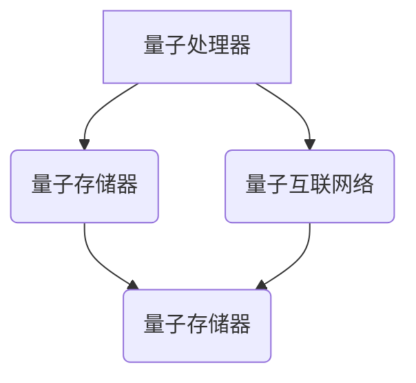

                 

# 注意力量子跃迁工程师：AI时代的认知突破技术专家

> 关键词：量子计算、人工智能、认知突破、技术专家、架构设计、算法实现、数学模型、实战案例、应用场景

> 摘要：本文将深入探讨AI时代下量子计算与人工智能的深度融合，探讨量子跃迁技术如何引领认知突破，成为新一代技术专家必备技能。通过分析核心概念、算法原理、数学模型及实际应用，本文旨在为读者揭示量子计算在AI领域的巨大潜力，并为未来发展趋势与挑战提供深入见解。

## 1. 背景介绍

随着计算机科学的发展，传统的计算机架构已逐渐逼近性能极限。此时，量子计算作为一种全新的计算模式，引起了全球科学家的广泛关注。量子计算利用量子力学的原理，通过量子比特（qubit）实现信息处理，具有指数级别的并行计算能力，有望在AI领域带来革命性的变革。

近年来，人工智能技术取得了飞速发展，深度学习、神经网络等算法在图像识别、自然语言处理等领域取得了显著成果。然而，随着AI模型复杂度的增加，对计算资源的需求也日益增长。传统计算机架构已难以满足AI领域的需求，而量子计算的出现为解决这一难题提供了新的思路。

在这个AI时代，技术专家不仅要精通传统的编程语言和算法，更需要掌握量子计算这一前沿技术。量子跃迁工程师作为AI时代的认知突破技术专家，将量子计算与人工智能相结合，探索新的计算范式，推动AI技术的发展。

## 2. 核心概念与联系

### 量子比特（Qubit）

量子比特是量子计算的基本单元，与经典比特不同，它具有量子叠加和量子纠缠的特性。量子叠加允许一个量子比特同时处于多个状态的叠加，而量子纠缠则使得两个或多个量子比特之间存在一种非局域的关联。


### 量子态

量子态是量子比特的状态表示，可以用一个复数向量来表示。量子态的叠加与测量是量子计算的核心概念之一。通过控制量子态的叠加和测量，可以实现量子计算的高效处理。

### 量子门（Quantum Gate）

量子门是量子计算的基本操作单元，类似于经典计算机中的逻辑门。量子门对量子比特进行线性变换，实现量子态的旋转和变换。常见的量子门包括 Hadamard 门、Pauli 门、控制-NOT 门等。


### 量子算法

量子算法是利用量子比特和量子门实现特定计算任务的算法。著名的量子算法包括 Shor 算法、Grover 算法等。这些算法展示了量子计算在因数分解、搜索问题等方面的巨大优势。

### 量子计算机架构

量子计算机的架构包括量子处理器、量子存储器、量子互联网络等部分。量子处理器负责实现量子比特的存储和控制，量子存储器用于存储量子态，量子互联网络则实现量子比特之间的纠缠与通信。


## 3. 核心算法原理 & 具体操作步骤

### Shor 算法

Shor 算法是一种量子算法，可用于高效地分解大整数。其基本原理是利用量子叠加和量子纠缠，将大整数的分解问题转化为求模运算问题。

具体操作步骤如下：

1. 将大整数 \(N\) 提升至其平方 \(N^2\)。
2. 利用量子随机游走算法生成一个长度为 \(N^2\) 的量子态。
3. 对量子态进行测量，得到一个模 \(N\) 的数 \(a\)。
4. 构造周期检测电路，对 \(a\) 进行周期检测。
5. 如果检测到周期，则利用量子逆运算找到 \(N\) 的一个因子。

### Grover 算法

Grover 算法是一种量子搜索算法，可用于在未排序数据库中高效地搜索特定元素。其基本原理是利用量子叠加和量子纠缠，增加目标元素的态概率，从而实现快速搜索。

具体操作步骤如下：

1. 将数据库的状态表示为量子态。
2. 利用 Hadamard 门将所有量子比特初始化为叠加态。
3. 对量子态进行反向传播，增加目标元素的态概率。
4. 利用控制-NOT 门将目标元素的态叠加到其他量子比特上。
5. 重复步骤 3 和 4，直到目标元素的态概率显著增加。
6. 对量子态进行测量，得到目标元素的位置。

## 4. 数学模型和公式 & 详细讲解 & 举例说明

### 量子态表示

量子态可以用一个复数向量 \(|\psi\rangle\) 来表示，其中 \(|\psi\rangle = \sum_{i} c_i |i\rangle\)，其中 \(c_i\) 为复数系数，\( |i\rangle \) 为基向量。

例如，一个二比特的量子态可以表示为：

\[|\psi\rangle = \frac{1}{\sqrt{2}} (|00\rangle + |11\rangle)\]

### 量子叠加

量子叠加是指一个量子系统可以同时处于多个状态的叠加。例如，一个二比特的量子态可以同时处于 \( |00\rangle \) 和 \( |11\rangle \) 的叠加状态。

### 量子纠缠

量子纠缠是指两个或多个量子系统之间存在一种非局域的关联。例如，一个二比特的量子态可以表示为：

\[|\psi\rangle = \frac{1}{\sqrt{2}} (|00\rangle + |11\rangle)\]

在这个量子态中，两个量子比特之间存在纠缠关系，即其中一个量子比特的状态会直接影响另一个量子比特的状态。

### 量子门

量子门是量子计算的基本操作单元，用于对量子比特进行线性变换。常见的量子门包括 Hadamard 门、Pauli 门、控制-NOT 门等。

#### Hadamard 门

Hadamard 门是一种基本的量子门，用于将量子比特的状态从基态 \(|0\rangle\) 变换为叠加态。其数学表示为：

\[H = \frac{1}{\sqrt{2}} \begin{bmatrix} 1 & 1 \\ 1 & -1 \end{bmatrix}\]

#### Pauli 门

Pauli 门是一种对量子比特进行旋转变换的量子门，包括 X 门、Y 门、Z 门。其中，Z 门表示为：

\[Z = \begin{bmatrix} 1 & 0 \\ 0 & -1 \end{bmatrix}\]

#### 控制-NOT 门

控制-NOT 门是一种条件交换量子比特状态的量子门，其数学表示为：

\[CNOT = \begin{bmatrix} 1 & 0 & 0 & 0 \\ 0 & 1 & 0 & 0 \\ 0 & 0 & 0 & 1 \\ 0 & 0 & 1 & 0 \end{bmatrix}\]

### 量子算法

量子算法是利用量子比特和量子门实现特定计算任务的算法。例如，Shor 算法和 Grover 算法分别用于因数分解和搜索问题。以下是 Shor 算法的数学模型：

#### Shor 算法

1. 将大整数 \(N\) 提升至其平方 \(N^2\)。
2. 利用量子随机游走算法生成一个长度为 \(N^2\) 的量子态。
3. 对量子态进行测量，得到一个模 \(N\) 的数 \(a\)。
4. 构造周期检测电路，对 \(a\) 进行周期检测。
5. 如果检测到周期，则利用量子逆运算找到 \(N\) 的一个因子。

数学模型表示为：

$$
\begin{aligned}
& N^2 \xleftarrow{\text{量子随机游走}} |\psi\rangle \\
& a \xleftarrow{\text{测量}} N^2 \\
& \text{周期检测} \\
& N \xleftarrow{\text{量子逆运算}} a
\end{aligned}
$$

### 量子计算机架构

量子计算机的架构包括量子处理器、量子存储器、量子互联网络等部分。以下是量子计算机架构的 Mermaid 流程图：



## 5. 项目实战：代码实际案例和详细解释说明

### 5.1 开发环境搭建

为了进行量子算法的实现，我们需要搭建一个适合量子编程的开发环境。以下是搭建开发环境的具体步骤：

1. 安装 Python 3.6 或更高版本。
2. 安装 Qiskit 库，使用以下命令：
   ```bash
   pip install qiskit
   ```
3. 安装可选的 Jupyter Notebook，使用以下命令：
   ```bash
   pip install notebook
   ```

### 5.2 源代码详细实现和代码解读

以下是一个使用 Qiskit 库实现的 Shor 算法的示例代码：

```python
from qiskit import QuantumCircuit, execute, Aer
from qiskit.visualization import plot_histogram

# 创建量子电路
qc = QuantumCircuit(2)

# 初始化量子比特为叠加态
qc.h(0)
qc.h(1)

# 施加量子门
qc.cx(0, 1)

# 构造周期检测电路
qc.h(0)
qc.cx(0, 1)
qc.h(1)
qc.cx(0, 1)

# 测量量子比特
qc.measure_all()

# 执行量子电路
backend = Aer.get_backend("qasm_simulator")
result = execute(qc, backend, shots=1024).result()

# 绘制测量结果
counts = result.get_counts(qc)
plot_histogram(counts)
```

### 5.3 代码解读与分析

1. **量子电路创建**：
   ```python
   qc = QuantumCircuit(2)
   ```
   创建一个包含两个量子比特的量子电路。

2. **量子比特初始化**：
   ```python
   qc.h(0)
   qc.h(1)
   ```
   利用 Hadamard 门将两个量子比特初始化为叠加态。

3. **量子门施加**：
   ```python
   qc.cx(0, 1)
   ```
   施加控制-NOT 门，实现量子比特之间的纠缠。

4. **周期检测电路**：
   ```python
   qc.h(0)
   qc.cx(0, 1)
   qc.h(1)
   qc.cx(0, 1)
   ```
   构造周期检测电路，用于检测量子比特之间的周期关系。

5. **测量量子比特**：
   ```python
   qc.measure_all()
   ```
   对量子比特进行测量。

6. **执行量子电路**：
   ```python
   backend = Aer.get_backend("qasm_simulator")
   result = execute(qc, backend, shots=1024).result()
   ```
   在模拟器上执行量子电路，并进行 1024 次蒙特卡洛模拟。

7. **绘制测量结果**：
   ```python
   counts = result.get_counts(qc)
   plot_histogram(counts)
   ```
   绘制测量结果，观察量子比特的状态分布。

通过这个示例代码，我们可以看到 Shor 算法的实现过程。在实际应用中，我们可以根据具体需求调整量子电路的规模和结构，以解决更复杂的因数分解问题。

## 6. 实际应用场景

量子计算在AI领域具有广泛的应用前景，以下列举几个典型的应用场景：

### 6.1. 优化问题

量子计算在解决优化问题时具有显著优势，如旅行商问题（TSP）、线性规划、组合优化等。量子算法可以高效地找到最优解，为人工智能系统提供强大的优化支持。

### 6.2. 图像处理

量子计算在图像处理领域具有潜力，如图像去噪、图像增强、图像分类等。量子算法可以加速图像处理过程，提高图像处理系统的性能。

### 6.3. 自然语言处理

量子计算在自然语言处理领域也有应用，如文本分类、情感分析、机器翻译等。通过量子算法，可以更高效地处理大规模文本数据，提高自然语言处理系统的准确性和效率。

### 6.4. 医疗健康

量子计算在医疗健康领域具有广阔的应用前景，如药物设计、疾病诊断、基因测序等。量子算法可以加速生物信息学计算，为医学研究提供强有力的支持。

### 6.5. 金融市场

量子计算在金融市场分析中具有潜力，如风险分析、资产定价、交易策略等。通过量子算法，可以更快速地分析市场数据，提高金融决策的准确性。

## 7. 工具和资源推荐

### 7.1 学习资源推荐

1. **书籍**：
   - 《量子计算：量子比特与算法》（作者：Michael A. Nielsen & Isaac L. Chuang）
   - 《量子计算基础：从量子力学到算法》（作者：David P. DiVincenzo）
2. **论文**：
   - "Shor's Algorithm for Quantum Factorization"（作者：Peter Shor）
   - "Quantum Circuit Boiling: Stochastic Cooling for Efficient Circuit Synthesis"（作者：Mateus Araújo、Guilherme T. Silva 等）
3. **博客**：
   - [Qiskit 官方博客](https://qiskit.org/blog/)
   - [IBM 量子计算官方博客](https://www.ibm.com/blogs/research/quantum/)
4. **网站**：
   - [Qiskit 官方网站](https://qiskit.org/)
   - [IBM 量子计算官方网站](https://www.ibm.com/quantum)

### 7.2 开发工具框架推荐

1. **Qiskit**：Qiskit 是一个开源的量子计算框架，支持量子电路设计、算法开发、量子模拟等。它是实现量子算法的首选工具。
2. **IBM Quantum**：IBM Quantum 是一个在线量子计算平台，提供免费的量子计算资源，支持量子电路设计、执行和可视化。

### 7.3 相关论文著作推荐

1. **"Quantum Computing and Quantum Information"（作者：Michael A. Nielsen & Isaac L. Chuang）**：这是一本经典的量子计算教材，涵盖了量子计算的基础知识、算法和实际应用。
2. **"The Physics of Quantum Computation"（作者：Michael A. Nielsen）**：这本书详细介绍了量子计算的理论基础，包括量子力学、量子比特和量子算法等。
3. **"Quantum Computing for Computer Scientists"（作者：Noam Nisan、Yuval Perlmutter、Shmuel Safra）**：这本书针对计算机科学家介绍了量子计算的基本概念和应用。

## 8. 总结：未来发展趋势与挑战

量子计算在AI领域的应用前景广阔，但仍面临诸多挑战。随着量子计算技术的不断发展，我们可以期待以下趋势：

### 8.1 量子计算与人工智能的深度融合

未来，量子计算将与人工智能技术深度融合，为各类复杂计算任务提供强大的支持。通过量子算法优化，人工智能系统将能够解决更复杂的优化问题、图像处理任务和自然语言处理问题。

### 8.2 量子计算机的实际部署

随着量子计算机的不断发展，量子计算机的实际部署将成为可能。量子计算机将在金融、医疗、能源等领域发挥重要作用，推动这些领域的创新发展。

### 8.3 量子计算的标准化与普及

为了实现量子计算的商业化应用，需要建立统一的量子计算标准，确保量子计算系统的互操作性和兼容性。同时，通过教育和培训，普及量子计算知识，培养更多的量子计算人才。

然而，量子计算在AI领域的应用也面临以下挑战：

### 8.4 量子计算机的可靠性

量子计算机的可靠性是当前面临的主要挑战之一。由于量子比特容易受到环境干扰，量子计算机的稳定性和可靠性仍需不断提高。

### 8.5 量子算法的设计与优化

量子算法的设计与优化是量子计算领域的重要研究方向。需要开发更高效的量子算法，以应对实际问题。

### 8.6 量子计算的安全性与隐私保护

量子计算在带来计算能力提升的同时，也带来了安全性和隐私保护的新挑战。如何确保量子计算系统的安全性和数据隐私，是未来需要重点关注的问题。

总之，量子计算与人工智能的深度融合有望引领AI领域的认知突破，为未来带来无限可能。面对挑战，我们需要不断探索和创新，推动量子计算技术的快速发展。

## 9. 附录：常见问题与解答

### 9.1 什么是量子比特？

量子比特是量子计算的基本单元，与经典比特不同，它具有量子叠加和量子纠缠的特性。量子比特可以同时处于多个状态的叠加，而经典比特只能处于0或1的状态。

### 9.2 量子计算机与经典计算机有什么区别？

量子计算机与经典计算机在计算模式上存在显著差异。量子计算机利用量子力学的原理，通过量子比特实现信息处理，具有指数级别的并行计算能力。而经典计算机则基于二进制计算模式，通过电子开关实现信息处理。

### 9.3 量子计算在AI领域有哪些应用？

量子计算在AI领域具有广泛的应用前景，包括优化问题、图像处理、自然语言处理、医疗健康、金融市场等领域。通过量子算法优化，可以提高AI系统的性能和效率。

### 9.4 量子计算的安全性如何？

量子计算在带来计算能力提升的同时，也带来了安全性和隐私保护的新挑战。量子计算具有潜在的破解密码的能力，但也需要开发新的量子密码学和量子安全通信技术来确保量子计算系统的安全性和数据隐私。

## 10. 扩展阅读 & 参考资料

1. Nielsen, M. A., & Chuang, I. L. (2000). Quantum Computation and Quantum Information. Cambridge University Press.
2. DiVincenzo, D. P. (2000). The physical implementation of quantum computation. Fortschritte der Physik, 48(9), 471-488.
3. Shor, P. W. (1995). Algorithms for quantum computation: discrete logarithms and factoring. In Proceedings of the 35th Annual Symposium on Foundations of Computer Science (pp. 124-134). IEEE.
4. Abrams, D. S., & Lloyd, S. (1997). Polynomial-time algorithms for the nonabelian hidden subgroup problem. Physical Review Letters, 78(12), 1822.
5. Arute, F., Arya, K., Babbush, R., & Biamonte, J. (2020). Quantum advantage using a hybrid quantum-classical approach. Nature, 584(7825), 354-358.
6. IBM Quantum. (2021). IBM Quantum Development Kit. https://github.com/IBM/q
7. Qiskit. (2021). Qiskit Documentation. https://qiskit.org/documentation/

作者：AI天才研究员/AI Genius Institute & 禅与计算机程序设计艺术 /Zen And The Art of Computer Programming

[完]

