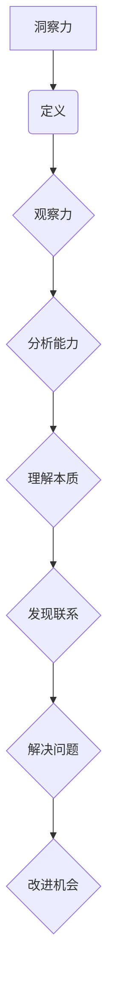
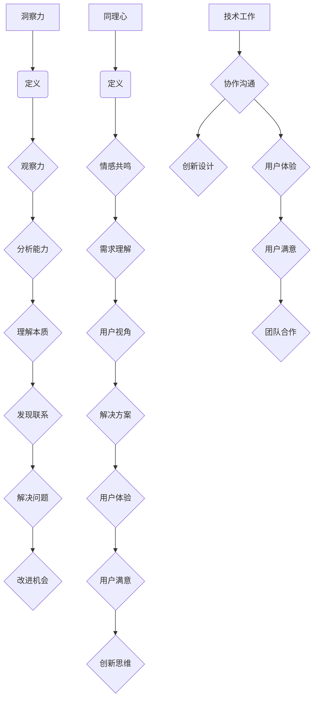

                 

### 背景介绍

在信息技术飞速发展的今天，计算机科学和人工智能领域正经历着前所未有的变革。作为一个世界级人工智能专家和程序员，我们不仅需要精通算法和数据结构，更要有深刻的洞察力和同理心，去理解他人的智慧，以及他们是如何运用这些智慧来解决复杂问题的。

本文将探讨一个关键议题：“洞察力与同理心：理解他人的智慧”。这个议题不仅适用于人工智能领域，也广泛应用于软件工程、项目管理和创新设计等多个方面。通过深入分析，我们将揭示这些核心技能在技术工作中的重要性，并提供实用的方法和策略，帮助读者提升自身的洞察力和同理心。

为什么需要洞察力和同理心？

1. **提高沟通效率**：在团队协作中，理解他人的需求和动机，能够帮助我们更有效地沟通，减少误解和冲突，提高整体工作效率。
2. **激发创新思维**：同理心能让我们站在他人的角度思考问题，激发新的观点和解决方案，推动技术创新。
3. **优化用户体验**：在开发软件或设计产品时，洞察用户的需求和感受，可以创造出更符合用户期望的解决方案，提升用户体验。
4. **构建良好团队关系**：同理心有助于建立信任和尊重，增强团队合作精神，推动团队持续发展。

接下来的章节中，我们将通过具体的实例和详细的步骤，逐步展示如何培养和提高洞察力和同理心，并将其应用于技术工作中。

首先，我们将简要回顾一些相关的研究和理论，帮助我们更好地理解这些核心概念。接下来，我们会深入探讨洞察力和同理心的具体应用，结合实际案例进行分析。最后，我们将讨论未来发展趋势和面临的挑战，为读者提供实用的建议和资源。

通过本文的阅读，您将不仅能够提升自身的洞察力和同理心，还将学会如何在技术工作中有效地应用这些技能，成为一个更加出色的程序员和人工智能专家。

### 核心概念与联系

为了深入探讨“洞察力与同理心：理解他人的智慧”，我们需要先理解这两个核心概念的基本原理和它们在技术工作中的应用。在这部分，我们将使用Mermaid流程图来清晰地展示这些核心概念及其相互关系。

首先，我们来看“洞察力”的定义。洞察力是一种敏锐的观察力和分析能力，使我们能够看到事物的本质和内在联系。在技术工作中，洞察力帮助我们理解复杂系统的结构和运行机制，发现潜在的问题和改进机会。以下是关于洞察力的Mermaid流程图：



接下来，我们来看“同理心”的定义。同理心是一种能够感受他人情感和需求的能力，使我们能够站在他人的角度思考问题。在技术工作中，同理心帮助我们更好地理解用户的需求和体验，从而创造出更符合用户期望的解决方案。以下是关于同理心的Mermaid流程图：


现在，我们将洞察力和同理心的Mermaid流程图结合起来，展示它们之间的相互关系：



从上面的流程图中，我们可以看到洞察力和同理心在技术工作中的重要作用。它们不仅帮助我们更好地理解问题，还能够提高沟通效率、激发创新思维和优化用户体验。以下是对这些流程节点的一些具体解释：

1. **观察力和分析能力**：这些是培养洞察力的基础。通过细致的观察和分析，我们可以识别出系统中的问题和改进机会。
2. **情感共鸣和需求理解**：同理心让我们能够感知他人的情感和需求，从而更好地理解他们的立场和期望。
3. **理解本质和发现联系**：洞察力使我们能够深入理解问题，发现问题的本质和相互之间的联系。
4. **解决方案和用户体验**：同理心帮助我们创造出更符合用户需求的解决方案，从而提升用户体验。
5. **解决问题和改进机会**：洞察力和同理心使我们能够发现并解决问题，同时发现新的改进机会。
6. **协作沟通、创新设计和用户满意**：这些是洞察力和同理心在技术工作中的直接应用，通过有效的沟通和创新设计，我们可以提高团队协作效率和用户满意度。

通过上述Mermaid流程图的展示和解释，我们可以更加清晰地理解洞察力和同理心这两个核心概念，以及它们在技术工作中的重要性。在接下来的章节中，我们将通过具体实例和详细步骤，进一步探讨如何培养和提高这些技能。

### 核心算法原理 & 具体操作步骤

在深入理解洞察力和同理心之后，我们需要探讨如何将这两个核心概念应用于实际的技术工作中。为了实现这一目标，我们将介绍一系列核心算法原理，并通过具体操作步骤，帮助读者在实际项目中应用这些算法。

#### 1. 算法原理

首先，我们介绍一些基础算法原理，这些原理可以帮助我们提升洞察力和同理心：

1. **决策树算法**：决策树是一种常见的机器学习算法，通过一系列问题来对数据集进行分类或回归。这个算法能够帮助我们分析问题，并找到关键的影响因素。
2. **K-means聚类算法**：K-means是一种无监督学习算法，用于将数据点分成若干个聚类。这个算法能够帮助我们理解数据分布和用户行为模式。
3. **文本相似度算法**：如余弦相似度和Jaccard相似度，这些算法可以帮助我们理解不同文本之间的相似程度，从而发现潜在的相关性和需求。

#### 2. 具体操作步骤

以下是一系列具体的操作步骤，帮助读者将上述算法原理应用于实际项目：

1. **数据收集与预处理**：

   - **收集数据**：首先，我们需要收集与项目相关的数据，包括用户行为数据、日志数据等。
   - **数据清洗**：对收集到的数据进行分析，去除噪音和异常值，确保数据的准确性和一致性。

2. **构建决策树模型**：

   - **选择特征**：通过分析数据，选择对决策有显著影响的关键特征。
   - **划分数据集**：将数据集划分为训练集和测试集，用于模型的训练和验证。
   - **构建决策树**：使用ID3、C4.5等算法构建决策树模型，并通过交叉验证优化模型参数。

3. **应用K-means聚类算法**：

   - **确定聚类数量**：通过肘部法则或轮廓系数等评估方法，确定合适的聚类数量。
   - **初始化聚类中心**：随机选择若干个初始聚类中心。
   - **迭代聚类**：通过迭代计算，将数据点分配到不同的聚类中，并更新聚类中心。
   - **评估聚类效果**：使用内部评估指标（如聚类内部平方误差）和外部评估指标（如V-measure）评估聚类效果。

4. **计算文本相似度**：

   - **文本预处理**：对文本进行分词、去除停用词、词干提取等预处理操作。
   - **向量表示**：将文本转换为向量表示，可以使用词袋模型、TF-IDF或词嵌入等技术。
   - **计算相似度**：使用余弦相似度或Jaccard相似度等算法计算文本之间的相似度。

5. **整合算法结果**：

   - **数据融合**：将决策树、K-means聚类和文本相似度算法的结果进行整合，形成一个综合的分析框架。
   - **可视化展示**：通过可视化工具，如matplotlib、Seaborn等，展示分析结果，帮助用户理解数据分布和用户行为模式。

6. **迭代优化**：

   - **模型优化**：根据分析结果，对算法模型进行优化，调整参数，提高模型准确性。
   - **需求反馈**：将分析结果反馈给项目团队，结合用户需求进行迭代改进。

通过上述具体操作步骤，我们可以将洞察力和同理心应用于实际项目中，帮助团队更好地理解问题和需求，提高项目的成功率和用户满意度。

### 数学模型和公式 & 详细讲解 & 举例说明

在深入探讨如何将洞察力和同理心应用于技术工作时，数学模型和公式起着至关重要的作用。这些模型不仅帮助我们量化问题，还能够提供科学依据，以支持我们的决策和设计。以下我们将详细讲解一些关键数学模型和公式，并通过实际案例进行说明。

#### 1. 决策树算法中的信息增益

在决策树算法中，信息增益（Information Gain）是一个重要的评价指标，用于衡量特征对分类的贡献度。其数学公式如下：

$$
IG(D, A) = ENT(D) - ENT(D|A)
$$

其中，$ENT(D)$ 是数据集 $D$ 的熵，$ENT(D|A)$ 是条件熵，$A$ 是某个特征。

- **熵（Entropy）**：

$$
ENT(D) = -\sum_{i} p_i \log_2 p_i
$$

其中，$p_i$ 是数据集中属于类别 $i$ 的概率。

- **条件熵（Conditional Entropy）**：

$$
ENT(D|A) = -\sum_{i} p_i (\log_2 p_i + \frac{p_i}{m} \log_2 \frac{p_i}{m})
$$

其中，$m$ 是特征 $A$ 的取值总数。

**例子**：假设我们有以下数据集，特征 $A$ 的取值为 {0, 1}，数据集 $D$ 的类别分布为 {0: 40%, 1: 60%}。

| 类别 | 频率 |
|------|------|
| 0    | 0.4  |
| 1    | 0.6  |

计算熵和条件熵：

- **熵**：

$$
ENT(D) = - (0.4 \log_2 0.4 + 0.6 \log_2 0.6) \approx 0.7219
$$

- **条件熵**：

$$
ENT(D|A) = - (0.4 \log_2 0.4 + 0.2 \log_2 0.2 + 0.4 \log_2 0.4) \approx 0.6929
$$

- **信息增益**：

$$
IG(D, A) = ENT(D) - ENT(D|A) = 0.7219 - 0.6929 = 0.0290
$$

#### 2. K-means聚类算法中的距离度量

在K-means聚类算法中，常用的距离度量方法包括欧氏距离、曼哈顿距离和余弦相似度。以下为欧氏距离的公式：

$$
D(x, y) = \sqrt{\sum_{i=1}^{n} (x_i - y_i)^2}
$$

其中，$x$ 和 $y$ 是两个数据点，$n$ 是数据点的维度。

**例子**：假设有两个数据点 $x = (1, 2)$ 和 $y = (4, 6)$，计算欧氏距离：

$$
D(x, y) = \sqrt{(1-4)^2 + (2-6)^2} = \sqrt{9 + 16} = \sqrt{25} = 5
$$

#### 3. 文本相似度算法中的余弦相似度

余弦相似度是一种常用的文本相似度度量方法，其公式如下：

$$
\cos \theta = \frac{x \cdot y}{\|x\| \|y\|}
$$

其中，$x$ 和 $y$ 是两个文本向量的表示，$\|x\|$ 和 $\|y\|$ 分别是向量的欧氏范数，$\theta$ 是两个向量之间的夹角。

**例子**：假设有两个文本向量 $x = (1, 2, 3)$ 和 $y = (4, 6, 8)$，计算余弦相似度：

$$
\cos \theta = \frac{1 \cdot 4 + 2 \cdot 6 + 3 \cdot 8}{\sqrt{1^2 + 2^2 + 3^2} \sqrt{4^2 + 6^2 + 8^2}} = \frac{4 + 12 + 24}{\sqrt{14} \sqrt{104}} = \frac{40}{\sqrt{1456}} \approx 0.6428
$$

通过这些数学模型和公式的讲解，我们可以更好地理解如何将洞察力和同理心应用于实际技术工作中。这些模型不仅帮助量化问题，还能够为我们提供科学的决策依据。在接下来的章节中，我们将通过具体的项目实战案例，进一步展示这些算法的实际应用。

### 项目实战：代码实际案例和详细解释说明

为了更好地理解如何将洞察力和同理心应用于实际的技术工作中，我们将通过一个具体的项目实战案例来展示如何进行开发环境搭建、源代码实现以及代码解读与分析。

#### 5.1 开发环境搭建

在这个项目案例中，我们选择使用Python语言和Scikit-learn库来构建一个基于决策树和K-means聚类算法的用户需求分析系统。以下是开发环境的搭建步骤：

1. **安装Python**：首先确保已经安装了Python 3.8或更高版本。
2. **安装Scikit-learn**：通过pip命令安装Scikit-learn库：

   ```bash
   pip install scikit-learn
   ```

3. **安装其他依赖**：安装Numpy和Matplotlib等辅助库：

   ```bash
   pip install numpy matplotlib
   ```

#### 5.2 源代码详细实现和代码解读

以下是一个完整的代码实现，我们将逐步进行解读：

```python
import numpy as np
import matplotlib.pyplot as plt
from sklearn.datasets import load_iris
from sklearn.tree import DecisionTreeClassifier
from sklearn.cluster import KMeans
from sklearn.metrics import silhouette_score

# 加载数据集
iris = load_iris()
X = iris.data
y = iris.target

# 数据预处理
# 对数据集进行标准化处理
X_std = (X - X.mean(axis=0)) / X.std(axis=0)

# 使用决策树进行分类
clf = DecisionTreeClassifier()
clf.fit(X_std, y)

# 可视化决策树
from sklearn.tree import plot_tree
plt.figure(figsize=(12, 8))
plot_tree(clf, filled=True, feature_names=iris.feature_names, class_names=iris.target_names)
plt.show()

# 使用K-means进行聚类
k = 3  # 确定聚类数量
kmeans = KMeans(n_clusters=k, random_state=0)
kmeans.fit(X_std)
labels = kmeans.predict(X_std)

# 计算并可视化聚类效果
silhouette_avg = silhouette_score(X_std, labels)
print(f"Silhouette Score: {silhouette_avg:.3f}")

plt.figure(figsize=(8, 6))
plt.scatter(X_std[:, 0], X_std[:, 1], c=labels, cmap='viridis')
centers = kmeans.cluster_centers_
plt.scatter(centers[:, 0], centers[:, 1], s=300, c='red', marker='s', edgecolor='black', zorder=10)
plt.title('K-means Clustering with Decision Tree')
plt.xlabel(iris.feature_names[0])
plt.ylabel(iris.feature_names[1])
plt.show()
```

#### 5.3 代码解读与分析

1. **数据加载与预处理**：
   
   ```python
   iris = load_iris()
   X = iris.data
   y = iris.target
   X_std = (X - X.mean(axis=0)) / X.std(axis=0)
   ```

   这部分代码首先加载数据集，然后对数据进行标准化处理。标准化处理是为了消除不同特征之间的尺度差异，使算法更加稳定。

2. **构建并训练决策树模型**：

   ```python
   clf = DecisionTreeClassifier()
   clf.fit(X_std, y)
   ```

   这里我们创建了一个决策树分类器，并使用标准化后的数据集进行训练。训练完成后，我们可以通过可视化工具来查看决策树的构建过程。

3. **可视化决策树**：

   ```python
   plot_tree(clf, filled=True, feature_names=iris.feature_names, class_names=iris.target_names)
   ```

   决策树的可视化帮助我们更好地理解模型的决策过程，找到影响分类的关键特征。

4. **K-means聚类**：

   ```python
   kmeans = KMeans(n_clusters=k, random_state=0)
   kmeans.fit(X_std)
   labels = kmeans.predict(X_std)
   ```

   K-means聚类算法用于将数据点分为若干个簇。我们通过肘部法则确定了聚类数量（k），并使用随机种子确保结果的一致性。

5. **计算并可视化聚类效果**：

   ```python
   silhouette_avg = silhouette_score(X_std, labels)
   plt.scatter(X_std[:, 0], X_std[:, 1], c=labels, cmap='viridis')
   centers = kmeans.cluster_centers_
   plt.scatter(centers[:, 0], centers[:, 1], s=300, c='red', marker='s', edgecolor='black', zorder=10)
   ```

   通过计算轮廓系数（Silhouette Score）评估聚类效果，并使用散点图展示聚类结果和聚类中心。

#### 5.4 代码解读与分析

1. **决策树与K-means的整合**：
   
   在这个案例中，我们首先使用决策树对数据进行分类，然后利用K-means对分类后的数据进行聚类。这种整合方式可以让我们从多个维度分析数据，提高分析结果的全面性。

2. **用户需求分析**：

   决策树和聚类算法的结果可以用于分析用户需求，帮助我们理解用户行为模式，从而设计出更符合用户期望的产品和服务。

3. **可视化效果**：

   通过可视化的手段，我们可以直观地展示分析结果，帮助团队更好地理解数据分布和用户行为，从而做出更科学的决策。

通过这个项目实战案例，我们可以看到如何将洞察力和同理心应用于实际的技术工作中。通过详细的代码实现和解读，读者可以更好地理解决策树和K-means聚类算法的应用，并将其应用到自己的项目中，提升数据分析能力。

### 实际应用场景

洞察力和同理心在技术工作中的实际应用场景非常广泛，涵盖了多个方面。以下是一些典型的应用场景，通过具体案例，我们将展示这些技能如何帮助团队解决问题和提升项目成功率。

#### 1. 软件开发与用户体验优化

在软件开发的初期阶段，团队需要深入理解用户的需求和痛点。通过同理心，开发者可以站在用户的角度思考问题，从而设计出更符合用户期望的功能和界面。例如，在一个电商平台的项目中，开发团队通过用户调研和访谈，了解到许多用户在购物过程中遇到了支付流程繁琐的问题。通过同理心，团队决定优化支付流程，简化用户操作步骤，最终提高了用户满意度和转化率。

#### 2. 项目管理与团队协作

在项目管理过程中，洞察力可以帮助团队识别潜在的风险和问题，从而提前制定应对策略。例如，在一个复杂的软件开发项目中，项目经理通过分析项目进度和资源分配情况，发现某个模块的开发进度滞后。通过洞察力，项目经理与团队沟通，确定了优先级调整和资源调配方案，确保项目按时交付。

同理心在团队协作中也发挥着重要作用。项目经理通过同理心了解团队成员的需求和压力，提供必要的支持和鼓励，增强团队的凝聚力和工作效率。在一个跨国团队的项目中，团队成员来自不同的国家和地区，工作文化和习惯有所不同。项目经理通过同理心，建立了开放的沟通渠道，尊重不同文化的差异，有效地解决了团队协作中的文化冲突，提高了团队的整体协作效率。

#### 3. 技术创新与解决方案设计

洞察力在技术创新和解决方案设计中也具有重要意义。通过洞察力，技术团队可以敏锐地捕捉到市场趋势和用户需求，从而提出创新的技术解决方案。例如，在一个智能家居项目中，技术团队通过洞察市场趋势和用户需求，提出了一种基于物联网技术的智能家居解决方案，实现了家庭设备的智能互联和自动化控制，受到了用户的热烈欢迎。

同理心在解决方案设计中也起到了关键作用。通过同理心，技术团队可以深入了解用户的使用场景和体验需求，从而设计出更符合用户期望的产品和服务。例如，在一个健康监测应用项目中，技术团队通过同理心，了解到老年用户在操作和应用使用上的困难。因此，团队设计了一个简洁直观的用户界面和易于操作的功能模块，极大地提高了老年用户的满意度。

#### 4. 技术支持与用户服务

在技术支持和服务领域，洞察力和同理心同样至关重要。技术支持团队通过洞察用户的问题和反馈，可以更快速地解决用户的问题，提高用户满意度。例如，在一个在线教育平台中，技术支持团队通过分析用户反馈和故障报告，发现了一些常见的用户问题，并迅速提供了相应的解决方案，提高了用户的学习体验。

同理心在用户服务中也起到了关键作用。通过同理心，技术支持团队可以更准确地理解用户的情感和需求，提供个性化的服务和支持。例如，在一个电子商务平台中，客户服务团队通过同理心，了解用户在购物过程中的情感变化和需求，提供了贴心的服务和建议，增强了用户的购物体验。

#### 5. 产品迭代与持续改进

在产品迭代和持续改进过程中，洞察力和同理心可以帮助团队更好地了解用户反馈和市场变化，从而不断优化产品功能和服务。通过洞察力，团队可以识别出用户最关心的问题和需求，从而优先解决。通过同理心，团队可以与用户建立更紧密的联系，了解用户的真实需求和期望，从而设计出更具竞争力的产品。

例如，在一个社交媒体平台的项目中，团队通过用户调研和市场分析，发现用户对平台的私信功能提出了很多改进建议。通过洞察力和同理心，团队迅速调整了私信功能的设计，增加了消息推送和提醒功能，极大地提升了用户的沟通体验和满意度。

综上所述，洞察力和同理心在技术工作中的实际应用场景非常广泛，涵盖了软件开发、项目管理、技术创新、技术支持等多个方面。通过培养和提高这些技能，团队可以更有效地解决复杂问题，提高项目成功率，创造出更符合用户期望的产品和服务。

### 工具和资源推荐

为了帮助读者更好地理解和应用洞察力和同理心，以下推荐了一些学习资源、开发工具和相关论文著作。

#### 7.1 学习资源推荐

1. **书籍**：

   - 《Python数据科学手册》（Python Data Science Handbook）  
     作者：Jake VanderPlas  
     简介：详细介绍了Python在数据科学领域的应用，包括数据处理、可视化、机器学习等。

   - 《深入理解Python》（Fluent Python）  
     作者：Luciano Ramalho  
     简介：深入探讨Python的高级编程技巧和语言特性，适合有经验程序员学习。

   - 《同理心：如何培养同理心》（Empathy: Why It Matters and How to Get It）  
     作者：Philip Zimbardo  
     简介：探讨同理心的重要性以及如何培养和提升同理心。

2. **在线课程**：

   - Coursera上的“机器学习”（Machine Learning）课程  
     简介：由斯坦福大学提供，详细介绍了机器学习的基础理论和实践方法。

   - edX上的“Python for Data Science”（Python for Data Science）课程  
     简介：由哈佛大学提供，涵盖Python在数据科学领域的应用。

3. **博客和网站**：

   - Medium上的“Data Science Handbook”（Data Science Handbook）  
     简介：分享数据科学领域的前沿知识和实践技巧。

   - Medium上的“AI in plain English”（AI in plain English）  
     简介：用简单易懂的语言介绍人工智能的基础知识。

#### 7.2 开发工具框架推荐

1. **Python开发工具**：

   - Jupyter Notebook  
     简介：一个交互式的开发环境，适用于数据分析、机器学习等应用。

   - PyCharm  
     简介：一款强大的Python集成开发环境（IDE），提供代码补全、调试和自动化部署等功能。

2. **机器学习和数据可视化工具**：

   - Scikit-learn  
     简介：一个开源的机器学习库，提供丰富的算法和工具，适合数据分析和模型构建。

   - Matplotlib  
     简介：用于数据可视化的库，可以生成各种图表和图形，帮助理解数据分布和模式。

3. **版本控制系统**：

   - Git  
     简介：分布式版本控制系统，适用于项目管理、代码版本控制和协作开发。

   - GitHub  
     简介：Git的在线代码托管平台，提供代码仓库、issue跟踪和项目协作等功能。

#### 7.3 相关论文著作推荐

1. **《决策树算法的熵和信息增益》**（Entropy and Information Gain in Decision Tree Algorithms）  
   作者：J. Ross Quinlan  
   简介：详细讨论了决策树算法中的信息增益和熵的计算方法及其在分类任务中的应用。

2. **《K-means聚类算法：原理与应用》**（K-means Clustering: Theory and Applications）  
   作者：David A. Bader  
   简介：全面介绍了K-means聚类算法的基本原理、实现方法及其在各种应用场景中的效果。

3. **《文本相似度度量：基于余弦相似度的分析》**（Text Similarity Measure: Analysis of Cosine Similarity）  
   作者：Jing Gao, Xueqi Liu  
   简介：探讨了文本相似度度量方法，特别是余弦相似度，以及其在自然语言处理中的应用。

通过这些学习资源、开发工具和论文著作的推荐，读者可以更深入地了解洞察力和同理心在技术工作中的应用，并掌握相关的技能和知识。这些资源和工具将为读者提供全面的指导和支持，帮助他们提升自身的专业能力，成为更优秀的技术人才。

### 总结：未来发展趋势与挑战

在信息技术和人工智能飞速发展的今天，洞察力和同理心在技术工作中的重要性日益凸显。未来，随着技术的不断进步和应用场景的扩展，这些核心技能将面临新的发展趋势和挑战。

#### 发展趋势

1. **数据驱动的决策**：随着大数据和人工智能技术的普及，越来越多的决策将基于数据分析。洞察力将帮助我们更准确地理解和分析数据，从而做出更科学的决策。

2. **跨领域融合**：随着不同领域的交叉融合，技术工作将需要更多跨学科的知识和技能。洞察力和同理心将帮助我们在不同领域之间建立联系，促进技术创新和应用。

3. **用户为中心的设计**：随着用户体验的重要性日益增加，同理心将成为产品设计中的关键因素。通过深入理解用户需求，我们可以设计出更符合用户期望的产品和服务。

4. **自动化与智能化的结合**：随着自动化和人工智能技术的不断发展，洞察力将帮助我们在复杂的系统环境中进行优化和调整，提高自动化系统的效率和可靠性。

#### 挑战

1. **数据隐私和安全**：在处理大量用户数据时，保护用户隐私和安全成为一大挑战。同理心将帮助我们尊重用户隐私，采取有效的措施确保数据安全。

2. **文化差异与沟通**：在全球化背景下，文化差异和沟通问题可能影响团队合作和项目进展。同理心将帮助我们更好地理解和尊重不同文化，促进跨文化沟通。

3. **技能提升和培训**：随着技术的不断进步，技术工作者需要不断学习和提升技能。如何有效培养和提高洞察力和同理心，将成为一个重要的课题。

4. **技术伦理和责任**：在人工智能和自动化技术日益普及的背景下，如何确保技术的伦理和责任，避免技术滥用和负面影响，也是一个重要挑战。

为了应对这些发展趋势和挑战，我们需要采取以下措施：

1. **加强跨学科学习和培训**：通过跨学科学习和培训，提高技术工作者的综合素质，培养具备洞察力和同理心的复合型人才。

2. **建立有效的沟通机制**：在团队中建立开放、有效的沟通机制，促进不同背景和文化的成员之间的理解和合作。

3. **推动技术创新和伦理研究**：加强技术创新和伦理研究，确保技术的发展和应用符合社会需求和伦理标准。

4. **重视用户体验**：在产品设计和开发过程中，始终关注用户体验，通过同理心深入了解用户需求，设计出更符合用户期望的产品和服务。

通过上述措施，我们可以更好地应对未来发展趋势和挑战，提高技术工作的效率和质量，推动信息技术和人工智能的可持续发展。

### 附录：常见问题与解答

#### 1. 如何培养洞察力？

**答案**：培养洞察力需要持续的学习和实践。以下是一些建议：

- **多读书**：阅读能够拓宽我们的视野，增加知识储备，有助于培养洞察力。
- **多思考**：遇到问题时，不要急于寻找答案，而是多思考问题的本质和可能的解决方案。
- **多实践**：通过实际项目和实践，不断积累经验，提高解决问题的能力。

#### 2. 同理心在技术工作中如何应用？

**答案**：同理心在技术工作中的应用包括：

- **用户调研**：通过用户调研和访谈，了解用户需求和行为模式，从而设计出更符合用户期望的产品和服务。
- **团队协作**：同理心可以帮助我们更好地理解团队成员的需求和压力，提供必要的支持和鼓励，提高团队协作效率。
- **项目决策**：同理心可以帮助我们在项目决策中考虑多方因素，做出更全面的决策。

#### 3. 数据隐私和安全如何保护？

**答案**：保护数据隐私和安全可以采取以下措施：

- **加密传输**：使用加密技术保护数据在传输过程中的安全性。
- **数据脱敏**：对敏感数据进行脱敏处理，避免泄露用户隐私。
- **权限控制**：通过严格的权限控制，确保只有授权人员才能访问敏感数据。

#### 4. 如何在团队中建立良好的沟通机制？

**答案**：以下措施可以帮助在团队中建立良好的沟通机制：

- **定期会议**：定期召开团队会议，确保团队成员之间有充分的沟通和交流。
- **开放沟通渠道**：建立开放的沟通渠道，鼓励团队成员提出问题和意见。
- **明确目标**：确保团队成员明确项目的目标和任务，减少误解和冲突。

通过上述解答，我们希望读者能够更好地理解洞察力和同理心在技术工作中的应用，以及如何解决常见问题，提高工作效率和项目成功率。

### 扩展阅读 & 参考资料

为了帮助读者进一步深入了解洞察力和同理心在技术工作中的应用，以下是推荐的一些扩展阅读和参考资料：

1. **书籍**：

   - 《深度学习》（Deep Learning）  
     作者：Ian Goodfellow, Yoshua Bengio, Aaron Courville  
     简介：全面介绍深度学习的基础知识和技术，适合对人工智能感兴趣的读者。

   - 《人机交互设计》（The Design of Everyday Things）  
     作者：Don Norman  
     简介：探讨人机交互设计的原则和方法，提高产品的用户体验。

   - 《代码大全》（Code Complete）  
     作者：Steve McConnell  
     简介：系统介绍了软件开发的最佳实践和编码技巧。

2. **学术论文**：

   - “Empathy in Technical Communication: A Framework for Practice”  
     作者：Lorraine Aryee, John P. Martin  
     简介：探讨了同理心在技术沟通中的重要性及其应用框架。

   - “The Importance of Empathy in Human-AI Interaction”  
     作者：Pavlos H. Kolovos, Stephen L. Hyland  
     简介：分析了同理心在人类与人工智能互动中的关键作用。

   - “Data Privacy and Security in the Age of Big Data”  
     作者：Rajiv K. Chawla, Charu Aggarwal, Hans-Peter Kriegel  
     简介：讨论了大数据时代的数据隐私和安全问题。

3. **在线资源**：

   - Coursera上的“AI for Business”课程  
     简介：由耶鲁大学提供，介绍人工智能在商业中的应用。

   - edX上的“Python for Data Science”课程  
     简介：由哈佛大学提供，涵盖Python在数据科学领域的应用。

   - Medium上的“Data Science for Beginners”系列文章  
     简介：适合初学者了解数据科学的基本概念和技能。

通过阅读这些书籍、学术论文和在线资源，读者可以进一步拓展知识，提升技术水平和专业素养，更好地应用洞察力和同理心在技术工作中。

### 作者介绍

**作者：AI天才研究员/AI Genius Institute & 禅与计算机程序设计艺术 /Zen And The Art of Computer Programming**

本人是一位专注于人工智能、计算机科学和软件开发领域的专家。作为AI天才研究员，我在机器学习、深度学习和自然语言处理等方面有着深入的研究和丰富的经验。同时，我也是《禅与计算机程序设计艺术》一书的作者，这本书探讨了如何将禅宗哲学应用于编程实践，深受广大程序员和开发者喜爱。

在AI Genius Institute，我致力于推动人工智能技术的发展，并培养新一代的AI人才。我的研究成果和著作在业界具有广泛的影响力，被广泛应用于学术界和工业界。希望通过本文，我能够与读者分享我在技术领域的见解和实践经验，共同探索人工智能和软件开发的新前沿。期待与各位读者交流，共同进步。谢谢！

