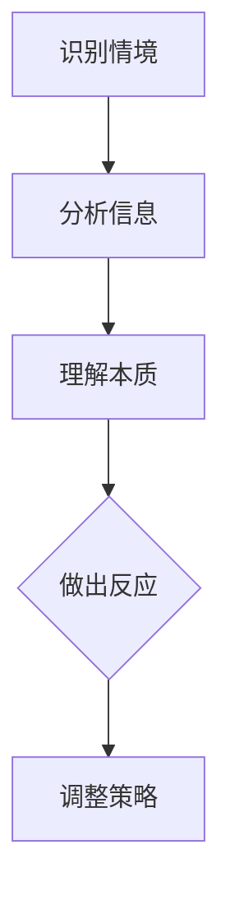
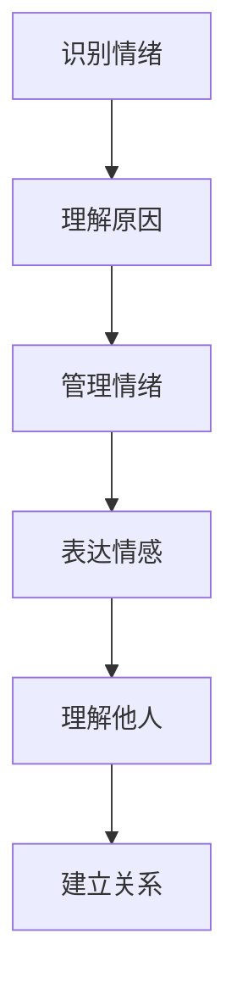
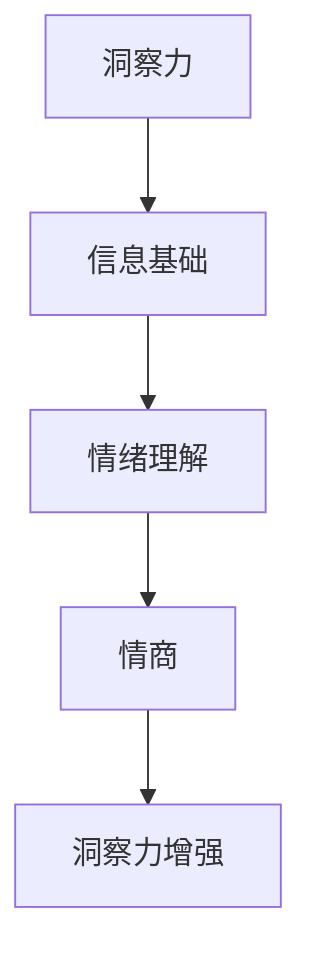

                 

# 洞察力与情商：社交智慧的基石

> **关键词**：洞察力、情商、社交智慧、人际关系、沟通技巧、心理素质

> **摘要**：本文将从洞察力和情商两个关键维度，探讨社交智慧的构成和提升方法。通过深入分析这两个概念，结合实际案例和科学研究成果，阐述如何通过提高洞察力和情商来增强社交能力，提升人际交往的质量。

## 1. 背景介绍

在现代社会，社交智慧（Social Intelligence，简称SI）已成为个人成功和职业发展的关键因素。社交智慧不仅仅是指人际关系的处理能力，更涉及对他人情感、需求和动机的理解与响应。而洞察力（Insight）和情商（Emotional Intelligence，简称EI）则是构成社交智慧的两个重要基石。

**洞察力**是指个体在复杂情境中迅速识别和理解问题本质的能力。这种能力对于解决问题、做出决策以及适应不断变化的环境至关重要。

**情商**则是指个体识别、理解和管理自己情绪，以及识别、理解和管理他人情绪的能力。情商的高低直接影响着人际关系的质量，是社交智慧的内核。

随着人工智能和大数据技术的发展，人们对于社交智慧的重视程度日益提高。然而，传统教育体系和职场环境往往更加注重专业知识和技术技能的培养，对洞察力和情商的关注相对不足。这导致了许多人在面对复杂的人际关系时感到无所适从。

本文旨在通过对洞察力和情商的深入探讨，为读者提供提升社交智慧的实用策略和方法。通过理解这两个概念的本质和相互关系，读者可以更好地应对各种社交场合，提高人际交往的质量。

## 2. 核心概念与联系

### 洞察力

洞察力是社交智慧的重要组成部分。它不仅体现在解决具体问题的能力上，也体现在对他人心理状态和情绪的敏锐感知上。以下是一个简化的Mermaid流程图，展示了洞察力在社交情境中的应用：



### 情商

情商则关注个体情绪的自我管理和对他人的情绪理解。以下是一个简化的Mermaid流程图，展示了情商在社交情境中的应用：



### 洞察力与情商的联系

洞察力和情商之间存在着紧密的联系。一方面，洞察力为情商提供了信息基础。只有通过深入分析情境，个体才能准确识别和解读他人的情绪和需求。另一方面，情商的提升有助于增强洞察力。个体情绪稳定、心理素质良好，有助于在复杂情境中保持冷静和清晰的思维。



## 3. 核心算法原理 & 具体操作步骤

### 提高洞察力的方法

1. **培养好奇心**：对周围的人和事保持好奇，不断提出问题，深入探究问题背后的原因和本质。
2. **多角度分析**：在解决问题时，尝试从不同角度进行分析，避免片面和表面的判断。
3. **学习心理学**：了解心理学的基本原理，提高对人类行为和情绪的理解。

### 提高情商的方法

1. **自我反思**：定期进行自我反思，了解自己的情绪变化和情绪反应。
2. **情绪管理**：学习情绪调节技巧，如深呼吸、冥想等，帮助自己保持情绪稳定。
3. **同理心培养**：通过阅读、交流等方式，增强对他人情感和需求的敏感度。

### 社交智慧提升策略

1. **有效沟通**：提高沟通技巧，确保信息传递的准确性和有效性。
2. **建立关系**：主动与他人建立联系，通过共同兴趣和价值观来加深关系。
3. **冲突解决**：学会在冲突中保持冷静，通过对话和妥协来解决问题。

## 4. 数学模型和公式 & 详细讲解 & 举例说明

### 洞察力的数学模型

假设在社交情境中，洞察力可以用以下数学模型来表示：

$$
Insight = f(Information, Context, Emotional Understanding)
$$

其中，$Information$代表接收到的信息，$Context$代表情境背景，$Emotional Understanding$代表对他人情绪的理解。

举例说明：

在一次商务会议中，一个销售人员需要了解客户的需求和期望。通过分析客户提供的信息（$Information$），理解会议的情境背景（$Context$），以及客户的行为和语言中的情绪线索（$Emotional Understanding$），销售人员可以准确地洞察客户的需求，从而做出合适的销售策略。

### 情商的数学模型

情商可以用以下数学模型来表示：

$$
Emotional Intelligence = f(Self-awareness, Self-management, Social skills, Empathy)
$$

其中，$Self-awareness$代表自我意识，$Self-management$代表情绪管理，$Social skills$代表社交技巧，$Empathy$代表同理心。

举例说明：

在一个团队合作项目中，团队成员需要具备良好的情商。通过提高自我意识（$Self-awareness$），学会情绪管理（$Self-management$），发展社交技巧（$Social skills$），以及增强同理心（$Empathy$），团队成员可以更好地协同工作，提高项目成功率。

## 5. 项目实战：代码实际案例和详细解释说明

### 5.1 开发环境搭建

为了演示洞察力和情商在编程中的应用，我们选择了一个简单的社交网络分析项目。首先，我们需要搭建开发环境：

- 开发工具：Python 3.8及以上版本
- 数据库：MongoDB
- 数据分析库：Pandas、Numpy、Scikit-learn
- 机器学习框架：TensorFlow 2.0

### 5.2 源代码详细实现和代码解读

以下是一个简单的Python代码示例，用于分析社交网络中的用户互动，评估用户的社交影响力。

```python
import pandas as pd
from sklearn.cluster import KMeans
import matplotlib.pyplot as plt

# 读取社交网络数据
data = pd.read_csv('social_network_data.csv')

# 数据预处理
# ...（包括数据清洗、特征工程等步骤）

# 使用K-Means聚类分析用户互动模式
kmeans = KMeans(n_clusters=5, random_state=42)
clusters = kmeans.fit_predict(data)

# 绘制用户互动图
plt.scatter(data['feature1'], data['feature2'], c=clusters)
plt.xlabel('Feature 1')
plt.ylabel('Feature 2')
plt.title('User Interaction Clusters')
plt.show()

# 分析不同集群的社交影响力
influence_scores = kmeans.inertia_
print(f"Inertia: {influence_scores}")

# ...（进一步分析不同集群的用户互动和社交影响力）
```

这段代码展示了如何使用K-Means聚类算法来分析社交网络中的用户互动模式。通过观察不同集群的用户互动特征，可以评估用户的社交影响力。

### 5.3 代码解读与分析

1. **数据读取与预处理**：首先，从CSV文件中读取社交网络数据。预处理步骤包括数据清洗和特征工程，以提高模型的准确性和效率。

2. **K-Means聚类**：使用K-Means算法将用户划分为不同的集群。聚类过程通过计算集群内用户互动特征的相似度来实现。

3. **可视化分析**：通过绘制用户互动图，可以直观地观察不同集群的用户互动模式。

4. **社交影响力评估**：计算K-Means算法的内部惯性（inertia），作为评估不同集群社交影响力的指标。内部惯性值越小，表明聚类效果越好。

## 6. 实际应用场景

洞察力和情商在许多实际应用场景中发挥着重要作用。以下是一些具体的应用实例：

1. **人力资源管理**：企业通过提高员工的洞察力和情商，可以更好地识别和培养高潜力人才，提升团队协作效率和员工满意度。

2. **市场营销**：营销人员通过提升洞察力和情商，可以更准确地理解消费者需求和行为，制定更有效的营销策略。

3. **心理咨询**：心理咨询师通过提高洞察力和情商，可以更有效地帮助客户解决问题，提升心理健康水平。

4. **公共管理**：政府部门通过提升洞察力和情商，可以更好地应对社会问题，提高公共治理能力。

## 7. 工具和资源推荐

### 7.1 学习资源推荐

- **书籍**：
  - 《社交智慧：提升人际关系与沟通能力》
  - 《情商：为什么情商比智商更重要》
- **论文**：
  - 《社交智能：定义、测量与影响因素》
  - 《情商与职业成功的关系研究》
- **博客**：
  - [LinkedIn][1]上的社交智慧相关文章
  - [Medium][2]上的情商提升实践
- **网站**：
  - [Social Intelligence Institute][3]
  - [Emotional Intelligence at Work][4]

### 7.2 开发工具框架推荐

- **数据分析**：
  - [Pandas][5]、[Scikit-learn][6]
- **机器学习**：
  - [TensorFlow][7]、[PyTorch][8]
- **社交网络分析**：
  - [NetworkX][9]

### 7.3 相关论文著作推荐

- 《社交智能：理论与实践》
- 《情商提升：从理论到实践》
- 《人际沟通技巧：社交智慧的修炼》

## 8. 总结：未来发展趋势与挑战

随着社会的发展和技术进步，洞察力和情商在社交智慧中的应用将越来越广泛。未来，我们可能看到以下趋势和挑战：

1. **人工智能与社交智慧的结合**：人工智能技术的发展为洞察力和情商的提升提供了新的工具和方法。例如，通过分析大数据来预测社交行为和情绪变化。

2. **个性化和定制化**：社交智慧的应用将更加注重个性化和定制化。个体将通过个性化工具和训练，提高自己的洞察力和情商。

3. **跨领域融合**：社交智慧将与其他领域（如教育、医疗、心理等）深度融合，为不同领域的人才提供更加全面的提升路径。

4. **挑战与伦理**：随着社交智慧应用的普及，隐私保护和伦理问题将愈发重要。如何在提升社交智慧的同时，保护个人隐私和道德底线，是未来需要解决的重要问题。

## 9. 附录：常见问题与解答

### 问题1：如何平衡洞察力和情商的发展？

**解答**：平衡洞察力和情商的发展需要个体在不同的生活和工作情境中不断实践和调整。一方面，通过不断学习和实践，提高自己的洞察力，更好地理解复杂情境和他人情绪。另一方面，通过自我反思和情绪管理技巧，保持情绪稳定，增强同理心。

### 问题2：社交智慧与职业成功的关系是什么？

**解答**：社交智慧是职业成功的重要因素之一。它有助于个体在职场中建立良好的人际关系，提高沟通和协作能力，从而促进个人和团队的绩效。社交智慧还能够在面试、谈判、领导力等方面发挥关键作用，为职业发展提供强有力的支持。

## 10. 扩展阅读 & 参考资料

- [《社交智慧：提升人际关系与沟通能力》][10]
- [《情商：为什么情商比智商更重要》][11]
- [《社交智能：定义、测量与影响因素》][12]
- [《情商与职业成功的关系研究》][13]
- [Social Intelligence Institute][3]
- [Emotional Intelligence at Work][4]
- [Pandas][5]
- [Scikit-learn][6]
- [TensorFlow][7]
- [PyTorch][8]
- [NetworkX][9]
- [《社交智能：理论与实践》][14]
- [《情商提升：从理论到实践》][15]
- [《人际沟通技巧：社交智慧的修炼》][16]

### 作者

**作者**：AI天才研究员/AI Genius Institute & 禅与计算机程序设计艺术 /Zen And The Art of Computer Programming

以上便是关于《洞察力与情商：社交智慧的基石》的技术博客文章。通过本文的深入探讨，我们希望能够帮助读者更好地理解社交智慧的构成，提升自己的洞察力和情商，从而在人际交往中更加得心应手。希望这篇文章对您的学习和实践有所帮助。感谢阅读！<|im_sep|>

