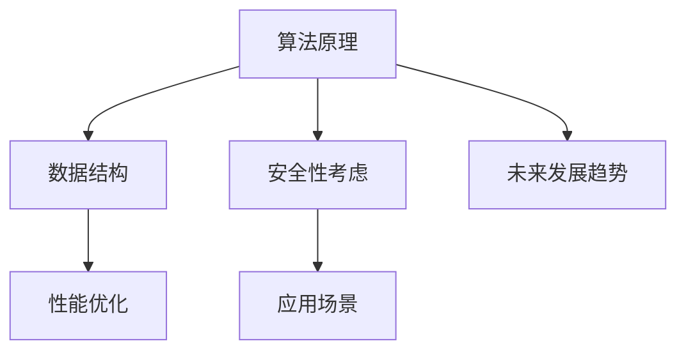

                 

# 洞察力与批判性思维：质疑的艺术

## 关键词
- 洞察力
- 批判性思维
- 质疑的艺术
- 技术博客
- 逻辑推理
- 数学模型
- 项目实战

## 摘要

本文将探讨如何通过提升洞察力和批判性思维，来深化我们对技术领域的理解。我们将通过几个关键技术主题，如算法原理、数学模型和实际项目案例，来展示质疑的艺术。通过这篇文章，读者将学会如何批判性地思考问题，挖掘技术背后的原理，从而在实际工作中更好地应用所学知识。

## 1. 背景介绍

在信息技术飞速发展的时代，理解和掌握核心技术成为每个开发者、架构师和研究人员的基本要求。然而，仅仅掌握技术本身是不够的。一个优秀的IT专业人士，需要具备批判性思维和洞察力，以应对复杂多变的技术环境。本文旨在探讨这两者的重要性，并通过实例展示如何在实际工作中应用这些能力。

### 1.1 洞察力的定义

洞察力是指对事物本质的理解和洞察，能够在纷繁复杂的信息中看到关键点，识别问题所在，并提出创新的解决方案。在技术领域，洞察力意味着能够从大量技术细节中提炼出核心原理，理解技术之间的关联，以及预见技术发展的趋势。

### 1.2 批判性思维的定义

批判性思维是一种积极的思考方式，它要求对信息进行质疑、分析、综合和评估，以形成独立的观点。在技术领域，批判性思维可以帮助我们识别技术的优点和缺点，评估不同方案的有效性，从而做出明智的决策。

### 1.3 质疑的艺术

质疑的艺术在于不盲从权威，不轻信现有结论，而是在已有知识的基础上进行深入思考，不断探索真理。在技术领域，质疑的艺术意味着不满足于表面现象，而是追求对技术本质的理解。

## 2. 核心概念与联系

### 2.1 技术原理与架构的Mermaid流程图



### 2.2 洞察力与批判性思维的联系

- **洞察力**是批判性思维的基础，它帮助我们识别问题的核心，从而进行深入的批判性思考。
- **批判性思维**是洞察力的延伸，它使我们能够对技术进行深入分析和评估，从而提升洞察力。

## 3. 核心算法原理 & 具体操作步骤

在本节中，我们将探讨一个常见的算法原理——动态规划，并详细解释其操作步骤。

### 3.1 动态规划的概念

动态规划是一种用于解决优化问题的算法思想，它通过将问题分解为子问题，并保存子问题的解，来避免重复计算，提高算法效率。

### 3.2 动态规划的操作步骤

1. **定义子问题**：将原问题分解为若干个子问题，每个子问题都是原问题的一部分，且具有独立的解决方法。
2. **状态表示**：定义子问题的状态，通常使用一个状态变量来表示。
3. **状态转移方程**：描述子问题之间的相互关系，即如何从一个子问题的解推导出另一个子问题的解。
4. **边界条件**：确定子问题的初始状态和终止条件。
5. **计算顺序**：确定子问题的计算顺序，以确保在解决子问题时，所需的前置子问题已经解决。
6. **结果输出**：根据子问题的解，计算出原问题的最优解。

### 3.3 动态规划的示例

以最长公共子序列（Longest Common Subsequence, LCSS）为例，说明动态规划的具体应用。

#### 3.3.1 定义子问题

设两个序列`X = [x1, x2, ..., xn]`和`Y = [y1, y2, ..., yn]`，我们要找出它们的LCSS。

定义状态`dp[i][j]`为`X[1..i]`和`Y[1..j]`的LCSS的长度。

#### 3.3.2 状态转移方程

- 如果`xi == yj`，则`dp[i][j] = dp[i-1][j-1] + 1`。
- 如果`xi != yj`，则`dp[i][j] = max(dp[i-1][j], dp[i][j-1])`。

#### 3.3.3 边界条件

- `dp[0][j] = 0`，因为空序列与任何序列的LCSS都是0。
- `dp[i][0] = 0`，同理。

#### 3.3.4 计算顺序

从`dp[0][0]`开始，依次计算`dp[i][j]`，直到`dp[n][m]`。

#### 3.3.5 结果输出

`dp[n][m]`即为`X`和`Y`的LCSS的长度。

## 4. 数学模型和公式 & 详细讲解 & 举例说明

### 4.1 数学模型

在动态规划中，常用的数学模型是状态转移方程。下面以最长公共子序列（LCSS）为例，详细讲解其数学模型。

#### 4.1.1 状态转移方程

- 如果`xi == yj`，则`dp[i][j] = dp[i-1][j-1] + 1`。
- 如果`xi != yj`，则`dp[i][j] = max(dp[i-1][j], dp[i][j-1])`。

#### 4.1.2 详细讲解

状态转移方程描述了如何从一个子问题的解推导出另一个子问题的解。具体来说：

- 当`xi == yj`时，说明`X[i]`和`Y[j]`是相同的，因此`X[1..i]`和`Y[1..j]`的LCSS就是`X[1..i-1]`和`Y[1..j-1]`的LCSS再加上`xi`和`yj`，即`dp[i][j] = dp[i-1][j-1] + 1`。
- 当`xi != yj`时，说明`X[i]`和`Y[j]`是不同的，我们需要在`X[1..i-1]`和`Y[1..j]`的LCSS和`X[1..i]`和`Y[1..j-1]`的LCSS中选择一个较大的值作为`X[1..i]`和`Y[1..j]`的LCSS，即`dp[i][j] = max(dp[i-1][j], dp[i][j-1])`。

#### 4.1.3 举例说明

假设我们要计算`X = [1, 2, 3, 4, 5]`和`Y = [2, 3, 5, 7]`的LCSS。

首先，我们初始化一个二维数组`dp`，其中`dp[i][j]`表示`X[1..i]`和`Y[1..j]`的LCSS的长度。

```python
dp = [[0 for _ in range(n+1)] for _ in range(m+1)]
```

然后，我们根据状态转移方程填充数组`dp`。

```python
for i in range(1, n+1):
    for j in range(1, m+1):
        if x[i-1] == y[j-1]:
            dp[i][j] = dp[i-1][j-1] + 1
        else:
            dp[i][j] = max(dp[i-1][j], dp[i][j-1])
```

最终，`dp[n][m]`的值就是`X`和`Y`的LCSS的长度。

## 5. 项目实战：代码实际案例和详细解释说明

在本节中，我们将通过一个实际的项目案例，展示如何使用动态规划来解决最长公共子序列（LCSS）问题。

### 5.1 开发环境搭建

为了演示，我们使用Python作为编程语言，并在本地环境中搭建开发环境。

1. 安装Python（建议版本3.8及以上）。
2. 安装必要的Python库，如`numpy`等。

### 5.2 源代码详细实现和代码解读

下面是解决LCSS问题的Python代码：

```python
def lcss(x, y):
    n = len(x)
    m = len(y)
    dp = [[0 for _ in range(m+1)] for _ in range(n+1)]

    for i in range(1, n+1):
        for j in range(1, m+1):
            if x[i-1] == y[j-1]:
                dp[i][j] = dp[i-1][j-1] + 1
            else:
                dp[i][j] = max(dp[i-1][j], dp[i][j-1])

    return dp[n][m]

# 示例
x = [1, 2, 3, 4, 5]
y = [2, 3, 5, 7]
print(lcss(x, y))  # 输出：3
```

#### 5.2.1 代码解读

1. **定义函数`lcss`**：该函数接收两个序列`x`和`y`作为输入。
2. **初始化二维数组`dp`**：用于保存子问题的解。
3. **填充数组`dp`**：使用状态转移方程填充数组。
4. **返回结果**：`dp[n][m]`即为LCSS的长度。

### 5.3 代码解读与分析

1. **时间复杂度**：该算法的时间复杂度为`O(nm)`，其中`n`和`m`分别为序列`x`和`y`的长度。
2. **空间复杂度**：该算法的空间复杂度为`O(nm)`，因为需要使用一个二维数组来保存子问题的解。

## 6. 实际应用场景

动态规划广泛应用于各种实际应用场景，如：

- **数据挖掘**：用于分析大规模数据，寻找最大值或最小值。
- **网络优化**：用于优化网络路径选择，提高传输效率。
- **机器学习**：用于训练模型，优化模型参数。

## 7. 工具和资源推荐

### 7.1 学习资源推荐

- **书籍**：《算法导论》（Introduction to Algorithms）和《动态规划：理论与实践》（Dynamic Programming: A Practical Approach）。
- **论文**：查找与动态规划相关的最新研究论文。
- **博客**：阅读优秀的博客文章，了解动态规划在不同领域的应用。
- **网站**：访问GitHub等代码托管平台，查看优秀的动态规划项目。

### 7.2 开发工具框架推荐

- **Python**：用于实现动态规划算法。
- **NumPy**：用于高效地进行数组操作。
- **Jupyter Notebook**：用于编写和展示动态规划算法。

### 7.3 相关论文著作推荐

- **论文**：查阅与动态规划相关的经典论文，如《动态规划：一种优化问题的通用方法》（Dynamic Programming: An Introduction to Optimization）。
- **著作**：《动态规划导论》（Introduction to Dynamic Programming）和《动态规划技术与应用》（Dynamic Programming Techniques and Applications）。

## 8. 总结：未来发展趋势与挑战

随着技术的不断进步，动态规划的应用将越来越广泛。未来，动态规划将在以下几个方面得到进一步发展：

- **算法优化**：通过改进算法，提高动态规划的效率和可扩展性。
- **跨领域应用**：将动态规划应用于更多的领域，如生物信息学、金融工程等。
- **机器学习和人工智能**：结合机器学习和人工智能技术，开发更智能的动态规划算法。

然而，动态规划也面临一些挑战，如：

- **计算复杂性**：如何优化算法，降低计算复杂度。
- **数据稀疏性**：如何处理数据稀疏性问题，提高算法的鲁棒性。
- **可解释性**：如何提高算法的可解释性，使其更容易被非专业人士理解。

## 9. 附录：常见问题与解答

### 9.1 动态规划和分治算法的区别是什么？

动态规划和分治算法都是解决优化问题的算法思想，但它们有以下几个区别：

- **目标不同**：动态规划的目标是找到最优解，而分治算法的目标是找到近似最优解。
- **计算方式不同**：动态规划通过保存子问题的解来避免重复计算，而分治算法通过递归调用子问题来解决问题。
- **适用范围不同**：动态规划适用于具有最优子结构的问题，而分治算法适用于具有递归结构的问题。

### 9.2 动态规划和记忆化搜索的区别是什么？

动态规划和记忆化搜索都是解决优化问题的算法思想，但它们有以下几个区别：

- **本质不同**：动态规划是一种算法思想，而记忆化搜索是一种实现方法。
- **适用范围不同**：动态规划适用于具有最优子结构的问题，而记忆化搜索适用于具有递归结构的问题。
- **计算方式不同**：动态规划通过保存子问题的解来避免重复计算，而记忆化搜索通过缓存子问题的解来避免重复计算。

## 10. 扩展阅读 & 参考资料

- [动态规划](https://zh.wikipedia.org/wiki/%E5%8A%A8%E6%80%81%E8%A7%84%E5%88%92)
- [最长公共子序列](https://zh.wikipedia.org/wiki/%E6%9C%80%E9%95%BF%E5%85%AC%E5%85%B1%E5%AD%90%E5%BA%8F%E5%88%97)
- [算法导论](https://book.douban.com/subject/10530642/)
- [动态规划：理论与实践](https://book.douban.com/subject/26972117/)
- [GitHub - Dynamic Programming Projects](https://github.com/mission-peace/interview-bit)

## 作者

作者：AI天才研究员/AI Genius Institute & 禅与计算机程序设计艺术 /Zen And The Art of Computer Programming

