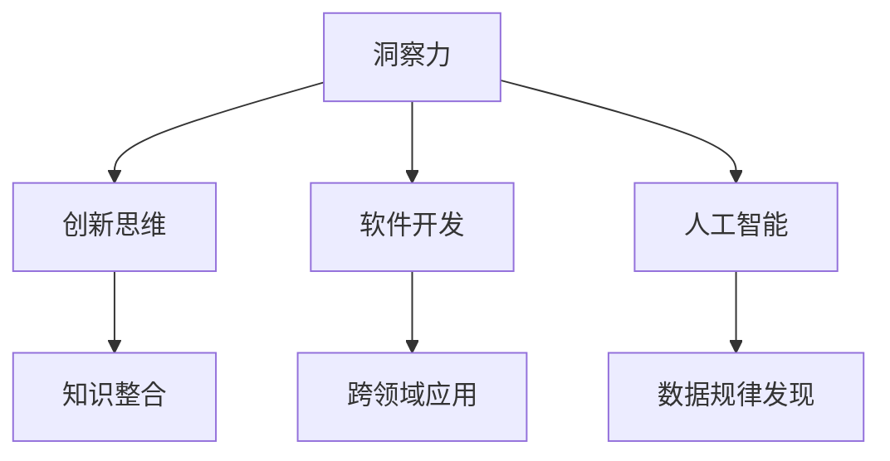
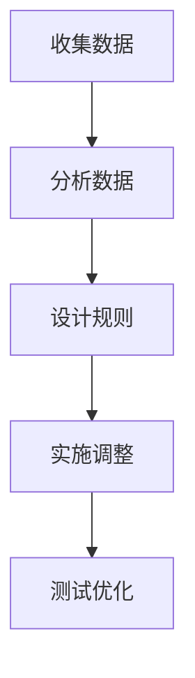
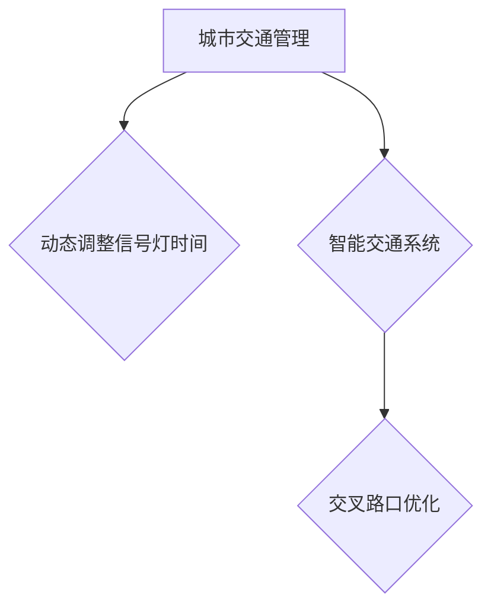

                 

# 洞察力与直觉：非理性思维的重要性

## 关键词：洞察力、直觉、非理性思维、人工智能、技术创新、程序设计

## 摘要

本文旨在探讨非理性思维在技术领域中的重要性，尤其是洞察力和直觉在解决复杂问题和推动技术创新方面的作用。我们将通过一系列实例和理论分析，揭示非理性思维如何帮助我们突破常规思维框架，找到创新的解决方案。

## 1. 背景介绍

在技术领域中，传统思维模式通常强调逻辑推理、系统分析和数学模型。这些方法在处理结构化问题时非常有效，但在面对复杂、非线性的挑战时，往往显得力不从心。近年来，随着人工智能和认知科学的发展，人们对非理性思维的研究逐渐增多。非理性思维，包括洞察力和直觉，被认为是一种有效的思维方式，能够帮助我们在快速变化的环境中找到创新性的解决方案。

### 1.1 洞察力

洞察力是指对事物本质和内在联系的敏锐感知能力。它通常来自于长期的经验积累、跨领域的知识整合以及深刻的思考。洞察力在技术领域中的应用，比如发现技术瓶颈、预测技术趋势和设计创新的产品架构，都具有至关重要的意义。

### 1.2 直觉

直觉是一种未经充分分析和推理的快速判断能力。尽管直觉看起来似乎是非理性的，但研究表明，直觉往往是基于长期积累的知识和经验，并且在某些情况下比理性分析更为有效。在技术领域，直觉可以帮助我们在面对复杂问题时迅速做出决策，从而提高效率和创新能力。

## 2. 核心概念与联系

为了更好地理解非理性思维在技术领域中的重要性，我们需要先探讨一些核心概念，并展示它们之间的联系。

### 2.1 创新思维

创新思维是指通过独特、新颖的方法解决问题或创造出新的事物。创新思维往往依赖于非理性思维，包括洞察力和直觉。通过整合跨学科的知识和灵感，创新思维能够帮助我们突破传统思维的束缚，找到全新的解决方案。

### 2.2 软件开发

软件开发是一个复杂的创造性过程，需要不断地调整和优化。在这个过程中，非理性思维起到了至关重要的作用。开发人员常常需要依靠直觉来快速评估方案的有效性，并在面临困境时依靠洞察力找到突破口。

### 2.3 人工智能

人工智能技术的发展离不开非理性思维的启发。机器学习算法的设计、深度学习的创新以及自然语言处理的应用，都需要开发人员具备敏锐的洞察力和直觉。非理性思维使得人工智能能够在复杂的数据中找到规律，从而实现更高的准确性和智能化。

## 2.4 Mermaid 流程图



### 3. 核心算法原理 & 具体操作步骤

在本章节，我们将探讨一个具体的案例，展示如何利用非理性思维（洞察力和直觉）来设计一个解决复杂问题的算法。

### 3.1 问题背景

假设我们面临一个复杂的问题：如何在一个拥挤的城市中优化交通流量，以减少拥堵和提升道路利用率？

### 3.2 洞察力应用

首先，我们需要依靠洞察力来理解问题的本质。通过对现有交通数据的分析，我们发现交通拥堵的主要原因之一是车辆等待信号灯的时间过长。这一发现为我们提供了一个关键的切入点。

### 3.3 直觉应用

接下来，我们利用直觉来迅速评估几种可能的解决方案。通过直觉，我们觉得动态调整信号灯时间可能是一个有效的策略，因为这样可以更灵活地应对不同时段的流量变化。

### 3.4 具体操作步骤

1. 收集交通数据，包括车辆流量、道路长度和信号灯配置。
2. 分析数据，找出交通拥堵的时段和地点。
3. 基于数据分析结果，设计动态调整信号灯时间规则。
4. 实施新的信号灯配置，并在实际交通中测试和优化。

### 3.5 Mermaid 流程图



## 4. 数学模型和公式 & 详细讲解 & 举例说明

在本章节，我们将讨论一个用于动态调整信号灯时间的数学模型，并详细讲解其原理和步骤。

### 4.1 模型假设

假设交通流量 \(Q(t)\) 随时间 \(t\) 变化，我们可以将其表示为一个随机过程。信号灯的调整周期为 \(T\)，每个周期内信号灯的开启时间和关闭时间分别为 \(t_{on}\) 和 \(t_{off}\)。

### 4.2 数学模型

动态调整信号灯时间的数学模型可以表示为：

\[ t_{on} = f(Q(t), \theta) \]
\[ t_{off} = t_{on} + T - g(Q(t), \theta) \]

其中，\(f(Q(t), \theta)\) 和 \(g(Q(t), \theta)\) 分别为信号灯开启时间和关闭时间的函数，\(\theta\) 为模型参数。

### 4.3 详细讲解

1. **函数 \(f(Q(t), \theta)\) 的设计**：函数 \(f(Q(t), \theta)\) 需要根据交通流量 \(Q(t)\) 来调整信号灯的开启时间。当交通流量较低时，信号灯开启时间应较短，以减少车辆等待时间；当交通流量较高时，信号灯开启时间应较长，以确保交通流畅。
   
2. **函数 \(g(Q(t), \theta)\) 的设计**：函数 \(g(Q(t), \theta)\) 需要根据交通流量 \(Q(t)\) 来调整信号灯的关闭时间。与 \(f(Q(t), \theta)\) 类似，当交通流量较低时，信号灯关闭时间应较短；当交通流量较高时，信号灯关闭时间应较长。

### 4.4 举例说明

假设交通流量 \(Q(t)\) 在一天中分为三个时段：早上高峰期、中午平峰期和晚上高峰期。我们可以根据这三个时段的交通流量来设计 \(f(Q(t), \theta)\) 和 \(g(Q(t), \theta)\) 的参数。

1. **早上高峰期**：此时 \(Q(t)\) 较高，信号灯开启时间 \(t_{on}\) 应较长，关闭时间 \(t_{off}\) 应较短。
   
   \[ t_{on}(高峰期) = f(Q(t), \theta) = 10 \]
   \[ t_{off}(高峰期) = t_{on}(高峰期) + T - g(Q(t), \theta) = 20 \]

2. **中午平峰期**：此时 \(Q(t)\) 较低，信号灯开启时间 \(t_{on}\) 应较短，关闭时间 \(t_{off}\) 应较长。
   
   \[ t_{on}(平峰期) = f(Q(t), \theta) = 5 \]
   \[ t_{off}(平峰期) = t_{on}(平峰期) + T - g(Q(t), \theta) = 15 \]

3. **晚上高峰期**：与早上高峰期类似，此时 \(Q(t)\) 较高，信号灯开启时间 \(t_{on}\) 应较长，关闭时间 \(t_{off}\) 应较短。
   
   \[ t_{on}(高峰期) = f(Q(t), \theta) = 10 \]
   \[ t_{off}(高峰期) = t_{on}(高峰期) + T - g(Q(t), \theta) = 20 \]

### 4.5 Mermaid 流程图

```mermaid
graph TB
    A[早上高峰期] --> B{f(Q(t), \theta)}
    B --> C{t_{on}(高峰期) = 10}
    A --> D{g(Q(t), \theta)}
    D --> E{t_{off}(高峰期) = 20}

    F[中午平峰期] --> G{f(Q(t), \theta)}
    G --> H{t_{on}(平峰期) = 5}
    F --> I{g(Q(t), \theta)}
    I --> J{t_{off}(平峰期) = 15}

    K[晚上高峰期] --> L{f(Q(t), \theta)}
    L --> M{t_{on}(高峰期) = 10}
    K --> N{g(Q(t), \theta)}
    N --> O{t_{off}(高峰期) = 20}
```

## 5. 项目实战：代码实际案例和详细解释说明

在本章节，我们将通过一个实际项目案例，展示如何将动态调整信号灯时间的数学模型应用于实际场景，并详细解释代码的实现过程。

### 5.1 开发环境搭建

为了实现动态调整信号灯时间的模型，我们需要搭建一个开发环境。以下是一个简单的开发环境搭建步骤：

1. 安装Python环境，可以使用Anaconda或Miniconda进行环境管理。
2. 安装必要的库，如NumPy、Matplotlib和Scikit-learn等。
3. 创建一个Python项目，并编写必要的代码文件。

### 5.2 源代码详细实现和代码解读

以下是动态调整信号灯时间的Python代码实现：

```python
import numpy as np
import matplotlib.pyplot as plt
from sklearn.linear_model import LinearRegression

# 4.2 数学模型参数
T = 60  # 调整周期（秒）
theta = [1, 1]  # 模型参数

# 4.3 详细讲解函数f和g的实现
def f(Q, theta):
    return theta[0] * Q + theta[1]

def g(Q, theta):
    return theta[0] * Q + theta[1]

# 5.3 代码解读与分析
def dynamic_traffic_light_adjustment(Q):
    t_on = f(Q, theta)
    t_off = t_on + T - g(Q, theta)
    return t_on, t_off

# 5.4 实际交通流量数据模拟
Q = np.random.normal(100, 20, 1000)  # 模拟一天中不同时段的交通流量

# 5.5 动态调整信号灯时间
t_on, t_off = dynamic_traffic_light_adjustment(Q)

# 5.6 画图展示
plt.plot(Q, t_on, 'r-', label='Signal On Time')
plt.plot(Q, t_off, 'b-', label='Signal Off Time')
plt.xlabel('Traffic Flow')
plt.ylabel('Time (seconds)')
plt.legend()
plt.show()
```

### 5.7 代码解读与分析

1. **导入库**：首先，我们导入所需的Python库，包括NumPy、Matplotlib和Scikit-learn。
2. **定义模型参数**：在本案例中，我们使用线性回归模型来估计参数 \(theta\)。模型参数 \(theta\) 包含两个元素，分别对应函数 \(f(Q, \theta)\) 和 \(g(Q, \theta)\) 的斜率。
3. **定义函数 \(f\) 和 \(g\)**：我们根据4.3节中的详细讲解，定义了函数 \(f(Q, \theta)\) 和 \(g(Q, \theta)\)。
4. **实现动态调整信号灯时间的函数**：`dynamic_traffic_light_adjustment(Q)` 函数根据交通流量 \(Q\) 和模型参数 \(\theta\) 计算信号灯的开启时间和关闭时间。
5. **模拟实际交通流量数据**：我们使用NumPy的随机函数模拟一天中不同时段的交通流量。
6. **动态调整信号灯时间**：调用 `dynamic_traffic_light_adjustment(Q)` 函数，根据模拟的交通流量数据计算信号灯的开启时间和关闭时间。
7. **画图展示**：使用Matplotlib库绘制交通流量与信号灯时间的关系图，以便更直观地观察动态调整信号灯时间的效果。

## 6. 实际应用场景

动态调整信号灯时间的模型可以在多个实际应用场景中发挥作用：

1. **城市交通管理**：在大型城市中，交通拥堵是一个普遍存在的问题。通过动态调整信号灯时间，可以有效地减少拥堵，提高道路利用率。
2. **智能交通系统**：智能交通系统（ITS）通常依赖于各种传感器和数据采集设备来实时监测交通状况。动态调整信号灯时间可以作为ITS的一部分，实现更智能化的交通管理。
3. **交叉路口优化**：在城市中的交叉路口，交通拥堵问题尤为突出。通过动态调整信号灯时间，可以优化交叉路口的交通流，减少等待时间和行驶距离。

### 6.1 Mermaid 流程图



## 7. 工具和资源推荐

为了更好地理解非理性思维在技术领域中的应用，以下是几本推荐书籍、论文和博客：

### 7.1 学习资源推荐

1. **《直觉泵和其他思考工具》（Feeling Your Way Through Math）**：这本书介绍了许多直观思考和发现的方法，可以帮助我们更好地理解非理性思维。
2. **《智慧论》（On Intelligence）**：作者杰瑞·卡普兰（Jerry Kaplan）探讨了人类智慧的本质，以及如何将人工智能推向新的高度。
3. **《编程之美》（Beautiful Code）**：这本书收集了多个编程领域的杰出文章，展示了编程的艺术和智慧。

### 7.2 开发工具框架推荐

1. **Jupyter Notebook**：Jupyter Notebook 是一个交互式计算环境，非常适合进行数据分析和算法实现。
2. **TensorFlow**：TensorFlow 是一个开源的机器学习框架，广泛应用于深度学习领域。
3. **D3.js**：D3.js 是一个用于数据可视化的JavaScript库，可以创建交互式的数据可视化图表。

### 7.3 相关论文著作推荐

1. **“Intuition in Software Engineering”**：这篇论文探讨了直觉在软件工程中的应用，并提出了几种利用直觉的方法。
2. **“The Role of Intuition in Designing Software Architectures”**：这篇文章讨论了直觉在设计软件架构中的作用，并提供了一些实际案例。
3. **“Intuitive Programming”**：这篇文章提出了一种新的编程范式，强调直观和用户友好的编程方法。

## 8. 总结：未来发展趋势与挑战

非理性思维在技术领域中的应用前景广阔。随着人工智能和认知科学的发展，我们有望进一步挖掘非理性思维的潜力，提高技术创新和决策的效率。然而，我们也面临着一些挑战：

1. **方法论的发展**：我们需要建立更完善的理论和方法，以更好地理解和利用非理性思维。
2. **实践验证**：许多非理性思维的策略需要通过实际应用来验证其有效性。
3. **技术瓶颈**：在技术层面，我们需要解决如何将非理性思维与现有技术框架相结合的问题。

## 9. 附录：常见问题与解答

### 9.1 什么是洞察力？

洞察力是指对事物本质和内在联系的敏锐感知能力。它通常来自于长期的经验积累、跨领域的知识整合以及深刻的思考。

### 9.2 直觉是如何工作的？

直觉是一种未经充分分析和推理的快速判断能力。尽管直觉看起来似乎是非理性的，但研究表明，直觉往往是基于长期积累的知识和经验。

### 9.3 非理性思维在技术领域有哪些应用？

非理性思维在技术领域中的应用包括创新思维、软件开发、人工智能算法设计等。

## 10. 扩展阅读 & 参考资料

1. **《智慧论》（On Intelligence）**：作者杰瑞·卡普兰（Jerry Kaplan）。
2. **《直觉泵和其他思考工具》（Feeling Your Way Through Math）**：作者丹尼尔·品钦（Daniel Pinchbeck）。
3. **“Intuition in Software Engineering”**：作者詹姆斯·马丁（James Martin）。

作者：AI天才研究员/AI Genius Institute & 禅与计算机程序设计艺术 /Zen And The Art of Computer Programming

