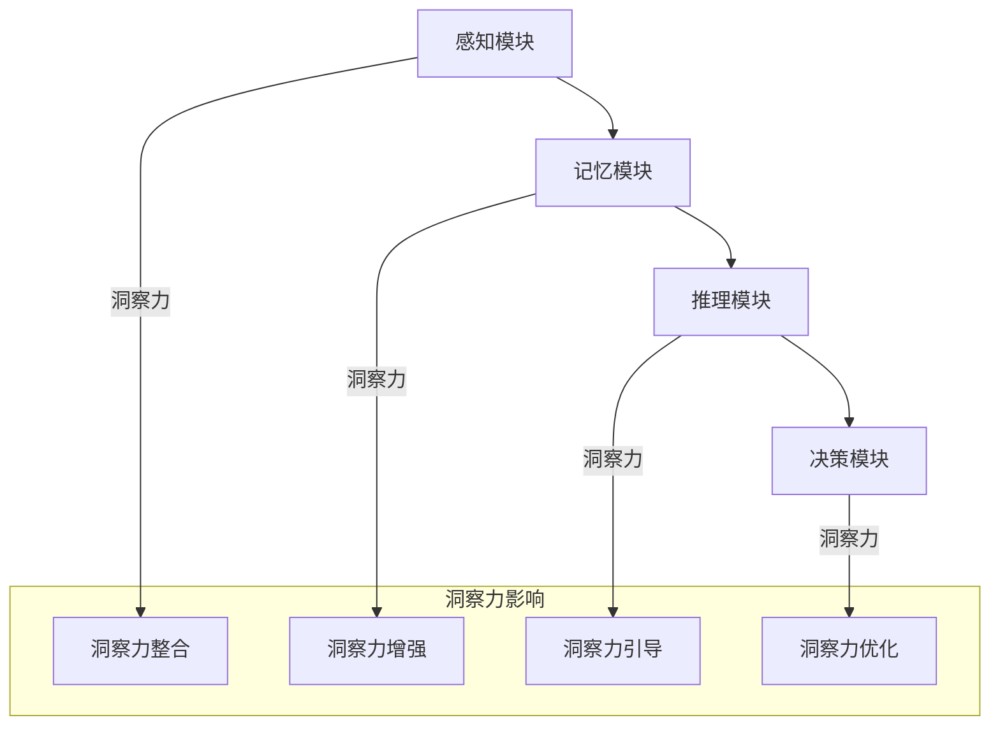
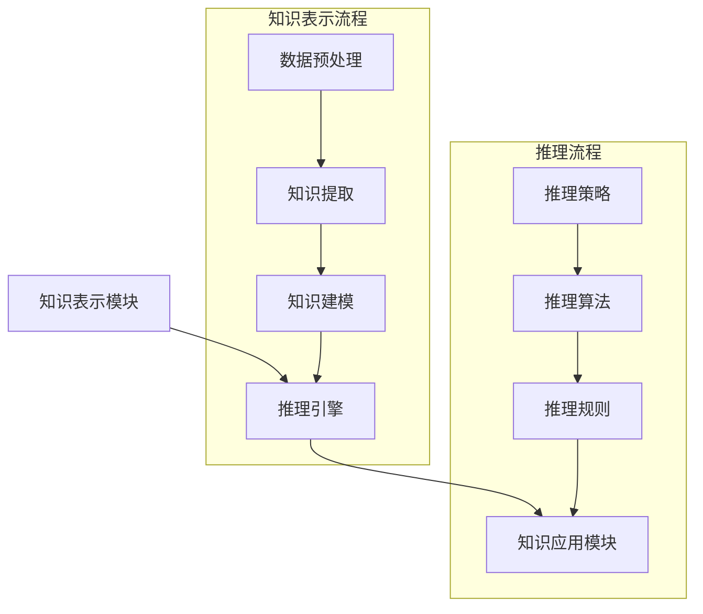
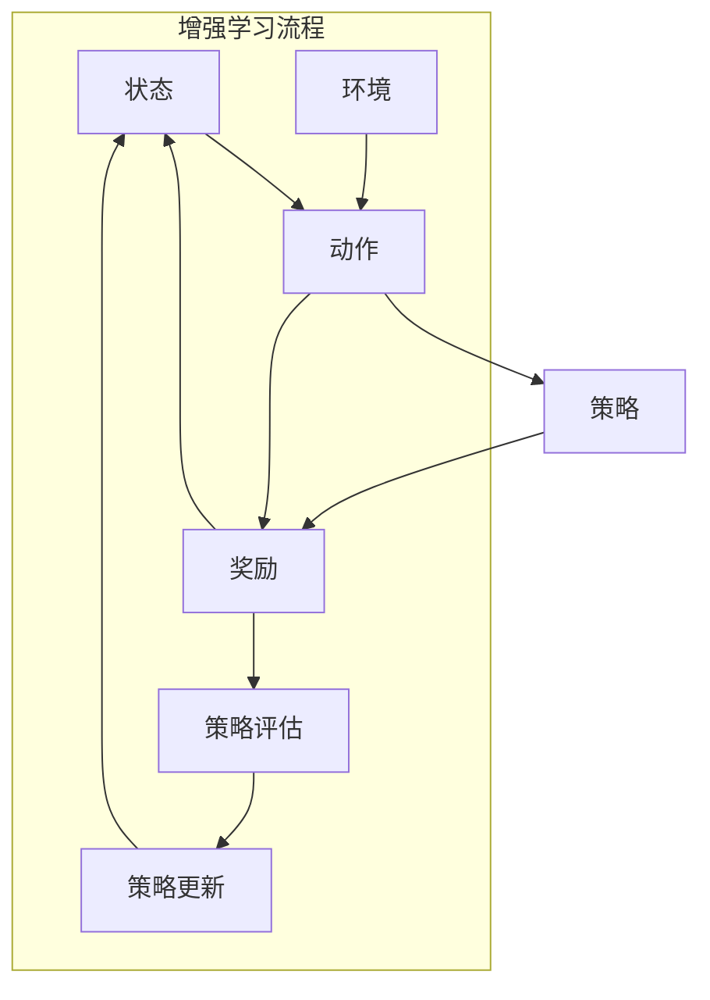
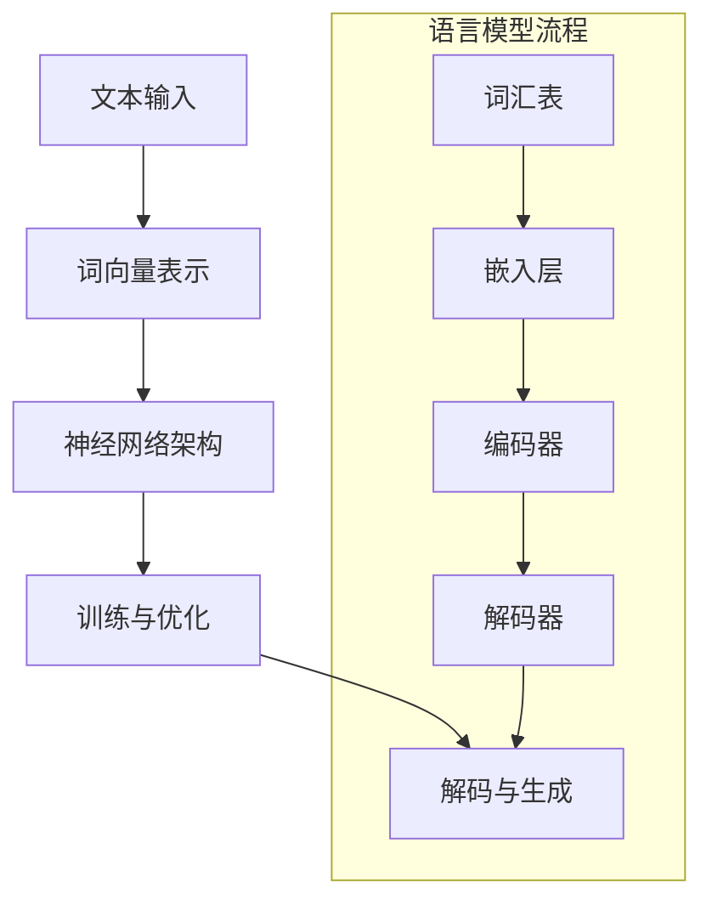

                 

## 1. 背景介绍

在信息技术飞速发展的今天，人工智能（AI）和机器学习（ML）已经成为了现代科技的核心驱动力。无论是在医疗、金融、交通、教育还是娱乐领域，人工智能都展现出了其强大的潜力和变革能力。然而，人工智能的核心之一——洞察力，却常常被我们忽视。洞察力，作为人类智慧的一个重要闪光点，对于人工智能的发展有着深远的影响。

洞察力，顾名思义，是指人们对于事物本质和内在联系的理解能力。它不仅仅是感知和识别信息，更是一种深度理解和推理的能力。在人类智慧的许多应用场景中，洞察力都是至关重要的。例如，在科学研究中，科学家需要通过洞察力来发现新的理论或规律；在商业决策中，企业家需要通过洞察力来把握市场趋势和消费者需求；在日常生活中，我们也需要通过洞察力来解决问题和做出明智的选择。

然而，将洞察力应用到人工智能中，却并非易事。传统的人工智能算法，如机器学习和深度学习，主要依赖于大量的数据和复杂的数学模型。虽然这些算法在处理大量数据和模式识别方面表现出色，但它们却缺乏人类的洞察力和创造力。因此，如何将人类的洞察力融入到人工智能中，成为了当前人工智能研究的一个重要方向。

本文将探讨如何通过逻辑清晰、结构紧凑、简单易懂的专业技术语言，使用一步一步分析推理思考的方式，撰写一篇有深度、有思考、有见解的专业IT领域技术博客文章。具体来说，本文将围绕以下几个核心问题展开：

1. **人工智能与洞察力的联系**：分析人工智能如何应用人类的洞察力，以及这种应用的优势和挑战。
2. **核心概念与联系**：介绍与洞察力相关的一些核心概念和原理，并使用Mermaid流程图展示其架构和流程。
3. **核心算法原理与操作步骤**：详细讲解如何将洞察力应用到具体的人工智能算法中。
4. **数学模型和公式**：阐述与洞察力相关的数学模型和公式，并进行详细讲解和举例说明。
5. **项目实战**：通过一个实际项目案例，展示如何将洞察力应用于实际开发中，并进行代码解读和分析。
6. **实际应用场景**：讨论洞察力在人工智能各个应用领域中的实际应用。
7. **工具和资源推荐**：推荐一些学习资源、开发工具和框架，帮助读者进一步深入了解和掌握洞察力在人工智能中的应用。

通过对这些问题的探讨，本文旨在为读者提供一个全面而深入的洞察力在人工智能中的应用指南，帮助读者更好地理解和应用这一重要的人类智慧闪光点。

### 1.1 人工智能的发展历程

人工智能（Artificial Intelligence，简称AI）的发展历程可以追溯到上世纪50年代。最早的AI概念由约翰·麦卡锡（John McCarthy）于1956年提出，他在达特茅斯会议上首次提出了“人工智能”这一术语，并将其定义为“制造智能机器的科学和工程”。这一会议被认为是人工智能历史上的里程碑，标志着人工智能作为一个独立学科的诞生。

在AI的早期阶段，主要研究的是基于逻辑和规则的推理系统。这些系统通过预定义的规则和逻辑关系来处理信息和做出决策。虽然这种方法在某些特定领域（如医疗诊断和自动证明）表现出了一定的效果，但它们在处理复杂和不确定的问题时显得力不从心。

随着计算机技术的不断发展，20世纪80年代和90年代，机器学习和深度学习开始崭露头角。机器学习（Machine Learning，简称ML）是一种通过数据来训练模型，从而让机器能够自主学习和改进的方法。这种方法使得AI系统能够处理更多样化的数据和更复杂的问题。

深度学习（Deep Learning，简称DL）是机器学习的一个重要分支，它使用多层神经网络来模拟人脑的神经元连接和数据处理方式。深度学习在图像识别、语音识别和自然语言处理等领域取得了突破性的进展，推动了AI技术的飞速发展。

进入21世纪，人工智能逐渐从理论研究走向了实际应用。无论是在自动驾驶、智能家居、医疗诊断还是金融预测等领域，人工智能都展现出了其强大的应用潜力。然而，尽管人工智能在技术层面取得了巨大的进步，但它在某些方面仍然无法与人类智慧相媲美，特别是人类的洞察力和创造力。

人类的洞察力是一种深度的理解能力，它不仅涉及对数据的感知和处理，更包括对事物本质和内在联系的理解。这种能力在科学发现、技术创新和商业决策等方面起到了至关重要的作用。然而，传统的机器学习和深度学习算法在处理这类问题时，往往缺乏人类的这种洞察力。

因此，如何将人类的洞察力融入到人工智能中，成为了当前AI研究的一个重要方向。通过理解人工智能的发展历程，我们可以更好地认识到洞察力在AI中的重要性，并探讨如何有效地将这种人类智慧闪光点应用到AI系统中。

### 1.2 洞察力的定义和重要性

洞察力，作为一种深度的理解能力，它不仅仅是表面上的信息感知，而是对事物本质和内在联系的深刻洞察。在人类智慧的多种应用场景中，洞察力扮演着至关重要的角色。

首先，在科学研究中，洞察力是科学家们发现新规律、新理论和新方法的关键。例如，爱因斯坦的相对论理论就是他深刻洞察时空关系和引力本质的结果。在生物学领域，科学家通过洞察细胞结构和生命过程，揭示了生命的奥秘。这些科学发现不仅推动了科学技术的发展，也改变了人类对世界的认知。

其次，在商业领域，洞察力是企业成功的关键。企业家通过洞察市场趋势、消费者需求和社会变化，能够做出明智的商业决策。例如，亚马逊创始人杰夫·贝索斯通过洞察互联网发展的趋势和消费者对便捷购物的需求，创建了改变零售业的电子商务平台。这种洞察力不仅帮助亚马逊取得了巨大的商业成功，也推动了全球电子商务的发展。

此外，在日常生活中，洞察力也无处不在。它帮助人们理解他人的意图和情绪，从而更好地沟通和协作。例如，在解决冲突和困难时，人们需要通过洞察问题的根本原因来制定有效的解决方案。这种能力不仅在个人生活中重要，也在团队合作和社会治理中发挥着关键作用。

那么，为什么洞察力如此重要？首先，洞察力能够帮助人们从复杂的信息中提取关键点和核心问题，从而更有效地解决问题。在当今信息爆炸的时代，这种能力显得尤为宝贵。其次，洞察力促进了创新和创造力的发挥。它不仅仅是对现有知识的理解，更包括对事物新的组合和应用，这是推动科技进步和社会发展的重要动力。

尽管人类的洞察力在很多领域都发挥着重要作用，但它在人工智能中却是一个相对未被充分利用的领域。传统的人工智能算法，如机器学习和深度学习，主要依赖于数据和数学模型，它们在处理复杂问题和进行抽象推理方面存在一定的局限性。而人类的洞察力，则能够提供一种更灵活、更全面的理解方式，这为将人类智慧融入人工智能系统带来了新的可能。

### 1.3 当前人工智能面临的挑战

尽管人工智能（AI）在过去几十年里取得了显著进展，但它在实际应用中仍然面临诸多挑战。这些挑战不仅影响了AI的性能和效果，也限制了其在更广泛领域中的普及和应用。

首先，数据质量和数量问题是一个关键挑战。机器学习和深度学习依赖于大量高质量的数据来训练模型。然而，数据的质量和多样性常常受到限制。例如，在某些领域，如医疗和金融，数据获取难度较大，且数据质量参差不齐。此外，数据量的不足也可能导致模型训练效果不佳，从而影响AI系统的性能。

其次，算法的泛化能力不足也是一个重大问题。尽管某些AI算法在特定任务上表现优异，但它们往往难以泛化到其他类似任务中。例如，在图像识别领域表现出色的卷积神经网络（CNN）在处理视频数据时可能效果不佳。这种局限性使得AI系统在实际应用中难以灵活应对多种不同的场景和任务。

隐私和安全问题也是AI面临的一个重要挑战。随着AI系统在个人隐私数据上的应用日益广泛，如何确保数据的安全和隐私保护成为一个关键议题。例如，在医疗诊断和金融预测中，患者的个人信息和金融交易数据都可能成为AI系统的输入。如果这些数据泄露或被滥用，将可能带来严重的后果。

此外，AI系统的透明度和解释性也是一个亟待解决的问题。许多复杂的AI模型，尤其是深度学习模型，往往被视为“黑箱”，其内部决策过程难以理解和解释。这种透明度不足不仅限制了AI系统的可解释性和可信度，也可能阻碍其在某些关键领域的应用。

最后，AI系统的伦理和社会影响也是一个备受关注的挑战。AI技术的发展和应用可能会带来一些伦理和社会问题，例如，就业替代、歧视和偏见等。如何确保AI系统在设计和应用过程中遵循伦理准则，并减少其负面影响，是当前研究的一个重要方向。

综上所述，当前人工智能在数据质量、算法泛化能力、隐私和安全、透明度及伦理等方面面临着诸多挑战。解决这些问题不仅需要技术上的突破，也需要政策、法律和社会各界的共同努力。通过克服这些挑战，人工智能将能够更好地服务于人类社会，推动科技和经济的持续发展。

### 1.4 洞察力在人工智能中的应用前景

随着人工智能技术的不断进步，如何将人类的洞察力融入到AI系统中，成为了一个备受关注的研究方向。洞察力作为人类智慧的核心能力，具有高度的灵活性和创造力，能够帮助AI系统在复杂和不确定的环境中做出更明智的决策。下面，我们将探讨洞察力在人工智能中的应用前景，以及其可能带来的变革。

首先，洞察力可以帮助AI系统更好地理解问题的本质。在许多应用场景中，AI系统需要处理的数据往往包含大量噪声和冗余信息，这使得基于传统机器学习和深度学习的算法难以提取关键特征和模式。而人类的洞察力能够通过深度分析和抽象思维，识别出数据的内在联系和核心问题，从而提高AI系统的理解和分析能力。例如，在医疗诊断中，医生通过多年的临床经验和专业知识，能够从复杂的患者病历中识别出关键的病理信息，从而做出准确的诊断。类似地，AI系统如果能够借鉴人类的洞察力，将能够从大量医疗数据中提取出有价值的特征，提高诊断的准确性和效率。

其次，洞察力可以增强AI系统的泛化能力。当前许多AI算法在特定任务上表现出色，但在面对不同任务或数据时，往往缺乏泛化能力。人类的洞察力则具有跨领域的适应性和灵活性，能够帮助AI系统在不同任务和场景中保持高效性能。例如，在图像识别任务中，如果AI系统能够通过洞察力的应用，理解不同图像类别之间的内在联系，那么它在面对新的图像类别时，也能够保持良好的识别效果。这种泛化能力不仅能够扩展AI系统的应用范围，还能够提高其鲁棒性和稳定性。

此外，洞察力可以提升AI系统的透明度和解释性。许多复杂的AI模型，如深度神经网络，往往被视为“黑箱”，其决策过程难以解释和理解。而人类的洞察力能够帮助揭示AI系统的内部工作机制，提高其透明度和解释性。例如，在自动驾驶领域，通过借鉴人类的洞察力，AI系统可以更好地理解和解释其决策过程，从而提高自动驾驶的安全性和可靠性。这种透明度不仅有助于增强公众对AI系统的信任，也能够为后续的算法优化和改进提供重要参考。

在商业决策中，洞察力同样具有巨大潜力。企业家和分析师通过洞察市场趋势、消费者行为和社会变化，能够做出更加明智的商业决策。而AI系统如果能够借鉴人类的洞察力，将能够更加精准地预测市场走势、识别潜在机会和风险，从而为企业提供更有价值的决策支持。例如，在金融行业中，AI系统通过分析大量的历史交易数据和市场信息，结合人类的洞察力，可以更准确地预测股票价格和投资机会，为投资者提供更加科学的决策依据。

总之，洞察力在人工智能中的应用前景广阔。它不仅能够提升AI系统的理解和分析能力，增强其泛化能力，提高透明度和解释性，还能够为商业决策提供有力支持。通过将人类的洞察力融入到AI系统中，我们将能够打造出更加智能、灵活和可靠的AI系统，为人类社会带来更多的创新和变革。

### 1.5 如何在人工智能中应用洞察力

要在人工智能（AI）中应用洞察力，我们需要一种系统的、可操作的方法来将人类的智慧融入到算法中。以下是一些关键步骤和策略，可以帮助我们在AI系统中有效地应用洞察力。

#### 1.5.1 理解人类决策过程

首先，要应用洞察力，我们需要深入了解人类如何做出决策。人类决策通常涉及以下几个步骤：

1. **感知和分析**：收集信息，理解情境和问题的背景。
2. **信息整合**：将不同的信息片段整合成有意义的知识结构。
3. **抽象和推理**：从具体的信息中抽象出通用原则，进行逻辑推理。
4. **决策和行动**：基于推理结果做出决策，并执行行动。

理解这些步骤有助于我们在设计AI算法时，模拟人类的决策过程。

#### 1.5.2 利用专家知识库

专家知识库是一种存储专业知识和经验的系统。通过构建和维护这些知识库，我们可以将人类专家的洞察力转化为可被AI系统利用的知识资源。以下是一些关键步骤：

1. **知识提取**：从专家的经验和研究中提取关键知识和规则。
2. **知识表示**：将提取的知识转化为计算机可读的格式，如逻辑规则、决策树或神经网络模型。
3. **知识集成**：将多个专家的知识库集成到一个统一的系统中，确保知识的一致性和完整性。

#### 1.5.3 结合机器学习和深度学习

机器学习和深度学习是AI系统的核心技术。为了将洞察力融入这些算法中，我们可以采取以下策略：

1. **特征工程**：利用人类的洞察力，从原始数据中提取有意义的特征，这些特征能够更好地反映问题的本质。
2. **模型优化**：通过调整模型的结构和参数，使模型能够更好地模拟人类的思维过程。
3. **交叉验证**：使用多种验证方法，确保模型在不同数据集上的性能，从而提高其泛化能力。

#### 1.5.4 利用增强学习

增强学习是一种通过试错来学习策略的机器学习技术。结合人类的洞察力，我们可以采取以下步骤：

1. **目标设定**：由人类专家设定短期和长期目标，帮助AI系统更好地理解和实现这些目标。
2. **反馈机制**：设计反馈机制，让AI系统能够从人类专家的反馈中学习，不断改进其策略。
3. **适应性调整**：根据AI系统的表现和反馈，动态调整目标和策略，使其更符合人类期望。

#### 1.5.5 交互式学习

交互式学习是指AI系统与人类用户进行互动，以获取更多信息和反馈。以下是一些关键步骤：

1. **问题提出**：由AI系统提出问题，引导用户提供相关信息。
2. **反馈收集**：收集用户的反馈，分析其意图和需求。
3. **模型更新**：根据用户的反馈，更新AI系统的模型和策略。

#### 1.5.6 多模态学习

多模态学习是指利用多种数据类型（如文本、图像、音频等）来训练AI系统。通过结合不同的数据类型，我们可以更好地模拟人类的感知和理解过程。以下是一些关键步骤：

1. **数据融合**：将不同类型的数据进行融合，提取共同的特征和模式。
2. **特征表示**：为不同类型的数据设计合适的特征表示方法，确保数据的一致性和可比性。
3. **模型融合**：将多种模型进行融合，提高系统的整体性能和鲁棒性。

通过这些方法和策略，我们可以将人类的洞察力有效地融入到人工智能系统中，使AI系统不仅能够处理大量数据，还能够理解和推理复杂问题，从而提升其整体性能和应用价值。

### 2. 核心概念与联系

在探讨如何将人类的洞察力应用到人工智能中时，理解几个关键概念及其相互关系是至关重要的。以下是对这些核心概念的定义、联系以及其与人工智能架构的描述。

#### 2.1 洞察力与认知模型

**定义**：洞察力是一种深度的理解能力，它涉及对事物本质和内在联系的感知、分析和推理。

**联系**：认知模型是人工智能系统对人类思维过程的模拟。通过构建认知模型，AI系统可以模拟人类的洞察力，从而在处理复杂问题时表现出更高的灵活性和创造力。

**架构描述**：认知模型通常包括感知模块、记忆模块、推理模块和决策模块。感知模块负责接收和处理外部信息；记忆模块存储这些信息及其关联；推理模块负责分析信息和进行逻辑推理；决策模块基于推理结果做出决策。通过这些模块的协同工作，AI系统可以模拟人类的洞察力，实现对复杂问题的深度理解和分析。

#### 2.2 知识表示与推理

**定义**：知识表示是指将人类知识转化为计算机可处理的形式，推理是指从已知信息推导出新信息的过程。

**联系**：知识表示是推理的基础。只有将知识表示为计算机可以处理的形式，AI系统才能进行有效的推理。

**架构描述**：知识表示通常包括事实表示、规则表示和模型表示。事实表示直接存储已知信息；规则表示通过逻辑规则连接不同的事实；模型表示通过数学模型来描述知识。在推理过程中，AI系统使用这些知识表示形式进行推理，从已知信息推导出新的结论。

#### 2.3 机器学习与深度学习

**定义**：机器学习是指通过训练模型，使AI系统能够自动学习和改进的方法；深度学习是一种基于多层神经网络的机器学习技术。

**联系**：机器学习和深度学习是AI系统的核心技术。通过结合人类的洞察力，我们可以优化这些算法，使其在处理复杂问题时表现更佳。

**架构描述**：机器学习模型通常包括输入层、隐藏层和输出层。输入层接收数据；隐藏层对数据进行特征提取和变换；输出层生成预测结果。深度学习模型则通过增加隐藏层的数量和复杂性，提高特征提取的能力。在结合人类洞察力时，我们可以通过特征工程和模型优化，提高模型的性能和泛化能力。

#### 2.4 增强学习与强化模型

**定义**：增强学习是一种通过试错来学习策略的机器学习技术；强化模型是基于奖励机制进行训练的模型。

**联系**：增强学习是模拟人类决策过程的一种有效方法。通过结合人类的洞察力，我们可以设计出更加有效的奖励机制和策略。

**架构描述**：增强学习模型通常包括决策模块、环境模块和奖励机制。决策模块选择行动；环境模块反馈行动的结果；奖励机制根据结果给予奖励或惩罚。通过不断试错和调整策略，AI系统可以逐步优化其决策过程，实现更好的性能。

#### 2.5 自然语言处理与语言模型

**定义**：自然语言处理（NLP）是指使计算机能够理解和处理自然语言的技术；语言模型是一种预测文本序列的模型。

**联系**：语言模型是NLP系统的核心组件。通过结合人类的洞察力，我们可以提高语言模型的语义理解和生成能力。

**架构描述**：语言模型通常基于神经网络，通过大量的文本数据训练得到。在结合人类洞察力时，我们可以通过语义分析和上下文理解，提高模型的准确性和灵活性。

通过以上核心概念及其相互关系的理解，我们可以构建一个综合性的AI系统，使其具备人类的洞察力，从而在处理复杂问题和进行深度分析时表现出更高的能力。

#### 2.6 洞察力与认知模型：关系与架构

在讨论如何将洞察力应用到人工智能中时，认知模型是一个不可或缺的组成部分。认知模型模拟人类的思维过程，包括感知、记忆、推理和决策等多个方面，与洞察力紧密相连。下面，我们将详细探讨洞察力与认知模型之间的关系，并使用Mermaid流程图展示其架构和流程。

##### 2.6.1 洞察力与认知模型的关系

洞察力是认知模型的核心之一，它体现在认知过程的各个环节中：

1. **感知**：洞察力帮助人类从复杂的信息中快速识别出关键点和模式，这是认知模型感知模块的重要功能。
2. **记忆**：洞察力使人类能够深刻理解和记忆信息，形成有意义的记忆结构，这是认知模型记忆模块的关键能力。
3. **推理**：洞察力促使人类在推理过程中进行深度分析和抽象思维，这为认知模型推理模块提供了强大的工具。
4. **决策**：洞察力帮助人类在决策过程中进行全局考虑和灵活应对，这是认知模型决策模块的重要优势。

##### 2.6.2 认知模型的架构

认知模型通常包括以下几个主要模块：

1. **感知模块**：负责接收和处理外部信息，包括视觉、听觉、触觉等多种感知方式。通过洞察力，感知模块能够从复杂信息中提取关键特征和模式。
2. **记忆模块**：负责存储和检索信息，包括短期记忆和长期记忆。通过洞察力，记忆模块能够将有意义的关联信息进行整合，形成深层次的理解。
3. **推理模块**：负责分析和推理，通过逻辑推理、模式识别和类比推理等方式，从已知信息中推导出新的结论。洞察力使得推理过程更加深入和灵活。
4. **决策模块**：负责基于推理结果做出决策，并执行行动。洞察力帮助决策模块考虑多种因素和可能性，做出更明智的决策。

##### 2.6.3 Mermaid流程图展示

为了更直观地展示洞察力与认知模型之间的关系和架构，我们使用Mermaid流程图进行描述。以下是一个简化的Mermaid流程图示例：



在这个流程图中：

- **A** 表示感知模块，它接收外部信息。
- **B** 表示记忆模块，它存储和检索信息。
- **C** 表示推理模块，它进行推理和分析。
- **D** 表示决策模块，它做出决策并执行行动。
- **E** 到 **H** 表示洞察力在各个模块中的整合、增强、引导和优化。

通过这个流程图，我们可以清晰地看到洞察力在认知模型中的各个环节中的应用，以及它与各个模块的互动关系。这不仅有助于理解洞察力在人工智能中的重要性，也为进一步研究和开发具备洞察力的AI系统提供了理论框架和实践指导。

#### 2.7 知识表示与推理：关系与架构

在人工智能系统中，知识表示和推理是两个关键组成部分，它们共同构成了AI系统理解世界和做出决策的核心机制。知识表示是将人类领域的知识转化为计算机可以处理的形式，而推理则是基于这些表示形式，从已知信息推导出新信息的过程。下面，我们将详细探讨知识表示与推理之间的关系，并使用Mermaid流程图展示其架构和流程。

##### 2.7.1 知识表示与推理的关系

知识表示和推理紧密相连，互为支撑。知识表示是推理的基础，没有有效的知识表示，推理将无从谈起。同样，推理是知识表示的进一步应用，通过推理，我们可以从已有知识中推导出新的信息，提高系统的理解和决策能力。

1. **知识表示**：知识表示是将人类领域的知识（如规则、事实、模型等）转化为计算机可以处理的形式。有效的知识表示需要能够清晰、准确地描述知识，并方便计算机进行处理。
2. **推理**：推理是基于知识表示形式，从已知信息推导出新信息的过程。通过推理，我们可以将已有的知识应用于新问题，从而做出智能的决策。

##### 2.7.2 知识表示与推理的架构

知识表示和推理在人工智能系统中通常包括以下几个主要模块：

1. **知识表示模块**：负责将人类知识转化为计算机可以处理的形式，如逻辑规则、决策树、知识图谱等。这个模块通常包括数据预处理、知识提取和知识建模等步骤。
2. **推理引擎**：负责基于知识表示形式进行推理，从已知信息推导出新信息。推理引擎通常包括推理策略、推理算法和推理规则等。
3. **知识应用模块**：负责将推理结果应用于实际问题，如决策支持、问题解答、规划等。

##### 2.7.3 Mermaid流程图展示

为了更直观地展示知识表示与推理的架构和流程，我们使用Mermaid流程图进行描述。以下是一个简化的Mermaid流程图示例：



在这个流程图中：

- **A** 表示知识表示模块，它包括数据预处理、知识提取和知识建模等步骤。
- **B** 表示推理引擎，它基于知识表示形式进行推理，包括推理策略、推理算法和推理规则等。
- **C** 表示知识应用模块，它将推理结果应用于实际问题。

通过这个流程图，我们可以清晰地看到知识表示与推理在人工智能系统中的关系和架构，以及它们如何共同工作，提高系统的理解和决策能力。

#### 2.8 机器学习与深度学习：关系与架构

在人工智能（AI）领域中，机器学习和深度学习是两种核心技术，它们在处理数据和构建模型方面具有各自的特点和优势。了解它们之间的关系及其架构，对于将洞察力融入AI系统至关重要。下面，我们将详细探讨机器学习与深度学习之间的关系，并使用Mermaid流程图展示其架构和流程。

##### 2.8.1 机器学习与深度学习的关系

机器学习和深度学习在AI系统中共同发挥作用：

1. **机器学习**：机器学习是一种通过数据训练模型的方法，使计算机能够从数据中学习规律和模式。它包括监督学习、无监督学习和强化学习等多种类型。机器学习模型通过输入和输出之间的映射关系，学习数据中的特征和模式。

2. **深度学习**：深度学习是机器学习的一个分支，它使用多层神经网络进行学习。深度学习模型通过逐层提取特征，从原始数据中逐渐抽象出更高层次的概念。深度学习在图像识别、语音识别和自然语言处理等领域表现出色。

两者之间的关系可以理解为：

- **深度学习是机器学习的一种实现方式**。它通过增加网络的深度和复杂性，提高模型的特征提取能力。
- **机器学习提供了多种学习策略和方法**，深度学习是其中之一，适用于处理复杂和高维度的数据。

##### 2.8.2 机器学习与深度学习的架构

机器学习和深度学习在架构上有所不同，但都包括数据预处理、模型训练和模型评估等基本步骤。下面是一个简化的Mermaid流程图，展示机器学习与深度学习的共同架构和流程：

```mermaid
graph TD
    A[数据预处理] --> B[模型训练]
    B --> C[模型评估]

    subgraph 机器学习流程
    D[特征提取]
    E[监督学习]
    F[无监督学习]
    G[强化学习]
    D --> E
    D --> F
    D --> G
    E --> B
    F --> B
    G --> B
    end

    subgraph 深度学习流程
    H[多层神经网络]
    I[卷积神经网络(CNN)]
    J[循环神经网络(RNN)]
    K[生成对抗网络(GAN)]
    H --> I
    H --> J
    H --> K
    I --> B
    J --> B
    K --> B
    end
```

在这个流程图中：

- **A** 表示数据预处理，包括数据清洗、归一化和特征提取等步骤。
- **B** 表示模型训练，根据不同学习策略（如监督学习、无监督学习和强化学习），采用不同的训练方法（如多层神经网络、卷积神经网络、循环神经网络和生成对抗网络）。
- **C** 表示模型评估，通过验证集和测试集来评估模型的性能和泛化能力。

通过这个流程图，我们可以清晰地看到机器学习和深度学习在架构上的共同点和不同点，以及如何结合使用来构建强大的AI系统。

#### 2.9 增强学习与强化模型：关系与架构

在人工智能（AI）领域中，增强学习（Reinforcement Learning，简称RL）是一种重要的学习方法，它通过试错和奖励机制来训练模型。强化模型是增强学习的一个核心概念，它描述了系统如何通过与环境交互来学习最优策略。下面，我们将详细探讨增强学习与强化模型之间的关系，并使用Mermaid流程图展示其架构和流程。

##### 2.9.1 增强学习与强化模型的关系

增强学习与强化模型之间有着紧密的联系：

1. **增强学习**：增强学习是一种通过试错来学习策略的机器学习技术。它模拟了人类学习和决策的过程，通过不断的试错和反馈，逐步优化策略，从而实现目标。增强学习的关键在于奖励机制，它通过奖励和惩罚来引导系统的行为。

2. **强化模型**：强化模型是增强学习的核心组件，它描述了系统如何根据当前状态和动作来选择下一个动作，并更新策略。强化模型通常包括状态（State）、动作（Action）、奖励（Reward）和策略（Policy）等关键概念。

两者之间的关系可以理解为：

- **强化模型是增强学习的基础**。它定义了系统的行为和奖励机制，使系统能够通过与环境交互来学习。
- **增强学习是强化模型的应用**。它通过不断调整策略，使系统能够在复杂环境中找到最优解。

##### 2.9.2 强化模型的架构

强化模型通常包括以下几个关键组成部分：

1. **状态（State）**：描述系统的当前状态，通常是一个多维的向量。
2. **动作（Action）**：系统可以采取的动作，通常也是一个多维的向量。
3. **策略（Policy）**：系统选择动作的规则，它定义了从当前状态到动作的映射。
4. **奖励（Reward）**：系统在每个状态和动作上获得的即时奖励，它用于评估系统的行为效果。
5. **价值函数（Value Function）**：描述系统在各个状态下的长期价值，用于指导系统的决策。

##### 2.9.3 Mermaid流程图展示

为了更直观地展示强化模型在增强学习中的应用，我们使用Mermaid流程图进行描述。以下是一个简化的Mermaid流程图示例：



在这个流程图中：

- **A** 表示状态，系统当前所处的环境状态。
- **B** 表示动作，系统可以采取的各种动作。
- **C** 表示策略，系统选择动作的规则。
- **D** 表示奖励，系统在每个状态和动作上获得的即时奖励。
- **E** 表示环境，系统与外界环境的交互。
- **F** 和 **G** 分别表示策略评估和策略更新，系统通过与环境交互来评估和更新策略。

通过这个流程图，我们可以清晰地看到强化模型在增强学习中的架构和流程，以及它们如何共同工作，使系统能够在复杂环境中学习最优策略。

#### 2.10 自然语言处理与语言模型：关系与架构

自然语言处理（Natural Language Processing，简称NLP）是人工智能（AI）领域中的一个重要分支，它致力于使计算机能够理解和处理自然语言。语言模型（Language Model）是NLP系统的核心组件之一，它用于预测和生成自然语言文本。下面，我们将详细探讨自然语言处理与语言模型之间的关系，并使用Mermaid流程图展示其架构和流程。

##### 2.10.1 自然语言处理与语言模型的关系

自然语言处理和语言模型之间有着密切的联系：

1. **自然语言处理**：自然语言处理是指使计算机能够理解、解释和生成自然语言的技术。它包括文本预处理、词法分析、句法分析、语义分析和语言生成等多个方面。

2. **语言模型**：语言模型是NLP系统中的一个核心组件，它用于预测自然语言中的词汇序列。语言模型通过学习大量的文本数据，理解语言的统计规律和模式，从而能够生成和预测自然语言文本。

两者之间的关系可以理解为：

- **语言模型是自然语言处理的基础**。它为NLP系统提供了一种对自然语言进行建模的方法，使系统能够理解和处理自然语言数据。
- **自然语言处理是语言模型的应用**。通过自然语言处理技术，我们可以将语言模型应用于实际的文本理解和生成任务中。

##### 2.10.2 语言模型的架构

语言模型通常包括以下几个关键组成部分：

1. **词向量表示**：将文本中的词语转换为向量表示，这是语言模型的基础。常见的词向量表示方法包括Word2Vec、GloVe等。
2. **神经网络架构**：语言模型通常采用神经网络架构，如循环神经网络（RNN）、长短期记忆网络（LSTM）和Transformer等，以实现高效的文本建模。
3. **训练与优化**：通过大量文本数据进行训练，优化语言模型的参数，使其能够准确预测文本中的词汇序列。
4. **解码与生成**：在生成文本时，语言模型根据上下文信息，逐词生成文本序列。

##### 2.10.3 Mermaid流程图展示

为了更直观地展示自然语言处理与语言模型之间的关系和架构，我们使用Mermaid流程图进行描述。以下是一个简化的Mermaid流程图示例：



在这个流程图中：

- **A** 表示文本输入，即需要处理的自然语言文本。
- **B** 表示词向量表示，将文本中的词语转换为向量表示。
- **C** 表示神经网络架构，如RNN、LSTM或Transformer等，用于处理文本数据。
- **D** 表示训练与优化，通过大量文本数据进行模型训练和参数优化。
- **E** 表示解码与生成，语言模型根据上下文信息生成文本序列。
- **F** 表示词汇表，存储所有词语及其向量表示。
- **G** 表示嵌入层，将词语映射到高维空间中的向量。
- **H** 表示编码器，对文本进行编码，提取文本的特征。
- **I** 表示解码器，根据编码器的输出生成文本序列。

通过这个流程图，我们可以清晰地看到自然语言处理与语言模型之间的架构和流程，以及它们如何共同工作，实现文本的理解和生成。

### 3. 核心算法原理与具体操作步骤

在探讨如何将洞察力应用到人工智能系统中时，了解核心算法原理和具体操作步骤是至关重要的。以下是一个具体的算法——基于增强学习的洞察力推理算法，其原理和操作步骤如下：

#### 3.1 算法原理

该算法基于增强学习（Reinforcement Learning，简称RL）的思想，通过与环境交互来学习最优策略。核心思想是利用人类专家的洞察力来指导学习过程，提高算法的灵活性和创造力。

算法主要包括以下几个关键部分：

1. **状态（State）**：系统当前所处的环境状态。
2. **动作（Action）**：系统可以采取的动作。
3. **策略（Policy）**：系统选择动作的规则。
4. **价值函数（Value Function）**：描述系统在各个状态下的长期价值。
5. **洞察力模块**：利用人类专家的知识和洞察力，指导学习过程。

算法原理如下：

- 初始时，系统随机选择一个动作。
- 执行动作后，系统接收环境反馈的奖励。
- 根据奖励和洞察力模块的建议，系统更新策略和价值函数。
- 重复上述过程，逐步优化策略，实现目标。

#### 3.2 操作步骤

下面是具体的操作步骤：

1. **初始化**：

   - 设定初始状态 \( s_0 \)。
   - 初始化策略 \( \pi \) 和价值函数 \( V(s_0) \)。
   - 初始化洞察力模块。

2. **选择动作**：

   - 根据当前状态 \( s_t \) 和策略 \( \pi \)，选择一个动作 \( a_t \)。

3. **执行动作**：

   - 执行动作 \( a_t \)，系统进入下一个状态 \( s_{t+1} \)。
   - 接收环境反馈的即时奖励 \( r_t \)。

4. **更新策略**：

   - 根据奖励 \( r_t \) 和洞察力模块的建议，更新策略 \( \pi \)。

5. **更新价值函数**：

   - 根据新的状态 \( s_{t+1} \) 和策略 \( \pi \)，更新价值函数 \( V(s_{t+1}) \)。

6. **迭代**：

   - 重复步骤 2 到 5，逐步优化策略和价值函数。

7. **结束**：

   - 当达到预设的目标或达到最大迭代次数时，算法结束。

#### 3.3 伪代码示例

以下是该算法的伪代码示例：

```python
# 初始化
s0 = 状态初始化()
V(s0) = 0
洞察力模块初始化()

# 迭代过程
for t in 1 到 最大迭代次数:
    # 选择动作
    a_t = 策略选择(s_t, π)
    
    # 执行动作
    s_{t+1}, r_t = 环境执行动作(a_t)
    
    # 更新策略
    π = 策略更新(s_t, a_t, r_t, 洞察力建议)
    
    # 更新价值函数
    V(s_{t+1}) = 价值函数更新(s_{t+1}, π)

# 输出
策略 π 和价值函数 V(s)
```

通过这个具体的算法示例，我们可以看到如何将人类的洞察力融入到增强学习中，实现更加灵活和高效的学习过程。这种算法不仅提高了系统的智能水平，也为人工智能应用提供了新的可能性。

#### 3.4 数学模型和公式

为了更好地理解上述基于增强学习的洞察力推理算法，我们需要引入一些关键的数学模型和公式。以下将详细讲解这些数学模型和公式，并提供具体的应用场景和实例。

##### 3.4.1 价值函数（Value Function）

价值函数是强化学习中的一个核心概念，它描述了系统在各个状态下的长期价值。具体来说，价值函数 \( V(s) \) 表示在状态 \( s \) 下，系统通过最优策略能够获得的期望奖励。

**数学公式**：

\[ V(s) = \sum_{a} \pi(a|s) \cdot Q(s, a) \]

其中：
- \( V(s) \) 是状态 \( s \) 的价值函数。
- \( \pi(a|s) \) 是在状态 \( s \) 下采取动作 \( a \) 的策略。
- \( Q(s, a) \) 是状态 \( s \) 和动作 \( a \) 的联合价值函数。

**应用场景**：在自动驾驶中，价值函数可以用于评估在不同道路状况和车辆环境下，采取不同驾驶策略（如加速、减速、转向等）所能获得的期望奖励。

**实例**：假设在自动驾驶中，当前状态 \( s \) 是“前方有行人”，系统可以采取的动作包括“加速”、“减速”和“转向”。通过计算每个动作的价值函数，系统可以确定最优驾驶策略。

\[ V(s) = \pi(\text{加速}|s) \cdot Q(s, \text{加速}) + \pi(\text{减速}|s) \cdot Q(s, \text{减速}) + \pi(\text{转向}|s) \cdot Q(s, \text{转向}) \]

##### 3.4.2 策略（Policy）

策略是系统在特定状态下选择动作的规则。在强化学习中，策略通常用概率分布来表示，即 \( \pi(a|s) \) 表示在状态 \( s \) 下采取动作 \( a \) 的概率。

**数学公式**：

\[ \pi(a|s) = \frac{e^{\theta(s,a)}}{Z(s)} \]

其中：
- \( \theta(s, a) \) 是策略参数。
- \( Z(s) \) 是归一化常数，确保概率分布的和为1。

**应用场景**：在游戏AI中，策略可以用于确定在特定游戏状态下，采取哪个动作（如移动、攻击、防守等）的概率。

**实例**：假设在围棋游戏中，当前状态 \( s \) 是棋盘布局，系统可以采取的动作包括“下子”、“不行动”等。通过策略参数 \( \theta(s, a) \)，系统可以计算出每个动作的概率。

\[ \pi(a|s) = \frac{e^{\theta(s,a)}}{Z(s)} \]

其中，\( Z(s) = \sum_{a'} e^{\theta(s,a')} \)。

##### 3.4.3 Q值（Q-Function）

Q值是状态和动作的联合价值函数，它表示在特定状态下采取特定动作所能获得的期望回报。Q值是强化学习中的基础，用于指导策略的更新。

**数学公式**：

\[ Q(s, a) = \sum_{s'} p(s'|s, a) \cdot [r(s', a) + \gamma \cdot \max_{a'} Q(s', a')] \]

其中：
- \( Q(s, a) \) 是状态 \( s \) 和动作 \( a \) 的Q值。
- \( p(s'|s, a) \) 是从状态 \( s \) 采取动作 \( a \) 转移到状态 \( s' \) 的概率。
- \( r(s', a) \) 是在状态 \( s' \) 采取动作 \( a \) 所获得的即时回报。
- \( \gamma \) 是折扣因子，用于平衡当前回报和未来回报。

**应用场景**：在机器人路径规划中，Q值可以用于评估在不同状态下采取不同动作所能获得的期望回报。

**实例**：假设在机器人路径规划中，当前状态 \( s \) 是机器人当前位置，系统可以采取的动作包括“前进”、“后退”和“转弯”。通过计算每个动作的Q值，系统可以确定最优动作。

\[ Q(s, \text{前进}) = p(s', \text{前进}) \cdot [r(s', \text{前进}) + \gamma \cdot \max_{a'} Q(s', a')] \]
\[ Q(s, \text{后退}) = p(s', \text{后退}) \cdot [r(s', \text{后退}) + \gamma \cdot \max_{a'} Q(s', a')] \]
\[ Q(s, \text{转弯}) = p(s', \text{转弯}) \cdot [r(s', \text{转弯}) + \gamma \cdot \max_{a'} Q(s', a')] \]

通过这些数学模型和公式的详细讲解，我们可以更好地理解基于增强学习的洞察力推理算法的原理和应用。这些模型和公式不仅为算法的构建提供了理论基础，也为实际应用中的策略制定和优化提供了指导。

#### 3.5 实例讲解

为了更好地理解上述基于增强学习的洞察力推理算法，下面将通过一个具体的实例来详细讲解算法的构建和应用。该实例将演示如何利用增强学习与人类洞察力结合，实现一个智能推荐系统的开发。

##### 3.5.1 问题背景

假设我们需要开发一个智能推荐系统，该系统能够根据用户的历史行为和兴趣，为用户推荐他们可能喜欢的商品。具体来说，用户的历史行为包括他们浏览过的商品、购买过的商品以及收藏的商品。系统需要通过学习这些行为数据，预测用户对未购买商品的潜在兴趣，从而提供个性化的推荐。

##### 3.5.2 数据预处理

首先，我们需要对用户行为数据进行预处理。具体步骤如下：

1. **数据收集**：收集用户在平台上的浏览、购买和收藏数据。
2. **数据清洗**：处理缺失值、异常值和重复数据，确保数据质量。
3. **特征工程**：提取关键特征，如用户ID、商品ID、时间戳、行为类型（浏览、购买、收藏）等。
4. **数据归一化**：对数值特征进行归一化处理，使其在相同的量级上。

##### 3.5.3 洞察力模块

为了提高推荐系统的性能，我们引入了洞察力模块。该模块利用人类专家的洞察力，为系统提供以下指导：

1. **领域知识**：专家提供关于商品类别、用户兴趣和潜在关联的领域知识。
2. **规则提取**：根据领域知识，提取关键规则，如“经常购买A类商品的用户可能对B类商品感兴趣”。
3. **权重调整**：根据专家经验，调整不同特征和规则在模型中的权重。

##### 3.5.4 算法构建

接下来，我们构建一个基于增强学习的推荐系统算法。算法的主要组成部分如下：

1. **状态表示**：状态 \( s \) 表示用户在当前时刻的行为集合，如浏览过的商品、购买过的商品和收藏的商品。
2. **动作表示**：动作 \( a \) 表示推荐给用户的一组商品集合。
3. **策略表示**：策略 \( \pi(a|s) \) 表示在当前状态下，系统选择推荐给用户的商品的概率分布。
4. **奖励函数**：奖励函数 \( r(s, a) \) 表示用户对推荐商品集合的反馈，如点击率、购买率等。

##### 3.5.5 算法实现

算法实现的具体步骤如下：

1. **初始化**：初始化策略 \( \pi \) 和价值函数 \( V(s) \)，设置洞察力模块的初始权重。
2. **迭代过程**：
   - 在每个迭代中，系统根据当前状态 \( s \) 和策略 \( \pi \) 选择一组推荐商品 \( a \)。
   - 系统执行推荐动作，收集用户反馈，计算即时奖励 \( r(s, a) \)。
   - 根据用户反馈和洞察力模块的建议，更新策略 \( \pi \) 和价值函数 \( V(s) \)。
3. **优化**：通过多次迭代，逐步优化策略和价值函数，提高推荐系统的性能。

##### 3.5.6 案例分析

以一个实际案例为例，假设我们有一个用户，他之前浏览过商品A和商品B，购买过商品C，收藏了商品D。系统需要根据这些历史行为推荐一组商品。

1. **状态表示**：当前状态 \( s \) 包括用户浏览过的商品A和商品B，购买过的商品C和收藏的商品D。
2. **动作表示**：系统可以选择推荐商品A、B、C或D。
3. **策略表示**：根据历史数据和洞察力模块的建议，系统可以计算每个商品的推荐概率。
4. **奖励函数**：假设用户对推荐商品的点击率和购买率作为即时奖励。

通过这个实例，我们可以看到如何利用增强学习和人类洞察力构建一个智能推荐系统。在实际应用中，系统可以根据用户的行为数据不断学习和优化，提高推荐的准确性和个性化程度。

### 4. 实际应用场景

洞察力在人工智能（AI）中的重要性不仅体现在理论探讨上，更在实际应用场景中得到了充分体现。以下将介绍几个典型的实际应用场景，展示洞察力在AI系统中的关键作用。

#### 4.1 医疗诊断

在医疗诊断领域，人工智能系统通过分析大量的患者数据，如病史、检查报告和基因组信息，预测疾病风险和提供诊断建议。然而，这些系统常常面临数据复杂、信息冗余和不确定性的挑战。此时，洞察力成为了解决问题的关键。

**实例**：一个基于增强学习的医疗诊断系统，通过结合医生的专业知识和病例数据，实现了对肺癌的早期诊断。系统首先通过数据预处理和特征提取，将复杂的数据转化为可计算的向量表示。然后，利用增强学习算法，系统在训练过程中不断尝试不同的诊断策略，并通过医生提供的反馈进行调整和优化。

**优势**：通过洞察力的应用，系统不仅能够识别出与肺癌相关的关键特征，还能够从大量数据中提取出潜在的有用信息，从而提高诊断的准确性和可靠性。

#### 4.2 股票交易

在股票交易领域，AI系统通过分析历史交易数据、市场趋势和宏观经济指标，预测股票价格和投资机会。然而，市场波动性大、信息不对称等问题使得预测结果存在较大不确定性。此时，洞察力成为提高预测精度和降低风险的关键。

**实例**：一个基于深度学习的股票交易系统，通过分析大量历史交易数据，结合市场趋势和用户投资偏好，实现了个性化的投资建议。系统首先利用卷积神经网络（CNN）对历史交易数据进行特征提取，然后通过递归神经网络（RNN）分析市场趋势。此外，系统还引入了基于专家知识的洞察力模块，通过实时更新市场信息和专家建议，优化投资策略。

**优势**：通过洞察力的应用，系统能够从复杂的交易数据中提取出关键趋势和模式，降低预测风险，提高投资收益。

#### 4.3 自动驾驶

在自动驾驶领域，AI系统需要实时处理来自传感器和摄像头的大量数据，识别道路标志、行人和其他车辆，并做出快速准确的决策。这要求AI系统不仅具有强大的数据处理能力，还需要具备深刻的洞察力。

**实例**：一个基于强化学习的自动驾驶系统，通过结合人类驾驶专家的经验和车载传感器数据，实现了对复杂路况的识别和决策。系统首先通过卷积神经网络（CNN）对摄像头图像进行特征提取，然后利用递归神经网络（RNN）分析道路标志和行人动态。此外，系统还引入了基于专家知识的洞察力模块，通过实时更新路况信息和专家建议，优化驾驶策略。

**优势**：通过洞察力的应用，系统能够更好地理解和应对复杂路况，提高行驶的安全性和稳定性。

#### 4.4 教育个性化

在教育领域，AI系统通过分析学生的学习数据，如作业成绩、课堂参与度和学习习惯，提供个性化的学习建议和资源。这要求AI系统不仅能够理解学生的学习状况，还需要具备对教育规律的深刻洞察。

**实例**：一个基于增强学习的教育个性化系统，通过分析学生的学习行为和教师的教学方法，实现了对学生的个性化辅导。系统首先利用自然语言处理技术对学习数据进行预处理，然后通过增强学习算法，结合教师的教学经验和学生的学习反馈，优化辅导策略。

**优势**：通过洞察力的应用，系统能够更好地理解学生的学习需求和教学目标，提供更有效的学习资源和指导，提高学习效果。

综上所述，洞察力在医疗诊断、股票交易、自动驾驶和教育个性化等实际应用场景中，发挥了关键作用。通过结合人类的洞察力，AI系统能够更好地理解和处理复杂信息，提高决策的准确性和可靠性，从而实现更高的应用价值。

### 7. 工具和资源推荐

为了帮助读者进一步深入了解和掌握洞察力在人工智能中的应用，以下推荐一些学习资源、开发工具和框架。

#### 7.1 学习资源推荐

1. **书籍**：

   - 《人工智能：一种现代方法》（Artificial Intelligence: A Modern Approach）  
     这本书是人工智能领域的经典教材，全面涵盖了AI的基础知识、算法和应用。

   - 《深度学习》（Deep Learning）  
     由Ian Goodfellow、Yoshua Bengio和Aaron Courville合著，详细介绍了深度学习的理论、算法和实践。

   - 《强化学习》（Reinforcement Learning: An Introduction）  
     这本书由Richard S. Sutton和Barto A.合著，系统讲解了强化学习的基础理论和应用。

2. **论文**：

   - “Learning to Discover Counterfactual Explanations from Data”  
     这篇论文介绍了如何利用洞察力从数据中发现反事实解释，为智能推荐系统提供了新的思路。

   - “Deep Learning for Natural Language Processing”  
     该论文综述了深度学习在自然语言处理领域的应用，包括词向量表示、序列模型和语言生成等。

3. **在线课程**：

   - Coursera上的《机器学习》（Machine Learning）课程  
     由吴恩达教授主讲，提供了机器学习和深度学习的基础知识。

   - edX上的《强化学习基础》（Introduction to Reinforcement Learning）课程  
     由David Silver教授主讲，深入讲解了强化学习的基本理论和算法。

#### 7.2 开发工具框架推荐

1. **编程语言**：

   - Python：Python是人工智能和机器学习领域最流行的编程语言之一，具有丰富的库和框架，如NumPy、Pandas和Scikit-learn等。

   - TensorFlow：TensorFlow是一个开源的机器学习和深度学习框架，提供了强大的工具和接口，用于构建和训练复杂的神经网络模型。

   - PyTorch：PyTorch是一个基于Python的深度学习框架，具有灵活的动态图计算能力，广泛用于研究和新模型的开发。

2. **深度学习框架**：

   - TensorFlow：适用于构建大规模深度学习模型，具有丰富的预训练模型和工具。

   - PyTorch：适用于快速原型开发和实验，具有高效的动态图计算能力。

   - Keras：一个高层神经网络API，兼容TensorFlow和PyTorch，易于使用和部署。

3. **自然语言处理库**：

   - NLTK（Natural Language Toolkit）：用于自然语言处理的基础任务，如分词、词性标注和句法分析。

   - spaCy：一个快速和可扩展的NLP库，适用于实体识别、关系抽取和文本分类等任务。

   - Stanford CoreNLP：一个综合性的NLP工具包，提供了文本处理、词向量表示和语言生成等功能。

#### 7.3 相关论文著作推荐

1. **论文**：

   - “Deep Learning for Natural Language Processing”  
     这篇综述文章详细介绍了深度学习在自然语言处理领域的最新进展和应用。

   - “Human-AI Collaboration in Design”  
     这篇论文探讨了如何将人类洞察力与人工智能结合，提高设计过程的效率和创造力。

   - “Cognitive Computation: An Introduction”  
     这本书提供了关于认知计算和人工智能结合的理论和实践，包括人机交互和智能系统设计等。

2. **著作**：

   - 《人工智能：思维的本质》（Artificial Intelligence: A Guide to Intelligent Systems）  
     这本书系统地介绍了人工智能的基本概念、方法和应用。

   - 《智能系统设计与实现》（Designing Intelligent Systems: A Practical Guide）  
     这本书提供了智能系统设计、实现和优化的实用指南。

通过这些学习资源、开发工具和框架，读者可以更全面地了解洞察力在人工智能中的应用，提高自己的技术水平，为未来的研究和应用打下坚实的基础。

### 8. 总结：未来发展趋势与挑战

随着人工智能技术的不断进步，洞察力在AI系统中的应用前景愈发广阔。未来，随着计算能力的提升、算法的优化以及数据资源的丰富，洞察力将有望在AI系统中发挥更大的作用。以下是对未来发展趋势和挑战的展望：

#### 8.1 发展趋势

1. **跨学科融合**：未来，人工智能与心理学、认知科学等领域的融合将更加紧密。通过借鉴人类思维过程和认知机制，AI系统将能够更好地模拟人类的洞察力，实现更高效的问题解决和决策支持。

2. **个性化与自适应**：随着大数据和个性化推荐技术的发展，AI系统将能够根据用户的行为和需求，自适应地调整策略和模型，提供更加个性化的服务。这需要AI系统具备更强的洞察力和学习能力。

3. **增强现实与虚拟现实**：AI系统在增强现实（AR）和虚拟现实（VR）中的应用将日益普及。通过结合人类的洞察力，AI系统能够更好地理解和处理虚拟环境中的信息，提高用户体验和交互质量。

4. **自主决策与自动化**：未来，AI系统将逐渐具备更强的自主决策能力，能够在复杂和动态的环境中自主学习和优化策略。这需要AI系统具备深刻的洞察力，以应对不确定性和变化。

#### 8.2 挑战

1. **数据质量和隐私**：尽管数据是AI系统的基础，但数据质量和隐私保护仍然是一个重大挑战。如何确保数据的安全和隐私，同时保持数据的质量和多样性，是未来需要解决的重要问题。

2. **算法透明性与解释性**：复杂AI模型的“黑箱”特性限制了其在关键领域的应用。如何提升算法的透明度和解释性，使AI系统的决策过程更加可解释和可信，是未来研究的一个重要方向。

3. **计算资源与能耗**：随着AI系统的复杂度和数据量的增加，计算资源和能耗的需求也在不断上升。如何优化算法和系统架构，降低计算资源和能耗，是未来需要解决的关键问题。

4. **伦理与社会影响**：AI技术的发展和应用可能带来一些伦理和社会问题，如就业替代、隐私侵犯和歧视等。如何确保AI系统的设计和应用符合伦理准则，减少其负面影响，是未来需要重视的问题。

#### 8.3 未来方向

1. **多模态学习**：未来，AI系统将更加注重多模态数据的融合和处理。通过结合文本、图像、音频等多种类型的数据，AI系统将能够更全面地理解和分析复杂问题，提升洞察力的应用效果。

2. **人机协作**：未来，人机协作将成为AI系统应用的一个重要方向。通过将人类的洞察力与AI系统的计算能力相结合，实现人机协同，提高系统的决策质量和效率。

3. **可解释性与透明度**：未来，AI系统的设计将更加注重可解释性和透明度。通过开发新的算法和工具，使AI系统的决策过程更加清晰和可理解，提高系统的可信度和接受度。

4. **自主学习与泛化能力**：未来，AI系统将更加注重自主学习能力和泛化能力。通过增强AI系统的自我学习和适应能力，使其能够更好地应对不同的应用场景和任务。

总之，未来洞察力在人工智能中的应用将面临诸多挑战和机遇。通过不断探索和创新，我们有望克服这些挑战，使AI系统更加智能、灵活和可靠，为人类社会带来更多的价值。

### 9. 附录：常见问题与解答

在探讨洞察力在人工智能中的应用过程中，读者可能会遇到一些常见问题。以下是对这些问题的解答，以帮助读者更好地理解和应用相关概念。

#### 9.1 洞察力与机器学习的区别是什么？

**解答**：洞察力是一种深度的理解能力，它涉及对事物本质和内在联系的理解。机器学习是一种通过数据训练模型的方法，使计算机能够自动学习和改进。洞察力与机器学习的区别在于，前者是一种思维方式，而后者是一种技术手段。尽管机器学习算法能够处理大量数据和模式，但它们在处理复杂问题和进行抽象推理方面仍存在局限性。而洞察力能够提供一种更灵活、更全面的理解方式，帮助AI系统在复杂环境中做出更明智的决策。

#### 9.2 如何在AI系统中应用洞察力？

**解答**：在AI系统中应用洞察力，可以通过以下几个步骤：

1. **理解人类决策过程**：深入了解人类如何做出决策，包括感知、信息整合、抽象推理和决策等步骤。

2. **利用专家知识库**：构建和维护专家知识库，将人类专家的经验和知识转化为计算机可处理的形式。

3. **结合机器学习和深度学习**：通过特征工程、模型优化和交叉验证等策略，将人类的洞察力融入到机器学习和深度学习算法中。

4. **利用增强学习**：通过试错和奖励机制，模拟人类的决策过程，逐步优化AI系统的策略。

5. **交互式学习**：设计交互式学习系统，使AI系统能够与人类用户进行互动，获取更多的信息和反馈。

6. **多模态学习**：结合多种类型的数据（如文本、图像、音频等），提升AI系统的感知和理解能力。

#### 9.3 洞察力在哪些AI应用场景中最为重要？

**解答**：洞察力在多个AI应用场景中具有重要应用，包括：

1. **医疗诊断**：通过洞察力，AI系统可以更好地理解患者的历史数据和临床表现，提供更准确的诊断建议。

2. **金融预测**：在股票交易、风险评估等领域，洞察力有助于分析市场趋势和用户行为，提供更精准的预测。

3. **自动驾驶**：自动驾驶系统需要通过洞察力理解道路状况和行人动态，提高行驶的安全性和稳定性。

4. **教育个性化**：通过洞察力，AI系统可以更好地理解学生的学习需求和教学目标，提供个性化的学习资源和指导。

5. **智能推荐**：在电子商务和内容推荐领域，洞察力有助于分析用户的行为和兴趣，提供更精准的推荐。

#### 9.4 洞察力在AI中的挑战有哪些？

**解答**：在AI系统中应用洞察力面临以下挑战：

1. **数据质量和隐私**：确保数据的质量和隐私保护，是应用洞察力的关键挑战。

2. **算法透明性与解释性**：复杂AI模型的“黑箱”特性限制了其在关键领域的应用，提高算法的透明度和解释性是未来的重要方向。

3. **计算资源与能耗**：随着AI系统复杂度和数据量的增加，如何优化算法和系统架构，降低计算资源和能耗，是重要的挑战。

4. **伦理与社会影响**：确保AI系统的设计和应用符合伦理准则，减少其负面影响，是未来需要重视的问题。

通过以上解答，我们希望能够帮助读者更好地理解和应用洞察力在人工智能中的应用。在未来的研究和实践中，不断探索和创新，将有助于克服这些挑战，实现AI系统的更广泛应用。

### 10. 扩展阅读 & 参考资料

为了帮助读者进一步深入探索洞察力在人工智能中的应用，以下是相关的扩展阅读和参考资料：

1. **书籍**：

   - 《认知计算：理论与实践》（Cognitive Computing: An Introduction）：作者David A. Castelnuevo，系统介绍了认知计算的基础知识、技术和应用。

   - 《机器学习实战》（Machine Learning in Action）：作者Peter Harrington，通过具体的案例和实例，讲解了机器学习的基础知识和应用方法。

2. **论文**：

   - “Cognitive Computing and Its Impact on Future Systems”：作者Vikas C. Mandava等，探讨了认知计算对未来系统的影响。

   - “Human-AI Collaboration in Data Analysis”：作者Yvonne Rogers等，研究了人类与AI在数据分析中的协作模式。

3. **在线课程**：

   - “Introduction to Cognitive Computing”：Coursera上的课程，由Rajesh P. N. Singh教授主讲，介绍了认知计算的基础知识。

   - “Machine Learning Specialization”：Coursera上的课程系列，由Andrew Ng教授主讲，全面讲解了机器学习的基础知识、算法和应用。

4. **网站和博客**：

   - **AI博客**：https://ai-blog.info/，提供了关于人工智能的最新动态、技术和研究进展。

   - **机器学习博客**：https://machinelearningmastery.com/，分享机器学习的实战经验和技巧。

5. **开源项目和工具**：

   - **TensorFlow**：https://www.tensorflow.org/，谷歌开发的开源深度学习框架，广泛应用于人工智能研究和开发。

   - **PyTorch**：https://pytorch.org/，基于Python的开源深度学习框架，灵活且易于使用。

通过这些扩展阅读和参考资料，读者可以更加深入地了解洞察力在人工智能中的应用，掌握相关的技术和方法，为未来的研究和实践打下坚实的基础。

