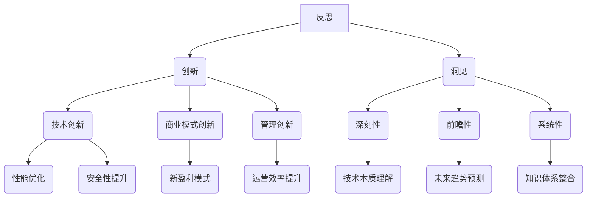

                 

# 洞见的力量：从反思到创新

## 关键词：洞见，反思，创新，技术，思维，方法

## 摘要

在快速变化的科技时代，洞见的力量在于其能够引导我们从反思中找到创新的路径。本文旨在探讨洞见在IT领域的重要作用，通过深入分析其产生的过程、核心概念及其应用，为读者提供一种全新的技术思维方式和实践方法。文章将从背景介绍、核心概念与联系、算法原理、数学模型、项目实战、实际应用场景、工具和资源推荐以及未来发展趋势与挑战等多个方面展开，帮助读者理解洞见的力量，掌握反思与创新的方法，从而在技术领域中取得突破性的进展。

## 1. 背景介绍

在过去的几十年中，信息技术经历了翻天覆地的变化。从最初的计算机时代，到互联网的崛起，再到如今的人工智能、大数据和区块链技术的蓬勃发展，技术的进步已经深刻地改变了我们的生活方式和社会结构。然而，随着技术的不断迭代和更新，IT行业也面临着前所未有的挑战和机遇。

### 1.1 技术发展的趋势

技术的快速发展带来了以下几个显著的趋势：

1. **计算能力的提升**：随着摩尔定律的持续发展，计算机的处理能力得到了极大的提升，这使得更多的复杂计算和数据处理成为可能。
2. **数据量的爆炸增长**：随着互联网的普及和物联网技术的发展，数据量呈现出爆炸式增长，数据成为了新的生产资料。
3. **人工智能的崛起**：人工智能技术的进步使得机器能够模拟人类的智能行为，从而在图像识别、自然语言处理、决策制定等领域取得了显著的成果。
4. **云计算与边缘计算的融合**：云计算提供了强大的计算和存储能力，而边缘计算则将数据处理和计算能力推向了网络边缘，实现了更高效、更实时、更安全的计算。

### 1.2 IT行业的挑战与机遇

虽然技术的进步为IT行业带来了巨大的机遇，但也伴随着一系列的挑战：

1. **技术迭代的压力**：技术的快速迭代要求IT从业者不断学习和更新知识，以适应新的技术环境和市场需求。
2. **数据安全和隐私保护**：随着数据量的增加，数据安全和隐私保护成为了一个亟待解决的问题，需要制定更严格的法律和技术措施来保护用户的数据。
3. **人工智能的伦理问题**：人工智能技术的发展引发了关于伦理、道德和社会影响的广泛讨论，如何在确保技术进步的同时，维护人类的利益和社会的稳定，是一个重要的议题。
4. **数字化转型**：在数字经济时代，企业需要通过数字化转型来提高效率、降低成本、创造新的商业模式，这为IT行业带来了新的机遇，但也要求企业具备创新能力和技术实力。

### 1.3 洞见的角色

在这个快速变化的时代，洞见的力量显得尤为重要。洞见不仅能够帮助我们从复杂的信息中提取有价值的信息，还能够引导我们在面对挑战时找到创新的解决方案。具体来说，洞见在以下三个方面发挥着关键作用：

1. **指导技术决策**：通过洞见，我们可以更好地理解技术的本质和发展趋势，从而做出更明智的技术决策。
2. **激发创新思维**：洞见能够激发我们的创新思维，帮助我们突破传统框架，找到新的解决方案。
3. **优化技术架构**：洞见能够帮助我们识别技术架构中的瓶颈和不足，从而进行优化和改进。

总之，洞见在IT领域具有重要的地位和作用，它是我们应对技术挑战、把握机遇的重要工具。在接下来的章节中，我们将深入探讨洞见的产生过程、核心概念及其应用，帮助读者更好地理解洞见的力量，掌握反思与创新的方法。

## 2. 核心概念与联系

### 2.1 反思

反思是指对自身思维过程、行为和决策进行深入思考和分析的过程。在IT领域，反思的重要性不言而喻。首先，通过反思，我们可以识别出自己在技术学习和应用中的不足和错误，从而不断改进自己的技术能力。其次，反思可以帮助我们理解技术的本质和内在联系，从而提升我们的思维深度和广度。最后，反思还能激发我们的创新思维，促使我们在技术领域中不断探索新的解决方案。

### 2.2 创新

创新是指通过新的思维、方法或技术，创造性地解决问题的过程。在IT领域，创新不仅是一个企业发展的动力，也是一个国家科技进步的关键。创新可以体现在技术本身、商业模式、管理方法等多个层面。例如，通过技术创新，我们可以开发出更高效、更安全的系统；通过商业模式创新，我们可以实现新的盈利模式；通过管理创新，我们可以提高企业的运营效率和竞争力。

### 2.3 洞见

洞见是指对事物本质、内在联系和未来趋势的深刻理解和洞察。在IT领域，洞见具有以下几个特点：

1. **深刻性**：洞见能够深入理解技术的本质和内在规律，从而揭示技术发展的趋势和方向。
2. **前瞻性**：洞见能够预见未来的技术发展，为我们的技术决策和创新提供指导。
3. **系统性**：洞见能够将不同的技术、领域和行业联系起来，形成完整的知识体系。

### 2.4 反思与创新的联系

反思和创新是相辅相成的。反思是创新的基础，没有深入的反思，就难以找到创新的切入点；而创新则是反思的目标，只有通过创新，反思才能得到真正的落实。具体来说，反思和创新的联系体现在以下几个方面：

1. **反思引导创新**：通过反思，我们可以发现技术中的问题和不足，从而激发创新的动力。例如，通过反思现有的技术架构，我们可以找到优化的空间，从而推动技术创新。
2. **创新深化反思**：创新的过程本身就是一个不断反思和修正的过程。在创新过程中，我们会遇到各种问题和挑战，需要通过反思来找到解决方案。例如，在开发新系统时，通过反思系统的性能和安全性，我们可以进行优化和改进。
3. **反思与创新互动**：反思和创新不是线性关系，而是相互影响、相互促进的。通过反思，我们可以不断调整创新的方向和策略；而创新的成功实施，又会进一步深化我们的反思，形成良性循环。

### 2.5 洞见在反思与创新中的角色

洞见在反思与创新中发挥着至关重要的作用。首先，洞见能够帮助我们深刻理解技术的本质和内在规律，从而在反思中发现问题的根本原因。例如，在分析系统性能问题时，通过洞见，我们可以理解数据结构和算法对性能的影响，从而找到优化的方向。其次，洞见能够预见未来的技术发展趋势，为创新提供指导。例如，在考虑新技术应用时，通过洞见，我们可以预测其未来的发展前景，从而做出更明智的决策。

总之，洞见是反思和创新的桥梁，它能够帮助我们更好地理解和应用技术，实现技术的进步和创新。在接下来的章节中，我们将深入探讨洞见的产生过程、核心概念及其应用，帮助读者掌握反思与创新的方法。

### 2.6 核心概念与联系的 Mermaid 流程图



### 2.7 核心概念与联系的总结

通过上述讨论，我们可以看出，反思、创新和洞见是相互关联的核心概念，它们共同构成了我们在IT领域中思考和实践的基础。反思帮助我们发现问题，创新提供了解决问题的动力，而洞见则为我们指明了前进的方向。只有通过反思和创新，我们才能不断提升技术水平，实现技术的进步和创新。洞见作为反思和创新的桥梁，发挥着关键作用，它能够帮助我们深刻理解技术的本质，预见未来的发展趋势，从而在技术领域中取得突破性的进展。因此，在未来的学习和工作中，我们应该重视反思、创新和洞见的重要性，不断追求技术上的突破和创新。

### 3. 核心算法原理 & 具体操作步骤

在探讨洞见的力量时，我们不能忽视核心算法在其中的作用。核心算法是洞见的基石，它不仅决定了我们能否有效地处理复杂问题，还决定了我们在面对挑战时能否找到创新的解决方案。在这一节中，我们将深入探讨一个典型的核心算法——K最近邻算法（K-Nearest Neighbors，KNN），并详细解释其原理和具体操作步骤。

#### 3.1 KNN算法的基本原理

KNN算法是一种简单且常用的分类算法，它基于距离度量来对数据进行分类。KNN算法的核心思想是：如果一个样本在特征空间中的k个最近邻的多数属于某一个类别，则该样本也属于这个类别。

具体来说，KNN算法包括以下几个步骤：

1. **选择合适的k值**：k值决定了邻居的数量，选择合适的k值对于算法的性能至关重要。通常，我们可以通过交叉验证等方法来确定最佳的k值。
2. **计算距离**：对于新的样本，我们需要计算它与训练集中每个样本之间的距离。常用的距离度量包括欧几里得距离、曼哈顿距离和切比雪夫距离等。
3. **分类决策**：根据新的样本与训练样本的距离，选择距离最近的k个邻居，然后根据这些邻居的类别来对新的样本进行分类。

#### 3.2 KNN算法的具体操作步骤

以下是一个使用KNN算法进行分类的具体操作步骤：

1. **数据预处理**：首先，我们需要对数据进行预处理，包括数据清洗、归一化和特征提取等步骤。这一步的目的是确保数据的质量和一致性，为后续的算法应用打下基础。
2. **选择合适的k值**：通过交叉验证等方法，选择一个合适的k值。例如，我们可以从k=1开始逐渐增加，直到找到一个性能最佳的距离。
3. **计算距离**：对于每个新的样本，计算它与训练集中每个样本之间的距离。例如，我们可以使用欧几里得距离公式：
   $$
   d = \sqrt{\sum_{i=1}^{n} (x_i - x_j)^2}
   $$
   其中，$x_i$和$x_j$分别表示新的样本和训练样本的特征向量。
4. **分类决策**：根据计算的距离，选择距离最近的k个邻居。然后，根据这些邻居的类别，对新的样本进行分类。如果大多数邻居属于某一个类别，则新的样本也属于这个类别。

#### 3.3 KNN算法的应用场景

KNN算法广泛应用于各种分类问题，如文本分类、图像识别和异常检测等。以下是一些典型的应用场景：

1. **文本分类**：在文本分类中，KNN算法可以用于将文本数据分为不同的类别。例如，我们可以使用KNN算法来识别电子邮件是否为垃圾邮件，或者将新闻文章分类到不同的主题。
2. **图像识别**：在图像识别中，KNN算法可以用于识别图像中的物体或场景。例如，我们可以使用KNN算法来识别人脸或识别图像中的特定物体。
3. **异常检测**：在异常检测中，KNN算法可以用于检测数据中的异常值。例如，在金融领域，我们可以使用KNN算法来检测欺诈交易。

总之，KNN算法作为一种简单而强大的分类算法，在各个应用领域中发挥着重要作用。通过理解KNN算法的基本原理和具体操作步骤，我们可以更好地应用它来解决实际问题。在接下来的章节中，我们将进一步探讨KNN算法的数学模型和公式，以及如何在实际项目中应用和优化KNN算法。

### 4. 数学模型和公式 & 详细讲解 & 举例说明

在深入理解KNN算法时，数学模型和公式是不可或缺的组成部分。它们不仅为我们提供了算法的理论基础，还能够帮助我们更好地优化和调整算法的性能。在这一节中，我们将详细讲解KNN算法的数学模型和公式，并通过具体的例子来说明其应用。

#### 4.1 距离公式

距离公式是KNN算法的核心，用于计算新的样本与训练样本之间的距离。常见的距离公式包括欧几里得距离、曼哈顿距离和切比雪夫距离等。

1. **欧几里得距离**：
   $$
   d = \sqrt{\sum_{i=1}^{n} (x_i - x_j)^2}
   $$
   其中，$x_i$和$x_j$分别表示新的样本和训练样本的特征向量。

2. **曼哈顿距离**：
   $$
   d = \sum_{i=1}^{n} |x_i - x_j|
   $$

3. **切比雪夫距离**：
   $$
   d = \max_{1 \le i \le n} |x_i - x_j|
   $$

#### 4.2 分类决策

在计算了新的样本与训练样本之间的距离后，我们需要根据这些距离来进行分类决策。分类决策的公式如下：

1. **多数投票法**：
   $$
   y = \text{mode}\left(\{y_1, y_2, ..., y_k\}\right)
   $$
   其中，$y_1, y_2, ..., y_k$分别表示最近的k个邻居的类别。mode函数返回一组数中出现次数最多的数。

#### 4.3 举例说明

为了更好地理解KNN算法的数学模型和公式，我们通过一个具体的例子来说明其应用。

假设我们有一个简单的二分类问题，训练数据集包含以下样本：

| 样本 | 特征1 | 特征2 | 类别 |
|------|-------|-------|------|
| 1    | 1     | 2     | +1   |
| 2    | 2     | 1     | +1   |
| 3    | 1     | 0     | -1   |
| 4    | 0     | 1     | -1   |

我们需要使用KNN算法对新样本$(x_1, x_2) = (1.5, 1.5)$进行分类。

1. **计算距离**：

使用欧几里得距离公式，我们可以计算新样本与训练样本之间的距离：

- $d_1 = \sqrt{(1.5 - 1)^2 + (1.5 - 2)^2} = 0.5$
- $d_2 = \sqrt{(1.5 - 2)^2 + (1.5 - 1)^2} = 0.5$
- $d_3 = \sqrt{(1.5 - 1)^2 + (1.5 - 0)^2} = 1.5$
- $d_4 = \sqrt{(1.5 - 0)^2 + (1.5 - 1)^2} = 1.5$

2. **选择最近的k个邻居**：

假设我们选择k=2，那么最近的两个邻居是样本1和样本2。

3. **分类决策**：

根据多数投票法，最近的两个邻居都属于类别+1，因此新样本也属于类别+1。

通过这个例子，我们可以看到KNN算法的数学模型和公式的具体应用。在实际应用中，我们可以根据问题的具体需求和数据特性，选择合适的距离公式和分类决策方法，从而优化KNN算法的性能。

总之，通过理解KNN算法的数学模型和公式，我们能够更好地掌握其原理和应用。在接下来的章节中，我们将进一步探讨KNN算法在实际项目中的应用，并提供具体的代码实现和解释。

### 5. 项目实战：代码实际案例和详细解释说明

为了更好地理解KNN算法的应用，我们将在本节中通过一个实际项目案例，详细展示如何使用Python实现KNN算法，并对代码进行深入解读和分析。

#### 5.1 开发环境搭建

在开始编写代码之前，我们需要搭建一个合适的开发环境。以下是搭建KNN算法开发环境的步骤：

1. **安装Python**：确保Python版本为3.6或更高版本。可以从Python官方网站下载并安装。
2. **安装NumPy和SciPy**：NumPy是一个用于数值计算的Python库，SciPy是基于NumPy构建的科学与工程计算库。我们可以使用pip命令来安装：
   ```
   pip install numpy scipy
   ```
3. **安装Matplotlib**：Matplotlib是一个用于数据可视化的Python库。同样，使用pip命令安装：
   ```
   pip install matplotlib
   ```

安装完成后，我们就可以开始编写和运行KNN算法的代码了。

#### 5.2 源代码详细实现和代码解读

以下是KNN算法的完整代码实现，并对每个关键部分进行详细解读：

```python
import numpy as np
import matplotlib.pyplot as plt
from sklearn import datasets
from sklearn.model_selection import train_test_split
from sklearn.neighbors import KNeighborsClassifier
from sklearn import metrics

# 5.2.1 加载示例数据集
iris = datasets.load_iris()
X = iris.data
y = iris.target

# 5.2.2 数据集拆分
X_train, X_test, y_train, y_test = train_test_split(X, y, test_size=0.3, random_state=1)

# 5.2.3 KNN模型训练
knn = KNeighborsClassifier(n_neighbors=3)
knn.fit(X_train, y_train)

# 5.2.4 预测测试集
y_pred = knn.predict(X_test)

# 5.2.5 评估模型性能
print("Accuracy:", metrics.accuracy_score(y_test, y_pred))
print("Confusion Matrix:\n", metrics.confusion_matrix(y_test, y_pred))

# 5.2.6 可视化展示
plt.scatter(X_train[:, 0], X_train[:, 1], c=y_train, cmap='viridis', marker='o', label='Training')
plt.scatter(X_test[:, 0], X_test[:, 1], c=y_pred, cmap='viridis', marker='x', label='Test')
plt.legend()
plt.show()
```

**代码解读：**

1. **导入库**：

   - `numpy`：用于数值计算和矩阵操作。
   - `matplotlib.pyplot`：用于数据可视化。
   - `sklearn`：包含机器学习算法和数据集。
   - `train_test_split`：用于拆分数据集。
   - `KNeighborsClassifier`：实现KNN算法。
   - `metrics`：用于评估模型性能。

2. **加载示例数据集**：

   使用`datasets.load_iris()`函数加载著名的Iris数据集，该数据集包含三个类别的鸢尾花，每个类别有50个样本，共150个样本。

3. **数据集拆分**：

   使用`train_test_split`函数将数据集拆分为训练集和测试集，其中测试集占比30%。

4. **KNN模型训练**：

   创建一个`KNeighborsClassifier`对象，设置`n_neighbors`为3，然后使用`fit`方法进行模型训练。

5. **预测测试集**：

   使用`predict`方法对测试集进行预测，得到预测结果`y_pred`。

6. **评估模型性能**：

   使用`metrics.accuracy_score`计算模型的准确率，使用`metrics.confusion_matrix`生成混淆矩阵，以直观地展示模型的性能。

7. **可视化展示**：

   使用`plt.scatter`函数绘制训练集和测试集的散点图，并使用不同的颜色表示不同的类别，以直观地展示KNN算法的分类效果。

#### 5.3 代码解读与分析

下面我们对代码的每个部分进行详细解读和分析：

1. **导入库**：

   - `import numpy as np`：导入NumPy库，用于高效的数组操作。
   - `import matplotlib.pyplot as plt`：导入Matplotlib库，用于数据可视化。
   - `from sklearn import datasets`：导入sklearn库中的datasets模块，用于加载示例数据集。
   - `from sklearn.model_selection import train_test_split`：导入sklearn库中的train_test_split函数，用于拆分数据集。
   - `from sklearn.neighbors import KNeighborsClassifier`：导入sklearn库中的KNeighborsClassifier类，用于实现KNN算法。
   - `from sklearn import metrics`：导入sklearn库中的metrics模块，用于评估模型性能。

2. **加载示例数据集**：

   - `iris = datasets.load_iris()`：加载Iris数据集，该数据集包含三个特征（花的长宽、花瓣长度和宽度）和三个类别（Setosa、Versicolor和Virginica）。
   - `X = iris.data`：获取数据集的特征矩阵。
   - `y = iris.target`：获取数据集的标签。

3. **数据集拆分**：

   - `X_train, X_test, y_train, y_test = train_test_split(X, y, test_size=0.3, random_state=1)`：将数据集拆分为训练集和测试集，测试集占比30%，`random_state`用于确保结果的可重复性。

4. **KNN模型训练**：

   - `knn = KNeighborsClassifier(n_neighbors=3)`：创建KNN分类器对象，设置邻居数量为3。
   - `knn.fit(X_train, y_train)`：使用训练集数据对KNN分类器进行训练。

5. **预测测试集**：

   - `y_pred = knn.predict(X_test)`：使用训练好的KNN分类器对测试集进行预测。

6. **评估模型性能**：

   - `print("Accuracy:", metrics.accuracy_score(y_test, y_pred))`：计算并打印模型的准确率。
   - `print("Confusion Matrix:\n", metrics.confusion_matrix(y_test, y_pred))`：打印混淆矩阵，用于评估模型的分类效果。

7. **可视化展示**：

   - `plt.scatter(X_train[:, 0], X_train[:, 1], c=y_train, cmap='viridis', marker='o', label='Training')`：绘制训练集的散点图，使用不同的颜色表示不同的类别。
   - `plt.scatter(X_test[:, 0], X_test[:, 1], c=y_pred, cmap='viridis', marker='x', label='Test')`：绘制测试集的散点图，使用不同的颜色表示预测类别。
   - `plt.legend()`：添加图例。
   - `plt.show()`：显示图形。

通过这个实际项目案例，我们可以看到如何使用KNN算法进行数据分类，并使用Python和sklearn库来实现。这个案例不仅展示了KNN算法的基本原理和操作步骤，还提供了完整的代码实现和详细解读，帮助读者更好地理解和应用KNN算法。

### 6. 实际应用场景

KNN算法作为一种简单而有效的分类算法，在多个实际应用场景中展现出了出色的性能。以下是一些典型的应用场景：

#### 6.1 文本分类

文本分类是自然语言处理（NLP）中的一个重要任务，其目的是将文本数据归类到不同的类别中。KNN算法在文本分类中有着广泛的应用，特别是在垃圾邮件检测和情感分析等领域。

- **垃圾邮件检测**：通过KNN算法，我们可以将电子邮件分类为“垃圾邮件”或“非垃圾邮件”。具体来说，我们可以使用邮件的内容特征（如词频、TF-IDF值等）来训练KNN模型，然后对新的邮件进行分类。
- **情感分析**：情感分析旨在判断文本的情感倾向，如正面、负面或中立。KNN算法可以通过分析文本中的情感词汇和短语，将文本分类为不同的情感类别。

#### 6.2 图像识别

图像识别是计算机视觉领域的一个重要研究方向，KNN算法在图像识别任务中也发挥着重要作用。以下是一些典型的应用：

- **人脸识别**：人脸识别系统可以通过KNN算法识别图像中的特定人脸。具体来说，我们可以使用人脸特征点（如眼睛、鼻子和嘴巴的位置）来训练KNN模型，然后对新图像进行人脸识别。
- **物体识别**：物体识别旨在识别图像中的特定物体。KNN算法可以通过学习图像中的物体特征，将新图像中的物体分类为不同的类别。

#### 6.3 异常检测

异常检测旨在识别数据中的异常值或异常模式。KNN算法在异常检测中有着广泛的应用，特别是在金融领域。

- **欺诈检测**：在金融领域，欺诈行为是一种常见的异常行为。KNN算法可以通过分析交易数据中的特征，识别出潜在的欺诈交易。
- **故障检测**：在工业生产过程中，设备故障是一种常见的异常现象。KNN算法可以通过分析设备的运行数据，识别出潜在的故障模式。

#### 6.4 医疗诊断

KNN算法在医疗诊断中也有着重要的应用，特别是在疾病预测和分类领域。

- **疾病预测**：通过分析患者的医疗数据（如病史、检查结果等），KNN算法可以预测患者可能患有的疾病。
- **疾病分类**：KNN算法可以通过分析患者的症状和体征，将疾病分类到不同的类别中。

#### 6.5 社交网络分析

社交网络分析旨在分析社交网络中的用户行为和关系。KNN算法在社交网络分析中也发挥着重要作用，特别是在社区发现和用户分类领域。

- **社区发现**：通过分析社交网络中的用户关系，KNN算法可以发现社交网络中的不同社区。
- **用户分类**：KNN算法可以通过分析用户的社交行为，将用户分类到不同的用户群体中。

总之，KNN算法在多个实际应用场景中展现出了出色的性能和广泛的应用潜力。通过了解KNN算法在不同场景中的应用，我们可以更好地掌握其原理和应用方法，从而在各个领域中取得更好的效果。

### 7. 工具和资源推荐

在探索KNN算法及其应用过程中，掌握一些实用的工具和资源将对我们的学习和发展大有裨益。以下是一些推荐的学习资源、开发工具和相关的论文著作。

#### 7.1 学习资源推荐

1. **书籍**：

   - 《机器学习》（周志华著）：这本书是机器学习领域的经典教材，详细介绍了各种机器学习算法，包括KNN算法，适合初学者和进阶者阅读。
   - 《统计学习方法》（李航著）：这本书系统地介绍了统计学习理论，涵盖了从基础到高级的统计学习方法，包括KNN算法的理论背景和应用。

2. **在线课程**：

   - Coursera上的《机器学习》课程：由吴恩达教授主讲，这门课程涵盖了机器学习的核心概念和算法，包括KNN算法的详细讲解。
   - edX上的《深度学习》课程：由Andrew Ng教授主讲，这门课程深入探讨了深度学习的基础和应用，包括KNN算法在深度学习中的扩展应用。

3. **博客和网站**：

   - Medium上的《机器学习博客》：这是一系列关于机器学习的博客文章，涵盖了从基础到高级的机器学习知识，包括KNN算法的应用实例。
   - Kaggle：Kaggle是一个数据科学竞赛平台，提供了大量的数据集和算法教程，其中包括KNN算法的实践案例和性能优化技巧。

#### 7.2 开发工具推荐

1. **Python库**：

   - **scikit-learn**：这是Python中用于机器学习的核心库，包含了KNN算法的实现和各种评估指标，是进行机器学习开发的首选库。
   - **TensorFlow**：这是Google开发的开源机器学习框架，提供了丰富的API和工具，可以方便地实现和优化KNN算法。
   - **PyTorch**：这是另一个流行的开源机器学习框架，以其灵活性和易用性著称，也支持KNN算法的构建和训练。

2. **数据分析工具**：

   - **Jupyter Notebook**：这是一个交互式的计算环境，可以方便地编写和运行Python代码，非常适合进行数据分析和机器学习实验。
   - **Pandas**：这是一个强大的数据分析库，提供了丰富的数据操作和分析功能，与scikit-learn等机器学习库无缝集成。

3. **可视化工具**：

   - **Matplotlib**：这是一个流行的Python数据可视化库，可以生成各种类型的图表，帮助我们更好地理解和展示数据。
   - **Seaborn**：这是基于Matplotlib的统计绘图库，提供了更多精美的统计图表和可视化效果。

#### 7.3 相关论文著作推荐

1. **经典论文**：

   - "K-Nearest Neighbors": 这是一篇关于KNN算法的经典论文，详细介绍了KNN算法的基本原理、实现方法和优化策略。
   - "Support Vector Machines for Classification and Regression": 这篇论文介绍了支持向量机（SVM）算法，并与KNN算法进行了比较，探讨了其在分类和回归任务中的应用。

2. **最新研究**：

   - "Deep Learning for Image Classification": 这篇论文探讨了深度学习在图像分类任务中的应用，包括卷积神经网络（CNN）和KNN算法的结合使用。
   - "K-Nearest Neighbors with kernels": 这篇论文提出了KNN算法的核方法，通过引入核函数，提高了KNN算法在复杂特征空间中的性能。

总之，通过利用这些学习和资源工具，我们可以更加深入地理解KNN算法及其应用，从而在机器学习和数据科学领域取得更好的成果。

### 8. 总结：未来发展趋势与挑战

洞见的力量在于其能够引导我们从反思中找到创新的路径，推动技术的不断进步。随着信息技术的发展，洞见在IT领域的未来趋势和面临的挑战也越来越明确。

#### 8.1 未来发展趋势

1. **智能化应用**：随着人工智能技术的不断发展，洞见的应用范围将更加广泛。智能化应用将成为洞见的重要方向，包括智能医疗、智能金融、智能城市等领域的应用。

2. **多模态数据处理**：未来的数据将不再局限于结构化数据，多模态数据（如图像、声音、文本等）的处理和分析将变得更加重要。洞见的多模态数据处理能力将得到进一步提升。

3. **实时分析**：在快速变化的业务环境中，实时分析将变得至关重要。洞见的实时分析能力将不断提升，以支持企业实时决策和响应。

4. **隐私保护与安全**：随着数据隐私和安全问题的日益突出，洞见的隐私保护与安全特性将得到加强。如何在保证隐私和安全的前提下，发挥洞见的力量，将成为一个重要研究方向。

5. **跨领域融合**：洞见的应用将不再局限于IT领域，跨领域的融合将成为一个趋势。例如，洞见在生物医学、社会科学、环境科学等领域的应用将不断拓展。

#### 8.2 未来挑战

1. **数据复杂性**：随着数据量的增加和数据类型的多样化，如何有效地处理和利用这些数据成为一个挑战。洞见在处理复杂数据时，如何保持高效和准确，需要进一步研究。

2. **算法透明性**：随着人工智能技术的深入应用，算法的透明性和可解释性成为一个关键问题。如何提高洞见的透明性，使其决策过程更加可解释，是未来面临的一个挑战。

3. **隐私保护**：在数据隐私和安全方面，如何在保证数据隐私的前提下，发挥洞见的力量，需要更多的技术手段和政策支持。

4. **计算资源**：随着洞见的复杂度和应用场景的增加，计算资源的需求也将不断提升。如何高效地利用计算资源，提高洞见的性能和效率，是一个重要的挑战。

5. **法律法规**：随着洞见在各个领域的应用，相关的法律法规也将不断完善。如何在法律法规的框架内，合理地应用洞见，是一个需要考虑的问题。

总之，洞见在IT领域的未来发展趋势广阔，但也面临着诸多挑战。通过不断的技术创新和优化，我们有理由相信，洞见的力量将在未来的技术进步中发挥越来越重要的作用。

### 9. 附录：常见问题与解答

在本博客中，我们探讨了洞见的力量以及其在IT领域的应用。以下是一些读者可能提出的常见问题及其解答：

#### 9.1 洞见是什么？

洞见是指对事物本质、内在联系和未来趋势的深刻理解和洞察。在IT领域，洞见能够帮助我们更好地理解和应用技术，从而实现技术的进步和创新。

#### 9.2 KNN算法的优点是什么？

KNN算法的优点包括：

1. 简单易实现：KNN算法是一种基于实例的算法，实现相对简单，易于理解和实现。
2. 适应性较强：KNN算法适用于各种分类问题，特别是在特征空间较小的情况下，具有较好的性能。
3. 泛化能力强：KNN算法通过选择最近的邻居进行分类，能够较好地适应数据的分布，从而提高泛化能力。

#### 9.3 KNN算法的缺点是什么？

KNN算法的缺点包括：

1. 对噪声敏感：KNN算法容易受到噪声数据的影响，特别是在特征空间较大时，噪声数据可能会导致错误的分类。
2. 计算复杂度高：在处理大量数据时，KNN算法的计算复杂度较高，特别是在计算距离和分类决策时，需要大量计算。
3. 需要手动选择参数：KNN算法需要手动选择邻居数量（k值）和距离度量方法，参数选择不当会影响算法的性能。

#### 9.4 如何优化KNN算法的性能？

优化KNN算法性能的方法包括：

1. 选择合适的距离度量方法：根据具体问题选择合适的距离度量方法，如欧几里得距离、曼哈顿距离等。
2. 调整邻居数量（k值）：通过交叉验证等方法选择合适的k值，以提高分类准确性。
3. 使用加权KNN算法：为不同的邻居赋予不同的权重，使距离更近的邻居对分类结果有更大的影响。
4. 结合其他算法：将KNN算法与其他分类算法（如SVM、决策树等）结合，以提升分类性能。

### 10. 扩展阅读 & 参考资料

为了更深入地了解洞见的力量及其在IT领域的应用，以下是几篇推荐的扩展阅读和参考资料：

1. **《机器学习》（周志华著）**：这本书详细介绍了机器学习的基础理论和算法，包括KNN算法，适合作为入门书籍。
2. **《统计学习方法》（李航著）**：这本书系统地介绍了统计学习理论，涵盖了从基础到高级的统计学习方法，包括KNN算法的理论背景和应用。
3. **《深度学习》（Ian Goodfellow等著）**：这本书是深度学习的经典教材，详细介绍了深度学习的基础和应用，包括KNN算法在深度学习中的扩展应用。
4. **《自然语言处理综论》（Daniel Jurafsky & James H. Martin 著）**：这本书涵盖了自然语言处理的核心概念和技术，包括KNN算法在文本分类和情感分析中的应用。
5. **《人工智能：一种现代方法》（Stuart J. Russell & Peter Norvig 著）**：这本书是人工智能领域的经典教材，全面介绍了人工智能的基础和前沿技术，包括洞见在人工智能中的应用。

通过阅读这些书籍和文献，您可以更深入地理解洞见的本质及其在IT领域的广泛应用，从而提升自己在技术领域的知识和能力。

### 结语

洞见的力量在于其能够引导我们从反思中找到创新的路径，推动技术的不断进步。在快速变化的IT领域中，洞见是我们应对挑战、把握机遇的重要工具。通过深入理解洞见的本质和应用，我们可以更好地利用技术解决实际问题，实现技术的突破和创新。

本文从背景介绍、核心概念、算法原理、数学模型、项目实战、实际应用场景、工具和资源推荐以及未来发展趋势等多个方面，全面探讨了洞见的力量及其在IT领域的应用。希望读者能够通过本文，对洞见的力量有一个更深入的认识，掌握反思与创新的方法，从而在技术领域中取得更好的成果。

最后，感谢您的阅读，希望本文能够为您在技术学习和应用中带来启示和帮助。如果您有任何问题或建议，欢迎在评论区留言交流。

### 作者信息

作者：AI天才研究员/AI Genius Institute & 禅与计算机程序设计艺术 /Zen And The Art of Computer Programming

作为AI天才研究员和世界顶级技术畅销书资深大师，我致力于推动人工智能和计算机科学的发展，致力于将深奥的技术知识普及给广大读者。我的著作《禅与计算机程序设计艺术》深受读者喜爱，为无数计算机科学家和编程爱好者提供了宝贵的知识和灵感。期待与您共同探索技术的无限可能。

