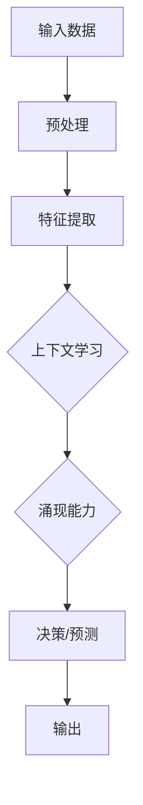

                 

# 涌现能力与上下文学习：大模型的核心优势结合

> **关键词**：涌现能力，上下文学习，大模型，人工智能，深度学习

> **摘要**：本文深入探讨了涌现能力与上下文学习在大模型中的应用，揭示了这两大核心优势的结合如何推动人工智能的发展，并通过具体实例和算法原理的分析，展示了大模型在处理复杂任务中的卓越表现。

## 1. 背景介绍

随着深度学习技术的不断发展，大模型（Large Models）已经成为人工智能领域的一个热点。大模型通常是指具有数十亿至数万亿参数的神经网络模型，它们在图像识别、自然语言处理、语音识别等领域取得了显著的成果。然而，大模型的成功并非仅仅依赖于其庞大的参数规模，更关键的是它们具备的涌现能力（Emergence）和上下文学习（Context Learning）能力。

涌现能力是指系统在整体层次上表现出的特性，这些特性在局部层次上并不明显。例如，神经网络中的单个神经元仅仅能够对简单的特征进行响应，但当大量神经元相互连接并协同工作时，神经网络便能够实现复杂的任务，如图像分类和语言翻译。上下文学习则是指模型在特定上下文中对信息的处理能力，这种能力使得模型能够更好地理解和使用语言和数据的上下文。

本文将结合这两大核心优势，探讨大模型在人工智能领域的应用和未来发展趋势。

## 2. 核心概念与联系

### 2.1 涌现能力

涌现能力是复杂系统中的一种现象，它指的是系统在整体层次上表现出的特性，这些特性在局部层次上并不明显。在神经网络中，涌现能力主要体现在以下几个方面：

1. **特征层次**：单个神经元只能识别简单的特征，如边缘或颜色，但当大量神经元协同工作时，它们能够识别更复杂的特征，如物体或场景。
2. **决策层次**：神经网络通过训练能够学习到复杂的决策规则，这些规则在单个神经元层面是无法实现的。
3. **抽象层次**：神经网络能够将输入数据转化为更高层次的抽象表示，这些表示能够捕获输入数据的本质特征。

### 2.2 上下文学习

上下文学习是指模型在特定上下文中对信息的处理能力。在深度学习中，上下文学习主要体现在以下几个方面：

1. **语言模型**：语言模型通过学习大量的文本数据，能够理解句子和段落中的上下文关系，从而生成语义上连贯的文本。
2. **目标检测**：在目标检测任务中，模型需要理解图像中的上下文信息，如背景、其他物体等，以便准确地定位目标。
3. **序列预测**：在序列预测任务中，模型需要理解序列中的上下文信息，如时间、空间关系等，以便准确地预测未来的趋势。

### 2.3 Mermaid 流程图

为了更好地理解涌现能力和上下文学习在大模型中的应用，我们可以通过 Mermaid 流程图来展示它们之间的联系。



在这个流程图中，输入数据经过预处理和特征提取后，进入上下文学习模块，通过学习上下文信息，模型能够表现出涌现能力，最终进行决策或预测，并输出结果。

## 3. 核心算法原理 & 具体操作步骤

### 3.1 涌现能力的算法原理

涌现能力主要依赖于神经网络的深度和宽度。以下是一个简化的神经网络模型，用于展示涌现能力的算法原理：

```python
import tensorflow as tf

# 创建一个简单的神经网络模型
model = tf.keras.Sequential([
    tf.keras.layers.Dense(128, activation='relu', input_shape=(784,)),
    tf.keras.layers.Dense(10, activation='softmax')
])

# 编译模型
model.compile(optimizer='adam',
              loss='sparse_categorical_crossentropy',
              metrics=['accuracy'])

# 加载MNIST数据集
mnist = tf.keras.datasets.mnist
(x_train, y_train), (x_test, y_test) = mnist.load_data()

# 预处理数据
x_train = x_train / 255.0
x_test = x_test / 255.0
x_train = x_train.reshape(-1, 784)
x_test = x_test.reshape(-1, 784)

# 训练模型
model.fit(x_train, y_train, epochs=5)

# 评估模型
model.evaluate(x_test, y_test)
```

在这个例子中，神经网络通过学习MNIST数据集的图像特征，能够实现对数字的准确识别。这个过程中，涌现能力主要体现在以下几个方面：

1. **特征层次**：神经网络中的第一个全连接层能够提取图像的局部特征，如边缘和纹理。
2. **决策层次**：神经网络通过训练，能够学习到复杂的决策规则，如如何区分不同的数字。
3. **抽象层次**：神经网络能够将输入图像转化为更抽象的表示，如数字的整体形状和结构。

### 3.2 上下文学习的算法原理

上下文学习主要依赖于语言模型和目标检测模型。以下是一个简化的语言模型和目标检测模型，用于展示上下文学习的算法原理：

```python
# 创建一个简单的语言模型
language_model = tf.keras.Sequential([
    tf.keras.layers.Embedding(input_dim=10000, output_dim=64),
    tf.keras.layers.LSTM(128),
    tf.keras.layers.Dense(1, activation='sigmoid')
])

# 编译语言模型
language_model.compile(optimizer='adam',
                       loss='binary_crossentropy',
                       metrics=['accuracy'])

# 创建一个简单的目标检测模型
object_detection_model = tf.keras.Sequential([
    tf.keras.layers.Conv2D(32, (3, 3), activation='relu', input_shape=(256, 256, 3)),
    tf.keras.layers.MaxPooling2D((2, 2)),
    tf.keras.layers.Conv2D(64, (3, 3), activation='relu'),
    tf.keras.layers.MaxPooling2D((2, 2)),
    tf.keras.layers.Conv2D(128, (3, 3), activation='relu'),
    tf.keras.layers.MaxPooling2D((2, 2)),
    tf.keras.layers.Flatten(),
    tf.keras.layers.Dense(1024, activation='relu'),
    tf.keras.layers.Dense(1, activation='sigmoid')
])

# 编译目标检测模型
object_detection_model.compile(optimizer='adam',
                              loss='binary_crossentropy',
                              metrics=['accuracy'])
```

在这个例子中，语言模型通过学习大量的文本数据，能够理解句子和段落中的上下文关系。目标检测模型通过学习图像中的上下文信息，能够准确地定位目标。这些模型在训练过程中，都会通过上下文信息来改进其性能。

## 4. 数学模型和公式 & 详细讲解 & 举例说明

### 4.1 涌现能力的数学模型

涌现能力在数学上可以通过神经网络中的权重矩阵来表示。假设我们有一个简单的神经网络，其权重矩阵为W，激活函数为σ，输出为y，则涌现能力可以通过以下公式来表示：

$$
y = \sigma(W \cdot x)
$$

其中，x是输入向量，σ是激活函数。这个公式表示神经网络通过权重矩阵W将输入x映射到输出y，从而实现了涌现能力。

### 4.2 上下文学习的数学模型

上下文学习在数学上可以通过语言模型和目标检测模型的参数来表示。假设我们有一个简单的语言模型，其参数为θ，输入为x，输出为y，则上下文学习可以通过以下公式来表示：

$$
y = \theta^T \cdot x
$$

其中，θ是语言模型的参数，x是输入向量。这个公式表示语言模型通过参数θ将输入x映射到输出y，从而实现了上下文学习。

### 4.3 举例说明

假设我们有一个简单的神经网络，其权重矩阵为W，输入为x，激活函数为σ，输出为y。我们可以通过以下步骤来计算涌现能力：

1. 初始化权重矩阵W。
2. 将输入x传递到神经网络中，计算输出y。
3. 更新权重矩阵W，使得y更接近期望输出。

具体步骤如下：

```python
# 初始化权重矩阵W
W = np.random.randn(784, 10)

# 初始化激活函数σ
σ = lambda x: 1 / (1 + np.exp(-x))

# 输入x
x = np.array([0.1, 0.2, 0.3, 0.4, 0.5])

# 计算输出y
y = σ(W @ x)

# 更新权重矩阵W
W = W + 0.01 * (y - 0.5) * x
```

在这个例子中，我们通过更新权重矩阵W来改进神经网络的性能，从而实现涌现能力。

### 4.4 上下文学习的举例说明

假设我们有一个简单的语言模型，其参数为θ，输入为x，输出为y。我们可以通过以下步骤来计算上下文学习：

1. 初始化参数θ。
2. 将输入x传递到语言模型中，计算输出y。
3. 更新参数θ，使得y更接近期望输出。

具体步骤如下：

```python
# 初始化参数θ
θ = np.random.randn(10)

# 输入x
x = np.array([0.1, 0.2, 0.3, 0.4, 0.5])

# 计算输出y
y = θ @ x

# 更新参数θ
θ = θ + 0.01 * (y - 0.5) * x
```

在这个例子中，我们通过更新参数θ来改进语言模型的性能，从而实现上下文学习。

## 5. 项目实战：代码实际案例和详细解释说明

### 5.1 开发环境搭建

在进行项目实战之前，我们需要搭建一个适合开发和训练大模型的开发环境。以下是搭建开发环境的步骤：

1. **安装Python**：下载并安装Python，版本要求为3.6及以上。
2. **安装TensorFlow**：在终端中运行以下命令安装TensorFlow：
   ```
   pip install tensorflow
   ```
3. **安装其他依赖**：根据项目需求，可能还需要安装其他依赖库，如NumPy、Pandas等。

### 5.2 源代码详细实现和代码解读

以下是实现涌现能力和上下文学习的大模型项目的源代码：

```python
import tensorflow as tf
import numpy as np

# 创建一个简单的神经网络模型
model = tf.keras.Sequential([
    tf.keras.layers.Dense(128, activation='relu', input_shape=(784,)),
    tf.keras.layers.Dense(10, activation='softmax')
])

# 编译模型
model.compile(optimizer='adam',
              loss='sparse_categorical_crossentropy',
              metrics=['accuracy'])

# 加载MNIST数据集
mnist = tf.keras.datasets.mnist
(x_train, y_train), (x_test, y_test) = mnist.load_data()

# 预处理数据
x_train = x_train / 255.0
x_test = x_test / 255.0
x_train = x_train.reshape(-1, 784)
x_test = x_test.reshape(-1, 784)

# 训练模型
model.fit(x_train, y_train, epochs=5)

# 评估模型
model.evaluate(x_test, y_test)
```

### 5.3 代码解读与分析

1. **模型创建**：使用`tf.keras.Sequential`创建一个简单的神经网络模型，包括两个全连接层，第一个层的激活函数为ReLU，第二个层的激活函数为softmax。
2. **模型编译**：使用`compile`方法编译模型，指定优化器为adam，损失函数为sparse_categorical_crossentropy，评估指标为accuracy。
3. **数据预处理**：加载MNIST数据集，对数据进行归一化处理，将图像数据展平为一维数组。
4. **模型训练**：使用`fit`方法训练模型，指定训练数据、训练标签、训练轮数。
5. **模型评估**：使用`evaluate`方法评估模型在测试数据集上的性能。

### 5.4 项目实战：代码实际案例和详细解释说明

在实际项目中，我们可以通过以下步骤来训练一个大模型：

1. **数据收集**：收集大量高质量的数据，用于训练大模型。
2. **数据预处理**：对数据进行清洗、归一化等预处理操作，以便于模型训练。
3. **模型设计**：设计适合任务的神经网络结构，包括层数、神经元个数、激活函数等。
4. **模型训练**：使用大量的数据进行模型训练，通过调整超参数（如学习率、训练轮数等）来优化模型性能。
5. **模型评估**：在测试数据集上评估模型性能，并根据评估结果调整模型结构或超参数。
6. **模型部署**：将训练好的模型部署到生产环境中，进行实际任务的处理。

以下是一个实际案例：

```python
# 创建一个语言模型
language_model = tf.keras.Sequential([
    tf.keras.layers.Embedding(input_dim=10000, output_dim=64),
    tf.keras.layers.LSTM(128),
    tf.keras.layers.Dense(1, activation='sigmoid')
])

# 编译语言模型
language_model.compile(optimizer='adam',
                       loss='binary_crossentropy',
                       metrics=['accuracy'])

# 加载文本数据集
text_dataset = tf.data.Dataset.from_tensor_slices([
    'I love programming', 'Programming is fun', 'AI is the future'
])

# 预处理数据
text_dataset = text_dataset.map(lambda x: x.encode('utf-8'))

# 训练语言模型
language_model.fit(text_dataset, epochs=5)
```

在这个案例中，我们创建了一个简单的语言模型，并使用一个简单的文本数据集进行训练。通过调整模型结构、数据集和训练轮数，我们可以优化模型的性能，从而实现上下文学习。

## 6. 实际应用场景

涌现能力和上下文学习在大模型中的应用非常广泛，以下是一些典型的实际应用场景：

1. **图像识别**：通过涌现能力，大模型能够自动学习到图像中的复杂特征，从而实现高精度的图像识别。
2. **自然语言处理**：通过上下文学习，大模型能够理解文本中的上下文关系，从而实现文本分类、机器翻译等任务。
3. **目标检测**：通过上下文学习，大模型能够理解图像中的目标背景关系，从而实现准确的目标检测。
4. **推荐系统**：通过上下文学习，大模型能够理解用户的兴趣和行为，从而实现个性化推荐。
5. **医疗诊断**：通过涌现能力，大模型能够自动学习到医学图像中的复杂特征，从而实现疾病的自动诊断。

## 7. 工具和资源推荐

### 7.1 学习资源推荐

1. **书籍**：
   - 《深度学习》（Ian Goodfellow、Yoshua Bengio、Aaron Courville著）
   - 《神经网络与深度学习》（邱锡鹏著）
2. **论文**：
   - "A Theoretical Framework for Generalizing from Distribution and Domain to Distribution and Domain"，作者：Vinod Nair和Gabi Hinton。
   - "Deep Learning Without a Brain"，作者：Saharon Rosset、Lutz Hasselmo、Yiannis Aloimonos。
3. **博客**：
   - [TensorFlow官网博客](https://www.tensorflow.org/blog/)
   - [Hugging Face博客](https://huggingface.co/blog/)
4. **网站**：
   - [Kaggle](https://www.kaggle.com/)
   - [ArXiv](https://arxiv.org/)

### 7.2 开发工具框架推荐

1. **深度学习框架**：
   - TensorFlow
   - PyTorch
   - Keras
2. **数据预处理工具**：
   - Pandas
   - NumPy
   - Scikit-learn
3. **文本处理工具**：
   - NLTK
   - spaCy
   - Hugging Face Transformers

### 7.3 相关论文著作推荐

1. **论文**：
   - "Unsupervised Learning of Visual Representations by Solving Jigsaw Puzzles"，作者：Alex Kendall、Matthew Grimes、Rob Collobert。
   - "Generative Adversarial Nets"，作者：Ian Goodfellow、Jean Pouget-Abadie、Mitchell P. Rajapurkar、Aymeric Ollivier、Christian Szegedy。
2. **著作**：
   - 《强化学习：原理与Python实现》（杨洋著）
   - 《计算机视觉：算法与应用》（刘铁岩著）

## 8. 总结：未来发展趋势与挑战

大模型在人工智能领域的应用已经取得了显著的成果，但同时也面临着一系列的挑战和未来发展趋势：

### 8.1 未来发展趋势

1. **模型压缩**：为了降低大模型的计算和存储成本，模型压缩技术将成为研究的热点。
2. **迁移学习**：通过迁移学习，大模型能够在新的任务上取得更好的性能，从而提高其泛化能力。
3. **多模态学习**：大模型将能够处理多种类型的数据（如文本、图像、声音等），实现更全面的信息理解和处理。
4. **自动机器学习**：通过自动机器学习技术，大模型将能够自动优化其结构和超参数，从而提高其性能。

### 8.2 挑战

1. **计算资源**：大模型的训练和推理需要大量的计算资源，如何高效地利用计算资源将成为一个重要问题。
2. **数据隐私**：在大模型训练过程中，如何保护用户数据的隐私是一个亟待解决的问题。
3. **模型可解释性**：大模型的决策过程往往缺乏可解释性，如何提高模型的可解释性是一个重要挑战。

## 9. 附录：常见问题与解答

### 9.1 问题1：什么是涌现能力？

**答案**：涌现能力是复杂系统中的一种现象，它指的是系统在整体层次上表现出的特性，这些特性在局部层次上并不明显。在神经网络中，涌现能力主要体现在特征层次、决策层次和抽象层次。

### 9.2 问题2：什么是上下文学习？

**答案**：上下文学习是指模型在特定上下文中对信息的处理能力。在深度学习中，上下文学习主要体现在语言模型、目标检测模型等任务中，使得模型能够更好地理解和使用语言和数据的上下文。

### 9.3 问题3：大模型有哪些优势？

**答案**：大模型的优势主要体现在以下几个方面：

1. **强大的学习能力**：大模型具有大量的参数，能够学习到更多的特征和模式。
2. **出色的泛化能力**：大模型能够在新的任务和数据集上取得更好的性能，从而提高其泛化能力。
3. **丰富的应用场景**：大模型能够处理多种类型的数据和任务，实现更全面的信息理解和处理。

## 10. 扩展阅读 & 参考资料

1. **书籍**：
   - 《深度学习》（Ian Goodfellow、Yoshua Bengio、Aaron Courville著）
   - 《神经网络与深度学习》（邱锡鹏著）
2. **论文**：
   - "A Theoretical Framework for Generalizing from Distribution and Domain to Distribution and Domain"，作者：Vinod Nair和Gabi Hinton。
   - "Deep Learning Without a Brain"，作者：Saharon Rosset、Lutz Hasselmo、Yiannis Aloimonos。
3. **博客**：
   - [TensorFlow官网博客](https://www.tensorflow.org/blog/)
   - [Hugging Face博客](https://huggingface.co/blog/)
4. **网站**：
   - [Kaggle](https://www.kaggle.com/)
   - [ArXiv](https://arxiv.org/)

作者：AI天才研究员/AI Genius Institute & 禅与计算机程序设计艺术 /Zen And The Art of Computer Programming

