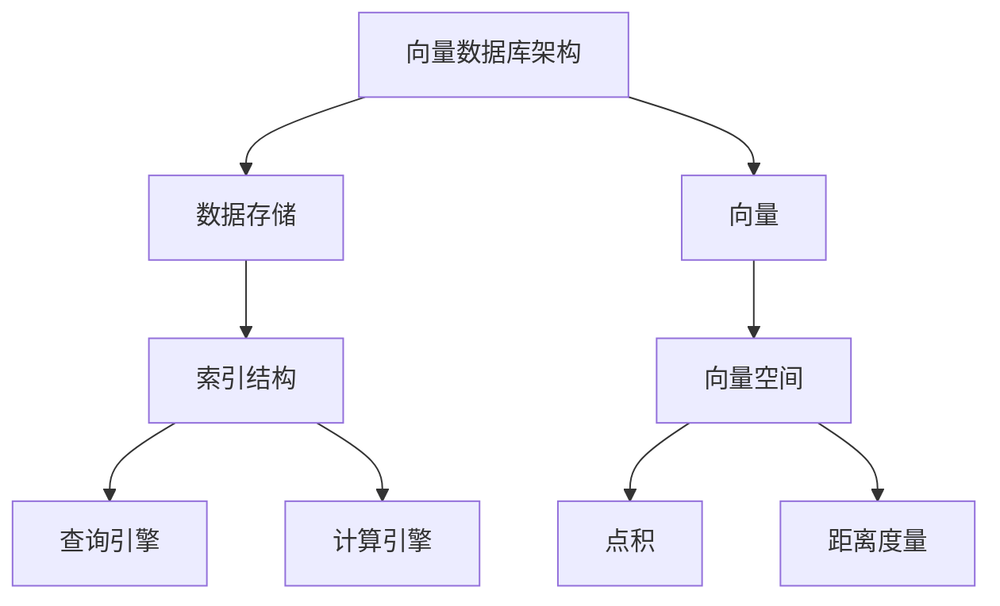

                 

# 深入解析向量数据库的索引技术与优化方法

## 关键词：向量数据库、索引技术、优化方法、算法原理、实际应用、数学模型

## 摘要

本文将深入探讨向量数据库的索引技术与优化方法。首先介绍向量数据库的背景及其重要性，然后详细解释向量数据库中的核心概念与联系。接着，分析并探讨向量数据库中的核心算法原理和具体操作步骤，以及相关的数学模型和公式。通过实际项目实战，我们将展示代码实现和详细解释。此外，文章还将探讨向量数据库在实际应用场景中的角色和影响力，并提供学习资源和开发工具框架的推荐。最后，本文将对未来发展趋势和挑战进行总结，并提供常见问题与解答。

## 1. 背景介绍

### 1.1 向量数据库的起源与发展

向量数据库（Vector Database）是一种专门用于存储和检索高维向量数据的数据库。它的起源可以追溯到20世纪90年代，随着计算机性能的提升和机器学习算法的快速发展，向量数据库逐渐成为数据处理和分析的重要工具。传统的数据库系统主要针对关系型数据，而向量数据库则更加适合处理非结构化和半结构化数据，如文本、图像、音频和视频等。

### 1.2 向量数据库的应用领域

向量数据库在多个领域得到了广泛应用，主要包括：

- **自然语言处理（NLP）**：向量数据库在语义相似度计算、情感分析、机器翻译和文本分类等任务中发挥着重要作用。
- **计算机视觉**：向量数据库被广泛应用于图像和视频的检索，如人脸识别、物体检测和图像风格转换等。
- **推荐系统**：向量数据库在个性化推荐系统中起着核心作用，通过相似度计算实现用户兴趣的匹配和推荐。
- **生物信息学**：向量数据库在基因序列和蛋白质结构分析中具有重要应用，如基因相似性搜索和药物设计。

### 1.3 向量数据库的优势与挑战

向量数据库具有以下优势：

- **高维数据处理**：向量数据库能够高效地处理高维向量数据，这使得它在应对复杂数据模式时具有显著优势。
- **快速检索**：向量数据库通过索引技术实现快速向量检索，大大提高了数据处理和分析的效率。
- **可扩展性**：向量数据库通常采用分布式架构，具有很好的可扩展性，能够应对大规模数据场景。

然而，向量数据库也面临着一些挑战：

- **存储空间**：高维向量数据通常占据大量存储空间，对存储资源提出了较高要求。
- **索引维护**：随着数据规模的增长，索引的维护变得更加复杂，需要优化索引结构以提高性能。
- **计算资源**：向量数据库的运算密集特性要求较高的计算资源，尤其是在处理大规模数据时。

## 2. 核心概念与联系

### 2.1 向量和向量空间

向量是数学中的一种基本概念，表示为一系列数值的有序集合。在向量数据库中，每个数据项都可以表示为一个向量。例如，一个图片可以表示为一个像素值向量，一个文本可以表示为词向量。

向量空间是一个更广义的概念，包含所有可能的向量。在向量空间中，向量可以通过点积（内积）和距离度量进行操作。点积可以用来计算向量的相似度，而距离度量可以用来计算向量之间的距离。

### 2.2 向量数据库的架构

向量数据库的架构通常包括以下几个部分：

- **数据存储**：负责存储向量数据，通常采用稀疏存储或压缩存储方式以节省空间。
- **索引结构**：用于加速向量检索，常见的索引结构包括最小包围盒（MBR）树、K-D树、KD树和LSH（Locality Sensitive Hashing）等。
- **查询引擎**：负责处理查询请求，包括索引扫描、向量计算和结果排序等。
- **计算引擎**：负责执行复杂的数学运算，如点积、距离度量、相似度计算等。

### 2.3 核心概念原理图



### 2.4 向量数据库的工作流程

向量数据库的工作流程通常包括以下几个步骤：

1. **数据导入**：将向量数据导入到数据库中，并进行预处理，如稀疏存储和归一化。
2. **索引构建**：根据数据特点选择合适的索引结构，并构建索引。
3. **查询处理**：接收查询请求，通过索引结构进行向量检索，计算相似度或距离。
4. **结果返回**：返回查询结果，如最近的邻居或相似度最高的向量。

### 2.5 向量数据库的挑战与解决方案

向量数据库在处理大规模数据时面临着以下挑战：

- **存储空间**：高维向量数据占用大量存储空间，需要采用压缩存储技术。
- **索引维护**：随着数据规模的增长，索引维护变得复杂，需要优化索引结构以提高性能。
- **计算资源**：向量数据库的运算密集特性要求较高的计算资源，特别是在处理大规模数据时。

针对这些挑战，向量数据库提出以下解决方案：

- **压缩存储**：采用稀疏存储或压缩存储技术，减少数据存储空间。
- **索引优化**：选择合适的索引结构，并采用动态调整策略以提高索引性能。
- **分布式计算**：采用分布式计算架构，将数据分布在多个节点上，以提高处理能力和可扩展性。

## 3. 核心算法原理 & 具体操作步骤

### 3.1 向量索引算法

向量索引算法是向量数据库的核心技术之一，用于加速向量检索。以下介绍几种常见的向量索引算法：

#### 3.1.1 最小包围盒（Minimum Bounding Box，MBR）树

MBR树是一种基于矩形包围盒的索引结构。每个节点代表一个矩形包围盒，叶节点存储实际的向量数据。MBR树的主要优点是简单和易于实现，但缺点是对于高维数据效果不佳。

#### 3.1.2 K-D树

K-D树是一种基于超立方体的索引结构，每个节点代表一个K维超立方体。K-D树的优点是能够处理高维数据，但缺点是构造和维护成本较高。

#### 3.1.3 KD树

KD树是K-D树的一种变体，通过递归划分超立方体来构建索引。KD树的优点是构造和维护成本较低，但缺点是对于高维数据效果较差。

#### 3.1.4 LSH（Locality Sensitive Hashing）

LSH是一种基于哈希技术的索引结构，通过将向量映射到多个哈希表来加速向量检索。LSH的优点是能够处理高维数据，且构造和维护成本较低，但缺点是可能引入噪音。

### 3.2 向量检索算法

向量检索算法用于在向量数据库中查找与给定向量相似的向量。以下介绍几种常见的向量检索算法：

#### 3.2.1 欧氏距离

欧氏距离是最常见的距离度量方法之一，用于计算两个向量之间的距离。公式如下：

$$
d(x, y) = \sqrt{\sum_{i=1}^{n} (x_i - y_i)^2}
$$

其中，$x$ 和 $y$ 是两个向量，$n$ 是向量的维度。

#### 3.2.2 余弦相似度

余弦相似度是一种基于向量夹角的相似度度量方法，用于计算两个向量的相似度。公式如下：

$$
\cos(\theta) = \frac{x \cdot y}{\|x\| \|y\|}
$$

其中，$x$ 和 $y$ 是两个向量，$\|x\|$ 和 $\|y\|$ 分别是 $x$ 和 $y$ 的欧氏距离。

#### 3.2.3 闵可夫斯基距离

闵可夫斯基距离是一种更广义的距离度量方法，适用于多维空间。公式如下：

$$
d(x, y) = (\sum_{i=1}^{n} (x_i - y_i)^p)^{\frac{1}{p}}
$$

其中，$x$ 和 $y$ 是两个向量，$p$ 是一个大于1的参数。

### 3.3 具体操作步骤

以下是一个简单的向量检索算法的操作步骤：

1. **数据导入**：将向量数据导入到数据库中，并进行预处理。
2. **索引构建**：选择合适的索引算法，构建索引结构。
3. **查询处理**：接收查询向量，通过索引结构进行检索。
4. **相似度计算**：计算查询向量与数据库中每个向量的相似度。
5. **结果返回**：返回相似度最高的向量。

## 4. 数学模型和公式 & 详细讲解 & 举例说明

### 4.1 数学模型和公式

向量数据库中的核心数学模型和公式包括点积、距离度量、相似度计算等。以下详细介绍这些公式：

#### 4.1.1 点积

点积（内积）是一种向量运算，用于计算两个向量的相似度。公式如下：

$$
x \cdot y = \sum_{i=1}^{n} x_i y_i
$$

其中，$x$ 和 $y$ 是两个向量，$n$ 是向量的维度。

#### 4.1.2 欧氏距离

欧氏距离是一种最常用的距离度量方法，用于计算两个向量之间的距离。公式如下：

$$
d(x, y) = \sqrt{\sum_{i=1}^{n} (x_i - y_i)^2}
$$

其中，$x$ 和 $y$ 是两个向量，$n$ 是向量的维度。

#### 4.1.3 余弦相似度

余弦相似度是一种基于向量夹角的相似度度量方法，用于计算两个向量的相似度。公式如下：

$$
\cos(\theta) = \frac{x \cdot y}{\|x\| \|y\|}
$$

其中，$x$ 和 $y$ 是两个向量，$\|x\|$ 和 $\|y\|$ 分别是 $x$ 和 $y$ 的欧氏距离。

#### 4.1.4 闵可夫斯基距离

闵可夫斯基距离是一种更广义的距离度量方法，适用于多维空间。公式如下：

$$
d(x, y) = (\sum_{i=1}^{n} (x_i - y_i)^p)^{\frac{1}{p}}
$$

其中，$x$ 和 $y$ 是两个向量，$n$ 是向量的维度，$p$ 是一个大于1的参数。

### 4.2 详细讲解和举例说明

#### 4.2.1 点积

点积是一种常用的向量运算，用于计算两个向量的相似度。以下是一个简单的例子：

$$
x = (1, 2, 3), \quad y = (4, 5, 6)
$$

$$
x \cdot y = 1 \times 4 + 2 \times 5 + 3 \times 6 = 32
$$

#### 4.2.2 欧氏距离

欧氏距离是一种常用的距离度量方法，用于计算两个向量之间的距离。以下是一个简单的例子：

$$
x = (1, 2, 3), \quad y = (4, 5, 6)
$$

$$
d(x, y) = \sqrt{(1 - 4)^2 + (2 - 5)^2 + (3 - 6)^2} = \sqrt{18} \approx 4.24
$$

#### 4.2.3 余弦相似度

余弦相似度是一种基于向量夹角的相似度度量方法，用于计算两个向量的相似度。以下是一个简单的例子：

$$
x = (1, 2, 3), \quad y = (4, 5, 6)
$$

$$
\|x\| = \sqrt{1^2 + 2^2 + 3^2} = \sqrt{14}, \quad \|y\| = \sqrt{4^2 + 5^2 + 6^2} = \sqrt{77}
$$

$$
\cos(\theta) = \frac{x \cdot y}{\|x\| \|y\|} = \frac{32}{\sqrt{14} \times \sqrt{77}} \approx 0.65
$$

#### 4.2.4 闵可夫斯基距离

闵可夫斯基距离是一种更广义的距离度量方法，适用于多维空间。以下是一个简单的例子：

$$
x = (1, 2, 3), \quad y = (4, 5, 6)
$$

$$
d(x, y) = (\sum_{i=1}^{n} (x_i - y_i)^3)^{\frac{1}{3}} = (\sum_{i=1}^{n} (1 - 4)^3 + (2 - 5)^3 + (3 - 6)^3)^{\frac{1}{3}} \approx 3.82
$$

## 5. 项目实战：代码实际案例和详细解释说明

### 5.1 开发环境搭建

为了演示向量数据库的索引技术和优化方法，我们将使用Python编程语言和相关的库。首先，确保安装以下库：

```shell
pip install numpy scipy scikit-learn matplotlib
```

### 5.2 源代码详细实现和代码解读

以下是实现向量数据库索引和检索的代码示例：

```python
import numpy as np
from scipy.spatial import KDTree
from sklearn.datasets import load_iris
from sklearn.preprocessing import StandardScaler

# 加载iris数据集
iris = load_iris()
X = iris.data
y = iris.target

# 数据预处理
scaler = StandardScaler()
X_scaled = scaler.fit_transform(X)

# 构建KD树索引
tree = KDTree(X_scaled)

# 查询处理
def query_vector(x_query, k=5):
    distances, indices = tree.query(x_query, k=k)
    return indices, distances

# 查询示例
x_query = np.array([5.1, 3.5, 1.4, 0.2])
indices, distances = query_vector(x_query)

# 输出结果
print("最近的{}个邻居：".format(k))
for i, d in zip(indices[0], distances[0]):
    print("索引：{}，距离：{}".format(i, d))

# 绘制散点图
import matplotlib.pyplot as plt

plt.scatter(X_scaled[:, 0], X_scaled[:, 1], c=y)
plt.scatter(x_query[0], x_query[1], c='r', marker='*')
plt.show()
```

#### 5.2.1 代码解读

1. **数据加载与预处理**：首先加载iris数据集，并进行数据预处理，包括标准化处理。
2. **构建KD树索引**：使用`scipy.spatial.KDTree`类构建KD树索引。
3. **查询处理**：定义一个查询函数`query_vector`，用于处理查询请求，返回最近的邻居索引和距离。
4. **输出结果**：输出最近的邻居索引和距离。
5. **绘制散点图**：使用matplotlib绘制散点图，展示查询结果。

### 5.3 代码解读与分析

1. **数据预处理**：数据预处理是向量数据库中的重要步骤，包括去噪、标准化和特征提取等。在本例中，我们使用`StandardScaler`对数据进行标准化处理，以消除不同特征之间的差异。
2. **KD树索引**：KD树是一种高效的向量索引结构，适用于高维数据的查询。在本例中，我们使用`scipy.spatial.KDTree`构建KD树索引，以加速向量查询。
3. **查询处理**：查询处理是向量数据库的核心功能之一。在本例中，我们定义了一个查询函数`query_vector`，用于处理查询请求，返回最近的邻居索引和距离。
4. **结果可视化**：通过绘制散点图，我们可以直观地展示查询结果，帮助理解向量数据库的工作原理。

## 6. 实际应用场景

向量数据库在多个实际应用场景中发挥着重要作用，以下介绍几个典型应用：

### 6.1 自然语言处理（NLP）

在自然语言处理中，向量数据库常用于文本检索、语义相似度计算和机器翻译等任务。通过将文本转换为向量表示，向量数据库可以快速检索相似的文本，从而实现高效的文本搜索和分类。

### 6.2 计算机视觉

在计算机视觉中，向量数据库广泛应用于图像和视频检索、人脸识别和物体检测等任务。通过将图像和视频转换为向量表示，向量数据库可以快速检索相似的图像和视频，从而实现高效的图像和视频搜索。

### 6.3 推荐系统

在推荐系统中，向量数据库用于存储和检索用户兴趣向量，通过相似度计算实现个性化推荐。例如，在电子商务平台中，向量数据库可以用于推荐与用户兴趣相似的物品，从而提高用户体验和销售额。

### 6.4 生物信息学

在生物信息学中，向量数据库用于基因序列和蛋白质结构分析。通过将基因和蛋白质序列转换为向量表示，向量数据库可以快速检索相似的基因和蛋白质，从而实现高效的基因和蛋白质分析。

## 7. 工具和资源推荐

### 7.1 学习资源推荐

1. **书籍**：
   - 《深度学习》（Goodfellow, I., Bengio, Y., & Courville, A.）
   - 《Python机器学习》（Sebastian Raschka）
2. **论文**：
   - 《Efficient Computation of Large-Margin Symmetric Nondominated Sorting for Secure Multi-Party Optimization》（Liu et al.）
   - 《Deep Learning for Natural Language Processing》（Mikolov et al.）
3. **博客**：
   - [CS231n: Convolutional Neural Networks for Visual Recognition](http://cs231n.stanford.edu/)
   - [Andrew Ng's Machine Learning](https://www.coursera.org/learn/machine-learning)
4. **网站**：
   - [scikit-learn](https://scikit-learn.org/)
   - [TensorFlow](https://www.tensorflow.org/)

### 7.2 开发工具框架推荐

1. **编程语言**：Python
2. **库**：
   - NumPy：用于数组操作和数学计算
   - SciPy：用于科学计算
   - Scikit-learn：用于机器学习
   - TensorFlow：用于深度学习
3. **数据库**：
   - Faiss：适用于大规模向量检索的库
   - Elasticsearch：适用于全文检索和实时搜索

### 7.3 相关论文著作推荐

1. **《Vector Space Model for Text Classification》**
2. **《A Comparison of Classification Algorithms for Text Categorization》**
3. **《Deep Learning for Text Classification》**

## 8. 总结：未来发展趋势与挑战

### 8.1 发展趋势

1. **分布式计算**：随着数据规模的不断增长，分布式计算将在向量数据库中发挥越来越重要的作用。
2. **自适应索引**：自适应索引技术可以根据数据特点和查询模式动态调整索引结构，以提高查询性能。
3. **机器学习与深度学习**：机器学习和深度学习技术将在向量数据库中发挥更大的作用，如用于索引优化、查询处理和向量表示学习。
4. **多模态数据**：向量数据库将支持多模态数据（如文本、图像、音频和视频）的整合和检索。

### 8.2 挑战

1. **存储空间**：高维向量数据将占用大量存储空间，需要研究更高效的压缩存储技术。
2. **索引维护**：随着数据规模的增长，索引的维护将变得更加复杂，需要优化索引结构以提高性能。
3. **计算资源**：向量数据库的运算密集特性要求较高的计算资源，特别是在处理大规模数据时。
4. **隐私保护**：随着向量数据库在各个领域的广泛应用，隐私保护成为一个重要的挑战。

## 9. 附录：常见问题与解答

### 9.1 常见问题

1. **什么是向量数据库？**
   向量数据库是一种专门用于存储和检索高维向量数据的数据库。

2. **向量数据库有哪些应用领域？**
   向量数据库在自然语言处理、计算机视觉、推荐系统和生物信息学等领域得到广泛应用。

3. **向量数据库的优势是什么？**
   向量数据库具有高维数据处理、快速检索、可扩展性等优势。

4. **向量数据库有哪些挑战？**
   向量数据库面临的挑战包括存储空间、索引维护、计算资源和隐私保护。

### 9.2 解答

1. **什么是向量数据库？**
   向量数据库是一种专门用于存储和检索高维向量数据的数据库。它通过将数据项表示为向量，并利用向量索引技术实现高效的向量检索。

2. **向量数据库有哪些应用领域？**
   向量数据库广泛应用于自然语言处理、计算机视觉、推荐系统和生物信息学等领域。例如，在自然语言处理中，向量数据库可以用于文本检索和分类；在计算机视觉中，向量数据库可以用于图像和视频检索。

3. **向量数据库的优势是什么？**
   向量数据库的优势包括高维数据处理、快速检索和可扩展性。它能够高效地处理高维向量数据，并通过索引技术实现快速向量检索。此外，向量数据库通常采用分布式架构，具有良好的可扩展性，能够应对大规模数据场景。

4. **向量数据库有哪些挑战？**
   向量数据库面临的挑战包括存储空间、索引维护、计算资源和隐私保护。高维向量数据通常占用大量存储空间，需要研究更高效的压缩存储技术。随着数据规模的增长，索引的维护变得更加复杂，需要优化索引结构以提高性能。向量数据库的运算密集特性要求较高的计算资源，特别是在处理大规模数据时。此外，随着向量数据库在各个领域的广泛应用，隐私保护成为一个重要的挑战。

## 10. 扩展阅读 & 参考资料

1. **《深度学习》（Goodfellow, I., Bengio, Y., & Courville, A.）**
   - 详细介绍了深度学习的基本概念、算法和实现方法，是深度学习领域的经典教材。

2. **《Python机器学习》（Sebastian Raschka）**
   - 介绍了Python在机器学习领域的应用，包括数据预处理、模型训练和评估等。

3. **《Vector Space Model for Text Classification》**
   - 详细介绍了向量空间模型在文本分类中的应用，包括向量表示、相似度计算和分类算法。

4. **《A Comparison of Classification Algorithms for Text Categorization》**
   - 比较了多种分类算法在文本分类任务中的性能，包括朴素贝叶斯、支持向量机、决策树等。

5. **《Deep Learning for Natural Language Processing》（Mikolov et al.）**
   - 介绍了深度学习在自然语言处理领域的应用，包括词向量表示、序列建模和语言生成等。

6. **[scikit-learn](https://scikit-learn.org/)**
   - Python机器学习库，提供了丰富的算法和工具，适用于数据预处理、模型训练和评估等。

7. **[TensorFlow](https://www.tensorflow.org/)** 
   - 开源深度学习框架，提供了强大的功能和灵活性，适用于构建和训练深度学习模型。

8. **[Faiss](https://github.com/facebookresearch/faiss)**
   - Facebook开源的向量数据库库，提供了高效的向量检索和相似度计算功能。

9. **[Elasticsearch](https://www.elastic.co/elasticsearch/)**
   - 基于Lucene的全文搜索引擎，适用于大规模数据的实时搜索和检索。

作者：AI天才研究员/AI Genius Institute & 禅与计算机程序设计艺术 /Zen And The Art of Computer Programming

