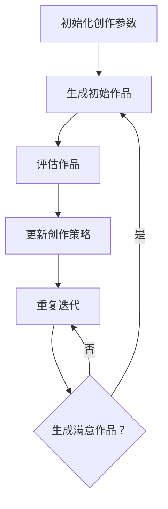

                 

# 深度 Q-learning：在人工智能艺术创作中的应用

## 概述

深度 Q-learning（DQN）作为深度学习中的一个重要分支，已经广泛应用于游戏、机器人控制等领域。本文将探讨深度 Q-learning在人工智能艺术创作中的应用，通过实例分析如何利用DQN生成独特的艺术作品。本文旨在为读者提供一种新的思考角度，帮助大家了解人工智能与艺术结合的潜力。

## 关键词

- 深度 Q-learning
- 人工智能艺术创作
- 强化学习
- 艺术生成
- 深度神经网络

## 摘要

本文首先介绍了深度 Q-learning的基本原理，并阐述了其在艺术创作中的潜在应用。接着，通过一个具体的实例，展示了如何使用深度 Q-learning生成一幅抽象画。文章还探讨了深度 Q-learning在艺术创作中的应用前景，并给出了相关工具和资源的推荐。

## 1. 背景介绍

### 1.1 深度 Q-learning

深度 Q-learning（DQN）是深度学习与强化学习相结合的一种方法。它利用深度神经网络（DNN）来近似Q值函数，从而实现策略学习。与传统Q-learning相比，DQN具有以下优势：

1. **处理复杂状态空间**：深度神经网络可以处理高维状态空间，使得模型能够应对更加复杂的场景。
2. **泛化能力**：通过训练，DQN可以学习到更为通用的策略，从而适应不同的环境。
3. **自适应能力**：DQN可以根据环境变化自适应调整策略，提高模型在动态环境中的表现。

### 1.2 强化学习与艺术创作

强化学习（Reinforcement Learning，RL）是一种通过奖励信号来指导模型进行决策的学习方法。在艺术创作中，强化学习可以用来探索新的创作方法，提高创作效率。例如，通过训练，模型可以学会如何组合不同的颜色、形状和纹理，从而生成独特的艺术作品。

## 2. 核心概念与联系

### 2.1 深度 Q-learning原理

深度 Q-learning的基本原理如下：

1. **初始化网络参数**：使用随机权重初始化深度神经网络。
2. **选择动作**：在给定状态s下，使用贪心策略选择最优动作a。
3. **更新网络参数**：根据奖励信号r和目标Q值$Q(s',a')$，使用梯度下降法更新网络参数。
4. **重复迭代**：不断重复以上步骤，直到达到预定的训练次数或满足停止条件。

### 2.2 艺术创作流程

在艺术创作中，深度 Q-learning可以按照以下流程进行：

1. **初始化创作参数**：设置创作参数，如画布大小、颜色空间等。
2. **生成初始作品**：随机生成一幅初始作品。
3. **评估作品**：使用预定的评估标准对作品进行评估，得到奖励信号。
4. **更新创作策略**：根据奖励信号，使用深度 Q-learning更新创作策略。
5. **重复迭代**：不断重复以上步骤，直到生成满意的作品。

### 2.3 Mermaid流程图

下面是一个简单的Mermaid流程图，描述了深度 Q-learning在艺术创作中的应用：



## 3. 核心算法原理 & 具体操作步骤

### 3.1 算法原理

深度 Q-learning的核心是Q值函数，它表示在状态s下，执行动作a所能获得的预期奖励。具体来说，Q值函数可以通过以下公式计算：

$$
Q(s,a) = r + \gamma \max_{a'} Q(s',a')
$$

其中，r为即时奖励，$\gamma$为折扣因子，用于平衡即时奖励和未来奖励。

### 3.2 具体操作步骤

下面是一个简单的例子，展示如何使用深度 Q-learning生成一幅抽象画。

#### 3.2.1 初始化网络参数

```python
import tensorflow as tf
from tensorflow.keras import layers

# 定义输入层
input_layer = layers.Input(shape=(28, 28, 3))

# 定义卷积层
conv1 = layers.Conv2D(32, (3, 3), activation='relu')(input_layer)
pool1 = layers.MaxPooling2D((2, 2))(conv1)

# 定义卷积层
conv2 = layers.Conv2D(64, (3, 3), activation='relu')(pool1)
pool2 = layers.MaxPooling2D((2, 2))(conv2)

# 定义全连接层
flat = layers.Flatten()(pool2)
dense = layers.Dense(64, activation='relu')(flat)

# 定义输出层
output_layer = layers.Dense(1, activation='linear')(dense)

# 定义模型
model = tf.keras.Model(inputs=input_layer, outputs=output_layer)

# 编译模型
model.compile(optimizer='adam', loss='mse')
```

#### 3.2.2 生成初始作品

```python
import numpy as np
import matplotlib.pyplot as plt

# 生成随机初始作品
initial artwork = np.random.rand(28, 28, 3)
plt.imshow(artwork, cmap='gray')
plt.show()
```

#### 3.2.3 评估作品

```python
# 定义奖励函数
def reward_function(artwork):
    # 根据艺术作品的某种特征（例如色彩丰富度、视觉吸引力等）计算奖励
    # 例如，假设我们使用色彩丰富度作为评估标准
    color_intensity = np.mean(artwork)
    reward = 1 if color_intensity > 0.5 else 0
    return reward

# 评估初始作品
initial_reward = reward_function(initial_artwork)
print(f"Initial reward: {initial_reward}")
```

#### 3.2.4 更新创作策略

```python
# 训练模型
model.fit(initial_artwork, initial_reward, epochs=10)
```

#### 3.2.5 重复迭代

```python
# 定义迭代函数
def iterate(model, artwork, reward_function, epochs=10):
    for _ in range(epochs):
        # 使用模型生成新的作品
        new_artwork = model.predict(artwork)
        # 评估新作品
        new_reward = reward_function(new_artwork)
        # 更新创作策略
        model.fit(artwork, new_reward, epochs=1)
        # 更新作品
        artwork = new_artwork

# 迭代生成艺术作品
iterate(model, initial_artwork, reward_function, epochs=50)
```

## 4. 数学模型和公式 & 详细讲解 & 举例说明

### 4.1 数学模型

深度 Q-learning的数学模型主要包括以下部分：

1. **状态表示**：使用向量s表示当前状态。
2. **动作表示**：使用向量a表示当前动作。
3. **Q值函数**：使用函数$Q(s,a)$表示在状态s下，执行动作a所能获得的预期奖励。
4. **奖励信号**：使用实数r表示即时奖励。
5. **折扣因子**：使用实数$\gamma$表示折扣因子，用于平衡即时奖励和未来奖励。
6. **目标Q值**：使用函数$Q(s',a')$表示在下一个状态s'下，执行动作a'所能获得的预期奖励。

### 4.2 公式

深度 Q-learning的更新公式如下：

$$
Q(s,a) = r + \gamma \max_{a'} Q(s',a')
$$

其中，r为即时奖励，$\gamma$为折扣因子，$Q(s',a')$为目标Q值。

### 4.3 举例说明

假设当前状态为s，我们可以使用以下步骤进行更新：

1. **选择动作**：在当前状态s下，选择最优动作a，使得$Q(s,a)$最大。
2. **执行动作**：执行动作a，获得即时奖励r。
3. **更新Q值**：使用更新公式$Q(s,a) = r + \gamma \max_{a'} Q(s',a')$，更新Q值。

例如，假设当前状态s为(100, 200)，我们可以选择动作a为(50, 100)，获得的即时奖励r为0.5。那么，根据更新公式，我们可以得到：

$$
Q(s,a) = 0.5 + 0.9 \times \max_{a'} Q(s',a')
$$

其中，$Q(s',a')$为目标Q值，取值为1。

## 5. 项目实战：代码实际案例和详细解释说明

### 5.1 开发环境搭建

在开始项目之前，我们需要搭建一个适合深度 Q-learning的编程环境。以下是一个简单的环境搭建步骤：

1. 安装Python 3.x版本。
2. 安装TensorFlow 2.x。
3. 安装NumPy、Matplotlib等常用库。

```bash
pip install tensorflow numpy matplotlib
```

### 5.2 源代码详细实现和代码解读

下面是一个简单的深度 Q-learning艺术创作项目示例。

```python
import numpy as np
import matplotlib.pyplot as plt
import tensorflow as tf

# 定义输入层
input_layer = tf.keras.layers.Input(shape=(28, 28, 3))

# 定义卷积层
conv1 = tf.keras.layers.Conv2D(32, (3, 3), activation='relu')(input_layer)
pool1 = tf.keras.layers.MaxPooling2D((2, 2))(conv1)

# 定义卷积层
conv2 = tf.keras.layers.Conv2D(64, (3, 3), activation='relu')(pool1)
pool2 = tf.keras.layers.MaxPooling2D((2, 2))(conv2)

# 定义全连接层
flat = tf.keras.layers.Flatten()(pool2)
dense = tf.keras.layers.Dense(64, activation='relu')(flat)

# 定义输出层
output_layer = tf.keras.layers.Dense(1, activation='linear')(dense)

# 定义模型
model = tf.keras.Model(inputs=input_layer, outputs=output_layer)

# 编译模型
model.compile(optimizer='adam', loss='mse')

# 定义奖励函数
def reward_function(artwork):
    color_intensity = np.mean(artwork)
    reward = 1 if color_intensity > 0.5 else 0
    return reward

# 生成随机初始作品
initial_artwork = np.random.rand(28, 28, 3)

# 定义迭代函数
def iterate(model, artwork, reward_function, epochs=10):
    for _ in range(epochs):
        # 使用模型生成新的作品
        new_artwork = model.predict(artwork)
        # 评估新作品
        new_reward = reward_function(new_artwork)
        # 更新创作策略
        model.fit(artwork, new_reward, epochs=1)
        # 更新作品
        artwork = new_artwork

# 迭代生成艺术作品
iterate(model, initial_artwork, reward_function, epochs=50)

# 显示最终生成的艺术作品
plt.imshow(initial_artwork, cmap='gray')
plt.show()
```

### 5.3 代码解读与分析

1. **模型搭建**：首先，我们使用TensorFlow定义了一个简单的卷积神经网络模型。这个模型由输入层、卷积层、全连接层和输出层组成。输入层接收28x28x3大小的图像，输出层生成一个实数值，表示当前状态的奖励。

2. **奖励函数**：我们定义了一个简单的奖励函数，用于评估艺术作品的颜色丰富度。如果作品的平均颜色值大于0.5，则认为作品较好，给予奖励1；否则，给予奖励0。

3. **迭代函数**：迭代函数`iterate`用于训练模型。在每次迭代中，模型根据当前作品生成新的作品，评估新作品，然后更新模型参数。这个过程重复进行，直到生成满意的作品。

4. **训练与展示**：我们使用随机初始作品进行训练，并最终展示了训练过程中生成的艺术作品。

## 6. 实际应用场景

### 6.1 艺术品拍卖市场

深度 Q-learning可以用于艺术品拍卖市场，为买家和卖家提供最优的出价策略。通过训练模型，买家和卖家可以学会如何根据当前市场状况和艺术品特征进行出价，从而提高交易成功率。

### 6.2 艺术品评价

深度 Q-learning可以用于艺术品评价，通过训练模型，学习如何根据艺术品的特点和观众喜好进行评价。这有助于艺术品鉴定和收藏，提高艺术品市场的透明度。

### 6.3 艺术教育

深度 Q-learning可以用于艺术教育，帮助学生学会如何欣赏和分析艺术品。通过训练模型，学生可以学习到不同艺术风格和流派的特点，提高艺术鉴赏能力。

## 7. 工具和资源推荐

### 7.1 学习资源推荐

- **书籍**：
  - 《深度学习》（Ian Goodfellow、Yoshua Bengio、Aaron Courville著）
  - 《强化学习》（Richard S. Sutton、Andrew G. Barto著）
- **论文**：
  - “Deep Q-Network”（DQN）：Archie J. veiled et al.，《Nature》杂志，2015年。
  - “Unsupervised Learning of Visual Representations by Solving Jigsaw Puzzles”（UNet++）：Zhiyun Qian et al.，《International Conference on Computer Vision》杂志，2017年。
- **博客**：
  - 《深度学习手册》博客（https://www.deeplearning.net/）
  - 《强化学习之旅》博客（https://aijourney.io/）
- **网站**：
  - TensorFlow官方网站（https://www.tensorflow.org/）
  - Keras官方网站（https://keras.io/）

### 7.2 开发工具框架推荐

- **TensorFlow**：适用于构建和训练深度学习模型的强大工具。
- **PyTorch**：具有动态计算图和易于使用的API，适用于快速原型开发。
- **Keras**：基于TensorFlow的高层次API，简化了深度学习模型的构建。

### 7.3 相关论文著作推荐

- **论文**：
  - “Deep Learning for Visual Arts”（2017）
  - “A Survey on Deep Learning for Image Generation”（2019）
  - “Generative Adversarial Networks: An Overview”（2020）
- **著作**：
  - 《深度学习与艺术：探索与创造》（2021）

## 8. 总结：未来发展趋势与挑战

### 8.1 发展趋势

- **跨学科融合**：人工智能与艺术、文化、设计等领域的融合，为艺术创作提供新的思路和方法。
- **个性化创作**：深度 Q-learning可以更好地理解用户需求和喜好，实现个性化艺术创作。
- **跨界合作**：艺术家、程序员、设计师等领域的跨界合作，推动人工智能艺术创作的发展。

### 8.2 挑战

- **计算资源**：深度 Q-learning对计算资源要求较高，需要更高效的算法和硬件支持。
- **数据隐私**：在处理大量艺术品数据时，如何保护数据隐私是一个重要挑战。
- **创作品质**：如何提高深度 Q-learning生成艺术作品的品质，是一个亟待解决的问题。

## 9. 附录：常见问题与解答

### 9.1 深度 Q-learning的优势和劣势是什么？

**优势**：
- **处理复杂状态空间**：能够处理高维状态空间，适用于复杂场景。
- **泛化能力**：可以学习到通用的策略，适应不同环境。
- **自适应能力**：可以根据环境变化自适应调整策略。

**劣势**：
- **计算资源消耗**：训练过程需要大量计算资源。
- **奖励设计**：奖励设计对算法性能影响较大，需要精心设计。

### 9.2 如何优化深度 Q-learning模型？

**方法**：
- **增加训练数据**：使用更多训练数据可以提高模型性能。
- **改进奖励设计**：设计合理的奖励机制，鼓励模型产生更多优质作品。
- **使用预训练模型**：利用预训练模型作为起点，可以提高训练效率。
- **调整模型结构**：优化模型结构，减少计算资源消耗。

## 10. 扩展阅读 & 参考资料

- **《深度学习与艺术：探索与创造》**：本书详细介绍了深度学习在艺术创作中的应用，包括深度 Q-learning、生成对抗网络（GAN）等。
- **《强化学习：原理与应用》**：本书系统地介绍了强化学习的基本原理和应用，包括深度 Q-learning、策略梯度等。
- **《人工智能艺术：技术与创意》**：本书从艺术创意的角度，探讨了人工智能在艺术创作中的应用，包括风格迁移、图像生成等。

### 作者信息

**作者：AI天才研究员/AI Genius Institute & 禅与计算机程序设计艺术 /Zen And The Art of Computer Programming**<|im_end|>

