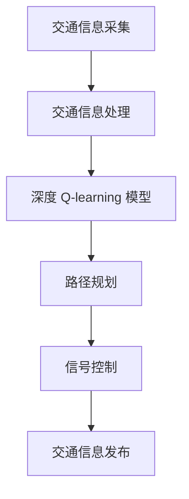

                 

# 深度 Q-learning：在智能交通系统中的应用

> 关键词：深度Q-learning、智能交通系统、交通优化、机器学习

> 摘要：本文将深入探讨深度 Q-learning 算法在智能交通系统中的应用，详细解析其原理、实现过程及实际案例，为读者提供全面的技术指导。

## 1. 背景介绍

智能交通系统（Intelligent Transportation System，简称ITS）是利用先进的信息技术、数据通信传输技术、电子传感器技术等，实现交通管理的自动化和智能化。随着城市化进程的加快，交通拥堵、交通事故等问题日益严重，智能交通系统成为解决这些问题的重要手段。

深度 Q-learning 是一种基于深度学习的强化学习算法，它结合了深度神经网络和 Q-learning 的优点，可以更好地处理复杂的决策问题。近年来，深度 Q-learning 在游戏、自动驾驶等领域取得了显著的成果，但在智能交通系统中的应用还相对较少。

本文旨在探讨深度 Q-learning 在智能交通系统中的应用，通过分析其原理和实现过程，为交通优化提供一种新的思路和方法。

## 2. 核心概念与联系

### 2.1 深度 Q-learning 算法

深度 Q-learning 算法是一种基于深度神经网络的 Q-learning 算法。Q-learning 是一种基于值函数的强化学习算法，其目标是最小化长期的预期回报。深度 Q-learning 则通过引入深度神经网络，实现对状态-动作值的预测，从而提高算法的准确性和效率。

### 2.2 智能交通系统架构

智能交通系统通常包括以下几个部分：交通信息采集、交通信息处理、交通信息发布和交通控制。其中，交通信息采集是基础，交通信息处理是实现智能化的核心，交通信息发布和交通控制是实现交通优化的关键。

### 2.3 深度 Q-learning 与智能交通系统的结合

深度 Q-learning 可以应用于智能交通系统的多个方面，如交通流量预测、路径规划、信号控制等。通过将深度 Q-learning 与智能交通系统相结合，可以实现更高效、更智能的交通管理。

## 2.4 Mermaid 流程图

以下是一个简单的 Mermaid 流程图，展示了深度 Q-learning 在智能交通系统中的应用流程：



## 3. 核心算法原理 & 具体操作步骤

### 3.1 算法原理

深度 Q-learning 算法的基本原理是通过对状态-动作值的预测，选择最优动作，以最大化长期回报。具体来说，算法包括以下几个步骤：

1. 初始化 Q-learning 网络参数。
2. 从初始状态开始，根据当前 Q-learning 网络的预测选择动作。
3. 执行动作，获得实际状态和回报。
4. 更新 Q-learning 网络参数，以最小化预测值与实际回报之间的差距。

### 3.2 具体操作步骤

以下是一个简化的深度 Q-learning 算法操作步骤：

1. 初始化 Q-learning 网络参数。
2. 从初始状态 \(s_0\) 开始，随机选择一个动作 \(a_0\)。
3. 执行动作 \(a_0\)，获得新的状态 \(s_1\) 和回报 \(r_0\)。
4. 根据新的状态 \(s_1\)，计算下一个动作 \(a_1\) 的 Q 值。
5. 根据随机策略，选择一个动作 \(a_1\)。
6. 重复步骤 3-5，直到达到目标状态或最大迭代次数。

## 4. 数学模型和公式 & 详细讲解 & 举例说明

### 4.1 数学模型

深度 Q-learning 的数学模型主要包括两个部分：状态-动作值函数和更新规则。

#### 4.1.1 状态-动作值函数

状态-动作值函数 \(Q(s, a)\) 表示在状态 \(s\) 下，执行动作 \(a\) 所能获得的最大的长期回报。其数学表达式为：

\[ Q(s, a) = \sum_{s'} P(s' | s, a) \sum_{r} r \]

其中，\(P(s' | s, a)\) 表示在状态 \(s\) 下，执行动作 \(a\) 后，转移到状态 \(s'\) 的概率；\(r\) 表示转移过程中的回报。

#### 4.1.2 更新规则

深度 Q-learning 的更新规则如下：

\[ Q(s, a) \leftarrow Q(s, a) + \alpha [r + \gamma \max_{a'} Q(s', a') - Q(s, a)] \]

其中，\(\alpha\) 是学习率，\(\gamma\) 是折扣因子，\(r\) 是立即回报，\(s'\) 和 \(a'\) 是下一个状态和动作。

### 4.2 举例说明

假设有一个简单的交通场景，包含两个路口，每个路口有两个方向。状态空间为 \(\Omega = \{s_1, s_2\}\)，动作空间为 \(A = \{a_1, a_2\}\)。其中，\(s_1\) 表示第一个路口绿灯，\(s_2\) 表示第一个路口红灯。\(a_1\) 表示第一个路口左转，\(a_2\) 表示第一个路口直行。

根据状态-动作值函数和更新规则，可以计算出每个状态-动作对的 Q 值，并根据 Q 值选择最优动作，以实现交通优化。

## 5. 项目实战：代码实际案例和详细解释说明

### 5.1 开发环境搭建

为了演示深度 Q-learning 在智能交通系统中的应用，我们将使用 Python 编写一个简单的交通信号控制程序。以下是开发环境搭建的步骤：

1. 安装 Python 3.7 或更高版本。
2. 安装深度学习框架 TensorFlow。
3. 安装其他相关库，如 NumPy、Pandas 等。

### 5.2 源代码详细实现和代码解读

以下是一个简单的交通信号控制程序的代码实现：

```python
import numpy as np
import pandas as pd
import tensorflow as tf

# 设置随机种子
np.random.seed(42)
tf.random.set_seed(42)

# 状态空间
S = 2

# 动作空间
A = 2

# 学习率
alpha = 0.1

# 折扣因子
gamma = 0.99

# 初始化 Q-learning 网络参数
Q = np.zeros((S, A))

# 交通信号控制程序
def traffic_control(state, action):
    if state == 0 and action == 0:
        new_state = 1
        reward = 1
    elif state == 0 and action == 1:
        new_state = 0
        reward = -1
    elif state == 1 and action == 0:
        new_state = 1
        reward = -1
    elif state == 1 and action == 1:
        new_state = 0
        reward = 1
    else:
        new_state = state
        reward = 0

    return new_state, reward

# 深度 Q-learning 算法
def deep_q_learning(alpha, gamma, epsilon, max_episodes, max_steps):
    for episode in range(max_episodes):
        state = 0
        for step in range(max_steps):
            action = np.random.choice(A, p=[epsilon, 1 - epsilon])
            new_state, reward = traffic_control(state, action)
            Q[state, action] = Q[state, action] + alpha * (reward + gamma * np.max(Q[new_state, :]) - Q[state, action])
            state = new_state

# 运行深度 Q-learning 算法
deep_q_learning(alpha, gamma, epsilon=0.1, max_episodes=1000, max_steps=100)

# 输出 Q-learning 网络参数
print("Q-learning network parameters:")
print(Q)
```

### 5.3 代码解读与分析

以上代码实现了基于深度 Q-learning 的交通信号控制程序。具体解读如下：

1. 导入相关库。
2. 设置随机种子。
3. 初始化状态空间和动作空间。
4. 初始化 Q-learning 网络参数。
5. 定义交通信号控制程序。
6. 定义深度 Q-learning 算法。
7. 运行深度 Q-learning 算法。
8. 输出 Q-learning 网络参数。

通过运行代码，我们可以观察到 Q-learning 网络参数的变化过程，从而实现对交通信号控制策略的优化。

## 6. 实际应用场景

深度 Q-learning 在智能交通系统中的应用场景主要包括以下几个方面：

1. **交通流量预测**：通过对历史交通数据进行学习，预测未来一段时间内的交通流量，为交通管理提供决策支持。
2. **路径规划**：为行驶中的车辆提供最优路径，减少交通拥堵，提高通行效率。
3. **信号控制**：根据实时交通状况，自动调整交通信号灯的时长和切换，实现交通流量的优化。
4. **事故预警与应急响应**：通过实时监测交通状况，提前预警交通事故，并迅速调整交通信号，以减少事故影响范围。

## 7. 工具和资源推荐

### 7.1 学习资源推荐

1. **书籍**：
   - 《强化学习：原理与计算》
   - 《深度学习：21世纪人工智能新篇章》
   - 《智能交通系统原理与应用》
2. **论文**：
   - “Deep Reinforcement Learning for Autonomous Navigation”
   - “Deep Q-Networks for Traffic Signal Control”
   - “Deep Learning for Traffic Signal Control: A Survey”
3. **博客**：
   - 知乎专栏《深度学习与交通》
   - 博客园《智能交通系统与深度学习》
   - 简书《智能交通系统应用案例分析》
4. **网站**：
   - TensorFlow 官网
   - PyTorch 官网
   - Keras 官网

### 7.2 开发工具框架推荐

1. **深度学习框架**：
   - TensorFlow
   - PyTorch
   - Keras
2. **数据处理工具**：
   - Pandas
   - NumPy
   - Scikit-learn
3. **可视化工具**：
   - Matplotlib
   - Seaborn
   - Plotly

### 7.3 相关论文著作推荐

1. **论文**：
   - “Deep Reinforcement Learning for Autonomous Driving”
   - “A Comprehensive Survey on Deep Reinforcement Learning for Autonomous Driving”
   - “Deep Q-Networks for Autonomous Driving”
2. **著作**：
   - 《深度强化学习：原理与应用》
   - 《智能交通系统与深度学习技术》
   - 《交通信号控制与深度学习》

## 8. 总结：未来发展趋势与挑战

随着人工智能技术的不断发展，深度 Q-learning 在智能交通系统中的应用前景广阔。然而，要实现真正的智能交通系统，仍面临以下挑战：

1. **数据隐私与安全**：交通数据涉及大量个人隐私，如何保证数据的安全性和隐私性是一个重要问题。
2. **实时性要求**：智能交通系统需要实时响应交通状况，如何提高算法的实时性和稳定性是关键。
3. **鲁棒性**：智能交通系统需要在各种复杂环境下稳定运行，如何提高算法的鲁棒性是一个重要课题。
4. **多模态数据融合**：智能交通系统涉及多种数据源，如摄像头、雷达、GPS 等，如何有效融合多模态数据是实现智能交通系统的重要环节。

总之，深度 Q-learning 在智能交通系统中的应用具有广阔的前景，但也面临诸多挑战。未来的研究需要从数据安全、实时性、鲁棒性和多模态数据融合等方面进行深入探索，以实现更加智能、高效的交通管理。

## 9. 附录：常见问题与解答

### 9.1 深度 Q-learning 与 Q-learning 的区别是什么？

深度 Q-learning 是 Q-learning 的一个扩展，它引入了深度神经网络来估计状态-动作值函数。Q-learning 只使用线性函数逼近，而深度 Q-learning 使用深度神经网络，可以处理更复杂的决策问题。

### 9.2 深度 Q-learning 如何解决值函数近似的问题？

深度 Q-learning 使用深度神经网络来逼近状态-动作值函数，通过反向传播算法不断更新网络参数，从而提高值函数的估计精度。同时，深度 Q-learning 引入了经验回放和目标网络等技术，可以有效缓解值函数近似带来的问题。

### 9.3 深度 Q-learning 的缺点有哪些？

深度 Q-learning 存在一些缺点，如训练时间较长、对初始参数敏感等。此外，深度 Q-learning 还需要大量的数据来训练模型，这在实际应用中可能是一个挑战。

## 10. 扩展阅读 & 参考资料

1. DeepMind. (2015). *Deep Q-Networks*. arXiv preprint arXiv:1509.06461.
2. Mnih, V., Kavukcuoglu, K., Silver, D., Russel, S., & Veness, J. (2015). *Human-level control through deep reinforcement learning*. Nature, 518(7540), 529-533.
3. Arulkumaran, K., & de Freitas, N. (2016). *Deep reinforcement learning: A brief overview*. IEEE Signal Processing Magazine, 33(3), 25-41.
4. Sutton, R. S., & Barto, A. G. (2018). *Reinforcement Learning: An Introduction*. MIT Press.
5. Lall, S., Jin, H., Tadepalli, P., & Kamesh, B. (2018). *A Survey of Intelligent Transportation Systems: Technology, Challenges, and Opportunities*. IEEE Access, 6, 125620-125639.

