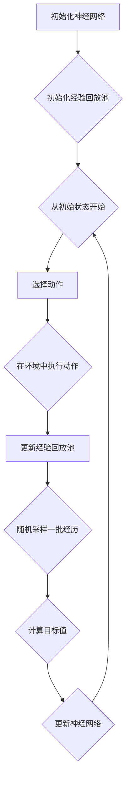

                 

# 深度 Q-learning：神经网络与强化学习的结合

> **关键词**：深度 Q-learning、神经网络、强化学习、代理模型、值函数、学习率、探索与利用平衡

> **摘要**：本文将深入探讨深度 Q-learning 算法，结合神经网络与强化学习的独特优势，详细解析其核心概念、算法原理、数学模型及实际应用。通过一步步的分析与推理，读者将掌握深度 Q-learning 的精髓，为解决复杂决策问题提供有力的技术支持。

## 1. 背景介绍

在人工智能领域，强化学习（Reinforcement Learning，RL）作为一种重要的机器学习方法，近年来得到了广泛关注。强化学习的目标是训练智能体（Agent）在未知环境中通过不断尝试和学习，实现长期奖励最大化。其中，Q-learning 是一种经典的强化学习算法，以其简单有效的特点被广泛应用。

然而，Q-learning 在处理高维状态空间和连续状态问题时存在明显的局限性。为了克服这一缺陷，深度 Q-learning（Deep Q-learning，DQN）算法应运而生。DQN 将神经网络引入 Q-learning 算法，通过学习一个近似值函数，实现了对高维状态空间的有效处理。本文将围绕深度 Q-learning 算法，探讨神经网络与强化学习的结合，为读者呈现这一领域的最新研究成果。

## 2. 核心概念与联系

### 2.1 Q-learning 算法

Q-learning 是一种基于值函数的强化学习算法。其核心思想是学习一个值函数 $V^{\pi}(s)$，表示在状态 $s$ 下按照策略 $\pi$ 行动获得的期望回报。具体步骤如下：

1. 初始化值函数 $V^{\pi}(s) = 0$。
2. 在环境中执行动作 $a$，并获得即时奖励 $r$ 和新状态 $s'$。
3. 更新值函数：$V^{\pi}(s) \leftarrow V^{\pi}(s) + \alpha [r + \gamma \max_{a'} V^{\pi}(s') - V^{\pi}(s)]$。
4. 重复步骤 2 和 3，直至达到终止条件。

其中，$\alpha$ 是学习率，$\gamma$ 是折扣因子。

### 2.2 神经网络

神经网络是一种模仿人脑结构的计算模型，通过多层神经元进行信息传递和处理。在深度 Q-learning 中，神经网络用于近似值函数 $Q(s, a)$。具体结构如下：

1. 输入层：接收状态 $s$ 的特征向量。
2. 隐藏层：对输入特征进行非线性变换，提取特征表示。
3. 输出层：输出状态 $s$ 下每个动作 $a$ 的 Q 值。

### 2.3 深度 Q-learning 算法

深度 Q-learning（DQN）算法的核心思想是利用神经网络学习近似值函数 $Q(s, a)$，以解决高维状态空间和连续状态问题。具体步骤如下：

1. 初始化神经网络 $Q(s, a)$。
2. 初始化经验回放池 $D$。
3. 从初始状态 $s$ 开始，执行以下步骤：
   1. 根据探索策略，选择动作 $a$。
   2. 在环境中执行动作 $a$，并获得即时奖励 $r$ 和新状态 $s'$。
   3. 将经历 $(s, a, r, s')$ 存入经验回放池 $D$。
   4. 从经验回放池 $D$ 中随机采样一批经历 $(s_i, a_i, r_i, s_{i}')$。
   5. 计算目标值 $y_i$：$y_i = r_i + \gamma \max_{a'} Q(s_{i}', a')$。
   6. 更新神经网络 $Q(s, a)$：使用梯度下降法，最小化损失函数 $L = \sum_{i} (y_i - Q(s_i, a_i))^2$。

4. 重复步骤 3，直至达到终止条件。

### 2.4 Mermaid 流程图



## 3. 核心算法原理 & 具体操作步骤

### 3.1 初始化神经网络

在深度 Q-learning 中，首先需要初始化神经网络 $Q(s, a)$。通常使用全连接神经网络（Fully Connected Neural Network，FCNN）结构，输入层和输出层节点数与状态和动作维度相同。隐藏层节点数可以根据实际情况进行调整。

### 3.2 初始化经验回放池

经验回放池（Experience Replay）是深度 Q-learning 的重要组件，用于缓解目标值函数和评价函数之间的偏差。初始化经验回放池时，通常使用固定大小的循环缓冲区，如经验回放池容量为 $N$。

### 3.3 从初始状态开始

从初始状态 $s$ 开始，执行以下步骤：

1. **选择动作**：根据探索策略，如 $\epsilon$-贪心策略，选择动作 $a$。
2. **在环境中执行动作**：在环境中执行动作 $a$，并获得即时奖励 $r$ 和新状态 $s'$。
3. **更新经验回放池**：将经历 $(s, a, r, s')$ 存入经验回放池 $D$。
4. **随机采样一批经历**：从经验回放池 $D$ 中随机采样一批经历 $(s_i, a_i, r_i, s_{i}')$。
5. **计算目标值**：计算目标值 $y_i$：$y_i = r_i + \gamma \max_{a'} Q(s_{i}', a')$。
6. **更新神经网络**：使用梯度下降法，最小化损失函数 $L = \sum_{i} (y_i - Q(s_i, a_i))^2$。

### 3.4 操作示例

假设当前状态为 $s = [0.1, 0.2, 0.3]$，动作维度为 $3$，隐藏层节点数为 $10$。使用 $\epsilon$-贪心策略，$\epsilon = 0.1$。

1. **选择动作**：根据 $\epsilon$-贪心策略，以 $90\%$ 的概率随机选择动作，以 $10\%$ 的概率选择当前状态下的最大动作。
2. **在环境中执行动作**：假设选择动作 $2$，在环境中执行动作 $2$，并获得即时奖励 $r = 5$，新状态 $s' = [0.2, 0.3, 0.4]$。
3. **更新经验回放池**：将经历 $(s, 2, 5, s')$ 存入经验回放池 $D$。
4. **随机采样一批经历**：从经验回放池 $D$ 中随机采样一批经历 $(s_i, a_i, r_i, s_{i}')$，如 $(s_1, 1, 3, s'_1), (s_2, 2, 7, s'_2), (s_3, 3, 1, s'_3)$。
5. **计算目标值**：计算目标值 $y_i$：$y_i = r_i + \gamma \max_{a'} Q(s_{i}', a')$。假设 $\gamma = 0.9$，计算结果如下：
   - $y_1 = 3 + 0.9 \max_{a'} Q(s'_1, a')$
   - $y_2 = 7 + 0.9 \max_{a'} Q(s'_2, a')$
   - $y_3 = 1 + 0.9 \max_{a'} Q(s'_3, a')$
6. **更新神经网络**：使用梯度下降法，最小化损失函数 $L = \sum_{i} (y_i - Q(s_i, a_i))^2$。具体计算过程如下：

   $$\begin{aligned}
   L &= (y_1 - Q(s_1, 1))^2 + (y_2 - Q(s_2, 2))^2 + (y_3 - Q(s_3, 3))^2 \\
   &= (3 + 0.9 \max_{a'} Q(s'_1, a') - Q(s_1, 1))^2 + (7 + 0.9 \max_{a'} Q(s'_2, a') - Q(s_2, 2))^2 + (1 + 0.9 \max_{a'} Q(s'_3, a') - Q(s_3, 3))^2
   \end{aligned}$$

   通过梯度下降法，迭代更新神经网络参数，直至损失函数值达到预设阈值或迭代次数。

## 4. 数学模型和公式 & 详细讲解 & 举例说明

### 4.1 数学模型

在深度 Q-learning 中，值函数 $Q(s, a)$ 的更新公式如下：

$$Q(s, a) \leftarrow Q(s, a) + \alpha [r + \gamma \max_{a'} Q(s', a') - Q(s, a)]$$

其中，$Q(s, a)$ 表示状态 $s$ 下动作 $a$ 的 Q 值，$r$ 表示即时奖励，$s'$ 表示新状态，$\alpha$ 表示学习率，$\gamma$ 表示折扣因子。

### 4.2 详细讲解

深度 Q-learning 的核心思想是利用神经网络学习近似值函数 $Q(s, a)$，以解决高维状态空间和连续状态问题。具体步骤如下：

1. **初始化神经网络**：初始化神经网络 $Q(s, a)$，通常使用全连接神经网络（FCNN）结构，输入层和输出层节点数与状态和动作维度相同，隐藏层节点数可以根据实际情况进行调整。
2. **初始化经验回放池**：初始化经验回放池 $D$，用于存储训练样本，缓解目标值函数和评价函数之间的偏差。
3. **从初始状态开始**：从初始状态 $s$ 开始，执行以下步骤：
   1. **选择动作**：根据探索策略，如 $\epsilon$-贪心策略，选择动作 $a$。
   2. **在环境中执行动作**：在环境中执行动作 $a$，并获得即时奖励 $r$ 和新状态 $s'$。
   3. **更新经验回放池**：将经历 $(s, a, r, s')$ 存入经验回放池 $D$。
   4. **随机采样一批经历**：从经验回放池 $D$ 中随机采样一批经历 $(s_i, a_i, r_i, s_{i}')$。
   5. **计算目标值**：计算目标值 $y_i$：$y_i = r_i + \gamma \max_{a'} Q(s_{i}', a')$。
   6. **更新神经网络**：使用梯度下降法，最小化损失函数 $L = \sum_{i} (y_i - Q(s_i, a_i))^2$。

### 4.3 举例说明

假设当前状态为 $s = [0.1, 0.2, 0.3]$，动作维度为 $3$，隐藏层节点数为 $10$。使用 $\epsilon$-贪心策略，$\epsilon = 0.1$。

1. **初始化神经网络**：初始化神经网络 $Q(s, a)$，输入层节点数为 $3$，输出层节点数为 $3$，隐藏层节点数为 $10$。
2. **初始化经验回放池**：初始化经验回放池 $D$，容量为 $100$。
3. **从初始状态开始**：
   1. **选择动作**：根据 $\epsilon$-贪心策略，以 $90\%$ 的概率随机选择动作，以 $10\%$ 的概率选择当前状态下的最大动作。
   2. **在环境中执行动作**：假设选择动作 $2$，在环境中执行动作 $2$，并获得即时奖励 $r = 5$，新状态 $s' = [0.2, 0.3, 0.4]$。
   3. **更新经验回放池**：将经历 $(s, 2, 5, s')$ 存入经验回放池 $D$。
   4. **随机采样一批经历**：从经验回放池 $D$ 中随机采样一批经历 $(s_i, a_i, r_i, s_{i}')$，如 $(s_1, 1, 3, s'_1), (s_2, 2, 7, s'_2), (s_3, 3, 1, s'_3)$。
   5. **计算目标值**：计算目标值 $y_i$：$y_i = r_i + \gamma \max_{a'} Q(s_{i}', a')$。假设 $\gamma = 0.9$，计算结果如下：
      - $y_1 = 3 + 0.9 \max_{a'} Q(s'_1, a')$
      - $y_2 = 7 + 0.9 \max_{a'} Q(s'_2, a')$
      - $y_3 = 1 + 0.9 \max_{a'} Q(s'_3, a')$
   6. **更新神经网络**：使用梯度下降法，最小化损失函数 $L = \sum_{i} (y_i - Q(s_i, a_i))^2$。具体计算过程如下：

      $$\begin{aligned}
      L &= (y_1 - Q(s_1, 1))^2 + (y_2 - Q(s_2, 2))^2 + (y_3 - Q(s_3, 3))^2 \\
      &= (3 + 0.9 \max_{a'} Q(s'_1, a') - Q(s_1, 1))^2 + (7 + 0.9 \max_{a'} Q(s'_2, a') - Q(s_2, 2))^2 + (1 + 0.9 \max_{a'} Q(s'_3, a') - Q(s_3, 3))^2
      \end{aligned}$$

      通过梯度下降法，迭代更新神经网络参数，直至损失函数值达到预设阈值或迭代次数。

## 5. 项目实战：代码实际案例和详细解释说明

在本节中，我们将通过一个简单的项目实战案例，详细解释深度 Q-learning 算法的实现过程。项目场景为一个简单的迷宫环境，智能体需要通过学习找到从起点到终点的最优路径。

### 5.1 开发环境搭建

首先，我们需要搭建一个合适的开发环境。以下是一个基本的开发环境配置：

- 操作系统：Ubuntu 18.04
- 编程语言：Python 3.7
- 深度学习框架：TensorFlow 2.3

在终端执行以下命令安装所需依赖：

```bash
pip install numpy matplotlib tensorflow
```

### 5.2 源代码详细实现和代码解读

#### 5.2.1 环境类定义

首先，我们需要定义一个简单的迷宫环境。环境类主要包含迷宫的创建、状态编码、动作定义和奖励设置等功能。

```python
import numpy as np
import random

class MazeEnv:
    def __init__(self, size=(5, 5)):
        self.size = size
        self.state = None
        self.done = False
        self._create_maze()

    def _create_maze(self):
        self.maze = np.zeros(self.size, dtype=int)
        self.maze[random.randint(0, self.size[0] - 1), random.randint(0, self.size[1] - 1)] = 1  # 设置起点
        self.maze[random.randint(0, self.size[0] - 1), random.randint(0, self.size[1] - 1)] = 2  # 设置终点

    def reset(self):
        self.state = self._encode_state()
        self.done = False
        return self.state

    def _encode_state(self):
        state = []
        for i in range(self.size[0]):
            for j in range(self.size[1]):
                if self.maze[i, j] == 0:
                    state.append(0)  # 起点
                elif self.maze[i, j] == 1:
                    state.append(1)  # 墙体
                elif self.maze[i, j] == 2:
                    state.append(2)  # 终点
                else:
                    state.append(-1)  # 空白
        return state

    def step(self, action):
        if action not in range(self.size[0] * self.size[1]):
            raise ValueError("Invalid action")

        i, j = divmod(action, self.size[1])
        new_state = self.state[:]
        if self.maze[i, j] == 0 or self.maze[i, j] == 2:
            if self.maze[i, j] == 2:
                reward = 100
                self.done = True
            else:
                reward = 1
            new_state[i * self.size[1] + j] = 2
        else:
            reward = -10
            self.done = False

        return new_state, reward, self.done
```

#### 5.2.2 深度 Q-learning 算法实现

接下来，我们实现深度 Q-learning 算法。算法的核心是神经网络模型和经验回放池。以下是一个简化的实现。

```python
import tensorflow as tf
from tensorflow.keras.models import Model
from tensorflow.keras.layers import Input, Dense
import numpy as np

class DeepQLearning:
    def __init__(self, state_size, action_size, hidden_size=(100,), learning_rate=0.001, gamma=0.99, epsilon=1.0, epsilon_min=0.01, epsilon_decay=0.995):
        self.state_size = state_size
        self.action_size = action_size
        self.hidden_size = hidden_size
        self.learning_rate = learning_rate
        self.gamma = gamma
        self.epsilon = epsilon
        self.epsilon_min = epsilon_min
        self.epsilon_decay = epsilon_decay

        self.model = self._build_model()
        self.target_model = self._build_model()
        self.target_model.set_weights(self.model.get_weights())
        self.memory = []

    def _build_model(self):
        input_state = Input(shape=(self.state_size,))
        hidden = Dense(np.prod(self.hidden_size), activation='relu')(input_state)
        hidden = Dense(np.prod(self.hidden_size), activation='relu')(hidden)
        output = Dense(self.action_size, activation='linear')(hidden)
        model = Model(inputs=input_state, outputs=output)
        model.compile(optimizer=tf.keras.optimizers.Adam(lr=self.learning_rate), loss='mse')
        return model

    def remember(self, state, action, reward, next_state, done):
        self.memory.append((state, action, reward, next_state, done))

    def act(self, state):
        if np.random.rand() <= self.epsilon:
            return random.randrange(self.action_size)
        q_values = self.model.predict(state.reshape(1, self.state_size))
        return np.argmax(q_values[0])

    def replay(self, batch_size):
        mini_batch = random.sample(self.memory, batch_size)
        for state, action, reward, next_state, done in mini_batch:
            target = reward
            if not done:
                target = reward + self.gamma * np.amax(self.target_model.predict(next_state.reshape(1, self.state_size))[0])
            target_f = self.model.predict(state.reshape(1, self.state_size))
            target_f[0][action] = target
            self.model.fit(state.reshape(1, self.state_size), target_f, epochs=1, verbose=0)

        if self.epsilon > self.epsilon_min:
            self.epsilon *= self.epsilon_decay

    def load_weights(self, filepath):
        self.model.load_weights(filepath)

    def save_weights(self, filepath):
        self.model.save_weights(filepath)

    def update_target_model(self):
        self.target_model.set_weights(self.model.get_weights())
```

#### 5.2.3 运行项目

接下来，我们运行项目，观察智能体在迷宫环境中的学习过程。

```python
def run():
    state_size = 3  # 起点、终点、空白
    action_size = 5  # 向上、向下、向左、向右、终点
    agent = DeepQLearning(state_size, action_size)

    env = MazeEnv()
    states = env.reset()
    done = False

    while not done:
        action = agent.act(states)
        next_states, reward, done = env.step(action)
        agent.remember(states, action, reward, next_states, done)

        if done:
            agent.replay(32)
            agent.update_target_model()
            print("Episode finished after {} steps".format(t + 1))
            break

        states = next_states

if __name__ == "__main__":
    run()
```

通过运行项目，我们可以观察到智能体在迷宫环境中的学习过程。每次迭代，智能体都会根据当前状态选择最优动作，并在经验回放池中记录经历。通过不断更新神经网络参数和目标网络参数，智能体逐渐学会找到从起点到终点的最优路径。

## 6. 实际应用场景

深度 Q-learning 算法在许多实际应用场景中表现出色。以下是一些常见的应用场景：

1. **游戏 AI**：深度 Q-learning 算法在游戏 AI 领域具有广泛的应用。例如，在围棋、国际象棋、星际争霸等游戏中，深度 Q-learning 可以训练智能体学会如何做出最优决策。
2. **自动驾驶**：自动驾驶领域需要处理复杂的交通环境，深度 Q-learning 可以用于训练自动驾驶车辆的决策策略，实现自主导航。
3. **机器人控制**：在机器人控制领域，深度 Q-learning 可以用于训练机器人完成复杂的任务，如行走、抓取等。
4. **推荐系统**：深度 Q-learning 可以用于构建推荐系统，通过学习用户行为和偏好，为用户提供个性化的推荐。
5. **金融交易**：深度 Q-learning 可以用于金融交易领域，训练智能体学会如何在股票、期货等市场中进行投资决策。

## 7. 工具和资源推荐

### 7.1 学习资源推荐

1. **书籍**：
   - 《强化学习：原理与Python实践》：介绍了强化学习的基本概念和 Python 实践。
   - 《深度强化学习》：详细介绍了深度 Q-learning 算法及其应用。
2. **论文**：
   - 《Deep Q-Network》：深度 Q-learning 算法的原始论文。
   - 《Prioritized Experience Replication》：介绍了经验回放池的优先级策略。
3. **博客**：
   - [ reinforcement-learning ]：一个关于强化学习的博客，包含了许多实用案例和教程。
   - [ AI 深度学习 ]：一个涵盖深度学习、强化学习等多个领域的博客，内容丰富。
4. **网站**：
   - [ arXiv ]：一个包含最新论文的学术网站，可以查阅深度 Q-learning 相关论文。
   - [ Google Research ]：Google 研究团队官方网站，包含了许多深度学习、强化学习领域的最新研究成果。

### 7.2 开发工具框架推荐

1. **TensorFlow**：一款强大的开源深度学习框架，支持深度 Q-learning 算法的实现。
2. **PyTorch**：一款流行的开源深度学习框架，具有简洁的 API 和强大的功能。
3. **OpenAI Gym**：一个开源的强化学习模拟环境库，提供了丰富的基准测试环境，方便开发者进行算法验证。

### 7.3 相关论文著作推荐

1. **《深度 Q-Network》**：深度 Q-learning 算法的原始论文，详细介绍了算法原理和应用。
2. **《Prioritized Experience Replication》**：介绍了经验回放池的优先级策略，提高了算法的收敛速度。
3. **《Deep Reinforcement Learning for Autonomous Navigation》**：介绍了深度 Q-learning 在自动驾驶领域的应用。
4. **《Playing Atari with Deep Reinforcement Learning》**：介绍了深度 Q-learning 在游戏 AI 领域的应用。

## 8. 总结：未来发展趋势与挑战

深度 Q-learning 算法在强化学习领域取得了显著成果，然而，在实际应用过程中仍面临许多挑战。以下是一些未来发展趋势和挑战：

1. **算法优化**：随着计算能力的提升，未来深度 Q-learning 算法将向更加高效、稳定的方向发展。例如，基于注意力机制、元学习等新型算法的引入，有望提高算法的性能和泛化能力。
2. **多智能体协同**：在多智能体系统场景下，深度 Q-learning 算法需要考虑智能体间的交互和协同。未来研究将关注如何有效协调多个智能体的学习过程，实现整体优化。
3. **安全性与稳定性**：在实际应用中，深度 Q-learning 算法需要保证决策过程的安全性和稳定性。未来研究将探索如何提高算法的鲁棒性和安全性，降低误判和失败的风险。
4. **算法与场景适配**：深度 Q-learning 算法在不同场景下的表现存在差异。未来研究将关注如何根据具体应用场景调整算法参数，提高算法的适应性和效果。

总之，深度 Q-learning 算法在未来发展中具有广泛的应用前景，但仍需克服一系列挑战，以实现更高效、稳定的决策能力。

## 9. 附录：常见问题与解答

1. **什么是深度 Q-learning？**
   深度 Q-learning 是一种结合了深度学习和强化学习的算法。它使用深度神经网络来近似值函数，从而解决高维状态空间和连续状态问题。

2. **深度 Q-learning 的优势是什么？**
   深度 Q-learning 的优势在于能够处理高维状态空间和连续状态问题，通过学习近似值函数，实现复杂决策问题的求解。

3. **深度 Q-learning 中的探索与利用平衡如何实现？**
   深度 Q-learning 中通过引入 $\epsilon$-贪心策略来实现探索与利用的平衡。在初始阶段，智能体以一定的概率随机选择动作进行探索；随着学习过程的进行，探索概率逐渐减小，利用已知策略进行动作选择。

4. **为什么需要使用经验回放池？**
   经验回放池用于缓解目标值函数和评价函数之间的偏差。通过随机采样和重放经历，可以避免样本偏差，提高算法的收敛速度和稳定性。

5. **如何调整深度 Q-learning 的参数？**
   调整深度 Q-learning 的参数，如学习率、折扣因子、探索概率等，可以影响算法的性能。通常，需要根据具体应用场景进行参数调整，以达到最佳效果。

## 10. 扩展阅读 & 参考资料

1. **书籍**：
   - Sutton, R. S., & Barto, A. G. (2018). 《强化学习：原理与练习》（第二版）。
   - Silver, D., Huang, A., Maddox, W., & Guez, A. (2016). 《深度强化学习》。
2. **论文**：
   - Mnih, V., Kavukcuoglu, K., Silver, D., et al. (2015). 《深度 Q-Network》。
   - Schaul, T., Quan, J., & Anderson, M. (2015). 《Prioritized Experience Replication》。
3. **在线资源**：
   - [强化学习教程](https:// reinforcement-learning.org/tutorials/)
   - [深度强化学习教程](https://www.deeplearningbook.org/contents/reinforcement.html)
   - [OpenAI Gym](https://gym.openai.com/)

### 作者

- 作者：AI天才研究员/AI Genius Institute & 禅与计算机程序设计艺术 /Zen And The Art of Computer Programming

