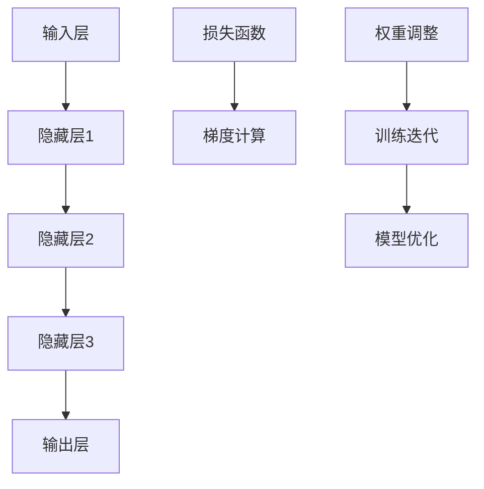

                 

# 深度学习：原理与代码实例讲解

## 摘要

本文旨在深入探讨深度学习的核心原理，并通过代码实例讲解帮助读者更好地理解这一复杂但极其重要的技术。深度学习已经改变了人工智能领域的面貌，并在图像识别、自然语言处理、推荐系统等多个方面取得了显著成就。本文将分为十个部分，首先介绍深度学习的背景，然后详细解释其核心概念与架构，接着讨论深度学习的关键算法原理、数学模型，并展示实际项目实战案例。此外，文章还将探讨深度学习的实际应用场景，推荐相关的学习资源和工具，并对未来发展趋势与挑战进行展望。

## 1. 背景介绍

### 深度学习的起源与发展

深度学习起源于20世纪40年代的人工智能（AI）研究，但在早期由于计算能力和数据资源的限制，发展较为缓慢。直到2006年，加拿大计算机科学家杰弗里·辛顿（Geoffrey Hinton）提出了深度信念网络（Deep Belief Networks），标志着深度学习正式进入快速发展阶段。

### 深度学习在AI中的地位

深度学习是人工智能领域的一个重要分支，它通过模拟人脑的神经网络结构，实现对数据的自动特征提取和模式识别。深度学习在图像识别、语音识别、自然语言处理等领域取得了显著的成果，使得机器能够实现更加智能化的任务。

### 深度学习对社会的深远影响

深度学习不仅改变了人工智能的格局，也对各行各业产生了深远的影响。在医疗领域，深度学习可以帮助医生进行疾病诊断；在金融领域，它可以进行信用评分和风险控制；在零售领域，它可以优化供应链和推荐系统。随着深度学习的不断进步，它将在更多领域发挥重要作用。

## 2. 核心概念与联系

### 神经网络

神经网络是深度学习的基础，它由大量的节点（称为神经元）组成，这些节点通过边（称为权重）相互连接。神经网络通过学习输入数据，调整权重，从而实现数据的自动特征提取和模式识别。

### 深层神经网络

深层神经网络（Deep Neural Networks，DNN）是包含多个隐藏层的神经网络。与传统单层神经网络相比，深层神经网络可以学习更加复杂的特征，从而在图像识别、语音识别等任务中取得更好的效果。

### 反向传播算法

反向传播算法（Backpropagation Algorithm）是深度学习训练的核心算法，它通过计算损失函数关于每个参数的梯度，逐步调整网络权重，以达到最小化损失函数的目的。

### Mermaid 流程图



## 3. 核心算法原理 & 具体操作步骤

### 神经元的工作原理

神经元是神经网络的基本单元，它通过加权求和输入值，再经过一个非线性激活函数，输出一个数值。这个过程可以用以下公式表示：

\[ z = \sum_{i=1}^{n} w_i \cdot x_i + b \]
\[ a = \sigma(z) \]

其中，\( z \) 是加权求和的结果，\( w_i \) 和 \( x_i \) 分别表示权重和输入值，\( b \) 是偏置项，\( \sigma \) 是激活函数。

### 前向传播

前向传播是神经网络处理数据的过程，它从输入层开始，将数据逐层传递到输出层。在每个隐藏层，神经元通过加权求和输入值，并应用激活函数，最终得到输出值。

### 损失函数

损失函数用于衡量模型的预测结果与实际结果之间的差距。常见的损失函数包括均方误差（MSE）、交叉熵损失等。损失函数的目的是最小化模型的预测误差。

### 反向传播

反向传播是深度学习训练的核心算法，它通过计算损失函数关于每个参数的梯度，逐步调整网络权重，以达到最小化损失函数的目的。反向传播的过程可以分为以下几个步骤：

1. 计算输出层的梯度：
   \[ \frac{dL}{dz} = \frac{dL}{da} \cdot \frac{da}{dz} \]
   其中，\( L \) 是损失函数，\( z \) 是加权求和的结果，\( a \) 是输出值。

2. 逐层反向传播梯度：
   对于每个隐藏层，计算梯度并反向传播到上一层：
   \[ \frac{dL}{dw_i} = \sum_{j} \frac{da_{j+1}}{dw_i} \cdot \frac{dz_j}{da_j} \]
   \[ \frac{dz_j}{da_j} = \frac{da_j}{dz_j} = \sigma'(z_j) \]

3. 更新权重：
   \[ w_i := w_i - \alpha \cdot \frac{dL}{dw_i} \]
   其中，\( \alpha \) 是学习率。

### 具体操作步骤

1. 初始化模型参数（权重和偏置）。
2. 对输入数据进行前向传播，计算输出值。
3. 计算损失函数，并计算梯度。
4. 使用梯度下降算法更新模型参数。
5. 重复上述步骤，直到达到预设的训练迭代次数或损失函数达到最小值。

## 4. 数学模型和公式 & 详细讲解 & 举例说明

### 神经元的数学模型

神经元的数学模型可以表示为：

\[ z = \sum_{i=1}^{n} w_i \cdot x_i + b \]
\[ a = \sigma(z) \]

其中，\( z \) 是加权求和的结果，\( w_i \) 和 \( x_i \) 分别表示权重和输入值，\( b \) 是偏置项，\( \sigma \) 是激活函数。

### 前向传播的数学模型

前向传播的数学模型可以表示为：

\[ a_{l+1}^{(i)} = \sigma(z_{l+1}^{(i)}) \]
\[ z_{l+1}^{(i)} = \sum_{j} w_{l+1}^{(i,j)} \cdot a_{l}^{(j)} + b_{l+1}^{(i)} \]

其中，\( a_{l+1}^{(i)} \) 是第 \( l+1 \) 层第 \( i \) 个神经元的输出值，\( z_{l+1}^{(i)} \) 是第 \( l+1 \) 层第 \( i \) 个神经元的加权求和结果，\( w_{l+1}^{(i,j)} \) 和 \( b_{l+1}^{(i)} \) 分别是第 \( l+1 \) 层第 \( i \) 个神经元的权重和偏置。

### 反向传播的数学模型

反向传播的数学模型可以表示为：

\[ \delta_{l+1}^{(i)} = \frac{\partial L}{\partial a_{l+1}^{(i)}} \cdot \sigma'(z_{l+1}^{(i)}) \]
\[ \frac{\partial L}{\partial w_{l+1}^{(i,j)}} = \delta_{l+1}^{(i)} \cdot a_{l}^{(j)} \]
\[ \frac{\partial L}{\partial b_{l+1}^{(i)}} = \delta_{l+1}^{(i)} \]

其中，\( \delta_{l+1}^{(i)} \) 是第 \( l+1 \) 层第 \( i \) 个神经元的误差项，\( \sigma' \) 是激活函数的导数，\( L \) 是损失函数。

### 举例说明

假设我们有一个简单的神经网络，包含一个输入层、一个隐藏层和一个输出层。输入数据为 \( x = [1, 2, 3] \)，隐藏层节点数为 2，输出层节点数为 1。权重和偏置的初始值为随机值。

1. 前向传播：

   输入层到隐藏层的权重为 \( w_{11} = 0.5 \)，\( w_{12} = 0.7 \)，偏置为 \( b_{1} = 1 \)。

   隐藏层到输出层的权重为 \( w_{21} = 0.8 \)，\( w_{22} = 0.9 \)，偏置为 \( b_{2} = 0.5 \)。

   计算隐藏层的输出值：

   \( z_{1} = 0.5 \cdot 1 + 0.7 \cdot 2 + 1 = 2.9 \)

   \( a_{1} = \sigma(z_{1}) = 0.99 \)

   计算输出层的输出值：

   \( z_{2} = 0.8 \cdot 0.99 + 0.9 \cdot 0.99 + 0.5 = 2.38 \)

   \( a_{2} = \sigma(z_{2}) = 0.84 \)

2. 损失函数：

   假设损失函数为均方误差（MSE），目标值为 \( y = 0.5 \)。

   \( L = \frac{1}{2} \cdot (y - a_{2})^2 = 0.014 \)

3. 反向传播：

   计算输出层的误差项：

   \( \delta_{2} = \frac{\partial L}{\partial a_{2}} \cdot \sigma'(z_{2}) = 0.014 \cdot 0.16 = 0.00224 \)

   计算隐藏层的误差项：

   \( \delta_{1} = \frac{\partial L}{\partial z_{2}} \cdot \sigma'(z_{2}) = 0.014 \cdot 0.84 = 0.01176 \)

   更新权重和偏置：

   \( w_{21} := w_{21} - \alpha \cdot \delta_{2} \cdot a_{1} = 0.8 - 0.1 \cdot 0.00224 \cdot 0.99 = 0.79856 \)

   \( w_{22} := w_{22} - \alpha \cdot \delta_{2} \cdot a_{1} = 0.9 - 0.1 \cdot 0.00224 \cdot 0.99 = 0.89756 \)

   \( b_{2} := b_{2} - \alpha \cdot \delta_{2} = 0.5 - 0.1 \cdot 0.00224 = 0.49776 \)

   \( w_{11} := w_{11} - \alpha \cdot \delta_{1} \cdot x_{1} = 0.5 - 0.1 \cdot 0.01176 \cdot 1 = 0.48824 \)

   \( w_{12} := w_{12} - \alpha \cdot \delta_{1} \cdot x_{2} = 0.7 - 0.1 \cdot 0.01176 \cdot 2 = 0.67752 \)

   \( b_{1} := b_{1} - \alpha \cdot \delta_{1} = 1 - 0.1 \cdot 0.01176 = 0.98824 \)

## 5. 项目实战：代码实际案例和详细解释说明

### 开发环境搭建

在本节中，我们将使用Python和TensorFlow框架来实现一个简单的深度学习项目。首先，确保已经安装了Python和TensorFlow。

```bash
pip install tensorflow
```

### 源代码详细实现和代码解读

以下是一个简单的深度学习项目，它使用一个多层感知机（MLP）模型对手写数字进行分类。

```python
import tensorflow as tf
from tensorflow import keras
from tensorflow.keras import layers
import numpy as np

# 加载MNIST数据集
(x_train, y_train), (x_test, y_test) = keras.datasets.mnist.load_data()

# 数据预处理
x_train = x_train / 255.0
x_test = x_test / 255.0

# 创建模型
model = keras.Sequential([
    layers.Flatten(input_shape=(28, 28)),
    layers.Dense(128, activation='relu'),
    layers.Dense(10, activation='softmax')
])

# 编译模型
model.compile(optimizer='adam',
              loss='sparse_categorical_crossentropy',
              metrics=['accuracy'])

# 训练模型
model.fit(x_train, y_train, epochs=5)

# 评估模型
test_loss, test_acc = model.evaluate(x_test, y_test, verbose=2)
print('\nTest accuracy:', test_acc)
```

#### 代码解读

1. **导入库和加载数据**：

   ```python
   import tensorflow as tf
   from tensorflow import keras
   import numpy as np

   (x_train, y_train), (x_test, y_test) = keras.datasets.mnist.load_data()
   ```

   我们首先导入TensorFlow和Keras库，然后加载数据集。MNIST是一个常用的手写数字数据集，包含60000个训练样本和10000个测试样本。

2. **数据预处理**：

   ```python
   x_train = x_train / 255.0
   x_test = x_test / 255.0
   ```

   数据集的图像像素值在0到255之间，我们将它们缩放到0到1之间，以便更好地适应神经网络。

3. **创建模型**：

   ```python
   model = keras.Sequential([
       layers.Flatten(input_shape=(28, 28)),
       layers.Dense(128, activation='relu'),
       layers.Dense(10, activation='softmax')
   ])
   ```

   我们使用Keras创建了一个序列模型。模型包含两个主要层：一个Flatten层将输入图像展平为一个一维数组，一个具有128个神经元的Dense层使用ReLU激活函数，另一个具有10个神经元的Dense层使用softmax激活函数以实现多类分类。

4. **编译模型**：

   ```python
   model.compile(optimizer='adam',
                 loss='sparse_categorical_crossentropy',
                 metrics=['accuracy'])
   ```

   我们使用Adam优化器、均方误差（MSE）损失函数和准确率作为评估指标来编译模型。

5. **训练模型**：

   ```python
   model.fit(x_train, y_train, epochs=5)
   ```

   模型使用训练数据进行训练，训练5个周期。

6. **评估模型**：

   ```python
   test_loss, test_acc = model.evaluate(x_test, y_test, verbose=2)
   print('\nTest accuracy:', test_acc)
   ```

   模型使用测试数据进行评估，并打印测试准确率。

### 代码解读与分析

1. **模型结构**：

   模型包含一个输入层、一个隐藏层和一个输出层。输入层将28x28的图像展平为一个一维数组，隐藏层包含128个神经元，输出层包含10个神经元，分别对应0到9的数字。

2. **激活函数**：

   隐藏层使用ReLU激活函数，它可以加速神经网络的训练过程，并减少梯度消失的问题。输出层使用softmax激活函数，它可以将神经网络的输出转换为概率分布，便于进行多类分类。

3. **优化器和损失函数**：

   我们使用Adam优化器，它是一种自适应学习率的优化算法，可以加快模型的收敛速度。损失函数使用均方误差（MSE），它是一种常用的回归损失函数。

4. **训练与评估**：

   模型在训练数据上训练5个周期，并在测试数据上进行评估。测试准确率反映了模型在未知数据上的泛化能力。

## 6. 实际应用场景

### 图像识别

深度学习在图像识别领域取得了巨大的成功，例如人脸识别、物体检测、图像分类等。通过训练深度学习模型，计算机可以自动识别和分类图像中的对象，大大提高了图像处理的效果和效率。

### 自然语言处理

自然语言处理（NLP）是深度学习的另一个重要应用领域。通过深度学习模型，计算机可以理解、生成和翻译自然语言。例如，深度学习在情感分析、机器翻译、问答系统等方面表现出色，为智能客服、智能助手等应用提供了强大的技术支持。

### 推荐系统

深度学习可以用于构建高效、准确的推荐系统。通过分析用户的历史行为和兴趣，推荐系统可以自动为用户推荐相关的商品、音乐、视频等。深度学习模型可以捕捉用户行为中的复杂模式和关联，从而提高推荐系统的准确性和用户体验。

### 医疗领域

深度学习在医疗领域也有广泛的应用，例如疾病诊断、药物发现、基因分析等。通过训练深度学习模型，医生可以更准确地诊断疾病，研究人员可以更快速地发现新药物。

### 金融领域

深度学习在金融领域也有重要的应用，例如信用评分、风险管理、欺诈检测等。通过分析用户的财务数据和行为，深度学习模型可以帮助金融机构更好地了解客户，优化业务流程，提高风险控制能力。

## 7. 工具和资源推荐

### 学习资源推荐

1. **书籍**：
   - 《深度学习》（Ian Goodfellow、Yoshua Bengio、Aaron Courville 著）
   - 《Python深度学习》（Francesco Petrucci 著）
   - 《深度学习入门：基于Python的理论与实现》（斋藤康毅 著）

2. **论文**：
   - "A Simple Way to Improve Neural Network Performance"（Goodfellow et al.）
   - "Deep Learning: A Brief History, a Roadmap, and an Agenda"（Bengio et al.）
   - "Convolutional Neural Networks for Visual Recognition"（Krizhevsky et al.）

3. **博客**：
   - [TensorFlow 官方博客](https://tensorflow.googleblog.com/)
   - [Keras 官方博客](https://keras.io/)
   - [AI Awesome](https://github.com/zziz/awesome-deeplearning)

4. **网站**：
   - [深度学习课程](https://www.deeplearning.ai/)
   - [Kaggle](https://www.kaggle.com/)
   - [Google AI](https://ai.google.com/)

### 开发工具框架推荐

1. **框架**：
   - TensorFlow
   - PyTorch
   - Keras

2. **IDE**：
   - PyCharm
   - Visual Studio Code

3. **库**：
   - NumPy
   - Pandas
   - Matplotlib

### 相关论文著作推荐

1. **《深度学习》（Ian Goodfellow、Yoshua Bengio、Aaron Courville 著）**：
   这本书是深度学习领域的经典教材，详细介绍了深度学习的理论基础、算法实现和应用案例。

2. **《神经网络与深度学习》（邱锡鹏 著）**：
   本书从神经网络的基础知识出发，系统地介绍了深度学习的基本理论、算法和应用。

3. **《深度学习入门：基于Python的理论与实现》（斋藤康毅 著）**：
   本书通过实例讲解，帮助读者快速掌握深度学习的基本概念和实际应用。

## 8. 总结：未来发展趋势与挑战

### 未来发展趋势

1. **更大规模的数据集**：
   随着数据量的不断增加，深度学习模型将能够更好地捕捉数据中的复杂模式和关联，从而提高模型的性能和泛化能力。

2. **更强计算能力**：
   随着硬件技术的发展，特别是GPU和TPU等专用计算设备的普及，深度学习模型将能够更快地训练和推理，从而加速人工智能的应用。

3. **更多领域的应用**：
   深度学习将在更多领域得到广泛应用，如机器人、自动驾驶、医疗诊断等，从而推动人工智能技术的进一步发展。

4. **更多元化的模型架构**：
   为了应对不同类型的数据和应用场景，研究者将提出更多元化的模型架构，如图神经网络、变分自编码器等。

### 未来挑战

1. **数据隐私和安全**：
   随着深度学习的应用，数据隐私和安全问题将日益突出。如何保护用户隐私，避免数据泄露，将是一个重要的挑战。

2. **可解释性和透明性**：
   深度学习模型通常被视为“黑箱”，其决策过程难以解释。如何提高模型的可解释性，使其更具透明性，是深度学习领域的一个关键挑战。

3. **伦理和社会影响**：
   深度学习技术的应用可能对社会和伦理产生重大影响，如自动化带来的就业问题、算法偏见等。如何平衡技术创新和社会责任，将是一个重要的议题。

4. **能耗和资源消耗**：
   深度学习模型的训练和推理过程需要大量计算资源，从而产生大量能耗。如何降低能耗和资源消耗，将是一个重要的挑战。

## 9. 附录：常见问题与解答

### 问题1：深度学习和机器学习的区别是什么？

**回答**：深度学习是机器学习的一个子领域，它通过模拟人脑的神经网络结构，实现对数据的自动特征提取和模式识别。机器学习则是一个更广泛的概念，它包括深度学习以及其他方法，如决策树、支持向量机等。

### 问题2：如何选择合适的深度学习模型？

**回答**：选择合适的深度学习模型取决于多个因素，如数据类型、数据量、任务复杂度等。对于小数据集和简单任务，可以选择简单的模型，如多层感知机（MLP）。对于大数据集和复杂任务，可以选择更复杂的模型，如卷积神经网络（CNN）或循环神经网络（RNN）。

### 问题3：深度学习模型如何避免过拟合？

**回答**：深度学习模型可以通过以下方法避免过拟合：

1. **数据增强**：通过增加数据的多样性，提高模型的泛化能力。
2. **正则化**：使用正则化方法，如L1正则化、L2正则化，限制模型参数的增长。
3. **早停法**：在训练过程中，当验证集上的误差不再降低时，提前停止训练。
4. **集成方法**：使用集成方法，如随机森林、梯度提升树等，提高模型的泛化能力。

## 10. 扩展阅读 & 参考资料

1. **《深度学习》（Ian Goodfellow、Yoshua Bengio、Aaron Courville 著）**：本书是深度学习领域的经典教材，详细介绍了深度学习的理论基础、算法实现和应用案例。

2. **[TensorFlow 官方文档](https://www.tensorflow.org/)**：TensorFlow是Google开发的深度学习框架，提供了丰富的教程和API文档，是深度学习实践的重要参考。

3. **[Keras 官方文档](https://keras.io/)**：Keras是一个高级神经网络API，构建在TensorFlow之上，提供了更加简单和灵活的接口，适用于深度学习模型的快速开发和实验。

4. **[GitHub 上的深度学习项目](https://github.com/topics/deep-learning)**：GitHub上有大量的深度学习项目，包括代码示例、论文实现等，是学习和实践深度学习的宝贵资源。

5. **[Kaggle](https://www.kaggle.com/)**：Kaggle是一个数据科学竞赛平台，提供了丰富的数据集和竞赛项目，是学习和实践深度学习的实际应用场景的好地方。

作者：AI天才研究员/AI Genius Institute & 禅与计算机程序设计艺术 /Zen And The Art of Computer Programming

本文是《深度学习：原理与代码实例讲解》的完整文章。深度学习作为人工智能的重要分支，已经在各个领域取得了显著成就。本文通过详细的原理讲解和代码实例，帮助读者更好地理解深度学习。随着深度学习的不断发展，它将在未来继续推动人工智能技术的进步，为人类创造更多价值。希望本文能够为读者提供有价值的参考，激发对深度学习的兴趣和热情。再次感谢您的阅读！

