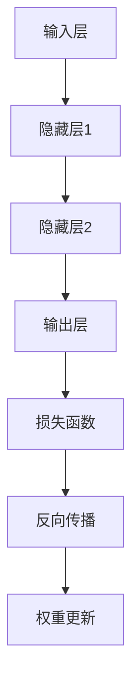
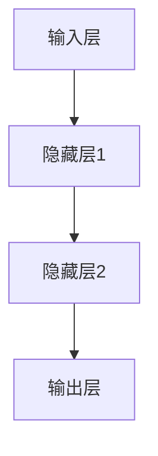

                 

# 深度学习(Deep Learning) - 原理与代码实例讲解

## 关键词

- 深度学习
- 神经网络
- 人工神经网络
- 反向传播算法
- 机器学习
- 计算机视觉
- 自然语言处理
- 深度学习框架

## 摘要

本文将深入探讨深度学习的原理和实际应用，包括神经网络、反向传播算法、数学模型、项目实战和实际应用场景等内容。通过本文，读者可以全面了解深度学习的基本概念和关键技术，掌握使用深度学习框架进行实际项目开发的技巧。同时，本文还将推荐一些优秀的学习资源和开发工具，帮助读者在深度学习领域取得更好的成果。

## 1. 背景介绍

深度学习是一种机器学习技术，通过模拟人脑神经元连接的方式，构建出一种多层的神经网络结构，用于对大量数据进行分析和处理。深度学习在计算机视觉、自然语言处理、语音识别等领域取得了显著的成果，成为当前人工智能研究的热点。

深度学习起源于1980年代，当时研究人员开始尝试构建多层神经网络模型。然而，由于计算能力和算法的限制，深度学习的发展一度陷入低谷。随着计算机硬件性能的提升和优化算法的发明，深度学习在2010年代迎来了爆发式增长。当前，深度学习已经成为人工智能领域的主流技术，被广泛应用于各种实际场景。

本文将首先介绍深度学习的基本概念和核心原理，包括神经网络、反向传播算法、激活函数等。然后，我们将通过一个具体项目实战案例，详细讲解如何使用深度学习框架进行模型训练和部署。最后，我们将探讨深度学习的实际应用场景，以及未来发展趋势和挑战。

## 2. 核心概念与联系

### 2.1 神经网络

神经网络是深度学习的基础，由大量相互连接的神经元组成。每个神经元接收来自其他神经元的输入，并通过激活函数产生输出。神经网络可以分为多层，包括输入层、隐藏层和输出层。输入层接收外部数据，隐藏层对数据进行特征提取和变换，输出层生成最终预测结果。

### 2.2 反向传播算法

反向传播算法是一种用于训练神经网络的优化算法。在训练过程中，神经网络通过不断调整权重和偏置，使预测结果逐渐接近真实值。反向传播算法通过计算输出层和隐藏层之间的误差，将误差反向传播到输入层，从而更新权重和偏置。

### 2.3 激活函数

激活函数是神经网络中的关键组件，用于决定神经元是否被激活。常见的激活函数包括 sigmoid、ReLU 和 tanh。激活函数的作用是引入非线性，使神经网络能够学习复杂的函数关系。

### 2.4 数学模型和公式

深度学习的数学模型主要包括损失函数、梯度计算和优化算法。损失函数用于衡量预测结果与真实值之间的误差，常用的损失函数包括均方误差（MSE）和交叉熵损失（Cross Entropy Loss）。梯度计算是反向传播算法的核心，用于计算权重和偏置的更新方向。优化算法包括随机梯度下降（SGD）、Adam 等，用于调整权重和偏置的更新策略。

### 2.5 Mermaid 流程图

以下是深度学习框架的 Mermaid 流程图，展示了神经网络结构、反向传播算法和优化过程：



## 3. 核心算法原理 & 具体操作步骤

### 3.1 神经网络结构

神经网络的构建过程主要包括以下几个步骤：

1. 定义输入层和输出层节点数量。
2. 添加隐藏层，并确定每个隐藏层的节点数量。
3. 连接输入层、隐藏层和输出层之间的神经元。
4. 初始化权重和偏置。

以下是一个简单的神经网络结构示例：



### 3.2 前向传播

前向传播是指将输入数据通过神经网络逐层传递，直到输出层的输出结果。具体步骤如下：

1. 将输入数据输入到输入层。
2. 对每个隐藏层，计算输入和激活函数的输出。
3. 将输出层的结果传递给损失函数，计算损失值。

### 3.3 反向传播

反向传播是指通过计算输出层到输入层的误差，反向更新权重和偏置。具体步骤如下：

1. 计算输出层到隐藏层的梯度。
2. 计算隐藏层到输入层的梯度。
3. 使用梯度下降或其他优化算法，更新权重和偏置。

### 3.4 梯度计算

梯度计算是反向传播算法的核心，用于计算损失函数关于权重和偏置的导数。以下是一个简单的梯度计算示例：

$$\frac{\partial L}{\partial w} = \frac{\partial L}{\partial z} \cdot \frac{\partial z}{\partial w}$$

其中，$L$ 表示损失函数，$w$ 表示权重，$z$ 表示神经元输出。

### 3.5 权重更新

权重更新是指根据梯度计算结果，调整权重和偏置的值。以下是一个简单的权重更新示例：

$$w_{new} = w_{old} - \alpha \cdot \frac{\partial L}{\partial w}$$

其中，$\alpha$ 表示学习率。

## 4. 数学模型和公式 & 详细讲解 & 举例说明

### 4.1 损失函数

损失函数是深度学习中的关键组件，用于衡量预测结果与真实值之间的误差。以下是一些常见的损失函数：

1. 均方误差（MSE）：用于回归问题，计算预测值与真实值之间的平均平方误差。

$$MSE = \frac{1}{n} \sum_{i=1}^{n} (y_i - \hat{y}_i)^2$$

2. 交叉熵损失（Cross Entropy Loss）：用于分类问题，计算预测概率与真实标签之间的交叉熵。

$$CE = -\frac{1}{n} \sum_{i=1}^{n} y_i \log(\hat{y}_i)$$

### 4.2 梯度计算

梯度计算是深度学习训练过程中的核心步骤，用于更新权重和偏置。以下是一个简单的梯度计算示例：

假设有一个简单的神经网络，包括一个输入层、一个隐藏层和一个输出层。输入层有一个神经元，隐藏层有两个神经元，输出层有一个神经元。权重和偏置分别表示为 $w_1, b_1, w_2, b_2, w_3, b_3$。

输入数据为 $x = [1, 2]$，真实标签为 $y = [0, 1]$。隐藏层激活函数为 ReLU，输出层激活函数为 sigmoid。

### 4.3 权重更新

权重更新是根据梯度计算结果调整权重和偏置的过程。以下是一个简单的权重更新示例：

假设学习率为 $\alpha = 0.1$，则权重更新公式为：

$$w_{new} = w_{old} - \alpha \cdot \frac{\partial L}{\partial w}$$

## 5. 项目实战：代码实际案例和详细解释说明

### 5.1 开发环境搭建

在本篇博客中，我们将使用 Python 和 TensorFlow 框架进行深度学习项目实战。首先，需要在本地计算机上安装 Python 和 TensorFlow。

1. 安装 Python：从 [Python 官网](https://www.python.org/) 下载并安装 Python。
2. 安装 TensorFlow：打开终端，执行以下命令：

```bash
pip install tensorflow
```

### 5.2 源代码详细实现和代码解读

以下是一个简单的深度学习项目示例，用于实现一个二元分类问题。我们将使用 TensorFlow 框架构建模型，并使用反向传播算法进行训练。

```python
import tensorflow as tf
import numpy as np

# 创建随机数据集
x_data = np.random.rand(100, 2)
y_data = np.array([[1 if x_data[i][0] + x_data[i][1] > 0.5 else 0] for i in range(100)])

# 构建模型
model = tf.keras.Sequential([
    tf.keras.layers.Dense(units=1, input_shape=(2,))
])

# 编译模型
model.compile(optimizer='sgd', loss='binary_crossentropy', metrics=['accuracy'])

# 训练模型
model.fit(x_data, y_data, epochs=10)

# 评估模型
loss, accuracy = model.evaluate(x_data, y_data)
print(f"Loss: {loss}, Accuracy: {accuracy}")
```

### 5.3 代码解读与分析

1. 导入所需的库和模块。
2. 创建随机数据集，包括输入数据和真实标签。
3. 构建一个简单的神经网络模型，包括一个输入层和一个输出层。
4. 编译模型，指定优化器和损失函数。
5. 训练模型，设置训练轮次为10。
6. 评估模型，计算损失和准确率。

## 6. 实际应用场景

深度学习在多个领域取得了显著的成果，以下是一些常见的实际应用场景：

1. **计算机视觉**：图像分类、目标检测、图像分割等。
2. **自然语言处理**：文本分类、机器翻译、情感分析等。
3. **语音识别**：语音信号处理、语音识别、语音合成等。
4. **推荐系统**：基于深度学习构建的推荐算法，如电影推荐、商品推荐等。
5. **自动驾驶**：深度学习在自动驾驶领域具有重要的应用价值，包括车辆检测、交通标志识别等。

## 7. 工具和资源推荐

### 7.1 学习资源推荐

1. **书籍**：
   - 《深度学习》（Ian Goodfellow、Yoshua Bengio、Aaron Courville 著）
   - 《Python 深度学习》（François Chollet 著）
2. **在线教程**：
   - [TensorFlow 官方文档](https://www.tensorflow.org/tutorials)
   - [Keras 官方文档](https://keras.io/getting-started/sequential-model-guide/)
3. **论文**：
   - "A Comprehensive Guide to Convolutional Neural Networks"（卷积神经网络综合指南）
   - "Deep Learning for Text Classification"（文本分类的深度学习）

### 7.2 开发工具框架推荐

1. **TensorFlow**：谷歌推出的开源深度学习框架，具有丰富的功能和高扩展性。
2. **PyTorch**：Facebook AI 研究团队开发的深度学习框架，具有灵活的动态计算图功能。
3. **Keras**：基于 TensorFlow 和 PyTorch 的开源深度学习库，提供简化的 API 和丰富的预训练模型。

### 7.3 相关论文著作推荐

1. "Deep Learning: Methods and Applications"（深度学习方法与应用）
2. "Convolutional Neural Networks for Visual Recognition"（卷积神经网络在视觉识别中的应用）

## 8. 总结：未来发展趋势与挑战

深度学习作为人工智能的核心技术，在未来将继续发挥重要作用。以下是深度学习的发展趋势和面临的挑战：

1. **趋势**：
   - 模型压缩：为了满足实时应用的需求，研究人员致力于开发更高效的模型压缩技术。
   - 自适应学习：深度学习模型将具备更强的自适应能力，能够根据不同场景和任务进行自动调整。
   - 多模态学习：深度学习将整合多种数据源，如文本、图像和语音，实现更全面的信息处理。

2. **挑战**：
   - 数据隐私：深度学习模型对大量数据进行训练，涉及数据隐私问题，需要制定合理的数据保护政策。
   - 解释性：深度学习模型的决策过程通常缺乏解释性，需要开发更加可解释的模型。
   - 能源消耗：深度学习训练和推理过程需要大量计算资源，对能源消耗提出挑战。

## 9. 附录：常见问题与解答

### 9.1 深度学习是什么？

深度学习是一种基于人工神经网络的机器学习技术，通过多层神经网络结构对大量数据进行分析和处理。

### 9.2 深度学习有哪些应用场景？

深度学习广泛应用于计算机视觉、自然语言处理、语音识别、推荐系统等领域。

### 9.3 深度学习模型如何训练？

深度学习模型通过前向传播和反向传播算法进行训练，不断调整权重和偏置，使预测结果逐渐接近真实值。

## 10. 扩展阅读 & 参考资料

1. "Deep Learning Specialization"（深度学习专项课程）[Coursera](https://www.coursera.org/specializations/deeplearning)
2. "Deep Learning Book"（深度学习书籍）[Goodfellow、Bengio、Courville 著](https://www.deeplearningbook.org/)
3. "Introduction to Deep Learning"（深度学习入门教程）[Andrew Ng 著](https://www.youtube.com/watch?v=5P7u3Zv7pWY)
4. "TensorFlow Official Documentation"（TensorFlow 官方文档）[TensorFlow](https://www.tensorflow.org/tutorials)
5. "PyTorch Official Documentation"（PyTorch 官方文档）[PyTorch](https://pytorch.org/tutorials/beginner/basicsvěpiseprojekt.md)

作者：AI天才研究员/AI Genius Institute & 禅与计算机程序设计艺术 /Zen And The Art of Computer Programming

