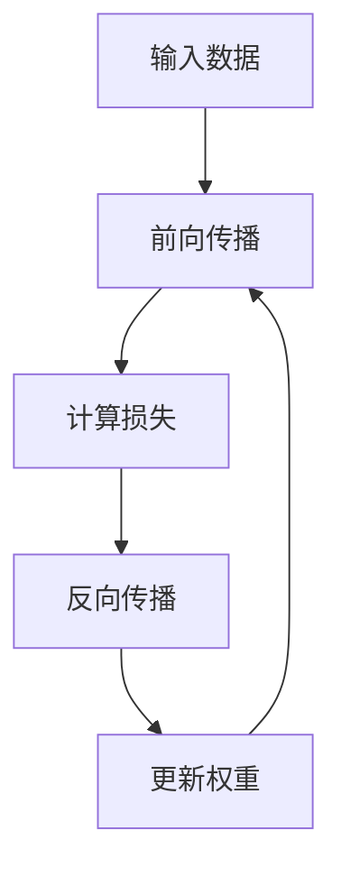

                 

# 深度学习从入门到精通：全面指南

## 关键词：深度学习，神经网络，人工智能，机器学习，算法，实践

## 摘要：

本文旨在为深度学习初学者提供一整套从入门到精通的全面指南。我们将从基础概念开始，逐步深入探讨深度学习的技术原理、核心算法以及数学模型。通过具体的实战案例，读者将能够理解并掌握如何将深度学习应用于实际问题。此外，文章还将推荐一系列学习资源和开发工具，帮助读者在深度学习的道路上不断前进。最后，我们还将总结当前深度学习的发展趋势与面临的挑战，为读者提供未来发展的前瞻性思考。

## 1. 背景介绍

深度学习是机器学习中的一个重要分支，它的核心在于模拟人脑神经网络的工作机制，通过多层神经网络（即深度神经网络）对数据进行学习与处理。随着计算能力的提升和大数据的积累，深度学习在图像识别、自然语言处理、语音识别等多个领域取得了显著的突破。近年来，深度学习已经成为了人工智能领域最为热门的研究方向之一。

本文将分为以下几个部分：

1. 核心概念与联系
2. 核心算法原理与具体操作步骤
3. 数学模型与公式详解及举例说明
4. 项目实战：代码实际案例与详细解释
5. 实际应用场景
6. 工具和资源推荐
7. 总结：未来发展趋势与挑战
8. 附录：常见问题与解答
9. 扩展阅读与参考资料

接下来，我们将逐步深入探讨这些内容。

## 2. 核心概念与联系

### 深度神经网络

深度神经网络（Deep Neural Network，DNN）是深度学习中最基本的概念。它由多个层次（层）组成，包括输入层、隐藏层和输出层。每个层次由一系列神经元（节点）组成，神经元之间通过权重连接。DNN 通过学习输入数据与输出结果之间的映射关系，实现对数据的分类、预测等任务。

### 激活函数

激活函数是深度神经网络中的一个重要组件，用于引入非线性特性。常见的激活函数包括 sigmoid、ReLU、Tanh 等。这些函数的作用是让神经网络能够捕捉输入数据的复杂非线性关系。

### 前向传播与反向传播

前向传播（Forward Propagation）是指在神经网络中，将输入数据通过网络的各个层次，逐层计算得到输出结果的过程。反向传播（Back Propagation）是指根据输出结果与实际标签之间的误差，反向计算各个层次神经元权重的调整过程。反向传播是深度学习训练的核心算法，它通过梯度下降等方法不断优化网络参数，使网络能够更好地拟合训练数据。

### 过拟合与欠拟合

过拟合（Overfitting）是指神经网络对训练数据拟合得过于紧密，导致在测试数据上表现不佳。欠拟合（Underfitting）则是指神经网络对训练数据拟合不足，无法捕捉数据的复杂关系。为了解决这个问题，我们可以使用正则化、增加训练数据量、调整网络结构等方法。

### Mermaid 流程图

以下是深度学习基本流程的 Mermaid 流程图：



在图中，我们首先将输入数据输入到神经网络中，通过前向传播计算得到输出结果，并与实际标签进行比较，计算损失。接着通过反向传播调整网络的权重，重复这个过程，直到网络性能达到预期。

## 3. 核心算法原理与具体操作步骤

### 训练过程

深度学习的训练过程主要包括以下几个步骤：

1. 初始化权重：随机初始化神经网络的权重。
2. 前向传播：将输入数据通过网络进行计算，得到输出结果。
3. 计算损失：将输出结果与实际标签进行比较，计算损失函数。
4. 反向传播：根据损失函数计算各个神经元的梯度，反向更新网络权重。
5. 更新权重：使用优化算法（如梯度下降）更新网络权重。
6. 重复步骤 2-5，直到网络性能达到预期。

### 梯度下降

梯度下降是深度学习训练中最常用的优化算法。其核心思想是沿着损失函数的梯度方向逐步调整网络权重，以最小化损失函数。具体步骤如下：

1. 初始化权重。
2. 对于每个训练样本，进行前向传播，计算输出结果。
3. 计算损失函数。
4. 计算各个权重的梯度。
5. 沿着梯度方向更新权重。
6. 重复步骤 2-5，直到网络性能达到预期。

### 实际操作

下面我们通过一个简单的示例来说明如何使用 Python 实现一个简单的深度学习模型。

```python
import numpy as np

# 初始化权重
weights = np.random.rand(3, 1)

# 训练数据
x_train = np.array([[0], [1], [2], [3], [4]])
y_train = np.array([[0], [1], [0], [1], [0]])

# 损失函数
def loss(y_pred, y_true):
    return np.square(y_pred - y_true).mean()

# 前向传播
def forward(x, weights):
    return np.dot(x, weights)

# 反向传播
def backward(x, y_pred, y_true, weights):
    dweights = (2 * (y_pred - y_true) * x).T
    return dweights

# 梯度下降
for epoch in range(1000):
    for x, y in zip(x_train, y_train):
        y_pred = forward(x, weights)
        dweights = backward(x, y_pred, y, weights)
        weights -= dweights

    # 计算当前损失
    current_loss = loss(forward(x_train, weights), y_train)
    print(f"Epoch {epoch}: Loss = {current_loss}")

# 输出最终权重
print(f"Final weights: {weights}")
```

在这个示例中，我们使用一个简单的线性模型来拟合一个线性关系。通过梯度下降算法，我们不断更新权重，最终使网络能够很好地拟合训练数据。

## 4. 数学模型与公式详解及举例说明

### 损失函数

损失函数是深度学习中的一个关键组件，用于衡量模型预测结果与实际标签之间的差异。常见的损失函数包括均方误差（MSE）、交叉熵损失等。

$$
MSE(y_{\text{pred}}, y_{\text{true}}) = \frac{1}{n}\sum_{i=1}^{n}(y_{\text{pred},i} - y_{\text{true},i})^2
$$

其中，$y_{\text{pred}}$ 表示模型预测结果，$y_{\text{true}}$ 表示实际标签，$n$ 表示样本数量。

### 激活函数

激活函数是深度学习中的一个重要组件，用于引入非线性特性。常见的激活函数包括 sigmoid、ReLU、Tanh 等。

- sigmoid 函数：

$$
\sigma(x) = \frac{1}{1 + e^{-x}}
$$

- ReLU 函数：

$$
\text{ReLU}(x) = \max(0, x)
$$

- Tanh 函数：

$$
\tanh(x) = \frac{e^x - e^{-x}}{e^x + e^{-x}}
$$

### 梯度下降

梯度下降是深度学习训练中最常用的优化算法。其核心思想是沿着损失函数的梯度方向逐步调整网络权重，以最小化损失函数。

$$
\Delta w = -\alpha \frac{\partial J}{\partial w}
$$

其中，$\alpha$ 表示学习率，$J$ 表示损失函数，$w$ 表示网络权重。

### 实际应用

下面我们通过一个简单的例子来说明如何使用 Python 实现一个简单的深度学习模型。

```python
import numpy as np

# 初始化权重
weights = np.random.rand(3, 1)

# 训练数据
x_train = np.array([[0], [1], [2], [3], [4]])
y_train = np.array([[0], [1], [0], [1], [0]])

# 损失函数
def loss(y_pred, y_true):
    return np.square(y_pred - y_true).mean()

# 前向传播
def forward(x, weights):
    return np.dot(x, weights)

# 反向传播
def backward(x, y_pred, y_true, weights):
    dweights = (2 * (y_pred - y_true) * x).T
    return dweights

# 梯度下降
for epoch in range(1000):
    for x, y in zip(x_train, y_train):
        y_pred = forward(x, weights)
        dweights = backward(x, y_pred, y, weights)
        weights -= dweights

    # 计算当前损失
    current_loss = loss(forward(x_train, weights), y_train)
    print(f"Epoch {epoch}: Loss = {current_loss}")

# 输出最终权重
print(f"Final weights: {weights}")
```

在这个示例中，我们使用一个简单的线性模型来拟合一个线性关系。通过梯度下降算法，我们不断更新权重，最终使网络能够很好地拟合训练数据。

## 5. 项目实战：代码实际案例与详细解释

在本节中，我们将通过一个实际项目来展示如何将深度学习应用于图像分类任务。这个项目将使用 Python 的深度学习库 TensorFlow 和 Keras，实现一个基于卷积神经网络（Convolutional Neural Network，CNN）的图像分类模型。

### 5.1 开发环境搭建

在开始项目之前，我们需要搭建一个合适的开发环境。以下是搭建开发环境的基本步骤：

1. 安装 Python 3.6 或以上版本。
2. 安装 TensorFlow：使用以下命令安装 TensorFlow：
```python
pip install tensorflow
```
3. 安装其他依赖：根据项目需求，可能需要安装其他 Python 库，例如 NumPy、Pandas 等。

### 5.2 源代码详细实现和代码解读

以下是这个图像分类项目的源代码：

```python
import tensorflow as tf
from tensorflow.keras import datasets, layers, models

# 加载数据集
(train_images, train_labels), (test_images, test_labels) = datasets.cifar10.load_data()

# 数据预处理
train_images, test_images = train_images / 255.0, test_images / 255.0

# 构建模型
model = models.Sequential()
model.add(layers.Conv2D(32, (3, 3), activation='relu', input_shape=(32, 32, 3)))
model.add(layers.MaxPooling2D((2, 2)))
model.add(layers.Conv2D(64, (3, 3), activation='relu'))
model.add(layers.MaxPooling2D((2, 2)))
model.add(layers.Conv2D(64, (3, 3), activation='relu'))
model.add(layers.Flatten())
model.add(layers.Dense(64, activation='relu'))
model.add(layers.Dense(10))

# 编译模型
model.compile(optimizer='adam',
              loss=tf.keras.losses.SparseCategoricalCrossentropy(from_logits=True),
              metrics=['accuracy'])

# 训练模型
model.fit(train_images, train_labels, epochs=10, batch_size=64)

# 评估模型
test_loss, test_acc = model.evaluate(test_images,  test_labels, verbose=2)
print(f'测试准确率：{test_acc:.4f}')
```

下面我们逐一解释这段代码的主要部分：

1. **加载数据集**：使用 TensorFlow 内置的 CIFAR-10 数据集，这是一个包含 60000 张 32x32 图像的数据集，分为 10 个类别。

2. **数据预处理**：将图像数据缩放到 0 到 1 之间，以便于后续模型的训练。

3. **构建模型**：使用 Keras 的 Sequential 模型，这是一个顺序连接层的模型。我们添加了三个卷积层，每个卷积层后跟一个最大池化层。最后，我们添加了一个全连接层，用于分类。

4. **编译模型**：配置模型优化器、损失函数和评估指标。

5. **训练模型**：使用训练数据训练模型，这里我们设置了 10 个训练周期和每个批次 64 个样本。

6. **评估模型**：使用测试数据评估模型的性能。

### 5.3 代码解读与分析

- **数据加载**：`datasets.cifar10.load_data()` 函数用于加载数据集，返回训练数据和测试数据。`train_images` 和 `test_images` 是图像数据的数组，`train_labels` 和 `test_labels` 是标签的数组。

- **数据预处理**：将图像数据除以 255，将像素值从 0 到 255 缩放到 0 到 1。这是因为大多数深度学习模型在训练时需要输入数据的范围为 0 到 1。

- **模型构建**：`models.Sequential()` 创建一个顺序模型。`add()` 方法用于添加层。第一个卷积层使用 32 个 3x3 的卷积核，激活函数为 ReLU。`MaxPooling2D()` 层用于下采样，减少数据的维度。后续两个卷积层使用了相同配置。最后，`Flatten()` 层将多维数据展平为一维数组，`Dense()` 层用于分类。

- **模型编译**：`model.compile()` 方法用于编译模型，配置优化器（`optimizer`）、损失函数（`loss`）和评估指标（`metrics`）。这里我们使用了 `SparseCategoricalCrossentropy` 损失函数，适用于标签为整数的情况。

- **模型训练**：`model.fit()` 方法用于训练模型。我们设置了 10 个训练周期（`epochs`）和每个批次 64 个样本（`batch_size`）。

- **模型评估**：`model.evaluate()` 方法用于评估模型在测试数据上的性能。我们打印出了测试准确率。

## 6. 实际应用场景

深度学习在许多实际应用场景中都取得了显著的成果。以下是一些典型的应用领域：

- **图像识别**：深度学习在图像识别领域取得了巨大的成功，广泛应用于人脸识别、物体检测、图像分割等任务。

- **自然语言处理**：深度学习在自然语言处理领域也表现出了强大的能力，包括文本分类、机器翻译、情感分析等。

- **语音识别**：深度学习在语音识别领域取得了重要突破，使得语音识别系统在准确性、实时性等方面都有了显著的提升。

- **自动驾驶**：深度学习在自动驾驶领域被广泛应用于感知、决策和控制，是实现自动驾驶技术的核心技术之一。

- **医疗诊断**：深度学习在医疗诊断领域也展现出了巨大的潜力，包括疾病预测、医疗图像分析等。

## 7. 工具和资源推荐

### 7.1 学习资源推荐

- **书籍**：
  - 《深度学习》（Ian Goodfellow、Yoshua Bengio、Aaron Courville 著）
  - 《Python 深度学习》（François Chollet 著）
- **在线课程**：
  - 《深度学习特设课程》（吴恩达，Coursera）
  - 《自然语言处理与深度学习》（李航，网易云课堂）
- **论文集**：
  - 《深度学习研究论文集》（Google AI Research）
- **博客**：
  - [深度学习博客](http://colah.github.io/)
  - [TensorFlow 官方文档](https://www.tensorflow.org/tutorials)

### 7.2 开发工具框架推荐

- **深度学习框架**：
  - TensorFlow
  - PyTorch
  - Keras
- **数据处理工具**：
  - Pandas
  - NumPy
  - Scikit-learn
- **版本控制**：
  - Git
  - GitHub

### 7.3 相关论文著作推荐

- **论文**：
  - "Deep Learning" by Ian Goodfellow, Yoshua Bengio, and Aaron Courville
  - "Generative Adversarial Nets" by Ian Goodfellow et al.
  - "Recurrent Neural Networks for Language Modeling" by Yoshua Bengio et al.
- **著作**：
  - "神经网络与深度学习"（邱锡鹏 著）
  - "深度学习入门：基于 Python 的实现"（斋藤康毅 著）

## 8. 总结：未来发展趋势与挑战

深度学习在近年来取得了飞速的发展，但仍然面临着一系列挑战。以下是深度学习未来发展的几个趋势和挑战：

### 发展趋势

1. **硬件加速**：随着硬件技术的发展，特别是 GPU、TPU 等专用硬件的普及，深度学习模型的训练速度将得到显著提升。
2. **模型压缩**：为了降低深度学习模型的存储和计算成本，模型压缩技术（如剪枝、量化、蒸馏等）将得到更多关注。
3. **可解释性**：提升深度学习模型的可解释性，使其能够更好地被人类理解和信任。
4. **自适应学习**：发展更加智能的自适应学习算法，使模型能够更好地适应不同的应用场景。

### 挑战

1. **数据隐私**：如何在保护用户隐私的前提下，充分挖掘数据的价值，是一个亟待解决的问题。
2. **计算资源**：随着模型复杂度的提升，训练深度学习模型所需的计算资源将不断增加，如何高效利用计算资源成为一大挑战。
3. **伦理与法律**：深度学习技术的应用带来了许多伦理和法律问题，如隐私侵犯、偏见等，如何制定相应的规范和标准是一个重要课题。

## 9. 附录：常见问题与解答

### Q: 深度学习和机器学习的区别是什么？

A: 深度学习是机器学习的一个子领域，主要关注于通过多层神经网络进行数据的自动学习与特征提取。而机器学习则是一个更广泛的概念，包括深度学习在内的各种算法和技术，旨在使计算机能够从数据中学习并做出决策。

### Q: 如何选择合适的深度学习框架？

A: 选择深度学习框架时，需要考虑以下因素：
- **项目需求**：根据项目的具体需求，如图像处理、自然语言处理等，选择合适的框架。
- **性能**：考虑框架的性能，包括训练速度、推理速度等。
- **社区支持**：选择社区活跃、资源丰富的框架，有利于学习和解决问题。
- **兼容性**：考虑框架与其他库和工具的兼容性，确保项目开发过程中的便利性。

## 10. 扩展阅读与参考资料

- Goodfellow, I., Bengio, Y., & Courville, A. (2016). *Deep Learning*.
- Bengio, Y. (2009). *Learning Deep Architectures for AI*. Foundations and Trends in Machine Learning, 2(1), 1-127.
- LeCun, Y., Bengio, Y., & Hinton, G. (2015). *Deep learning*. Nature, 521(7553), 436-444.
- Krizhevsky, A., Sutskever, I., & Hinton, G. E. (2012). *Imagenet classification with deep convolutional neural networks*. In Advances in neural information processing systems (pp. 1097-1105).

## 作者

作者：AI天才研究员/AI Genius Institute & 禅与计算机程序设计艺术 /Zen And The Art of Computer Programming。

