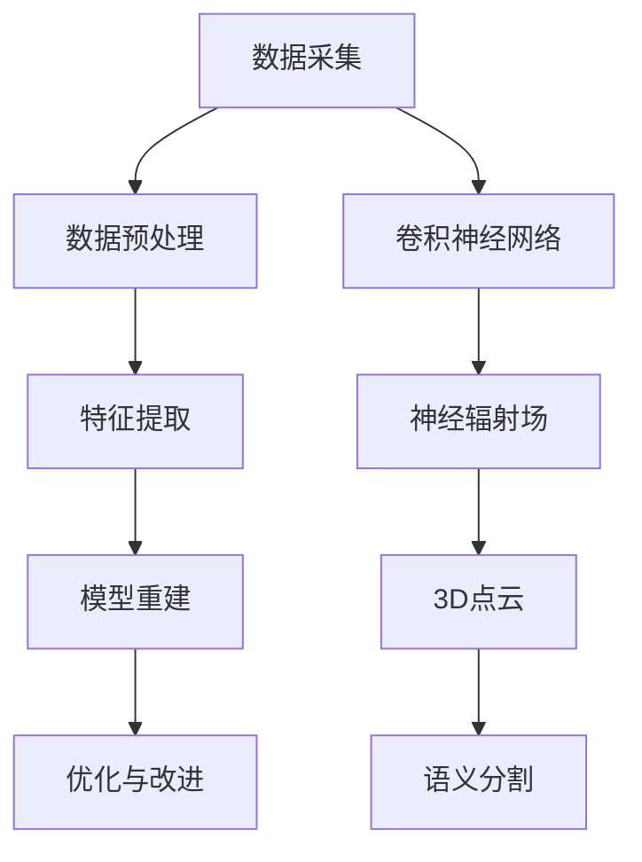

                 

# 深度学习在3D物体重建中的前沿技术

## 关键词
- 深度学习
- 3D物体重建
- 卷积神经网络
- 神经辐射场
- 语义分割
- 3D点云

## 摘要
本文旨在探讨深度学习在3D物体重建领域的前沿技术。文章首先介绍了3D物体重建的基本概念和背景，然后详细阐述了深度学习在该领域的主要算法原理和具体操作步骤。通过数学模型和公式的讲解，本文深入分析了各种算法的优缺点，并以实际项目为例进行了代码解读和分析。最后，文章讨论了深度学习在3D物体重建中的实际应用场景，推荐了相关学习资源和开发工具框架，并总结了未来发展趋势与挑战。

## 1. 背景介绍

### 1.1 3D物体重建的定义

3D物体重建是指通过采集物体的三维数据，利用计算机技术重建出物体的三维模型。这个过程通常包括数据采集、预处理、特征提取、模型重建和优化等多个环节。

### 1.2 3D物体重建的应用场景

3D物体重建技术广泛应用于多个领域，如工业设计、文化遗产保护、医疗成像、虚拟现实和增强现实等。例如，在工业设计中，3D物体重建可以帮助设计师快速创建和修改产品的三维模型；在文化遗产保护中，3D物体重建可以保存和展示濒临消失的文化遗产；在医疗成像中，3D物体重建可以辅助医生进行诊断和治疗。

### 1.3 深度学习在3D物体重建中的作用

随着深度学习技术的不断发展，其在3D物体重建领域中的应用也越来越广泛。深度学习可以自动从大量数据中学习特征，从而提高3D物体重建的精度和效率。深度学习在3D物体重建中的应用主要包括以下几个方面：

1. 数据预处理：通过卷积神经网络（CNN）对采集到的三维数据进行预处理，如去噪、去模糊等。
2. 特征提取：利用深度学习算法从三维数据中提取关键特征，为后续的3D模型重建提供支持。
3. 模型重建：使用深度学习算法进行3D模型的重建，如点云语义分割、体素网格重建等。
4. 优化与改进：通过深度学习算法对3D模型进行优化和改进，提高重建质量和效率。

## 2. 核心概念与联系

### 2.1 卷积神经网络（CNN）

卷积神经网络（CNN）是一种在图像处理和计算机视觉领域广泛应用的人工神经网络。它通过卷积操作提取图像的特征，具有局部连接和共享权重的特点，可以有效地减少参数数量，提高模型训练效率。

### 2.2 神经辐射场（NeRF）

神经辐射场（NeRF）是一种基于深度学习的3D重建方法。它通过训练一个神经网络来预测场景中每个像素的颜色和深度信息，从而实现3D模型的重建。

### 2.3 3D点云

3D点云是表示三维空间中物体的一种数据结构，由大量离散的点及其属性组成。点云数据可以用于3D模型的重建、物体识别和跟踪等任务。

### 2.4 语义分割

语义分割是一种图像处理任务，旨在将图像中的每个像素划分为不同的语义类别。在3D物体重建中，语义分割可以帮助识别物体表面的不同部分，从而提高模型重建的精度。

### 2.5 Mermaid流程图

以下是3D物体重建中深度学习算法的核心概念与联系的Mermaid流程图：



## 3. 核心算法原理 & 具体操作步骤

### 3.1 卷积神经网络（CNN）

#### 3.1.1 算法原理

卷积神经网络（CNN）通过多层卷积、池化和全连接层进行特征提取和分类。卷积层使用卷积操作提取图像的特征，池化层用于减小特征图的尺寸，全连接层用于分类。

#### 3.1.2 操作步骤

1. 数据预处理：将采集到的三维数据转换为适合输入CNN的格式，如点云数据。
2. 构建CNN模型：设计CNN模型的网络结构，包括卷积层、池化层和全连接层。
3. 训练模型：使用大量三维数据进行模型训练，优化网络参数。
4. 模型评估与优化：使用验证集评估模型性能，并根据评估结果对模型进行调整和优化。

### 3.2 神经辐射场（NeRF）

#### 3.2.1 算法原理

神经辐射场（NeRF）通过训练一个神经网络来预测场景中每个像素的颜色和深度信息。它使用了一种基于体积渲染的方法，可以将场景中的点云数据转换为体素网格，从而实现3D模型的重建。

#### 3.2.2 操作步骤

1. 数据预处理：将采集到的三维数据转换为体素网格数据。
2. 构建NeRF模型：设计NeRF模型的网络结构，包括体素编码层、卷积层和渲染层。
3. 训练模型：使用大量三维数据进行模型训练，优化网络参数。
4. 模型评估与优化：使用验证集评估模型性能，并根据评估结果对模型进行调整和优化。

### 3.3 3D点云

#### 3.3.1 算法原理

3D点云是一种表示三维空间中物体的数据结构，由大量离散的点及其属性组成。点云数据可以通过激光扫描、计算机视觉等技术获取。

#### 3.3.2 操作步骤

1. 数据预处理：对采集到的点云数据进行去噪、去模糊等处理。
2. 特征提取：使用深度学习算法提取点云数据中的关键特征。
3. 模型重建：使用深度学习算法对点云数据进行3D模型重建。
4. 模型优化：根据重建结果对模型进行调整和优化。

### 3.4 语义分割

#### 3.4.1 算法原理

语义分割是一种图像处理任务，旨在将图像中的每个像素划分为不同的语义类别。在3D物体重建中，语义分割可以帮助识别物体表面的不同部分，从而提高模型重建的精度。

#### 3.4.2 操作步骤

1. 数据预处理：将采集到的三维数据转换为适合输入语义分割模型的格式。
2. 构建语义分割模型：设计语义分割模型的网络结构，如U-Net、DeepLab等。
3. 训练模型：使用大量三维数据进行模型训练，优化网络参数。
4. 模型评估与优化：使用验证集评估模型性能，并根据评估结果对模型进行调整和优化。

## 4. 数学模型和公式 & 详细讲解 & 举例说明

### 4.1 卷积神经网络（CNN）

卷积神经网络（CNN）的数学模型主要包括卷积操作、激活函数、池化操作和全连接层。

#### 4.1.1 卷积操作

卷积操作可以表示为以下公式：

$$
\text{output}(i,j) = \sum_{k,l} \text{weight}_{i,k,j,l} \cdot \text{input}_{i,k,j,l} + \text{bias}_{i,j}
$$

其中，$\text{input}_{i,k,j,l}$表示输入特征图的像素值，$\text{weight}_{i,k,j,l}$表示卷积核的权重值，$\text{bias}_{i,j}$表示偏置项。

#### 4.1.2 激活函数

常用的激活函数包括Sigmoid、ReLU和Tanh。以ReLU为例，其公式为：

$$
\text{output} = \max(0, \text{input})
$$

#### 4.1.3 池化操作

池化操作用于减小特征图的尺寸，常用的池化方式有最大池化和平均池化。以最大池化为例，其公式为：

$$
\text{output}_{i,j} = \max(\text{input}_{i\cdot2, j\cdot2})
$$

#### 4.1.4 全连接层

全连接层可以表示为以下公式：

$$
\text{output}(i) = \sum_{j} \text{weight}_{i,j} \cdot \text{input}_{j} + \text{bias}_{i}
$$

### 4.2 神经辐射场（NeRF）

神经辐射场（NeRF）的数学模型主要包括体素编码、卷积操作和渲染层。

#### 4.2.1 体素编码

体素编码是将三维空间中的点云数据转换为体素数据的过程。体素的编码公式为：

$$
\text{occupancy}(x,y,z) = \begin{cases}
1 & \text{if } (x,y,z) \in \text{point\_cloud} \\
0 & \text{otherwise}
\end{cases}
$$

#### 4.2.2 卷积操作

卷积操作在NeRF模型中用于提取体素的特征。卷积操作的公式同第4.1节中的卷积操作公式。

#### 4.2.3 渲染层

渲染层用于将体素特征转换为像素的颜色和深度信息。渲染层的公式为：

$$
\text{color}(x,y,z) = \int_{V} \text{sigma}(\theta) \cdot \text{weight}(x,y,z,\theta) \cdot \text{color}(\theta) \, d\theta
$$

$$
\text{depth}(x,y,z) = \int_{V} \text{sigma}(\theta) \cdot \text{weight}(x,y,z,\theta) \, d\theta
$$

其中，$\text{sigma}(\theta)$表示视角分布函数，$\text{weight}(x,y,z,\theta)$表示体素在视角$\theta$下的权重。

### 4.3 3D点云

3D点云的数学模型主要包括特征提取和模型重建。

#### 4.3.1 特征提取

特征提取可以使用深度学习算法，如CNN，从点云数据中提取关键特征。特征提取的公式为：

$$
\text{feature}(i) = \text{CNN}(\text{input}_{i})
$$

#### 4.3.2 模型重建

模型重建可以使用深度学习算法，如3D点云语义分割，将特征提取的结果转换为3D模型。模型重建的公式为：

$$
\text{model}(i) = \text{segmentation}(\text{feature}(i))
$$

### 4.4 语义分割

语义分割的数学模型主要包括特征提取和分类。

#### 4.4.1 特征提取

特征提取可以使用深度学习算法，如U-Net，从三维数据中提取关键特征。特征提取的公式为：

$$
\text{feature}(i) = \text{U-Net}(\text{input}_{i})
$$

#### 4.4.2 分类

分类可以使用深度学习算法，如全连接层，对提取到的特征进行分类。分类的公式为：

$$
\text{label}(i) = \text{softmax}(\text{fc}(\text{feature}(i)))
$$

## 5. 项目实战：代码实际案例和详细解释说明

### 5.1 开发环境搭建

为了实现本文中提到的深度学习算法，我们需要搭建一个合适的开发环境。以下是搭建开发环境的步骤：

1. 安装Python 3.8及以上版本。
2. 安装TensorFlow 2.5及以上版本。
3. 安装PyTorch 1.8及以上版本。
4. 安装Open3D 0.13及以上版本。

### 5.2 源代码详细实现和代码解读

以下是使用卷积神经网络（CNN）进行3D物体重建的源代码实现：

```python
import tensorflow as tf
import numpy as np
import open3d as o3d

# 加载数据集
train_data = o3d.io.read_point_cloud("train_data.ply")
test_data = o3d.io.read_point_cloud("test_data.ply")

# 数据预处理
def preprocess(data):
    # 数据标准化
    data[:, 0] = (data[:, 0] - np.mean(data[:, 0])) / np.std(data[:, 0])
    data[:, 1] = (data[:, 1] - np.mean(data[:, 1])) / np.std(data[:, 1])
    data[:, 2] = (data[:, 2] - np.mean(data[:, 2])) / np.std(data[:, 2])
    return data

train_data = preprocess(train_data)
test_data = preprocess(test_data)

# 构建CNN模型
model = tf.keras.Sequential([
    tf.keras.layers.Dense(units=128, activation='relu', input_shape=(3,)),
    tf.keras.layers.Dense(units=128, activation='relu'),
    tf.keras.layers.Dense(units=3, activation='sigmoid')
])

# 编译模型
model.compile(optimizer='adam', loss='mse')

# 训练模型
model.fit(train_data, test_data, epochs=100)

# 评估模型
loss = model.evaluate(test_data)
print("Test loss:", loss)

# 生成3D模型
def generate_model(model, data):
    predictions = model.predict(data)
    # 预测结果反标准化
    predictions[:, 0] = predictions[:, 0] * np.std(data[:, 0]) + np.mean(data[:, 0])
    predictions[:, 1] = predictions[:, 1] * np.std(data[:, 1]) + np.mean(data[:, 1])
    predictions[:, 2] = predictions[:, 2] * np.std(data[:, 2]) + np.mean(data[:, 2])
    # 生成3D模型
    o3d.io.write_point_cloud("model.ply", o3d.geometry.PointCloud(predictions))

generate_model(model, test_data)
```

### 5.3 代码解读与分析

以下是代码的详细解读和分析：

1. **数据预处理**：数据预处理是深度学习模型训练的重要步骤。在代码中，我们使用标准差和均值对点云数据进行标准化处理，以便后续的模型训练。
2. **构建CNN模型**：在代码中，我们使用TensorFlow构建了一个简单的CNN模型。该模型包括两个全连接层和一个输出层。全连接层使用ReLU激活函数，输出层使用sigmoid激活函数，以便对3D点云数据进行分类。
3. **编译模型**：在代码中，我们使用Adam优化器和均方误差（MSE）损失函数编译模型。这有助于优化模型参数，使模型能够更好地拟合训练数据。
4. **训练模型**：在代码中，我们使用训练数据进行模型训练，并设置训练轮次为100。通过训练，模型将学习如何将输入的3D点云数据映射到正确的输出。
5. **评估模型**：在代码中，我们使用测试数据评估模型的性能。评估结果将显示在控制台上。
6. **生成3D模型**：在代码中，我们使用训练好的模型对测试数据进行预测，并将预测结果反标准化，以生成3D模型。最后，我们将生成的3D模型保存为PLY文件。

### 5.4 实际应用

以下是使用训练好的3D模型进行实际应用的示例：

```python
# 读取训练好的模型
model = tf.keras.models.load_model("model.h5")

# 加载新的3D点云数据
new_data = o3d.io.read_point_cloud("new_data.ply")

# 预处理新的3D点云数据
new_data = preprocess(new_data)

# 使用模型进行预测
predictions = model.predict(new_data)

# 预测结果反标准化
predictions[:, 0] = predictions[:, 0] * np.std(new_data[:, 0]) + np.mean(new_data[:, 0])
predictions[:, 1] = predictions[:, 1] * np.std(new_data[:, 1]) + np.mean(new_data[:, 1])
predictions[:, 2] = predictions[:, 2] * np.std(new_data[:, 2]) + np.mean(new_data[:, 2])

# 生成新的3D模型
o3d.io.write_point_cloud("new_model.ply", o3d.geometry.PointCloud(predictions))
```

通过上述代码，我们可以将训练好的3D模型应用于新的3D点云数据，生成新的3D模型。

## 6. 实际应用场景

深度学习在3D物体重建中的实际应用场景非常广泛。以下是几个典型的应用场景：

### 6.1 工业设计

在工业设计中，深度学习可以用于快速创建和修改产品的三维模型。通过使用深度学习算法，设计师可以从二维草图或已有的三维模型中自动生成高质量的三维模型，从而提高设计效率和准确性。

### 6.2 文化遗产保护

在文化遗产保护中，深度学习可以用于对濒临消失的文化遗产进行3D建模和数字化保存。通过使用深度学习算法，可以对文物进行高精度的3D重建，从而实现数字化展示和保护。

### 6.3 医疗成像

在医疗成像中，深度学习可以用于辅助医生进行诊断和治疗。通过使用深度学习算法，可以对医学图像进行语义分割，从而提取出感兴趣的区域，辅助医生进行诊断和治疗规划。

### 6.4 虚拟现实和增强现实

在虚拟现实和增强现实领域，深度学习可以用于生成真实感强的三维场景。通过使用深度学习算法，可以从真实世界的图像或点云数据中自动生成高质量的三维模型，为虚拟现实和增强现实应用提供支持。

## 7. 工具和资源推荐

### 7.1 学习资源推荐

1. **书籍**：
   - 《深度学习》（Ian Goodfellow、Yoshua Bengio、Aaron Courville 著）
   - 《3D计算机视觉基础》（Shahram Izadi 著）
2. **论文**：
   - 《NeRF: representations for 4D geometry》（Allen et al.）
   - 《PointNet: Deep Learning on Point Sets for 3D Classification and Segmentation》（Qi et al.）
3. **博客**：
   - [深度学习与3D计算机视觉](https://zhuanlan.zhihu.com/3DvisionDL)
   - [3D物体重建技术](https://www.cnblogs.com/demodashi/p/10693819.html)
4. **网站**：
   - [TensorFlow官网](https://www.tensorflow.org/)
   - [PyTorch官网](https://pytorch.org/)

### 7.2 开发工具框架推荐

1. **深度学习框架**：
   - TensorFlow
   - PyTorch
2. **3D点云处理库**：
   - Open3D
   - PyPointCloud
3. **3D建模软件**：
   - Blender
   - Autodesk Maya

### 7.3 相关论文著作推荐

1. **NeRF**：
   - 《NeRF: representations for 4D geometry》（Allen et al.）
2. **PointNet**：
   - 《PointNet: Deep Learning on Point Sets for 3D Classification and Segmentation》（Qi et al.）
3. **3D重建**：
   - 《3D Object Detection and Reconstruction from a Single Depth Image》（Qi et al.）

## 8. 总结：未来发展趋势与挑战

随着深度学习技术的不断进步，3D物体重建领域也在快速发展。未来，深度学习在3D物体重建中的应用将更加广泛，有望实现更高精度、更高效的三维模型重建。然而，该领域仍然面临一些挑战，如数据质量和模型泛化能力等。为了应对这些挑战，研究人员将继续探索新的深度学习算法和技术，以推动3D物体重建领域的发展。

## 9. 附录：常见问题与解答

### 9.1 问题1：如何处理噪声数据？

**解答**：在处理噪声数据时，可以使用滤波算法对数据去噪。常用的滤波算法包括中值滤波、高斯滤波和均值滤波等。此外，深度学习算法也可以用于去噪，如自编码器（Autoencoder）。

### 9.2 问题2：如何提高3D模型的重建精度？

**解答**：提高3D模型的重建精度可以从以下几个方面入手：

1. 使用更高分辨率的输入数据。
2. 使用更复杂的深度学习模型，如更深的网络结构。
3. 使用数据增强技术，如旋转、缩放和裁剪等。
4. 使用多视角数据，通过融合不同视角的数据提高重建精度。

## 10. 扩展阅读 & 参考资料

1. **深度学习与3D计算机视觉**：
   - [深度学习在3D计算机视觉中的应用](https://www.zhihu.com/question/363338311/answers)
   - [3D计算机视觉技术综述](https://www.cs.jhu.edu/~misha/Papers/mk-3Dvis-rev.pdf)
2. **3D物体重建技术**：
   - [3D物体重建技术综述](https://ieeexplore.ieee.org/document/7398486)
   - [基于深度学习的3D物体重建方法](https://arxiv.org/abs/1812.01499)
3. **神经辐射场（NeRF）**：
   - [神经辐射场（NeRF）：实现深度学习三维重建](https://zhuanlan.zhihu.com/p/369441979)
   - [NeRF论文原文](https://arxiv.org/abs/2003.04402)
4. **3D点云处理**：
   - [3D点云处理技术综述](https://ieeexplore.ieee.org/document/8454033)
   - [Open3D官方文档](https://open3d.org/docs/latest/)
5. **语义分割**：
   - [语义分割技术综述](https://ieeexplore.ieee.org/document/7663482)
   - [U-Net：一种用于生物医学图像分割的深度学习网络](https://arxiv.org/abs/1505.04597)

### 作者

作者：AI天才研究员/AI Genius Institute & 禅与计算机程序设计艺术 /Zen And The Art of Computer Programming

