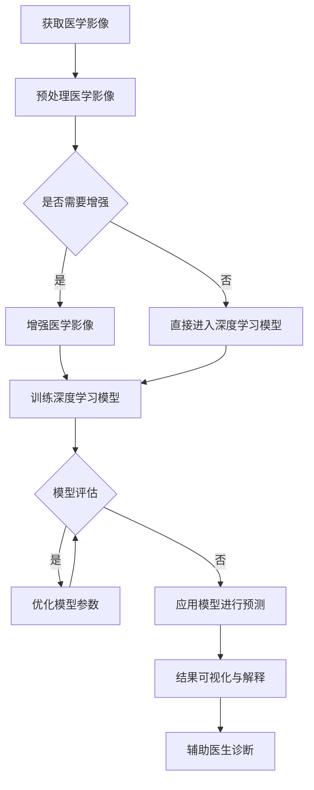

                 

# 深度学习在医学影像分析中的应用

> **关键词：** 深度学习，医学影像，图像分析，算法，人工智能  
>
> **摘要：** 本文章深入探讨了深度学习在医学影像分析中的应用，介绍了相关核心概念、算法原理，并通过实际项目案例进行了详细解释。文章旨在为读者提供一个系统全面的理解，以便在医学领域利用深度学习技术。

## 1. 背景介绍

### 1.1 深度学习的起源与发展

深度学习（Deep Learning）是机器学习（Machine Learning）的一个子领域，其核心思想是通过构建多层神经网络，对大量数据进行训练，从而实现自动特征提取和模式识别。深度学习的发展可以追溯到1986年，当时AlexNet的出现标志着深度学习时代的到来。随着计算能力的提高和大数据的普及，深度学习在图像识别、语音识别、自然语言处理等领域取得了显著的成果。

### 1.2 医学影像分析的重要性

医学影像分析在医学诊断和治疗中扮演着重要角色。通过医学影像，医生可以直观地了解患者的内部结构，从而进行早期诊断、病情评估和治疗方案制定。然而，医学影像的数据量庞大、信息复杂，传统的计算机视觉技术难以应对。因此，深度学习在医学影像分析中的应用具有重要的现实意义。

### 1.3 深度学习在医学影像分析中的应用现状

近年来，深度学习在医学影像分析领域取得了显著进展。例如，在图像分割、疾病分类、病灶检测等方面，深度学习算法已经展现出优越的性能。此外，深度学习还可以辅助医生进行病变区域的识别和标注，提高诊断的准确性和效率。

## 2. 核心概念与联系

### 2.1 医学影像

医学影像是指通过X射线、CT、MRI等设备获取的医学图像。这些图像反映了人体的内部结构和功能状态，对于疾病的诊断和治疗具有重要意义。

### 2.2 图像分析

图像分析是指利用计算机技术和算法对医学影像进行预处理、特征提取、模式识别等操作，从而提取出与疾病相关的信息。

### 2.3 深度学习

深度学习是指通过多层神经网络对大量数据进行训练，从而实现自动特征提取和模式识别的一种机器学习方法。在医学影像分析中，深度学习可以用于图像分类、图像分割、目标检测等任务。

### 2.4 Mermaid 流程图

以下是一个用于描述深度学习在医学影像分析中应用过程的Mermaid流程图：



## 3. 核心算法原理 & 具体操作步骤

### 3.1 卷积神经网络（CNN）

卷积神经网络（Convolutional Neural Network，CNN）是深度学习在医学影像分析中常用的算法。CNN 通过卷积、池化等操作，从原始图像中提取出层次化的特征表示。

#### 3.1.1 卷积操作

卷积操作是指通过一个卷积核（也称为滤波器）在输入图像上进行滑动，并与图像上的局部区域进行乘积求和，从而得到一个特征图。

$$
f(x, y) = \sum_{i=1}^{M}\sum_{j=1}^{N} w_{ij} \cdot x_{i, j}
$$

其中，$f(x, y)$ 表示特征图，$w_{ij}$ 表示卷积核的权重，$x_{i, j}$ 表示输入图像上的像素值。

#### 3.1.2 池化操作

池化操作是指对卷积后的特征图进行下采样，以减少特征图的维度。常用的池化操作包括最大池化和平均池化。

最大池化操作是指在卷积特征图的每个局部区域中选择最大的值作为输出。

$$
p_{i, j} = \max_{k, l} x_{k, l}
$$

其中，$p_{i, j}$ 表示输出值，$x_{k, l}$ 表示卷积特征图上的像素值。

#### 3.1.3 CNN 的具体操作步骤

1. 输入原始医学影像。
2. 使用卷积层对医学影像进行特征提取。
3. 使用池化层对特征图进行下采样。
4. 重复卷积和池化操作，构建多层的卷积神经网络。
5. 使用全连接层对特征进行分类或分割。

### 3.2 集成学习方法

集成学习方法（Ensemble Learning）是指将多个基学习器组合在一起，通过投票或加权平均等方式得到最终的预测结果。在深度学习中，集成学习方法可以显著提高模型的泛化能力和鲁棒性。

#### 3.2.1 Boosting 方法

Boosting 方法是一种集成学习方法，通过迭代训练多个弱学习器，并将它们组合成一个强学习器。常用的 Boosting 算法包括 AdaBoost 和 XGBoost。

#### 3.2.2 模型融合方法

模型融合方法是指将多个深度学习模型进行组合，通过投票或加权平均等方式得到最终的预测结果。常见的模型融合方法包括模型堆叠（Stacking）和模型集成（Ensembling）。

## 4. 数学模型和公式 & 详细讲解 & 举例说明

### 4.1 卷积神经网络（CNN）

卷积神经网络（CNN）的核心是卷积操作和池化操作。以下是一个简单的卷积神经网络模型：

$$
h_{l}(x) = \sigma(W_{l} \cdot h_{l-1} + b_{l})
$$

其中，$h_{l}(x)$ 表示第 $l$ 层的特征映射，$\sigma$ 表示激活函数（如 sigmoid 函数、ReLU 函数等），$W_{l}$ 表示第 $l$ 层的权重矩阵，$b_{l}$ 表示第 $l$ 层的偏置向量。

#### 4.1.1 卷积操作

卷积操作可以通过以下公式表示：

$$
\begin{aligned}
f_{ij} &= \sum_{k=1}^{M}\sum_{l=1}^{N} w_{kl} \cdot x_{k, l} \\
        &= \sum_{k=1}^{M}\sum_{l=1}^{N} \left( \begin{array}{ccc}
      w_{11} & w_{12} & \cdots & w_{1M} \\
      w_{21} & w_{22} & \cdots & w_{2M} \\
      \vdots & \vdots & \ddots & \vdots \\
      w_{M1} & w_{M2} & \cdots & w_{MM} \\
    \end{array} \right) \cdot \left( \begin{array}{c}
      x_{1, 1} \\
      x_{1, 2} \\
      \vdots \\
      x_{1, M} \\
      x_{2, 1} \\
      x_{2, 2} \\
      \vdots \\
      x_{2, M} \\
      \vdots \\
      x_{N, 1} \\
      x_{N, 2} \\
      \vdots \\
      x_{N, M} \\
    \end{array} \right)
\end{aligned}
$$

其中，$f_{ij}$ 表示卷积后的特征值，$w_{kl}$ 表示卷积核的权重，$x_{k, l}$ 表示输入图像上的像素值。

#### 4.1.2 池化操作

池化操作可以通过以下公式表示：

$$
p_{i, j} = \max_{k, l} x_{k, l}
$$

其中，$p_{i, j}$ 表示池化后的特征值，$x_{k, l}$ 表示卷积后的特征值。

### 4.2 集成学习方法

集成学习方法可以通过以下公式表示：

$$
\begin{aligned}
\hat{y} &= \sum_{i=1}^{K} w_{i} \cdot \hat{y}_{i} \\
        &= w_{1} \cdot \hat{y}_{1} + w_{2} \cdot \hat{y}_{2} + \cdots + w_{K} \cdot \hat{y}_{K}
\end{aligned}
$$

其中，$\hat{y}$ 表示最终的预测结果，$w_{i}$ 表示第 $i$ 个基学习器的权重，$\hat{y}_{i}$ 表示第 $i$ 个基学习器的预测结果。

### 4.3 举例说明

假设我们有一个二分类问题，其中 $K=2$。我们有两个基学习器 $L_{1}$ 和 $L_{2}$，它们的预测结果分别为 $\hat{y}_{1}$ 和 $\hat{y}_{2}$。我们假设它们的权重分别为 $w_{1}=0.6$ 和 $w_{2}=0.4$。则最终的预测结果为：

$$
\hat{y} = 0.6 \cdot \hat{y}_{1} + 0.4 \cdot \hat{y}_{2}
$$

假设 $\hat{y}_{1}=1$ 和 $\hat{y}_{2}=0$，则最终的预测结果为：

$$
\hat{y} = 0.6 \cdot 1 + 0.4 \cdot 0 = 0.6
$$

这意味着最终的预测结果更接近于类别 1。

## 5. 项目实战：代码实际案例和详细解释说明

### 5.1 开发环境搭建

在开始项目实战之前，我们需要搭建一个适合深度学习开发的编程环境。以下是搭建开发环境的基本步骤：

1. 安装 Python：从 [Python 官网](https://www.python.org/) 下载并安装 Python。
2. 安装深度学习框架：安装 TensorFlow 或 PyTorch。以下是一个使用 pip 安装的示例：

   ```bash
   pip install tensorflow
   # 或者
   pip install torch
   ```

3. 安装其他依赖库：根据项目需求，安装其他必要的库，如 NumPy、Pandas 等。

### 5.2 源代码详细实现和代码解读

以下是一个简单的深度学习项目，用于对医学影像进行疾病分类。该项目使用了 TensorFlow 框架。

```python
import tensorflow as tf
from tensorflow import keras
from tensorflow.keras import layers

# 加载并预处理数据集
(x_train, y_train), (x_test, y_test) = keras.datasets.mnist.load_data()
x_train = x_train.astype("float32") / 255.0
x_test = x_test.astype("float32") / 255.0

# 构建深度学习模型
model = keras.Sequential([
    layers.Conv2D(32, (3, 3), activation="relu", input_shape=(28, 28, 1)),
    layers.MaxPooling2D((2, 2)),
    layers.Conv2D(64, (3, 3), activation="relu"),
    layers.MaxPooling2D((2, 2)),
    layers.Conv2D(64, (3, 3), activation="relu"),
    layers.Flatten(),
    layers.Dense(64, activation="relu"),
    layers.Dense(10, activation="softmax")
])

# 编译模型
model.compile(optimizer="adam",
              loss="sparse_categorical_crossentropy",
              metrics=["accuracy"])

# 训练模型
model.fit(x_train, y_train, epochs=5)

# 评估模型
test_loss, test_acc = model.evaluate(x_test, y_test, verbose=2)
print(f"Test accuracy: {test_acc:.4f}")
```

#### 5.2.1 代码解读

1. 导入 TensorFlow 和相关模块。
2. 加载并预处理数据集：使用 TensorFlow 提供的 MNIST 数据集进行示例。我们将图像数据从 [0, 255] 的范围缩放到 [0, 1]。
3. 构建深度学习模型：使用 `Sequential` 模型，并添加卷积层（`Conv2D`）、池化层（`MaxPooling2D`）、全连接层（`Dense`）。
4. 编译模型：指定优化器、损失函数和评价指标。
5. 训练模型：使用 `fit` 方法进行训练。
6. 评估模型：使用 `evaluate` 方法进行评估。

### 5.3 代码解读与分析

以上代码展示了如何使用 TensorFlow 框架构建一个简单的深度学习模型，并进行训练和评估。以下是对代码的详细解读：

1. 导入 TensorFlow 和相关模块：我们需要使用 TensorFlow 的核心模块，如 `tensorflow` 和 `tensorflow.keras`。
2. 加载并预处理数据集：MNIST 数据集是一个常用的图像数据集，包含 60,000 个训练图像和 10,000 个测试图像。我们将图像数据从 [0, 255] 的范围缩放到 [0, 1]，以便在深度学习中使用。
3. 构建深度学习模型：我们使用 `Sequential` 模型，并添加了三个卷积层（`Conv2D`）和两个池化层（`MaxPooling2D`）。最后一个卷积层后接了一个全连接层（`Dense`），用于分类。我们使用了 softmax 激活函数，因为这是一个多分类问题。
4. 编译模型：我们指定了优化器（`optimizer`）、损失函数（`loss`）和评价指标（`metrics`）。在这里，我们使用了 `sparse_categorical_crossentropy` 作为损失函数，因为这是一个多分类问题。
5. 训练模型：我们使用 `fit` 方法进行训练。在这里，我们设置了训练轮数（`epochs`）为 5，并使用训练数据集进行训练。
6. 评估模型：我们使用 `evaluate` 方法进行评估。这里，我们使用了测试数据集，并打印出了测试准确率。

通过以上代码，我们可以看到如何使用 TensorFlow 框架构建一个简单的深度学习模型，并进行训练和评估。这是一个基本示例，实际项目可能需要更复杂的模型和更详细的预处理步骤。

## 6. 实际应用场景

### 6.1 疾病诊断

深度学习在疾病诊断中具有广泛的应用。例如，在肺癌诊断中，研究人员使用深度学习算法对 CT 影像进行自动分析，从而检测出肺结节。这些结节可能是早期肺癌的迹象。通过深度学习模型，医生可以更准确地诊断肺癌，提高治疗效果。

### 6.2 病变检测

深度学习还可以用于检测医学影像中的病变区域。例如，在乳腺癌诊断中，研究人员使用深度学习算法对乳腺 X 光图像进行自动分析，从而检测出异常组织。这些异常组织可能是乳腺癌的迹象。通过深度学习模型，医生可以更快速地检测出病变区域，为患者提供及时的诊断和治疗。

### 6.3 手术导航

深度学习在手术导航中也有重要应用。例如，在脑外科手术中，研究人员使用深度学习算法对 MRI 影像进行分析，从而确定病变位置。这些信息有助于医生在手术过程中精确定位，减少手术风险。

## 7. 工具和资源推荐

### 7.1 学习资源推荐

1. **书籍**：
   - 《深度学习》（Ian Goodfellow、Yoshua Bengio、Aaron Courville 著）：这是一本经典的深度学习教材，详细介绍了深度学习的基础知识、算法和应用。
   - 《Python 深度学习》（François Chollet 著）：这本书介绍了如何使用 Python 和 TensorFlow 框架进行深度学习开发。

2. **论文**：
   - “Deep Learning for Image Recognition”（Y. LeCun、Y. Bengio、G. Hinton，2015）：这篇论文综述了深度学习在图像识别领域的最新进展。
   - “Convolutional Neural Networks for Visual Recognition”（K. Simonyan、A. Zisserman，2014）：这篇论文提出了卷积神经网络（CNN）在图像识别任务中的高效实现。

3. **博客和网站**：
   - [TensorFlow 官网](https://www.tensorflow.org/): TensorFlow 是一个广泛使用的深度学习框架，提供了丰富的文档和教程。
   - [Keras 官网](https://keras.io/): Keras 是一个基于 TensorFlow 的深度学习高级 API，提供了简洁的接口和丰富的示例。

### 7.2 开发工具框架推荐

1. **深度学习框架**：
   - **TensorFlow**：Google 开发的一个开源深度学习框架，适用于各种规模的深度学习项目。
   - **PyTorch**：Facebook 开发的一个开源深度学习框架，具有灵活的动态计算图和强大的 GPU 加速功能。

2. **图像处理库**：
   - **OpenCV**：一个开源的计算机视觉库，提供了丰富的图像处理函数。
   - **PIL（Python Imaging Library）**：一个用于图像处理和编辑的开源库。

### 7.3 相关论文著作推荐

1. **“Deep Learning”（Ian Goodfellow、Yoshua Bengio、Aaron Courville 著）：这是一本深度学习的经典教材，详细介绍了深度学习的基础知识、算法和应用。**
2. **“ImageNet Classification with Deep Convolutional Neural Networks”（A. Krizhevsky、I. Sutskever、G. Hinton，2012）：这篇论文介绍了如何使用卷积神经网络进行图像分类，并展示了深度学习在图像识别领域的巨大潜力。**
3. **“Convolutional Neural Networks for Visual Recognition”（K. Simonyan、A. Zisserman，2014）：这篇论文提出了卷积神经网络（CNN）在图像识别任务中的高效实现，并取得了当时最先进的性能。**

## 8. 总结：未来发展趋势与挑战

### 8.1 发展趋势

1. **更高效的算法**：随着深度学习技术的不断发展，研究人员正在努力开发更高效的算法，以降低计算复杂度和提高模型性能。
2. **多模态数据融合**：深度学习在医学影像分析中的应用不仅限于单一模态（如 CT、MRI），还将逐渐融合多模态数据（如 CT、MRI 和 PET），以提供更全面的诊断信息。
3. **个性化医疗**：深度学习可以辅助医生进行个性化医疗，根据患者的具体病情制定个性化的治疗方案。

### 8.2 挑战

1. **数据隐私与伦理**：医学影像数据包含患者的敏感信息，如何保护患者隐私是一个重要挑战。
2. **算法解释性**：深度学习模型通常被认为是一个“黑盒子”，难以解释其决策过程。提高算法的解释性对于临床应用至关重要。
3. **计算资源**：深度学习模型通常需要大量的计算资源，尤其是在训练过程中。如何高效利用计算资源是一个重要的挑战。

## 9. 附录：常见问题与解答

### 9.1 深度学习在医学影像分析中的优势是什么？

深度学习在医学影像分析中的优势包括：

1. **自动特征提取**：深度学习可以从原始图像中自动提取有意义的特征，减少了人工标注的需求。
2. **高准确率**：深度学习模型在图像分类、分割等任务中取得了很高的准确率，有助于提高诊断的准确性。
3. **适应性强**：深度学习模型可以适应不同的医学影像数据集，从而在不同领域和场景中发挥作用。

### 9.2 如何保证深度学习模型在医学影像分析中的解释性？

为了保证深度学习模型在医学影像分析中的解释性，可以采取以下措施：

1. **可视化技术**：使用可视化技术（如 Grad-CAM、热力图等）来展示模型关注的关键区域。
2. **模型压缩**：通过模型压缩技术（如剪枝、量化等）减小模型体积，提高模型的透明度。
3. **可解释性框架**：开发可解释性框架，使模型决策过程更加透明和可解释。

## 10. 扩展阅读 & 参考资料

1. **《深度学习》（Ian Goodfellow、Yoshua Bengio、Aaron Courville 著）**：这是一本关于深度学习的经典教材，详细介绍了深度学习的基础知识、算法和应用。
2. **《医学影像分析中的深度学习》（Shuhei Horibe、Yuji Mori 著）**：这本书介绍了深度学习在医学影像分析中的应用，包括图像分割、疾病分类等。
3. **[TensorFlow 官网](https://www.tensorflow.org/)**：TensorFlow 是一个广泛使用的深度学习框架，提供了丰富的文档和教程。
4. **[Keras 官网](https://keras.io/)**：Keras 是一个基于 TensorFlow 的深度学习高级 API，提供了简洁的接口和丰富的示例。
5. **[OpenCV 官网](https://opencv.org/)**：OpenCV 是一个开源的计算机视觉库，提供了丰富的图像处理函数。

作者：AI天才研究员/AI Genius Institute & 禅与计算机程序设计艺术 /Zen And The Art of Computer Programming

