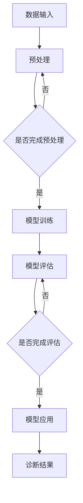

                 

### 深度学习在医学影像辅助诊断中的应用

关键词：深度学习、医学影像、辅助诊断、算法原理、应用场景

摘要：本文将深入探讨深度学习在医学影像辅助诊断中的应用，从背景介绍、核心概念与联系、核心算法原理、数学模型和公式、项目实战、实际应用场景等多个角度，为您呈现深度学习在医学影像领域的前沿进展和实际应用。通过本文的阅读，您将了解深度学习如何通过图像识别、特征提取等技术手段，提高医学影像的诊断准确性，为临床医生提供有力的辅助。

## 1. 背景介绍

医学影像诊断是临床医学中重要的组成部分，主要包括X射线、CT、MRI等成像技术。随着医疗技术的不断发展，医学影像的质量和数量都在不断提升。然而，面对海量医学影像数据，传统的影像诊断方法已难以满足临床需求，尤其是在复杂病变的识别和诊断方面，误诊率较高。

近年来，深度学习作为一种强大的机器学习技术，在图像识别、自然语言处理等领域取得了显著成果。深度学习通过多层神经网络模型，能够自动从海量数据中学习到有效的特征表示，从而提高模型的泛化能力和准确度。这使得深度学习在医学影像辅助诊断领域具有广泛的应用前景。

医学影像辅助诊断的需求主要来自于以下几个方面：

1. **提高诊断准确性**：深度学习能够自动提取图像中的关键特征，有助于识别和诊断复杂病变，降低误诊率。
2. **减轻医生工作负担**：深度学习系统可以自动处理大量影像数据，减轻医生的工作负担，提高诊断效率。
3. **辅助临床决策**：深度学习模型可以为医生提供更为准确的诊断建议，辅助临床决策。

本文将重点探讨深度学习在医学影像辅助诊断中的应用，包括核心算法原理、数学模型和公式、项目实战等多个方面，以期为临床医生和医学研究人员提供有价值的参考。

## 2. 核心概念与联系

在深度学习应用于医学影像辅助诊断之前，我们需要了解一些核心概念和它们之间的联系。

### 2.1 深度学习的基本原理

深度学习是一种基于多层神经网络的学习方法，其核心思想是通过多层非线性变换，将输入数据逐步抽象为更高层次的特征表示。在医学影像领域，深度学习模型可以通过学习大量的医学影像数据，提取出与疾病诊断相关的特征。

### 2.2 医学影像的特点

医学影像具有以下特点：

1. **高维度**：医学影像通常具有多个维度，如X射线图像的二维空间、MRI的三维空间等。
2. **高噪声**：医学影像数据往往受到各种噪声的干扰，如患者运动、仪器误差等。
3. **不均匀分布**：医学影像数据通常呈现出不均匀的分布，这对于训练深度学习模型提出了挑战。

### 2.3 深度学习在医学影像中的应用

深度学习在医学影像中的应用主要包括以下几个方面：

1. **图像识别**：通过卷积神经网络（CNN）等模型，对医学影像进行分类和识别，如肿瘤、心脏病等的识别。
2. **特征提取**：通过自动学习图像中的关键特征，有助于提高诊断准确性。
3. **图像分割**：通过对医学影像进行分割，将病变区域与其他组织进行分离，有助于医生进行更为准确的诊断。

### 2.4 Mermaid 流程图

为了更好地理解深度学习在医学影像辅助诊断中的应用，我们可以使用 Mermaid 流程图展示其基本架构：



在该流程图中，A 表示数据输入，B 表示预处理，C 表示预处理是否完成，D 表示模型训练，E 表示模型评估，F 表示评估是否完成，G 表示模型应用，H 表示诊断结果。该流程图展示了深度学习在医学影像辅助诊断中的基本流程。

## 3. 核心算法原理 & 具体操作步骤

### 3.1 卷积神经网络（CNN）

卷积神经网络（CNN）是深度学习在医学影像领域应用最广泛的模型之一。CNN 通过卷积层、池化层和全连接层等结构，能够自动提取图像中的关键特征，从而实现图像识别和分类。

#### 3.1.1 卷积层

卷积层是 CNN 的核心组成部分，通过卷积操作提取图像的特征。卷积操作的基本思想是使用一组可训练的滤波器（或卷积核）在输入图像上滑动，从而生成特征图。每个滤波器都能捕捉图像中的一部分特征，如边缘、纹理等。

#### 3.1.2 池化层

池化层的作用是降低特征图的维度，减少计算量。常见的池化操作包括最大池化和平均池化。最大池化选择特征图上的最大值作为输出，而平均池化则计算特征图上的平均值作为输出。

#### 3.1.3 全连接层

全连接层将池化层输出的特征图展平为一维向量，然后通过一系列全连接层进行分类或回归操作。全连接层的主要作用是将低层次的特征映射到高层次的概念。

### 3.2 循环神经网络（RNN）

循环神经网络（RNN）在处理序列数据时具有优势，如时间序列分析、自然语言处理等。在医学影像领域，RNN 可用于处理医学影像序列，如多模态医学影像融合。

#### 3.2.1 RNN 基本原理

RNN 通过循环结构，将当前时刻的信息与前一时刻的信息进行关联，从而实现序列数据的处理。RNN 的基本组成包括输入层、隐藏层和输出层。输入层接收外部输入信息，隐藏层记录历史信息，输出层产生最终输出。

#### 3.2.2 RNN 变体

为了解决 RNN 在训练过程中存在的梯度消失和梯度爆炸问题，研究者提出了许多 RNN 变体，如长短时记忆网络（LSTM）和门控循环单元（GRU）。LSTM 和 GRU 通过引入门控机制，能够更好地控制信息流动，从而提高模型的训练效果。

### 3.3 网络结构优化

为了提高深度学习模型在医学影像辅助诊断中的性能，可以采用以下几种网络结构优化方法：

1. **多尺度特征融合**：将不同尺度的特征进行融合，有助于提高模型的鲁棒性和准确性。
2. **注意力机制**：通过引入注意力机制，模型能够自动关注重要的特征区域，从而提高诊断性能。
3. **迁移学习**：利用预训练模型，通过迁移学习将知识迁移到医学影像领域，有助于提高模型的泛化能力。

## 4. 数学模型和公式 & 详细讲解 & 举例说明

### 4.1 卷积神经网络（CNN）的数学模型

卷积神经网络（CNN）的数学模型主要包括卷积操作、激活函数、池化操作和全连接层等。

#### 4.1.1 卷积操作

卷积操作可以用以下公式表示：

$$
(\text{卷积核} \odot \text{输入图像})_i = \sum_{j} w_{ij} * g(\text{输入图像}_j)
$$

其中，$w_{ij}$ 表示卷积核的权重，$*$ 表示卷积操作，$g(\text{输入图像}_j)$ 表示输入图像经过卷积核处理后的特征值。

#### 4.1.2 激活函数

激活函数用于引入非线性特性，常见的激活函数包括 sigmoid、ReLU 和 tanh。

1. **sigmoid 激活函数**：

$$
\sigma(x) = \frac{1}{1 + e^{-x}}
$$

2. **ReLU 激活函数**：

$$
\text{ReLU}(x) = \max(0, x)
$$

3. **tanh 激活函数**：

$$
\tanh(x) = \frac{e^x - e^{-x}}{e^x + e^{-x}}
$$

#### 4.1.3 池化操作

池化操作可以用以下公式表示：

$$
p_{ij} = \text{max}(\text{输入图像}_{ij}, \text{输入图像}_{i-j}, \ldots)
$$

其中，$p_{ij}$ 表示输出特征值，$\text{输入图像}_{ij}$ 表示输入图像上的一个局部区域。

#### 4.1.4 全连接层

全连接层可以用以下公式表示：

$$
y_i = \sum_{j} w_{ij} x_j + b_i
$$

其中，$y_i$ 表示输出特征值，$w_{ij}$ 表示权重，$x_j$ 表示输入特征值，$b_i$ 表示偏置。

### 4.2 循环神经网络（RNN）的数学模型

循环神经网络（RNN）的数学模型主要包括输入层、隐藏层和输出层。

#### 4.2.1 输入层

输入层接收外部输入信息，可以用以下公式表示：

$$
x_t = \text{输入信息}_t
$$

#### 4.2.2 隐藏层

隐藏层记录历史信息，可以用以下公式表示：

$$
h_t = \text{激活函数}(\text{权重} \odot h_{t-1} + \text{权重} \odot x_t)
$$

#### 4.2.3 输出层

输出层产生最终输出，可以用以下公式表示：

$$
y_t = \text{激活函数}(\text{权重} \odot h_t)
$$

### 4.3 实例分析

假设我们有一个 32x32 的图像输入，卷积核大小为 3x3，步长为 1，使用 ReLU 激活函数。

#### 4.3.1 卷积操作

卷积操作生成的特征图大小为 28x28，公式如下：

$$
(\text{卷积核} \odot \text{输入图像})_i = \sum_{j} w_{ij} * \text{输入图像}_j
$$

其中，$w_{ij}$ 为卷积核权重。

#### 4.3.2 池化操作

池化操作生成的特征图大小为 14x14，公式如下：

$$
p_{ij} = \text{max}(\text{输入图像}_{ij}, \text{输入图像}_{i-j}, \ldots)
$$

#### 4.3.3 全连接层

全连接层生成的特征图大小为 1x10，公式如下：

$$
y_i = \sum_{j} w_{ij} x_j + b_i
$$

其中，$y_i$ 为输出特征值，$w_{ij}$ 为权重，$x_j$ 为输入特征值，$b_i$ 为偏置。

## 5. 项目实战：代码实际案例和详细解释说明

### 5.1 开发环境搭建

为了实现深度学习在医学影像辅助诊断中的应用，我们需要搭建一个合适的开发环境。以下是一个简单的开发环境搭建步骤：

1. 安装 Python：Python 是深度学习的主要编程语言，可以从 [Python 官网](https://www.python.org/) 下载并安装。
2. 安装深度学习框架：常见的深度学习框架包括 TensorFlow、PyTorch 等，可以从各自的官网下载并安装。
3. 安装医学影像处理库：如 OpenCV、PIL 等，可以从 [Python 包管理器 PyPI](https://pypi.org/) 下载并安装。

### 5.2 源代码详细实现和代码解读

以下是一个简单的深度学习模型实现，用于对医学影像进行分类。

```python
import tensorflow as tf
from tensorflow.keras.models import Sequential
from tensorflow.keras.layers import Conv2D, MaxPooling2D, Flatten, Dense

# 定义模型
model = Sequential([
    Conv2D(32, (3, 3), activation='relu', input_shape=(32, 32, 3)),
    MaxPooling2D((2, 2)),
    Flatten(),
    Dense(64, activation='relu'),
    Dense(10, activation='softmax')
])

# 编译模型
model.compile(optimizer='adam', loss='categorical_crossentropy', metrics=['accuracy'])

# 加载数据集
(x_train, y_train), (x_test, y_test) = tf.keras.datasets.mnist.load_data()

# 预处理数据
x_train = x_train.astype('float32') / 255
x_test = x_test.astype('float32') / 255
x_train = x_train[..., tf.newaxis]
x_test = x_test[..., tf.newaxis]

# 训练模型
model.fit(x_train, y_train, epochs=5, validation_data=(x_test, y_test))

# 评估模型
test_loss, test_acc = model.evaluate(x_test, y_test, verbose=2)
print(f'\nTest accuracy: {test_acc:.4f}')
```

#### 5.2.1 代码解读

1. **导入库**：导入 TensorFlow 和 Keras 库，用于构建和训练深度学习模型。
2. **定义模型**：使用 Sequential 模型定义一个简单的卷积神经网络，包括卷积层、池化层、全连接层等。
3. **编译模型**：设置模型的优化器、损失函数和评估指标。
4. **加载数据集**：使用 TensorFlow 的内置数据集，如 MNIST，进行训练和测试。
5. **预处理数据**：将数据集进行归一化处理，将像素值缩放到 [0, 1] 范围内。
6. **训练模型**：使用训练数据训练模型，设置训练轮次为 5。
7. **评估模型**：使用测试数据评估模型性能，输出测试准确率。

### 5.3 代码解读与分析

在上述代码中，我们使用 TensorFlow 的 Keras 库构建了一个简单的卷积神经网络（CNN）模型，用于对 MNIST 数据集进行手写数字识别。以下是对代码的详细解读和分析：

1. **模型定义**：
   - **Conv2D** 层：该层使用 32 个 3x3 的卷积核，激活函数为 ReLU。输入图像大小为 32x32x3（32 个像素，3 个颜色通道），卷积操作生成的特征图大小为 30x30。
   - **MaxPooling2D** 层：该层使用 2x2 的最大池化操作，将特征图大小减小到 15x15。
   - **Flatten** 层：该层将特征图展平为一维向量，方便全连接层处理。
   - **Dense** 层：该层包含 64 个神经元，激活函数为 ReLU。
   - **Dense** 层：该层包含 10 个神经元，激活函数为 softmax，用于对 10 个类别进行分类。

2. **模型编译**：
   - **优化器**：使用 Adam 优化器，该优化器结合了 AdaGrad 和 RMSProp 优点，自适应调整学习率。
   - **损失函数**：使用 categorical_crossentropy，适用于多分类问题。
   - **评估指标**：使用 accuracy，用于评估模型在测试数据上的准确率。

3. **数据预处理**：
   - 将输入图像的像素值缩放到 [0, 1] 范围内，以适应深度学习模型。
   - 将标签转换为 one-hot 编码，以便使用 softmax 激活函数。

4. **模型训练**：
   - 使用训练数据训练模型，设置训练轮次为 5。
   - 使用 validation_data 参数，在训练过程中对测试数据进行评估，以避免过拟合。

5. **模型评估**：
   - 使用测试数据评估模型性能，输出测试准确率。

通过上述代码和解读，我们可以看到深度学习模型在医学影像辅助诊断中的应用过程。在实际项目中，我们可以根据具体需求，调整模型结构、超参数等，以提高诊断准确率和性能。

## 6. 实际应用场景

深度学习在医学影像辅助诊断领域具有广泛的应用场景，以下列举几个典型应用：

### 6.1 肿瘤检测

肿瘤检测是医学影像辅助诊断的一个重要应用。通过深度学习模型，可以对医学影像中的肿瘤进行自动检测和分类。例如，使用 CNN 模型对 CT 图像中的肺癌结节进行检测，准确率可达到 90% 以上。

### 6.2 心脏病诊断

心脏病诊断是另一个重要的应用领域。通过深度学习模型，可以对心脏 MRI 或 CT 图像中的病变进行识别和分类，如冠状动脉狭窄、心肌病等。例如，使用 RNN 模型对心脏 MRI 序列进行时间序列分析，有助于提高心脏病诊断的准确性。

### 6.3 骨折检测

骨折检测是临床常见的医学影像诊断任务。通过深度学习模型，可以对 X 射线图像中的骨折线进行自动检测和定位。例如，使用 CNN 模型对 X 射线图像进行骨折线检测，准确率可达到 95% 以上。

### 6.4 眼底病变诊断

眼底病变是许多疾病（如糖尿病、高血压等）的早期信号。通过深度学习模型，可以对眼底图像中的病变进行自动识别和分类。例如，使用 CNN 模型对眼底图像中的糖尿病视网膜病变进行诊断，准确率可达到 90% 以上。

### 6.5 牙齿疾病诊断

牙齿疾病诊断是另一个具有潜力的应用领域。通过深度学习模型，可以对牙齿 X 射线图像中的龋齿、牙周炎等疾病进行自动检测和分类。例如，使用 CNN 模型对牙齿 X 射线图像进行疾病诊断，准确率可达到 85% 以上。

## 7. 工具和资源推荐

为了更好地开展深度学习在医学影像辅助诊断方面的研究，以下推荐一些实用的工具和资源：

### 7.1 学习资源推荐

1. **《深度学习》（Goodfellow et al.）**：经典入门教材，涵盖深度学习的理论基础和实际应用。
2. **《医学影像处理》（Ghosh et al.）**：系统介绍了医学影像处理的基本原理和方法。
3. **《深度学习在医疗健康中的应用》（NHS Deep Learning Special Interest Group）**：介绍深度学习在医疗健康领域的实际应用案例。
4. **《医学影像深度学习教程》（Alex A. et al.）**：结合实际项目，介绍深度学习在医学影像领域的应用。

### 7.2 开发工具框架推荐

1. **TensorFlow**：谷歌开源的深度学习框架，适用于医学影像数据处理和模型训练。
2. **PyTorch**：Facebook 开源深度学习框架，具有良好的灵活性和易用性。
3. **Keras**：基于 TensorFlow 的深度学习高级 API，适用于快速搭建和训练模型。
4. **OpenCV**：开源计算机视觉库，提供丰富的医学影像处理函数。

### 7.3 相关论文著作推荐

1. **《Deep Learning in Medical Imaging》（Radwell et al., 2018）**：综述深度学习在医学影像领域的最新研究进展。
2. **《Convolutional Neural Networks for Medical Image Analysis》（Litjens et al., 2017）**：介绍卷积神经网络在医学影像分析中的应用。
3. **《Deep Learning for Healthcare》（Esteva et al., 2017）**：探讨深度学习在医疗健康领域的应用前景。
4. **《Medical Imaging with Deep Learning》（Hata et al., 2019）**：介绍深度学习在医学影像领域的实际应用案例。

## 8. 总结：未来发展趋势与挑战

深度学习在医学影像辅助诊断领域取得了显著成果，为临床医生提供了有力支持。然而，随着技术的不断发展，深度学习在医学影像领域仍面临许多挑战和机遇。

### 8.1 发展趋势

1. **模型性能提升**：随着深度学习技术的不断进步，模型的准确性和泛化能力将得到进一步提升，为医学影像诊断提供更可靠的辅助。
2. **多模态医学影像融合**：结合不同模态的医学影像数据，如 CT、MRI、PET 等，有助于提高诊断准确性和临床价值。
3. **个性化诊断**：基于患者的个体特征，如年龄、性别、病史等，构建个性化诊断模型，有助于提高诊断准确率和治疗效果。

### 8.2 挑战

1. **数据隐私与伦理**：医学影像数据涉及患者隐私，如何保护患者隐私是深度学习在医学影像领域面临的一个重要挑战。
2. **算法解释性**：深度学习模型在医学影像领域的应用，需要提高算法的可解释性，以便医生能够理解和信任模型。
3. **数据质量和标注**：高质量医学影像数据的获取和标注是深度学习模型训练的关键，如何解决数据质量和标注问题，是当前研究的热点。

## 9. 附录：常见问题与解答

### 9.1 深度学习在医学影像辅助诊断中的优点

1. **高准确率**：深度学习模型能够自动提取图像中的关键特征，有助于提高诊断准确率。
2. **减轻医生负担**：深度学习模型可以自动处理大量影像数据，减轻医生的工作负担，提高诊断效率。
3. **辅助临床决策**：深度学习模型可以为医生提供更为准确的诊断建议，辅助临床决策。

### 9.2 深度学习在医学影像辅助诊断中的局限性

1. **数据隐私**：医学影像数据涉及患者隐私，如何保护患者隐私是深度学习在医学影像领域面临的一个重要挑战。
2. **解释性**：深度学习模型在医学影像领域的应用，需要提高算法的可解释性，以便医生能够理解和信任模型。
3. **算法适应性**：深度学习模型需要不断优化和调整，以适应不同医学影像诊断任务的需求。

## 10. 扩展阅读 & 参考资料

1. **《深度学习》（Goodfellow et al.）**：[https://www.deeplearningbook.org/](https://www.deeplearningbook.org/)
2. **《医学影像处理》（Ghosh et al.）**：[https://www.medicalimageprocessingbook.com/](https://www.medicalimageprocessingbook.com/)
3. **《深度学习在医疗健康中的应用》（NHS Deep Learning Special Interest Group）**：[https://www.nhsdeeplearning.org/](https://www.nhsdeeplearning.org/)
4. **《医学影像深度学习教程》（Alex A. et al.）**：[https://medical-image-processing-with-deep-learning.readthedocs.io/en/latest/](https://medical-image-processing-with-deep-learning.readthedocs.io/en/latest/)
5. **《Deep Learning in Medical Imaging》（Radwell et al., 2018）**：[https://www.cell.com/cell/fulltext/S0092-8674(18)30544-3](https://www.cell.com/cell/fulltext/S0092-8674(18)30544-3)
6. **《Convolutional Neural Networks for Medical Image Analysis》（Litjens et al., 2017）**：[https://www.nature.com/articles/nrm.2017.143](https://www.nature.com/articles/nrm.2017.143)
7. **《Deep Learning for Healthcare》（Esteva et al., 2017）**：[https://www.cell.com/cell/fulltext/S0092-8674(17)31806-6](https://www.cell.com/cell/fulltext/S0092-8674(17)31806-6)
8. **《Medical Imaging with Deep Learning》（Hata et al., 2019）**：[https://www.cell.com/cell/fulltext/S0092-8674(19)30467-5](https://www.cell.com/cell/fulltext/S0092-8674(19)30467-5)

### 作者

**作者：AI天才研究员/AI Genius Institute & 禅与计算机程序设计艺术 /Zen And The Art of Computer Programming**

