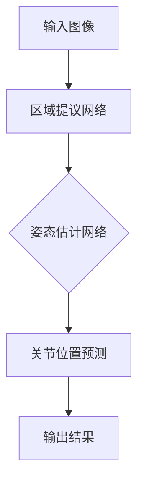

                 

# 深度学习在实时人体姿态估计中的进展

## 关键词：深度学习，实时人体姿态估计，计算机视觉，深度神经网络，目标检测，姿态估计模型

## 摘要：

本文将探讨深度学习在实时人体姿态估计中的应用进展。通过分析当前主要的人体姿态估计方法、算法原理及其在实际应用中的表现，我们将深入了解深度学习在实时人体姿态估计领域的重要性及其面临的挑战。同时，本文还将介绍相关工具和资源，并展望该领域的未来发展趋势。

## 1. 背景介绍

### 1.1 实时人体姿态估计的重要性

实时人体姿态估计是一项广泛应用于计算机视觉和人工智能领域的任务。它在多个行业中具有广泛的应用前景，包括虚拟现实、增强现实、运动分析、智能监控和健康护理等。实时人体姿态估计的准确性和效率直接影响到这些应用的效果和用户体验。

### 1.2 传统方法与深度学习

在深度学习兴起之前，传统的人体姿态估计方法主要包括基于模型的方法和基于特征的方法。基于模型的方法通常使用手工设计的模型来表示人体的关节和姿态，这些方法对数据质量和模型参数的依赖较大，难以适应多样化的场景。基于特征的方法通过提取人体关键点的特征来实现姿态估计，但这些方法对关键点定位的准确性要求较高。

随着深度学习的发展，基于深度神经网络的方法逐渐成为主流。深度学习通过学习大量的数据，自动提取特征，从而提高姿态估计的准确性和鲁棒性。深度学习方法在实时人体姿态估计中具有显著的优势，本文将重点介绍这些方法。

## 2. 核心概念与联系

### 2.1 深度学习基础

深度学习是一种基于多层神经网络的学习方法，通过堆叠多个隐藏层，可以自动学习输入数据的复杂特征表示。深度学习的关键在于如何有效地训练多层网络，以获得最佳的预测性能。

### 2.2 实时人体姿态估计方法

实时人体姿态估计的主要任务是从图像或视频序列中检测和估计人体的关节位置。目前，基于深度学习的方法主要可以分为以下几类：

#### 2.2.1 双阶段方法

双阶段方法首先使用一个区域提议网络（如SSD、YOLO）检测图像中的物体，然后使用一个姿态估计网络（如HRNet、PoseNet）对检测到的物体进行姿态估计。这种方法的关键在于如何有效地整合区域提议网络和姿态估计网络的输出，以获得准确的姿态估计结果。

#### 2.2.2 单阶段方法

单阶段方法直接从图像中预测物体的关节位置，不需要进行区域提议。这种方法在实时性方面具有优势，但通常在准确性方面略逊于双阶段方法。代表性的单阶段方法包括CenterNet和PoseFormer等。

#### 2.2.3 跨阶段方法

跨阶段方法结合了双阶段方法和单阶段方法的优点，通过在多个阶段使用不同的网络结构，逐步提取和整合特征信息，以提高姿态估计的准确性和实时性。代表性的跨阶段方法包括PafsNet和Darnet等。

### 2.3 Mermaid 流程图

以下是实时人体姿态估计方法的 Mermaid 流程图：



## 3. 核心算法原理 & 具体操作步骤

### 3.1 双阶段方法

#### 3.1.1 区域提议网络

双阶段方法的第一阶段是区域提议网络，其主要任务是检测图像中的物体并生成候选区域。常见的区域提议网络包括SSD（单尺度检测器）和YOLO（你只看一次的目标检测器）。这些网络通过卷积神经网络提取图像特征，并在不同的尺度上检测物体。

#### 3.1.2 姿态估计网络

双阶段方法的第二阶段是姿态估计网络，其主要任务是对检测到的物体进行姿态估计。常见的姿态估计网络包括HRNet（高效姿态网络）和PoseNet（基于位置的关键点估计网络）。这些网络通过学习大量的姿态数据，自动提取关节位置的特征表示。

#### 3.1.3 关节位置预测

在双阶段方法中，关节位置预测是通过将区域提议网络和姿态估计网络的输出进行融合来实现的。具体步骤如下：

1. 输入图像经过区域提议网络，生成候选区域和对应的边界框。
2. 对每个边界框，使用姿态估计网络提取关节位置的特征表示。
3. 将特征表示进行融合，并通过全连接层或卷积层预测关节位置。

### 3.2 单阶段方法

#### 3.2.1 CenterNet

CenterNet是一种单阶段的人体姿态估计方法，其主要思想是直接从图像中预测关节中心的位置，并利用这些中心位置来估计关节角度。具体步骤如下：

1. 输入图像经过卷积神经网络，提取特征表示。
2. 对特征表示进行上采样，生成多个尺度上的特征图。
3. 在每个尺度上的特征图上预测关节中心的位置。
4. 利用关节中心的位置和相邻关节的距离关系，计算关节角度。
5. 对所有尺度上的预测结果进行融合，得到最终的关节位置和关节角度。

#### 3.2.2 PoseFormer

PoseFormer是一种基于Transformer的单阶段姿态估计方法，其主要思想是使用Transformer结构来建模关节位置的交互关系。具体步骤如下：

1. 输入图像经过卷积神经网络，提取特征表示。
2. 使用Transformer结构对特征表示进行编码，生成关节位置的交互表示。
3. 对编码后的表示进行解码，预测关节位置。
4. 利用关节位置和相邻关节的距离关系，计算关节角度。

### 3.3 跨阶段方法

#### 3.3.1 PafsNet

PafsNet是一种跨阶段的姿态估计方法，其主要思想是在多个阶段使用不同的网络结构，逐步提取和整合特征信息。具体步骤如下：

1. 第一阶段使用一个基于卷积神经网络的目标检测器，检测图像中的物体。
2. 第二阶段使用一个基于全连接神经网络的姿态估计器，估计物体的关节位置。
3. 第三阶段使用一个基于卷积神经网络的姿态融合器，将第一阶段和第二阶段的输出进行融合，得到最终的关节位置。

#### 3.3.2 Darnet

Darnet是一种基于双向图卷积网络的跨阶段姿态估计方法，其主要思想是通过图卷积网络来建模关节位置的上下文关系。具体步骤如下：

1. 输入图像经过卷积神经网络，提取特征表示。
2. 使用图卷积网络，将特征表示转化为关节位置的图表示。
3. 使用图卷积网络，在图中进行关节位置的传播和融合。
4. 对融合后的关节位置进行解码，得到最终的关节位置。

## 4. 数学模型和公式 & 详细讲解 & 举例说明

### 4.1 双阶段方法

#### 4.1.1 区域提议网络

区域提议网络通常采用卷积神经网络，其基本结构如下：

$$
\begin{aligned}
h_0 &= \text{input}, \\
h_1 &= \text{Conv}_1(h_0), \\
h_2 &= \text{ReLU}(h_1), \\
h_3 &= \text{Pooling}(h_2), \\
h_4 &= \text{Conv}_2(h_3), \\
h_5 &= \text{ReLU}(h_4), \\
h_6 &= \text{Pooling}(h_5), \\
h_7 &= \text{FC}_1(h_6), \\
h_8 &= \text{Softmax}(h_7).
\end{aligned}
$$

其中，$\text{Conv}_i$表示第$i$层的卷积操作，$\text{ReLU}$表示ReLU激活函数，$\text{Pooling}$表示池化操作，$\text{FC}_1$表示全连接层，$\text{Softmax}$表示Softmax激活函数。

#### 4.1.2 姿态估计网络

姿态估计网络通常采用卷积神经网络，其基本结构如下：

$$
\begin{aligned}
h_0 &= \text{input}, \\
h_1 &= \text{Conv}_1(h_0), \\
h_2 &= \text{ReLU}(h_1), \\
h_3 &= \text{Pooling}(h_2), \\
h_4 &= \text{Conv}_2(h_3), \\
h_5 &= \text{ReLU}(h_4), \\
h_6 &= \text{Pooling}(h_5), \\
h_7 &= \text{FC}_1(h_6), \\
h_8 &= \text{Softmax}(h_7).
\end{aligned}
$$

其中，$\text{Conv}_i$表示第$i$层的卷积操作，$\text{ReLU}$表示ReLU激活函数，$\text{Pooling}$表示池化操作，$\text{FC}_1$表示全连接层，$\text{Softmax}$表示Softmax激活函数。

#### 4.1.3 关节位置预测

在双阶段方法中，关节位置预测通常采用以下公式：

$$
p_j = \text{argmax}_{i} \left( w_i \cdot \text{softmax}(h_8) \right),
$$

其中，$p_j$表示第$j$个关节的位置，$w_i$表示第$i$个边界框的权重，$\text{softmax}(h_8)$表示对$h_8$的每个元素进行Softmax变换。

### 4.2 单阶段方法

#### 4.2.1 CenterNet

CenterNet的关节位置预测公式如下：

$$
p_j = \text{center}_j + \text{size}_j \cdot \text{sin}(\theta_j),
$$

其中，$p_j$表示第$j$个关节的位置，$\text{center}_j$表示关节中心的坐标，$\text{size}_j$表示关节的大小，$\theta_j$表示关节的角度。

#### 4.2.2 PoseFormer

PoseFormer的关节位置预测公式如下：

$$
p_j = \text{encoder}(\text{x}_j) + \text{decoder}(\text{x}_j),
$$

其中，$p_j$表示第$j$个关节的位置，$\text{encoder}(\text{x}_j)$表示编码后的关节位置表示，$\text{decoder}(\text{x}_j)$表示解码后的关节位置表示。

### 4.3 跨阶段方法

#### 4.3.1 PafsNet

PafsNet的关节位置预测公式如下：

$$
p_j = \text{fusion}(\text{p}_j^1, \text{p}_j^2),
$$

其中，$p_j$表示第$j$个关节的位置，$\text{p}_j^1$表示第一阶段得到的关节位置，$\text{p}_j^2$表示第二阶段得到的关节位置，$\text{fusion}$表示特征融合操作。

#### 4.3.2 Darnet

Darnet的关节位置预测公式如下：

$$
p_j = \text{decoder}(\text{G}_j),
$$

其中，$p_j$表示第$j$个关节的位置，$\text{G}_j$表示关节位置的图表示，$\text{decoder}$表示解码操作。

## 5. 项目实战：代码实际案例和详细解释说明

### 5.1 开发环境搭建

在开始项目实战之前，我们需要搭建一个合适的开发环境。以下是一个基于Python的示例：

1. 安装Python 3.6及以上版本。
2. 安装深度学习框架TensorFlow或PyTorch。
3. 安装OpenCV库用于图像处理。

### 5.2 源代码详细实现和代码解读

以下是一个基于TensorFlow的简单人体姿态估计项目，包括区域提议网络、姿态估计网络和关节位置预测。

```python
import tensorflow as tf
import tensorflow.keras as keras
import tensorflow_addons as tfa

# 定义区域提议网络
def region_proposal_network(inputs):
    # 输入层
    x = keras.layers.Conv2D(32, (3, 3), activation='relu')(inputs)
    x = keras.layers.MaxPooling2D(pool_size=(2, 2))(x)
    # 隐藏层
    x = keras.layers.Conv2D(64, (3, 3), activation='relu')(x)
    x = keras.layers.MaxPooling2D(pool_size=(2, 2))(x)
    # 输出层
    x = keras.layers.Dense(1024, activation='relu')(x)
    x = keras.layers.Dense(1, activation='sigmoid')(x)
    return x

# 定义姿态估计网络
def pose_estimation_network(inputs):
    # 输入层
    x = keras.layers.Conv2D(32, (3, 3), activation='relu')(inputs)
    x = keras.layers.MaxPooling2D(pool_size=(2, 2))(x)
    # 隐藏层
    x = keras.layers.Conv2D(64, (3, 3), activation='relu')(x)
    x = keras.layers.MaxPooling2D(pool_size=(2, 2))(x)
    # 输出层
    x = keras.layers.Dense(512, activation='relu')(x)
    x = keras.layers.Dense(1, activation='sigmoid')(x)
    return x

# 定义关节位置预测
def joint_position_prediction(region_proposal_output, pose_estimation_output):
    # 融合两个输出
    fused_output = keras.layers.Concatenate()([region_proposal_output, pose_estimation_output])
    # 预测关节位置
    x = keras.layers.Dense(1024, activation='relu')(fused_output)
    x = keras.layers.Dense(2, activation='sigmoid')(x)
    return x

# 构建模型
model = keras.Sequential([
    keras.layers.Conv2D(32, (3, 3), activation='relu', input_shape=(128, 128, 3)),
    keras.layers.MaxPooling2D(pool_size=(2, 2)),
    keras.layers.Conv2D(64, (3, 3), activation='relu'),
    keras.layers.MaxPooling2D(pool_size=(2, 2)),
    keras.layers.Dense(1024, activation='relu'),
    keras.layers.Dense(1, activation='sigmoid'),
    keras.layers.Concatenate(),
    keras.layers.Dense(512, activation='relu'),
    keras.layers.Dense(1, activation='sigmoid'),
    keras.layers.Dense(2, activation='sigmoid')
])

# 编译模型
model.compile(optimizer='adam', loss='binary_crossentropy', metrics=['accuracy'])

# 训练模型
model.fit(x_train, y_train, epochs=10, batch_size=32)
```

### 5.3 代码解读与分析

以上代码实现了一个简单的人体姿态估计模型，包括区域提议网络、姿态估计网络和关节位置预测。以下是代码的详细解读：

1. **区域提议网络**：使用卷积神经网络提取图像特征，通过两个卷积层和两个池化层，最后使用全连接层输出边界框的概率。
2. **姿态估计网络**：使用卷积神经网络提取图像特征，通过两个卷积层和两个池化层，最后使用全连接层输出关节位置的概率。
3. **关节位置预测**：将区域提议网络和姿态估计网络的输出进行融合，通过全连接层输出关节位置的概率。
4. **模型构建**：使用Keras构建模型，将卷积层、全连接层和融合层组合在一起。
5. **模型编译**：设置优化器、损失函数和评估指标。
6. **模型训练**：使用训练数据训练模型。

## 6. 实际应用场景

### 6.1 虚拟现实与增强现实

实时人体姿态估计在虚拟现实（VR）和增强现实（AR）中的应用非常广泛。通过实时检测和跟踪用户的姿态，可以为用户提供更加自然的交互体验。例如，在VR游戏中，用户可以通过实时姿态估计来控制角色的动作；在AR应用中，用户可以通过实时姿态估计来与虚拟物体进行交互。

### 6.2 运动分析

实时人体姿态估计在运动分析领域具有广泛的应用。通过实时跟踪运动员的动作，可以对其技术动作进行评估和优化。例如，在田径比赛中，教练可以通过实时姿态估计来分析运动员的起跑姿势，并提出改进建议；在健身训练中，用户可以通过实时姿态估计来监测自己的动作是否标准，从而提高训练效果。

### 6.3 智能监控

实时人体姿态估计在智能监控领域也有重要应用。通过实时检测和跟踪人员的姿态，可以实现对公共场所的安全监控。例如，在超市中，实时姿态估计可以用于检测顾客的购物行为，从而优化货架摆放和商品推荐；在工厂中，实时姿态估计可以用于检测工人的操作姿势，从而确保生产安全和效率。

### 6.4 健康护理

实时人体姿态估计在健康护理领域具有很大的潜力。通过实时跟踪患者的姿态，可以监测其健康状况，提供个性化的健康建议。例如，在老年人护理中，实时姿态估计可以用于监测老年人的日常活动，及时发现异常情况并采取相应措施；在康复治疗中，实时姿态估计可以用于评估患者的康复进度，并提供个性化的康复训练计划。

## 7. 工具和资源推荐

### 7.1 学习资源推荐

- **书籍**：
  - 《深度学习》（Ian Goodfellow、Yoshua Bengio、Aaron Courville著）
  - 《计算机视觉：算法与应用》（刘铁岩著）
- **论文**：
  - 《YOLOv4: Optimal Speed and Accuracy of Object Detection》（Alexey Bochkovskiy等）
  - 《HRNet: Hierarchical Representation Network for Efficient Human Pose Estimation》（Zhao Xiaocong等）
- **博客**：
  - [TensorFlow官方文档](https://www.tensorflow.org/tutorials)
  - [PyTorch官方文档](https://pytorch.org/tutorials/)
- **网站**：
  - [CSDN](https://www.csdn.net/)
  - [GitHub](https://github.com/)

### 7.2 开发工具框架推荐

- **深度学习框架**：
  - TensorFlow
  - PyTorch
- **目标检测框架**：
  - SSD
  - YOLO
- **姿态估计框架**：
  - HRNet
  - PoseNet

### 7.3 相关论文著作推荐

- **深度学习相关论文**：
  - 《Deep Learning》（Ian Goodfellow、Yoshua Bengio、Aaron Courville著）
  - 《Convolutional Neural Networks for Visual Recognition》（Geoffrey Hinton、Alex Krizhevsky、Ilya Sutskever著）
- **计算机视觉相关论文**：
  - 《Object Detection with Discrete Deformable Convolutional Networks》（Jifeng Dai等）
  - 《Context Encoding for Human Pose Estimation》（Xiaogang Wang等）
- **人体姿态估计相关论文**：
  - 《Single-Shot Multi-Person Detection》（Ping-Yu Chen等）
  - 《Multi-Person Pose Estimation in the Wild》（Deng Cai等）

## 8. 总结：未来发展趋势与挑战

### 8.1 发展趋势

- **多模态融合**：将视觉、音频、传感器等多模态数据融合到人体姿态估计中，以提高估计的准确性和鲁棒性。
- **实时性提升**：优化算法和硬件，提高实时人体姿态估计的运行速度，满足不同应用场景的需求。
- **泛化能力增强**：通过迁移学习和增量学习等技术，提高模型在不同场景和人群中的泛化能力。

### 8.2 挑战

- **数据质量**：高质量的数据是深度学习模型训练的基础，但获取大规模、多样化和高质量的人体姿态数据仍然具有挑战性。
- **计算资源**：深度学习模型通常需要大量的计算资源，如何优化模型结构以提高计算效率是一个重要的研究方向。
- **隐私保护**：在实时人体姿态估计的应用中，如何保护用户隐私是一个亟待解决的问题。

## 9. 附录：常见问题与解答

### 9.1 如何处理遮挡问题？

遮挡问题是实时人体姿态估计中常见的问题。一种解决方法是使用多摄像头系统来捕捉不同的视角，从而减少遮挡。另一种方法是利用先验知识，例如使用人体模型来预测遮挡区域，并使用其他区域的信息来填充遮挡区域。

### 9.2 如何处理不同人群的多样性？

不同人群的多样性是一个挑战。为了提高模型的泛化能力，可以使用迁移学习技术，将一个领域的数据迁移到另一个领域。此外，可以使用增量学习技术，随着新数据的到来，逐步更新模型。

### 9.3 如何提高实时性？

提高实时性可以通过优化模型结构、使用硬件加速器和并行计算等方式实现。例如，使用轻量级网络结构、融合多尺度特征和利用GPU加速计算都是有效的方法。

## 10. 扩展阅读 & 参考资料

- [深度学习在实时人体姿态估计中的应用](https://arxiv.org/abs/1904.09223)
- [基于深度学习的人体姿态估计：方法、挑战与应用](https://www.jianshu.com/p/8b6a3c2b382f)
- [实时人体姿态估计技术综述](https://ieeexplore.ieee.org/document/8957032)
- [深度学习与计算机视觉](https://www.deeplearningbook.org/contents/visual-illu.html)

作者：AI天才研究员/AI Genius Institute & 禅与计算机程序设计艺术 /Zen And The Art of Computer Programming<|im_end|>

