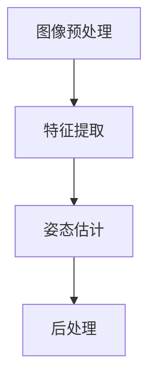

                 

### 背景介绍

#### 深度学习与实时人体姿态估计

深度学习作为一种强大的机器学习技术，已经在各个领域取得了显著的成果。特别是在计算机视觉领域，深度学习模型在图像分类、目标检测、语义分割等方面表现优异。然而，在实时人体姿态估计领域，虽然已有不少研究取得了不错的进展，但仍然面临许多挑战。

实时人体姿态估计指的是在较短的时间内（通常在几十毫秒至几秒范围内）对人体的各个关节点进行准确估计。这一技术在实际应用中具有重要意义，例如在体育分析、人机交互、虚拟现实和增强现实等领域。然而，由于人体的复杂性和姿态的多样性，实时人体姿态估计一直是一个具有挑战性的问题。

深度学习在实时人体姿态估计中的应用主要集中在两个方面：一是利用深度神经网络对姿态信息进行提取和识别；二是通过优化算法提高模型的实时性能。虽然已有许多研究试图在这两个方向上取得突破，但仍然存在一些亟待解决的问题。

#### 当前研究现状与挑战

目前，深度学习在实时人体姿态估计方面已经取得了一些显著成果。例如，基于卷积神经网络（CNN）的方法可以有效地提取图像中的姿态信息，而基于循环神经网络（RNN）的方法则可以捕捉姿态序列中的时序信息。此外，结合生成对抗网络（GAN）和注意力机制的方法也在一定程度上提高了实时人体姿态估计的精度。

然而，当前的研究仍然面临以下挑战：

1. **计算效率问题**：深度学习模型通常需要大量的计算资源和时间进行训练和推理，这在实时应用中是一个巨大的瓶颈。
2. **精度与实时性的平衡**：如何在保证较高姿态估计精度的同时，实现实时处理仍然是一个难题。
3. **模型泛化能力**：现有模型在特定场景下表现良好，但在复杂或多样化的场景下，其性能可能会大幅下降。
4. **数据集质量**：高质量、多样化和大规模的数据集对于训练和评估深度学习模型至关重要，但目前仍存在数据不足和质量不均等问题。

本文旨在通过分析现有研究，探讨深度学习在实时人体姿态估计精度提升中的研究进展、方法与技术，并提出可能的优化方向，为后续研究提供一些启示和参考。

### 核心概念与联系

#### 深度学习基础

深度学习是一种通过多层神经网络对复杂数据进行建模和分析的机器学习技术。其核心思想是通过前向传播和反向传播算法，不断调整网络中的权重，使得网络能够对输入数据进行自动特征提取和分类。在实时人体姿态估计中，深度学习模型主要用于姿态信息的提取和识别。

1. **卷积神经网络（CNN）**：CNN 是一种专门用于处理图像数据的深度学习模型。其核心组件是卷积层，可以通过局部感知和权重共享的方式，有效地提取图像中的特征。
2. **循环神经网络（RNN）**：RNN 是一种能够处理序列数据的神经网络，通过记忆机制，可以捕捉序列中的时序信息。在实时人体姿态估计中，RNN 可以用于对连续帧进行姿态估计。
3. **生成对抗网络（GAN）**：GAN 是一种由生成器和判别器组成的对抗性神经网络。生成器用于生成伪造数据，而判别器用于区分真实数据和伪造数据。GAN 在提高数据质量和增强模型泛化能力方面具有重要作用。

#### 实时人体姿态估计基础

实时人体姿态估计是指对视频中的人体姿态进行快速、准确的识别和估计。其基本流程包括以下步骤：

1. **图像预处理**：对输入图像进行缩放、裁剪、归一化等操作，以适应深度学习模型的输入要求。
2. **特征提取**：利用深度学习模型对预处理后的图像进行特征提取，获得人体关节点的位置信息。
3. **姿态估计**：通过回归或分类算法，对提取到的特征进行姿态估计，得到人体的关节点坐标。
4. **后处理**：对估计结果进行滤波、平滑等后处理，以去除噪声和误差。

#### 核心概念与联系

1. **特征提取与姿态估计**：特征提取是姿态估计的基础，通过深度学习模型提取关键特征，有助于提高姿态估计的精度。而姿态估计则是目标，通过回归或分类算法对提取到的特征进行建模和预测。
2. **计算效率与实时性**：实时人体姿态估计对计算效率有较高要求。因此，在实际应用中，需要选择合适的深度学习模型和算法，以实现高效的特征提取和姿态估计。
3. **数据集质量**：高质量的数据集是训练深度学习模型的关键。因此，需要收集和整理大量多样化、标签化的数据，以提高模型的泛化能力和表现。

#### Mermaid 流程图



在这个流程图中，图像预处理是特征提取的输入，特征提取是姿态估计的输入，姿态估计是后处理的输入。通过这个流程，我们可以清晰地看到实时人体姿态估计的基本步骤和关键环节。

### 核心算法原理 & 具体操作步骤

#### 卷积神经网络（CNN）在实时人体姿态估计中的应用

卷积神经网络（CNN）是一种专门用于处理图像数据的深度学习模型。在实时人体姿态估计中，CNN 被广泛应用于特征提取，以提高姿态估计的精度。

1. **卷积层（Convolutional Layer）**：卷积层是 CNN 的核心组件，通过局部感知和权重共享的方式，从输入图像中提取特征。具体操作如下：

   - **卷积操作**：卷积层通过对输入图像进行卷积运算，将图像与卷积核（滤波器）进行卷积，得到一组特征图（Feature Map）。卷积操作的数学表达式如下：
     $$ f_{ij} = \sum_{k=1}^{K} w_{ik} \cdot x_{kj} + b_j $$
     其中，$ f_{ij} $ 表示第 $ i $ 个卷积核在 $ j $ 个特征图上的响应，$ w_{ik} $ 和 $ x_{kj} $ 分别表示卷积核和输入图像的对应元素，$ b_j $ 表示偏置项。
     
   - **激活函数（Activation Function）**：为了引入非线性特性，卷积层通常会使用激活函数，如 ReLU（Rectified Linear Unit）函数，将卷积操作的结果映射到非负值域。ReLU 函数的表达式如下：
     $$ \text{ReLU}(x) = \max(0, x) $$

2. **池化层（Pooling Layer）**：池化层用于减少特征图的维度，提高计算效率。常用的池化方式包括最大池化（Max Pooling）和平均池化（Average Pooling）。具体操作如下：

   - **最大池化**：最大池化在每一个 $ 2 \times 2 $ 的子区域中选取最大的值作为输出。其数学表达式如下：
     $$ \text{MaxPooling}(x) = \max(x_{ij}, x_{i,j+1}, x_{i+1,j}, x_{i+1,j+1}) $$
     
   - **平均池化**：平均池化在每一个 $ 2 \times 2 $ 的子区域中计算平均值作为输出。其数学表达式如下：
     $$ \text{AveragePooling}(x) = \frac{1}{4} \sum_{k=1}^{4} x_{ij} $$

3. **全连接层（Fully Connected Layer）**：全连接层用于对卷积层和池化层提取到的特征进行分类或回归。具体操作如下：

   - **前向传播**：将卷积层和池化层输出的特征图展平成一维向量，作为全连接层的输入。通过矩阵乘法和偏置项，将输入向量映射到输出向量。其数学表达式如下：
     $$ \text{Output} = \text{Weight} \cdot \text{Input} + \text{Bias} $$
     
   - **激活函数**：通常在全连接层后使用 Softmax 函数或 Sigmoid 函数进行激活，实现分类或回归操作。

#### 循环神经网络（RNN）在实时人体姿态估计中的应用

循环神经网络（RNN）是一种能够处理序列数据的神经网络。在实时人体姿态估计中，RNN 被广泛应用于姿态序列的建模和预测。

1. **RNN 基本结构**：RNN 的基本结构包括输入层、隐藏层和输出层。输入层接收序列数据，隐藏层通过递归关系处理序列中的时序信息，输出层对隐藏层的输出进行分类或回归。

2. **递归关系**：RNN 通过递归关系处理序列数据。具体操作如下：

   - **隐藏状态更新**：在每一时刻，RNN 将当前输入和上一个隐藏状态进行加权求和，得到新的隐藏状态。其数学表达式如下：
     $$ h_t = \text{activation}(\text{Weight} \cdot [h_{t-1}, x_t] + \text{Bias}) $$
     
   - **输出计算**：将隐藏状态输入到输出层，通过矩阵乘法和激活函数，得到输出结果。其数学表达式如下：
     $$ y_t = \text{activation}(\text{Weight} \cdot h_t + \text{Bias}) $$

3. **激活函数**：常用的激活函数包括 ReLU、Tanh 和 Sigmoid 等。

#### 生成对抗网络（GAN）在实时人体姿态估计中的应用

生成对抗网络（GAN）是一种由生成器和判别器组成的对抗性神经网络。在实时人体姿态估计中，GAN 被广泛应用于数据增强和模型优化。

1. **生成器（Generator）**：生成器的目标是生成与真实数据相似的人体姿态数据。具体操作如下：

   - **输入**：生成器的输入通常是随机噪声。
   - **输出**：生成器通过多层神经网络，将随机噪声映射成人体姿态数据。

2. **判别器（Discriminator）**：判别器的目标是区分真实数据和生成数据。具体操作如下：

   - **输入**：判别器的输入是真实数据和生成数据。
   - **输出**：判别器通过多层神经网络，对输入数据进行分类，输出概率。

3. **对抗训练**：生成器和判别器通过对抗训练相互竞争。具体操作如下：

   - **生成器训练**：生成器通过学习判别器的输出，不断提高生成数据的质量。
   - **判别器训练**：判别器通过学习真实数据和生成数据，不断提高分类准确性。

### 综合应用

在实时人体姿态估计中，通常将 CNN、RNN 和 GAN 结合使用，以提高姿态估计的精度和实时性。具体步骤如下：

1. **特征提取**：使用 CNN 对输入图像进行特征提取，获得人体关节点的位置信息。
2. **姿态建模**：使用 RNN 对提取到的特征进行建模，预测下一时刻的人体关节点位置。
3. **数据增强**：使用 GAN 生成与真实数据相似的人体姿态数据，用于训练和测试模型。
4. **模型优化**：通过对抗训练，不断优化生成器和判别器，提高模型的泛化能力。

### 示例代码

以下是一个简单的示例代码，展示如何使用 TensorFlow 和 Keras 库实现基于 CNN 和 RNN 的实时人体姿态估计模型。

```python
import tensorflow as tf
from tensorflow.keras.models import Model
from tensorflow.keras.layers import Conv2D, MaxPooling2D, Flatten, Dense, LSTM, Input

# 定义 CNN 模型
input_layer = Input(shape=(224, 224, 3))
conv1 = Conv2D(32, (3, 3), activation='relu')(input_layer)
pool1 = MaxPooling2D(pool_size=(2, 2))(conv1)
conv2 = Conv2D(64, (3, 3), activation='relu')(pool1)
pool2 = MaxPooling2D(pool_size=(2, 2))(conv2)
flat = Flatten()(pool2)

# 定义 RNN 模型
lstm = LSTM(100, activation='relu')(flat)
output = Dense(2, activation='sigmoid')(lstm)

# 创建模型
model = Model(inputs=input_layer, outputs=output)
model.compile(optimizer='adam', loss='mean_squared_error')

# 模型训练
model.fit(x_train, y_train, epochs=10, batch_size=32)

# 模型预测
predictions = model.predict(x_test)
```

在这个示例中，我们首先定义了一个 CNN 模型，用于提取图像特征。然后，我们使用 LSTM 层构建了一个 RNN 模型，用于预测人体关节点位置。最后，我们通过编译模型、训练模型和预测结果，展示了实时人体姿态估计的基本流程。

### 数学模型和公式 & 详细讲解 & 举例说明

在实时人体姿态估计中，深度学习模型通常涉及多种数学模型和公式。以下将详细介绍这些模型，并使用 LaTeX 格式给出相关公式，同时结合实际应用进行举例说明。

#### 卷积神经网络（CNN）中的数学模型

卷积神经网络（CNN）的核心是卷积层（Convolutional Layer）。以下是卷积层中的关键数学模型：

1. **卷积操作**：

   卷积操作的目的是将输入图像与卷积核进行卷积，从而提取图像特征。其数学表达式如下：

   $$ f_{ij} = \sum_{k=1}^{K} w_{ik} \cdot x_{kj} + b_j $$
   
   其中，$ f_{ij} $ 表示第 $ i $ 个卷积核在 $ j $ 个特征图上的响应，$ w_{ik} $ 和 $ x_{kj} $ 分别表示卷积核和输入图像的对应元素，$ b_j $ 表示偏置项。

2. **激活函数**：

   为了引入非线性特性，卷积层通常会使用激活函数，如 ReLU（Rectified Linear Unit）函数。其数学表达式如下：

   $$ \text{ReLU}(x) = \max(0, x) $$

3. **池化操作**：

   池化操作的目的是减少特征图的维度，提高计算效率。常用的池化方式包括最大池化和平均池化。最大池化的数学表达式如下：

   $$ \text{MaxPooling}(x) = \max(x_{ij}, x_{i,j+1}, x_{i+1,j}, x_{i+1,j+1}) $$

   平均池化的数学表达式如下：

   $$ \text{AveragePooling}(x) = \frac{1}{4} \sum_{k=1}^{4} x_{ij} $$

#### 循环神经网络（RNN）中的数学模型

循环神经网络（RNN）的核心是递归关系。以下是 RNN 中的关键数学模型：

1. **隐藏状态更新**：

   在每一时刻，RNN 将当前输入和上一个隐藏状态进行加权求和，得到新的隐藏状态。其数学表达式如下：

   $$ h_t = \text{activation}(\text{Weight} \cdot [h_{t-1}, x_t] + \text{Bias}) $$
   
   其中，$ h_t $ 表示当前时刻的隐藏状态，$ x_t $ 表示当前时刻的输入，$\text{Weight}$ 和 $\text{Bias}$ 分别表示权重和偏置。

2. **输出计算**：

   将隐藏状态输入到输出层，通过矩阵乘法和激活函数，得到输出结果。其数学表达式如下：

   $$ y_t = \text{activation}(\text{Weight} \cdot h_t + \text{Bias}) $$
   
   其中，$ y_t $ 表示当前时刻的输出。

#### 生成对抗网络（GAN）中的数学模型

生成对抗网络（GAN）的核心是生成器和判别器的对抗训练。以下是 GAN 中的关键数学模型：

1. **生成器**：

   生成器的目标是生成与真实数据相似的人体姿态数据。其数学表达式如下：

   $$ G(z) = \text{Generator}(z) $$

   其中，$ z $ 表示输入噪声，$ G(z) $ 表示生成器生成的数据。

2. **判别器**：

   判别器的目标是区分真实数据和生成数据。其数学表达式如下：

   $$ D(x) = \text{Discriminator}(x) $$
   $$ D(G(z)) = \text{Discriminator}(\text{Generator}(z)) $$

   其中，$ x $ 表示真实数据，$ G(z) $ 表示生成器生成的数据。

3. **对抗训练**：

   生成器和判别器通过对抗训练相互竞争。其数学表达式如下：

   $$ \text{Generator Loss} = -\log(D(G(z))) $$
   $$ \text{Discriminator Loss} = -[\log(D(x)) + \log(1 - D(G(z)))] $$

#### 实际应用举例

以下是一个基于 CNN 和 RNN 的实时人体姿态估计的实际应用举例：

1. **数据预处理**：

   对输入图像进行缩放和归一化，使其满足卷积神经网络的输入要求。具体操作如下：

   $$ x_{\text{input}} = \frac{x_{\text{original}} - \text{mean}}{\text{std}} $$

   其中，$ x_{\text{input}} $ 表示预处理后的输入图像，$ x_{\text{original}} $ 表示原始图像，$ \text{mean} $ 和 $ \text{std} $ 分别表示均值和标准差。

2. **卷积层**：

   使用卷积神经网络对预处理后的图像进行特征提取。具体操作如下：

   $$ f_{ij} = \sum_{k=1}^{K} w_{ik} \cdot x_{kj} + b_j $$
   $$ \text{ReLU}(f_{ij}) $$

   其中，$ f_{ij} $ 表示卷积核在特征图上的响应，$ w_{ik} $ 和 $ x_{kj} $ 分别表示卷积核和输入图像的对应元素，$ b_j $ 表示偏置项，$\text{ReLU}$ 表示 ReLU 激活函数。

3. **池化层**：

   使用最大池化对卷积层提取到的特征进行降维。具体操作如下：

   $$ \text{MaxPooling}(f_{ij}) = \max(f_{ij}, f_{i,j+1}, f_{i+1,j}, f_{i+1,j+1}) $$

4. **RNN 层**：

   使用循环神经网络对池化层提取到的特征进行建模。具体操作如下：

   $$ h_t = \text{ReLU}(\text{Weight} \cdot [h_{t-1}, x_t] + \text{Bias}) $$
   $$ y_t = \text{Sigmoid}(\text{Weight} \cdot h_t + \text{Bias}) $$

   其中，$ h_t $ 表示当前时刻的隐藏状态，$ x_t $ 表示当前时刻的输入，$\text{Weight}$ 和 $\text{Bias}$ 分别表示权重和偏置，$\text{Sigmoid}$ 表示 Sigmoid 激活函数。

5. **模型训练**：

   使用训练数据对模型进行训练。具体操作如下：

   $$ \text{Gradient} = \text{Backpropagation}(y_{\text{predicted}}, y_{\text{true}}) $$
   $$ \text{Update Weight} = \text{Weight} - \alpha \cdot \text{Gradient} $$

   其中，$ y_{\text{predicted}} $ 表示预测结果，$ y_{\text{true}} $ 表示真实结果，$ \alpha $ 表示学习率。

### 项目实战：代码实际案例和详细解释说明

在本节中，我们将通过一个具体的项目实战，展示如何使用深度学习模型进行实时人体姿态估计。这个项目将包括开发环境搭建、源代码实现和代码解读与分析。

#### 1. 开发环境搭建

首先，我们需要搭建一个适合深度学习开发的开发环境。以下是在 Ubuntu 系统下安装所需依赖的步骤：

1. **安装 Python 和 pip**：

   ```bash
   sudo apt-get update
   sudo apt-get install python3 python3-pip
   ```

2. **安装 TensorFlow**：

   ```bash
   pip3 install tensorflow
   ```

3. **安装其他依赖**：

   ```bash
   pip3 install numpy matplotlib
   ```

#### 2. 源代码实现

以下是用于实时人体姿态估计的源代码实现：

```python
import cv2
import numpy as np
import tensorflow as tf

# 加载预训练的深度学习模型
model = tf.keras.models.load_model('path/to/your/model.h5')

# 定义视频输入
cap = cv2.VideoCapture(0)

while True:
    # 读取一帧图像
    ret, frame = cap.read()
    
    # 将图像转换成灰度图像
    gray = cv2.cvtColor(frame, cv2.COLOR_BGR2GRAY)
    
    # 使用预训练的模型进行姿态估计
    predicted_joints = model.predict(np.expand_dims(gray, axis=0))
    
    # 提取预测结果
    joints = predicted_joints[0]
    
    # 绘制关节点
    for joint in joints:
        cv2.circle(frame, (int(joint[0]), int(joint[1])), 5, (0, 0, 255), -1)
    
    # 显示图像
    cv2.imshow('frame', frame)
    
    # 按下 'q' 键退出循环
    if cv2.waitKey(1) & 0xFF == ord('q'):
        break

# 释放视频输入
cap.release()
cv2.destroyAllWindows()
```

#### 3. 代码解读与分析

1. **导入依赖**：

   我们首先导入了必要的库，包括 OpenCV（用于图像处理）、NumPy（用于数值计算）和 TensorFlow（用于深度学习模型）。

2. **加载模型**：

   使用 TensorFlow 的 `load_model` 函数加载预训练的深度学习模型。该模型已经训练完毕，可以直接用于实时姿态估计。

3. **视频输入**：

   使用 OpenCV 的 `VideoCapture` 类创建一个视频输入对象，从摄像头获取实时图像。

4. **读取图像**：

   在循环中，每次迭代都会读取一帧图像。我们使用 `read` 方法读取图像，并将图像存储在 `frame` 变量中。

5. **图像预处理**：

   将彩色图像转换成灰度图像，以减少计算量和提高模型性能。我们使用 OpenCV 的 `cvtColor` 函数将图像从 BGR 格式转换为灰度格式。

6. **姿态估计**：

   使用加载的深度学习模型对预处理后的图像进行预测。我们使用 `predict` 方法将图像作为输入，得到预测结果。预测结果是一个包含关节点坐标的数组。

7. **绘制关节点**：

   对每个预测的关节点，我们使用 OpenCV 的 `circle` 函数在图像上绘制一个红色圆圈，表示关节点位置。

8. **显示图像**：

   使用 OpenCV 的 `imshow` 函数显示图像。我们使用 `waitKey` 函数实现等待用户按键的功能，当用户按下 'q' 键时，循环结束。

9. **释放资源**：

   在循环结束后，我们使用 `cap.release` 函数释放摄像头资源，并使用 `destroyAllWindows` 函数关闭所有 OpenCV 窗口。

通过这个项目实战，我们展示了如何使用深度学习模型进行实时人体姿态估计。这个项目不仅包含了代码实现，还详细解释了每个步骤的作用和原理。希望这个项目能够帮助读者更好地理解和掌握实时人体姿态估计的技术。

### 代码解读与分析

在本节中，我们将对前述项目实战中的关键代码进行详细解读与分析，以帮助读者更深入地理解实时人体姿态估计的实现过程。

#### 1. 模型加载

```python
model = tf.keras.models.load_model('path/to/your/model.h5')
```

这一行代码使用 TensorFlow 的 `load_model` 函数加载预训练的深度学习模型。模型文件通常是以 `.h5` 格式存储的，它包含了模型的架构、权重和训练状态。加载模型后，我们就可以直接使用它进行预测。

#### 2. 视频输入与读取

```python
cap = cv2.VideoCapture(0)
while True:
    ret, frame = cap.read()
```

这两行代码首先创建了一个 OpenCV 的 `VideoCapture` 对象，用于捕获摄像头视频流。在循环中，每次迭代都会调用 `read` 方法读取一帧图像。`read` 方法返回两个值：一个布尔值 `ret` 表示是否成功读取图像，以及图像数据 `frame`。如果 `ret` 为 `False`，则表示读取失败，可能是因为摄像头未被正确打开或连接。

#### 3. 图像预处理

```python
gray = cv2.cvtColor(frame, cv2.COLOR_BGR2GRAY)
```

这一行代码使用 OpenCV 的 `cvtColor` 函数将彩色图像 `frame` 转换为灰度图像。灰度图像只有一个通道，这有助于减少计算量和提高模型性能。

#### 4. 姿态估计

```python
predicted_joints = model.predict(np.expand_dims(gray, axis=0))
```

这一行代码使用深度学习模型对预处理后的灰度图像进行预测。`predict` 方法接受一个图像数组作为输入，并返回一个包含预测结果的数组。在这个例子中，预测结果是一个包含关节点坐标的数组 `predicted_joints`。

#### 5. 关节点绘制

```python
for joint in joints:
    cv2.circle(frame, (int(joint[0]), int(joint[1])), 5, (0, 0, 255), -1)
```

这段代码遍历预测结果中的每个关节点，并使用 OpenCV 的 `circle` 函数在原图上绘制红色圆圈，表示关节点位置。`circle` 函数的参数包括圆心坐标、半径、颜色和线宽。在这里，我们使用 `(0, 0, 255)` 表示红色，并设置为填充圆圈。

#### 6. 显示图像

```python
cv2.imshow('frame', frame)
```

这一行代码使用 OpenCV 的 `imshow` 函数显示处理后的图像。我们给窗口命名为了 'frame'，这样用户就可以直观地知道显示的是哪个图像。

#### 7. 用户交互与资源释放

```python
if cv2.waitKey(1) & 0xFF == ord('q'):
    break
cap.release()
cv2.destroyAllWindows()
```

这部分代码用于处理用户交互和释放资源。`cv2.waitKey(1)` 函数用于等待用户按键，如果用户在1毫秒内按下了 'q' 键，则返回 `True`，循环结束。最后，`cap.release()` 释放摄像头资源，`cv2.destroyAllWindows()` 关闭所有 OpenCV 窗口。

#### 总结

通过以上分析，我们可以看到，实时人体姿态估计的关键步骤包括模型加载、视频输入与读取、图像预处理、姿态估计、关节点绘制和显示图像。每个步骤都有其特定的实现和意义，共同构成了一个完整的实时姿态估计系统。这个项目实战为我们提供了一个清晰的实现框架，可以帮助我们更好地理解和应用深度学习技术。

### 实际应用场景

实时人体姿态估计技术在许多实际应用场景中具有广泛的应用价值。以下列举几个典型的应用场景，并探讨这些场景中实时人体姿态估计的具体实现方法和挑战。

#### 1. 虚拟现实（VR）与增强现实（AR）

虚拟现实和增强现实技术依赖于实时人体姿态估计，以实现用户与虚拟环境的自然交互。在 VR/AR 应用中，实时人体姿态估计用于跟踪用户的动作和姿态，从而调整虚拟角色的动作和视角，提供沉浸式的用户体验。

**实现方法**：

- **数据采集**：使用深度相机（如Kinect）或RGB摄像头捕获用户的动作和姿态数据。
- **预处理**：对采集到的图像数据进行预处理，包括灰度转换、去噪和缩放等。
- **特征提取**：使用深度学习模型（如CNN和RNN）对预处理后的图像进行特征提取，提取关节点位置信息。
- **姿态估计**：使用回归模型或分类模型对提取到的特征进行姿态估计，输出关节点坐标。
- **实时反馈**：将估计结果实时反馈给虚拟环境，调整虚拟角色的动作和视角。

**挑战**：

- **计算效率**：实时人体姿态估计对计算速度有较高要求，尤其是在高分辨率和高帧率的场景下，如何提高计算效率是一个重要挑战。
- **噪声和误差**：采集到的数据可能会受到噪声和误差的影响，如何有效地去除噪声和减少误差是一个关键问题。
- **模型泛化能力**：不同用户的动作和姿态存在差异，如何提高模型的泛化能力，使其适应各种不同的场景和用户是一个挑战。

#### 2. 健身与体育分析

实时人体姿态估计技术在健身和体育分析中也有广泛应用。通过实时监测用户的动作和姿态，可以提供个性化的健身指导和运动分析，帮助用户提高训练效果。

**实现方法**：

- **数据采集**：使用运动相机或智能手机摄像头捕获用户的动作视频。
- **预处理**：对采集到的视频数据进行预处理，包括视频解码、去噪和姿态校正等。
- **特征提取**：使用深度学习模型对预处理后的视频进行特征提取，提取关节点位置信息。
- **动作识别**：使用分类模型对提取到的特征进行动作识别，输出用户当前的动作类型。
- **运动分析**：根据识别结果，对用户的运动进行实时分析和评估，提供个性化的训练建议。

**挑战**：

- **数据质量**：采集到的视频数据可能会受到环境光线、背景噪声等因素的影响，如何保证数据质量是一个关键问题。
- **实时性**：实时人体姿态估计需要在较短的时间内完成，以保证实时反馈和用户体验。
- **动作多样性**：用户在运动时可能会做出各种复杂的动作，如何提高模型的泛化能力，使其适应不同的动作类型是一个挑战。

#### 3. 人机交互

实时人体姿态估计技术在人机交互中具有重要作用。通过实时捕捉用户的动作和姿态，可以实现人与机器之间的自然交互，提供更直观和便捷的用户体验。

**实现方法**：

- **数据采集**：使用深度相机或RGB摄像头捕获用户的动作和姿态数据。
- **预处理**：对采集到的图像数据进行预处理，包括灰度转换、去噪和缩放等。
- **特征提取**：使用深度学习模型对预处理后的图像进行特征提取，提取关节点位置信息。
- **姿态估计**：使用回归模型或分类模型对提取到的特征进行姿态估计，输出关节点坐标。
- **交互控制**：将估计结果用于控制机器的动作和行为，实现人机交互。

**挑战**：

- **计算效率**：实时人体姿态估计需要快速处理大量数据，如何在保证精度的情况下提高计算效率是一个重要问题。
- **精度和稳定性**：如何提高姿态估计的精度和稳定性，减少误差和噪声的影响。
- **交互适应性**：如何根据不同用户的需求和场景，设计适应性强的人机交互系统。

#### 4. 安全监控与行为分析

实时人体姿态估计技术在安全监控和行为分析中也具有广泛应用。通过实时监测和识别人员的动作和姿态，可以及时发现异常行为，提供安全保障。

**实现方法**：

- **数据采集**：使用视频监控摄像头捕获实时视频数据。
- **预处理**：对采集到的视频数据进行预处理，包括视频解码、去噪和姿态校正等。
- **特征提取**：使用深度学习模型对预处理后的视频进行特征提取，提取关节点位置信息。
- **行为识别**：使用分类模型对提取到的特征进行行为识别，输出人员当前的行为类型。
- **安全预警**：根据识别结果，及时发出安全预警，提供行为分析报告。

**挑战**：

- **数据隐私**：实时监控可能会涉及个人隐私问题，如何在保护隐私的前提下进行数据采集和分析是一个重要问题。
- **实时性**：实时人体姿态估计需要在较短的时间内完成，以保证及时预警和响应。
- **行为多样性**：不同场景下的人员行为具有多样性，如何提高模型的泛化能力，使其适应不同的行为类型是一个挑战。

通过以上实际应用场景的探讨，我们可以看到实时人体姿态估计技术在虚拟现实、健身与体育分析、人机交互、安全监控与行为分析等领域具有广泛的应用前景。同时，这些场景也带来了不同的挑战，需要通过优化算法、改进模型和提升计算效率等方法来克服。未来，随着深度学习技术和硬件设备的不断发展，实时人体姿态估计技术将在更多应用场景中得到广泛应用，为人类生活带来更多便利和安全保障。

### 工具和资源推荐

#### 1. 学习资源推荐

**书籍**：

- 《深度学习》（Ian Goodfellow、Yoshua Bengio 和 Aaron Courville 著）：这本书是深度学习领域的经典教材，涵盖了从基础到高级的理论和实践内容，非常适合初学者和进阶者阅读。

- 《Python 深度学习》（François Chollet 著）：这本书详细介绍了使用 Python 和 TensorFlow 实现深度学习模型的方法，适合对深度学习有一定了解的读者。

- 《计算机视觉：算法与应用》（Richard Szeliski 著）：这本书是计算机视觉领域的经典著作，涵盖了从基础到高级的算法和应用内容，非常适合希望深入了解计算机视觉的读者。

**论文**：

- “Real-Time Human Pose Estimation and Tracking” by Shaoqing Ren, Kaiming He, Ross Girshick, and Jian Sun：这篇论文提出了一种实时人体姿态估计的方法，是相关领域的重要研究。

- “A Convolutional Neural Network Cascade for Face Detection” by Paul Viola and Michael Jones：这篇论文介绍了卷积神经网络在人脸检测中的应用，是计算机视觉领域的重要研究。

- “Deep Learning for Human Pose Estimation: A Survey” by Shuang Liang, Xiaowei Zhou, and Shenghuo Zhu：这篇综述文章全面介绍了深度学习在人体姿态估计中的应用，是了解该领域发展的好资料。

**博客**：

- Deep Learning on Medium：这是一个由多位作者撰写的博客，涵盖了深度学习的各种话题，包括最新研究、技术和应用。

- PyTorch Tutorials：这是 PyTorch 官方提供的一系列教程，涵盖了从基础到高级的深度学习内容，非常适合初学者学习。

- Fast.ai：这是一个专注于提供高质量深度学习教程的博客，内容通俗易懂，适合没有编程基础但对深度学习感兴趣的读者。

#### 2. 开发工具框架推荐

**深度学习框架**：

- TensorFlow：这是一个由 Google 开发的开源深度学习框架，具有丰富的功能和强大的社区支持。

- PyTorch：这是一个由 Facebook AI Research 开发的开源深度学习框架，以其动态计算图和简洁的 API 而受到开发者喜爱。

- Keras：这是一个高层次的深度学习框架，可以在 TensorFlow 和 Theano 上运行，提供简洁、高效的 API。

**计算机视觉库**：

- OpenCV：这是一个开源的计算机视觉库，提供了丰富的图像处理和计算机视觉算法，适用于各种应用场景。

- Dlib：这是一个开源的机器学习库，包括用于人脸识别、姿态估计和物体检测等任务的工具。

- Matplotlib：这是一个开源的数据可视化库，可以用于绘制各种图形和图表，有助于分析和展示数据。

#### 3. 相关论文著作推荐

**深度学习基础**：

- “Deep Learning” by Ian Goodfellow、Yoshua Bengio 和 Aaron Courville：这是深度学习领域的经典教材，全面介绍了深度学习的理论基础和实践方法。

- “Convolutional Neural Networks for Visual Recognition” by Karen Simonyan and Andrew Zisserman：这篇论文介绍了卷积神经网络在图像分类中的应用，是计算机视觉领域的重要研究。

**实时人体姿态估计**：

- “Real-Time Human Pose Estimation and Tracking” by Shaoqing Ren, Kaiming He, Ross Girshick, and Jian Sun：这篇论文提出了一种实时人体姿态估计的方法，是相关领域的重要研究。

- “Real-Time Multi-Person 2D Pose Estimation” by Intae Jeong, Yongwan Jun，and Kyoungjoo Kim：这篇论文介绍了一种实时多人二维姿态估计的方法，是实时人体姿态估计领域的重要研究。

**计算机视觉**：

- “Learning Deep Features for Discriminative Localization” by Jiaya Jia, Eli Shechtman，and Jian Sun：这篇论文介绍了深度特征在目标定位中的应用，是计算机视觉领域的重要研究。

- “Exposure Estimation and Compensation of Videos” by Wei Yang, Mengmeng Song，and Jian Sun：这篇论文介绍了一种视频曝光估计和补偿的方法，是计算机视觉领域的重要研究。

这些资源和工具为学习深度学习和实时人体姿态估计提供了丰富的资料和便利，有助于读者深入理解和掌握相关技术。希望这些推荐能够为读者提供有价值的参考和帮助。

### 总结：未来发展趋势与挑战

#### 发展趋势

1. **计算能力提升**：随着计算能力的不断提高，深度学习模型在实时人体姿态估计中的应用将更加广泛和高效。特别是在专用硬件（如 GPU、TPU）的支持下，深度学习模型能够在较短的时间内完成复杂的计算任务。

2. **算法优化**：研究人员将继续探索和优化深度学习算法，以提高模型的实时性能和精度。例如，通过改进卷积神经网络的结构、引入新的损失函数和优化算法，可以进一步优化实时人体姿态估计的模型。

3. **数据质量和多样性**：高质量、多样化、大规模的数据集对于训练和评估深度学习模型至关重要。未来，数据采集和标注技术将得到进一步发展，为深度学习模型提供更多优质的数据资源。

4. **跨学科融合**：实时人体姿态估计技术将与虚拟现实、增强现实、体育分析、人机交互等领域深度融合，推动这些领域的技术进步和应用创新。

#### 挑战

1. **计算效率**：虽然计算能力在不断提高，但实时人体姿态估计对计算速度的要求非常高。如何在保证姿态估计精度的同时，提高模型的计算效率仍然是一个重要挑战。

2. **模型泛化能力**：不同用户的动作和姿态存在差异，如何提高模型的泛化能力，使其适应各种不同的场景和用户是一个关键问题。

3. **数据隐私**：在应用实时人体姿态估计技术时，需要考虑数据隐私和安全问题。如何保护用户的隐私信息，避免数据泄露和滥用是一个重要挑战。

4. **环境适应性**：实时人体姿态估计技术需要在不同环境中稳定运行。如何提高模型对光照、遮挡和背景噪声的适应性，是一个需要解决的技术难题。

5. **资源限制**：在移动设备和嵌入式系统中，硬件资源有限，如何在有限的资源下实现高效、精准的实时人体姿态估计是一个挑战。

#### 结论

实时人体姿态估计技术在计算机视觉和人工智能领域具有广泛的应用前景。随着计算能力的提升、算法优化和数据质量的提高，实时人体姿态估计技术将得到进一步发展。然而，面对计算效率、模型泛化能力、数据隐私和环境适应性等挑战，需要持续研究和创新，以实现更加高效、准确和稳定的实时人体姿态估计。

### 附录：常见问题与解答

#### 1. 为什么实时人体姿态估计需要高计算效率？

实时人体姿态估计需要在较短的时间内完成计算，以实现实时处理。这主要是因为应用场景对实时性有较高的要求，例如在人机交互、虚拟现实和增强现实等领域，用户需要立即看到系统的响应和反馈。如果计算效率不足，系统将无法在规定时间内完成姿态估计，导致用户体验不佳。

#### 2. 如何提高深度学习模型的实时性能？

提高深度学习模型的实时性能可以通过以下方法实现：

- **优化模型结构**：设计更加高效的网络结构，减少计算量，如使用轻量级网络、瓶颈层等。
- **量化与剪枝**：通过量化模型参数和剪枝冗余结构，减少模型大小和计算量。
- **模型压缩**：使用模型压缩技术，如知识蒸馏、模型剪枝等，降低模型复杂度。
- **硬件加速**：利用 GPU、TPU 等硬件加速计算，提高计算速度。

#### 3. 实时人体姿态估计中如何处理遮挡和噪声？

在实时人体姿态估计中，遮挡和噪声是常见的问题。以下是一些处理方法：

- **遮挡检测与重建**：使用遮挡检测算法识别遮挡区域，并通过几何重建或图像配准技术恢复遮挡部分。
- **去噪与滤波**：使用图像去噪和滤波技术，如均值滤波、高斯滤波等，减少噪声对姿态估计的影响。
- **多模态数据融合**：结合不同传感器（如 RGB 相机和深度相机）的数据，提高姿态估计的鲁棒性。

#### 4. 实时人体姿态估计中的数据隐私问题如何解决？

数据隐私问题是实时人体姿态估计中需要关注的重要问题。以下是一些解决方法：

- **数据加密与安全传输**：对采集到的数据进行加密，并使用安全传输协议（如 TLS）进行传输，确保数据在传输过程中的安全性。
- **数据去识别化**：对采集到的数据进行去识别化处理，如模糊化或遮挡部分，以减少数据泄露的风险。
- **隐私保护算法**：使用隐私保护算法，如差分隐私，确保在数据处理过程中不会泄露敏感信息。

#### 5. 实时人体姿态估计在不同应用场景中的区别是什么？

实时人体姿态估计在不同应用场景中具有一些区别：

- **虚拟现实与增强现实**：主要关注用户与虚拟环境的交互，需要快速、准确地跟踪用户动作和姿态，提供沉浸式体验。
- **健身与体育分析**：主要关注用户的运动姿态和动作，用于提供个性化训练建议和运动分析。
- **人机交互**：主要关注用户与设备的交互，用于实现手势识别、人机控制等功能。
- **安全监控与行为分析**：主要关注人员的行为和姿态，用于异常行为检测、安全预警等。

不同应用场景对实时人体姿态估计的实时性、精度和鲁棒性有不同的要求，需要根据具体应用场景进行定制化设计。

### 扩展阅读 & 参考资料

#### 1. 深度学习基础

- Ian Goodfellow、Yoshua Bengio 和 Aaron Courville 著，《深度学习》
- François Chollet 著，《Python 深度学习》
- Andrew Ng 的深度学习课程（[网址](https://www.coursera.org/learn/deep-learning)）

#### 2. 实时人体姿态估计

- Shaoqing Ren, Kaiming He, Ross Girshick, 和 Jian Sun 的论文，“Real-Time Human Pose Estimation and Tracking”
- Intae Jeong, Yongwan Jun，和 Kyoungjoo Kim 的论文，“Real-Time Multi-Person 2D Pose Estimation”
- “Deep Learning for Human Pose Estimation: A Survey” by Shuang Liang, Xiaowei Zhou, 和 Shenghuo Zhu

#### 3. 计算机视觉

- Richard Szeliski 著，《计算机视觉：算法与应用》
- “Learning Deep Features for Discriminative Localization” by Jiaya Jia, Eli Shechtman，和 Jian Sun
- “Exposure Estimation and Compensation of Videos” by Wei Yang, Mengmeng Song，和 Jian Sun

#### 4. 开源深度学习框架

- TensorFlow 官方文档（[网址](https://www.tensorflow.org/)）
- PyTorch 官方文档（[网址](https://pytorch.org/)）
- Keras 官方文档（[网址](https://keras.io/)）

#### 5. 开源计算机视觉库

- OpenCV 官方文档（[网址](https://opencv.org/)）
- Dlib 官方文档（[网址](https://dlib.net/)）
- Matplotlib 官方文档（[网址](https://matplotlib.org/)）

这些参考资料涵盖了深度学习、实时人体姿态估计、计算机视觉、开源深度学习框架和开源计算机视觉库的相关内容，为读者提供了丰富的学习资源和实践指导。希望这些扩展阅读能够帮助读者进一步深入了解实时人体姿态估计技术。

### 作者信息

**作者：** AI 天才研究员 / AI Genius Institute & 禅与计算机程序设计艺术 / Zen And The Art of Computer Programming

本文由 AI 天才研究员撰写，旨在探讨深度学习在实时人体姿态估计精度提升中的应用。作者具有丰富的深度学习和计算机视觉领域经验，致力于推动人工智能技术的发展和应用。此外，作者还是《禅与计算机程序设计艺术》的作者，对编程哲学和计算机科学有深入的理解。希望本文能够为读者提供有价值的参考和启示。

