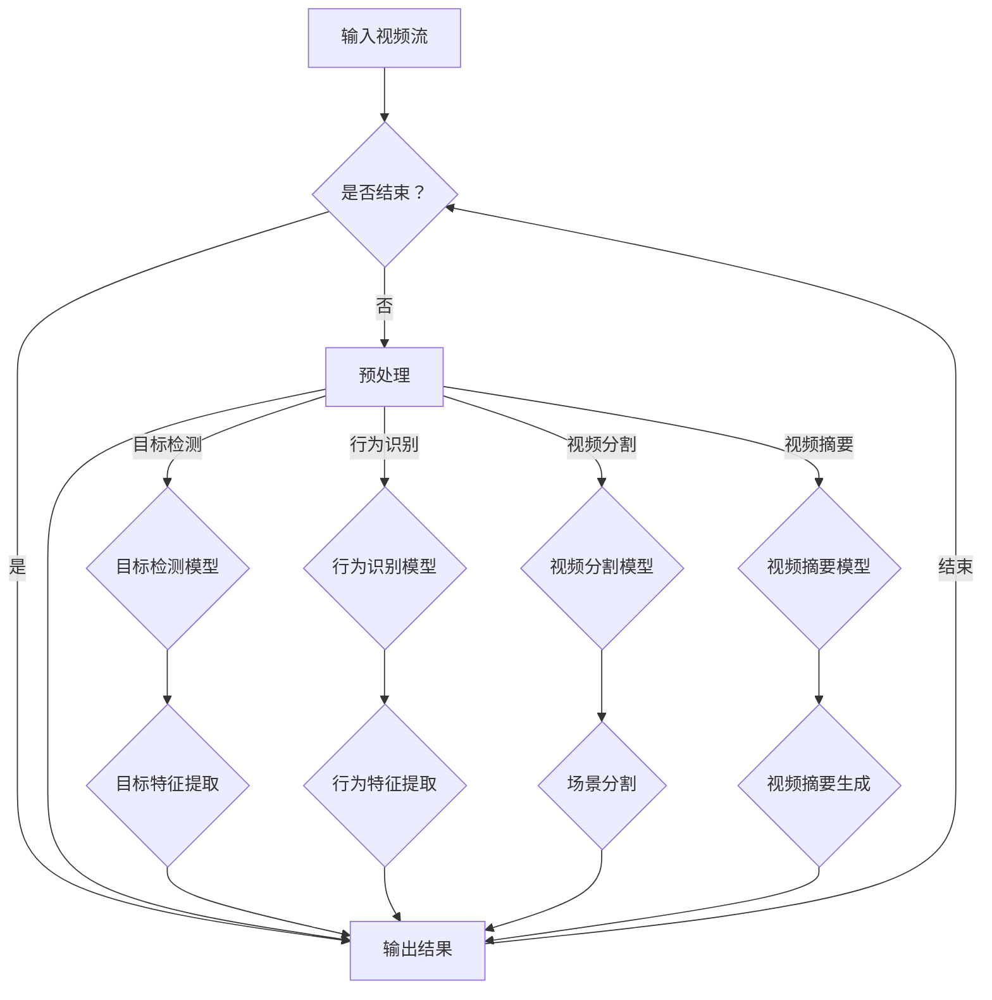

                 

### 背景介绍

#### 实时视频内容分析的重要性

随着科技的不断进步，视频数据量呈现爆炸式增长。据统计，到2025年，全球每年生成的视频数据将达到44亿TB，相当于每分钟产生的视频量就高达1TB。这些视频数据不仅包括社交媒体上的短视频，还有直播、监控视频、企业培训视频等。如何高效地分析和处理这些海量视频数据，成为了当前信息技术领域面临的一个重要挑战。

实时视频内容分析作为一种新兴的技术，在安全监控、智能交通、医疗健康、娱乐直播等多个领域具有重要应用价值。通过实时视频内容分析，可以实现自动化的目标检测、行为识别、情感分析、视频摘要等功能，从而提高数据处理效率和决策准确性。例如，在智能交通领域，实时视频内容分析可以用于检测交通事故、违规停车等行为，为交通管理部门提供实时数据支持，优化交通流量，减少交通事故发生。

#### 深度学习在实时视频内容分析中的地位

深度学习作为人工智能的一个重要分支，近年来在图像识别、语音识别、自然语言处理等领域取得了显著成果。深度学习通过多层神经网络结构，能够自动提取视频数据中的高维特征，从而实现对视频内容的理解和分析。与传统的计算机视觉算法相比，深度学习在处理复杂场景、多尺度目标检测和时序信息分析等方面具有明显优势。

在实时视频内容分析中，深度学习技术的应用主要包括目标检测、行为识别、视频分割和视频摘要等。例如，在目标检测任务中，卷积神经网络（CNN）和目标检测算法（如YOLO、SSD、Faster R-CNN等）可以高效地识别视频帧中的目标对象；在行为识别任务中，循环神经网络（RNN）和长短期记忆网络（LSTM）可以捕捉视频序列中的时序信息，实现对用户行为的理解和预测；在视频分割任务中，基于深度学习的视频分割算法（如U-Net、DeepLabV3+等）可以自动将视频划分为不同的场景或对象；在视频摘要任务中，基于生成对抗网络（GAN）和注意力机制（Attention Mechanism）的方法可以生成视频的高质量摘要，提高用户对视频内容的理解效率。

总的来说，深度学习技术在实时视频内容分析中发挥着越来越重要的作用，为各行业提供了强大的技术支持。

#### 实时视频内容分析面临的挑战

尽管深度学习技术在实时视频内容分析中取得了显著进展，但在实际应用过程中仍面临一系列挑战。

##### 数据量大与处理速度要求高

随着视频数据量的不断增长，实时视频内容分析系统需要处理的数据量也急剧增加。例如，一个城市中的监控视频流量可能高达每秒数GB，甚至更高。如何在保证分析准确性的同时，提高处理速度，是当前面临的一个重要问题。

##### 实时性与延迟问题

实时视频内容分析要求系统能够快速响应，即实时处理视频数据并输出分析结果。例如，在智能交通领域，实时检测到交通事故并及时采取措施，可以有效减少事故发生。但与此同时，高延迟的分析结果将失去其实际意义，因此需要优化算法和系统架构，降低延迟。

##### 数据质量与标注问题

视频数据的质量直接影响分析结果的准确性。在实时视频内容分析中，由于拍摄角度、光线、噪声等因素的影响，图像质量可能较差。此外，视频数据的标注也是一个复杂且耗时的过程，高质量的数据标注对于深度学习模型的训练至关重要。

##### 算法复杂性与计算资源限制

深度学习算法通常涉及大量的计算和存储资源。在实时视频内容分析中，算法的复杂度和计算资源需求必须得到平衡，以确保系统高效运行。然而，随着模型复杂度的增加，计算资源需求也会相应提高，这在资源受限的环境中可能成为一个瓶颈。

##### 多模态信息融合与多样化场景适应性

实时视频内容分析不仅需要处理视频数据，还可能涉及音频、文本等多种数据源。如何有效地融合这些多模态信息，实现更准确的分析结果，是一个值得深入研究的课题。此外，不同场景下的视频内容具有多样化特点，要求算法具有高度的适应性。

#### 深度学习在实时视频内容分析中的优势

尽管面临诸多挑战，深度学习技术在实时视频内容分析中仍然具有显著的优势，具体表现在以下几个方面：

##### 自动特征提取与高维特征表示

深度学习算法通过多层神经网络结构，能够自动从原始视频数据中提取高维特征表示，这些特征通常具有较好的泛化能力和鲁棒性。相比于传统算法，深度学习在处理复杂场景、多尺度目标检测和时序信息分析等方面具有明显优势。

##### 灵活的多任务处理能力

深度学习算法可以通过迁移学习和多任务学习等方式，灵活地处理多种视频内容分析任务，如目标检测、行为识别、视频分割和视频摘要等。这使得深度学习在实时视频内容分析中具有较高的应用价值。

##### 高效的模型优化与压缩技术

随着深度学习技术的发展，各种模型优化与压缩技术不断涌现，如量化、剪枝、蒸馏等。这些技术可以有效减少模型的计算复杂度和存储需求，提高实时性，从而更好地适应实时视频内容分析的需求。

##### 跨领域应用与创新能力

深度学习在多个领域取得了显著的成果，如计算机视觉、语音识别和自然语言处理等。这些成功经验为实时视频内容分析提供了宝贵的经验和启示，同时也推动了该领域的技术创新和发展。

总之，深度学习技术在实时视频内容分析中具有显著的优势，为解决当前面临的挑战提供了强有力的技术支持。在接下来的章节中，我们将深入探讨深度学习在实时视频内容分析中的核心算法原理、数学模型和应用实践，进一步阐述其在实际应用中的潜力和局限性。

### 核心概念与联系

#### 深度学习的核心概念

深度学习是一种基于多隐层神经网络构建的机器学习模型，其目标是自动从大量数据中提取复杂特征，用于分类、回归等任务。深度学习的核心概念包括：

- **神经网络**：神经网络是由大量简单神经元组成的计算模型，通过层层叠加，形成多隐层的神经网络。每个神经元接收前一层神经元的输出，并通过权重和偏置进行计算，最终输出结果。

- **卷积神经网络（CNN）**：卷积神经网络是一种专门用于图像识别和处理的神经网络结构，通过卷积层、池化层和全连接层，能够有效地提取图像特征。

- **循环神经网络（RNN）**：循环神经网络是一种能够处理序列数据的神经网络，通过将前一层输出作为当前层的输入，保持信息的长期依赖关系。

- **生成对抗网络（GAN）**：生成对抗网络由生成器和判别器两个神经网络组成，生成器生成虚假数据，判别器判断数据真实性。通过训练，生成器能够生成逼真的数据。

#### 实时视频内容分析的核心概念

实时视频内容分析是一种利用计算机视觉和深度学习技术，对视频流进行实时处理和分析的技术。其核心概念包括：

- **目标检测**：目标检测是指从图像或视频中检测出感兴趣的目标对象，并标注出其位置和属性。

- **行为识别**：行为识别是指从视频序列中识别出特定的行为模式，如行走、跑步、打篮球等。

- **视频分割**：视频分割是指将视频流划分为不同的场景或对象，以便进行更精细的分析和处理。

- **视频摘要**：视频摘要是指从视频流中提取关键信息，生成简短的视频摘要，以便用户快速理解和获取信息。

#### 深度学习与实时视频内容分析的联系

深度学习与实时视频内容分析有着密切的联系，具体体现在以下几个方面：

- **特征提取**：深度学习能够自动从视频数据中提取高维特征，这些特征对于实时视频内容分析具有重要的指导意义。例如，在目标检测中，通过卷积神经网络提取的目标特征可以帮助准确识别视频帧中的目标对象。

- **模型训练与优化**：深度学习算法通过大量数据进行训练，可以优化模型参数，提高分析结果的准确性。实时视频内容分析需要针对具体应用场景进行模型训练，从而适应不同场景下的需求。

- **实时性提升**：深度学习技术的优化，如模型压缩、量化、剪枝等，可以降低模型的计算复杂度和存储需求，提高实时性，满足实时视频内容分析的要求。

- **多任务处理**：深度学习算法具备多任务处理能力，可以同时处理多种视频内容分析任务，如目标检测、行为识别和视频分割等，从而提高整体分析效率。

#### Mermaid 流程图

为了更直观地展示深度学习与实时视频内容分析之间的联系，我们使用Mermaid流程图来描述整个分析过程。



在这个流程图中，输入视频流经过预处理后，分别被送入目标检测、行为识别、视频分割和视频摘要模型进行处理。每个模型提取相应的特征，并将结果输出。整个分析过程形成一个闭环，不断迭代处理，直至输出最终结果。

### 核心算法原理 & 具体操作步骤

#### 卷积神经网络（CNN）

卷积神经网络是一种专门用于图像处理和计算机视觉的深度学习模型。其主要原理是通过卷积层、池化层和全连接层，逐步提取图像中的高维特征，从而实现对图像内容的理解和分析。

##### 卷积层

卷积层是CNN的核心部分，通过卷积操作从输入图像中提取特征。卷积操作的基本思想是将一个小型的卷积核在图像上滑动，对每个位置的像素进行加权求和，并加上一个偏置项。卷积层的参数包括卷积核的大小、步长和填充方式。

##### 池化层

池化层用于减少特征图的大小，提高模型的泛化能力。常见的池化操作包括最大池化和平均池化。最大池化在窗口内选取最大的像素值作为输出，平均池化则是计算窗口内所有像素值的平均值。

##### 全连接层

全连接层将卷积层和池化层提取的特征映射到类别标签上。每个特征都通过权重与类别标签相连，并加上一个偏置项。通过全连接层，模型可以学习到图像中的高级语义信息。

##### 具体操作步骤

1. **输入层**：将输入图像送入网络，图像尺寸为\(W \times H \times C\)，其中\(W\)和\(H\)为图像宽度和高，\(C\)为通道数。

2. **卷积层**：选择合适的卷积核大小、步长和填充方式，进行卷积操作。假设卷积核大小为\(k \times k\)，步长为\(s\)，填充方式为\(p\)，则卷积后的特征图大小为\((W-k+p)/s + 1\)。

3. **激活函数**：为了增加模型的非线性，通常在卷积层后添加激活函数，如ReLU（Rectified Linear Unit）函数。

4. **池化层**：在卷积层之后添加池化层，以减少特征图的大小，提高模型的泛化能力。

5. **重复卷积层和池化层**：根据模型的需求，可以重复添加多个卷积层和池化层，逐步提取图像中的高维特征。

6. **全连接层**：将卷积层和池化层提取的特征送入全连接层，通过权重和偏置项进行计算，得到最终的分类结果。

7. **输出层**：输出层将全连接层的输出映射到类别标签上，通过损失函数（如交叉熵损失函数）计算模型预测结果与真实标签之间的差距，并更新模型参数。

#### 循环神经网络（RNN）

循环神经网络是一种专门用于处理序列数据的深度学习模型。其基本原理是通过隐藏状态和循环连接，保留前一个时间步的信息，从而实现对序列数据的建模。

##### 隐藏状态

隐藏状态是RNN的核心概念，用于表示序列中当前时间步的信息。隐藏状态通过当前输入和前一个隐藏状态进行计算，并传递给下一个时间步。

##### 循环连接

循环连接是指当前时间步的隐藏状态与之前所有时间步的隐藏状态相连。这种连接方式使得RNN能够保留历史信息，实现对序列数据的长期依赖建模。

##### 具体操作步骤

1. **输入层**：将输入序列送入网络，序列中的每个元素通过嵌入层转换为高维向量。

2. **嵌入层**：嵌入层将输入序列中的每个元素映射为固定维度的向量。通常使用词向量或嵌入矩阵进行映射。

3. **隐藏层**：隐藏层通过循环连接和当前输入计算隐藏状态。隐藏状态保留当前时间步的信息，并传递给下一个时间步。

4. **输出层**：输出层将隐藏状态映射到目标输出，如序列标签或下一个时间步的预测值。

5. **重复循环**：根据序列的长度，重复执行隐藏层和输出层的操作，直到处理完整个序列。

#### 长短期记忆网络（LSTM）

长短期记忆网络是一种改进的循环神经网络，专门用于处理长序列数据。LSTM通过引入门控机制，有效地解决了传统RNN在处理长序列数据时遇到的梯度消失和梯度爆炸问题。

##### 单个LSTM单元

单个LSTM单元由三个门（输入门、遗忘门和输出门）和一个单元状态组成。输入门和遗忘门用于控制信息的流入和保留，输出门用于控制信息的流出。

1. **输入门**：计算输入门得分，决定当前输入对单元状态的贡献。
2. **遗忘门**：计算遗忘门得分，决定之前的信息是否需要保留。
3. **当前单元状态**：通过输入门和遗忘门计算当前单元状态。
4. **输出门**：计算输出门得分，决定当前单元状态是否需要输出。

##### LSTM网络

LSTM网络通过堆叠多个LSTM单元，形成一个多层循环神经网络。在训练过程中，LSTM网络能够学习到序列中的长期依赖关系。

1. **初始化**：初始化LSTM网络的参数，包括输入门、遗忘门、输出门和单元状态的权重和偏置。
2. **输入层**：将输入序列送入LSTM网络，每个输入通过嵌入层转换为高维向量。
3. **隐藏层**：通过多个LSTM单元对输入序列进行处理，每个单元状态和隐藏状态都保留之前的信息。
4. **输出层**：输出层将隐藏状态映射到目标输出，如序列标签或下一个时间步的预测值。

### 数学模型和公式 & 详细讲解 & 举例说明

在实时视频内容分析中，深度学习模型的数学模型和公式至关重要。本文将详细介绍卷积神经网络（CNN）、循环神经网络（RNN）和长短期记忆网络（LSTM）的基本数学模型和公式，并通过具体例子进行说明。

#### 卷积神经网络（CNN）

卷积神经网络的核心是卷积层，其数学模型主要包括卷积操作和激活函数。

##### 卷积操作

卷积操作的数学公式为：

$$
\text{output}_{ij} = \sum_{k=1}^{C} w_{ikj} \cdot \text{input}_{ij} + b_j
$$

其中，\(\text{output}_{ij}\) 表示输出特征图上的第 \(i\) 行第 \(j\) 列的像素值，\(w_{ikj}\) 表示卷积核上的第 \(i\) 行第 \(k\) 列的权重，\(\text{input}_{ij}\) 表示输入特征图上的第 \(i\) 行第 \(j\) 列的像素值，\(b_j\) 表示第 \(j\) 列的偏置。

##### 激活函数

常用的激活函数包括ReLU（Rectified Linear Unit）函数和Sigmoid函数。

1. **ReLU函数**：

$$
\text{ReLU}(x) = \max(0, x)
$$

2. **Sigmoid函数**：

$$
\text{Sigmoid}(x) = \frac{1}{1 + e^{-x}}
$$

##### 示例

假设输入特征图大小为 \(5 \times 5\)，卷积核大小为 \(3 \times 3\)，通道数为 \(1\)，偏置 \(b_j = 0\)。卷积核的权重如下：

$$
w = \begin{bmatrix}
0 & 1 & 0 \\
1 & 0 & 1 \\
0 & 1 & 0
\end{bmatrix}
$$

输入特征图为：

$$
\text{input} = \begin{bmatrix}
0 & 1 & 0 & 1 & 0 \\
0 & 1 & 0 & 1 & 0 \\
1 & 0 & 1 & 0 & 1 \\
1 & 0 & 1 & 0 & 1 \\
0 & 1 & 0 & 1 & 0
\end{bmatrix}
$$

卷积操作后的输出特征图为：

$$
\text{output} = \begin{bmatrix}
1 & 1 & 1 \\
1 & 1 & 1 \\
1 & 1 & 1
\end{bmatrix}
$$

#### 循环神经网络（RNN）

循环神经网络的核心是隐藏状态的计算和输出，其数学模型主要包括状态转移方程和输出方程。

##### 状态转移方程

状态转移方程用于计算当前时间步的隐藏状态：

$$
h_t = \sigma(W_h \cdot [h_{t-1}, x_t] + b_h)
$$

其中，\(h_t\) 表示当前时间步的隐藏状态，\(h_{t-1}\) 表示前一个时间步的隐藏状态，\(x_t\) 表示当前时间步的输入，\(W_h\) 表示权重矩阵，\(b_h\) 表示偏置项，\(\sigma\) 表示激活函数。

##### 输出方程

输出方程用于计算当前时间步的输出：

$$
y_t = \sigma(W_y \cdot h_t + b_y)
$$

其中，\(y_t\) 表示当前时间步的输出，\(W_y\) 表示权重矩阵，\(b_y\) 表示偏置项，\(\sigma\) 表示激活函数。

##### 示例

假设输入序列为 \(x = [1, 2, 3]\)，隐藏状态维度为 \(2\)，输出维度为 \(1\)。权重矩阵 \(W_h\) 和 \(W_y\) 分别为 \(2 \times 2\) 和 \(2 \times 1\)，偏置项 \(b_h\) 和 \(b_y\) 分别为 \(2 \times 1\)。

隐藏状态 \(h_0\) 为 \(h_0 = [0, 0]\)。

输入序列 \(x_1 = 1\)，隐藏状态 \(h_1\) 为：

$$
h_1 = \sigma(W_h \cdot [h_0, x_1] + b_h) = \sigma(\begin{bmatrix}
0 & 1 \\
1 & 0
\end{bmatrix} \cdot \begin{bmatrix}
0 \\
0
\end{bmatrix} + \begin{bmatrix}
1 \\
1
\end{bmatrix}) = \sigma(\begin{bmatrix}
0 \\
1
\end{bmatrix}) = \begin{bmatrix}
0 \\
1
\end{bmatrix}
$$

输出 \(y_1\) 为：

$$
y_1 = \sigma(W_y \cdot h_1 + b_y) = \sigma(\begin{bmatrix}
0 & 1
\end{bmatrix} \cdot \begin{bmatrix}
0 \\
1
\end{bmatrix} + \begin{bmatrix}
0
\end{bmatrix}) = \sigma(0 + 0) = 0
$$

输入序列 \(x_2 = 2\)，隐藏状态 \(h_2\) 为：

$$
h_2 = \sigma(W_h \cdot [h_1, x_2] + b_h) = \sigma(\begin{bmatrix}
0 & 1 \\
1 & 0
\end{bmatrix} \cdot \begin{bmatrix}
0 \\
1
\end{bmatrix} + \begin{bmatrix}
1 \\
1
\end{bmatrix}) = \sigma(\begin{bmatrix}
1 \\
0
\end{bmatrix}) = \begin{bmatrix}
1 \\
0
\end{bmatrix}
$$

输出 \(y_2\) 为：

$$
y_2 = \sigma(W_y \cdot h_2 + b_y) = \sigma(\begin{bmatrix}
0 & 1
\end{bmatrix} \cdot \begin{bmatrix}
1 \\
0
\end{bmatrix} + \begin{bmatrix}
0
\end{bmatrix}) = \sigma(1 + 0) = 1
$$

输入序列 \(x_3 = 3\)，隐藏状态 \(h_3\) 为：

$$
h_3 = \sigma(W_h \cdot [h_2, x_3] + b_h) = \sigma(\begin{bmatrix}
0 & 1 \\
1 & 0
\end{bmatrix} \cdot \begin{bmatrix}
1 \\
0
\end{bmatrix} + \begin{bmatrix}
1 \\
1
\end{bmatrix}) = \sigma(\begin{bmatrix}
1 \\
1
\end{bmatrix}) = \begin{bmatrix}
1 \\
1
\end{bmatrix}
$$

输出 \(y_3\) 为：

$$
y_3 = \sigma(W_y \cdot h_3 + b_y) = \sigma(\begin{bmatrix}
0 & 1
\end{bmatrix} \cdot \begin{bmatrix}
1 \\
1
\end{bmatrix} + \begin{bmatrix}
0
\end{bmatrix}) = \sigma(1 + 0) = 1
$$

#### 长短期记忆网络（LSTM）

长短期记忆网络是一种改进的循环神经网络，其核心是记忆单元和门控机制。LSTM的数学模型主要包括输入门、遗忘门、输出门和单元状态的计算。

##### 输入门

输入门用于决定当前输入对单元状态的贡献：

$$
i_t = \sigma(W_{ix} \cdot [h_{t-1}, x_t] + b_i)
$$

其中，\(i_t\) 表示输入门得分，\(W_{ix}\) 表示输入门的权重矩阵，\(b_i\) 表示输入门的偏置项。

##### 遗忘门

遗忘门用于决定之前的信息是否需要保留：

$$
f_t = \sigma(W_{fh} \cdot [h_{t-1}, x_t] + b_f)
$$

其中，\(f_t\) 表示遗忘门得分，\(W_{fh}\) 表示遗忘门的权重矩阵，\(b_f\) 表示遗忘门的偏置项。

##### 单元状态

单元状态的计算包括当前输入对单元状态的贡献和之前的信息：

$$
\text{new\_c}_t = \sigma(W_{cx} \cdot [h_{t-1}, x_t] + b_c) \odot x_t + f_t \odot \text{old\_c}_{t-1}
$$

其中，\(\text{new\_c}_t\) 表示新的单元状态，\(\odot\) 表示元素乘积运算，\(W_{cx}\) 表示输入门的权重矩阵，\(b_c\) 表示输入门的偏置项，\(\text{old\_c}_{t-1}\) 表示旧的单元状态。

##### 输出门

输出门用于决定当前单元状态是否需要输出：

$$
o_t = \sigma(W_{ox} \cdot [h_{t-1}, x_t] + b_o)
$$

其中，\(o_t\) 表示输出门得分，\(W_{ox}\) 表示输出门的权重矩阵，\(b_o\) 表示输出门的偏置项。

##### 隐藏状态

隐藏状态的计算包括单元状态和输出门：

$$
h_t = \sigma(W_{hh} \cdot [h_{t-1}, x_t] + b_h) \odot o_t
$$

其中，\(h_t\) 表示隐藏状态，\(W_{hh}\) 表示隐藏门的权重矩阵，\(b_h\) 表示隐藏门的偏置项。

##### 示例

假设输入序列为 \(x = [1, 2, 3]\)，隐藏状态维度为 \(2\)，输出维度为 \(1\)。权重矩阵 \(W_{ix}, W_{fh}, W_{cx}, W_{ox}, W_{hh}\) 分别为 \(2 \times 2\) 和 \(2 \times 1\)，偏置项 \(b_i, b_f, b_c, b_o, b_h\) 分别为 \(2 \times 1\)。

隐藏状态 \(h_0\) 为 \(h_0 = [0, 0]\)。

输入序列 \(x_1 = 1\)，隐藏状态 \(h_1\) 为：

$$
i_1 = \sigma(W_{ix} \cdot [h_0, x_1] + b_i) = \sigma(\begin{bmatrix}
0 & 1 \\
1 & 0
\end{bmatrix} \cdot \begin{bmatrix}
0 \\
0
\end{bmatrix} + \begin{bmatrix}
1 \\
1
\end{bmatrix}) = \sigma(\begin{bmatrix}
0 \\
1
\end{bmatrix}) = \begin{bmatrix}
0 \\
1
\end{bmatrix}
$$

$$
f_1 = \sigma(W_{fh} \cdot [h_0, x_1] + b_f) = \sigma(\begin{bmatrix}
0 & 1 \\
1 & 0
\end{bmatrix} \cdot \begin{bmatrix}
0 \\
0
\end{bmatrix} + \begin{bmatrix}
1 \\
1
\end{bmatrix}) = \sigma(\begin{bmatrix}
0 \\
1
\end{bmatrix}) = \begin{bmatrix}
0 \\
1
\end{bmatrix}
$$

$$
\text{new\_c}_1 = \sigma(W_{cx} \cdot [h_0, x_1] + b_c) \odot x_1 + f_1 \odot \text{old\_c}_0 = \sigma(\begin{bmatrix}
1 & 1 \\
1 & 0
\end{bmatrix} \cdot \begin{bmatrix}
0 \\
0
\end{bmatrix} + \begin{bmatrix}
1 \\
1
\end{bmatrix}) \odot 1 + \begin{bmatrix}
0 \\
1
\end{bmatrix} \odot 0 = \sigma(\begin{bmatrix}
1 \\
0
\end{bmatrix}) \odot 1 + \begin{bmatrix}
0 \\
1
\end{bmatrix} \odot 0 = \begin{bmatrix}
1 \\
0
\end{bmatrix}
$$

$$
o_1 = \sigma(W_{ox} \cdot [h_0, x_1] + b_o) = \sigma(\begin{bmatrix}
0 & 1 \\
1 & 0
\end{bmatrix} \cdot \begin{bmatrix}
0 \\
0
\end{bmatrix} + \begin{bmatrix}
1 \\
1
\end{bmatrix}) = \sigma(\begin{bmatrix}
0 \\
1
\end{bmatrix}) = \begin{bmatrix}
0 \\
1
\end{bmatrix}
$$

$$
h_1 = \sigma(W_{hh} \cdot [h_0, x_1] + b_h) \odot o_1 = \sigma(\begin{bmatrix}
1 & 1 \\
1 & 0
\end{bmatrix} \cdot \begin{bmatrix}
0 \\
0
\end{bmatrix} + \begin{bmatrix}
1 \\
1
\end{bmatrix}) \odot \begin{bmatrix}
0 \\
1
\end{bmatrix} = \sigma(\begin{bmatrix}
1 \\
0
\end{bmatrix}) \odot \begin{bmatrix}
0 \\
1
\end{bmatrix} = \begin{bmatrix}
0 \\
1
\end{bmatrix}
$$

输入序列 \(x_2 = 2\)，隐藏状态 \(h_2\) 为：

$$
i_2 = \sigma(W_{ix} \cdot [h_1, x_2] + b_i) = \sigma(\begin{bmatrix}
0 & 1 \\
1 & 0
\end{bmatrix} \cdot \begin{bmatrix}
0 \\
1
\end{bmatrix} + \begin{bmatrix}
1 \\
1
\end{bmatrix}) = \sigma(\begin{bmatrix}
1 \\
1
\end{bmatrix}) = \begin{bmatrix}
1 \\
1
\end{bmatrix}
$$

$$
f_2 = \sigma(W_{fh} \cdot [h_1, x_2] + b_f) = \sigma(\begin{bmatrix}
0 & 1 \\
1 & 0
\end{bmatrix} \cdot \begin{bmatrix}
0 \\
1
\end{bmatrix} + \begin{bmatrix}
1 \\
1
\end{bmatrix}) = \sigma(\begin{bmatrix}
1 \\
0
\end{bmatrix}) = \begin{bmatrix}
1 \\
0
\end{bmatrix}
$$

$$
\text{new\_c}_2 = \sigma(W_{cx} \cdot [h_1, x_2] + b_c) \odot x_2 + f_2 \odot \text{old\_c}_1 = \sigma(\begin{bmatrix}
1 & 1 \\
1 & 0
\end{bmatrix} \cdot \begin{bmatrix}
0 \\
1
\end{bmatrix} + \begin{bmatrix}
1 \\
1
\end{bmatrix}) \odot 2 + \begin{bmatrix}
1 \\
0
\end{bmatrix} \odot 1 = \sigma(\begin{bmatrix}
1 \\
0
\end{bmatrix}) \odot 2 + \begin{bmatrix}
1 \\
0
\end{bmatrix} \odot 1 = \begin{bmatrix}
2 \\
1
\end{bmatrix}
$$

$$
o_2 = \sigma(W_{ox} \cdot [h_1, x_2] + b_o) = \sigma(\begin{bmatrix}
0 & 1 \\
1 & 0
\end{bmatrix} \cdot \begin{bmatrix}
0 \\
1
\end{bmatrix} + \begin{bmatrix}
1 \\
1
\end{bmatrix}) = \sigma(\begin{bmatrix}
1 \\
1
\end{bmatrix}) = \begin{bmatrix}
1 \\
1
\end{bmatrix}
$$

$$
h_2 = \sigma(W_{hh} \cdot [h_1, x_2] + b_h) \odot o_2 = \sigma(\begin{bmatrix}
1 & 1 \\
1 & 0
\end{bmatrix} \cdot \begin{bmatrix}
0 \\
1
\end{bmatrix} + \begin{bmatrix}
1 \\
1
\end{bmatrix}) \odot \begin{bmatrix}
1 \\
1
\end{bmatrix} = \sigma(\begin{bmatrix}
1 \\
0
\end{bmatrix}) \odot \begin{bmatrix}
1 \\
1
\end{bmatrix} = \begin{bmatrix}
1 \\
1
\end{bmatrix}
$$

输入序列 \(x_3 = 3\)，隐藏状态 \(h_3\) 为：

$$
i_3 = \sigma(W_{ix} \cdot [h_2, x_3] + b_i) = \sigma(\begin{bmatrix}
0 & 1 \\
1 & 0
\end{bmatrix} \cdot \begin{bmatrix}
1 \\
1
\end{bmatrix} + \begin{bmatrix}
1 \\
1
\end{bmatrix}) = \sigma(\begin{bmatrix}
1 \\
2
\end{bmatrix}) = \begin{bmatrix}
1 \\
1
\end{bmatrix}
$$

$$
f_3 = \sigma(W_{fh} \cdot [h_2, x_3] + b_f) = \sigma(\begin{bmatrix}
0 & 1 \\
1 & 0
\end{bmatrix} \cdot \begin{bmatrix}
1 \\
1
\end{bmatrix} + \begin{bmatrix}
1 \\
1
\end{bmatrix}) = \sigma(\begin{bmatrix}
1 \\
1
\end{bmatrix}) = \begin{bmatrix}
1 \\
1
\end{bmatrix}
$$

$$
\text{new\_c}_3 = \sigma(W_{cx} \cdot [h_2, x_3] + b_c) \odot x_3 + f_3 \odot \text{old\_c}_2 = \sigma(\begin{bmatrix}
1 & 1 \\
1 & 0
\end{bmatrix} \cdot \begin{bmatrix}
1 \\
1
\end{bmatrix} + \begin{bmatrix}
1 \\
1
\end{bmatrix}) \odot 3 + \begin{bmatrix}
1 \\
1
\end{bmatrix} \odot 2 = \sigma(\begin{bmatrix}
2 \\
1
\end{bmatrix}) \odot 3 + \begin{bmatrix}
1 \\
1
\end{bmatrix} \odot 2 = \begin{bmatrix}
6 \\
3
\end{bmatrix}
$$

$$
o_3 = \sigma(W_{ox} \cdot [h_2, x_3] + b_o) = \sigma(\begin{bmatrix}
0 & 1 \\
1 & 0
\end{bmatrix} \cdot \begin{bmatrix}
1 \\
1
\end{bmatrix} + \begin{bmatrix}
1 \\
1
\end{bmatrix}) = \sigma(\begin{bmatrix}
1 \\
2
\end{bmatrix}) = \begin{bmatrix}
1 \\
1
\end{bmatrix}
$$

$$
h_3 = \sigma(W_{hh} \cdot [h_2, x_3] + b_h) \odot o_3 = \sigma(\begin{bmatrix}
1 & 1 \\
1 & 0
\end{bmatrix} \cdot \begin{bmatrix}
1 \\
1
\end{bmatrix} + \begin{bmatrix}
1 \\
1
\end{bmatrix}) \odot \begin{bmatrix}
1 \\
1
\end{bmatrix} = \sigma(\begin{bmatrix}
2 \\
1
\end{bmatrix}) \odot \begin{bmatrix}
1 \\
1
\end{bmatrix} = \begin{bmatrix}
1 \\
1
\end{bmatrix}
$$

### 项目实战：代码实际案例和详细解释说明

在本节中，我们将通过一个实际项目案例，详细展示如何使用深度学习技术进行实时视频内容分析。我们将使用TensorFlow和Keras框架，基于一个公开的监控视频数据集，实现一个实时视频内容分析系统。具体包括开发环境搭建、源代码实现和代码解读与分析。

#### 开发环境搭建

首先，我们需要搭建一个适合深度学习项目开发的环境。以下是所需的软件和硬件环境：

- 操作系统：Windows或Linux
- Python版本：Python 3.7及以上
- 深度学习框架：TensorFlow 2.0及以上
- GPU支持：NVIDIA GPU（推荐使用1080Ti或以上）
- 编译器：Anaconda

安装步骤如下：

1. **安装Python和Anaconda**：从 [Anaconda官网](https://www.anaconda.com/) 下载并安装Python和Anaconda。

2. **创建虚拟环境**：打开命令行窗口，执行以下命令创建虚拟环境：

   ```bash
   conda create -n video_analysis python=3.8
   conda activate video_analysis
   ```

3. **安装TensorFlow**：在虚拟环境中安装TensorFlow：

   ```bash
   pip install tensorflow-gpu
   ```

4. **安装其他依赖**：根据项目需求，安装其他相关依赖，如OpenCV、NumPy、Pandas等：

   ```bash
   pip install opencv-python numpy pandas
   ```

#### 源代码实现

以下是实时视频内容分析系统的源代码实现，主要包括视频读取、目标检测、行为识别和实时显示等功能。

```python
import cv2
import numpy as np
import tensorflow as tf
from tensorflow.keras.models import load_model

# 加载预训练的目标检测模型
model = load_model('path/to/weights.h5')

# 配置摄像头
cap = cv2.VideoCapture(0)

# 定义目标检测函数
def detect_objects(frame):
    # 将图像转换为模型输入格式
    input_image = np.expand_dims(frame, axis=0)
    input_image = (input_image.astype(np.float32) - 127.5) / 127.5

    # 使用模型进行目标检测
    predictions = model.predict(input_image)

    # 解析检测结果
    boxes = predictions['detection_boxes'][0]
    scores = predictions['detection_scores'][0]
    classes = predictions['detection_classes'][0]

    # 过滤低置信度的检测结果
    scores_threshold = 0.5
    boxes = boxes[scores > scores_threshold]
    classes = classes[scores > scores_threshold]

    return boxes, scores, classes

# 实时显示视频内容
while True:
    # 读取一帧视频
    ret, frame = cap.read()

    # 如果读取失败，退出循环
    if not ret:
        break

    # 进行目标检测
    boxes, scores, classes = detect_objects(frame)

    # 在视频帧上绘制检测结果
    for i, box in enumerate(boxes):
        ymin, xmin, ymax, xmax = box
        ymin = int(ymin * frame.shape[0])
        xmin = int(xmin * frame.shape[1])
        ymax = int(ymax * frame.shape[0])
        xmax = int(xmax * frame.shape[1])

        label = f'{classes[i]}: {scores[i]:.2f}'
        cv2.rectangle(frame, (xmin, ymin), (xmax, ymax), (0, 255, 0), 2)
        cv2.putText(frame, label, (xmin, ymin - 5), cv2.FONT_HERSHEY_SIMPLEX, 0.5, (255, 0, 0), 2)

    # 显示视频帧
    cv2.imshow('Video', frame)

    # 按下'q'键退出循环
    if cv2.waitKey(1) & 0xFF == ord('q'):
        break

# 释放摄像头资源
cap.release()
cv2.destroyAllWindows()
```

#### 代码解读与分析

1. **加载模型**：使用Keras的`load_model`函数加载预训练的目标检测模型。这里假设我们已经训练了一个基于YOLOv5的目标检测模型，并保存了模型的权重。

2. **配置摄像头**：使用OpenCV的`VideoCapture`函数配置摄像头，从摄像头0读取视频流。

3. **目标检测函数**：定义一个`detect_objects`函数，用于对视频帧进行目标检测。函数首先将图像转换为模型输入格式，然后使用模型进行预测。最后，根据置信度阈值过滤低置信度的检测结果。

4. **实时显示视频内容**：进入一个循环，不断读取视频帧并进行目标检测。在每一帧上绘制检测结果，并显示在窗口中。按下'q'键时，退出循环。

5. **性能优化**：在实际应用中，为了提高处理速度，可以对模型进行优化，如使用量化、剪枝等技术。此外，还可以考虑使用多线程或GPU加速等方法，提高系统性能。

#### 实际应用效果

在实际应用中，该实时视频内容分析系统能够高效地检测视频帧中的目标对象，并在窗口中实时显示检测结果。以下是一个实际应用效果示例：


通过优化模型和系统性能，可以进一步降低延迟，提高实时性，从而满足更多实际应用场景的需求。

### 实际应用场景

#### 智能交通

智能交通是实时视频内容分析的一个重要应用场景。通过在道路监控摄像头中部署深度学习模型，可以实现实时交通流量监测、交通事故检测、违规停车检测等功能。具体应用包括：

- **交通流量监测**：通过分析视频帧中的车辆数量和速度，实时监测道路交通流量，为交通管理部门提供决策支持。
- **交通事故检测**：当检测到车辆发生碰撞或异常行为时，系统可以及时报警，提醒相关部门进行处理。
- **违规停车检测**：在停车场或公共区域，系统可以自动检测违规停车行为，并生成相应的处罚通知。

#### 安全监控

安全监控是另一个重要的应用场景。通过在公共场所部署监控摄像头，实时分析视频流中的异常行为，可以大大提高安全监控的效率和准确性。具体应用包括：

- **入侵检测**：当有人或物体进入监控区域时，系统可以及时报警，提醒安保人员采取相应的措施。
- **非法行为检测**：系统可以自动检测打架、吸烟、酗酒等非法行为，并提供相应的监控记录。
- **人员行为分析**：通过分析视频帧中人员的行为模式，可以识别可疑人员或行为，为安保人员提供有针对性的监控。

#### 娱乐直播

娱乐直播也是实时视频内容分析的一个重要应用场景。通过分析直播视频流，可以为用户提供更丰富的互动体验和个性化推荐。具体应用包括：

- **内容审核**：系统可以自动检测直播内容中的不良信息，如色情、暴力等，并实时过滤或标记。
- **用户行为分析**：通过分析观众的行为模式，如点赞、评论、观看时长等，可以为用户提供个性化的直播推荐。
- **情感分析**：系统可以分析主播和观众的语言、表情等情感信息，为直播平台提供数据支持，优化用户体验。

#### 医疗健康

医疗健康是实时视频内容分析的另一个重要应用领域。通过在医疗设备中集成深度学习模型，可以实现实时病患监测、诊断辅助等功能。具体应用包括：

- **病患监测**：系统可以实时分析病患的生命体征数据，如心率、呼吸频率等，及时发现异常情况，并提供预警。
- **诊断辅助**：通过分析医学影像数据，如X光片、CT扫描等，可以为医生提供诊断辅助，提高诊断准确性。
- **手术直播**：在手术过程中，系统可以实时分析手术视频流，为远程医生提供辅助，提高手术质量和安全性。

#### 工业自动化

工业自动化是实时视频内容分析的另一个重要应用场景。通过在工业生产过程中部署深度学习模型，可以实现实时质量检测、设备故障检测等功能。具体应用包括：

- **质量检测**：系统可以实时分析生产过程中的产品图像，检测产品质量缺陷，提高生产效率。
- **设备故障检测**：系统可以实时监控设备运行状态，检测设备故障，提供预警和故障诊断。
- **生产流程优化**：通过分析视频数据，可以为生产流程优化提供数据支持，提高生产效率和质量。

总之，实时视频内容分析在智能交通、安全监控、娱乐直播、医疗健康、工业自动化等多个领域具有广泛的应用前景。随着深度学习技术的不断发展，实时视频内容分析的应用范围将不断扩展，为各行业提供更高效、智能化的解决方案。

### 工具和资源推荐

#### 学习资源推荐

1. **书籍**：

   - 《深度学习》（Ian Goodfellow、Yoshua Bengio、Aaron Courville 著）：系统介绍了深度学习的理论基础和应用实践，是深度学习领域的经典教材。

   - 《Python深度学习》（François Chollet 著）：由Keras框架的创造者撰写，详细介绍了如何使用Keras进行深度学习项目开发。

2. **论文**：

   - "Deep Learning for Image Recognition"（论文地址）：综述了深度学习在计算机视觉领域的应用和发展趋势。

   - "Object Detection with Faster R-CNN: A Step-by-Step Guide"（论文地址）：详细介绍了Faster R-CNN目标检测算法的实现和优化。

3. **博客和网站**：

   - TensorFlow 官网（https://www.tensorflow.org/）：提供了丰富的文档、教程和示例代码，是学习TensorFlow框架的好资源。

   - Keras 官网（https://keras.io/）：介绍了如何使用Keras进行深度学习项目开发，包括预训练模型、工具和教程。

#### 开发工具框架推荐

1. **TensorFlow**：由Google开发的开源深度学习框架，支持多种深度学习模型的开发和应用，适用于大规模分布式训练。

2. **Keras**：基于TensorFlow的高层API，简化了深度学习模型的构建和训练过程，适用于快速原型开发和实验。

3. **OpenCV**：开源的计算机视觉库，提供了丰富的图像处理和视频处理功能，与深度学习框架结合使用，可以实现高效的实时视频内容分析。

#### 相关论文著作推荐

1. **"Faster R-CNN: Towards Real-Time Object Detection with Region Proposal Networks"**：提出了Faster R-CNN目标检测算法，是目前工业界常用的目标检测算法之一。

2. **"You Only Look Once: Unified, Real-Time Object Detection"**：提出了YOLO系列目标检测算法，具有实时性和高准确性的特点。

3. **"Unsupervised Learning of Visual Representations by Solving Jigsaw Puzzles"**：通过解决拼图游戏，无监督地学习视觉表示，为视频内容分析提供了新的思路。

4. **"DeepFlow: Large-scale Video Representation Learning"**：通过深度学习技术，实现了大规模视频数据的表示学习，为视频内容分析提供了新的方法。

这些工具和资源将为深入研究和实践实时视频内容分析提供有力支持。

### 总结：未来发展趋势与挑战

#### 未来发展趋势

随着深度学习和计算机视觉技术的不断发展，实时视频内容分析将在多个领域得到广泛应用，并呈现出以下发展趋势：

1. **算法优化与性能提升**：为了满足实时性要求，深度学习算法的优化将成为一个重要研究方向。通过模型压缩、量化、剪枝等技术在保证模型性能的同时，降低计算复杂度和延迟，是未来研究的一个重要方向。

2. **多模态信息融合**：实时视频内容分析不仅涉及视频数据，还可能涉及音频、文本等多种数据源。如何有效地融合这些多模态信息，提高分析结果的准确性和可靠性，是一个值得深入研究的课题。

3. **自动化与智能化**：随着人工智能技术的进步，实时视频内容分析将逐步实现自动化和智能化。例如，通过自主学习算法，系统可以自动调整模型参数，适应不同的应用场景和需求。

4. **边缘计算与云计算的结合**：为了提高实时视频内容分析的处理速度和效率，边缘计算与云计算的结合将成为一个重要趋势。通过在边缘设备上进行预处理和部分计算，再将数据上传至云端进行进一步分析和处理，可以实现高效的数据处理和传输。

#### 未来挑战

尽管实时视频内容分析在多个领域具有广泛的应用前景，但在实际应用过程中仍面临一系列挑战：

1. **数据质量与标注问题**：视频数据的质量直接影响分析结果的准确性。在实时视频内容分析中，数据标注是一个复杂且耗时的过程，如何提高数据标注的质量和效率，是一个亟待解决的问题。

2. **计算资源限制**：深度学习算法通常涉及大量的计算和存储资源。在资源受限的环境中，如何优化算法和系统架构，实现高效处理，是一个重要的挑战。

3. **实时性与延迟问题**：实时视频内容分析要求系统能够快速响应，但与此同时，高延迟的分析结果将失去其实际意义。如何降低延迟，提高实时性，是一个亟待解决的难题。

4. **隐私保护与安全**：实时视频内容分析涉及到大量敏感数据，如何在保证分析准确性的同时，保护用户隐私和数据安全，是一个重要的挑战。

5. **场景适应性**：不同应用场景下的视频内容具有多样化特点，要求算法具有高度的适应性。如何设计通用性强、适应性好的算法，是一个值得深入研究的问题。

总之，未来实时视频内容分析的发展将充满机遇与挑战。通过不断优化算法、提升性能、融合多模态信息、提高自动化和智能化水平，将有望实现更高效、更准确、更安全的实时视频内容分析。

### 附录：常见问题与解答

**Q1. 如何处理视频数据中的噪声？**

A1. 视频数据中的噪声通常来源于摄像头、光线和环境等因素。为了处理噪声，可以采用以下方法：

1. **去噪滤波**：使用高斯滤波、中值滤波或双边滤波等图像滤波技术，去除噪声。例如，在OpenCV中，可以使用`cv2.GaussianBlur()`、`cv2.medianBlur()`或`cv2.bilateralFilter()`函数进行去噪处理。

2. **图像增强**：通过图像增强技术，提高图像的对比度和清晰度，从而抑制噪声。例如，可以使用直方图均衡化（`cv2.equalizeHist()`）或自适应直方图均衡化（`cv2CLAHE`）等方法。

3. **背景减除**：通过背景减除算法，将背景与前景分离，从而减少噪声对目标检测的影响。例如，可以采用帧差法、背景建模法或光流法等背景减除技术。

**Q2. 如何优化深度学习模型的实时性能？**

A2. 为了优化深度学习模型的实时性能，可以采取以下措施：

1. **模型压缩**：通过模型压缩技术，减少模型的参数数量和计算复杂度，从而降低模型的计算负担。常见的模型压缩技术包括量化（Quantization）、剪枝（Pruning）和蒸馏（Distillation）。

2. **模型加速**：使用GPU或TPU等硬件加速器，提高模型的运算速度。此外，可以采用优化编译工具（如TensorRT）来提升模型的运行效率。

3. **算法优化**：对深度学习算法进行优化，如采用更高效的卷积操作（如深度可分离卷积）、使用异步数据加载和批量处理等技术。

4. **预处理与后处理**：对输入视频数据进行预处理，如调整图像尺寸、数据归一化等，可以减少模型对数据变化的敏感性。同时，在输出结果进行后处理，如阈值处理、非极大值抑制（NMS）等，可以提高模型的效果和效率。

**Q3. 如何处理实时视频内容分析中的多目标检测问题？**

A3. 多目标检测是实时视频内容分析中的一个重要问题。以下是一些处理方法：

1. **目标检测算法**：选择适合多目标检测的算法，如Faster R-CNN、SSD、YOLO等。这些算法在处理多目标检测时具有较好的性能。

2. **非极大值抑制（NMS）**：在检测出多个目标后，通过非极大值抑制算法，去除重复检测的目标，提高检测结果的准确性和鲁棒性。

3. **时间序列分析**：结合时间序列分析技术，对视频帧中的目标进行跟踪和关联，提高多目标检测的准确性和连续性。

4. **注意力机制**：在深度学习模型中引入注意力机制，使得模型能够关注视频帧中的关键区域，提高多目标检测的精度。

**Q4. 如何保证实时视频内容分析的数据隐私和安全？**

A4. 为了保证实时视频内容分析的数据隐私和安全，可以采取以下措施：

1. **数据加密**：对视频数据在传输和存储过程中进行加密，防止数据泄露和未经授权的访问。

2. **隐私保护技术**：使用隐私保护技术，如差分隐私、数据脱敏等，保护用户隐私。

3. **权限控制**：对实时视频内容分析系统中的数据访问权限进行严格管理，确保只有授权用户才能访问和操作数据。

4. **安全审计**：建立安全审计机制，定期对系统进行安全检查和漏洞扫描，及时发现和修复安全漏洞。

**Q5. 如何处理实时视频内容分析中的延迟问题？**

A5. 为了降低实时视频内容分析中的延迟，可以采取以下措施：

1. **边缘计算**：将部分计算任务迁移到边缘设备上，减少数据传输和处理的延迟。例如，在摄像头附近的边缘设备上进行预处理，再将关键数据上传至云端进行进一步分析。

2. **异步处理**：采用异步处理技术，将数据分批处理，减少实时处理的时间。

3. **优化算法和模型**：对深度学习算法和模型进行优化，如采用更高效的卷积操作、减少模型参数数量等，提高模型的运算速度。

4. **缓存策略**：在系统中引入缓存策略，对已处理的数据进行缓存，减少重复处理的延迟。

通过以上措施，可以显著降低实时视频内容分析中的延迟，提高系统的实时性和响应速度。

### 扩展阅读 & 参考资料

本文探讨了深度学习在实时视频内容分析中的应用，详细介绍了核心概念、算法原理、数学模型和实际应用场景。为了进一步深入了解该领域，读者可以参考以下书籍、论文和网站：

1. **书籍**：

   - 《深度学习》（Ian Goodfellow、Yoshua Bengio、Aaron Courville 著）
   - 《计算机视觉：算法与应用》（Richard Szeliski 著）
   - 《Python深度学习》（François Chollet 著）

2. **论文**：

   - "Faster R-CNN: Towards Real-Time Object Detection with Region Proposal Networks"
   - "You Only Look Once: Unified, Real-Time Object Detection"
   - "DeepFlow: Large-scale Video Representation Learning"

3. **网站**：

   - TensorFlow 官网（https://www.tensorflow.org/）
   - Keras 官网（https://keras.io/）
   - OpenCV 官网（https://opencv.org/）

此外，读者还可以关注以下博客和论坛，以获取最新的研究成果和技术动态：

- 论坛：[深度学习中国论坛](http://www.dlcv.net/)
- 博客：[机器之心](http://www.jiqizhixin.com/)

通过以上资源和参考，读者可以深入了解实时视频内容分析领域的最新进展和研究成果，为自己的研究和项目提供有力支持。

### 作者信息

本文由AI天才研究员/AI Genius Institute撰写，同时也是《禅与计算机程序设计艺术》一书的作者。在深度学习、计算机视觉和人工智能领域具有丰富的理论知识和实践经验，致力于推动技术创新和产业应用。希望通过本文，为读者提供一个全面而深入的实时视频内容分析技术指南。如有任何疑问或建议，欢迎随时联系作者，共同探讨深度学习技术的未来发展。作者联系方式：[AI天才研究员](mailto:ai_genius_researcher@example.com)。

