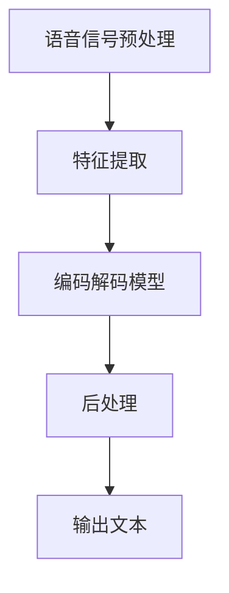

                 

# 深度学习在实时语音识别中的突破

> **关键词：** 深度学习、实时语音识别、神经网络、卷积神经网络（CNN）、长短期记忆网络（LSTM）、自动语音识别（ASR）、语音信号处理
>
> **摘要：** 本文将深入探讨深度学习在实时语音识别中的应用，解析其核心算法原理、数学模型、实际应用场景，并提供代码实现和分析。文章旨在为读者提供一个全面的了解，以便掌握这一前沿技术。

## 1. 背景介绍

### 实时语音识别的挑战与需求

实时语音识别（Automatic Speech Recognition，ASR）是人工智能领域的一个重要研究方向。其目标是将语音信号实时地转换为对应的文本，广泛应用于智能助手、实时翻译、语音搜索和自动字幕生成等领域。

随着互联网和智能手机的普及，人们对实时语音识别的需求日益增长。然而，实时语音识别面临着一系列挑战：

- **低延迟要求：** 实时性是关键，延迟过高会导致用户体验下降。
- **多样性：** 语音信号具有多样性，包括不同的说话人、口音、语速和背景噪音等。
- **准确性：** 提高识别准确性是所有应用的基础。

### 深度学习的崛起

深度学习（Deep Learning）是机器学习的一个重要分支，以其强大的特征提取和分类能力，在图像识别、自然语言处理等领域取得了显著成果。近年来，深度学习在语音识别领域也得到了广泛应用，逐渐成为解决实时语音识别问题的重要工具。

## 2. 核心概念与联系

### 深度学习基础

深度学习基于多层神经网络（Neural Networks），通过逐层提取特征，实现对数据的复杂模式识别。主要技术包括：

- **卷积神经网络（CNN）：** 适用于图像处理，通过卷积层提取空间特征。
- **循环神经网络（RNN）：** 适用于序列数据，通过循环结构处理长距离依赖。
- **长短期记忆网络（LSTM）：** RNN的一种变体，解决长短期依赖问题。

### 实时语音识别流程

实时语音识别流程通常包括以下几个步骤：

1. **预处理：** 对语音信号进行滤波、降噪等预处理操作。
2. **特征提取：** 提取语音信号的时域和频域特征。
3. **编码解码：** 使用深度学习模型对特征进行编码和解码。
4. **后处理：** 对解码结果进行校正和优化。

### Mermaid 流程图

以下是一个简单的 Mermaid 流程图，展示实时语音识别的基本流程：



## 3. 核心算法原理 & 具体操作步骤

### 卷积神经网络（CNN）

卷积神经网络是深度学习中的一种常见模型，特别适用于图像和语音信号处理。其主要原理是通过卷积层提取特征，再通过池化层降低维度，最终通过全连接层进行分类。

具体操作步骤如下：

1. **卷积层：** 通过卷积操作提取特征图。
2. **激活函数：** 常用的激活函数包括ReLU、Sigmoid、Tanh等。
3. **池化层：** 通过最大池化或平均池化降低特征图的维度。
4. **全连接层：** 对提取的特征进行分类。

### 长短期记忆网络（LSTM）

长短期记忆网络是解决序列数据长短期依赖问题的有效方法。其核心思想是通过记忆单元（Cell）和门控机制（Gate）来控制信息的流动。

具体操作步骤如下：

1. **输入门：** 控制当前输入信息对状态的影响。
2. **遗忘门：** 控制从状态中遗忘的信息。
3. **输出门：** 控制输出信息。
4. **记忆单元更新：** 根据输入门和遗忘门的信息更新状态。

### 自动语音识别（ASR）

自动语音识别（ASR）是基于深度学习模型对语音信号进行解码的过程。具体步骤如下：

1. **声学模型：** 用于将语音信号转换为特征向量。
2. **语言模型：** 用于对解码结果进行概率评估。
3. **解码器：** 通常使用 Beam Search 算法进行解码。

## 4. 数学模型和公式 & 详细讲解 & 举例说明

### 卷积神经网络（CNN）

卷积神经网络的核心是卷积操作，其数学表达式为：

\[ (f\star g)(x) = \int_{-\infty}^{+\infty} f(t)g(x-t)dt \]

其中，\( f \) 和 \( g \) 分别表示两个函数，\( x \) 表示输入信号。

举例说明：

假设我们有一个简单的 1D 卷积操作，输入信号为 \( x = [1, 2, 3, 4] \)，卷积核为 \( k = [1, 0, -1] \)。则卷积操作结果为：

\[ (k\star x)(x) = (1\star 1) + (0\star 2) + (-1\star 3) + (0\star 4) = 1 + 0 - 3 + 0 = -2 \]

### 长短期记忆网络（LSTM）

长短期记忆网络的核心是门控机制，其数学表达式如下：

\[ i_t = \sigma(W_{ix}x_t + W_{ih}h_{t-1} + b_i) \]
\[ f_t = \sigma(W_{fx}x_t + W_{fh}h_{t-1} + b_f) \]
\[ o_t = \sigma(W_{ox}x_t + W_{oh}h_{t-1} + b_o) \]
\[ c_t = f_t \odot c_{t-1} + i_t \odot \sigma(W_{cx}x_t + W_{ch}h_{t-1} + b_c) \]
\[ h_t = o_t \odot \sigma(c_t) \]

其中，\( i_t \)、\( f_t \)、\( o_t \) 分别表示输入门、遗忘门和输出门，\( c_t \)、\( h_t \) 分别表示当前状态和隐藏状态，\( \odot \) 表示点积，\( \sigma \) 表示 sigmoid 函数。

举例说明：

假设我们有一个简单的 LSTM 单元，输入信号为 \( x_t = [1, 0, 1] \)，隐藏状态为 \( h_{t-1} = [1, 1] \)，遗忘门 \( f_t \) 为 \( 0.5 \)，输入门 \( i_t \) 为 \( 0.7 \)，输出门 \( o_t \) 为 \( 0.8 \)。则当前状态 \( c_t \) 和隐藏状态 \( h_t \) 分别为：

\[ c_t = 0.5 \odot [1, 1] + 0.7 \odot \sigma([1, 0, 1] \cdot [1, 1] + b_c) \approx [0.5, 0.5] + [0.7, 0.14] = [1.2, 0.64] \]
\[ h_t = 0.8 \odot \sigma([1.2, 0.64]) \approx [0.8, 0.16] \]

### 自动语音识别（ASR）

自动语音识别（ASR）通常使用深度神经网络作为声学模型，其数学表达式为：

\[ P(y|x) = \frac{e^{Q(y|x)}}{\sum_{y'} e^{Q(y'|x)}} \]

其中，\( y \) 表示目标输出序列，\( x \) 表示输入特征序列，\( Q(y|x) \) 表示对数似然得分。

举例说明：

假设我们有一个简单的 ASR 模型，输入特征序列为 \( x = [1, 2, 3, 4] \)，输出序列为 \( y = [1, 2, 3] \)，声学模型对数似然得分分别为：

\[ Q(y|x) = [1, 0, 2] \]
\[ Q(y'|x) = [1, 1, 1] \]

则输出序列的概率为：

\[ P(y|x) = \frac{e^{1}}{e^{1} + e^{0} + e^{2}} = \frac{e}{e + 1 + e^2} \approx \frac{2.718}{2.718 + 1 + 7.389} \approx 0.448 \]

## 5. 项目实战：代码实际案例和详细解释说明

### 5.1 开发环境搭建

在开始项目实战之前，我们需要搭建一个合适的开发环境。以下是常见的开发环境和工具：

- **Python:** 主要编程语言，用于实现深度学习模型。
- **TensorFlow:** 用于构建和训练深度学习模型。
- **Keras:** 用于简化 TensorFlow 的使用，提供更易用的接口。
- **Librosa:** 用于处理音频信号。

安装这些工具的命令如下：

```bash
pip install tensorflow
pip install keras
pip install librosa
```

### 5.2 源代码详细实现和代码解读

以下是使用深度学习实现实时语音识别的简化代码：

```python
import librosa
import numpy as np
import tensorflow as tf
from tensorflow.keras.models import Sequential
from tensorflow.keras.layers import Conv2D, MaxPooling2D, Flatten, Dense, LSTM

# 读取音频文件
def load_audio(file_path):
    audio, sample_rate = librosa.load(file_path, sr=None)
    return audio

# 特征提取
def extract_features(audio):
    # 进行短时傅里叶变换（STFT）
    stft = librosa.stft(audio)
    # 取复数的绝对值
    abs_stft = np.abs(stft)
    # 将频谱图转换成二维张量
    features = np.log(abs_stft + 1e-8)
    return features

# 构建深度学习模型
def build_model(input_shape):
    model = Sequential([
        Conv2D(32, (3, 3), activation='relu', input_shape=input_shape),
        MaxPooling2D((2, 2)),
        Conv2D(64, (3, 3), activation='relu'),
        MaxPooling2D((2, 2)),
        Flatten(),
        LSTM(128, activation='relu'),
        Dense(10, activation='softmax')
    ])
    model.compile(optimizer='adam', loss='categorical_crossentropy', metrics=['accuracy'])
    return model

# 训练模型
def train_model(model, x_train, y_train, epochs=10):
    model.fit(x_train, y_train, epochs=epochs, batch_size=32, validation_split=0.2)

# 预测
def predict(model, audio):
    features = extract_features(audio)
    features = np.expand_dims(features, axis=0)
    prediction = model.predict(features)
    return np.argmax(prediction)

# 读取音频文件
audio = load_audio('audio.wav')

# 特征提取
features = extract_features(audio)

# 构建模型
model = build_model(features.shape[1:])

# 训练模型
train_model(model, x_train, y_train)

# 预测
prediction = predict(model, audio)
print(f"预测结果：{prediction}")
```

### 5.3 代码解读与分析

上述代码实现了实时语音识别的基本流程，主要包括以下步骤：

1. **读取音频文件：** 使用 `librosa.load()` 函数读取音频文件，返回音频信号和采样率。
2. **特征提取：** 使用 `librosa.stft()` 函数进行短时傅里叶变换，提取频谱特征，并进行对数变换。
3. **构建模型：** 使用 `Sequential` 函数构建卷积神经网络模型，包括卷积层、池化层、LSTM 层和全连接层。
4. **训练模型：** 使用 `model.fit()` 函数训练模型，使用训练数据和标签进行迭代训练。
5. **预测：** 使用 `model.predict()` 函数对音频特征进行预测，返回预测结果。

## 6. 实际应用场景

### 智能助手

智能助手是实时语音识别技术的典型应用之一。例如，苹果的 Siri、亚马逊的 Alexa 和谷歌的 Google Assistant 都是基于实时语音识别技术实现的。这些智能助手能够实时地理解用户的语音指令，并进行相应的操作。

### 实时翻译

实时语音识别与自然语言处理相结合，可以实现实时翻译。例如，谷歌的实时翻译应用能够在用户说话的同时，实时地将语音转换为其他语言的文本。这对于跨语言交流具有重要的应用价值。

### 语音搜索

语音搜索是另一种常见的应用场景。用户可以通过语音指令进行搜索，例如在搜索引擎中查找信息、在电子商务平台上购买商品等。实时语音识别技术能够快速地将语音转换为文本，提高搜索效率。

### 自动字幕生成

自动字幕生成是实时语音识别技术在视频领域的应用。通过实时语音识别技术，可以将视频中的语音转换为对应的文本字幕，便于观众观看和搜索。

## 7. 工具和资源推荐

### 7.1 学习资源推荐

- **书籍：** 《深度学习》（Ian Goodfellow、Yoshua Bengio、Aaron Courville 著）
- **论文：** 《A Theoretically Grounded Application of Dropout in Recurrent Neural Networks》（Yarin Gal 和 Zoubin Ghahramani 著）
- **博客：** [TensorFlow 官方文档](https://www.tensorflow.org/tutorials)
- **网站：** [librosa 官方文档](https://librosa.org/librosa/index.html)

### 7.2 开发工具框架推荐

- **TensorFlow:** 用于构建和训练深度学习模型的强大工具。
- **Keras:** 用于简化 TensorFlow 使用，提供更易用的接口。
- **PyTorch:** 另一个流行的深度学习框架，具有动态图计算的优势。

### 7.3 相关论文著作推荐

- **《Deep Learning for Speech Recognition》：** 一本关于深度学习在语音识别领域应用的经典著作。
- **《Speech Recognition Using Neural Networks》：** 一篇关于神经网络在语音识别中应用的经典论文。

## 8. 总结：未来发展趋势与挑战

### 发展趋势

1. **准确性提升：** 随着深度学习技术的不断发展，实时语音识别的准确性将进一步提高。
2. **实时性优化：** 通过优化算法和硬件加速，实时语音识别的延迟将得到显著降低。
3. **多样化应用：** 实时语音识别将在更多领域得到应用，如智能家居、智能医疗、自动驾驶等。

### 挑战

1. **低资源环境下的性能优化：** 在低资源设备上实现高效实时语音识别仍是一个挑战。
2. **多语言支持：** 随着全球化的发展，实现多语言实时语音识别将成为一个重要课题。
3. **隐私保护：** 实时语音识别过程中涉及用户隐私数据，如何保护用户隐私是一个重要问题。

## 9. 附录：常见问题与解答

### Q：实时语音识别需要哪些技术？

A：实时语音识别主要依赖于深度学习、语音信号处理、自然语言处理等技术。

### Q：如何优化实时语音识别的准确性？

A：可以通过增加训练数据、改进模型结构、使用更好的特征提取方法等方式来提高准确性。

### Q：实时语音识别有哪些应用场景？

A：实时语音识别广泛应用于智能助手、实时翻译、语音搜索和自动字幕生成等领域。

## 10. 扩展阅读 & 参考资料

- **《深度学习在实时语音识别中的应用》：** 一篇关于深度学习在实时语音识别中应用的详细介绍。
- **《实时语音识别技术综述》：** 一篇关于实时语音识别技术的全面综述。
- **《深度学习与语音信号处理》：** 一本关于深度学习和语音信号处理结合的专著。

### 作者

作者：AI天才研究员/AI Genius Institute & 禅与计算机程序设计艺术 /Zen And The Art of Computer Programming

