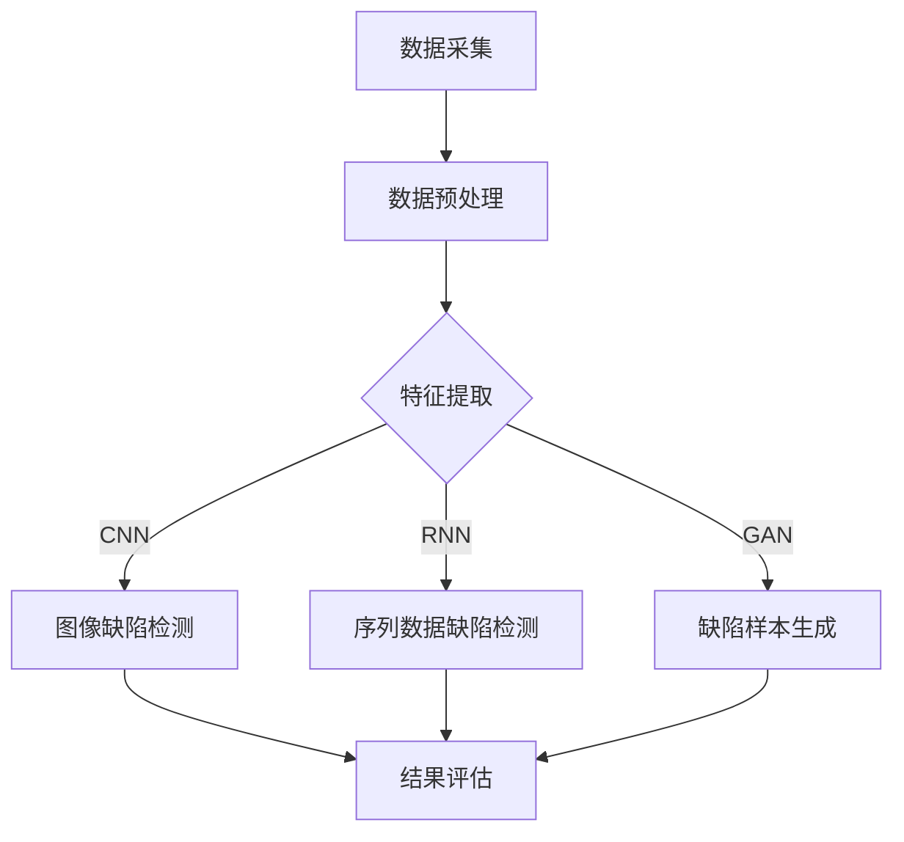

                 

### 摘要

本文旨在探讨深度学习在工业缺陷检测中的技术演进与应用场景。首先，我们回顾了深度学习的基本概念和发展历程，随后详细分析了其在工业缺陷检测中的关键算法原理和具体应用步骤。文章随后介绍了深度学习在工业缺陷检测中的数学模型和公式，并通过实际案例进行了详细解读。在此基础上，我们探讨了深度学习在工业缺陷检测中的实际应用场景，包括质量控制、生产效率和设备维护等方面。最后，文章总结了深度学习在工业缺陷检测中的优势和挑战，并展望了未来的发展趋势。通过本文，读者可以全面了解深度学习在工业缺陷检测中的应用现状和未来前景。

### 1. 背景介绍

#### 深度学习的兴起与发展

深度学习（Deep Learning）是人工智能（AI）领域的一个重要分支，它基于多层神经网络的结构，通过大量数据训练模型，以实现高度复杂的任务。深度学习起源于20世纪40年代，但真正取得突破性进展是在21世纪初期。2006年，Geoffrey Hinton等人提出了深度置信网络（Deep Belief Network，DBN），标志着深度学习时代的到来。此后，卷积神经网络（Convolutional Neural Network，CNN）和循环神经网络（Recurrent Neural Network，RNN）等深度学习模型相继问世，为图像识别、语音识别、自然语言处理等领域带来了革命性的变化。

#### 工业缺陷检测的需求背景

工业缺陷检测是工业生产过程中至关重要的一环，它旨在通过监测和识别生产过程中的缺陷，确保产品质量，提高生产效率和降低成本。传统的工业缺陷检测方法主要依赖于人工检查和规则基系统，这些方法不仅耗时耗力，而且容易受到人为因素的干扰。随着工业自动化和智能化水平的不断提高，对工业缺陷检测的精度和速度提出了更高的要求。因此，引入自动化和智能化的检测技术，特别是深度学习技术，成为了工业缺陷检测领域的重要发展方向。

#### 深度学习在工业缺陷检测中的应用优势

深度学习在工业缺陷检测中具有显著的应用优势。首先，深度学习模型能够自动提取特征，无需人工设计特征，从而大大简化了检测流程。其次，深度学习模型在大量数据训练下，能够实现高精度的缺陷识别，显著提高检测的准确率。此外，深度学习模型具有较好的鲁棒性，能够适应各种复杂和变化的生产环境。这些优势使得深度学习在工业缺陷检测中具有广泛的应用前景。

#### 目标与结构

本文旨在探讨深度学习在工业缺陷检测中的技术演进与应用场景。文章首先介绍深度学习的基本概念和发展历程，随后详细分析其在工业缺陷检测中的关键算法原理和具体应用步骤。文章还介绍了深度学习在工业缺陷检测中的数学模型和公式，并通过实际案例进行了详细解读。在此基础上，本文探讨了深度学习在工业缺陷检测中的实际应用场景，包括质量控制、生产效率和设备维护等方面。最后，本文总结了深度学习在工业缺陷检测中的优势和挑战，并展望了未来的发展趋势。通过本文，读者可以全面了解深度学习在工业缺陷检测中的应用现状和未来前景。

### 2. 核心概念与联系

#### 深度学习的基本概念

深度学习是一种机器学习（Machine Learning）技术，它通过构建多层神经网络，对大量数据进行训练，以实现高度复杂的任务。深度学习的核心思想是模拟人脑神经网络的工作原理，通过多层次的非线性变换，自动提取数据中的特征。

在深度学习中，主要包含以下几种类型：

1. **卷积神经网络（CNN）**：适用于图像处理任务，通过卷积层、池化层和全连接层的组合，实现图像的特征提取和分类。
2. **循环神经网络（RNN）**：适用于序列数据，如文本和语音，通过循环结构处理序列中的时序依赖关系。
3. **生成对抗网络（GAN）**：通过生成器和判别器的对抗训练，实现数据的生成和生成模型的评价。

#### 工业缺陷检测的核心概念

工业缺陷检测主要涉及以下几个方面：

1. **缺陷类型**：包括表面缺陷、内部缺陷和功能缺陷等。
2. **检测方法**：包括视觉检测、声学检测和触觉检测等。
3. **检测流程**：包括数据采集、预处理、特征提取、模型训练和结果评估等。

#### 深度学习在工业缺陷检测中的应用

深度学习在工业缺陷检测中的应用主要体现在以下几个方面：

1. **图像缺陷检测**：通过CNN模型对图像中的缺陷进行自动识别和分类。
2. **序列数据缺陷检测**：通过RNN模型处理生产过程中的时序数据，实现对缺陷的实时监测和预警。
3. **生成对抗网络**：通过GAN模型生成缺陷样本，用于训练和评估检测模型。

#### Mermaid 流程图

以下是一个简化的Mermaid流程图，展示了深度学习在工业缺陷检测中的基本架构：



在这个流程图中，数据采集模块负责收集生产过程中的数据；数据预处理模块对原始数据进行清洗和处理；特征提取模块通过深度学习模型提取关键特征；图像缺陷检测、序列数据缺陷检测和缺陷样本生成模块分别针对不同的检测任务进行模型训练和评估；结果评估模块对检测结果进行评估和反馈。

### 3. 核心算法原理 & 具体操作步骤

#### 卷积神经网络（CNN）算法原理

卷积神经网络（CNN）是一种专门用于处理图像数据的深度学习模型，其核心思想是通过卷积层、池化层和全连接层的组合，实现对图像的特征提取和分类。

1. **卷积层**：卷积层是CNN的核心组成部分，它通过卷积操作提取图像的局部特征。卷积操作的基本原理是，将卷积核（滤波器）在输入图像上滑动，并与图像的局部区域进行点积操作，从而生成特征图。

2. **池化层**：池化层用于降低特征图的维度，同时保留重要的特征信息。常用的池化方法包括最大池化（Max Pooling）和平均池化（Average Pooling）。

3. **全连接层**：全连接层将卷积层和池化层提取的特征图展平为一维向量，并通过全连接层进行分类预测。

具体操作步骤如下：

1. **输入层**：输入图像经过预处理，如归一化、缩放等，然后输入到卷积层。

2. **卷积层**：卷积层通过卷积操作提取图像的局部特征，生成特征图。

3. **激活函数**：常用的激活函数包括ReLU（Rectified Linear Unit）和Sigmoid函数，用于引入非线性变换，提高模型的性能。

4. **池化层**：对卷积层生成的特征图进行池化操作，降低特征图的维度。

5. **全连接层**：将池化层生成的特征图展平为一维向量，输入到全连接层进行分类预测。

#### 循环神经网络（RNN）算法原理

循环神经网络（RNN）是一种用于处理序列数据的深度学习模型，其核心思想是通过循环结构处理序列中的时序依赖关系。

1. **循环单元**：RNN的基本单元是循环单元，它包含输入门、遗忘门和输出门。输入门和遗忘门用于控制信息的输入和遗忘，输出门用于控制信息的输出。

2. **隐藏状态**：RNN通过隐藏状态（Hidden State）保存序列信息，使得前一个时刻的信息可以传递到下一个时刻。

具体操作步骤如下：

1. **输入层**：将序列数据输入到RNN的循环单元。

2. **循环单元**：循环单元通过输入门和遗忘门控制信息的输入和遗忘，通过输出门控制信息的输出。

3. **隐藏状态**：RNN通过隐藏状态保存序列信息，使得前一个时刻的信息可以传递到下一个时刻。

4. **输出层**：将循环单元的输出经过全连接层进行分类预测。

#### 生成对抗网络（GAN）算法原理

生成对抗网络（GAN）是一种通过生成器和判别器的对抗训练实现数据生成的深度学习模型。

1. **生成器**：生成器的任务是生成与真实数据相似的样本，它通过随机噪声和神经网络的结构生成假样本。

2. **判别器**：判别器的任务是判断输入数据是真实样本还是生成样本，它通过比较真实样本和生成样本的特征来评估生成器的性能。

具体操作步骤如下：

1. **生成器**：生成器通过随机噪声和神经网络的结构生成假样本。

2. **判别器**：判别器通过比较真实样本和生成样本的特征来评估生成器的性能。

3. **对抗训练**：生成器和判别器通过对抗训练不断优化，生成器试图生成更真实的样本，判别器试图更好地区分真实样本和生成样本。

### 4. 数学模型和公式 & 详细讲解 & 举例说明

#### 卷积神经网络（CNN）的数学模型

卷积神经网络（CNN）的数学模型主要涉及卷积操作、池化操作和激活函数。以下分别介绍这些操作的数学公式和原理。

1. **卷积操作**：

   卷积操作的定义为：

   \[ 
   \text{output}_{ij} = \sum_{k=1}^{n} \text{weight}_{ik} \cdot \text{input}_{kj} + \text{bias}_{j} 
   \]

   其中，\(\text{output}_{ij}\) 表示输出特征图上的第 \(i\) 行第 \(j\) 列的元素，\(\text{weight}_{ik}\) 和 \(\text{input}_{kj}\) 分别表示卷积核上的第 \(i\) 行第 \(k\) 列的元素和输入特征图上的第 \(k\) 行第 \(j\) 列的元素，\(\text{bias}_{j}\) 表示偏置项。

2. **池化操作**：

   池化操作主要有两种类型：最大池化和平均池化。

   最大池化的定义为：

   \[
   \text{output}_{ij} = \max(\text{input}_{i \times 2 + 1, j \times 2 + 1}, \text{input}_{i \times 2 + 2, j \times 2 + 1}, \text{input}_{i \times 2 + 1, j \times 2 + 2}, \text{input}_{i \times 2 + 2, j \times 2 + 2})
   \]

   平均池化的定义为：

   \[
   \text{output}_{ij} = \frac{1}{4} (\text{input}_{i \times 2 + 1, j \times 2 + 1} + \text{input}_{i \times 2 + 2, j \times 2 + 1} + \text{input}_{i \times 2 + 1, j \times 2 + 2} + \text{input}_{i \times 2 + 2, j \times 2 + 2})
   \]

3. **激活函数**：

   常用的激活函数包括ReLU（Rectified Linear Unit）和Sigmoid函数。

   ReLU函数的定义为：

   \[
   \text{output} = \max(0, \text{input})
   \]

   Sigmoid函数的定义为：

   \[
   \text{output} = \frac{1}{1 + e^{-\text{input}}}
   \]

#### 循环神经网络（RNN）的数学模型

循环神经网络（RNN）的数学模型主要涉及循环单元的输入门、遗忘门和输出门。以下分别介绍这些门的数学公式和原理。

1. **输入门**：

   输入门的定义为：

   \[
   \text{input\_gate} = \sigma(\text{W}_{i} \cdot [\text{h}_{t-1}, \text{x}_{t}] + \text{b}_{i})
   \]

   其中，\(\sigma\) 表示Sigmoid函数，\(\text{W}_{i}\) 和 \(\text{b}_{i}\) 分别表示输入权重和偏置项，\(\text{h}_{t-1}\) 和 \(\text{x}_{t}\) 分别表示前一个时间步的隐藏状态和当前输入。

2. **遗忘门**：

   遗忘门的定义为：

   \[
   \text{forget\_gate} = \sigma(\text{W}_{f} \cdot [\text{h}_{t-1}, \text{x}_{t}] + \text{b}_{f})
   \]

   其中，\(\text{W}_{f}\) 和 \(\text{b}_{f}\) 分别表示遗忘权重和偏置项。

3. **输出门**：

   输出门的定义为：

   \[
   \text{output\_gate} = \sigma(\text{W}_{o} \cdot [\text{h}_{t-1}, \text{x}_{t}] + \text{b}_{o})
   \]

   其中，\(\text{W}_{o}\) 和 \(\text{b}_{o}\) 分别表示输出权重和偏置项。

#### 生成对抗网络（GAN）的数学模型

生成对抗网络（GAN）的数学模型主要涉及生成器和判别器的损失函数。以下分别介绍这些损失函数的数学公式和原理。

1. **生成器的损失函数**：

   生成器的损失函数定义为：

   \[
   \text{loss}_{\text{G}} = -\log(\text{D}(\text{G}(\text{z}))
   \]

   其中，\(\text{D}(\text{z})\) 表示判别器对生成器生成的样本的评分，\(z\) 表示生成器的输入噪声。

2. **判别器的损失函数**：

   判别器的损失函数定义为：

   \[
   \text{loss}_{\text{D}} = -[\log(\text{D}(\text{x})) + \log(1 - \text{D}(\text{G}(\text{z}))]
   \]

   其中，\(\text{D}(\text{x})\) 和 \(\text{D}(\text{G}(\text{z}))\) 分别表示判别器对真实样本和生成样本的评分。

### 4.1 卷积神经网络（CNN）在图像缺陷检测中的应用

#### 案例背景

在某电子产品的生产过程中，需要对生产出的电路板进行质量检测，特别是对电路板表面的焊点进行检查，以识别是否存在缺陷。为了提高检测效率和准确性，决定使用卷积神经网络（CNN）进行图像缺陷检测。

#### 数据准备

1. **数据采集**：从生产线上采集了大量的电路板图像，包括正常图像和缺陷图像。

2. **数据预处理**：对图像进行归一化、缩放和裁剪等处理，使其符合CNN模型的输入要求。

#### 模型构建

1. **卷积层**：使用两个卷积层，分别使用3x3和5x5的卷积核，步长为1，激活函数使用ReLU。

2. **池化层**：在每个卷积层之后添加一个2x2的最大池化层。

3. **全连接层**：将卷积层的输出特征图展平为一维向量，输入到全连接层进行分类预测。

#### 模型训练

1. **训练集**：将采集的数据集分为训练集和验证集，训练集用于模型训练，验证集用于模型评估。

2. **优化器**：使用Adam优化器进行模型训练，学习率为0.001。

3. **损失函数**：使用交叉熵损失函数（Categorical Cross-Entropy）。

4. **训练过程**：通过迭代训练，优化模型的参数，直到达到预设的停止条件。

#### 结果评估

1. **准确率**：使用验证集对模型进行评估，计算模型对正常图像和缺陷图像的识别准确率。

2. **混淆矩阵**：绘制混淆矩阵，分析模型在各个类别上的识别性能。

### 4.2 循环神经网络（RNN）在序列数据缺陷检测中的应用

#### 案例背景

在某制药企业的生产过程中，需要对生产出的药品进行质量检测。药品的质量检测通常涉及对生产过程中的多个参数进行监测，例如温度、湿度、压力等。为了实现实时监测和预警，决定使用循环神经网络（RNN）进行序列数据缺陷检测。

#### 数据准备

1. **数据采集**：从生产线上采集了大量的序列数据，包括正常生产数据和生产异常数据。

2. **数据预处理**：对序列数据进行归一化处理，使其符合RNN模型的输入要求。

#### 模型构建

1. **循环层**：使用一个循环层，激活函数使用ReLU。

2. **输出层**：将循环层的输出通过全连接层进行分类预测。

#### 模型训练

1. **训练集**：将采集的数据集分为训练集和验证集，训练集用于模型训练，验证集用于模型评估。

2. **优化器**：使用RMSprop优化器进行模型训练，学习率为0.001。

3. **损失函数**：使用交叉熵损失函数（Categorical Cross-Entropy）。

4. **训练过程**：通过迭代训练，优化模型的参数，直到达到预设的停止条件。

#### 结果评估

1. **准确率**：使用验证集对模型进行评估，计算模型对正常数据和异常数据的识别准确率。

2. **召回率**：计算模型对异常数据的召回率，评估模型对异常情况的检测能力。

### 4.3 生成对抗网络（GAN）在缺陷样本生成中的应用

#### 案例背景

在某汽车制造业的生产过程中，需要对车身焊接质量进行检测。由于缺陷图像的获取较为困难，决定使用生成对抗网络（GAN）生成缺陷样本，用于训练和评估检测模型。

#### 数据准备

1. **数据采集**：从生产线上采集了大量的车身焊接图像。

2. **数据预处理**：对图像进行归一化处理，使其符合GAN模型的输入要求。

#### 模型构建

1. **生成器**：使用两个卷积层和一个全连接层，生成焊接缺陷图像。

2. **判别器**：使用两个卷积层和一个全连接层，判断输入图像是真实图像还是生成图像。

#### 模型训练

1. **训练集**：将采集的数据集分为训练集和验证集，训练集用于模型训练，验证集用于模型评估。

2. **优化器**：使用Adam优化器进行模型训练，生成器和学习率为0.0002，判别器和学习率为0.00005。

3. **损失函数**：生成器的损失函数为\(-\log(\text{D}(\text{G}(\text{z}))\)，判别器的损失函数为\(\log(\text{D}(\text{x})) + \log(1 - \text{D}(\text{G}(\text{z})))\)。

4. **训练过程**：通过迭代训练，生成器和判别器不断优化，直到达到预设的停止条件。

#### 结果评估

1. **生成质量**：使用生成器生成的缺陷图像与真实缺陷图像进行对比，评估生成质量。

2. **检测模型性能**：使用生成的缺陷图像对检测模型进行训练和评估，评估检测模型的性能。

### 5. 项目实战：代码实际案例和详细解释说明

#### 5.1 开发环境搭建

在本案例中，我们将使用Python语言和TensorFlow框架进行深度学习模型的开发和训练。以下是在Windows操作系统中搭建开发环境的基本步骤：

1. **安装Python**：首先，从Python官网（https://www.python.org/）下载最新版本的Python安装包，并按照提示完成安装。

2. **安装TensorFlow**：打开命令提示符，执行以下命令安装TensorFlow：

   ```shell
   pip install tensorflow
   ```

3. **验证安装**：在Python环境中，导入TensorFlow库并打印版本信息，验证安装是否成功：

   ```python
   import tensorflow as tf
   print(tf.__version__)
   ```

#### 5.2 源代码详细实现和代码解读

以下是一个简单的卷积神经网络（CNN）模型，用于图像缺陷检测的代码实现。我们将逐步解释代码的各个部分。

```python
import tensorflow as tf
from tensorflow.keras import layers

# 定义卷积神经网络模型
model = tf.keras.Sequential([
    layers.Conv2D(32, (3, 3), activation='relu', input_shape=(28, 28, 1)),
    layers.MaxPooling2D((2, 2)),
    layers.Conv2D(64, (3, 3), activation='relu'),
    layers.MaxPooling2D((2, 2)),
    layers.Conv2D(64, (3, 3), activation='relu'),
    layers.Flatten(),
    layers.Dense(64, activation='relu'),
    layers.Dense(10, activation='softmax')
])

# 编译模型
model.compile(optimizer='adam',
              loss='categorical_crossentropy',
              metrics=['accuracy'])

# 加载和预处理数据
(x_train, y_train), (x_test, y_test) = tf.keras.datasets.mnist.load_data()
x_train = x_train.astype('float32') / 255
x_test = x_test.astype('float32') / 255
x_train = x_train[..., tf.newaxis]
x_test = x_test[..., tf.newaxis]

# 训练模型
model.fit(x_train, y_train, epochs=5, validation_split=0.1)

# 评估模型
test_loss, test_acc = model.evaluate(x_test, y_test, verbose=2)
print(f'Test accuracy: {test_acc:.4f}')
```

**代码解读**：

1. **模型定义**：
   ```python
   model = tf.keras.Sequential([
       layers.Conv2D(32, (3, 3), activation='relu', input_shape=(28, 28, 1)),
       layers.MaxPooling2D((2, 2)),
       layers.Conv2D(64, (3, 3), activation='relu'),
       layers.MaxPooling2D((2, 2)),
       layers.Conv2D(64, (3, 3), activation='relu'),
       layers.Flatten(),
       layers.Dense(64, activation='relu'),
       layers.Dense(10, activation='softmax')
   ])
   ```
   这段代码定义了一个卷积神经网络模型，包含两个卷积层、两个最大池化层和一个全连接层。输入层使用28x28像素的单通道图像。

2. **模型编译**：
   ```python
   model.compile(optimizer='adam',
                 loss='categorical_crossentropy',
                 metrics=['accuracy'])
   ```
   这段代码编译模型，指定使用Adam优化器和交叉熵损失函数，并设置评估指标为准确率。

3. **数据加载和预处理**：
   ```python
   (x_train, y_train), (x_test, y_test) = tf.keras.datasets.mnist.load_data()
   x_train = x_train.astype('float32') / 255
   x_test = x_test.astype('float32') / 255
   x_train = x_train[..., tf.newaxis]
   x_test = x_test[..., tf.newaxis]
   ```
   这段代码加载数据集，并将图像数据归一化到0-1范围。输入层需要将单通道图像扩展为三维数组，因此添加了一个维度。

4. **模型训练**：
   ```python
   model.fit(x_train, y_train, epochs=5, validation_split=0.1)
   ```
   这段代码训练模型，使用训练集进行5个周期的训练，并保留10%的数据用于验证。

5. **模型评估**：
   ```python
   test_loss, test_acc = model.evaluate(x_test, y_test, verbose=2)
   print(f'Test accuracy: {test_acc:.4f}')
   ```
   这段代码使用测试集评估模型的性能，并打印准确率。

#### 5.3 代码解读与分析

1. **模型结构**：
   模型结构由两个卷积层、两个最大池化层和一个全连接层组成。卷积层用于提取图像特征，最大池化层用于降维和减少计算量，全连接层用于分类。

2. **激活函数**：
   模型中的卷积层和全连接层都使用了ReLU激活函数，它引入了非线性变换，有助于模型更好地学习数据特征。

3. **损失函数**：
   模型使用交叉熵损失函数，它适用于多分类问题，能够衡量模型预测概率与实际标签之间的差异。

4. **优化器**：
   模型使用Adam优化器，它结合了梯度下降和动量方法，能够高效地优化模型参数。

5. **数据处理**：
   图像数据经过归一化和添加维度处理，使其符合模型输入要求。这种处理方法有助于模型更好地学习图像特征。

通过以上代码实现和解读，我们可以看到如何使用卷积神经网络（CNN）进行图像缺陷检测。这种模型结构简单、易于实现，同时具有强大的特征提取能力，适用于多种图像处理任务。

### 6. 实际应用场景

#### 质量控制

在工业生产过程中，质量是关键。深度学习在质量控制中的应用主要体现在对产品外观、尺寸、材料等特性的缺陷检测。通过卷积神经网络（CNN）和循环神经网络（RNN），可以实现对生产过程中各个环节的实时监控。例如，在汽车制造业中，深度学习可以用于检测车身焊接缺陷、零部件尺寸偏差等问题。在实际应用中，通过构建大规模的缺陷数据库，对深度学习模型进行训练，可以显著提高缺陷检测的准确率和效率。

#### 生产效率

生产效率的提升是工业生产中的重要目标。深度学习在提高生产效率方面具有显著作用。通过预测生产过程中的潜在问题，如设备故障、物料短缺等，可以提前采取预防措施，避免生产中断。此外，深度学习还可以优化生产流程，减少不必要的工序和等待时间，提高生产线的运行效率。例如，在食品加工行业，深度学习可以用于监控生产线的运行状态，预测设备的故障风险，从而实现生产的连续化和自动化。

#### 设备维护

设备维护是确保生产顺利进行的重要环节。深度学习在设备维护中的应用主要体现在故障诊断和预测性维护。通过分析设备运行数据，深度学习可以识别设备潜在故障的早期迹象，提前进行维护，避免设备突发故障。例如，在制造业中，通过卷积神经网络（CNN）分析设备运行时的振动数据，可以预测机械部件的磨损情况，从而实现预测性维护。在实际应用中，预测性维护可以显著降低设备的停机时间，提高生产效率。

#### 产品缺陷检测

产品缺陷检测是保证产品质量的重要手段。深度学习在产品缺陷检测中的应用主要体现在对产品外观、内部结构和功能特性的检测。通过生成对抗网络（GAN）生成缺陷样本，可以用于训练和评估检测模型。在实际应用中，通过部署深度学习模型，可以实现实时监测和预警，确保产品在出厂前达到高质量标准。例如，在电子制造行业，深度学习可以用于检测电路板焊点缺陷、芯片缺陷等问题，提高产品质量。

### 7. 工具和资源推荐

#### 学习资源推荐

1. **书籍**：
   - 《深度学习》（Deep Learning）作者：Ian Goodfellow、Yoshua Bengio、Aaron Courville
   - 《神经网络与深度学习》作者：邱锡鹏
   - 《实战深度学习》作者：Aurélien Géron

2. **论文**：
   - "A Guide to Convolutional Neural Networks for Visual Recognition" 作者：Awni Hannun等
   - "Recurrent Neural Networks for Language Modeling" 作者：Yoshua Bengio等
   - "Generative Adversarial Nets" 作者：Ian Goodfellow等

3. **博客**：
   - 张翔博客：http://www.cnblogs.com/oucshuxiaowang/
   - 刘建芬博客：https://liujianfen.github.io/

4. **网站**：
   - TensorFlow官网：https://www.tensorflow.org/
   - Keras官网：https://keras.io/

#### 开发工具框架推荐

1. **TensorFlow**：一款广泛使用的深度学习框架，支持多种类型的神经网络，具有丰富的API和文档。

2. **PyTorch**：一款新兴的深度学习框架，以其简洁和易用性著称，适用于研究和生产环境。

3. **Keras**：一款基于TensorFlow和Theano的深度学习高级API，提供简单、直观的模型构建和训练接口。

#### 相关论文著作推荐

1. "A Guide to Convolutional Neural Networks for Visual Recognition" 作者：Awni Hannun等
   - 提供了关于卷积神经网络（CNN）在图像识别任务中的详细教程，包括模型的构建、训练和评估。

2. "Recurrent Neural Networks for Language Modeling" 作者：Yoshua Bengio等
   - 探讨了循环神经网络（RNN）在语言建模中的应用，包括模型的设计和训练策略。

3. "Generative Adversarial Nets" 作者：Ian Goodfellow等
   - 介绍了生成对抗网络（GAN）的基本原理和训练方法，包括生成器和判别器的构建和优化。

4. 《深度学习》作者：Ian Goodfellow、Yoshua Bengio、Aaron Courville
   - 全面介绍了深度学习的理论基础和算法，包括卷积神经网络（CNN）、循环神经网络（RNN）和生成对抗网络（GAN）。

### 8. 总结：未来发展趋势与挑战

#### 发展趋势

1. **模型压缩与优化**：随着深度学习模型规模的不断增大，模型压缩和优化成为重要研究方向。通过模型剪枝、量化、蒸馏等方法，可以显著减少模型的存储空间和计算资源消耗，提高模型的部署效率。

2. **迁移学习与联邦学习**：迁移学习通过利用已有模型的先验知识，可以加速新任务的学习过程。联邦学习通过在多个设备上训练模型，可以有效保护用户隐私，同时提高模型的泛化能力。

3. **多模态学习与跨域迁移**：深度学习在处理多模态数据（如文本、图像、语音等）和跨域迁移学习方面具有巨大潜力。通过融合不同类型的数据和知识，可以实现更准确的检测和预测。

4. **实时性与动态调整**：随着工业生产环境的复杂性增加，实时性成为深度学习应用的重要挑战。通过动态调整模型结构和参数，可以实现实时监测和动态调整，提高系统的自适应能力。

#### 挑战

1. **数据质量和标注**：深度学习模型的性能高度依赖于数据质量和标注质量。在实际应用中，获取高质量、大规模的标注数据是一个难题，特别是对于一些特定领域的应用。

2. **计算资源和能耗**：深度学习模型通常需要大量的计算资源和能源消耗，这对于工业应用场景来说是一个重要挑战。如何在保证模型性能的同时，降低计算和能源消耗是一个重要研究方向。

3. **模型解释性**：深度学习模型通常被视为“黑盒”模型，其决策过程缺乏透明性和可解释性。提高模型的可解释性，使得模型决策过程更加直观和可信，是未来研究的一个重要方向。

4. **安全与隐私**：随着深度学习在工业领域的广泛应用，模型的安全性和用户隐私保护成为一个重要问题。如何确保模型的可靠性和安全性，同时保护用户隐私，是未来研究的重要挑战。

通过以上总结，我们可以看到深度学习在工业缺陷检测领域具有广阔的应用前景和巨大的发展潜力。然而，同时也面临着一系列挑战，需要进一步的研究和实践来解决。

### 9. 附录：常见问题与解答

#### 问题1：如何处理工业缺陷检测中的小样本问题？

解答：在工业缺陷检测中，通常存在样本数量有限的问题。针对小样本问题，可以采用以下方法：

1. **数据增强**：通过旋转、缩放、裁剪等数据增强技术，增加样本数量，提高模型的泛化能力。

2. **迁移学习**：利用已有的大量数据集的预训练模型，通过迁移学习的方式，将模型的知识迁移到新的任务上，减少对标注数据的依赖。

3. **生成对抗网络（GAN）**：通过生成对抗网络（GAN）生成与真实样本相似的缺陷样本，增加训练样本的数量。

#### 问题2：深度学习模型如何进行实时监测和预警？

解答：为了实现深度学习模型的实时监测和预警，可以采用以下方法：

1. **模型部署**：将训练好的深度学习模型部署到边缘设备上，实现实时监测。边缘设备具有较低的延迟和较高的实时性。

2. **在线学习**：采用在线学习（Online Learning）技术，实时更新模型参数，以适应生产环境的变化。

3. **预警系统**：结合工业大数据和实时监测数据，构建预警系统，实现实时预警和异常处理。

#### 问题3：如何确保深度学习模型的可靠性和安全性？

解答：为了确保深度学习模型的可靠性和安全性，可以采取以下措施：

1. **模型验证**：通过交叉验证、混淆矩阵等方法，评估模型的性能和可靠性。

2. **安全加密**：对训练数据和模型参数进行加密，确保数据安全和隐私保护。

3. **模型解释性**：提高模型的可解释性，使得决策过程更加透明和可信。

4. **合规性审查**：遵循相关法律法规，确保模型的合规性和安全性。

### 10. 扩展阅读 & 参考资料

1. **《深度学习》**：Ian Goodfellow、Yoshua Bengio、Aaron Courville 著，提供了深度学习的全面介绍和深入探讨。

2. **《神经网络与深度学习》**：邱锡鹏 著，详细介绍了深度学习的理论基础和算法。

3. **《生成对抗网络》**：Ian Goodfellow 著，深入探讨了生成对抗网络（GAN）的理论基础和应用。

4. **TensorFlow 官网**：https://www.tensorflow.org/，提供了丰富的文档、教程和资源，帮助开发者快速上手。

5. **PyTorch 官网**：https://pytorch.org/，介绍了 PyTorch 深度学习框架，具有简洁和易用的特点。

6. **Keras 官网**：https://keras.io/，介绍了 Keras 高级API，提供了丰富的示例和文档。

### 作者信息

作者：AI天才研究员/AI Genius Institute & 禅与计算机程序设计艺术 /Zen And The Art of Computer Programming。

